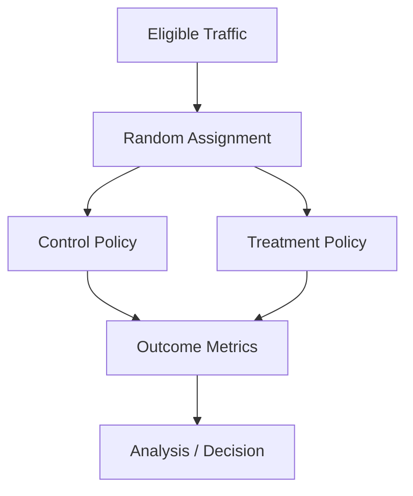

------
title: Build From Scratch Recommendations System - Part 064
description: Mendesain online experimentation dan A/B testing untuk recommendation system production-grade: hypothesis, randomization unit, assignment, exposure logging, metrics, guardrails, sample size, sequential monitoring, interference, rollout, analysis, and experiment governance.
series: learn-build-from-scratch-recommendations-system
seriesTitle: Build From Scratch: Enterprise Recommendations System
order: 64
partTitle: Online Experimentation and A/B Testing
tags:
  - recommendation-system
  - recsys
  - ab-testing
  - experimentation
  - metrics
  - causal-inference
  - series
date: 2026-07-02
---

# Part 064 — Online Experimentation and A/B Testing

Offline metrics hanya memberi sinyal.

Untuk mengetahui apakah perubahan recommendation system benar-benar meningkatkan outcome production, kita perlu online experimentation.

A/B testing menjawab pertanyaan causal:

```text
Apakah policy/model baru menyebabkan perubahan metric dibanding control?
```

Dalam recommendation system, eksperimen bisa mengubah:

- candidate source,
- ranker model,
- utility weights,
- reranking policy,
- diversity/frequency caps,
- exploration policy,
- LLM explanation,
- email/push timing,
- slate layout,
- business rules.

Eksperimen yang buruk bisa merusak user experience, mencampur traffic, melanggar policy, atau menghasilkan kesimpulan statistik palsu.

Part ini membahas online experimentation dan A/B testing production-grade: hypothesis, randomization, assignment, exposure logging, metric design, guardrails, sample size, sequential monitoring, interference, ramp-up, rollout, analysis, and governance.

---

## 1. Mental Model: Online Experiment Is Causal Infrastructure

A/B test creates comparable groups.

```text
Control: current policy
Treatment: new policy
```

Random assignment makes groups statistically similar.

If treatment metric differs, we can attribute difference to policy with assumptions.

Diagram:



Experimentation is infrastructure, not spreadsheet afterthought.

---

## 2. Experiment Hypothesis

Every experiment needs hypothesis.

Bad:

```text
Try new ranker.
```

Good:

```text
New ranker home_ranker_v13 increases home_feed CTR by 1% relative without increasing hide/report rate or latency p95.
```

Hypothesis includes:

- change,
- target surface/traffic,
- primary metric,
- expected direction/magnitude,
- guardrails,
- segments of concern.

---

## 3. Experiment Spec

Example:

```yaml
experiment_id: home_ranker_v13_ab
owner: recsys-ranking
surface: home_feed
hypothesis: home_ranker_v13 improves CTR without guardrail regressions
unit: user_id
variants:
  control:
    ranking_route: home_ranker_v12
  treatment:
    ranking_route: home_ranker_v13
traffic:
  allocation:
    control: 50
    treatment: 50
metrics:
  primary: home_feed_ctr
  guardrails:
    - hide_rate
    - report_rate
    - latency_p95
    - empty_slate_rate
duration: 14d
```

Spec should be versioned.

---

## 4. Randomization Unit

Choose unit carefully.

Options:

```text
user_id
anonymous_id
session_id
request_id
tenant_id
case_id
item_id
region/time block
```

User-level is common for personalized recommendations.

Why?

- consistent experience,
- avoids user seeing both variants,
- captures downstream behavior.

Request-level gives more power but can contaminate user experience.

---

## 5. Stable Assignment

Assignment should be deterministic.

```text
variant = hash(experiment_id, user_id) % 100
```

Same user should stay in same variant during experiment.

For anonymous users, use stable anonymous_id/session_id carefully.

Do not randomly assign every request unless experiment intentionally request-level.

---

## 6. Assignment Service

Experiment service responsibilities:

- determine eligibility,
- assign variant,
- return config overrides,
- avoid conflicting experiments,
- log assignment,
- support ramping,
- support holdouts,
- deterministic hashing,
- exposure logging.

Recommendation API should receive assignment before selecting model/policy.

---

## 7. Eligibility

Experiment eligibility:

```text
surface
region
locale
device
tenant
privacy mode
user type
traffic percentage
app version
feature compatibility
```

Example:

```yaml
eligibility:
  surface: home_feed
  region: ID
  app_version_min: 8.2.0
  privacy_mode: personalized
```

Do not include users who cannot receive treatment.

---

## 8. Exposure Logging

Assignment is not exposure.

User may be assigned but not actually experience recommendation.

Need exposure event:

```text
experiment_id
variant
request_id
surface
user_id
treatment actually applied?
model/policy version
```

Metrics should use exposed users/requests according to analysis plan.

Do not analyze based only on assignment if treatment not delivered.

---

## 9. Treatment Application Logging

Log whether treatment applied.

Example:

```json
{
  "experiment_id": "home_ranker_v13_ab",
  "variant": "treatment",
  "assigned": true,
  "applied": true,
  "ranking_route": "home_ranker_v13",
  "fallback_used": false
}
```

If fallback frequently bypasses treatment, experiment effect is diluted.

---

## 10. Primary Metric

Primary metric is main decision criterion.

Examples:

```text
CTR
conversion rate
watch completion
purchase per user
case resolution
task completion
retention
satisfaction score
```

Choose one primary metric to avoid cherry-picking.

For RecSys, primary metric should align with product objective, not only click.

---

## 11. Guardrail Metrics

Guardrails protect against harmful side effects.

Examples:

```text
hide rate
report rate
return/refund
unsubscribe
latency p95/p99
empty slate rate
policy violation
fallback rate
revenue/margin
creator/seller health
tenant error rate
```

Treatment can win primary metric but fail guardrail.

Define guardrail thresholds before experiment.

---

## 12. Secondary Metrics

Secondary metrics help interpret.

Examples:

```text
category diversity
new item exposure
source contribution
session depth
repeat rate
coverage
cold-start performance
calibration proxy
```

Secondary metrics are diagnostic, not main success criterion unless specified.

---

## 13. Unit of Analysis

Metric denominator matters.

Examples:

```text
clicks / impressions
clicks / users
purchases / users
revenue / session
hides / recommendations
latency / request
```

If randomization unit is user, analysis often should aggregate by user to avoid overweighting heavy users.

Define unit of analysis.

---

## 14. Sample Ratio Mismatch

If expected split is 50/50 but observed 60/40, something is wrong.

Causes:

- assignment bug,
- eligibility bug,
- logging bug,
- fallback/routing issue,
- app version mismatch.

Always check sample ratio mismatch before analyzing metrics.

SRM invalidates experiment.

---

## 15. Sample Size and Power

Before test:

```text
baseline metric
minimum detectable effect
variance
alpha
power
traffic allocation
duration
```

High-variance metrics need larger sample.

Small effects need longer test.

Do not stop experiment after “it looks good” without plan.

---

## 16. Minimum Detectable Effect

MDE asks:

```text
What smallest effect can we reliably detect?
```

Example:

```text
baseline CTR 5%
MDE 1% relative
```

If traffic too small, experiment cannot detect desired lift.

Low-powered experiments waste time and create false conclusions.

---

## 17. Sequential Monitoring

Looking at p-values repeatedly can inflate false positives.

If monitoring daily, use:

- pre-defined checkpoints,
- sequential testing methods,
- Bayesian monitoring,
- guardrail early stopping only,
- avoid peeking-based success.

Operational monitoring is okay; decision statistics need discipline.

---

## 18. Ramp-Up Strategy

Do not start at 50% for risky change.

Ramp:

```text
1% -> 5% -> 10% -> 25% -> 50%
```

At each stage check:

- error rate,
- latency,
- fallback,
- guardrails,
- obvious metric regressions,
- policy violations.

Ramp-up is safety mechanism.

---

## 19. Shadow Before A/B

For model/ranker changes:

1. offline evaluation,
2. shadow scoring,
3. canary,
4. A/B test,
5. rollout.

Shadow catches serving bugs before user impact.

A/B tests product effect.

---

## 20. Canary vs A/B

Canary:

```text
small traffic safety check
```

A/B:

```text
controlled causal measurement
```

A canary may not be statistically powered.

Do not claim product win from canary alone.

---

## 21. Holdout Groups

Long-term holdout:

```text
small percentage receives baseline/no personalization
```

Used to measure incremental value of recommendations.

Examples:

- email recommendation incrementality,
- personalization value,
- new module value.

Holdouts can be expensive ethically/product-wise, but valuable.

---

## 22. Interference

Recommendation experiments can affect supply/exposure.

Examples:

- treatment gives more exposure to certain sellers, control sellers lose exposure,
- marketplace inventory shared,
- creator ecosystem exposure shifts.

Simple user-level A/B assumes no interference.

For marketplace/supply systems, consider:

- cluster randomization,
- switchback,
- geo experiments,
- exposure budget analysis.

---

## 23. Switchback Experiments

Switchback alternates treatment over time.

Useful when market interference high.

Example:

```text
control for hour 1
treatment for hour 2
control for hour 3
```

Need account for time effects/seasonality.

Common in marketplaces/logistics; use carefully for RecSys.

---

## 24. Network Effects

If users interact with same content/community, treatment can affect control.

Examples:

- social feed,
- creator marketplace,
- collaborative learning platform,
- enterprise shared workflow.

May require cluster-level assignment.

---

## 25. Experiment Contamination

Contamination happens when variants mix.

Causes:

- cache key missing variant,
- user assigned differently across services,
- fallback route ignores experiment,
- client caches response,
- cross-device identity inconsistency,
- model route wrong.

Log applied treatment and validate.

---

## 26. Cache and Experiment

Cache key must include experiment variant or policy version when cached output differs.

Safer pattern:

- cache lower-level non-experiment components,
- generate final variant-specific response,
- include experiment metadata in decision logs.

Experiment contamination can invalidate results.

---

## 27. Multiple Concurrent Experiments

Experiments can interact.

Examples:

- candidate source experiment + ranker experiment,
- diversity policy + model utility weights,
- LLM explanation + ranking change.

Need:

- mutual exclusion,
- layered experiments,
- factorial design if intended,
- experiment registry.

Avoid uncontrolled interactions.

---

## 28. Metrics Windows

Define metric windows:

```text
click within session
purchase within 7d
return within 30d
retention 14d
case resolution within SLA
```

Short metrics read fast; long metrics need maturity.

Do not conclude on delayed metric before maturity.

---

## 29. Delayed Metrics

Delayed outcomes:

- purchase,
- return/refund,
- retention,
- case resolution,
- rework.

Experiment analysis should have:

- early readout,
- mature readout,
- final readout.

A treatment can win early and lose later.

---

## 30. Negative Feedback Guardrails

Track:

```text
hide
not interested
report
unsubscribe
block creator
complaint
reset recommendations
```

Negative feedback is often sparse but important.

Even small increase in report rate can be unacceptable.

---

## 31. Latency Guardrails

Recommendation changes often affect latency.

Metrics:

```text
p50/p95/p99 latency
timeout rate
fallback rate
candidate source latency
ranker latency
feature store latency
```

Treatment that improves CTR but increases p99 latency too much may fail.

---

## 32. Quality and Safety Guardrails

Guardrails:

```text
policy violation
unsafe item exposure
invalid action rate
tenant access violation
stale/banned item attempt
sponsored disclosure missing
```

These should be zero or extremely low.

Safety guardrail breach may stop experiment immediately.

---

## 33. Segment Analysis

Analyze by:

- new users,
- heavy users,
- anonymous,
- region,
- language,
- device,
- category,
- candidate source,
- item age,
- tenant,
- app version.

Predefine key segments.

Avoid post-hoc cherry-picking, but investigate unexpected harm.

---

## 34. Heterogeneous Treatment Effects

Treatment may help:

```text
new users
```

and hurt:

```text
power users
```

Decision options:

- reject global treatment,
- personalize policy,
- launch only to benefiting segment,
- revise model.

Segment analysis informs product decision.

---

## 35. Experiment Analysis Plan

Before starting:

```text
hypothesis
assignment unit
eligibility
primary metric
guardrails
secondary metrics
sample size
duration
analysis unit
outlier handling
maturity windows
decision criteria
```

Pre-register internally.

This reduces cherry-picking.

---

## 36. Outlier Handling

Metrics like revenue can be heavy-tailed.

Define:

- winsorization,
- trimming,
- user-level aggregation,
- robust variance,
- bootstrap.

Do not decide outlier handling after seeing result.

---

## 37. Variance Reduction

Methods:

- CUPED,
- pre-period covariates,
- stratified randomization,
- user-level baseline adjustment.

Useful for high-variance metrics.

Requires careful implementation.

Start simple, then add if experimentation platform mature.

---

## 38. Decision Criteria

Example:

```text
launch if:
  primary metric +0.5% relative or better with significance
  hide rate not worse than +1%
  report rate not worse
  latency p95 < threshold
  no key segment regresses >1%
```

Decision criteria should be explicit.

Sometimes business can launch with neutral primary if long-term/exposure objective improves and guardrails pass, but this should be governed.

---

## 39. Experiment Result Interpretation

Possible outcomes:

### Clear Win

Launch/ramp.

### Clear Loss

Rollback/reject.

### Neutral

Do not launch unless strategic reason.

### Mixed Segment

Consider targeted rollout.

### Guardrail Fail

Do not launch.

### Inconclusive

Need more data or better metric.

Do not overinterpret noise.

---

## 40. Rollout After Experiment

If experiment wins:

- ramp gradually,
- monitor metrics,
- keep rollback,
- update default config,
- archive experiment,
- document result,
- update model/policy registry.

Experiment success is not end; rollout can still fail due to traffic scale.

---

## 41. Long-Term Follow-Up

After rollout:

- monitor mature metrics,
- check drift,
- verify segment health,
- compare actual vs experiment result,
- watch novelty effect fade.

Some harms emerge after weeks.

---

## 42. Experiment Registry

Registry stores:

```text
experiment_id
owner
hypothesis
variants
eligibility
assignment unit
start/end
metrics
status
results
decision
links to models/policies
```

Avoid forgotten experiments running forever.

---

## 43. Experiment Lifecycle

States:

```text
draft
review
scheduled
running
paused
completed
launched
rejected
archived
```

Transitions should be controlled.

Experiment with production traffic is a deployment.

---

## 44. Experiment Governance

Governance asks:

- who can launch,
- who approves risky tests,
- what guardrails mandatory,
- how conflicts handled,
- how results recorded,
- how long tests can run,
- how holdouts managed.

For high-stakes/enterprise, governance is stricter.

---

## 45. Enterprise Experimentation

Enterprise experiments can be harder:

- fewer users,
- tenant-level constraints,
- high-stakes actions,
- long outcome windows,
- customer approval,
- audit requirements,
- role/workflow differences.

Often use:

- tenant-level pilot,
- shadow mode,
- human review,
- offline expert evaluation,
- phased rollout.

Do not randomly test risky actions without approval.

---

## 46. Email/Push Experimentation

Special considerations:

- send frequency,
- unsubscribe,
- quiet hours,
- deliverability,
- open tracking limitations,
- delayed conversion,
- user fatigue.

Assignment should often be user-level.

Holdout is useful for incrementality.

Do not over-message treatment group.

---

## 47. LLM Component Experiments

LLM experiments may test:

- explanations on/off,
- conversational flow,
- metadata enrichment,
- clarification question strategy,
- reranking summaries.

Metrics:

- task completion,
- satisfaction,
- unsupported claim rate,
- latency,
- cost,
- hallucination flags,
- fallback rate.

Guardrails include safety/faithfulness.

---

## 48. Common Failure Modes

### 48.1 No Hypothesis

Experiment becomes fishing.

### 48.2 Assignment Not Stable

Variant mixing.

### 48.3 Cache Contamination

Control sees treatment result.

### 48.4 Assignment Logged but Treatment Not Applied

Effect diluted/invalid.

### 48.5 Sample Ratio Mismatch Ignored

Invalid result.

### 48.6 Primary Metric Chosen After Seeing Result

Cherry-picking.

### 48.7 Guardrails Missing

Harm hidden.

### 48.8 Experiment Stops Too Early

False positive.

### 48.9 Global Win Hides Segment Harm

Bad rollout.

### 48.10 Long-Term Metric Ignored

Short-term proxy trap.

---

## 49. Implementation Sketch: Experiment Assignment

```java
public interface ExperimentService {
    ExperimentAssignments assign(ExperimentRequest request);
}

public record ExperimentRequest(
    String requestId,
    String assignmentUnitId,
    String surface,
    String region,
    String tenantId,
    Map<String, String> context
) {}

public record ExperimentAssignment(
    String experimentId,
    String variant,
    boolean eligible,
    Map<String, String> configOverrides
) {}
```

Assignment must be deterministic and logged.

---

## 50. Implementation Sketch: Hash Assignment

```java
public final class HashAssigner {
    public String assign(String experimentId, String unitId, Map<String, Integer> allocation) {
        int bucket = Math.floorMod(hash(experimentId + ":" + unitId), 10000);

        int cumulative = 0;
        for (Map.Entry<String, Integer> entry : allocation.entrySet()) {
            cumulative += entry.getValue(); // basis points
            if (bucket < cumulative) {
                return entry.getKey();
            }
        }

        return "not_in_experiment";
    }

    private int hash(String value) {
        return value.hashCode();
    }
}
```

Production should use stable cross-language hash, not Java `hashCode` if assignments must be shared across systems.

---

## 51. Implementation Sketch: Exposure Log

```java
public record ExperimentExposureLog(
    String requestId,
    String userId,
    String surface,
    String experimentId,
    String variant,
    boolean treatmentApplied,
    String appliedModelVersion,
    String appliedPolicyVersion,
    Instant exposureTime
) {}
```

Exposure log is required for trustworthy analysis.

---

## 52. Minimal Production A/B Testing Plan

Start with:

```yaml
experiment_platform:
  deterministic_assignment: true
  assignment_unit: user_id
  exposure_logging: true
  experiment_registry: true
recommendation_integration:
  config_overrides: model_route_candidate_policy_slate_policy
  applied_treatment_logging: true
  cache_variant_isolation: true
metrics:
  primary_metric: required
  guardrails:
    - hide_rate
    - report_rate
    - latency_p95
    - fallback_rate
    - empty_slate_rate
analysis:
  sample_ratio_mismatch_check: true
  user_level_aggregation: true
  segment_analysis: true
rollout:
  shadow_then_canary_then_ab: true
  ramp_strategy: true
  rollback: true
```

Then add variance reduction, long-term holdouts, and switchback as maturity grows.

---

## 53. Checklist Online Experimentation Readiness

```text
[ ] Experiment hypothesis is written.
[ ] Primary metric is defined before launch.
[ ] Guardrails are defined before launch.
[ ] Randomization unit is appropriate.
[ ] Assignment is deterministic.
[ ] Eligibility criteria are explicit.
[ ] Exposure logging exists.
[ ] Treatment-applied logging exists.
[ ] Cache keys isolate experiment variants.
[ ] Sample ratio mismatch is checked.
[ ] Sample size/MDE/duration are estimated.
[ ] Sequential monitoring rules are defined.
[ ] Segment analysis is preplanned.
[ ] Delayed metric maturity is handled.
[ ] Fallback/treatment bypass is measured.
[ ] Concurrent experiment conflicts are managed.
[ ] Ramp-up and rollback plan exist.
[ ] Experiment registry records status/result/decision.
[ ] High-risk experiments require approval.
```

---

## 54. Kesimpulan

Online experimentation adalah cara utama membuktikan efek recommendation system di production.

Prinsip utama:

1. A/B testing is causal infrastructure.
2. Every experiment needs hypothesis, primary metric, guardrails, and decision criteria.
3. Assignment unit must match product and interference risk.
4. Assignment must be deterministic and exposure must be logged.
5. Treatment-applied logging is necessary because fallback can bypass treatment.
6. Sample ratio mismatch must be checked.
7. Guardrails protect trust, safety, latency, and ecosystem health.
8. Segment analysis prevents global averages from hiding harm.
9. Sequential peeking and cherry-picking create false conclusions.
10. Launch should follow shadow/canary/A-B/ramp workflow with rollback.

Di Part 065, kita akan membahas **Counterfactual and Off-Policy Evaluation**: bagaimana mengevaluasi policy baru dari logged data dengan propensity, IPS, doubly robust ideas, support/overlap, and practical limitations.
