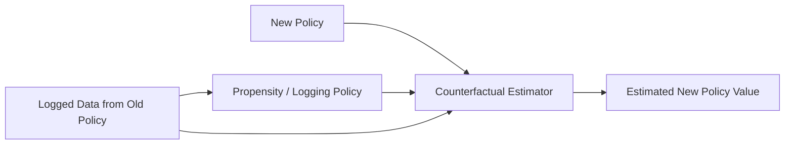

------
title: Build From Scratch Recommendations System - Part 065
description: Mendesain counterfactual dan off-policy evaluation untuk recommendation system production-grade: logged policy, propensity, support/overlap, IPS, SNIPS, doubly robust intuition, slate OPE, variance, bias, diagnostics, and practical rollout.
series: learn-build-from-scratch-recommendations-system
seriesTitle: Build From Scratch: Enterprise Recommendations System
order: 65
partTitle: Counterfactual and Off-Policy Evaluation
tags:
  - recommendation-system
  - recsys
  - counterfactual-evaluation
  - off-policy-evaluation
  - causal-inference
  - experimentation
  - series
date: 2026-07-02
---

# Part 065 — Counterfactual and Off-Policy Evaluation

Online A/B testing adalah gold standard untuk membuktikan efek policy baru.

Tetapi A/B test mahal, lambat, dan berisiko.

Sebelum mengirim traffic production ke policy baru, kita ingin bertanya:

```text
Berdasarkan logged data dari policy lama, kira-kira bagaimana performa policy baru?
```

Ini disebut **off-policy evaluation** atau **counterfactual evaluation**.

Masalahnya: logged data hanya berisi outcome untuk action/item/slate yang benar-benar ditampilkan oleh policy lama.

Kita tidak tahu outcome untuk action alternatif yang tidak ditampilkan.

Counterfactual evaluation mencoba memperkirakan hasil policy baru menggunakan data lama dengan bantuan:

- logged policy,
- propensity,
- randomization/exploration,
- support/overlap,
- importance weighting,
- reward models,
- diagnostics,
- variance control.

Part ini membahas counterfactual dan off-policy evaluation production-grade untuk recommendation system: konsep, IPS/SNIPS, doubly robust intuition, support problem, slate complexity, diagnostics, logging requirements, limitations, and practical rollout.

---

## 1. Mental Model: OPE Estimates “What If We Had Used Another Policy?”

Historical data:

```text
context x
old policy chose action a
reward r observed
```

Question:

```text
What would reward have been if new policy chose action a'?
```

If `a' != a`, reward is unobserved.

Off-policy evaluation uses logged events where new policy would have taken the same/similar action as old policy, weighted by selection probabilities.



OPE is not magic. It requires good logging and overlap.

---

## 2. Key Terms

### Context

Request/user/session/surface state.

```text
x
```

### Action

Item, candidate, source, module, slot decision, or slate.

```text
a
```

### Reward

Observed outcome.

```text
click, purchase, hide, report, utility
```

### Logging Policy

Old policy that generated data.

```text
pi_0(a | x)
```

### Target Policy

New policy we want to evaluate.

```text
pi_1(a | x)
```

### Propensity

Probability logging policy chose action.

```text
p = pi_0(a | x)
```

---

## 3. Why Propensity Is Required

If old policy chose item A with probability 0.9, reward from A is common.

If old policy chose item B with probability 0.01, reward from B is rare and more informative about exploration.

Importance weighting corrects for unequal sampling.

Without propensity, we cannot know whether action was shown because:

- model was confident,
- random exploration,
- business rule,
- position bias,
- deterministic default.

OPE without propensity is often unreliable.

---

## 4. Logging Requirements

For OPE, log:

```text
context features used by policy
candidate/action set
chosen action/slate
reward/outcome
logging policy version
propensity of chosen action
randomization seed
position
experiment/exploration policy
model/policy versions
eligibility constraints
```

For slate recommendations, also log:

```text
per-slot propensities if available
slate probability or approximation
candidate set order
```

If logging does not include candidate set and propensity, OPE will be weak.

---

## 5. Support / Overlap

OPE needs overlap.

If target policy chooses action never chosen by logging policy:

```text
pi_0(a | x) = 0
```

then no logged reward exists.

Estimator cannot know reward.

This is called support problem.

Practical implication:

```text
exploration creates support
```

Without exploration, OPE cannot evaluate radically different policies.

---

## 6. Deterministic Logging Policy Problem

If old policy always shows top item deterministically:

```text
pi_0(top_item | x) = 1
pi_0(other_items | x) = 0
```

Then OPE can only evaluate policies choosing same top item.

This is why production systems add controlled randomization/exploration.

Even small exploration budget improves future evaluation.

---

## 7. Policy Value

Policy value:

```text
V(pi) = E[reward when actions are chosen by pi]
```

In recommendation:

```text
expected click
expected utility
expected purchase
expected satisfaction
expected case success
```

OPE estimates `V(pi_1)` using data generated by `pi_0`.

---

## 8. Direct Method

Direct Method trains reward model:

```text
r_hat(x, a) = predicted reward
```

Then estimates:

```text
V(pi_1) = average r_hat(x, pi_1(x))
```

Pros:

- low variance,
- can score unchosen actions if features available.

Cons:

- biased if reward model wrong,
- inherits logged data bias,
- cannot fully solve no-support problem.

This is similar to offline model evaluation.

---

## 9. Inverse Propensity Scoring

IPS estimator:

```text
IPS = mean( reward_i * pi_1(a_i | x_i) / pi_0(a_i | x_i) )
```

If target policy would likely choose logged action, weight high.

If target policy would not choose logged action, weight low/zero.

IPS can be unbiased under assumptions, but high variance.

---

## 10. IPS Intuition

Example:

```text
old policy showed item A with p=0.1
new policy would show item A with p=0.5
reward=1
weight=0.5/0.1=5
```

This logged reward counts more because target policy would choose it more often than old policy.

If p is tiny, weight becomes huge.

That creates variance.

---

## 11. Propensity Clipping

To reduce variance, clip weights.

```text
weight = min(pi_1 / pi_0, max_weight)
```

Example:

```text
max_weight = 10
```

Pros:

- lower variance.

Cons:

- introduces bias.

Use diagnostics to show clipped fraction.

Do not hide clipping.

---

## 12. Self-Normalized IPS

SNIPS:

```text
SNIPS = sum(w_i * r_i) / sum(w_i)
```

where:

```text
w_i = pi_1(a_i|x_i) / pi_0(a_i|x_i)
```

Pros:

- lower variance,
- stable scale.

Cons:

- biased but often practical.

Common in production OPE.

---

## 13. Doubly Robust Intuition

Doubly Robust combines:

- reward model,
- propensity weighting.

Idea:

```text
estimate reward using model
then correct using logged residual weighted by propensity
```

If either reward model or propensity model is correct, estimator can perform better under assumptions.

Practical value:

- lower variance than IPS,
- less biased than direct method if propensities good.

But implementation complexity and assumptions matter.

---

## 14. Reward Model for DR

Reward model predicts:

```text
r_hat(x, a)
```

Need train/evaluate reward model carefully.

If reward model is trained on same biased data, it may be wrong for underexplored actions.

Use exploration data and calibration.

DR does not magically fix missing support.

---

## 15. Slate OPE Complexity

Recommendation often chooses slate:

```text
[a1, a2, a3, ..., ak]
```

Reward depends on:

- positions,
- item interactions,
- diversity,
- user attention,
- substitution effects.

Slate probability can be tiny:

```text
pi(slate | context)
```

Exact slate IPS has huge variance.

Practical systems often evaluate simpler action units:

- slot-level,
- top item,
- module selection,
- candidate source selection,
- limited slate policy variants.

---

## 16. Position Propensity

For item at position:

```text
pi(item, position | context)
```

Click reward is position-biased.

If old policy randomized item positions, position propensity helps debias.

Without position randomization, click-based OPE remains biased.

Log position and examination-related signals.

---

## 17. Slot-Level OPE

Evaluate each slot separately.

For slot `j`:

```text
action = item chosen for slot j
reward = click/purchase attributable to slot j
propensity = probability item chosen at slot j
```

This simplifies but ignores slate interactions.

Useful for early analysis.

---

## 18. Module-Level OPE

If page has modules:

```text
Trending
Because you viewed
New arrivals
Recommended for your role
```

Evaluate module policy.

Action:

```text
which module shown in slot
```

Reward:

```text
module click/conversion
```

Propensity easier than item-level slate.

Module-level experiments/OPE are practical.

---

## 19. Candidate Source OPE

Evaluate source allocation.

Action:

```text
candidate source quota/allocation
```

Reward:

```text
downstream engagement from source candidates
```

Useful when testing source mix.

Need source provenance and exposure logging.

---

## 20. Counterfactual Replay

Counterfactual replay runs new policy on historical contexts.

Procedure:

1. Take logged request contexts.
2. Reconstruct candidate set/features as-of time.
3. Run new policy.
4. Compare chosen items with logged shown items.
5. Use observed rewards only where overlap exists.
6. Compute OPE/diagnostics.

Replay also reveals support gap.

---

## 21. Support Diagnostics

Measure:

```text
target_action_covered_rate
average_logging_propensity
min_propensity
weight_distribution
effective_sample_size
fraction_weight_clipped
candidate_overlap
segment_overlap
```

If support poor, OPE estimate unreliable.

Report support diagnostics with metric.

---

## 22. Effective Sample Size

Importance weights reduce effective sample size.

A rough ESS:

```text
ESS = (sum w)^2 / sum(w^2)
```

If logged data has 1M rows but ESS is 2K, estimate is noisy.

ESS should be reported.

---

## 23. Weight Distribution

Inspect:

```text
p50 weight
p95 weight
p99 weight
max weight
```

Huge weights mean high variance.

If a few examples dominate, OPE unreliable.

Use clipping, better exploration, or do online test.

---

## 24. Reward Maturity

OPE reward must be mature.

If evaluating purchase_7d, wait 7 days.

If using return_30d, wait 30 days.

Immature labels bias reward down.

Same issue as offline evaluation.

---

## 25. Multiple Rewards

Estimate separate rewards:

```text
click
purchase
hide
report
retention
```

Do not only estimate primary reward.

Target policy might improve click and worsen report.

Use OPE for guardrails too, if support/reward quality allows.

---

## 26. OPE for Exploration Policies

For contextual bandit policies, OPE is central.

If logging policy randomized with known propensity, you can evaluate alternative policies offline before online ramp.

Bandit logs should include:

- action set,
- chosen action,
- propensity,
- reward,
- context.

Without this, bandit learning/evaluation is compromised.

---

## 27. OPE for Ranking Model Changes

If new ranker mostly reorders same displayed candidate pool, OPE may help.

If new ranker chooses very different candidates, support weak.

For ranker changes:

- compare overlap with logged slates,
- use logged candidate pool if available,
- evaluate top-K overlap and supported reward,
- then A/B test.

OPE screens, not replaces online test.

---

## 28. OPE for Business Rule Changes

New rule may reject candidates.

OPE can simulate:

```text
how often rule would remove shown item
reward of removed items
replacement availability
segment impact
```

But if replacement items were not shown, their reward unknown.

Use OPE to estimate risk and candidate loss, not full outcome.

---

## 29. OPE for Reranking/Diversity

Diversity policy may choose items historically not shown.

Support often weak.

Offline replay can measure:

- predicted utility,
- overlap with logged items,
- diversity metrics,
- supported reward.

But online A/B needed.

---

## 30. Bias Sources

OPE assumptions can fail due to:

- wrong propensity,
- unlogged policy decision,
- hidden eligibility filters,
- position bias,
- unobserved confounders,
- policy changes during logging,
- nonstationarity,
- interference,
- reward attribution errors.

OPE result should include limitations.

---

## 31. Propensity Accuracy

If logged propensity wrong, IPS/SNIPS wrong.

Common errors:

- does not account for filtering,
- ignores slot constraints,
- ignores fallback,
- ignores deterministic business rule,
- wrong candidate set size,
- reused cached response,
- treatment not applied but logged as applied.

Validate propensity logging.

---

## 32. Logging Policy Versioning

Policy version must be logged.

If data spans multiple policy versions:

```text
pi_0 is not one policy
```

Estimator must use correct propensity per event.

Group/stratify by logging policy version.

---

## 33. Nonstationarity

User/item behavior changes over time.

Logged data from last month may not represent today.

Use recent windows and compare across windows.

OPE is more reliable when environment stable.

---

## 34. Interference

If target policy changes exposure ecosystem, logged individual rewards may not estimate new equilibrium.

Examples:

- marketplace seller exposure,
- creator supply,
- social feed interactions.

OPE usually assumes no interference.

For marketplace changes, use experiments.

---

## 35. OPE Output Report

Report should include:

```text
target policy version
logging policy versions
data window
reward definition
estimator type
estimated value
confidence interval/uncertainty
support diagnostics
weight diagnostics
clipping settings
segment results
limitations
recommendation
```

Never present OPE metric without diagnostics.

---

## 36. Confidence Intervals

Use:

- bootstrap,
- asymptotic variance,
- user-level clustering if unit is user.

Importance weighted estimators can have heavy tails.

Confidence intervals may be wide.

If CI wide, OPE not decisive.

---

## 37. User-Level Aggregation

If randomization/logging unit is user, aggregate by user to avoid overweighting heavy users.

For OPE, clustering by user may be needed.

High-activity users can dominate event-level estimates.

---

## 38. Segment OPE

Estimate by segment:

- new users,
- regions,
- categories,
- item age,
- source,
- tenant,
- privacy mode.

Support may differ by segment.

A policy can be evaluable for warm users but not cold-start users.

---

## 39. Practical OPE Maturity Levels

### Level 0

No propensity. Only offline replay/heuristics.

### Level 1

Logged propensities for exploration slots.

### Level 2

OPE for candidate/source/module policies.

### Level 3

OPE integrated with bandit learning and experiment planning.

### Level 4

Robust OPE with DR, support diagnostics, governance, and online correlation tracking.

Most teams start at Level 0/1.

---

## 40. When Not to Trust OPE

Do not trust OPE when:

```text
propensity missing/wrong
support very low
ESS tiny
weights huge
target policy radically different
reward immature
strong interference
logging policy unknown
candidate set missing
segment support poor
```

Use OPE as warning signal, not launch approval.

---

## 41. Relationship with A/B Testing

OPE helps decide:

```text
is policy safe/promising enough to A/B?
which variants to test?
what risks/segments to monitor?
```

A/B validates:

```text
actual causal effect in production
```

OPE reduces risk and cost, but does not replace online experiments.

---

## 42. Minimal Logging for Future OPE

Add now:

```text
request_id
context
candidate set sample/full
shown items
position
logging policy id/version
propensity if randomized
experiment assignment
source provenance
reward linkage
```

Even if you don't implement OPE now, logging enables future evaluation.

---

## 43. Practical Example: Exploration Slot OPE

Logged policy:

```text
slot 5 explores one item from exploration pool with epsilon=0.05
chosen uniformly from pool of size n
```

Propensity:

```text
epsilon * 1/n
```

Target policy:

```text
choose item with highest UCB score
```

OPE uses logged events where target policy would choose logged item, weighted by probability ratio.

If target policy chooses unseen items mostly, support low.

---

## 44. Practical Example: Source Allocation

Logged source mix:

```text
two_tower 60%
content 20%
trending 20%
```

Target:

```text
two_tower 50%
content 30%
trending 20%
```

If source allocation randomized and propensity logged, OPE can estimate effect.

If not randomized, only replay source contribution.

---

## 45. Common Failure Modes

### 45.1 No Propensity

IPS impossible.

### 45.2 Wrong Propensity

False confidence.

### 45.3 No Support

Target policy unevaluable.

### 45.4 Huge Weights

High variance.

### 45.5 No Reward Maturity

Delayed reward underestimated.

### 45.6 Slate Probability Ignored

Item-level estimate overconfident.

### 45.7 Fallback Not Logged

Policy mismatch.

### 45.8 Cached Response Breaks Propensity

Logged probability wrong.

### 45.9 Segment Support Ignored

Launch hurts under-supported segment.

### 45.10 OPE Treated as Final Proof

Online experiment fails.

---

## 46. Implementation Sketch: Logged Bandit Event

```java
public record LoggedBanditEvent(
    String requestId,
    String userId,
    String surface,
    String policyId,
    String policyVersion,
    String actionId,
    int position,
    double loggingPropensity,
    List<String> eligibleActionIds,
    Instant decisionTime,
    Reward reward
) {}

public record Reward(
    double value,
    String rewardType,
    Instant maturedAt
) {}
```

Store action set if feasible; otherwise store enough to reconstruct.

---

## 47. Implementation Sketch: IPS Estimator

```java
public final class IpsEstimator {
    public double estimate(List<LoggedBanditEvent> logs, TargetPolicy targetPolicy) {
        double sum = 0.0;

        for (LoggedBanditEvent e : logs) {
            double targetProb = targetPolicy.probability(e.actionId(), e);
            if (e.loggingPropensity() <= 0.0) {
                continue;
            }
            double weight = targetProb / e.loggingPropensity();
            sum += weight * e.reward().value();
        }

        return sum / Math.max(logs.size(), 1);
    }
}
```

Production implementation needs clipping, diagnostics, confidence intervals, and segment analysis.

---

## 48. Implementation Sketch: SNIPS Estimator

```java
public final class SnipsEstimator {
    public double estimate(List<LoggedBanditEvent> logs, TargetPolicy targetPolicy) {
        double weightedReward = 0.0;
        double weightSum = 0.0;

        for (LoggedBanditEvent e : logs) {
            if (e.loggingPropensity() <= 0.0) {
                continue;
            }

            double targetProb = targetPolicy.probability(e.actionId(), e);
            double weight = targetProb / e.loggingPropensity();

            weightedReward += weight * e.reward().value();
            weightSum += weight;
        }

        return weightedReward / Math.max(weightSum, 1e-9);
    }
}
```

SNIPS is often more stable than raw IPS.

---

## 49. Minimal Production OPE Plan

Start with:

```yaml
logging:
  policy_version: required
  candidate_set_sample: required
  position: required
  source_provenance: required
  reward_linkage: required
  propensity_for_exploration: required
ope_scope:
  - exploration_slots
  - source_allocation
  - module_selection
estimators:
  - direct_method_baseline
  - snips_for_randomized_logs
diagnostics:
  - support_rate
  - effective_sample_size
  - weight_distribution
  - clipping_fraction
  - segment_support
reporting:
  - limitations_required
  - online_ab_still_required
```

Do not attempt full slate OPE before logging maturity.

---

## 50. Checklist Counterfactual and Off-Policy Evaluation Readiness

```text
[ ] Logging policy version is logged.
[ ] Candidate/action set is logged or reconstructable.
[ ] Chosen action/slate is logged.
[ ] Position is logged.
[ ] Reward/outcome is linked and mature.
[ ] Propensity is logged for randomized decisions.
[ ] Fallback/treatment-applied status is logged.
[ ] Support/overlap diagnostics exist.
[ ] Weight distribution and ESS are reported.
[ ] Clipping settings are explicit.
[ ] Segment OPE is reported.
[ ] Estimator assumptions are documented.
[ ] OPE reports include limitations.
[ ] OPE is used to screen, not replace, A/B tests.
```

---

## 51. Kesimpulan

Counterfactual dan off-policy evaluation membantu mengevaluasi policy baru dari logged data, tetapi hanya jika logging dan randomization memadai.

Prinsip utama:

1. OPE asks what would happen under a new policy using old logged data.
2. Propensity is essential.
3. Support/overlap determines whether policy is evaluable.
4. IPS can be unbiased but high variance.
5. SNIPS reduces variance but adds bias.
6. Doubly robust combines reward model and propensity correction.
7. Slate OPE is much harder than single-action OPE.
8. Wrong propensities produce wrong estimates.
9. OPE result must include support, weight, ESS, and limitation diagnostics.
10. OPE screens candidates for A/B testing; it does not replace online experimentation.

Di Part 066, kita akan membahas **Recommendation Observability**: bagaimana membangun observability end-to-end untuk request path, data, features, models, candidates, ranking, slate, feedback, business metrics, and debugging.
