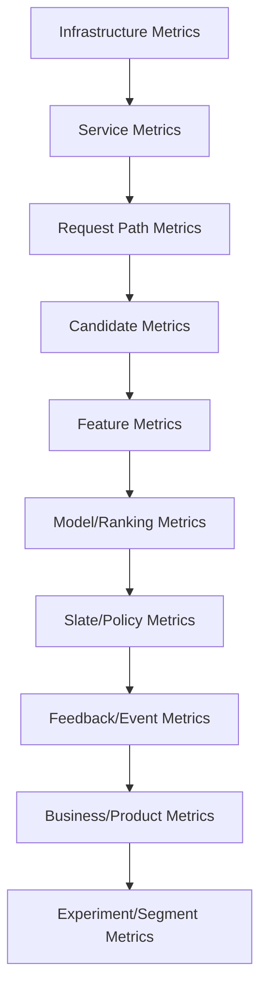

------
title: Build From Scratch Recommendations System - Part 066
description: Mendesain recommendation observability production-grade: request tracing, candidate diagnostics, ranking/model metrics, feature freshness, data quality, feedback loop monitoring, business metrics, dashboards, alerting, debug traces, replay, and incident workflows.
series: learn-build-from-scratch-recommendations-system
seriesTitle: Build From Scratch: Enterprise Recommendations System
order: 66
partTitle: Recommendation Observability
tags:
  - recommendation-system
  - recsys
  - observability
  - monitoring
  - debugging
  - mlops
  - series
date: 2026-07-02
---

# Part 066 — Recommendation Observability

Recommendation system bisa gagal tanpa error 500.

Ia bisa tetap mengembalikan response 200 tetapi:

- kandidatnya salah,
- modelnya stale,
- feature profile kosong,
- exposure cap tidak bekerja,
- feedback event hilang,
- item yang sama muncul terus,
- cold-start item tidak pernah dapat exposure,
- tenant tertentu selalu fallback,
- score distribution drift,
- ranking over-optimizes clickbait,
- LLM explanation hallucinated,
- offline pipeline rusak,
- experiment treatment tidak benar-benar applied.

Observability RecSys bukan hanya CPU, memory, QPS, latency.

Kita butuh observability untuk **decision quality**.

Part ini membahas recommendation observability production-grade: request tracing, candidate diagnostics, ranking/model metrics, feature/data freshness, feedback loop monitoring, business metrics, dashboards, alerts, debug traces, replay, and incident workflows.

---

## 1. Mental Model: Observe the Decision, Not Just the Service

Traditional service observability:

```text
is service up?
latency?
error rate?
CPU?
memory?
```

RecSys observability adds:

```text
what candidates were generated?
what was filtered and why?
what model scored?
what features were missing?
what slate constraints applied?
what did user see?
what feedback happened?
what changed after deploy?
```

Recommendation failure is often quality degradation, not outage.

---

## 2. Observability Layers



Need all layers.

---

## 3. Core Observability Pillars

### Metrics

Aggregated numeric signals.

### Logs

Structured events/decision logs.

### Traces

Per-request path across services.

### Debug Artifacts

Detailed decision explanations/replay data.

### Dashboards

Operational views.

### Alerts

Actionable anomaly detection.

RecSys needs all.

---

## 4. Request-Level Trace

Each request should have:

```text
request_id
trace_id
surface
user/tenant segment
model version
policy version
experiment variants
fallback tier
latency by stage
candidate counts by stage
final slate size
```

Trace spans:

```text
config
experiment
candidate sources
eligibility
feature fetch
ranking
reranking
response
logging
```

This helps diagnose tail latency and quality.

---

## 5. Candidate Observability

Metrics:

```text
candidate_count_by_source
unique_candidate_count
candidate_source_latency
candidate_source_error_rate
candidate_source_timeout_rate
source_overlap
dedup_rate
invalid_candidate_rate
empty_candidate_pool_rate
candidate_pool_category_distribution
candidate_pool_item_age_distribution
```

By:

- surface,
- source,
- model/policy version,
- region,
- tenant.

If candidate pool bad, ranker cannot fix it.

---

## 6. Source Contribution Funnel

Track:

```text
generated by source
survived dedup
survived eligibility
ranked top 100
appeared final slate
received impression
received click/conversion
```

Example:

| Stage | two_tower | content | trending |
|---|---:|---:|---:|
| Generated | 500K | 300K | 100K |
| Eligible | 480K | 250K | 98K |
| Final Slate | 60K | 20K | 15K |
| Clicked | 3K | 800 | 700 |

This shows source value and waste.

---

## 7. Filtering Observability

Track filter counts by reason:

```text
not_available_region
policy_banned
user_suppressed
already_seen
out_of_stock
tenant_permission_denied
frequency_cap
campaign_expired
duplicate
```

Metrics:

```text
filter_rejection_rate_by_reason
filter_rejection_rate_by_source
pool_after_filter
empty_after_filter_rate
```

A spike in one reason often indicates upstream problem.

---

## 8. Feature Observability

Feature metrics:

```text
feature_fetch_latency
feature_missing_rate
feature_missing_reason_distribution
feature_staleness
feature_default_rate
feature_value_distribution
feature_outlier_rate
feature_online_offline_skew
feature_access_denied_count
```

By feature/model/surface.

Feature observability should be per feature, not only aggregate.

---

## 9. Feature Freshness Dashboard

Dashboard:

| Feature Group | Freshness SLA | Current Age | Status |
|---|---:|---:|---|
| item_behavior | 6h | 2h | OK |
| trending_15m | 10m | 18m | BREACH |
| user_profile | 1h | 35m | OK |
| suppression | 10s | 2s | OK |

Stale feature can be worse than missing feature.

---

## 10. Feature Drift Monitoring

Monitor distributions:

```text
mean
p50/p95/p99
null rate
top values
histogram
embedding norm
categorical cardinality
```

Alert examples:

```text
user_category_affinity all zeros
item_ctr_7d p95 drops 80%
category_id unknown rate spikes
embedding norm doubles
```

Feature drift is model drift precursor.

---

## 11. Model/Ranking Observability

Metrics:

```text
model_inference_latency
model_error_rate
model_fallback_rate
score_distribution
prediction_distribution_per_task
calibration_proxy
top_score_distribution
score_component_distribution
feature_missing_by_model
model_version_traffic_share
```

By model version.

If score distribution changes after deploy, inspect.

---

## 12. Score Distribution Monitoring

Track:

```text
rank_score mean/p95/p99
p_click distribution
p_purchase distribution
p_hide distribution
utility distribution
```

Compare:

- current vs previous model,
- current vs baseline window,
- segment vs global.

Sudden shift may indicate feature/model issue.

---

## 13. Calibration Monitoring Online

True calibration needs mature labels.

But monitor:

```text
predicted probability bucket vs observed rate
```

with delay.

Example:

| Predicted Click Bucket | Observed CTR |
|---|---:|
| 0-1% | 0.8% |
| 1-3% | 2.1% |
| 3-5% | 4.0% |
| 5-10% | 7.2% |

By model version and segment.

---

## 14. Reranking/Slate Observability

Metrics:

```text
final_slate_size
duplicate_rate
category_entropy
distinct_creator_count
same_creator_max
frequency_penalty_applied_rate
diversity_penalty_applied_rate
business_rule_boost_rate
exploration_slot_fill_rate
sponsored_count
constraint_violation_rate
```

Final slate quality matters more than raw ranker score.

---

## 15. Frequency/Fatigue Observability

Metrics:

```text
repeat_item_rate
repeat_creator_rate
repeat_topic_rate
frequency_cap_hit_rate
fatigue_penalty_rate
hide_after_repeat_rate
cooldown_rejection_count
suppression_application_lag
```

If repeat rate rises, user trust may fall.

---

## 16. Fairness/Exposure Observability

Metrics:

```text
position_weighted_exposure_by_creator
exposure_gini
top_1_percent_exposure_share
new_item_time_to_first_impression
long_tail_exposure_share
creator/seller coverage
tenant/region exposure distribution
qualified_exposure_by_bucket
```

Marketplace health needs ongoing monitoring.

---

## 17. Exploration Observability

Metrics:

```text
exploration_impression_rate
exploration_slot_fill_rate
exploration_reward
exploration_negative_feedback_rate
propensity_missing_rate
exploration_guardrail_stop_count
candidate_pool_size
support/overlap diagnostics
```

Exploration without observability is uncontrolled risk.

---

## 18. LLM Component Observability

If LLM involved, monitor:

```text
llm_latency
llm_cost
prompt_version
model_version
schema_validation_failure
fallback_to_template_rate
unsupported_claim_flags
hallucination_verifier_flags
prompt_injection_flags
user_feedback_on_explanation
```

LLM quality failures may not appear as service errors.

---

## 19. Event/Feedback Observability

Events are learning loop.

Metrics:

```text
impression_event_volume
click_event_volume
conversion_event_volume
negative_feedback_volume
event_schema_error_rate
event_dedup_rate
event_lag
event_join_rate_to_impression
tracking_token_missing_rate
request_id_missing_rate
```

If feedback events break, future training breaks.

---

## 20. Decision Log Observability

Decision log metrics:

```text
decision_log_emit_success_rate
decision_log_lag
decision_log_size
missing_model_version_rate
missing_policy_version_rate
candidate_set_logged_rate
propensity_logged_rate
```

Decision logs support training, debugging, and audit.

Missing version fields are serious.

---

## 21. Data Pipeline Observability

Offline/nearline pipeline metrics:

```text
pipeline_success
input_rows
output_rows
null_rate
duplicate_rate
late_event_rate
label_rate
feature_freshness
embedding_coverage
index_build_success
model_training_success
batch_scoring_coverage
```

Online and offline observability should be connected.

---

## 22. Embedding/Index Observability

Metrics:

```text
embedding_coverage
embedding_norm_distribution
zero_vector_rate
new_item_time_to_embedding
index_age
index_recall_benchmark
vector_search_latency
empty_vector_result_rate
filter_rate
delta_index_age
delete_propagation_lag
active_index_version
```

Vector retrieval can degrade silently.

---

## 23. Precomputed Recommendation Observability

Metrics:

```text
precomputed_store_hit_rate
list_stale_rate
list_empty_rate
list_length_distribution
final_filter_rejection_rate
batch_run_success
generated_subject_count
fallback_after_precompute_rate
```

If final filter rejects many precomputed items, list generation is stale/poor.

---

## 24. Experiment Observability

Metrics:

```text
assignment_count_by_variant
exposure_count_by_variant
treatment_applied_rate
sample_ratio_mismatch
variant_latency
variant_fallback_rate
primary_metric_by_variant
guardrails_by_variant
segment_metrics_by_variant
```

Experiment observability catches contamination and routing issues.

---

## 25. Business/Product Metrics

Examples:

```text
CTR
CVR
purchase per user
revenue
watch completion
session depth
retention
hide/report
unsubscribe
case resolution
SLA success
rework
creator/seller active rate
```

Business metrics need segmentation and delay windows.

Do not only observe infra.

---

## 26. Guardrail Dashboards

Guardrails:

```text
latency p95/p99
error rate
fallback rate
empty slate rate
hide/report
policy violation
invalid item exposure
tenant access violation
event logging lag
```

Guardrails should be easy to inspect during deploy/experiment.

---

## 27. Version-Centric Observability

Every metric should be sliceable by:

```text
model_version
candidate_policy_version
slate_policy_version
rule_bundle_version
feature_set_version
index_version
experiment_variant
```

Without version tags, you cannot attribute changes.

Version tags are not optional.

---

## 28. Segment-Centric Observability

Slice by:

```text
surface
region
locale
device
user tenure
activity level
item category
item age
candidate source
tenant
privacy mode
```

Global health can hide segment failures.

---

## 29. Dashboards

Recommended dashboard groups:

1. Online serving health.
2. Candidate generation health.
3. Feature/profile health.
4. Ranking/model health.
5. Slate/reranking quality.
6. Feedback/event health.
7. Offline pipeline health.
8. Experiment health.
9. Marketplace/fairness health.
10. Business/product impact.

Dashboards should answer operational questions.

---

## 30. Alerts

Good alert is actionable.

Examples:

```text
p95 latency > SLO for 10m
fallback tier 3 rate > threshold
empty slate rate spikes
policy violation count > 0
feature group freshness breach
decision log success < 99%
impression join rate drops
ranker score distribution shifts
index empty result rate spikes
sample ratio mismatch detected
```

Avoid noisy alerts with no owner/action.

---

## 31. Alert Severity

Severity examples:

### Critical

```text
tenant data leak
policy violation
consent failure
invalid restricted item exposure
recommendation outage on major surface
```

### High

```text
ranker fallback spike
event logging loss
feature store stale critical
empty slate spike
```

### Medium

```text
candidate source degradation
non-critical feature drift
batch scoring delayed
```

### Low

```text
minor dashboard anomaly
debug sampling failure
```

Severity should match business/safety impact.

---

## 32. SLOs for RecSys

Service SLOs:

```text
availability
latency
error rate
```

Decision SLOs:

```text
fallback rate
empty slate rate
decision log completeness
feature freshness
policy violation zero
event join rate
```

Example:

```yaml
home_feed:
  availability: 99.9%
  p95_latency_ms: 200
  empty_slate_rate: <0.1%
  decision_log_success: >99.9%
  critical_policy_violation: 0
```

---

## 33. Debug Trace

Debug trace for request:

```json
{
  "request_id": "req_001",
  "surface": "home_feed",
  "candidate_sources": {...},
  "filters": {...},
  "features": {...},
  "model_scores": {...},
  "reranking": {...},
  "final_slate": [...],
  "fallback": null
}
```

Access-controlled and sampled.

Debug trace should not leak sensitive data.

---

## 34. Bad Recommendation Debugging

When user reports bad recommendation, need:

```text
request_id/slate_id
item_id
position
model version
source provenance
feature values
filter decisions
suppression state
user feedback history
policy versions
experiment variant
```

Debug path should answer:

```text
Why was this item eligible?
Why was it generated?
Why was it ranked high?
Why was it not filtered?
```

---

## 35. Replay

Replay lets you rerun decision.

Requirements:

- request context snapshot,
- candidate set,
- feature snapshot or values,
- model/policy versions,
- random seed,
- rule bundle,
- index version.

Replay supports:

- incident investigation,
- model comparison,
- audit,
- regression tests.

---

## 36. Sampling Strategy

Full decision logs can be huge.

Log levels:

```text
always log final slate and metadata
sample full candidate/feature traces
log full traces for debug requests/incidents
always log critical violations
```

Balance cost and debuggability.

---

## 37. High-Cardinality Metrics

RecSys has high cardinality:

```text
item_id
user_id
request_id
model_version
feature_name
tenant_id
```

Be careful with metrics systems.

Use:

- labels for bounded dimensions,
- logs/traces for high-cardinality IDs,
- sampled debug data,
- aggregation tables for item-level analytics.

Do not put user_id/item_id as metric label at high scale.

---

## 38. Cost Observability

Monitor cost:

```text
candidate source cost
model inference cost
feature store cost
LLM cost
vector search cost
batch scoring cost
training cost
cache hit savings
```

Cost per recommendation/conversion helps trade-offs.

High quality model may be too expensive for marginal gain.

---

## 39. Observability and Privacy

Observability data can be sensitive.

Controls:

- redaction,
- access control,
- retention,
- audit,
- tenant isolation,
- privacy classification,
- sampling,
- no raw PII in logs if avoidable.

Debug tools are powerful and risky.

---

## 40. Observability for Enterprise

Enterprise dashboards need:

- tenant-level health,
- role/permission failures,
- case action validity,
- policy version usage,
- audit log completeness,
- SLA/action outcome metrics,
- document recommendation usefulness,
- cross-tenant isolation checks.

Enterprise customers may need reports.

---

## 41. Observability for Governance

Governance metrics:

```text
policy rule impact
fairness/exposure distribution
privacy mode compliance
user control application lag
model approval/deployment history
experiment registry completeness
```

Observability is not only ops; it supports governance.

---

## 42. Incident Workflow

When alert fires:

1. Identify surface/segment.
2. Check recent deployments/config/model changes.
3. Check fallback/latency/errors.
4. Check candidate counts/source health.
5. Check feature freshness/missing.
6. Check model score distribution.
7. Check slate constraints/final filters.
8. Check event logging.
9. Rollback/disable if needed.
10. Postmortem and add tests/alerts.

Dashboards should support this workflow.

---

## 43. Change Correlation

Correlate metrics with:

```text
code deploy
model deploy
rule bundle change
feature pipeline change
index publish
experiment ramp
config change
catalog event spike
```

Timeline view is extremely valuable.

Many incidents are caused by “small config changes”.

---

## 44. Golden Signals for RecSys

Classic golden signals:

```text
latency
traffic
errors
saturation
```

RecSys golden signals:

```text
candidate pool health
feature freshness/missing
model score distribution
fallback/empty slate
event feedback completeness
negative feedback
policy violations
```

Use both.

---

## 45. Common Failure Modes

### 45.1 Only Infra Monitoring

Quality failures missed.

### 45.2 No Version Tags

Cannot attribute regression.

### 45.3 No Candidate Diagnostics

Ranker blamed for retrieval bug.

### 45.4 No Feature Freshness Alerts

Stale features silently degrade model.

### 45.5 No Event Join Monitoring

Training labels break.

### 45.6 No Segment Dashboards

Small region/tenant broken.

### 45.7 Debug Logs Leak Data

Privacy incident.

### 45.8 Alerts Too Noisy

Engineers ignore them.

### 45.9 No Replay

Bad recommendation not reproducible.

### 45.10 No Change Timeline

Root cause slow.

---

## 46. Implementation Sketch: Request Diagnostics

```java
public record RecommendationDiagnostics(
    String requestId,
    String traceId,
    String surface,
    String modelVersion,
    String candidatePolicyVersion,
    String slatePolicyVersion,
    String ruleBundleVersion,
    Map<String, CandidateSourceDiagnostics> sourceDiagnostics,
    FilterDiagnostics filterDiagnostics,
    FeatureDiagnostics featureDiagnostics,
    RankingDiagnostics rankingDiagnostics,
    SlateDiagnostics slateDiagnostics,
    Optional<FallbackDiagnostics> fallback
) {}
```

Structured diagnostics enable logging and debugging.

---

## 47. Implementation Sketch: Candidate Source Metrics

```java
public record CandidateSourceDiagnostics(
    String sourceName,
    String sourceVersion,
    int generatedCount,
    int eligibleCount,
    int finalSlateCount,
    Duration latency,
    boolean timeout,
    boolean error,
    String errorCode
) {}
```

Aggregate these into dashboards.

---

## 48. Implementation Sketch: Feature Diagnostics

```java
public record FeatureDiagnostics(
    String featureSetVersion,
    int requestedFeatureCount,
    int missingFeatureCount,
    int staleFeatureCount,
    Map<String, Integer> missingByFeature,
    Map<String, Duration> freshnessByFeatureGroup,
    Duration fetchLatency
) {}
```

This helps detect model input problems.

---

## 49. Minimal Production Observability Plan

Start with:

```yaml
online:
  request_trace: true
  stage_latency: true
  fallback_tier_reason: true
  candidate_counts_by_source: true
  filter_reasons: true
  model_version_tags: true
  feature_missing_freshness: true
  final_slate_metrics: true
events:
  decision_log_success: true
  impression_event_volume: true
  event_join_rate: true
offline:
  pipeline_quality_metrics: true
  feature_freshness: true
  embedding_index_health: true
dashboards:
  - online_health
  - candidate_health
  - feature_model_health
  - feedback_event_health
  - experiment_health
alerts:
  - policy_violation
  - fallback_spike
  - empty_slate_spike
  - feature_freshness_breach
  - event_logging_drop
```

Then add replay, fairness dashboards, cost, and advanced anomaly detection.

---

## 50. Checklist Recommendation Observability Readiness

```text
[ ] Every request has request_id and trace_id.
[ ] Metrics are tagged by surface/model/policy/version.
[ ] Candidate generation diagnostics are logged.
[ ] Filter reasons are tracked.
[ ] Feature missing/freshness metrics exist.
[ ] Model score/prediction distributions are monitored.
[ ] Reranking/slate metrics exist.
[ ] Fallback tier and reason are logged.
[ ] Event logging volume/lag/schema/join metrics exist.
[ ] Decision log completeness is monitored.
[ ] Offline pipeline quality metrics are connected.
[ ] Embedding/index health is monitored.
[ ] Experiment assignment/exposure/treatment-applied metrics exist.
[ ] Segment dashboards exist.
[ ] Alerts are actionable and owned.
[ ] Debug trace is access-controlled.
[ ] Replay capability exists or is planned.
[ ] Change timeline correlates deploy/config/model/data changes.
[ ] Privacy/redaction/retention rules apply to observability data.
```

---

## 51. Kesimpulan

Recommendation observability harus memantau decision quality, bukan hanya service health.

Prinsip utama:

1. Observe the decision, not just the service.
2. Candidate, feature, model, slate, event, and business metrics all matter.
3. Version tags are essential for attribution.
4. Segment dashboards prevent global averages from hiding failures.
5. Feature freshness and missing rates are first-class signals.
6. Decision logs and impression logs close the learning loop.
7. Debug traces and replay reduce incident time.
8. Alerts must be actionable and mapped to owners/runbooks.
9. Observability data itself needs privacy and access control.
10. Without RecSys-specific observability, quality failures become invisible.

Di Part 067, kita akan membahas **Debugging Bad Recommendations**: metode sistematis untuk menyelidiki rekomendasi buruk dari source, features, eligibility, ranker, reranker, policy, feedback, data, and product context.
