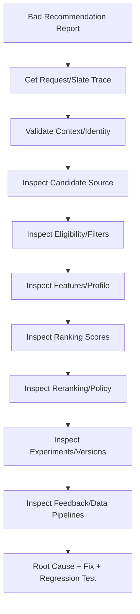

------
title: Build From Scratch Recommendations System - Part 067
description: Playbook debugging bad recommendations production-grade: investigasi dari request trace, candidate source, eligibility, feature, ranker, reranker, policy, profile, feedback, data pipeline, experiments, dan product context.
series: learn-build-from-scratch-recommendations-system
seriesTitle: Build From Scratch: Enterprise Recommendations System
order: 67
partTitle: Debugging Bad Recommendations
tags:
  - recommendation-system
  - recsys
  - debugging
  - observability
  - incident-response
  - ranking
  - series
date: 2026-07-02
---

# Part 067 — Debugging Bad Recommendations

Bad recommendation adalah salah satu incident paling sulit dalam RecSys.

Bukan karena service down.  
Bukan karena exception.  
Bukan karena response 500.

Sering kali sistem mengembalikan response 200, tetapi item/action yang muncul terasa:

- tidak relevan,
- repetitif,
- terlalu sempit,
- terlalu random,
- tidak pantas,
- out-of-stock,
- sudah dibeli,
- melanggar preferensi user,
- melanggar policy,
- salah tenant,
- salah bahasa,
- salah context,
- terlalu banyak sponsored,
- tidak explainable,
- buruk untuk segment tertentu.

Debugging RecSys harus sistematis. Jika tidak, semua orang akan menebak:

```text
mungkin modelnya jelek
mungkin feature rusak
mungkin candidate source salah
mungkin user profile kosong
mungkin rule tidak jalan
mungkin experiment treatment
```

Part ini memberikan playbook debugging bad recommendations production-grade: mulai dari request trace, candidate generation, eligibility, feature, ranking, reranking, policy, profile, experiments, event logging, data pipelines, hingga product context.

---

## 1. Mental Model: Bad Recommendation Is a Decision-Path Bug Until Proven Otherwise

Rekomendasi akhir adalah hasil pipeline:

```text
request context
-> candidate generation
-> eligibility/filtering
-> feature assembly
-> ranking
-> reranking/slate policy
-> final validation
-> response/tracking
-> feedback loop
```

Bad recommendation bisa berasal dari salah satu stage.

Debugging harus bertanya:

```text
How did this item enter candidate pool?
Why was it eligible?
What features/scores made it rank high?
Why did reranker keep it?
Why did policy not suppress it?
Was user/context/profile correct?
Was event/training data correct?
```

Jangan langsung menyalahkan model.

---

## 2. Debugging Input Minimal

Untuk investigasi, kumpulkan:

```text
request_id
slate_id
user_id/anonymous_id or tenant/actor id
surface
timestamp
item_id/action_id/document_id
position
model version
policy/rule version
experiment variants
```

Tanpa `request_id` atau `slate_id`, debugging jauh lebih sulit.

Produk internal harus memudahkan support/engineer menemukan ID ini.

---

## 3. First Question: What Type of Bad Recommendation?

Classify issue.

```text
irrelevant
unsafe/policy violation
already consumed/purchased
repetitive/fatiguing
wrong language/region
wrong tenant/permission
out of stock/unavailable
too sponsored/business-heavy
cold-start poor
diversity poor
explanation wrong
LLM hallucination
segment-wide regression
```

Classification determines urgency and path.

Policy/security issue needs immediate containment. Relevance issue may need model/source investigation.

---

## 4. Severity Classification

### Critical

```text
tenant data leak
restricted item shown
policy-banned content
unauthorized enterprise document/action
sensitive user data exposed
```

Action:

```text
kill switch / fail closed / rollback immediately
```

### High

```text
large segment gets bad slate
fallback spike
repetitive spam
wrong language/region at scale
```

Action:

```text
rollback/disable source/model/rule if needed
```

### Medium

```text
specific user/item odd recommendation
local ranking issue
feature issue affecting limited segment
```

Action:

```text
investigate and patch
```

### Low

```text
minor explanation wording
rare edge case
```

Action:

```text
backlog with evidence
```

---

## 5. Debug Flow Overview



Follow order. It prevents random guessing.

---

## 6. Step 1: Retrieve Decision Trace

Decision trace should show:

```text
request context
candidate sources
candidate pool
filter decisions
feature diagnostics
model scores
score components
reranking adjustments
final slate
fallback tier
tracking metadata
```

If trace not available, use logs and decision log.

Lack of trace is itself an observability gap.

---

## 7. Step 2: Validate Request Context

Check:

```text
surface correct?
region/locale correct?
device correct?
privacy mode correct?
request timestamp correct?
seed item/query/cart/case context correct?
tenant_id correct?
```

Many bad recs are context bugs.

Example:

```text
User in Indonesia receives US-only product because region missing in request.
```

This is not model bug. It is request/context contract bug.

---

## 8. Step 3: Validate Identity

Check:

```text
effective user id
anonymous id
session id
identity merge
shared device
logout/login transition
tenant actor id
household/account state
```

Bad identity causes:

- wrong preferences,
- wrong suppression,
- wrong language,
- privacy issue,
- cross-tenant leak.

If identity confidence low, system should use contextual fallback.

---

## 9. Step 4: Validate Consent and Privacy Mode

Check:

```text
personalization allowed?
behavioral features allowed?
ads personalization allowed?
profile reset active?
user deletion pending?
non-personalized mode respected?
```

If no consent but personalized features used, treat as serious.

Debug trace should show feature sources disabled by privacy mode.

---

## 10. Step 5: Inspect Candidate Source

Ask:

```text
Which source generated this item?
Was it from two-tower, content, trending, editorial, sponsored, exploration, fallback?
What source rank/score?
Was source expected for this surface?
Was source enabled by experiment/config?
```

Candidate provenance is mandatory.

Example trace:

```json
{
  "item_id": "item_123",
  "sources": [
    {
      "source": "two_tower",
      "rank": 12,
      "score": 8.4
    },
    {
      "source": "trending",
      "rank": 3,
      "score": 0.91
    }
  ]
}
```

---

## 11. Candidate Source Root Causes

Common issues:

```text
source returns stale items
source ignores region/tenant
source index version wrong
source score distribution shifted
new source too broad
exploration pool too random
trending dominated by bot traffic
item-to-item seed wrong
content metadata wrong
LLM expansion query wrong
fallback source overused
```

Check source-specific diagnostics.

---

## 12. Step 6: Inspect Candidate Pool

Look at pool before ranking:

```text
candidate count
source mix
category distribution
language distribution
item age distribution
validity rate
duplicates
cold-start share
sponsored share
```

If whole pool is bad, ranker cannot fix it.

Bad final item may be symptom of no good alternatives.

---

## 13. Pool Scarcity

If after filtering only few candidates remain, system may show poor item.

Symptoms:

```text
candidate count low
filter rejection high
fallback tier high
final slate underfilled
```

Root causes:

- too strict filters,
- catalog outage,
- region mismatch,
- policy config,
- candidate source failure,
- tenant has few items,
- user suppressions/frequency caps too strong.

Fix may be candidate coverage/fallback, not ranking.

---

## 14. Step 7: Inspect Eligibility and Filters

Ask:

```text
Did item pass all expected hard filters?
Should any filter have rejected it?
Were filter inputs fresh?
Were reason codes logged?
```

Check:

- availability,
- policy state,
- region,
- tenant,
- permission,
- user suppression,
- already purchased/consumed,
- frequency cap,
- campaign active,
- language.

If item should have been rejected, investigate filter/rule.

---

## 15. Filter Debug Example

```json
{
  "item_id": "item_123",
  "filter_results": [
    {"filter": "catalog_active", "decision": "pass"},
    {"filter": "region_available", "decision": "pass"},
    {"filter": "user_hidden", "decision": "pass"},
    {"filter": "frequency_cap", "decision": "pass"}
  ]
}
```

If user says they hid item, but `user_hidden` passes:

- suppression event missing?
- wrong user id?
- stale suppression store?
- scope mismatch?
- hide target was dedup group not item?
- TTL expired?

---

## 16. Step 8: Inspect User Profile and State

Check:

```text
long-term profile
session state
recent behavior
negative preferences
suppression
frequency counters
purchased/consumed state
consent state
profile freshness
profile coverage
```

Bad rec can occur because:

- profile empty,
- profile stale,
- profile overreacted,
- session intent wrong,
- shared device polluted profile,
- negative feedback not applied.

---

## 17. Profile Debug Questions

```text
What did system believe user likes?
What recent session intent did it use?
Was this recommendation aligned with long-term or session state?
Was negative feedback present?
Was profile updated after recent action?
Was profile from correct identity?
```

If item matches old profile but user changed interest, consider decay/session weighting.

---

## 18. Step 9: Inspect Feature Values

Feature diagnostics:

```text
missing features
defaulted features
stale features
outlier values
feature group latency
feature set version
online-offline parity
```

For bad item, compare feature row:

```text
item_quality_score
user_category_affinity
seen_count
source_score
freshness
risk score
business boost
```

Feature bugs often create ranking issues.

---

## 19. Feature Root Causes

Common:

```text
item quality all default high
user affinity all zero
category id changed
embedding missing
CTR feature stale
negative feature missing
source rank feature inverted
feature type mismatch
normalization mismatch
privacy mode disabled feature unexpectedly
```

Check recent feature pipeline changes.

---

## 20. Step 10: Inspect Ranking Score

Ask:

```text
What was raw model score?
What task predictions?
What utility score?
What score components?
Was score unusually high?
Was calibration applied?
```

Example:

```json
{
  "p_click": 0.18,
  "p_purchase": 0.02,
  "p_hide": 0.001,
  "utility": 0.27,
  "rank_score": 0.91
}
```

Compare with neighboring candidates.

---

## 21. Score Component Debug

If utility score high due to one component:

```text
business boost
sponsored boost
freshness boost
source score
click probability
purchase value
exploration bonus
```

Then root cause may be utility policy, not model.

Score components should be logged or reconstructable.

---

## 22. Step 11: Compare Rank Before and After Reranking

Check:

```text
ranker position
reranker final position
adjustments applied
diversity penalties
frequency penalties
business boosts
sponsored slots
required inclusion
exploration slot
```

If item was rank 200 but final position 3, reranker/policy moved it.

If item was rank 1 before reranking, ranker/features likely issue.

---

## 23. Reranking Root Causes

Common:

```text
diversity penalty too strong
business boost too large
sponsored cap misconfigured
exploration slot too broad
required item invalid
frequency cap missing
source quota overrepresented
layout rule forced bad item
fallback fill ignored relevance floor
```

Reranking debug should show adjustment reasons.

---

## 24. Step 12: Inspect Business Rules and Policy

Ask:

```text
Was there a campaign?
Was item sponsored?
Was there hard include?
Was there business boost?
Was there policy conflict?
Did rule expire?
Was tenant rule applied?
```

Rule impact should be logged.

Bad recommendation may be expected under current business rule, but rule may be bad product decision.

---

## 25. Step 13: Inspect Experiment Assignment

Check:

```text
experiment variants
candidate policy version
ranking model version
slate policy version
LLM explanation version
treatment applied?
fallback bypassed treatment?
cache contamination?
```

If issue only treatment users see, experiment likely culprit.

Sample ratio mismatch or cache contamination can produce confusing behavior.

---

## 26. Step 14: Inspect Fallback

Was fallback used?

Fallback reasons:

```text
candidate source timeout
ranker timeout
feature store timeout
policy fail closed
cache miss
precomputed list stale
low candidate count
```

Bad rec may come from fallback list, not primary model.

Fallback should be safe and traceable.

---

## 27. Step 15: Inspect Cache

Check:

```text
was response/candidate/list cached?
cache key included user/region/privacy/variant/tenant?
cache value stale?
tracking token reused?
cache bypassed suppression?
cache from old policy version?
```

Cache bugs cause hard-to-reproduce recs.

If item persists after user hides it, suspect cache/final filter.

---

## 28. Step 16: Inspect Catalog/Item Metadata

Check item:

```text
category
language
region availability
policy state
dedup group
creator/seller
stock
quality score
metadata extraction
embedding version
taxonomy
```

Bad metadata can make good model choose wrong item.

Example:

```text
Spanish item labeled as Indonesian.
```

Model sees wrong feature.

---

## 29. Step 17: Inspect Embedding/Index

If source is vector retrieval:

```text
query embedding version
item embedding version
index version
similarity metric
vector norm
index filter
delta index
tombstone
nearest neighbors
```

Common:

- query/item version mismatch,
- old index,
- missing delta,
- wrong metric,
- embedding norm drift,
- invalid item in index.

---

## 30. Step 18: Inspect Feedback Logs

Check whether user feedback was logged:

```text
impression event
click event
hide event
report event
purchase/consume event
tracking token
event join
event lag
dedup
```

If user hid item but event missing, model cannot know.

If event logged but not applied to suppression/profile, pipeline issue.

---

## 31. Step 19: Inspect Data Pipelines

For segment-wide issue, check:

```text
event volume anomaly
feature pipeline freshness
profile pipeline failure
label rate drift
embedding pipeline lag
index build publish
catalog update pipeline
batch scoring run
model deployment
rule/config change
```

Bad recommendation often starts in offline/nearline data.

---

## 32. Step 20: Inspect Model Deployment Timeline

Check recent changes:

```text
model route changed
feature set changed
calibration changed
utility policy changed
candidate policy changed
rule bundle changed
index version changed
experiment ramped
cache config changed
```

Use change timeline.

Many incidents correlate with deployment/config.

---

## 33. Single-User vs Segment-Wide Debug

### Single-User Issue

Focus:

- identity,
- profile,
- suppression,
- session,
- exposure history,
- request trace.

### Segment-Wide Issue

Focus:

- deployment,
- feature pipeline,
- candidate source,
- region/locale,
- experiment,
- index/model version.

Do not overfit global fix to one user anomaly.

---

## 34. Reproduction

Try reproduce with:

```text
same request context
same model/policy versions
same candidate set
same feature snapshot
same random seed
same cache state if possible
```

If replay differs, identify why:

- nondeterminism,
- cache,
- time-varying features,
- random seed missing,
- model version changed.

Reproducibility is debugging power.

---

## 35. Counterfactual Debugging

Ask:

```text
If we remove this candidate source, would item still appear?
If we disable business boost, where would it rank?
If feature fixed, score changes how?
If user profile ignored, does item appear?
If reranking disabled, what final slate?
```

Counterfactual replay helps isolate stage.

---

## 36. Debugging Repetition

Symptoms:

```text
same item repeatedly
same creator repeatedly
same category too often
user hides but still sees similar
```

Check:

- impression events,
- frequency counters,
- cooldown policy,
- dedup group,
- similar item suppression,
- creator/topic fatigue,
- final cache,
- tracking token/viewability.

Repetition is often state/logging issue.

---

## 37. Debugging Irrelevance

Symptoms:

```text
item not related to user/context
```

Check:

- candidate source provenance,
- query/session context,
- user profile,
- item metadata/category,
- embedding nearest neighbors,
- feature defaults,
- rank score components,
- exploration flag.

If exploration, check relevance floor.

---

## 38. Debugging Unsafe/Policy-Violating Recommendation

Immediate steps:

1. Disable item/category/source if needed.
2. Check policy state.
3. Check final validation.
4. Check cache/fallback.
5. Check rule bundle version.
6. Check index tombstone.
7. Check tenant/region policy.
8. Add regression test.

Safety incidents require containment before full root cause.

---

## 39. Debugging Wrong Tenant/Permission

Critical.

Check:

```text
tenant_id in request
actor_id
permission service result
document/action tenant
cache key tenant dimension
index partition/filter
policy service version
debug access
```

If cross-tenant leak possible, escalate.

Fail closed while investigating.

---

## 40. Debugging Out-of-Stock/Unavailable

Check:

```text
catalog availability state
inventory freshness
surface strictness
final availability check
cache TTL
precomputed list age
batch list final filter
PDP vs checkout semantics
```

For checkout, unknown availability should reject.

For discovery, stale availability may be tolerated but monitored.

---

## 41. Debugging Bad Explanation

If explanation wrong:

```text
Was explanation LLM or template?
What evidence was passed?
Did evidence support claim?
Was item fact grounded?
Was user history claim true?
Did output validator run?
Did prompt/model version change?
```

If explanation claims false reason, fix explanation evidence pipeline.

Do not let LLM invent.

---

## 42. Debugging Cold-Start Failure

Symptoms:

```text
new items never shown
new users get poor recs
new tenant empty results
```

Check:

- cold-start candidate source,
- content metadata,
- embedding generation time,
- delta index,
- exploration budget,
- priors,
- fallback lists,
- segment metrics.

Cold-start often fails because support pipeline missing, not because ranker bad.

---

## 43. Debugging Model Regression

Steps:

1. Confirm model version.
2. Compare score distribution vs previous.
3. Check feature missing/drift.
4. Check candidate distribution.
5. Check offline metrics/segments.
6. Check calibration.
7. Run replay with previous model.
8. Identify affected segments.
9. Rollback if severe.

Model regression may be data/feature regression.

---

## 44. Root Cause Categories

Classify root cause:

```text
request/context
identity/profile
candidate source
catalog metadata
eligibility/filter
feature store/pipeline
ranking model
calibration/utility
reranking/slate policy
business rule
cache
experiment
event logging
offline training data
LLM component
product expectation mismatch
```

Root cause category drives fix owner.

---

## 45. Fix Types

Fix can be:

```text
rule/config change
source disable
model rollback
feature pipeline fix
catalog metadata fix
profile/suppression fix
cache invalidation
experiment stop
reranker policy tuning
training dataset fix
logging fix
UI/product expectation change
```

Not every bad rec needs model retraining.

---

## 46. Add Regression Test

Every resolved bug should add test.

Examples:

```text
blocked creator never appears
out-of-stock checkout suppressed
tenant A cannot see tenant B doc
hide item applies within seconds
candidate source respects region
feature missing uses safe default
business boost cannot override policy
```

Regression tests prevent repeated incidents.

---

## 47. Debug Report Template

```text
Incident/Report ID:
Surface:
User/tenant segment:
Request/slate ID:
Bad item/action:
Severity:
Observed behavior:
Expected behavior:
Candidate source:
Eligibility decision:
Feature diagnostics:
Ranking score/components:
Reranking adjustments:
Policy/rule impact:
Experiment variant:
Root cause:
Fix:
Regression test:
Follow-up monitoring:
```

Use consistent template.

---

## 48. Common Debugging Anti-Patterns

### 48.1 Blame Model First

Often wrong.

### 48.2 No Request ID

Investigation impossible.

### 48.3 Ignore Candidate Source

Ranker cannot fix missing/bad pool.

### 48.4 Ignore Filter Reasons

Policy bugs missed.

### 48.5 No Feature Snapshot

Cannot reproduce score.

### 48.6 No Version Timeline

Recent deploy missed.

### 48.7 Fix One User Manually

Root cause remains.

### 48.8 No Regression Test

Bug returns.

### 48.9 Debug Logs Leak PII

Privacy incident.

### 48.10 Treat Product Disagreement as Bug

Sometimes recommendation follows configured objective; objective needs review.

---

## 49. Implementation Sketch: Debug Trace Query

```java
public interface RecommendationDebugService {
    RecommendationDebugTrace getTrace(String requestId, String slateId);
}

public record RecommendationDebugTrace(
    String requestId,
    String slateId,
    RequestContextSnapshot context,
    CandidateDebugInfo candidates,
    FilterDebugInfo filters,
    FeatureDebugInfo features,
    RankingDebugInfo ranking,
    SlateDebugInfo slate,
    PolicyDebugInfo policy,
    ExperimentDebugInfo experiments,
    List<String> warnings
) {}
```

Access control required.

---

## 50. Implementation Sketch: Item Decision Explanation

```java
public record ItemDecisionDebug(
    String itemId,
    int finalPosition,
    List<SourceEvidence> sourceEvidence,
    List<FilterDecision> filterDecisions,
    Map<String, Object> keyFeatures,
    Map<String, Double> predictions,
    Map<String, Double> scoreComponents,
    List<RerankAdjustment> rerankAdjustments,
    List<RuleDecision> ruleDecisions
) {}
```

This answers “why this item?”

---

## 51. Minimal Production Debugging Plan

Start with:

```yaml
debug_inputs:
  request_id_required: true
  slate_id_required: true
trace:
  candidate_sources: true
  filter_reasons: true
  feature_missing_summary: true
  model_version_and_scores: true
  reranking_adjustments: true
  policy_rule_decisions: true
  experiment_variants: true
replay:
  model_policy_versions_logged: true
  random_seed_logged: true
operations:
  severity_classification: true
  root_cause_template: true
  regression_test_required_for_incidents: true
security:
  access_control: true
  redaction: true
```

---

## 52. Checklist Debugging Bad Recommendations Readiness

```text
[ ] Request/slate IDs are available from support/product surfaces.
[ ] Decision trace contains candidate sources.
[ ] Filter reason codes are logged.
[ ] Feature diagnostics include missing/stale/default.
[ ] Ranking scores and model versions are logged.
[ ] Reranking adjustments are logged.
[ ] Policy/rule decisions are logged.
[ ] Experiment assignment and treatment-applied are logged.
[ ] Fallback tier/reason is logged.
[ ] User/profile/suppression state can be inspected safely.
[ ] Event logs can be linked to decision.
[ ] Deployment/config/model/index timeline exists.
[ ] Replay is possible or planned.
[ ] Debug tooling has privacy/access controls.
[ ] Incident reports use consistent root-cause template.
[ ] Regression tests are added after fixes.
```

---

## 53. Kesimpulan

Debugging bad recommendations membutuhkan pendekatan decision-path, bukan tebak-tebakan model.

Prinsip utama:

1. Bad recommendation is a decision-path bug until proven otherwise.
2. Start with request/slate trace.
3. Validate context, identity, consent, and tenant.
4. Inspect candidate provenance before blaming ranker.
5. Eligibility/filter reasons reveal many bugs.
6. Feature missing/stale/outlier values often cause ranking issues.
7. Reranking/business rules can move bad items into final slate.
8. Cache/fallback/experiment can bypass expected behavior.
9. Reproduce and counterfactually replay to isolate root cause.
10. Every incident should create regression tests and monitoring improvements.

Di Part 068, kita akan membahas **Model Quality Monitoring and Drift**: bagaimana memonitor kualitas model, feature drift, prediction drift, calibration drift, candidate drift, data drift, and trigger retraining/rollback secara production-grade.
