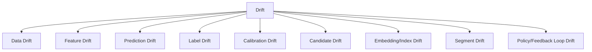

------
title: Build From Scratch Recommendations System - Part 068
description: Mendesain model quality monitoring dan drift detection untuk recommendation system production-grade: data drift, feature drift, prediction drift, calibration drift, label drift, candidate drift, segment drift, alerting, retraining triggers, rollback, and governance.
series: learn-build-from-scratch-recommendations-system
seriesTitle: Build From Scratch: Enterprise Recommendations System
order: 68
partTitle: Model Quality Monitoring and Drift
tags:
  - recommendation-system
  - recsys
  - model-monitoring
  - drift
  - mlops
  - observability
  - series
date: 2026-07-02
---

# Part 068 — Model Quality Monitoring and Drift

Model recommendation tidak gagal hanya saat inference error.

Model bisa tetap sehat secara teknis tetapi kualitasnya turun karena:

- user behavior berubah,
- catalog berubah,
- seasonality,
- feature pipeline drift,
- candidate source berubah,
- new item distribution berubah,
- policy/rule berubah,
- label distribution berubah,
- embedding/index version berubah,
- experiment treatment mengubah feedback,
- model calibration memburuk,
- training data tidak lagi representatif.

Ini disebut drift.

Model quality monitoring bertugas mendeteksi penurunan kualitas, menjelaskan sumbernya, dan memicu tindakan:

```text
recalibrate
retrain
rollback
disable source
fix feature
adjust policy
run experiment
investigate data incident
```

Part ini membahas model quality monitoring dan drift detection untuk recommendation system production-grade: data drift, feature drift, prediction drift, calibration drift, label drift, candidate drift, segment drift, alerting, retraining triggers, rollback, and governance.

---

## 1. Mental Model: Model Quality Is a Moving Target

Model dilatih pada data masa lalu.

Production environment berubah.

```text
training distribution != current serving distribution
```

Recommendation system sangat rentan karena ia memengaruhi data yang ia pelajari:

```text
model recommends -> user reacts -> data collected -> future model learns
```

Monitoring harus melihat:

- input drift,
- output drift,
- outcome drift,
- decision drift,
- segment drift,
- feedback loop drift.

---

## 2. Drift Types



Each type needs different metric and response.

---

## 3. Data Drift

Data drift means input data distribution changes.

Examples:

```text
new region traffic increases
mobile traffic doubles
new category launches
holiday season changes demand
anonymous user share rises
tenant mix changes
```

Data drift does not always mean model bad, but it means training distribution may be less representative.

Monitor request/context distribution.

---

## 4. Feature Drift

Feature drift means feature value distribution changes.

Examples:

```text
item_ctr_7d all drops
user_profile_affinity all zeros
category unknown rate spikes
embedding norm shifts
stock feature missing increases
session_depth distribution changes
```

Feature drift can be caused by real world or pipeline bug.

Distinguish natural drift vs data incident.

---

## 5. Prediction Drift

Prediction drift means model outputs distribution changes.

Examples:

```text
p_click mean drops
p_hide p95 increases
rank_score distribution compresses
top scores become too high
utility score dominated by business boost
```

Prediction drift can result from feature/candidate changes.

Track by model version and segment.

---

## 6. Label Drift

Label drift means outcome distribution changes.

Examples:

```text
CTR baseline changes
purchase conversion shifts
hide/report increases
return rate changes
case action completion rate drops
```

Causes:

- user behavior,
- seasonality,
- UI change,
- tracking bug,
- model behavior,
- external factors.

Label drift affects training and evaluation.

---

## 7. Calibration Drift

Calibration drift:

```text
predicted probabilities no longer match observed probabilities
```

Example:

```text
model predicts 10% click, actual click now 6%
```

Causes:

- user behavior shift,
- candidate distribution shift,
- feature drift,
- UI change,
- policy change.

Calibration drift is critical for utility composition.

---

## 8. Candidate Drift

Candidate pool distribution changes.

Examples:

```text
two_tower source returns more new items
trending source dominates
content source candidate count drops
invalid candidate rate rises
candidate categories shift
```

Ranker trained on old candidate distribution may perform poorly.

Monitor candidate source and pool distribution.

---

## 9. Embedding/Index Drift

Embedding/index changes alter retrieval.

Monitor:

```text
embedding norm
coverage
nearest neighbor distribution
index recall benchmark
category distribution from ANN
empty vector result rate
index filter rate
new item time to index
```

A new index can change candidate universe even if ranker unchanged.

---

## 10. Segment Drift

Global metrics may be stable while segment degrades.

Segments:

```text
new users
anonymous users
cold-start items
regions
languages
devices
tenants
categories
candidate sources
privacy modes
```

Monitor drift by segment.

---

## 11. Feedback Loop Drift

Recommender affects future data.

Symptoms:

```text
top items get more exposure
long-tail exposure shrinks
user interests narrow
creator concentration increases
exploration support decreases
negative feedback increases for repeated topics
```

This is not ordinary data drift. It is system-induced drift.

Need exposure/fairness monitoring.

---

## 12. Monitoring Windows

Use multiple windows:

```text
real-time: minutes
nearline: hours
daily: 1d
weekly: 7d
long-term: 30d+
```

Different signals mature at different speeds.

Example:

- feature missing spike: minutes.
- click drift: hours.
- purchase drift: days.
- return drift: weeks.
- retention drift: weeks.

---

## 13. Baseline Selection

Compare current metrics to baseline.

Options:

```text
previous hour/day/week
same day last week
training distribution
champion model baseline
control variant
seasonality-adjusted expected range
```

Use context.

Comparing holiday traffic to normal weekday may produce false alerts.

---

## 14. Feature Drift Metrics

Metrics:

```text
mean/std change
quantile shift
null/missing rate
unknown enum rate
population stability index
KL divergence
JS divergence
Wasserstein distance
embedding norm drift
categorical top-K distribution shift
```

Start with simple distribution checks and missing/stale rates.

---

## 15. Population Stability Index

PSI compares distribution bins.

High-level:

```text
PSI = sum((actual% - expected%) * ln(actual% / expected%))
```

Useful for feature drift dashboards.

But thresholds are heuristic.

Do not blindly alert on PSI without context.

---

## 16. Embedding Drift Metrics

For embeddings:

```text
norm distribution
dimension mean/std
zero vector rate
nearest neighbor category mix
cluster occupancy
average pairwise similarity sample
coverage
```

Embedding drift often appears as retrieval quality drift.

---

## 17. Prediction Drift Metrics

Track:

```text
score mean/p50/p95/p99
entropy of ranking scores
top-K score gap
prediction bucket distribution
task prediction distribution
score component contribution
```

If score distribution compresses, ranker may lose discrimination.

If top score spikes, feature bug or calibration issue possible.

---

## 18. Calibration Monitoring

Process:

1. Group predictions into buckets.
2. Wait reward maturity.
3. Compare predicted vs observed rate.
4. Compute ECE/Brier/logloss by window.
5. Slice by segment/model version.

Metrics:

```text
ECE
Brier
logloss
bucket observed/predicted gap
```

Calibration alerts need delayed labels.

---

## 19. Outcome Quality Monitoring

Track mature outcomes:

```text
CTR
CVR
purchase
hide/report
retention
return/refund
case success
rework
SLA
```

By model version and segment.

Use control group/holdout when available.

Raw metric changes may be confounded by traffic mix.

---

## 20. Proxy vs Long-Term Monitoring

Monitor both:

### Fast Proxy

```text
click
dwell
session continuation
hide/report
```

### Long-Term

```text
retention
repeat purchase
return/refund
case resolution
trust signals
```

Fast proxy alerts detect urgent issues.  
Long-term metrics validate true value.

---

## 21. Candidate Quality Monitoring

Metrics:

```text
candidate recall proxy
candidate count
empty candidate pool
source contribution
eligible rate
invalid rate
dedup rate
source overlap
new item share
long-tail share
```

If candidate count drops, model quality drops regardless of ranker.

---

## 22. Feature Importance-Aware Monitoring

Features with high model importance need tighter monitoring.

Example:

```text
item_ctr_7d
user_category_affinity
source_two_tower_score
item_quality_score
seen_count
```

If critical feature missing, alert higher severity.

Model registry can provide feature importance.

---

## 23. Model Version Monitoring

Always slice by model version.

Metrics:

```text
traffic share
latency
error rate
score distribution
prediction distribution
feature missing
online outcomes
calibration
fallback rate
```

If multiple models active, global metrics hide issue.

---

## 24. Drift vs Incident

Drift can be natural gradual shift.  
Incident is sudden unexpected change.

Examples:

### Drift

```text
holiday season increases gift category interest
```

### Incident

```text
category feature becomes null after deploy
```

Response differs.

Monitoring should help distinguish sudden vs gradual.

---

## 25. Drift Response Playbook

When drift detected:

1. Identify feature/model/source/segment.
2. Check recent changes.
3. Validate data pipeline.
4. Compare control/previous version.
5. Check outcome metrics.
6. Decide: ignore, monitor, recalibrate, retrain, rollback, fix pipeline, adjust policy.
7. Document.

Not every drift requires retraining.

---

## 26. Retraining Triggers

Trigger retrain when:

```text
feature distribution shifted materially
calibration degraded
online metrics degrade
new category/region launched
catalog distribution changed
candidate source changed
label distribution changed
seasonality
model age exceeds threshold
```

Retraining should still pass validation gates.

---

## 27. Recalibration Triggers

Recalibrate when:

```text
ranking order still okay but probabilities off
utility composition unstable
calibration ECE worsens
business thresholds misfire
```

Recalibration is cheaper than full retrain but only fixes probability mapping, not representation.

---

## 28. Rollback Triggers

Rollback when:

```text
model deploy causes score distribution anomaly
guardrail breach
latency spike
policy violation
severe segment regression
feature incompatibility
calibration severely broken
```

Rollback should be fast via model route.

If root cause is feature pipeline, rollback may not help.

---

## 29. Feature Pipeline Fix vs Model Fix

If feature pipeline bug:

```text
fix feature pipeline
backfill if needed
recompute affected features
possibly retrain
```

If model overfits:

```text
retrain with better data/objective
```

If candidate source changed:

```text
adjust candidate policy/ranker training distribution
```

Choose fix based on root cause.

---

## 30. Drift Caused by Policy Changes

Business rules and reranking policies can change distribution.

Example:

```text
new diversity policy increases long-tail exposure
```

Feature/outcome drift may be expected.

Deployment notes should annotate expected drift.

Monitoring should compare against experiment/control.

---

## 31. Drift Caused by Experiment

Treatment changes feedback distribution.

If training pipeline uses experiment data, record variant.

Questions:

```text
Should treatment data be included?
Should model train with experiment feature?
Is treatment causing distribution shift?
```

Experiment-aware training avoids contamination.

---

## 32. Data Poisoning and Abuse

Bad actors can manipulate feedback.

Examples:

```text
bot clicks
fake reviews
creator spamming metadata
coordinated engagement
seller gaming recommendation
```

Monitoring:

```text
abnormal engagement bursts
creator/item anomaly
bot traffic
review/fraud signals
source-specific spike
```

Model quality monitoring should include abuse signals.

---

## 33. Monitoring New Item Quality

Metrics:

```text
time_to_first_impression
new_item_embedding_coverage
new_item_exploration_reward
new_item_negative_rate
new_item_conversion
new_item_dropoff
```

If new items never get exposure, system becomes stale.

If new items get too much exposure, quality may drop.

---

## 34. Monitoring User-Level Experience

Aggregate metrics can hide individual fatigue.

Track:

```text
repeat rate per user
category concentration per user
hide/report per user
session abandonment
recommendation reset
do_not_personalize
```

Use privacy-aware aggregation.

---

## 35. Monitoring Marketplace Health

Metrics:

```text
creator exposure concentration
seller revenue concentration
qualified exposure share
new creator time to first exposure
long-tail conversion
supply churn
```

Model quality includes ecosystem health for marketplaces.

---

## 36. Monitoring Enterprise Quality

Enterprise metrics:

```text
recommended action acceptance
action completion
case resolution
SLA improvement
rework
supervisor override
audit issue
document helpfulness
tenant-specific quality
```

Long outcome windows matter.

Monitor by tenant and workflow type.

---

## 37. Alert Design

Alert should include:

```text
what changed
where
since when
affected segment
current value
baseline
likely owner
dashboard link
runbook
```

Bad alert:

```text
model drift high
```

Good alert:

```text
home_feed home_ranker_v13 p_click p95 shifted +45% in ID mobile since 09:00 after feature_set v19 deploy
```

---

## 38. Alert Thresholds

Threshold options:

- static thresholds,
- relative change,
- anomaly detection,
- control chart,
- seasonality-aware threshold.

Start simple:

```text
critical feature missing > 5%
fallback rate > 10%
empty slate > 1%
ECE > threshold after maturity
```

Then mature.

---

## 39. False Positive Management

Too many false alerts cause alert fatigue.

Reduce noise by:

- segment priority,
- duration windows,
- combining signals,
- severity levels,
- ownership,
- suppress expected deployment windows,
- annotate experiments.

But do not suppress safety alerts.

---

## 40. Drift Dashboard

Dashboard sections:

```text
active model versions
traffic share
feature drift
prediction drift
calibration
outcome metrics
candidate source distribution
fallback/empty rates
segment health
recent changes
alerts/incidents
```

The dashboard should support diagnosis, not just charts.

---

## 41. Model Quality Report

Periodic report:

```text
model version
age
training data window
online performance
calibration
drift summary
segment regressions
feature health
candidate source health
recommendation: keep/retrain/recalibrate/investigate
```

Run daily/weekly depending system.

---

## 42. Drift and Governance

Governance decisions:

```text
Who decides retrain?
Who approves recalibration?
Who owns feature drift?
When is rollback mandatory?
What guardrails are non-negotiable?
```

Model quality monitoring must connect to owners and process.

---

## 43. Common Failure Modes

### 43.1 Only Monitor CTR

Feature/model degradation missed.

### 43.2 No Segment Drift

Minority segment broken.

### 43.3 No Feature Drift

Pipeline bug becomes model issue.

### 43.4 No Candidate Drift

Retrieval change blamed on ranker.

### 43.5 Calibration Drift Ignored

Utility composition wrong.

### 43.6 Alerts Without Owners

No action.

### 43.7 Retrain on Bad Data

Drift caused by event bug.

### 43.8 Rollback Wrong Layer

Model rollback does not fix feature bug.

### 43.9 No Experiment Awareness

Treatment data contaminates baseline.

### 43.10 Long-Term Metrics Ignored

Short-term lift hides trust loss.

---

## 44. Implementation Sketch: Drift Metric

```java
public interface DriftMetric {
    String name();

    DriftResult compute(Distribution baseline, Distribution current);
}

public record DriftResult(
    String metricName,
    double value,
    DriftSeverity severity,
    Map<String, Object> diagnostics
) {}

public enum DriftSeverity {
    OK,
    WARN,
    CRITICAL
}
```

Feature/model monitoring can plug in multiple drift metrics.

---

## 45. Implementation Sketch: Feature Drift Monitor

```java
public final class FeatureDriftMonitor {
    private final List<DriftMetric> metrics;

    public List<DriftResult> evaluate(
        String featureName,
        Distribution trainingDistribution,
        Distribution servingDistribution
    ) {
        return metrics.stream()
            .map(metric -> metric.compute(trainingDistribution, servingDistribution))
            .toList();
    }
}
```

Store results by feature/model/segment/window.

---

## 46. Implementation Sketch: Calibration Bucket

```java
public record CalibrationBucket(
    double lowerBound,
    double upperBound,
    long predictionCount,
    double averagePrediction,
    double observedRate
) {
    public double gap() {
        return observedRate - averagePrediction;
    }
}
```

Calibration monitoring needs mature labels.

---

## 47. Implementation Sketch: Drift Alert

```java
public record ModelQualityAlert(
    String alertId,
    String modelVersion,
    String surface,
    String segment,
    String signal,
    double currentValue,
    double baselineValue,
    DriftSeverity severity,
    Instant detectedAt,
    String owner,
    String runbookUrl
) {}
```

Alerts should be actionable.

---

## 48. Minimal Production Model Quality Monitoring Plan

Start with:

```yaml
model_quality:
  slice_by:
    - model_version
    - surface
    - region
    - user_segment
  feature_monitoring:
    - missing_rate
    - stale_rate
    - distribution_shift_top_features
  prediction_monitoring:
    - score_distribution
    - task_prediction_distribution
  outcome_monitoring:
    - ctr
    - hide_rate
    - report_rate
    - conversion_if_available
  calibration:
    delayed_bucket_report: true
  candidate_monitoring:
    - candidate_count
    - source_distribution
    - empty_pool_rate
  triggers:
    - feature_bug_investigation
    - recalibration
    - retraining
    - rollback
```

Add long-term metrics and sophisticated drift methods after basics are reliable.

---

## 49. Checklist Model Quality Monitoring and Drift Readiness

```text
[ ] Metrics are sliceable by model version.
[ ] Feature missing/stale/distribution drift is monitored.
[ ] Top model features have tighter monitoring.
[ ] Prediction score distributions are monitored.
[ ] Calibration is monitored with mature labels.
[ ] Outcome metrics are monitored by segment.
[ ] Candidate source/pool drift is monitored.
[ ] Embedding/index drift is monitored.
[ ] Segment drift is mandatory.
[ ] Long-term metrics are included where available.
[ ] Alerts have owners and runbooks.
[ ] Drift response playbook exists.
[ ] Retraining triggers are defined.
[ ] Recalibration triggers are defined.
[ ] Rollback triggers are defined.
[ ] Experiment/treatment data is accounted for.
[ ] Data quality incidents block retraining.
[ ] Model quality reports are generated periodically.
```

---

## 50. Kesimpulan

Model quality monitoring dan drift detection menjaga recommendation system tetap sehat setelah deployment.

Prinsip utama:

1. Model quality is a moving target.
2. Monitor input, output, outcome, decision, and feedback loop drift.
3. Feature drift often explains model quality drift.
4. Candidate drift can break ranking without changing ranker.
5. Calibration drift is critical for utility composition.
6. Segment monitoring prevents global averages from hiding harm.
7. Drift can be natural, incident-driven, or system-induced.
8. Not every drift requires retraining; choose response based on root cause.
9. Alerts must be actionable with owners/runbooks.
10. Long-term metrics are needed to catch proxy optimization damage.

Part ini menutup Module 8: Evaluation, Experimentation, dan Observability.

Di Part 069, kita akan masuk Module 9: **Governance, Safety, Security, dan Enterprise Constraints**, dimulai dari **Privacy, Consent, and Data Minimization**.
