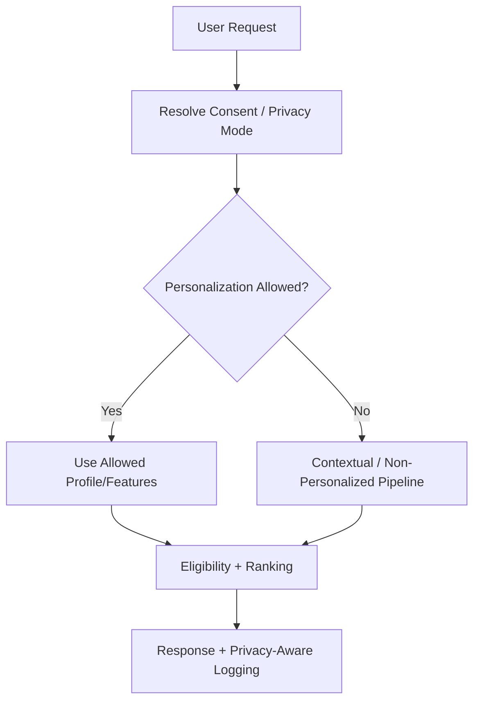
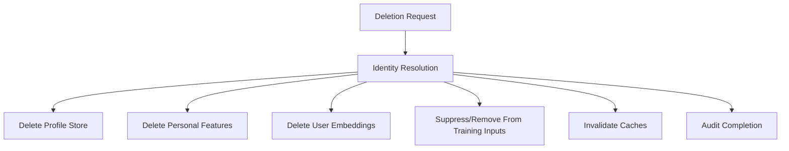

------
title: Build From Scratch Recommendations System - Part 069
description: Mendesain privacy, consent, dan data minimization untuk recommendation system production-grade: consent-aware personalization, purpose limitation, data classification, feature governance, deletion, retention, anonymization, tenant isolation, audit, dan privacy-by-design.
series: learn-build-from-scratch-recommendations-system
seriesTitle: Build From Scratch: Enterprise Recommendations System
order: 69
partTitle: Privacy, Consent, and Data Minimization
tags:
  - recommendation-system
  - recsys
  - privacy
  - consent
  - data-minimization
  - governance
  - series
date: 2026-07-02
---

# Part 069 — Privacy, Consent, and Data Minimization

Mulai Part 069, kita masuk Module 9: **Governance, Safety, Security, dan Enterprise Constraints**.

Recommendation system sangat bergantung pada data perilaku:

- apa yang user lihat,
- apa yang user klik,
- apa yang user beli,
- apa yang user sembunyikan,
- apa yang user cari,
- berapa lama user membaca/menonton,
- item apa yang user ulangi,
- topik apa yang user hindari,
- konteks lokasi/device/session,
- role/tenant/case state untuk enterprise.

Data ini powerful untuk personalization, tetapi juga sensitif.

Sistem yang bagus secara ranking tetapi buruk secara privacy bukan sistem production-grade.

Part ini membahas privacy, consent, dan data minimization untuk recommendation system: consent-aware personalization, purpose limitation, data classification, feature governance, deletion, retention, anonymization, tenant isolation, audit, and privacy-by-design.

Catatan: ini bukan nasihat hukum. Ini adalah desain engineering dan governance. Untuk implementasi legal/compliance final, selalu libatkan tim legal/privacy/security organisasi.

---

## 1. Mental Model: Personalization Is Permissioned Computation

Personalization bukan hak default sistem.

Personalization adalah komputasi atas data user yang harus sesuai dengan:

```text
consent
purpose
policy
retention
security
tenant boundary
user controls
regulatory obligations
```

Jika user tidak mengizinkan behavioral personalization, sistem harus bisa tetap bekerja secara contextual/non-personalized.



Privacy harus masuk ke request path, feature store, profile store, training data, logging, debugging, dan offline pipelines.

---

## 2. Privacy Requirements in RecSys

Recommendation privacy mencakup:

- consent management,
- data minimization,
- purpose limitation,
- feature access control,
- user deletion,
- data retention,
- anonymization/pseudonymization,
- opt-out handling,
- profiling controls,
- debug data redaction,
- tenant isolation,
- audit logging,
- training data governance,
- model/embedding privacy.

Ini bukan hanya banner cookie.

---

## 3. Privacy Modes

Define privacy modes.

```yaml
privacy_modes:
  personalized:
    use_user_behavior: true
    use_profile: true
    use_contextual: true
  contextual_only:
    use_user_behavior: false
    use_profile: false
    use_contextual: true
  non_personalized:
    use_user_behavior: false
    use_profile: false
    use_contextual: limited
```

The system should route behavior based on privacy mode.

Do not fetch personal features and then “ignore them”. Avoid overcollection.

---

## 4. Consent-Aware Serving

Serving path:

1. Resolve subject identity.
2. Resolve consent/privacy mode.
3. Choose allowed candidate sources.
4. Choose allowed feature set.
5. Disable disallowed profile/user embeddings.
6. Use contextual/non-personalized ranker if needed.
7. Apply user controls/suppression if allowed/required.
8. Log only allowed fields.

Consent must be checked before feature/profile access.

---

## 5. Candidate Source Gating

Some candidate sources require behavioral data.

| Source | Requires Personal Data? | Non-Personalized Allowed? |
|---|---:|---:|
| user collaborative filtering | yes | no |
| user two-tower retrieval | yes | no |
| session-based anonymous intent | maybe | depends consent/session policy |
| item-to-item from current seed item | low | yes if seed is current context |
| trending by region | no/aggregate | yes |
| editorial | no | yes |
| content-based similar item | maybe no | yes if based on current item/query |
| enterprise permission-based action | yes/role | only with authorized context |

Source gating prevents accidental personalization.

---

## 6. Feature Gating

Feature sets should be privacy-aware.

Example:

```yaml
feature_set: home_ranker_personalized
features:
  - user_category_affinity_30d
  - user_embedding
  - recent_click_count
  - item_quality_score
  - context_local_hour

feature_set: home_ranker_contextual
features:
  - item_quality_score
  - region_popularity
  - context_local_hour
  - device_type
```

If `privacy_mode=non_personalized`, do not request `user_embedding`.

---

## 7. Purpose Limitation

Data collected for one purpose may not be valid for another purpose.

Examples:

```text
data used for fraud prevention != data used for personalization
enterprise audit logs != model training data
payment data != recommendation features
support ticket text != marketing recommendation
```

Each feature/data source should declare purpose.

Feature registry field:

```yaml
allowed_purposes:
  - personalization
  - quality_monitoring
prohibited_purposes:
  - ads_targeting
```

Purpose limitation should be enforced by policy, access control, and review.

---

## 8. Data Minimization

Collect/use only what is needed.

Bad:

```text
send full user profile to every service
log all raw features for every request
store full document text in debug trace
send all PII to LLM explanation
```

Good:

```text
fetch only required feature groups
log sampled debug data
redact sensitive fields
aggregate where possible
use short TTL for session data
```

Minimization reduces privacy risk and system cost.

---

## 9. Data Classification

Classify data.

```text
public_catalog
aggregate_non_personal
behavioral_personal
sensitive_personal
tenant_confidential
security_sensitive
payment/financial_sensitive
health/legal_high_risk
```

Examples:

| Data | Class |
|---|---|
| item category | public_catalog |
| regional trending score | aggregate_non_personal |
| user clicks | behavioral_personal |
| user hidden topic | behavioral_personal |
| enterprise case document | tenant_confidential |
| permission state | security_sensitive |
| user embedding | behavioral_personal or sensitive inferred |

Data class drives access, retention, logging, and model use.

---

## 10. Feature Registry Privacy Metadata

Feature definition should include privacy metadata.

```yaml
name: user_category_affinity_30d
entity: user
privacy_class: behavioral_personal
allowed_privacy_modes:
  - personalized
allowed_purposes:
  - personalization
retention_days: 90
requires_consent: personalization
debug_visibility: restricted
```

This lets feature serving enforce policy.

---

## 11. Sensitive Inferences

Some features infer sensitive traits even if raw data is not labeled sensitive.

Examples:

```text
health interest
political interest
religious interest
financial distress
job seeking
relationship status
minor/age inference
```

Recommendation systems can unintentionally infer sensitive attributes.

Sensitive inferred features require stricter governance or avoidance.

Do not create sensitive segments casually.

---

## 12. User Controls

Privacy-related user controls:

```text
turn off personalization
clear recommendation history
hide item
block creator/seller
less like this
reset profile
delete account/data
download data
opt out of certain data use
```

Controls must:

- be applied quickly,
- be reflected in serving,
- be logged/audited,
- propagate to profile/feature stores,
- affect training if policy requires.

User controls are part of product trust.

---

## 13. Consent State as Critical Dependency

Consent state is critical.

If consent unknown:

```text
default to safer mode
```

Example behavior:

```text
consent service unavailable -> contextual_only/non_personalized fallback
```

Do not assume consent allowed.

Consent should be fail-safe.

---

## 14. Privacy-Aware Request Context

Request context should carry privacy mode.

```json
{
  "subject": {
    "user_id": "u123",
    "anonymous_id": "anon_456"
  },
  "context": {
    "privacy_mode": "contextual_only",
    "region": "ID",
    "locale": "id-ID"
  }
}
```

Downstream services should not independently guess privacy mode.

Propagate it.

---

## 15. Privacy-Aware Candidate Orchestration

Pseudo-flow:

```text
if personalized:
  enable user_cf, user_two_tower, session_profile, content, trending
if contextual_only:
  enable current_context_item_to_item, query/content, trending, editorial
if non_personalized:
  enable regional trending, editorial, public popularity
```

Candidate orchestration should be config-driven.

---

## 16. Privacy-Aware Ranking

Ranking routes:

```yaml
ranking_routes:
  personalized:
    model: home_personalized_ranker_v13
    feature_set: home_personalized_features_v18
  contextual_only:
    model: home_contextual_ranker_v5
    feature_set: home_contextual_features_v7
  non_personalized:
    model: home_popularity_ranker_v3
    feature_set: home_non_personal_features_v2
```

A single model can support multiple modes only if features are properly gated and trained for missing modes.

---

## 17. Training Data Consent Filtering

Training dataset builder must respect privacy policy.

Questions:

```text
Can this user's historical behavior be used for training?
Can it be used after opt-out?
Should deleted user data be removed?
Can anonymous data be used?
Can tenant data train global model?
```

Dataset spec should include privacy filters.

```yaml
privacy_filters:
  exclude_deleted_users: true
  exclude_no_training_consent: true
  tenant_scope: allowed_global_training
```

---

## 18. Consent Changes and Training Data

If user revokes consent, impacts may include:

- stop future personalization,
- remove profile features,
- exclude future events from training,
- delete prior data if policy requires,
- update embeddings,
- invalidate cached recommendations.

Implementation depends on policy/legal basis.

Engineering must support deletion/exclusion workflows.

---

## 19. User Deletion Workflow

Deletion pipeline:



Need idempotency and audit.

Deletion is not just database row delete.

---

## 20. Retention Policy

Different data has different retention.

Examples:

```yaml
session_state: 24h
raw_behavior_events: 90d
aggregated_features: 180d
decision_logs_sampled: 30d
debug_traces: 7d
model_training_artifacts: policy-defined
enterprise_audit_logs: contract-defined
```

Retention should be enforced automatically.

Do not keep debug traces forever.

---

## 21. Anonymization and Pseudonymization

Pseudonymization:

```text
replace direct identifiers with stable pseudonymous IDs
```

Anonymization:

```text
remove ability to re-identify
```

Recommendation data is hard to truly anonymize because behavior patterns can be unique.

Be careful claiming anonymization.

Aggregates with thresholds can reduce risk.

---

## 22. Aggregation Thresholds

Aggregate features should avoid exposing individuals.

Example:

```text
category popularity by region requires minimum users/events
```

If group too small:

```text
use broader aggregate
```

This is important for small tenants/regions/categories.

---

## 23. Debug Data Redaction

Debug traces can include:

- user profile,
- feature values,
- hidden topics,
- item/document sensitive metadata,
- tenant data,
- model scores.

Access should be restricted.

Redact/mask:

```text
user_id
PII
sensitive features
raw document text
exact behavioral history
```

Use role-based debug views.

---

## 24. Privacy in Observability

Metrics/logs/traces should not leak sensitive data.

Guidelines:

- avoid raw PII in logs,
- hash identifiers where possible,
- limit high-cardinality personal labels,
- sample detailed traces,
- enforce retention,
- restrict dashboard access,
- audit debug access.

Observability is data processing too.

---

## 25. LLM Privacy Risks

LLM augmentation can leak data if careless.

Risks:

- sending full user profile to LLM,
- sending confidential enterprise docs,
- prompt logs retain sensitive text,
- model provider usage not approved,
- LLM output reveals hidden profile reason,
- prompt injection extracts data.

Controls:

- minimize context,
- redact PII,
- use approved model/runtime,
- grounded facts only,
- no raw sensitive data unless necessary and allowed,
- output validation,
- logging controls.

---

## 26. Embedding Privacy Risks

Embeddings can encode sensitive information.

User embeddings, document embeddings, case embeddings should be treated as sensitive.

Risks:

- membership inference,
- nearest neighbor leakage,
- cross-tenant vector search,
- raw embedding exposure,
- long retention after deletion.

Controls:

- access control,
- deletion,
- tenant isolation,
- encryption,
- no external exposure,
- versioned retention.

---

## 27. Multi-Tenant Privacy

Enterprise RecSys must isolate tenants.

Requirements:

```text
tenant_id in every key
tenant_id in request context
tenant-aware caches
tenant-aware feature/profile stores
tenant-aware indexes
tenant-aware logs/debug access
tenant-specific training policy
```

Cross-tenant data leakage is critical incident.

Cache key missing tenant_id is dangerous.

---

## 28. Tenant Training Scope

Training options:

### Global Model with Shared Data

Needs explicit permission/contract.

### Global Architecture, Tenant-Specific Calibration

Less data sharing.

### Tenant-Specific Model

Better isolation but more operational cost.

### No Cross-Tenant Learning

Safest for strict enterprise.

Document training scope per tenant.

---

## 29. Privacy and Experiments

Experiment assignment and exposure logs are personal data if tied to user.

Need:

- retention,
- access control,
- consent compatibility,
- purpose documentation.

Experiments should not bypass privacy modes.

Treatment variants must be privacy-safe.

---

## 30. Privacy and Offline Evaluation

Offline evaluation datasets should:

- exclude disallowed users/events,
- use approved features,
- respect deletion/retention,
- mark privacy class,
- restrict access.

Evaluation notebooks are common privacy weak points.

Use governed datasets.

---

## 31. Privacy and Feature Importance/Explanation

Explanations can reveal sensitive inference.

Bad:

```text
Recommended because you seem interested in debt relief.
```

Even if model inferred it, exposing it may be inappropriate.

Explanation policy should decide what reasons are allowed.

Use safe reason categories.

---

## 32. Reason Codes Privacy

Reason codes should be user-safe.

Internal reason:

```text
user_embedding_nearest_neighbor_cluster_42
```

User-facing reason:

```text
Similar to items you viewed recently
```

Some reasons should not be exposed:

- sensitive inferred interest,
- protected attribute,
- confidential enterprise signal,
- fraud/safety risk.

---

## 33. Privacy by Design Review

Before new feature/source/model:

Ask:

```text
What data does it use?
Is consent required?
What purpose?
What privacy class?
Can we minimize?
How long retained?
Who can access?
Does it create sensitive inference?
Does it affect training?
How is deletion handled?
How is it logged/debugged?
```

Review should happen before production.

---

## 34. Data Access Control

Access control layers:

- service-to-service identity,
- feature-level authorization,
- dataset access,
- debug tool role,
- tenant scope,
- environment separation,
- audit logs.

Engineers should not have unrestricted raw behavioral data by default.

---

## 35. Audit Logging

Audit:

```text
who accessed sensitive debug trace
who changed privacy config
who approved feature use
who exported dataset
who ran deletion/backfill
who changed tenant training scope
```

Audit logs should be immutable enough for compliance review.

---

## 36. Privacy Incident Response

Examples:

- personalized rec served after opt-out,
- cross-tenant recommendation,
- deleted user data still in profile,
- sensitive feature exposed in explanation,
- LLM prompt leaked confidential data.

Incident response:

1. contain,
2. identify scope,
3. disable affected path,
4. remove/invalidate data,
5. notify stakeholders,
6. audit logs,
7. fix root cause,
8. add regression tests.

---

## 37. Privacy Testing

Tests:

```text
non_personalized request does not fetch user profile
consent revoked disables personalization
deleted user has no profile/embedding
tenant A cannot access tenant B features
debug view redacts sensitive features
cache key includes tenant/privacy mode
LLM prompt excludes disallowed fields
training dataset excludes no-consent users
```

Privacy needs automated tests.

---

## 38. Privacy Regression Test Example

```java
@Test
void nonPersonalizedRequestShouldNotFetchUserFeatures() {
    RecommendationRequest request = requestBuilder()
        .privacyMode(PrivacyMode.NON_PERSONALIZED)
        .userId("u123")
        .build();

    recommendationService.recommend(request);

    verify(profileStore, never()).getLongTermProfile("u123");
    verify(candidateSourceRouter, never()).useUserCollaborativeFiltering();
}
```

This kind of test catches accidental personalization.

---

## 39. Privacy Metrics

Monitor:

```text
personalized_request_count_by_consent
non_personalized_fallback_rate
profile_fetch_in_non_personalized_mode
deleted_user_profile_hit_count
consent_unknown_fallback_count
debug_access_count
privacy_filter_exclusion_count
tenant_boundary_violation_count
```

Some should be zero.

Alert on violations.

---

## 40. Data Minimization Metrics

Track:

```text
features fetched per request
unused feature fetch rate
debug trace payload size
LLM prompt token sensitive fields
raw event retention age
profile fields never used
```

Unused data is privacy and cost liability.

---

## 41. Privacy-Aware Caching

Cache key must include:

```text
user/anonymous id
tenant id
privacy mode
consent version if needed
experiment variant
policy version
```

If consent changes:

- invalidate personalized caches,
- stop using cached profile/list,
- force non-personalized path.

Never serve user A cached personalized response to user B.

---

## 42. Privacy-Aware Fallbacks

Fallback should respect privacy.

If personalization disallowed:

```text
fallback to contextual/non-personalized, not cached personalized
```

If consent service down:

```text
contextual safe fallback
```

If tenant access uncertain:

```text
safe empty or tenant-approved public defaults
```

---

## 43. Privacy and Model Artifacts

Models can memorize data or encode sensitive patterns.

Govern:

- training data scope,
- feature privacy classes,
- model access,
- artifact retention,
- deletion impact,
- model card privacy section.

For some systems, deletion from trained model may be complex. Work with policy/legal to define requirements and mitigation.

---

## 44. Privacy and Backfills

Backfills can accidentally reintroduce deleted/disallowed data.

Backfill pipeline must apply current privacy filters or correct historical policy as required.

Record:

```text
privacy_filter_version
deletion_snapshot
tenant_scope
```

Backfill outputs need validation.

---

## 45. Common Failure Modes

### 45.1 Consent Checked Too Late

Personal features already fetched/logged.

### 45.2 Non-Personalized Mode Uses User Embedding

Privacy violation.

### 45.3 Cache Key Missing Privacy Mode

Wrong response served.

### 45.4 Deleted User Still in Feature Store

Deletion pipeline incomplete.

### 45.5 Debug Trace Leaks Sensitive Profile

Internal privacy incident.

### 45.6 LLM Prompt Contains Excessive User Data

Unnecessary exposure.

### 45.7 Tenant ID Missing in Index Search

Cross-tenant leak.

### 45.8 Training Dataset Ignores Consent

Governance failure.

### 45.9 Reason Code Reveals Sensitive Inference

Trust violation.

### 45.10 No Retention Enforcement

Data kept indefinitely.

---

## 46. Implementation Sketch: Privacy Context

```java
public record PrivacyContext(
    PrivacyMode mode,
    boolean personalizationAllowed,
    boolean behavioralTrainingAllowed,
    boolean adsPersonalizationAllowed,
    String consentVersion,
    Instant resolvedAt
) {}

public enum PrivacyMode {
    PERSONALIZED,
    CONTEXTUAL_ONLY,
    NON_PERSONALIZED
}
```

Pass this through request path.

---

## 47. Implementation Sketch: Feature Access Check

```java
public final class FeatureAccessPolicy {
    public boolean canUse(FeatureDefinition feature, PrivacyContext privacy, Purpose purpose) {
        if (!feature.allowedPurposes().contains(purpose)) {
            return false;
        }

        if (feature.requiresPersonalizationConsent()
            && !privacy.personalizationAllowed()) {
            return false;
        }

        return feature.allowedPrivacyModes().contains(privacy.mode());
    }
}
```

Feature serving can enforce this.

---

## 48. Implementation Sketch: Candidate Source Router

```java
public final class PrivacyAwareCandidateRouter {
    public List<CandidateSource> allowedSources(
        PrivacyContext privacy,
        SurfaceConfig config
    ) {
        return config.candidateSources().stream()
            .filter(source -> source.privacyRequirements().isSatisfiedBy(privacy))
            .toList();
    }
}
```

This prevents accidental source use.

---

## 49. Minimal Production Privacy Plan

Start with:

```yaml
privacy_context:
  resolved_at_request_start: true
  propagated_to_services: true
serving:
  privacy_mode_routes:
    - personalized
    - contextual_only
    - non_personalized
  source_gating: true
  feature_gating: true
  consent_unknown_fallback: contextual_only
data:
  feature_privacy_metadata: true
  retention_policy: true
  deletion_pipeline: true
  training_privacy_filters: true
observability:
  non_personalized_profile_fetch_alert: true
  deleted_user_profile_hit_alert: true
  tenant_boundary_alert: true
debug:
  access_control: true
  redaction: true
```

Then mature into purpose-based access control and full privacy governance.

---

## 50. Checklist Privacy, Consent, and Data Minimization Readiness

```text
[ ] Privacy modes are defined.
[ ] Consent is resolved before personalization.
[ ] Consent unknown fails safe.
[ ] Candidate sources are privacy-gated.
[ ] Feature sets are privacy-gated.
[ ] Feature registry includes privacy metadata.
[ ] Purpose limitation is documented.
[ ] Data minimization is enforced in serving/logging/LLM prompts.
[ ] User controls apply quickly.
[ ] Deletion workflow covers profile/features/embeddings/caches/training.
[ ] Retention policies are automated.
[ ] Debug traces are redacted and access-controlled.
[ ] Tenant isolation is enforced in keys/caches/indexes/logs.
[ ] Training datasets apply privacy filters.
[ ] Reason codes avoid sensitive inference exposure.
[ ] Privacy regression tests exist.
[ ] Privacy metrics and alerts exist.
[ ] Audit logs exist for sensitive access/config changes.
```

---

## 51. Kesimpulan

Privacy, consent, dan data minimization adalah fondasi governance untuk recommendation system.

Prinsip utama:

1. Personalization is permissioned computation.
2. Consent must be resolved before profile/feature access.
3. Non-personalized mode needs a real serving path, not a hack.
4. Candidate sources and feature sets must be privacy-aware.
5. Feature registry should include privacy, purpose, retention, and access metadata.
6. Data minimization reduces risk and cost.
7. User controls, deletion, and reset must propagate to stores/caches/training.
8. Debugging and observability are also data processing and need privacy controls.
9. Tenant isolation is mandatory in enterprise systems.
10. Explanations must not expose sensitive inferences.

Di Part 070, kita akan membahas **Safety, Abuse, and Policy Enforcement**: bagaimana mencegah recommendation system memperkuat konten/item/action berbahaya, abusive, spammy, fraudulent, atau melanggar policy.
