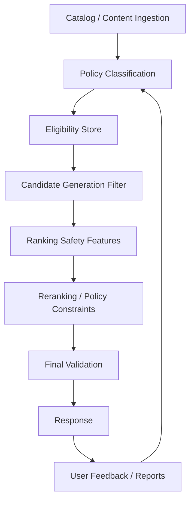

------
title: Build From Scratch Recommendations System - Part 070
description: Mendesain safety, abuse, dan policy enforcement untuk recommendation system production-grade: policy taxonomy, harmful content/items/actions, spam/fraud/gaming, trust signals, safety classifiers, enforcement layers, appeals, monitoring, incident response, and governance.
series: learn-build-from-scratch-recommendations-system
seriesTitle: Build From Scratch: Enterprise Recommendations System
order: 70
partTitle: Safety, Abuse, and Policy Enforcement
tags:
  - recommendation-system
  - recsys
  - safety
  - abuse-prevention
  - policy-enforcement
  - trust-and-safety
  - series
date: 2026-07-02
---

# Part 070 — Safety, Abuse, and Policy Enforcement

Recommendation system mengalokasikan perhatian.

Jika sistem salah, ia tidak hanya menampilkan item yang kurang relevan. Ia bisa memperkuat:

- harmful content,
- spam,
- scam,
- fraud,
- abusive sellers/creators,
- low-quality clickbait,
- policy-violating items,
- restricted products,
- unsafe advice,
- unauthorized enterprise actions,
- sensitive or inappropriate recommendations,
- manipulative campaigns,
- coordinated abuse.

Recommendation system production-grade harus punya safety dan policy enforcement sebagai first-class design.

Safety tidak bisa hanya “nanti difilter di UI”.

Part ini membahas safety, abuse, dan policy enforcement untuk recommendation system: policy taxonomy, safety classifiers, enforcement layers, trust signals, abuse/gaming, feedback loops, human review, appeals, monitoring, incident response, and governance.

Catatan: ini adalah materi desain sistem dan governance. Untuk policy final, sesuaikan dengan domain, regulasi, dan trust & safety/legal team organisasi.

---

## 1. Mental Model: RecSys Amplifies Whatever It Rewards

Jika model reward-nya click, maka sistem bisa memperkuat hal yang memancing click.

Jika candidate source mengambil trending tanpa abuse filter, spam bisa trending.

Jika business boost terlalu kuat, item low-quality bisa naik.

Jika safety hanya final check yang stale, konten bermasalah bisa lolos.

Recommendation system harus mengoptimalkan:

```text
relevance + value + safety + policy compliance + ecosystem health
```

Bukan hanya engagement.

---

## 2. Safety Is Multi-Layered

Safety enforcement harus ada di beberapa lapisan:



Jangan hanya mengandalkan satu filter terakhir.

Defense-in-depth.

---

## 3. Policy Taxonomy

Define policy categories.

Examples:

```text
allowed
needs_review
restricted
age_or_region_restricted
limited_distribution
demonetized
search_only
not_recommendable
blocked
deleted
```

Recommendation needs more nuance than allowed/deleted.

Some content may be allowed to exist but not eligible for recommendation.

---

## 4. Recommendability State

Item can be:

```text
visible
searchable
recommendable
promotable
sponsored_eligible
notification_eligible
```

Example:

```text
controversial but allowed article:
  visible: true
  searchable: true
  recommendable: limited
  push_eligible: false
```

Recommendability is a policy decision separate from existence.

---

## 5. Safety Policy Contract

Each item/action/document should have policy state.

```json
{
  "item_id": "item_123",
  "policy_state": "limited_distribution",
  "recommendability": {
    "home_feed": false,
    "search": true,
    "email": false,
    "push": false
  },
  "policy_reasons": ["sensitive_topic"],
  "review_status": "approved_limited",
  "policy_version": "trust_policy_2026_06",
  "updated_at": "2026-07-02T08:00:00Z"
}
```

Candidate generation and ranking should consume this state.

---

## 6. Harm Types by Domain

### Content

```text
harassment
misinformation
self-harm
adult/violent content
hate/extremism
spam/clickbait
low-quality engagement bait
```

### Commerce

```text
counterfeit
fraud seller
restricted products
unsafe products
misleading listing
review manipulation
```

### Enterprise

```text
unauthorized action
wrong policy document
unsafe automation
compliance violation
confidential data leak
```

### Knowledge/LLM

```text
hallucinated advice
unsafe instruction
unsupported claims
prompt injection
```

Policy taxonomy depends on product.

---

## 7. Abuse and Gaming

Actors may try to manipulate RecSys.

Examples:

```text
bot clicks
fake views
review farms
keyword stuffing
metadata spam
coordinated sharing
seller collusion
creator engagement pods
clickbait thumbnails
fake freshness
LLM-generated spam
prompt injection in content
```

Recommendation system can amplify abuse if signals are naive.

Trust signals must be integrated.

---

## 8. Trust Signals

Use safety/trust features:

```text
creator_trust_score
seller_fraud_risk
item_report_rate
policy_violation_history
review_authenticity_score
bot_adjusted_engagement
content_quality_score
metadata_quality_score
account_age
appeal_status
moderation_state
```

These can be hard filters or rank features.

High-risk signals should gate eligibility.

---

## 9. Safety Classifiers

Safety classifiers can classify:

- content text,
- images/video/audio,
- product listings,
- reviews,
- comments,
- enterprise documents,
- user-generated metadata.

Classifier outputs:

```text
probability by policy category
confidence
review needed
policy version
model version
```

But classifier is not final policy alone.

Use thresholds + human review + rules.

---

## 10. Classifier Thresholds

Thresholds depend on risk.

Example:

```yaml
policy_category: restricted_product
auto_block_threshold: 0.95
manual_review_threshold: 0.60
allow_below: 0.20
```

For high-risk domain, use conservative thresholds.

Threshold tuning affects false positives/negatives.

Monitor both.

---

## 11. Human Review

Human review needed for:

- borderline policy cases,
- high-impact creator/seller decisions,
- appeals,
- high-stakes enterprise workflows,
- classifier uncertainty,
- severe reports.

Review output should update policy state and training data.

Human review queue is part of safety system.

---

## 12. Appeals and Correction

Policy decisions can be wrong.

Need:

- appeal process,
- review history,
- corrected labels,
- restore recommendability if approved,
- audit trail.

If item incorrectly blocked, creators/sellers may be harmed.

Safety system should support correction.

---

## 13. Enforcement Layers

Policy can enforce at:

### Catalog Ingestion

Reject or mark item.

### Candidate Generation

Do not retrieve not-recommendable items.

### Eligibility Filter

Remove invalid candidates.

### Ranking

Use risk/quality features.

### Reranking

Cap risky categories, enforce distribution.

### Final Validation

Last safety check.

### Post-Response Monitoring

User reports/negative signals.

Multiple layers reduce risk.

---

## 14. Candidate Generation Safety

Candidate source must respect:

```text
recommendable=true
tenant allowed
region allowed
surface allowed
policy state valid
```

ANN index should ideally exclude blocked items.

But because index can be stale, final filter still required.

---

## 15. Ranking Safety Features

Ranker features:

```text
item_quality_score
report_rate_smoothed
hide_rate
creator_trust
seller_fraud_risk
policy_limited_distribution_flag
metadata_quality
review_authenticity
```

Ranking can downrank borderline low-quality items.

But hard policy should not rely only on model learning.

---

## 16. Reranking Safety Constraints

Slate-level constraints:

```text
max limited-distribution items
no consecutive sensitive topics
no push/email for sensitive items
diversify away from risky source
cap sponsored items
prevent repeated controversial content
```

For some surfaces, certain categories should be excluded entirely.

---

## 17. Final Validation

Before response, check:

```text
item policy state
surface recommendability
region/age/tenant constraints
user blocks
campaign/sponsored eligibility
disclosure
current deletion/tombstone
```

Final validation prevents stale index/cache/list issues.

Critical safety state should be fresh or fail closed.

---

## 18. Safety and Surface Risk

Surface matters.

| Surface | Safety Strictness |
|---|---|
| search results | contextual, user-initiated |
| home feed | proactive recommendation |
| email | proactive/off-platform |
| push | very proactive/high trust impact |
| checkout | commerce-critical |
| enterprise action | high-stakes/workflow |

Proactive surfaces need stricter recommendability.

Allowed in search does not imply allowed in push.

---

## 19. Safety and User Context

Safety can depend on:

```text
age
region
locale
enterprise role
tenant policy
user controls
query intent
session context
```

Example:

```text
restricted product allowed in one region but not another
```

Policy engine must use context.

Avoid one global rule if policy is context-specific.

---

## 20. Safety and Exploration

Exploration must be safety-gated.

Rules:

```text
explore only policy-approved candidates
apply quality floor
apply trust floor
apply report-rate guardrail
cap exposure
stop on negative feedback
```

Never explore unsafe/unknown policy items to “learn”.

Unknown high-risk policy should not be explored.

---

## 21. Safety and Cold-Start

New items have little feedback.

Risk:

```text
new item spam/fraud gets exploration exposure
```

Mitigation:

- metadata quality checks,
- creator/seller trust tier,
- policy classifier,
- small exposure budget,
- report guardrails,
- human review for high-risk category,
- progressive ramp.

Cold-start exposure should be earned.

---

## 22. Safety and Trending

Trending is abuse-prone.

Controls:

```text
bot-adjusted engagement
trust-weighted events
report-rate guardrails
creator/seller trust
velocity anomaly detection
minimum quality score
policy state filter
cooldown for sudden spikes
```

Raw clicks/views should not drive trending alone.

---

## 23. Safety and Sponsored Recommendations

Sponsored must pass:

```text
advertiser eligibility
item policy
targeting policy
disclosure
relevance floor
frequency cap
user controls
region/age constraints
campaign status
```

Sponsored boost must not override safety.

Policy > sponsored revenue.

---

## 24. Safety and LLM-Augmented RecSys

LLM risks:

- hallucinated item facts,
- unsafe explanation,
- prompt injection,
- unsupported policy advice,
- recommending disallowed items,
- leaking confidential data.

Controls:

- retrieved eligible candidates only,
- grounded evidence,
- output validation,
- safety classifier,
- prompt injection mitigation,
- template fallback,
- no autonomous high-stakes action.

LLM should not bypass policy engine.

---

## 25. Safety and Enterprise Actions

Enterprise recommendation safety:

```text
only valid actions for workflow state
actor permission checked
tenant policy checked
audit log produced
confidence shown
human approval required if high risk
no cross-tenant document/action
```

For enterprise, invalid action can be worse than no recommendation.

Fail conservative.

---

## 26. Safety Feedback Loop

User reports/hides should feed:

- item safety state,
- creator/seller trust,
- ranker negative features,
- moderation queue,
- suppression,
- candidate source filters.

But avoid abuse:

```text
malicious mass reporting
competitor attacks
brigading
```

Use trust-weighted reports and review.

---

## 27. Abuse Detection Signals

Signals:

```text
sudden engagement spike
high click low dwell
high report after click
new account engagement cluster
same IP/device farm
review duplication
metadata keyword stuffing
creator network anomaly
seller refund spike
```

These signals can feed trust/risk models.

---

## 28. Trust-Weighted Engagement

Not all engagement equal.

Example:

```text
bot clicks weight 0
low-trust account clicks weight low
verified purchaser review weight high
long-term satisfied user signal weight high
```

Trending/popularity should use trust-weighted events.

This reduces gaming.

---

## 29. Safety Metrics

Monitor:

```text
policy violation exposure
report rate
hide rate
unsafe classifier score distribution
limited-distribution exposure
appeal overturn rate
moderation queue backlog
time to enforcement
time to removal from recsys
fraud seller exposure
bot-adjusted engagement share
```

By surface, category, source, model version, tenant.

---

## 30. Safety Guardrails in Experiments

Every experiment should include safety guardrails.

Examples:

```text
report rate not increase
policy violation count zero
limited distribution exposure within cap
spam/fraud exposure not increase
negative feedback by segment not increase
```

Safety guardrail breach can stop experiment even if CTR improves.

---

## 31. Safety Incident Response

Examples:

- banned item recommended,
- abusive content amplified,
- cross-tenant document shown,
- fraudulent seller boosted,
- harmful item sent via push/email.

Response:

1. disable item/category/source/campaign,
2. invalidate caches/index tombstone,
3. rollback model/policy if needed,
4. identify exposure scope,
5. audit logs,
6. notify stakeholders,
7. root cause,
8. add tests/alerts.

Containment first.

---

## 32. Emergency Kill Switches

Kill switches:

```text
block item
block category
block creator/seller
disable candidate source
disable trending
disable sponsored
disable exploration
force safe fallback
disable LLM explanations
disable push recommendations
```

Must be:

- fast,
- audited,
- scoped,
- reversible,
- monitored.

Emergency safety should not require code deploy.

---

## 33. Policy State Propagation

When item becomes blocked:

```text
catalog policy state updates
eligibility store updates
ANN tombstone updates
cache invalidates
precomputed lists final-filter
batch pipelines exclude
training labels annotated
```

Monitor propagation lag.

Safety state must propagate faster than batch rebuild.

---

## 34. Tombstone and Denylist

Maintain fast denylist:

```text
blocked_item_ids
blocked_creator_ids
blocked_campaign_ids
blocked_tenant_docs
```

Check denylist at final validation.

Even if stale cache/index contains item, denylist prevents response.

Denylist must be highly available.

---

## 35. Policy Versioning

Policy decisions depend on policy version.

Log:

```text
policy_version
classifier_version
rule_bundle_version
review_status
enforcement_timestamp
```

If policy changes, previous recommendations need audit context.

---

## 36. Safety in Training Data

Training should avoid learning to amplify unsafe content.

Options:

- exclude blocked content after effective time,
- include negative labels for reports/hides,
- add risk features,
- downweight suspicious engagement,
- annotate policy-limited content,
- remove bot/fraud signals.

Do not train popularity on fraudulent clicks.

---

## 37. Data Leakage in Safety Models

Safety model training needs careful labels.

Avoid leakage:

```text
using post-enforcement outcome as pre-enforcement feature
using future report count at prediction time
training with labels not mature
```

Safety features for ranking must be point-in-time.

---

## 38. Abuse-Resistant Popularity

Popularity score should be:

```text
trust_weighted
bot_filtered
report_adjusted
time_decayed
smoothed
segment_aware
```

Example:

```text
safe_popularity =
  trusted_clicks
  - 5 * reports
  - 2 * hides
  + purchases_or_saves
```

Raw views are dangerous.

---

## 39. Quality Floors

Before recommendation:

```text
minimum item quality
minimum creator trust
minimum metadata completeness
minimum policy confidence
minimum relevance
```

Quality floor can be surface-specific.

Push/email should have higher quality floors than feed.

---

## 40. Limited Distribution

Some items are not blocked but should be limited.

Examples:

```text
borderline content
low-confidence policy classification
new low-trust creator
sensitive topic
high complaint rate
```

Limit:

- lower rank,
- cap exposure,
- exclude proactive surfaces,
- require search intent,
- require human review.

---

## 41. Appeals and Metrics

Monitor:

```text
appeal rate
appeal success rate
false positive categories
time to review
creator/seller impact
```

Too many overturned blocks indicate classifier/policy problem.

Safety also needs fairness to producers.

---

## 42. Governance

Safety governance includes:

```text
policy owners
classification thresholds
review process
appeals
experiment guardrails
emergency authority
audit requirements
model/rule approval
incident response
```

ML team should not invent safety policy alone.

---

## 43. Safety Review for New Sources

Before launching new candidate source:

Ask:

```text
Does it respect policy state?
Does it filter tenant/region?
Can it amplify spam?
Does it use trust-weighted signals?
What is invalid candidate rate?
Can we disable it quickly?
What guardrails/alerts exist?
```

Every new source is new amplification path.

---

## 44. Safety Review for New Models

Before deploying model:

- check negative feedback metrics,
- check report risk,
- check source/category exposure,
- check sensitive segments,
- check calibration for risk tasks,
- check feature reliance on unsafe proxy,
- run shadow/canary safety dashboard.

CTR lift alone is not enough.

---

## 45. Safety Review for New Business Rules

Business rule can override ranking.

Check:

```text
Can boost override safety?
Does campaign meet policy?
Is relevance floor enforced?
Are caps defined?
Are disclosures present?
Is expiry set?
```

Business rules are frequent safety risk.

---

## 46. Common Failure Modes

### 46.1 Safety Only at Final Filter

Stale/costly and misses upstream amplification.

### 46.2 Sponsored Boost Overrides Policy

Revenue over safety.

### 46.3 Trending Uses Raw Bot Clicks

Spam amplification.

### 46.4 ANN Index Contains Blocked Items Without Tombstone

Stale retrieval.

### 46.5 Exploration Includes Unknown-Risk Items

Unsafe learning.

### 46.6 Report Feedback Not Applied

Bad items persist.

### 46.7 Policy State Not Versioned

Audit impossible.

### 46.8 LLM Recommends Non-Eligible Item

Grounding failure.

### 46.9 Enterprise Permission Fail-Open

Security incident.

### 46.10 No Kill Switch

Incident lasts too long.

---

## 47. Implementation Sketch: Policy State

```java
public record PolicyState(
    String itemId,
    String policyVersion,
    Recommendability recommendability,
    Set<String> policyReasons,
    ReviewStatus reviewStatus,
    Instant updatedAt
) {}

public record Recommendability(
    boolean homeFeedAllowed,
    boolean searchAllowed,
    boolean emailAllowed,
    boolean pushAllowed,
    boolean sponsoredAllowed
) {}

public enum ReviewStatus {
    APPROVED,
    APPROVED_LIMITED,
    NEEDS_REVIEW,
    BLOCKED,
    DELETED
}
```

Surface-specific recommendability is important.

---

## 48. Implementation Sketch: Safety Gate

```java
public final class SafetyEligibilityGate {
    public EligibilityDecision evaluate(
        Candidate candidate,
        RequestContext context,
        PolicyState policyState
    ) {
        if (policyState.reviewStatus() == ReviewStatus.BLOCKED) {
            return EligibilityDecision.reject("policy_blocked");
        }

        if (!isAllowedOnSurface(policyState.recommendability(), context.surface())) {
            return EligibilityDecision.reject("not_recommendable_on_surface");
        }

        if (!context.regionPolicy().allows(candidate.itemId())) {
            return EligibilityDecision.reject("region_policy_restricted");
        }

        return EligibilityDecision.pass();
    }
}
```

Hard safety gates should be deterministic and testable.

---

## 49. Implementation Sketch: Trust-Weighted Popularity

```java
public final class TrustWeightedPopularity {
    public double score(ItemEngagementStats stats) {
        double positive =
            stats.trustedClicks()
            + 3.0 * stats.saves()
            + 5.0 * stats.purchases();

        double negative =
            4.0 * stats.hides()
            + 20.0 * stats.reports()
            + 10.0 * stats.refunds();

        return smooth(positive - negative, stats.impressions());
    }

    private double smooth(double raw, long impressions) {
        double prior = 0.0;
        double strength = 100.0;
        return (raw + strength * prior) / (impressions + strength);
    }
}
```

Numbers are domain-specific and should be validated.

---

## 50. Minimal Production Safety Plan

Start with:

```yaml
policy_state:
  recommendability_by_surface: true
  policy_version_logged: true
candidate_generation:
  policy_filter: true
  trust_weighted_trending: true
eligibility:
  final_safety_check: true
  tombstone_denylist: true
ranking:
  safety_features:
    - item_quality
    - report_rate
    - creator_trust
    - policy_limited_flag
experiments:
  safety_guardrails: required
operations:
  kill_switches:
    - item
    - category
    - source
    - campaign
    - exploration
  incident_runbook: true
monitoring:
  policy_violation_exposure: zero
  report_rate: true
  enforcement_lag: true
  invalid_candidate_rate: true
```

Then mature into classifiers, human review queues, appeals, and abuse graph detection.

---

## 51. Checklist Safety, Abuse, and Policy Enforcement Readiness

```text
[ ] Policy taxonomy is defined.
[ ] Recommendability is separate from visibility/searchability.
[ ] Policy state is available in serving.
[ ] Candidate sources filter policy-ineligible items.
[ ] Final safety validation exists.
[ ] Tombstone/denylist exists for emergency blocks.
[ ] Trust/risk features are available to ranking.
[ ] Trending/popularity uses abuse-resistant signals.
[ ] Exploration is safety-gated.
[ ] Sponsored cannot override safety.
[ ] User reports/hides feed enforcement.
[ ] Safety guardrails exist in experiments.
[ ] Policy/classifier/rule versions are logged.
[ ] Emergency kill switches exist.
[ ] Safety metrics and alerts exist.
[ ] Human review/appeals process exists where needed.
[ ] Enterprise permission/policy failures fail closed.
[ ] LLM outputs are grounded and validated.
[ ] Safety incident runbook exists.
```

---

## 52. Kesimpulan

Safety, abuse prevention, dan policy enforcement memastikan recommendation system tidak menjadi mesin amplifikasi untuk konten/item/action yang berbahaya atau melanggar policy.

Prinsip utama:

1. RecSys amplifies whatever it rewards.
2. Safety must be multi-layered.
3. Recommendability is distinct from visibility/searchability.
4. Candidate generation, ranking, reranking, and final validation all need safety awareness.
5. Trending/popularity must be abuse-resistant.
6. Exploration must never bypass safety.
7. Sponsored/business boosts cannot override policy.
8. Safety signals should feed both hard filters and ranking features.
9. Policy versions, enforcement decisions, and safety incidents must be auditable.
10. Kill switches and tombstones are required for fast containment.

Di Part 071, kita akan membahas **Security and Access Control**: bagaimana mendesain tenant isolation, service auth, data access, debug access, model/artifact security, API authorization, and enterprise-grade security boundaries untuk recommendation platform.
