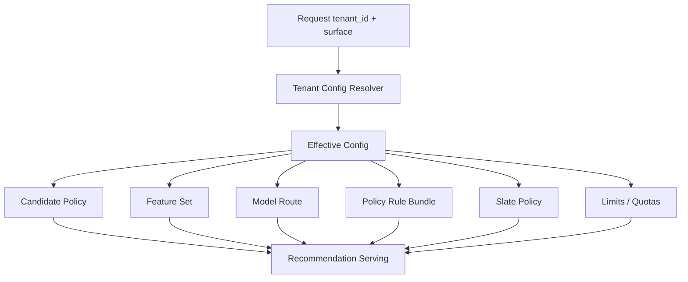

------
title: Build From Scratch Recommendations System - Part 072
description: Mendesain multi-tenant dan enterprise configuration untuk recommendation system production-grade: tenant isolation, tenant-aware configs, overrides, model routing, feature availability, policy bundles, quotas, rollout, limits, schema, admin control plane, audit, dan governance.
series: learn-build-from-scratch-recommendations-system
seriesTitle: Build From Scratch: Enterprise Recommendations System
order: 72
partTitle: Multi-Tenant and Enterprise Configuration
tags:
  - recommendation-system
  - recsys
  - multi-tenant
  - enterprise
  - configuration
  - governance
  - series
date: 2026-07-02
---

# Part 072 — Multi-Tenant and Enterprise Configuration

Enterprise recommendation platform jarang punya satu konfigurasi global.

Tenant A mungkin ingin:

```text
strict policy
tenant-specific model
no cross-tenant learning
limited LLM usage
EU-only data processing
```

Tenant B mungkin ingin:

```text
global model
aggressive personalization
custom business rules
more exploration
higher recommendation volume
```

Tenant C mungkin punya:

```text
small data
custom catalog schema
different workflow
strict role permissions
tenant-specific feature availability
```

Multi-tenant RecSys harus bisa berbeda per tenant **tanpa fork kode**.

Part ini membahas desain multi-tenant dan enterprise configuration: tenant isolation, tenant-aware configs, overrides, model routing, feature availability, policy bundles, quotas, rollout, admin control plane, audit, governance, and failure modes.

---

## 1. Mental Model: Same Platform, Different Tenant Decision Policies

Goal:

```text
one platform
many tenant-specific behaviors
strong isolation
controlled configuration
auditable changes
safe defaults
```

Architecture:



Effective config is central.

---

## 2. Why Enterprise Config Is Hard

Enterprise differences include:

- tenant data isolation,
- regulatory region,
- catalog schema,
- custom workflows,
- role permissions,
- policy requirements,
- model routing,
- feature availability,
- data retention,
- experiment eligibility,
- LLM/provider constraints,
- quota/cost limits,
- SLAs,
- admin approvals.

Hardcoding tenant behavior creates unmaintainable code.

Use versioned configuration.

---

## 3. Configuration Layers

Common config hierarchy:

```text
global default
environment default
product/surface default
region default
tenant default
tenant surface override
experiment override
emergency override
```

Example order:

```text
effective = global
  overridden by surface
  overridden by region
  overridden by tenant
  overridden by tenant_surface
  overridden by experiment
  overridden by emergency
```

Precedence must be explicit.

---

## 4. Effective Config

Effective config is resolved at request time or cached.

Example:

```yaml
tenant_id: tenant_123
surface: case_next_actions
candidate_policy: case_actions_candidate_v4
feature_set: tenant_123_case_features_v2
model_route: tenant_123_case_ranker_prod
rule_bundle: tenant_123_policy_rules_v8
slate_policy: case_actions_slate_v3
privacy_policy: tenant_123_privacy_v5
limits:
  max_candidates: 500
  max_final_items: 10
  timeout_ms: 180
```

Log effective config version with decision.

---

## 5. Config as Artifact

Treat config like production artifact.

Each config has:

```text
name
version
scope
owner
created_at
status
checksum
approval
dependencies
rollback target
```

Do not edit production config directly without version.

---

## 6. Tenant Config Schema

Example:

```yaml
TenantRecommendationConfig:
  tenant_id: string
  version: string
  status: draft|validated|production|archived
  data_policy:
    cross_tenant_learning: boolean
    region_processing: string
    retention_profile_days: integer
  serving:
    default_timeout_ms: integer
    fallback_policy: string
  surfaces:
    case_next_actions:
      enabled: boolean
      model_route: string
      candidate_policy: string
      feature_set: string
      rule_bundle: string
      slate_policy: string
```

Schema validation prevents malformed config.

---

## 7. Config Validation

Before publish, validate:

```text
referenced model route exists
feature set exists
rule bundle valid
candidate policy valid
slate policy valid
tenant permissions valid
quotas within allowed range
region/data residency compliant
LLM setting approved
fallback exists
no incompatible overrides
```

Invalid config should not reach production.

---

## 8. Tenant Isolation Modes

Isolation options:

### Logical Isolation

Shared infrastructure, tenant_id partitioning.

### Namespace Isolation

Separate cache/index/table namespace per tenant.

### Physical Isolation

Separate cluster/database/index.

### Hybrid

Large/high-risk tenants isolated more strongly.

Choice depends on security, scale, and cost.

---

## 9. Tenant-Aware Model Routing

Model route can be:

```text
global_home_ranker_prod
region_id_home_ranker_prod
tenant_123_home_ranker_prod
tenant_123_case_ranker_prod
```

Routing config:

```yaml
model_routing:
  default: global_home_ranker_prod
  tenant_overrides:
    tenant_123: tenant_123_home_ranker_prod
```

Small tenants usually use global model + tenant-specific calibration/rules.

Large tenants may have tenant-specific model.

---

## 10. Tenant-Specific Calibration

Good compromise:

```text
global model
tenant-specific calibration
tenant-specific utility weights
```

Why?

- less data needed,
- lower operational cost,
- adapts score scale,
- preserves isolation preferences.

Config:

```yaml
model_route: global_case_ranker_prod
calibration_route: tenant_123_case_calibration_v4
utility_policy: tenant_123_case_utility_v3
```

---

## 11. Tenant Feature Availability

Not every tenant has same data.

Feature availability matrix:

| Feature | Tenant A | Tenant B |
|---|---:|---:|
| case_sla_risk | yes | no |
| document_embedding | yes | yes |
| actor_skill_profile | no | yes |
| customer_segment | yes | restricted |

Feature set must adapt.

Missing tenant-specific feature should be intentional, not accidental.

---

## 12. Feature Fallback by Tenant

If feature unavailable:

```yaml
feature: actor_skill_profile
tenant_123:
  available: false
  fallback: role_based_prior
```

Feature defaults should be configured and tested per tenant.

Do not let missing enterprise feature become null chaos.

---

## 13. Tenant Catalog Differences

Tenants may have different:

```text
item types
document schemas
action taxonomy
workflow states
language/localization
policy labels
metadata quality
```

Recommendation platform needs schema adapters.

Do not assume one global catalog schema.

---

## 14. Tenant-Specific Candidate Policies

Example:

```yaml
candidate_policy: tenant_123_case_actions_v4
sources:
  similar_cases:
    enabled: true
    quota: 200
  policy_documents:
    enabled: true
    quota: 100
  global_best_practices:
    enabled: false
  editorial_required_actions:
    enabled: true
    quota: 20
```

Tenant may disable sources for compliance/security.

---

## 15. Tenant-Specific Rule Bundles

Rule bundle:

```yaml
rule_bundle: tenant_123_rules_v8
rules:
  - only_recommend_actions_allowed_by_role
  - exclude_documents_classified_confidential_for_external_agents
  - require_jurisdiction_match
  - cap_low_confidence_actions
```

Rules must be versioned and auditable.

---

## 16. Tenant Policy Overrides

Overrides should be constrained.

Bad:

```text
tenant can arbitrarily override safety-critical global rules
```

Good:

```text
tenant can add stricter rules, but cannot disable global safety baseline
```

Use hierarchy:

```text
global mandatory rules
regional regulatory rules
tenant stricter overrides
surface rules
```

Critical global rules should be non-overridable.

---

## 17. Tenant-Specific Privacy/Data Policy

Config:

```yaml
data_policy:
  cross_tenant_learning: false
  allow_behavioral_personalization: true
  allow_llm_processing: false
  data_residency: EU
  profile_retention_days: 90
  debug_trace_retention_days: 7
```

Serving/training pipelines must enforce.

---

## 18. Tenant-Specific LLM Configuration

Some tenants may disallow LLM or require specific runtime.

Config:

```yaml
llm:
  enabled: true
  allowed_use_cases:
    - explanation
    - intent_parsing
  provider: internal_only
  send_confidential_documents: false
  prompt_logging: redacted
```

LLM settings are security/privacy-sensitive.

---

## 19. Tenant Limits and Quotas

Limits:

```text
QPS
batch scoring volume
max candidates
max LLM calls
debug trace access
training job quota
vector index size
storage retention
experiment traffic
```

Example:

```yaml
limits:
  online_qps: 500
  max_candidates_to_rank: 800
  llm_daily_requests: 10000
  debug_trace_daily_access: 100
```

Quotas protect platform and cost.

---

## 20. Tenant SLAs

Enterprise tenants may have SLAs:

```text
availability
latency
data residency
support response
batch freshness
index freshness
audit log retention
```

Config may include SLA class.

```yaml
sla_tier: enterprise_gold
```

Serving and operations can prioritize accordingly.

---

## 21. Tenant Rollout Strategy

Rollouts can be:

- global,
- region-specific,
- tenant-specific,
- surface-specific,
- cohort-specific.

For enterprise, often:

```text
internal tenant -> pilot tenant -> small production tenant -> large tenant
```

Tenant-by-tenant rollout reduces blast radius.

---

## 22. Tenant Experimentation

Not all tenants allow experiments.

Config:

```yaml
experimentation:
  enabled: true
  allowed_experiment_types:
    - ranker_shadow
    - canary
  max_treatment_traffic_percent: 10
  requires_tenant_approval: true
```

Enterprise customers may require explicit approval.

---

## 23. Tenant Holdouts

For measuring value:

```text
tenant-level pilot
actor-level A/B
case-level A/B
module-level holdout
```

Small tenant sample sizes can make A/B hard.

Use shadow mode, expert evaluation, staged rollout, and qualitative feedback.

---

## 24. Tenant Admin Control Plane

Admin tool should allow:

- view effective config,
- propose config change,
- validate config,
- approve/reject,
- schedule rollout,
- rollback,
- view audit,
- view metrics by tenant,
- manage emergency overrides.

Admin access must be restricted and audited.

---

## 25. Config Approval Workflow

Example workflow:

1. Draft change.
2. Schema validation.
3. Dependency validation.
4. Security/privacy validation.
5. Policy validation.
6. Owner approval.
7. Tenant approval if required.
8. Canary rollout.
9. Production activation.
10. Audit log.

Config change is production deployment.

---

## 26. Config Diff

Before approving, show diff:

```diff
- model_route: global_case_ranker_prod
+ model_route: tenant_123_case_ranker_v2

- max_candidates_to_rank: 500
+ max_candidates_to_rank: 1000

+ llm.enabled: true
```

Diff helps reviewers understand impact.

---

## 27. Effective Config Debug

Debug tool should show:

```text
global default
surface default
tenant override
experiment override
emergency override
effective value
```

This answers:

```text
Why did tenant use this model/rule?
```

Without config explainability, enterprise support is painful.

---

## 28. Emergency Overrides

Emergency config:

```text
disable source for tenant
force fallback
block model route
disable LLM
disable experiment
tighten rule
```

Requirements:

- high priority,
- time-limited,
- audit,
- approval/break-glass,
- automatic expiry if possible.

Emergency overrides should not become permanent hidden config.

---

## 29. Config Drift

Config drift:

```text
tenant configs diverge without governance
old overrides linger
unused rules remain
tenant model route stale
emergency override never removed
```

Monitor config drift.

Periodic review:

```text
which tenants override global?
which overrides are old?
which configs reference archived models?
```

---

## 30. Tenant Observability

Metrics by tenant:

```text
qps
latency
fallback rate
empty slate rate
candidate count
feature missing
model version
policy violation
event logging
batch freshness
index freshness
business metrics
```

Tenant dashboards are essential for enterprise support.

---

## 31. Tenant-Specific Alerts

Alerts:

```text
tenant fallback spike
tenant empty slate spike
tenant feature unavailable
tenant policy violation
tenant QPS quota exceeded
tenant index stale
tenant batch scoring missed SLA
tenant cross-boundary violation
```

Large tenants may need custom thresholds.

---

## 32. Tenant Data Residency

Some tenants require data in specific region.

Impacts:

- event storage,
- feature store,
- profile store,
- training jobs,
- model artifacts,
- logs/debug traces,
- LLM processing,
- backup/replication.

Config should encode residency.

Serving should route accordingly.

---

## 33. Tenant-Specific Model Training

For tenant-specific model:

Need:

```text
tenant dataset
tenant feature set
tenant label definitions
tenant privacy policy
tenant evaluation
tenant model registry route
tenant deployment approval
```

Small data may cause overfitting. Use global prior or transfer learning carefully if allowed.

---

## 34. Cross-Tenant Learning

Cross-tenant learning can improve quality but raises privacy/compliance questions.

Options:

```text
disabled
aggregate-only
shared global model
shared embeddings
federated/isolation-aware
tenant-specific calibration
```

This is product/legal/security decision, not purely ML.

Record in tenant data policy.

---

## 35. Tenant-Specific Batch Scoring

Batch lists:

```text
tenant_id + subject_id + surface
```

Need tenant-specific:

- eligibility,
- role permissions,
- policy rules,
- feature availability,
- TTL,
- final online check.

Do not generate global batch list for tenant-specific enterprise actions.

---

## 36. Tenant-Specific Vector Index

Options:

- index per tenant,
- shared index with tenant filter,
- hybrid by tenant size/security.

Config:

```yaml
vector_indexes:
  case_doc_index:
    mode: dedicated
    alias: tenant_123_case_doc_index
```

Shared index requires robust tenant filters and final permission checks.

---

## 37. Tenant-Specific Fallbacks

Fallback lists must be tenant-safe.

Examples:

```text
tenant default actions
tenant approved documents
tenant regional popular items
tenant editorial safe list
```

Global fallback may not be valid for enterprise tenant.

If no tenant fallback, safe empty may be better.

---

## 38. Config and Code Boundary

Config should express policy choices, not arbitrary code.

Good config:

```yaml
source quota: 200
model route: x
rule bundle: y
max same category: 3
```

Bad config:

```text
tenant-defined script executed in serving path
```

Arbitrary code config is security/operability risk.

If custom logic needed, implement controlled extension points.

---

## 39. Controlled Extension Points

Extension types:

```text
custom candidate source plugin
custom rule bundle
custom feature adapter
custom model route
custom slate policy
custom explanation template
```

Each extension needs:

- schema,
- validation,
- sandbox/permissions,
- ownership,
- tests,
- rollout,
- rollback.

Do not let extensions bypass global safety/security.

---

## 40. Tenant Configuration Testing

Tests:

```text
effective config resolves correctly
tenant cannot disable mandatory safety rule
model route exists
feature set available
rule bundle validates
fallback exists
limits within platform max
LLM settings approved
data residency compatible
```

Run config tests in CI/control plane before activation.

---

## 41. Tenant Sandbox

For enterprise onboarding:

- sandbox tenant,
- synthetic data,
- test configs,
- shadow recommendations,
- evaluation dashboards,
- admin training.

Do not test new tenant config directly in production.

---

## 42. Tenant Onboarding Workflow

Steps:

1. Create tenant.
2. Configure data policy.
3. Configure catalog/action schema.
4. Configure permissions integration.
5. Configure feature availability.
6. Configure candidate sources.
7. Configure model route.
8. Configure rule bundle.
9. Configure fallback.
10. Run validation.
11. Shadow/pilot.
12. Production activation.

Onboarding should be checklist-driven.

---

## 43. Tenant Offboarding

Offboarding:

- stop serving,
- disable batch jobs,
- delete/retain data per contract,
- remove model routes,
- archive configs,
- remove indexes,
- revoke access,
- audit completion.

Offboarding is as important as onboarding.

---

## 44. Config Observability

Monitor:

```text
active config version by tenant
config age
override count
emergency override active
invalid config attempts
config rollout status
config reference to deprecated artifact
```

Config health is platform health.

---

## 45. Common Failure Modes

### 45.1 Fork Code per Tenant

Unmaintainable.

### 45.2 Tenant Override Disables Safety

Policy incident.

### 45.3 Missing Tenant in Cache/Index

Data leak.

### 45.4 Global Fallback Used for Restricted Tenant

Invalid recommendation.

### 45.5 Config Change Without Audit

Untraceable incident.

### 45.6 Feature Missing for Tenant

Model silently defaults poorly.

### 45.7 Tenant-Specific Model Route Stale

Old model never updated.

### 45.8 LLM Enabled Without Privacy Approval

Data leak risk.

### 45.9 Emergency Override Never Removed

Long-term drift.

### 45.10 No Effective Config Debug

Support cannot explain behavior.

---

## 46. Implementation Sketch: Config Scope

```java
public record ConfigScope(
    String environment,
    String region,
    String tenantId,
    String surface,
    Optional<String> experimentId
) {}
```

Effective config resolver uses scope.

---

## 47. Implementation Sketch: Tenant RecSys Config

```java
public record TenantRecommendationConfig(
    String tenantId,
    String version,
    DataPolicyConfig dataPolicy,
    Map<String, SurfaceRecommendationConfig> surfaces,
    TenantLimits limits,
    ConfigStatus status
) {}

public record SurfaceRecommendationConfig(
    boolean enabled,
    String candidatePolicyVersion,
    String featureSetVersion,
    String modelRoute,
    String ruleBundleVersion,
    String slatePolicyVersion,
    String fallbackPolicyVersion
) {}
```

Keep config typed and schema-validated.

---

## 48. Implementation Sketch: Effective Config Resolver

```java
public final class EffectiveConfigResolver {
    public EffectiveRecommendationConfig resolve(ConfigScope scope) {
        EffectiveRecommendationConfig config = defaults.global();

        config = config.merge(defaults.forRegion(scope.region()));
        config = config.merge(defaults.forSurface(scope.surface()));
        config = config.merge(tenantConfig(scope.tenantId()));
        config = config.merge(tenantSurfaceOverride(scope.tenantId(), scope.surface()));

        scope.experimentId().ifPresent(exp ->
            config = config.merge(experimentOverride(exp))
        );

        config = config.merge(emergencyOverrides(scope));

        validator.validate(config);
        return config;
    }
}
```

Actual Java needs mutation-safe implementation, but concept stands.

---

## 49. Implementation Sketch: Config Validation

```java
public final class TenantConfigValidator {
    public ValidationResult validate(TenantRecommendationConfig config) {
        List<String> errors = new ArrayList<>();

        for (SurfaceRecommendationConfig surface : config.surfaces().values()) {
            requireExists("candidatePolicy", surface.candidatePolicyVersion(), errors);
            requireExists("featureSet", surface.featureSetVersion(), errors);
            requireExists("modelRoute", surface.modelRoute(), errors);
            requireExists("ruleBundle", surface.ruleBundleVersion(), errors);
            requireExists("fallbackPolicy", surface.fallbackPolicyVersion(), errors);
        }

        if (config.dataPolicy().crossTenantLearningDisabled()
            && referencesGlobalTenantTrainingRoute(config)) {
            errors.add("Config references global training route while cross-tenant learning disabled");
        }

        return new ValidationResult(errors.isEmpty(), errors);
    }
}
```

Validation prevents dangerous runtime surprises.

---

## 50. Minimal Production Multi-Tenant Config Plan

Start with:

```yaml
config:
  schema_versioned: true
  effective_config_resolver: true
  global_surface_tenant_layers: true
  config_validation: true
  config_diff: true
  audit_log: true
tenant_isolation:
  tenant_id_required: true
  tenant_in_cache_keys: true
  tenant_in_feature_profile_keys: true
  tenant_in_logs: true
routing:
  tenant_model_route_optional: true
  tenant_rule_bundle: true
  tenant_fallback: true
limits:
  qps_quota: true
  max_candidates: true
  llm_quota: true
admin:
  approval_workflow: true
  rollback: true
  emergency_override: true
observability:
  tenant_dashboard: true
  config_version_metrics: true
```

---

## 51. Checklist Multi-Tenant and Enterprise Configuration Readiness

```text
[ ] Tenant config schema exists.
[ ] Config layers and precedence are defined.
[ ] Effective config is logged with decisions.
[ ] Tenant isolation mode is documented.
[ ] Tenant ID is included in keys/caches/indexes/logs.
[ ] Tenant-specific model routing is supported.
[ ] Tenant-specific rule bundles are supported.
[ ] Tenant-specific feature availability is handled.
[ ] Tenant-specific fallback exists or safe empty is defined.
[ ] Global mandatory safety/security rules cannot be disabled by tenant override.
[ ] Config validation checks references and compatibility.
[ ] Config changes require approval and audit.
[ ] Config diff is visible to reviewers.
[ ] Emergency overrides are scoped, audited, and expiring.
[ ] Tenant dashboards and alerts exist.
[ ] Data residency/privacy settings are enforced.
[ ] Tenant onboarding/offboarding workflows exist.
[ ] Tenant experiments require proper approval if needed.
[ ] Config drift is monitored.
```

---

## 52. Kesimpulan

Multi-tenant enterprise configuration memungkinkan satu platform recommendation melayani banyak tenant dengan kebutuhan berbeda tanpa fork kode dan tanpa kehilangan governance.

Prinsip utama:

1. Same platform, different tenant decision policies.
2. Tenant-specific behavior should be config-driven, versioned, validated, and audited.
3. Effective config must be explainable and logged.
4. Global safety/security baselines should not be disable-able by tenant overrides.
5. Tenant isolation applies to data, caches, indexes, logs, models, configs, and admin tools.
6. Feature availability and fallback must be tenant-aware.
7. Tenant-specific model routing and calibration should be supported gradually.
8. Admin control plane is required for safe enterprise operations.
9. Emergency overrides need expiry and audit.
10. Config drift must be monitored.

Di Part 073, kita akan membahas **Cost, Capacity, and Performance Engineering**: bagaimana menghitung dan mengoptimalkan cost/QPS/candidate scoring/vector search/feature store/model inference/batch pipelines untuk RecSys skala besar.
