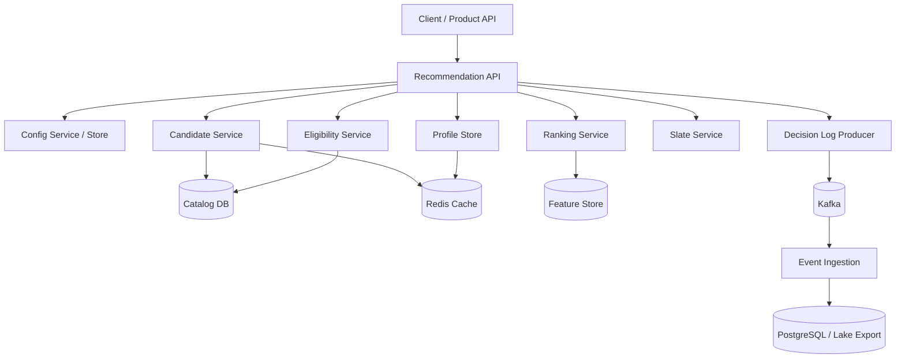

------
title: Build From Scratch Recommendations System - Part 075
description: Mendesain minimum production skeleton untuk recommendation system from scratch: service boundaries, repository structure, OpenAPI contracts, event schemas, PostgreSQL/Redis/Kafka integration, candidate/ranking/reranking skeleton, feature/profile stores, observability, CI/CD, and first production slice.
series: learn-build-from-scratch-recommendations-system
seriesTitle: Build From Scratch: Enterprise Recommendations System
order: 75
partTitle: Minimum Production Skeleton
tags:
  - recommendation-system
  - recsys
  - build-from-scratch
  - production-skeleton
  - java
  - system-design
  - series
date: 2026-07-02
---

# Part 075 — Minimum Production Skeleton

Mulai Part 075, kita masuk Module 10: **Build From Scratch Implementation Tracks**.

Setelah membahas mental model, data, candidate generation, ranking, reranking, serving, MLOps, observability, governance, security, privacy, safety, dan operating model, sekarang kita membangun bentuk minimal yang realistis.

Bukan dummy project.

Bukan playground.

Bukan “recommend item random dari array”.

Minimum production skeleton berarti:

```text
kecil enough untuk dibangun,
tetapi punya boundary, contract, event, observability, fallback, config, dan lifecycle yang benar.
```

Skeleton ini belum harus punya deep learning canggih. Tetapi ia harus punya struktur yang bisa tumbuh menjadi platform production-grade.

Part ini membahas blueprint minimum production skeleton untuk recommendation system: service boundaries, repository structure, OpenAPI contracts, event schemas, PostgreSQL/Redis/Kafka, candidate/ranking/reranking skeleton, feature/profile stores, decision logging, observability, CI/CD, and first production slice.

---

## 1. Mental Model: Build the Production Shape Before the Fancy Model

Kesalahan umum:

```text
build model first, platform later
```

Untuk production RecSys, lebih aman:

```text
build decision platform skeleton first,
then improve candidate/ranking quality iteratively
```

Minimum skeleton should support:

- request/response contract,
- candidate source plugin,
- eligibility filtering,
- basic ranking,
- slate construction,
- tracking tokens,
- decision logging,
- event ingestion,
- feature/profile minimal,
- observability,
- fallback,
- config-driven behavior,
- testing.

Jika bentuk ini benar, model bisa diganti bertahap.

---

## 2. First Production Slice

Target first slice:

```text
Home recommendations for known users and anonymous users
```

Capabilities:

- personalized if profile exists,
- contextual fallback if no profile/consent,
- item eligibility,
- simple ranker,
- diversity/frequency basic,
- decision log,
- impression/click feedback,
- dashboard,
- safe fallback.

Not included initially:

- deep neural ranker,
- real-time two-tower training,
- advanced bandit,
- complex LLM agent,
- full multi-tenant enterprise config,
- automated retraining.

Start correct, not bloated.

---

## 3. Skeleton Architecture



Minimum can be modular monolith first, but preserve module boundaries.

---

## 4. Start Modular Monolith or Microservices?

For first skeleton, prefer **modular monolith** or small service set.

Why?

- faster iteration,
- easier debugging,
- fewer distributed failures,
- simpler deployment,
- lower ops overhead.

But design modules as if they can split later:

```text
rec-api
candidate
eligibility
ranking
slate
profile
feature
events
config
```

Do not create 12 microservices before product fit.

---

## 5. Suggested Repository Structure

```text
recommendation-platform/
  README.md
  docs/
    architecture/
    api/
    runbooks/
  contracts/
    openapi/
      recommendation-api.yaml
    events/
      decision-log.avsc
      impression-event.avsc
      action-event.avsc
  services/
    rec-api/
    event-ingestion/
    batch-jobs/
  libs/
    rec-domain/
    rec-contracts/
    rec-observability/
    rec-testing/
  infrastructure/
    docker-compose.yml
    local/
    migrations/
  pipelines/
    feature-jobs/
    dataset-builder/
  dashboards/
  scripts/
```

Even if one JVM app, keep contracts and domain modules clean.

---

## 6. Java Module Layout

Example Maven/Gradle modules:

```text
rec-domain
rec-api-contract
rec-application
rec-candidate
rec-eligibility
rec-ranking
rec-slate
rec-profile
rec-feature
rec-events
rec-config
rec-observability
rec-infra-postgres
rec-infra-redis
rec-infra-kafka
rec-service
```

Domain should not depend on infrastructure.

Keep business logic testable.

---

## 7. Core Domain Objects

Minimum domain:

```java
public record RecommendationRequest(
    String requestId,
    Subject subject,
    Surface surface,
    RequestContext context,
    int limit
) {}

public record Candidate(
    String itemId,
    String itemType,
    List<SourceEvidence> sources,
    Map<String, Object> attributes
) {}

public record RankedCandidate(
    Candidate candidate,
    double score,
    Map<String, Double> scoreComponents
) {}

public record RecommendationSlate(
    String slateId,
    List<RecommendationItem> items,
    SlateMetadata metadata
) {}
```

Use explicit types for request, candidate, ranked candidate, and slate.

---

## 8. API Contract

OpenAPI endpoint:

```yaml
POST /v1/recommendations/{surface}
```

Request:

```json
{
  "request_id": "req_001",
  "subject": {
    "user_id": "u123",
    "anonymous_id": "anon_456",
    "session_id": "sess_789",
    "tenant_id": "default"
  },
  "context": {
    "region": "ID",
    "locale": "id-ID",
    "device_type": "mobile",
    "privacy_mode": "personalized"
  },
  "limit": 20,
  "debug": false
}
```

Response:

```json
{
  "request_id": "req_001",
  "slate_id": "slate_abc",
  "items": [
    {
      "item_id": "item_123",
      "position": 1,
      "tracking_token": "opaque-token",
      "reason_codes": ["popular_in_category"]
    }
  ],
  "metadata": {
    "model_version": "baseline_ranker_v1",
    "policy_version": "home_slate_v1",
    "fallback_used": false
  }
}
```

---

## 9. Tracking Token

Tracking token should encode or reference:

```text
request_id
slate_id
impression_id
item_id
position
surface
model version
policy version
experiment variant
```

Token should be opaque to client.

Use signed token or server-side lookup.

Do not trust client-supplied item/position without validation if used for training.

---

## 10. Event Contracts

Minimum events:

1. decision log,
2. impression event,
3. action event,
4. item catalog event,
5. user feedback/suppression event.

Impression event:

```json
{
  "event_id": "evt_001",
  "request_id": "req_001",
  "slate_id": "slate_abc",
  "impression_id": "imp_001",
  "item_id": "item_123",
  "position": 1,
  "surface": "home_feed",
  "user_id": "u123",
  "event_time": "2026-07-02T10:00:00Z",
  "tracking_token": "opaque-token"
}
```

Action event:

```json
{
  "event_id": "evt_002",
  "impression_id": "imp_001",
  "action_type": "click",
  "event_time": "2026-07-02T10:01:00Z"
}
```

---

## 11. Decision Log

Decision log captures system decision.

Fields:

```text
request_id
slate_id
surface
subject hash/id
context
candidate counts by source
filter counts/reasons
model version
policy version
experiment variants
final slate item IDs
scores sampled or full if allowed
fallback reason
latency by stage
```

Decision log is internal.

It powers:

- debugging,
- training,
- attribution,
- replay,
- observability.

---

## 12. Data Stores Minimum

Use:

### PostgreSQL

For:

- catalog snapshot,
- item metadata,
- config metadata,
- decision log query index if needed,
- event ingestion checkpoint,
- batch outputs small scale.

### Redis

For:

- profile/session state,
- cache,
- fallback lists,
- frequency counters,
- suppression state small scale.

### Kafka

For:

- decision log stream,
- impression/action events,
- catalog events,
- profile update stream.

This stack can grow.

---

## 13. Catalog Table

Minimum table:

```sql
CREATE TABLE rec_items (
    item_id TEXT PRIMARY KEY,
    item_type TEXT NOT NULL,
    title TEXT,
    category_id TEXT,
    creator_id TEXT,
    region TEXT,
    language TEXT,
    active BOOLEAN NOT NULL,
    recommendable BOOLEAN NOT NULL,
    quality_score DOUBLE PRECISION,
    created_at TIMESTAMPTZ NOT NULL,
    updated_at TIMESTAMPTZ NOT NULL
);
```

Do not recommend if `active=false` or `recommendable=false`.

---

## 14. User Profile Table/Cache

Simple profile:

```json
{
  "user_id": "u123",
  "top_categories": {
    "camera": 0.8,
    "laptop": 0.4
  },
  "recent_item_ids": ["item_1", "item_2"],
  "updated_at": "2026-07-02T09:50:00Z"
}
```

Initial profile can be built from recent clicks/views.

Store in Redis for serving.

Later, move to proper profile store/feature store.

---

## 15. Feature Store Minimum

Do not overbuild feature store initially.

Start with:

```text
item_features table/cache
user_profile cache
request context features
candidate source features
```

Feature object:

```java
public record FeatureValue(
    String name,
    Object value,
    boolean missing,
    String missingReason
) {}
```

Add feature registry metadata from day one.

Even if simple.

---

## 16. Candidate Sources Minimum

Implement three sources:

1. Popular/trending by region/category.
2. Content/category-based from user profile.
3. Similar-to-recent-item.

Candidate source interface:

```java
public interface CandidateSource {
    String name();

    CandidateSourceResult generate(CandidateRequest request);
}
```

Result:

```java
public record CandidateSourceResult(
    String sourceName,
    List<Candidate> candidates,
    CandidateSourceDiagnostics diagnostics
) {}
```

---

## 17. Popular Candidate Source

SQL example:

```sql
SELECT item_id, quality_score
FROM rec_items
WHERE active = true
  AND recommendable = true
  AND region = :region
ORDER BY quality_score DESC, created_at DESC
LIMIT :limit;
```

Better later:

- smoothed CTR,
- trust-weighted popularity,
- time decay,
- segment trending.

But start safe and deterministic.

---

## 18. Profile Category Candidate Source

If user profile has categories:

```text
camera: 0.8
laptop: 0.4
```

Fetch active items in those categories.

Score source evidence:

```text
profile_category_affinity * item_quality
```

This creates simple personalization.

If profile missing, source returns empty.

---

## 19. Similar Recent Item Source

Use item metadata/category:

```text
recent clicked item category -> similar items from same category
```

Later replace with item-to-item co-occurrence or embedding.

For skeleton, category similarity is enough.

---

## 20. Candidate Aggregation

Aggregate:

- run sources in parallel if possible,
- merge candidates,
- dedup by item_id,
- preserve source evidence,
- cap candidate count.

```java
public final class CandidateAggregator {
    public List<Candidate> merge(List<CandidateSourceResult> sourceResults) {
        Map<String, Candidate> byItem = new LinkedHashMap<>();

        for (CandidateSourceResult result : sourceResults) {
            for (Candidate candidate : result.candidates()) {
                byItem.merge(
                    candidate.itemId(),
                    candidate,
                    Candidate::mergeEvidence
                );
            }
        }

        return new ArrayList<>(byItem.values());
    }
}
```

---

## 21. Eligibility Filter Minimum

Rules:

```text
active item
recommendable item
region match
language if needed
not suppressed
not recently seen
not duplicate
```

Filter result:

```java
public record FilterDecision(
    String itemId,
    boolean allowed,
    String reasonCode
) {}
```

Log rejection counts.

---

## 22. Suppression Minimum

Support:

- hidden item,
- blocked creator,
- recently seen item.

Redis keys:

```text
user:{userId}:hidden_items
user:{userId}:blocked_creators
user:{userId}:seen_items_7d
```

Apply before ranking.

User controls should work quickly.

---

## 23. Ranking Minimum

Start with heuristic ranker.

Score:

```text
score =
  0.50 * source_score
  + 0.30 * item_quality_score
  + 0.20 * profile_category_match
  - 0.30 * seen_penalty
  - 0.50 * low_quality_penalty
```

This is transparent, debuggable, and safe.

Do not start with black-box model if platform cannot debug yet.

---

## 24. Ranker Interface

```java
public interface RankingService {
    RankingResult rank(RankingRequest request);
}

public record RankingRequest(
    List<Candidate> candidates,
    Subject subject,
    RequestContext context,
    FeatureBundle features,
    RankingConfig config
) {}

public record RankingResult(
    List<RankedCandidate> ranked,
    RankingDiagnostics diagnostics
) {}
```

Later replace heuristic with GBDT/deep model without changing orchestration.

---

## 25. Reranking Minimum

Rerank for:

- no duplicate item,
- max same category,
- max same creator,
- final limit,
- optional exploration slot,
- final eligibility check.

Greedy selection:

```text
iterate ranked candidates
skip if violates hard slate rule
add until limit
```

This is enough for first production slice.

---

## 26. Slate Policy Config

```yaml
surface: home_feed
limit: 20
max_same_category: 5
max_same_creator: 3
min_quality_score: 0.2
allow_exploration: false
fallback_policy: home_fallback_v1
```

Keep as config, not hardcoded.

---

## 27. Fallback Minimum

Fallback hierarchy:

```text
personalized candidates
-> regional popular
-> editorial safe
-> empty safe
```

Fallback should still pass eligibility.

Log fallback reason.

Fallback is not optional.

---

## 28. Config Store Minimum

Use YAML or DB-backed config.

Config types:

```text
surface config
candidate source config
ranking config
slate policy
fallback policy
feature set
```

Version configs:

```text
home_surface_v1
baseline_ranker_v1
home_slate_v1
```

Log versions in response metadata and decision log.

---

## 29. Observability Minimum

Metrics:

```text
request count
latency p50/p95/p99
candidate count by source
filter rejection by reason
ranker latency
final slate size
fallback rate
empty slate rate
decision log success
impression/click event volume
```

Logs:

- structured request summary,
- decision log,
- error logs.

Traces:

- stage spans.

---

## 30. Debug Endpoint

Internal only:

```text
GET /internal/debug/recommendations/{request_id}
```

Returns:

- context,
- candidates by source,
- filter reasons,
- key features,
- scores,
- reranking decisions,
- final slate,
- fallback.

Must be access-controlled and redacted.

---

## 31. Local Development Environment

Docker Compose:

```text
postgres
redis
kafka
recommendation-service
event-ingestion-service
```

Seed data:

- items,
- profiles,
- configs.

Scripts:

```text
load sample catalog
simulate impressions/clicks
run local recommendation request
```

Good local environment accelerates learning.

---

## 32. CI Pipeline

CI checks:

```text
compile
unit tests
contract tests
schema compatibility
migration tests
static analysis
container build
integration tests with testcontainers
```

Contract tests for API/events are important.

Do not break tracking event schema casually.

---

## 33. CD Pipeline

CD stages:

```text
build artifact
run tests
deploy to staging
run smoke tests
shadow/canary
deploy production
monitor
rollback capability
```

Even skeleton should have rollback.

---

## 34. Testing Strategy

Tests:

### Unit

- candidate aggregation,
- filter rules,
- ranking score,
- reranking policy,
- tracking token generation.

### Integration

- DB/Redis/Kafka,
- API response,
- event emission.

### Contract

- OpenAPI,
- event schemas.

### Regression

- hidden item not recommended,
- inactive item not recommended,
- fallback works.

---

## 35. Load Test Minimum

Test:

```text
100 QPS
500 QPS
cold cache
candidate source timeout
Redis unavailable
ranker exception
Kafka unavailable
```

Measure:

- latency,
- fallback,
- error rate,
- decision logging.

Even small skeleton should know its failure behavior.

---

## 36. Event Ingestion Minimum

Pipeline:

```text
Kafka impression/action event
-> validate schema
-> dedup by event_id
-> store clean event
-> update profile/session/suppression if needed
```

For skeleton, profile update can be simple:

```text
on click -> increment category affinity
on impression -> add to seen set
on hide -> add item to hidden set
```

---

## 37. Profile Update Minimum

Pseudo-code:

```java
public void handleClick(ActionEvent event) {
    Item item = catalog.get(event.itemId());
    profileStore.incrementCategoryAffinity(event.userId(), item.categoryId(), 1.0);
    profileStore.addRecentItem(event.userId(), event.itemId());
}
```

Use decay later.

---

## 38. Decision Logging Minimum

Emit asynchronously.

If Kafka fails:

- buffer if possible,
- metric/alert,
- do not block response unless compliance requires.

Decision log completeness metric:

```text
decision_log_success_rate
```

---

## 39. Privacy Minimum

Implement:

- privacy mode in request,
- personalized vs non-personalized path,
- no profile fetch in non-personalized mode,
- debug redaction,
- user hide/suppression.

Tests:

```text
non_personalized request does not use profile
hidden item excluded
```

---

## 40. Safety Minimum

Implement:

- item active/recommendable flags,
- policy denylist/tombstone,
- final eligibility check,
- quality floor,
- report/hide negative feedback.

Safety should not wait for advanced classifier.

---

## 41. Security Minimum

Implement:

- API authentication or gateway assumption,
- internal debug authorization,
- tenant_id propagation if enterprise,
- config/admin restricted,
- no raw score exposure externally,
- audit for debug access.

Even internal prototypes leak if debug endpoints open.

---

## 42. Minimal Database Migrations

Tables:

```text
rec_items
rec_surface_config
rec_decision_log_index
rec_event_ingestion_checkpoint
rec_fallback_items
rec_experiment_assignment_optional
```

Events can go to Kafka/log storage; Postgres can index metadata for debugging.

---

## 43. Minimal Dashboard

Dashboard panels:

```text
QPS
latency p95/p99
candidate count by source
filter rejection by reason
fallback rate
empty slate rate
top categories in slate
decision log success
impression/click volume
CTR basic
```

This is enough to operate first slice.

---

## 44. First Release Plan

Phase 1:

```text
internal/staging only
```

Phase 2:

```text
1% traffic with safe fallback
```

Phase 3:

```text
A/B against existing baseline/editorial
```

Phase 4:

```text
gradual rollout
```

Do not launch full traffic without observability/fallback.

---

## 45. What Not to Build Yet

Avoid initially:

```text
full feature store platform
deep ranker
bandit optimizer
complex multi-objective utility
full tenant admin UI
custom workflow DSL
LLM autonomous recommender
real-time retraining
massive microservice split
```

Build hooks/interfaces for future, not full complexity.

---

## 46. Production Readiness Gate for Skeleton

Gate:

```text
contract stable
fallback works
hidden/inactive items excluded
decision logs emitted
impressions/clicks tracked
latency within SLO
dashboard live
debug trace works
rollback exists
privacy mode works
on-call/runbook exists
```

If any missing, not production-ready.

---

## 47. Common Skeleton Failure Modes

### 47.1 Too Much ML, Too Little Platform

Cannot debug/operate.

### 47.2 No Event Tracking

Cannot learn.

### 47.3 No Fallback

Outage on dependency failure.

### 47.4 No Filter Reasons

Bad recs impossible to debug.

### 47.5 No Privacy Mode

Personalization cannot be governed.

### 47.6 No Config Versioning

Behavior untraceable.

### 47.7 No Decision Log

Training/debugging broken.

### 47.8 No Local Environment

Slow iteration.

### 47.9 Microservices Too Early

Ops overhead.

### 47.10 No Regression Tests

Safety bugs repeat.

---

## 48. Implementation Milestone Checklist

### Milestone A — Contracts

```text
[ ] OpenAPI recommendation endpoint
[ ] event schemas
[ ] domain objects
```

### Milestone B — Serving Core

```text
[ ] candidate sources
[ ] eligibility
[ ] ranker
[ ] reranker
[ ] fallback
```

### Milestone C — Feedback Loop

```text
[ ] decision log
[ ] impression/action events
[ ] profile update
```

### Milestone D — Operations

```text
[ ] metrics
[ ] traces
[ ] debug endpoint
[ ] dashboard
[ ] load test
```

### Milestone E — Governance Basics

```text
[ ] privacy mode
[ ] safety denylist
[ ] security for debug
[ ] config versioning
```

---

## 49. Minimal Production Skeleton Summary

Skeleton should deliver:

```text
POST /recommendations/home_feed
```

with:

- multi-source candidates,
- eligibility filtering,
- simple transparent ranking,
- greedy slate policy,
- fallback,
- tracking tokens,
- decision logging,
- impression/click tracking,
- basic profile update,
- privacy-aware path,
- observability/debugging,
- tests/deploy/rollback.

This is the foundation for all advanced RecSys work.

---

## 50. Kesimpulan

Minimum production skeleton adalah bentuk terkecil yang masih punya DNA production-grade.

Prinsip utama:

1. Build production shape before fancy model.
2. Start with a narrow first production slice.
3. Preserve module boundaries even in modular monolith.
4. Contracts, events, and decision logs are foundational.
5. Candidate/ranking/reranking should be replaceable modules.
6. Fallback, filter reasons, and debug traces are mandatory.
7. Privacy/safety/security basics must exist from the start.
8. Observability and CI/CD are part of the product.
9. Do not overbuild advanced ML before feedback loop works.
10. Skeleton should be small, safe, operable, and extensible.

Di Part 076, kita akan membangun track konkret: **Ecommerce Recommendation System** — mapping semua konsep ke domain e-commerce: home, PDP, cart, checkout, email/push, cold-start products, sellers, inventory, promotions, returns, and marketplace health.
