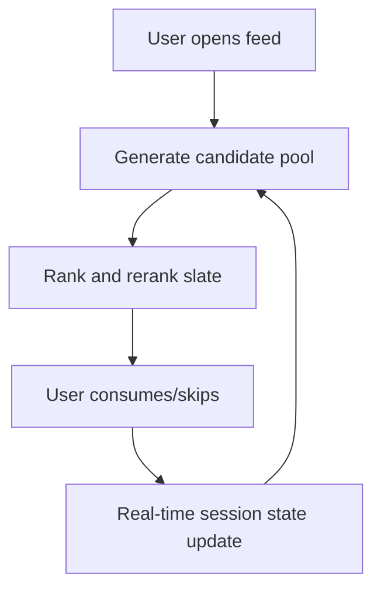

------
title: Build From Scratch Recommendations System - Part 077
description: Mendesain content feed recommendation system production-grade: feed/news/video/social/learning content, freshness, session intent, dwell, completion, creator ecosystem, diversity, safety, fatigue, exploration, ranking objectives, and implementation blueprint.
series: learn-build-from-scratch-recommendations-system
seriesTitle: Build From Scratch: Enterprise Recommendations System
order: 77
partTitle: Content Feed Recommendation System
tags:
  - recommendation-system
  - recsys
  - content-feed
  - feed-ranking
  - creator-ecosystem
  - safety
  - series
date: 2026-07-02
---

# Part 077 — Content Feed Recommendation System

Content feed recommendation system muncul di banyak domain:

- news feed,
- video feed,
- short-form video,
- social feed,
- learning content feed,
- article recommendation,
- podcast/music feed,
- community feed,
- knowledge feed,
- creator/subscription feed.

Domain ini berbeda dari e-commerce.

Di e-commerce, outcome seperti add-to-cart/purchase cukup jelas.  
Di content feed, user mungkin scroll cepat, klik karena penasaran, menonton lama, menyesal, hide, report, kembali lagi, atau berhenti setelah doomscrolling.

Content feed harus menyeimbangkan:

```text
engagement
satisfaction
freshness
safety
diversity
creator ecosystem
fatigue
long-term trust
```

Part ini membahas content feed recommendation system production-grade: domain model, surfaces, event semantics, candidate sources, ranking objectives, session/context modeling, freshness, dwell/completion, creator ecosystem, safety, diversity, fatigue, experimentation, observability, and implementation blueprint.

---

## 1. Mental Model: Feed Is a Continuous Slate Decision System

Content feed bukan hanya satu list.

Feed adalah sequence of decisions:

```text
slot 1, slot 2, slot 3, ...
```

User memberi feedback terus-menerus:

```text
impression
viewability
click
dwell
watch time
completion
like
share
comment
save
follow
hide
report
skip
scroll speed
session end
```

Feed harus adaptif terhadap session intent dan fatigue.



Feed is not a static ranking problem.

---

## 2. Content Entity Model

Content entities:

```text
post
article
video
short
course
lesson
podcast episode
creator
publisher
topic
hashtag
community
playlist
series
thread
comment
```

Important fields:

```text
content_id
creator_id
publisher_id
topic_ids
language
region
format
duration
created_at
published_at
freshness_window
quality_score
safety_state
engagement_stats
content_embedding
thumbnail/image metadata
```

Content metadata quality strongly affects RecSys quality.

---

## 3. Content Lifecycle

Content lifecycle:

```text
draft
published
eligible
limited_distribution
not_recommendable
expired
deleted
archived
```

Fresh content may need exploration.  
Old evergreen content may still be valuable.  
Expired news may become misleading.

Recommendation system must understand lifecycle.

---

## 4. Surfaces

Content recommendation surfaces:

| Surface | Objective |
|---|---|
| Home feed | broad personalized discovery |
| Following feed | creator/subscription updates |
| For-you feed | algorithmic discovery |
| Related content | continue topic/session |
| Watch next | sequence continuation |
| Article recommendations | deeper reading |
| Learning path | next useful lesson |
| Notifications | high-confidence timely content |
| Digest/email | summarized updates |
| Search side module | related discovery |

Each surface has different freshness/diversity/safety rules.

---

## 5. Event Semantics

Content events:

```text
impression
viewable_impression
click/open
dwell_time
watch_time
completion_rate
like
dislike
save/bookmark
share
comment
follow_creator
unfollow_creator
hide
not_interested
report
mute_creator
scroll_past
session_end
```

A click can be misleading.  
Dwell/completion/negative feedback often matter more.

---

## 6. Viewability

An impression is not always seen.

Log:

```text
rendered
viewable
visible_duration
viewport_position
autoplay_started
sound_on
```

Training on non-viewed impressions as negatives creates noise.

Viewability improves label quality.

---

## 7. Dwell Time

Dwell time can indicate interest.

But raw dwell is tricky:

- long article naturally takes longer,
- video duration differs,
- user may leave tab open,
- slow reading not always satisfaction,
- clickbait can produce short bounce,
- controversial content can produce high dwell.

Use normalized dwell.

Example:

```text
normalized_dwell = dwell_time / expected_dwell_for_content_length
```

---

## 8. Completion Rate

For video/audio/learning:

```text
completion_rate = watched_duration / content_duration
```

Useful but biased:

- short videos easier to complete,
- autoplay can inflate,
- rewatches matter,
- skipping intro matters.

Use duration-aware features.

---

## 9. Satisfaction Signals

Positive:

```text
save
share with comment
follow creator
complete lesson
return to topic
long-term retention
```

Negative:

```text
hide
not interested
report
mute creator
unfollow after exposure
session abandonment
rapid scroll past
```

Satisfaction is multi-signal.

Do not optimize only watch time.

---

## 10. Candidate Sources

Feed candidate sources:

```text
user embedding/two-tower
topic affinity
creator affinity
following/subscription
fresh/trending
similar to recent content
co-consumption
graph/community
editorial
new creator exploration
safety-approved evergreen
search/query intent if applicable
```

Candidate source portfolio should cover:

- relevance,
- freshness,
- diversity,
- exploration,
- following obligations.

---

## 11. Following vs Discovery

Following feed:

```text
content from followed creators/publishers
```

For-you/discovery:

```text
algorithmic content beyond following
```

Mixing requires product decision.

If user follows creator, should content always rank high? Not always.

Need:

- freshness,
- creator fatigue,
- quality,
- user engagement with creator,
- muted/hidden state.

---

## 12. Freshness

Content feed is freshness-sensitive.

Freshness features:

```text
content_age
freshness_decay
topic_trend
creator_recentness
news_expiry
evergreen_score
seasonality
```

Not all content decays equally.

News decays fast.  
Evergreen tutorial may remain useful for years.  
Learning lesson may depend on sequence, not freshness.

---

## 13. Freshness Decay

Simple decay:

```text
freshness_score = exp(-lambda * content_age_hours)
```

Different lambda by content type.

Example:

```yaml
news: fast_decay
short_video: medium_decay
evergreen_tutorial: slow_decay
learning_prerequisite: no_decay_if_relevant
```

Use content type and topic.

---

## 14. Trending Source

Trending can be powerful and risky.

Use trust/safety adjusted trending:

```text
trusted_engagement
report-adjusted
bot-filtered
time-decayed
quality floor
policy-approved
```

Do not use raw views/likes.

Trending can amplify spam, outrage, or manipulation.

---

## 15. Session-Based Ranking

Feed sessions shift quickly.

Session features:

```text
recent topics
recent creators
recent formats
skip/hide signals
scroll speed
dwell trend
query/referrer
session embedding
time since last engagement
```

If user watches three cooking videos, next content may follow cooking intent.

But avoid over-narrowing.

---

## 16. Long-Term vs Short-Term Preference

Long-term profile:

```text
topics, creators, formats, language, depth preference
```

Short-term session:

```text
current intent and fatigue
```

Fusion:

```text
score = base_relevance + session_boost + long_term_boost - fatigue
```

Need gating:

- if session strong, boost session.
- if session weak, rely on long-term.
- if privacy off, use contextual/trending.

---

## 17. Negative Feedback Propagation

If user hides content:

- suppress exact content,
- suppress dedup/similar content maybe,
- reduce topic/creator affinity,
- update session negative vector,
- avoid immediate repetition.

But avoid overreacting to one hide.

Explicit mute/block creator should be strong.

---

## 18. Fatigue Control

Fatigue dimensions:

```text
same content
same creator
same topic
same format
same controversy cluster
same ad/sponsored campaign
same learning difficulty
```

Metrics:

```text
repeat_topic_rate
repeat_creator_rate
hide_after_repetition
session_abandon_after_repetition
```

Reranker should enforce caps/cooldowns.

---

## 19. Diversity

Feed diversity dimensions:

```text
topic
creator
format
fresh vs evergreen
short vs long
popular vs niche
source
viewpoint if applicable
difficulty level for learning
```

Diversity prevents filter bubbles and fatigue.

But irrelevant diversity hurts.

Use relevance floor.

---

## 20. Serendipity

Serendipity in feed:

```text
relevant but not obvious content
adjacent topic
new creator
new format
new learning path
underexplored community
```

Use controlled exploration and quality floors.

Serendipity is not random low-quality injection.

---

## 21. Creator Ecosystem

Feed recommendations affect creators/publishers.

Monitor:

```text
creator exposure concentration
new creator exposure
creator retention
qualified exposure
report rate by creator
creator diversity in slate
publisher quality
long-tail content health
```

Without ecosystem monitoring, feed can become winner-take-all.

---

## 22. Safety and Integrity

Content feed safety risks:

```text
misinformation
harassment
adult/violent content
self-harm
hate/extremism
spam
scams
clickbait
low-quality AI spam
coordinated manipulation
```

Recommendability state is critical.

Some content may be searchable but not proactively recommended.

---

## 23. Policy-Aware Surface Rules

Example:

```yaml
surface: push_notification
allowed_policy_states:
  - approved
excluded:
  - sensitive_topic
  - limited_distribution
  - unreviewed
```

For home feed maybe limited content allowed with caps.

For push/email, stricter.

---

## 24. Feed Ranking Objective

Multi-task predictions:

```text
p_open
p_dwell_satisfied
p_completion
p_like
p_share
p_save
p_follow
p_hide
p_report
p_session_return
```

Utility example:

```text
utility =
  1.0 * p_open
  + 2.0 * p_satisfied_dwell
  + 3.0 * p_save
  + 4.0 * p_follow
  - 5.0 * p_hide
  - 50.0 * p_report
  + freshness_bonus
  + creator_diversity_bonus
```

Weights require product/governance.

---

## 25. Watch Time Trap

Optimizing watch time alone can promote:

- addictive content,
- outrage,
- low-quality long videos,
- passive consumption,
- fatigue.

Guardrails:

- hide/report,
- satisfaction surveys,
- retention,
- diversity,
- session health,
- user controls,
- creator trust,
- content safety.

Long-term satisfaction matters.

---

## 26. Learning Content Feed

Learning domain differs.

Objectives:

```text
completion
skill progression
retention of knowledge
next prerequisite
appropriate difficulty
motivation
long-term mastery
```

Candidate sources:

- next lesson,
- prerequisite remediation,
- similar topic,
- spaced repetition,
- project suggestions,
- mentor/editorial.

Do not rank only by clicks. Learners may avoid hard but useful content.

---

## 27. News Feed Specifics

News requires:

- freshness,
- source credibility,
- topic diversity,
- misinformation safety,
- geographic relevance,
- publisher quality,
- breaking news override,
- expiry of outdated content.

Do not recommend outdated article as current.

Policy and timestamp matter.

---

## 28. Video Feed Specifics

Video requires:

- duration-aware labels,
- autoplay/viewability,
- completion,
- rewatch,
- skip,
- thumbnail/title quality,
- creator affinity,
- safety moderation,
- bandwidth/device context.

Short-form video needs rapid session adaptation.

---

## 29. Social Feed Specifics

Social feed includes graph signals:

```text
friend/follow relationship
community membership
reply/comment graph
creator affinity
social proof
```

Risks:

- echo chambers,
- harassment,
- coordinated manipulation,
- privacy of social actions.

Graph proximity should not bypass safety or user controls.

---

## 30. Candidate Generation Blueprint

Feed candidate sources:

```yaml
candidate_policy: content_feed_v1
sources:
  user_two_tower:
    quota: 600
  session_topic:
    quota: 300
  following:
    quota: 200
  trending_safe:
    quota: 200
  similar_recent:
    quota: 200
  new_creator_explore:
    quota: 100
  editorial:
    quota: 50
```

Reranker controls final mix.

---

## 31. Feature Set Blueprint

User features:

```text
topic affinity
creator affinity
format preference
session length pattern
language preference
negative topic/creator
```

Content features:

```text
topic
creator trust
freshness
duration
quality score
safety score
engagement stats
completion stats
embedding
```

Cross features:

```text
user_topic_match
user_creator_match
session_topic_match
seen_count
similar_to_recent
difficulty_match
```

Context:

```text
surface
device
time
network
locale
session state
```

---

## 32. Reranking Blueprint

Rules:

```text
max same creator
max same topic cluster
min creator diversity
max limited-distribution content
exploration slots with quality floor
following content quota if product requires
freshness quota
avoid recently seen
avoid too many long videos in a row
```

Reranking is crucial for feed experience.

---

## 33. Pagination and Infinite Scroll

Feed often paginates.

Issues:

- no duplicates across pages,
- maintain session state,
- avoid recomputing inconsistent order,
- support refresh,
- track page/position,
- frequency/fatigue across session,
- cache cautiously.

Approaches:

- generate slate chunk with continuation token,
- store served item IDs in session,
- rerank next page with updated state.

---

## 34. Continuation Token

Token includes:

```text
request/session id
served item ids hash/reference
page number
policy/model version
random seed
timestamp
```

Do not trust client token blindly.

Use signed token or server-side state.

---

## 35. Real-Time Session Updates

After each page/impression/action:

- update seen items,
- update session topic vector,
- update skip/hide signals,
- update creator fatigue,
- adjust next page.

This makes feed responsive.

Be careful with event lag.

---

## 36. Notifications

Content notification recommendations:

```text
new creator post
breaking news
learning reminder
high-confidence relevant content
community reply
```

Guardrails:

- opt-in,
- quiet hours,
- frequency cap,
- freshness,
- safety,
- high relevance,
- unsubscribe/disable notification.

Push is intrusive; use stricter threshold.

---

## 37. Email/Digest

Digest can include:

- top posts from followed creators,
- recommended reads,
- learning progress,
- weekly topic summary,
- missed important updates.

Batch scoring + final validation.

Avoid stale/unsafe content.

---

## 38. Feedback Loop Risks

Feed can create:

- filter bubbles,
- polarization,
- addiction,
- creator concentration,
- trend manipulation,
- repeated low-quality content.

Mitigation:

- diversity,
- exploration,
- safety,
- long-term metrics,
- user controls,
- ecosystem monitoring,
- governance.

---

## 39. Offline Evaluation

Metrics:

```text
Recall@K for consumed/saved content
NDCG@K with graded relevance
completion prediction
hide/report risk
calibration
diversity/novelty
creator coverage
freshness
repeat rate
```

Caveat:

- logged feed is highly policy-biased.
- new content lacks labels.
- position/viewability bias strong.

Online experiments required.

---

## 40. Online Experiments

Primary metrics by feed type:

```text
satisfied sessions
saves/shares/follows
completion
return visits
learning progress
```

Guardrails:

```text
hide/report
session abandonment
fatigue
creator concentration
policy violation
latency
```

For content safety, guardrails can override engagement wins.

---

## 41. Observability

Dashboards:

```text
source contribution
topic distribution
creator exposure
freshness distribution
repeat creator/topic
hide/report rate
session length
completion
negative feedback
policy-limited exposure
new creator exposure
fallback rate
event lag
```

By surface, model, region, language, topic.

---

## 42. Debugging Bad Feed Recommendation

Questions:

```text
Which source generated content?
Was it following/trending/exploration?
Was policy state valid?
Was content already seen?
Was topic/creator fatigued?
Which features boosted it?
Was session state correct?
Was explanation grounded?
Was it from fallback?
Was experiment active?
```

Feed debug must include session state and served history.

---

## 43. Safety Incidents

If harmful content recommended:

1. block content/creator/topic if needed,
2. tombstone in final filter,
3. invalidate caches/slates,
4. check source/index,
5. identify exposure scope,
6. inspect policy classifier/review,
7. add regression test/alert.

Safety response must be fast.

---

## 44. Implementation Blueprint

Services/modules:

```text
feed-rec-api
content-catalog
candidate-service
feed-ranking
feed-reranker
session-state
profile-store
safety-policy-service
event-ingestion
creator-exposure-monitor
batch-digest-scoring
```

Start with home feed and related content.

---

## 45. Minimal Feed Skeleton

Phase 1:

```text
safe trending
following source
topic affinity source
similar recent content
heuristic ranker
creator/topic caps
seen suppression
impression/click/dwell/hide events
```

Phase 2:

```text
GBDT ranker
content embeddings
session embedding
creator trust features
batch digest
```

Phase 3:

```text
two-tower retrieval
multi-task ranker
exploration policy
creator ecosystem reranking
advanced safety classifiers
```

---

## 46. Common Failure Modes

### 46.1 Watch Time Optimization Trap

Engagement rises, satisfaction falls.

### 46.2 Trending Amplifies Spam

Raw engagement unsafe.

### 46.3 Same Creator Repeats

Fatigue missing.

### 46.4 Freshness Dominates Quality

Low-quality fresh content.

### 46.5 Old News Recommended as Current

Expiry missing.

### 46.6 Exploration Too Random

Trust loss.

### 46.7 Safety State Stale

Harmful content leaks.

### 46.8 Session Overreaction

One click narrows feed too much.

### 46.9 Creator Ecosystem Concentration

Top creators dominate.

### 46.10 No Viewability

Training labels noisy.

---

## 47. Feed-Specific Regression Tests

Tests:

```text
blocked content not recommended
muted creator excluded
seen item not repeated
same creator cap enforced
same topic cap enforced
limited-distribution excluded from push
old expired news excluded
non-personalized mode skips profile
exploration respects quality floor
continuation token prevents duplicate page items
```

Regression tests protect trust.

---

## 48. Minimal Production Feed Plan

```yaml
surfaces:
  - home_feed
  - related_content
candidate_sources:
  - safe_trending
  - following
  - topic_affinity
  - similar_recent
ranking:
  model: heuristic_then_gbdt
  objectives:
    - open
    - dwell
    - save
    - hide_report_guardrail
reranking:
  creator_cap: true
  topic_cap: true
  seen_suppression: true
  freshness_balance: true
safety:
  recommendability_filter: true
  final_tombstone: true
events:
  viewable_impression: true
  dwell: true
  hide_report: true
observability:
  source_contribution: true
  fatigue_metrics: true
  creator_exposure: true
```

---

## 49. Checklist Content Feed RecSys Readiness

```text
[ ] Content lifecycle/recommendability state exists.
[ ] Viewability is tracked.
[ ] Dwell/completion semantics are normalized.
[ ] Candidate sources include freshness, following, personalization, and safe fallback.
[ ] Session state updates in near real time.
[ ] Negative feedback updates suppression/profile.
[ ] Creator/topic fatigue controls exist.
[ ] Diversity/serendipity have relevance floors.
[ ] Safety policy is surface-aware.
[ ] Trending is trust/safety adjusted.
[ ] Feed pagination prevents duplicates.
[ ] Push/email have stricter safety/frequency rules.
[ ] Creator ecosystem exposure is monitored.
[ ] Watch-time proxy has satisfaction guardrails.
[ ] Debug trace includes session and served history.
[ ] Regression tests cover safety, repetition, and freshness.
```

---

## 50. Kesimpulan

Content feed RecSys berbeda dari e-commerce karena ia bersifat continuous, session-driven, freshness-sensitive, and safety-critical.

Prinsip utama:

1. Feed is a continuous slate decision system.
2. Viewability, dwell, completion, hide/report, and session state matter.
3. Freshness must be balanced with quality and safety.
4. Following, discovery, trending, and exploration need different policies.
5. Session intent should adapt quickly but not over-narrow the feed.
6. Fatigue and repetition controls are essential.
7. Creator ecosystem health is a first-class concern.
8. Safety must be surface-aware, especially for proactive push/email.
9. Watch time alone is dangerous as an objective.
10. Feed debugging needs candidate provenance, session state, policy state, and served history.

Di Part 078, kita akan membahas **B2B and Internal Recommendation System** — recommendation untuk enterprise workflows: next-best-action, document/action/expert recommendation, permission, tenant isolation, audit, human-in-the-loop, and workflow outcomes.
