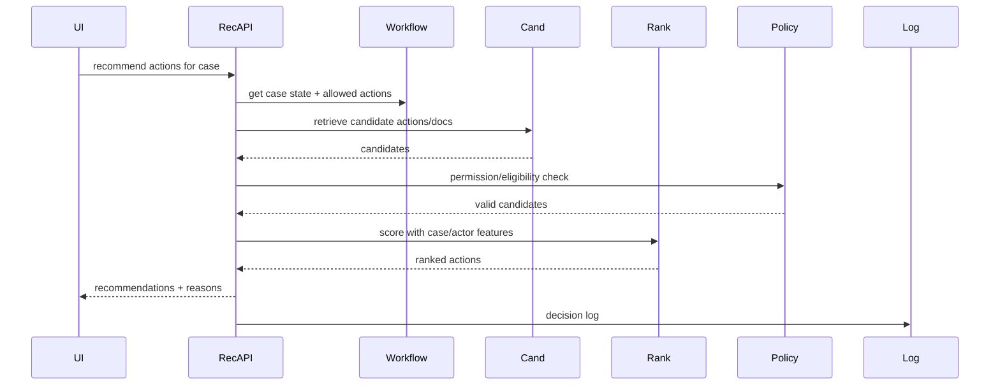

------
title: Build From Scratch Recommendations System - Part 078
description: Mendesain B2B dan internal recommendation system production-grade: next-best-action, document recommendation, expert matching, workflow/case recommendations, tenant isolation, permission, audit, human-in-the-loop, explainability, evaluation, and implementation blueprint.
series: learn-build-from-scratch-recommendations-system
seriesTitle: Build From Scratch: Enterprise Recommendations System
order: 78
partTitle: B2B and Internal Recommendation System
tags:
  - recommendation-system
  - recsys
  - b2b
  - enterprise
  - workflow
  - internal-tools
  - series
date: 2026-07-02
---

# Part 078 — B2B and Internal Recommendation System

Tidak semua recommendation system adalah consumer feed atau e-commerce.

Banyak sistem recommendation bernilai tinggi justru berada di enterprise/internal tools:

- next best action untuk sales/support/ops,
- recommended documents untuk case handling,
- recommended experts/owners,
- recommended workflow step,
- recommended policy/knowledge article,
- recommended remediation action,
- recommended approval path,
- recommended project/task prioritization,
- recommended customer outreach,
- recommended incident runbook,
- recommended code/document context for engineers.

B2B/internal RecSys berbeda dari consumer RecSys.

Ia lebih mementingkan:

```text
permission
auditability
workflow correctness
explainability
human-in-the-loop
tenant isolation
compliance
business process outcome
```

Daripada hanya CTR.

Part ini membahas B2B dan internal recommendation system production-grade: domain model, use cases, workflow context, candidate sources, ranking objectives, permissions, feature design, evaluation, observability, human-in-the-loop, and implementation blueprint.

---

## 1. Mental Model: Recommend Decisions Inside a Workflow

B2B/internal RecSys tidak hanya menjawab:

```text
what item might user like?
```

Tetapi:

```text
what action/document/person should this actor consider next in this workflow state?
```

Context matters deeply:

- tenant,
- actor role,
- permission,
- case/account/project state,
- SLA,
- customer priority,
- policy constraints,
- existing evidence,
- workflow history.

A recommendation may become business action.

Therefore wrong recommendation can be costly.

---

## 2. Common Use Cases

### Next Best Action

Recommend next workflow action.

```text
call customer
send follow-up
escalate case
request document
approve/reject
run remediation
```

### Document Recommendation

Recommend policy/knowledge docs.

### Expert Matching

Recommend colleague/team/expert.

### Case Similarity

Find similar historical cases.

### Sales Recommendations

Next account/customer/product/action.

### Support Recommendations

Troubleshooting steps, macros, articles.

### Engineering Internal

Relevant code docs, owners, runbooks, incidents.

---

## 3. B2B Entity Model

Entities:

```text
tenant
actor/user
role
team
case
account
customer
document
action
workflow step
task
ticket
incident
expert
product/service
policy
runbook
project
```

Recommendation unit can be:

- action,
- document,
- expert,
- case,
- task,
- product,
- runbook.

Define per surface.

---

## 4. Workflow Context

Important context:

```text
case_status
case_priority
SLA_remaining
customer_tier
product_line
issue_type
region/jurisdiction
assigned_team
actor_role
previous_actions
open_tasks
attachments/evidence
policy_version
business calendar
```

Workflow context often matters more than long-term user preference.

---

## 5. Surfaces

B2B/internal surfaces:

| Surface | Recommendation Unit |
|---|---|
| case detail | next action/document/expert |
| dashboard | prioritized cases/tasks |
| account page | next customer action |
| support console | macro/article/remediation |
| incident page | runbook/owner/service |
| CRM | opportunity/customer/product |
| internal search | recommended docs/experts |
| daily digest | tasks/actions/cases |

Each surface has different risk.

---

## 6. Permission Is First-Class

Every recommendation must respect:

```text
tenant access
role permission
object ACL
case assignment
document classification
workflow authorization
regional/jurisdiction policy
data sensitivity
```

Permission check must happen:

- candidate generation,
- eligibility,
- final validation,
- debug access.

No fail-open for enterprise permissions.

---

## 7. Auditability

Enterprise recommendations may need audit.

Log:

```text
who saw recommendation
what was recommended
why
model/policy version
input context version
permission check result
whether accepted/rejected
final action outcome
```

Audit supports compliance, customer trust, and debugging.

---

## 8. Human-in-the-Loop

Many B2B recommendations should assist, not automate.

Patterns:

```text
suggest action for human approval
show confidence and rationale
allow dismiss/feedback
require confirmation for high-risk action
route to reviewer
```

Do not autonomously execute high-risk workflow actions unless explicitly designed and approved.

---

## 9. Explanation Requirements

B2B users often need reasons.

Good explanation:

```text
Recommended because similar cases with product X and error Y were resolved by action Z, and SLA is below 4 hours.
```

Bad explanation:

```text
Our model thinks so.
```

Explanations should be grounded in permissible evidence.

Avoid leaking restricted data.

---

## 10. Candidate Sources for Next Best Action

Sources:

```text
workflow rule-based actions
similar historical cases
policy-driven required actions
SLA/escalation rules
expert-authored playbooks
LLM intent extraction + policy-safe candidates
collaborative actions from similar accounts
graph of case-action-outcome
```

Rule-based source is often important.

ML should complement workflow logic, not replace policy.

---

## 11. Document Recommendation Sources

Sources:

```text
semantic search over knowledge base
case-to-document embeddings
keyword/BM25
similar resolved cases
policy mapping
frequently used docs by issue type
expert curated docs
recently updated policy docs
```

Hard filters:

- tenant,
- ACL,
- document status,
- policy version,
- language/region,
- document freshness.

---

## 12. Expert Recommendation Sources

Sources:

```text
expertise tags
historical case resolution
team membership
availability
load/capacity
region/timezone
role permission
social/org graph
manager/team policy
```

Do not recommend unavailable/unauthorized people.

Expert recommendation has fairness/workload implications.

---

## 13. Case Similarity

Case representation:

```text
issue type
product/service
customer segment
text summary
structured fields
timeline/actions
attachments metadata
resolution outcome
```

Similarity sources:

- text embeddings,
- structured metadata,
- graph,
- historical action sequence.

Use similar cases carefully; old process may be outdated.

---

## 14. Ranking Objective

Possible objectives:

```text
case resolution probability
time to resolution reduction
SLA success
action acceptance
human usefulness rating
reduced rework
customer satisfaction
compliance success
operator productivity
```

Avoid optimizing only click/open.

For internal tools, click may mean curiosity, not usefulness.

---

## 15. Outcome Events

Events:

```text
recommendation_impression
action_view
action_accept
action_execute
action_dismiss
document_open
document_useful
expert_contacted
case_resolved
SLA_met
rework_required
escalation
supervisor_override
manual_feedback
```

Label design should link recommendation to workflow outcome.

---

## 16. Label Windows

Examples:

```yaml
action_accept: 24h
action_execute: 7d
case_resolved: 14d
SLA_met: until SLA deadline
customer_satisfaction: after case close
rework: 30d
```

Many outcomes are delayed.

Do not train only on immediate clicks.

---

## 17. Relevance Is Not Enough

A document can be relevant but unauthorized.  
An action can be likely accepted but non-compliant.  
An expert can be good but overloaded.  
A case can be similar but policy outdated.

Ranking must include constraints and freshness.

---

## 18. Eligibility Rules

Hard filters:

```text
actor permission
tenant match
object ACL
workflow state valid
action allowed in current status
document approved/current
expert available/eligible
jurisdiction match
policy not expired
no conflict of interest
```

Final validation mandatory.

---

## 19. Workflow State Machine

Recommendation should respect state.

Example:

```text
case status = waiting_for_customer
```

Allowed actions:

```text
send reminder
review received document
escalate if overdue
```

Not allowed:

```text
close case without resolution
send duplicate request
```

Workflow engine/source-of-truth should be consulted for critical actions.

---

## 20. Feature Set

Actor features:

```text
role
team
expertise
past action acceptance
workload
timezone
language
```

Case/account features:

```text
priority
SLA remaining
issue type
customer tier
product
region
history
```

Document/action features:

```text
type
policy version
success rate
recency
owner
approval status
```

Cross features:

```text
actor_action_permission
case_action_match
case_document_similarity
actor_expertise_match
tenant_policy_match
```

---

## 21. Tenant and Role Features

Tenant-specific features:

```text
tenant workflow maturity
tenant policy configuration
tenant historical success rate
tenant terminology
tenant catalog/doc schema
```

Role features:

```text
agent
supervisor
admin
engineer
sales rep
analyst
```

Role determines recommended action and explanation depth.

---

## 22. Embeddings for B2B

Embeddings:

```text
case embedding
document embedding
action embedding
account embedding
expert embedding
incident embedding
code/document context embedding
```

Use for:

- semantic retrieval,
- similar cases,
- document matching,
- expert matching.

Must be tenant/permission-aware.

---

## 23. RAG-Style Recommendations

For document/action recommendation:

1. Retrieve allowed documents/actions.
2. Rank with workflow context.
3. Generate explanation grounded in retrieved evidence.
4. Validate output.
5. Log evidence.

LLM should not invent candidate actions outside allowed set.

RAG is retrieval + grounding, not free-form recommendation.

---

## 24. LLM in B2B RecSys

LLM use cases:

- intent extraction from case notes,
- summarizing case context,
- mapping issue to action taxonomy,
- generating explanation,
- drafting response based on recommended doc,
- query expansion.

Controls:

- tenant-aware retrieval,
- no unauthorized context,
- output schema,
- evidence citation,
- human approval,
- prompt injection defense,
- audit logs.

---

## 25. Ranking and Confidence

B2B recommendations should show confidence carefully.

Confidence can be based on:

```text
model probability
evidence strength
similar case count
policy certainty
feature completeness
permission validity
human review status
```

Avoid overconfident claims.

Use labels like:

```text
High confidence because 24 similar resolved cases used this action.
```

---

## 26. Reranking

Reranking constraints:

```text
include required compliance action
prioritize SLA risk
diversify action types
limit same document source
avoid overloading expert
respect user dismissed actions
surface high-confidence first
include exploratory/learning item if safe
```

Enterprise slate is often small and high-impact.

---

## 27. Feedback UX

Internal users should provide feedback:

```text
useful
not useful
wrong permission
outdated document
already tried
not applicable
bad explanation
```

Feedback should improve:

- suppression,
- model labels,
- document quality,
- workflow rules.

Make feedback easy and structured.

---

## 28. Human Override

If user rejects recommendation and chooses another action, log:

```text
recommended action
chosen action
reason if available
outcome
```

Overrides are high-value training data.

Do not treat rejection as simply negative without context.

---

## 29. Evaluation

Offline metrics:

```text
MRR@K for accepted action
NDCG@K for useful docs
Recall@K for action eventually used
calibration for success probability
permission violation rate
constraint violation rate
```

Online metrics:

```text
action acceptance
case resolution time
SLA success
rework
customer satisfaction
agent productivity
manual feedback
```

Expert evaluation may be needed for sparse data.

---

## 30. Expert/Human Evaluation

For low-volume enterprise:

- domain expert review,
- pairwise comparison,
- graded usefulness,
- policy correctness,
- explanation faithfulness,
- failure analysis.

This complements A/B tests.

Small data does not excuse no evaluation.

---

## 31. Experimentation Challenges

B2B experiments have:

- small sample size,
- long outcome windows,
- tenant constraints,
- high-risk decisions,
- workflow interference,
- customer approval requirements.

Use:

- shadow mode,
- pilot tenants,
- phased rollout,
- human review,
- qualitative feedback,
- switchback if appropriate.

---

## 32. Observability

Dashboards:

```text
recommendation volume
acceptance rate
dismissal reason
case outcome
SLA impact
permission rejection
empty slate
tenant breakdown
model version
document freshness
expert workload
LLM validation failure
audit completeness
```

By tenant/workflow/role.

---

## 33. Security

Security requirements:

- tenant isolation,
- object-level ACL,
- role-based action authorization,
- debug access control,
- audit logs,
- encrypted stores,
- no cross-tenant embeddings,
- model/data access policy.

B2B RecSys security is core functionality.

---

## 34. Privacy

Internal tools may include employee/customer data.

Controls:

- purpose limitation,
- retention,
- access control,
- sensitive field redaction,
- training data governance,
- LLM context minimization,
- audit.

Do not assume internal data is safe to use freely.

---

## 35. Compliance

Depending domain:

```text
financial
healthcare
legal
public sector
HR
security operations
```

Compliance may require:

- explainability,
- audit,
- approval,
- retention,
- human review,
- data residency,
- restricted automation.

Recommendation platform must support these constraints.

---

## 36. Implementation Blueprint: Next Best Action

Flow:



Workflow source-of-truth matters.

---

## 37. Minimal Data Model

Tables/entities:

```text
tenant
actor
role
case
case_event
action_catalog
document_catalog
expert_profile
workflow_state
recommendation_decision
recommendation_feedback
```

Many may already exist in enterprise systems. RecSys integrates, not owns all.

---

## 38. Candidate Action Catalog

Action definition:

```json
{
  "action_id": "request_missing_document",
  "action_type": "customer_contact",
  "allowed_case_states": ["waiting_for_documents"],
  "required_role": "case_agent",
  "risk_level": "medium",
  "policy_version": "case_policy_v3",
  "description": "Request missing document from customer"
}
```

Action catalog should be governed.

---

## 39. Document Catalog

Document metadata:

```text
document_id
tenant_id
title
type
version
status
language
region
classification
acl
effective_date
expiry_date
embedding_version
owner
```

Do not recommend expired/outdated policy documents.

---

## 40. Expert Profile

Expert metadata:

```text
actor_id
tenant_id
skills
teams
availability
timezone
current_load
historical_success
languages
permissions
```

Expert recommendation should account for load and permission.

---

## 41. Minimal B2B Ranking Heuristic

Score:

```text
score =
  0.35 * case_action_match
  + 0.25 * historical_success
  + 0.20 * SLA_urgency
  + 0.10 * actor_role_match
  + 0.10 * document_freshness
  - risk_penalty
  - workload_penalty
```

Start transparent.

Later train model using accepted/executed/outcome labels.

---

## 42. Explanation Template

Example:

```text
Recommended because this case is high priority, SLA expires in 3 hours, and 18 similar cases were resolved after requesting the missing compliance document.
```

Explanation evidence:

- SLA,
- similar cases count,
- action success rate,
- policy mapping.

No unsupported claims.

---

## 43. Feedback Event Example

```json
{
  "event_id": "evt_feedback_001",
  "tenant_id": "tenant_123",
  "actor_id": "actor_456",
  "case_id": "case_789",
  "recommendation_id": "rec_001",
  "recommended_action_id": "request_missing_document",
  "feedback_type": "accepted",
  "event_time": "2026-07-02T10:00:00Z"
}
```

Outcome event later links case resolution.

---

## 44. Permission Regression Tests

Tests:

```text
actor without role cannot see action
tenant A cannot see tenant B document
expired document excluded
case state invalid action excluded
permission service unavailable fails closed
debug view redacts confidential evidence
LLM cannot generate action outside allowed action set
```

These are critical.

---

## 45. Minimal B2B Implementation Plan

Phase 1:

```text
rule-based allowed actions
document semantic retrieval
heuristic ranking
permission final check
explanation templates
feedback capture
audit log
```

Phase 2:

```text
similar case retrieval
GBDT ranker
case/action outcome labels
expert recommendation
tenant-specific config
```

Phase 3:

```text
LLM-assisted intent/explanation
multi-task ranking
workflow optimization
human review loop
tenant-level model/calibration
```

---

## 46. Common Failure Modes

### 46.1 Recommending Unauthorized Document

Permission failure.

### 46.2 Recommending Invalid Workflow Action

State machine ignored.

### 46.3 Optimizing Click Instead of Resolution

Wrong objective.

### 46.4 No Explanation

Low adoption.

### 46.5 LLM Invents Action

Unsafe generation.

### 46.6 Cross-Tenant Similar Case Leakage

Security incident.

### 46.7 Expert Recommendation Overloads Same Person

Workload unfairness.

### 46.8 Outdated Policy Document Recommended

Document lifecycle missing.

### 46.9 Human Feedback Not Captured

No learning loop.

### 46.10 No Audit Trail

Enterprise trust failure.

---

## 47. B2B RecSys Readiness Checklist

```text
[ ] Recommendation unit is defined: action/document/expert/case/task.
[ ] Tenant isolation is enforced.
[ ] Actor role and permission checks exist.
[ ] Workflow state constraints are enforced.
[ ] Candidate sources preserve provenance.
[ ] Final eligibility/permission validation exists.
[ ] Explanation is grounded and safe.
[ ] Human feedback is captured.
[ ] Audit logs are complete.
[ ] Outcome labels link to workflow success.
[ ] Offline and human evaluation exist.
[ ] Tenant-specific configuration exists.
[ ] LLM outputs are constrained to allowed candidates/actions.
[ ] Debug access is restricted and redacted.
[ ] Permission regression tests exist.
[ ] Empty safe response is acceptable when no valid recommendation.
```

---

## 48. Domain-Specific Metrics

Next best action:

```text
acceptance rate
execution rate
case resolution time
SLA success
rework rate
manual override rate
```

Document recommendation:

```text
open rate
usefulness feedback
case resolution assist
outdated document report
```

Expert recommendation:

```text
contact acceptance
resolution contribution
expert load balance
response time
```

Do not use one metric for all.

---

## 49. Implementation Architecture Summary

```text
Rec API
-> Tenant/security context
-> Workflow/case state adapter
-> Candidate action/document/expert sources
-> Permission/eligibility filter
-> Feature builder
-> Ranking model/heuristic
-> Reranker with workflow constraints
-> Explanation generator/template
-> Audit + decision log
-> Feedback/outcome ingestion
```

This architecture is often more valuable than a fancy model.

---

## 50. Kesimpulan

B2B/internal recommendation systems are workflow-aware, permission-bound, audit-heavy decision support systems.

Prinsip utama:

1. B2B RecSys recommends decisions inside workflow context.
2. Permission and tenant isolation are first-class, not filters afterthought.
3. Workflow state determines valid actions.
4. Explainability and auditability drive adoption and compliance.
5. Human-in-the-loop is often the right default.
6. Click is usually a weak metric; workflow outcome matters.
7. Document/action/expert recommendation require different candidate sources and metrics.
8. LLM can help but must be constrained to allowed, grounded candidates.
9. Enterprise evaluation often combines offline, online, and expert review.
10. Safe empty response is better than unauthorized or invalid recommendation.

Di Part 079, kita akan membahas **End-to-End Capstone Architecture Review** — menyatukan semua module menjadi architecture review lengkap: requirements, diagrams, services, data flows, APIs, pipelines, models, governance, failure modes, and review checklist.
