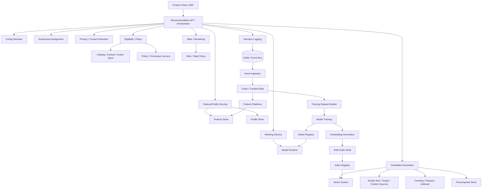
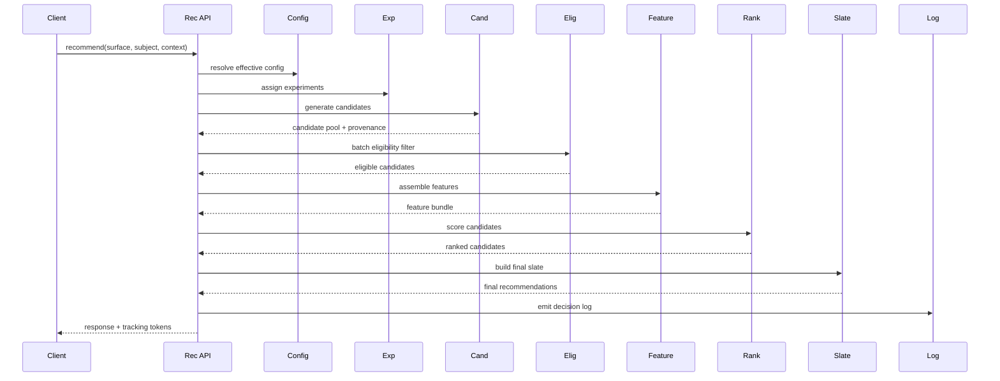

------
title: Build From Scratch Recommendations System - Part 079
description: End-to-end capstone architecture review untuk enterprise recommendation system: requirements, domain boundaries, service architecture, APIs, event/data flow, candidate/ranking/reranking, feature/model lifecycle, observability, governance, security, failure modes, and architecture review checklist.
series: learn-build-from-scratch-recommendations-system
seriesTitle: Build From Scratch: Enterprise Recommendations System
order: 79
partTitle: End-to-End Capstone Architecture Review
tags:
  - recommendation-system
  - recsys
  - capstone
  - architecture-review
  - system-design
  - enterprise
  - series
date: 2026-07-02
---

# Part 079 — End-to-End Capstone Architecture Review

Kita sudah membahas RecSys dari banyak sisi:

- domain model,
- events,
- data foundation,
- implicit feedback,
- baselines,
- candidate generation,
- retrieval,
- embeddings,
- ANN index,
- ranking,
- reranking,
- exploration,
- causal thinking,
- LLM augmentation,
- serving path,
- feature store,
- profile store,
- MLOps,
- batch scoring,
- caching,
- fault tolerance,
- evaluation,
- experimentation,
- observability,
- privacy,
- safety,
- security,
- multi-tenant config,
- cost,
- operating model,
- domain implementation tracks.

Part ini menyatukan semuanya menjadi **capstone architecture review**.

Tujuannya bukan membuat diagram cantik saja.

Tujuannya adalah melatih cara berpikir architect/staff/principal engineer saat menilai apakah sebuah recommendation system siap dibangun, dioperasikan, dan dikembangkan secara enterprise-grade.

---

## 1. Capstone Scenario

Kita akan review architecture untuk platform:

```text
Enterprise Recommendation Platform
```

Yang melayani tiga domain:

1. E-commerce recommendations.
2. Content feed recommendations.
3. B2B/internal workflow recommendations.

Platform harus mendukung:

- multiple surfaces,
- multiple tenants,
- personalization and non-personalized modes,
- candidate generation from many sources,
- ranking/reranking,
- safety and policy,
- experiment,
- observability,
- batch and online serving,
- model lifecycle,
- privacy and security,
- production operations.

---

## 2. Architecture Review Mindset

Architecture review bukan bertanya:

```text
Apakah teknologinya keren?
```

Tetapi:

```text
Apakah sistem ini menyelesaikan problem dengan benar?
Apakah contract jelas?
Apakah data loop sehat?
Apakah failure mode aman?
Apakah bisa di-debug?
Apakah bisa di-scale?
Apakah bisa dipantau?
Apakah governance cukup?
Apakah tim bisa mengoperasikannya?
```

Good architecture is operable architecture.

---

## 3. Non-Goals

Capstone ini bukan:

- deep dive ulang semua materi,
- implementasi penuh codebase,
- rekomendasi satu vendor/tool tertentu,
- klaim bahwa semua komponen harus dibuat dari nol,
- desain yang harus dipakai semua perusahaan.

Ini adalah architecture review template.

Adaptasikan ke domain dan maturity organisasi.

---

## 4. Top-Level Requirements

Functional requirements:

```text
serve recommendations for multiple surfaces
support personalized/contextual/non-personalized modes
support multiple candidate sources
rank and rerank candidates
enforce eligibility, safety, policy, privacy, permission
log decisions/impressions/actions
support offline training/evaluation
support online experiments
support batch/precomputed recommendations
support debug and replay
support tenant-specific configuration
```

Non-functional requirements:

```text
low latency
high availability
safe degradation
observability
security
privacy
auditability
cost control
model lifecycle governance
operational ownership
```

---

## 5. Quality Attribute Targets

Example SLOs:

```yaml
home_feed:
  availability: 99.9%
  p95_latency_ms: 200
  p99_latency_ms: 500
  empty_slate_rate: <0.1%
  decision_log_success: >99.9%
  critical_policy_violation: 0

enterprise_next_action:
  availability: 99.95%
  p95_latency_ms: 300
  permission_violation: 0
  audit_log_success: >99.99%
  safe_empty_allowed: true
```

Quality targets differ by surface.

---

## 6. Domain Boundaries

Core bounded contexts:

```text
Recommendation Serving
Candidate Generation
Eligibility and Policy
Ranking
Slate Construction
Feature/Profile
Event and Feedback
Training and Evaluation
Model/Index Registry
Experimentation
Configuration
Observability and Debugging
Governance/Security/Privacy
```

Boundaries prevent “one giant recommendation service” chaos.

---

## 7. Reference Architecture Diagram



This is the full loop.

---

## 8. Online Serving Request Flow



Key architecture point:

```text
Rec API orchestrates deadline, fallback, trace, and decision integrity.
```

---

## 9. Request Contract Review

A request must carry:

```text
request_id
subject
surface
context
privacy mode
tenant if applicable
limit
debug flag
```

Review questions:

```text
Can subject be spoofed?
Is tenant required?
Is privacy mode resolved server-side?
Is surface valid?
Can caller request debug?
Are context dimensions complete enough for eligibility?
```

A weak request contract creates downstream chaos.

---

## 10. Response Contract Review

Response must include:

```text
request_id
slate_id
items
positions
tracking tokens
reason codes
metadata
```

Internal metadata should include:

```text
model version
policy version
fallback flag
experiment variants
```

External clients should not receive sensitive raw scores unless intended.

---

## 11. Candidate Generation Review

Candidate layer should answer:

```text
Which sources exist?
What is each source’s responsibility?
What are source quotas?
What is source latency?
What is source recall?
What source produced each item?
How are candidates deduped?
How are stale/invalid candidates filtered?
```

A good candidate layer has provenance and diagnostics.

---

## 12. Candidate Portfolio Review

Example portfolio:

```yaml
home_feed:
  personalized_two_tower:
    quota: 800
    criticality: preferred
  recent_item_similar:
    quota: 300
    criticality: preferred
  trending_safe:
    quota: 200
    criticality: fallback
  editorial_safe:
    quota: 50
    criticality: fallback
```

Review:

- enough recall?
- enough diversity?
- cold-start path?
- anonymous/no-consent path?
- fallback path?
- safety filter?

---

## 13. Retrieval/Embedding Review

Review:

```text
embedding family defined?
query/item embedding compatible?
index versioned?
ANN recall benchmark exists?
delta index exists for freshness?
deletion/tombstone path exists?
multi-tenant filter safe?
index publish atomic?
rollback possible?
```

Vector retrieval is powerful but dangerous without versioning.

---

## 14. Eligibility and Policy Review

Eligibility should enforce:

```text
item/action active
recommendable on surface
region/locale/age constraints
tenant/permission
user suppression
frequency cap
inventory/availability
safety policy
business campaign validity
```

Review:

```text
Which checks are hard?
Which checks are soft?
Which fail closed?
Which can use stale cache?
Are reason codes logged?
Is final validation present?
```

---

## 15. Feature Store Review

Review:

```text
feature definitions versioned?
feature ownership exists?
freshness SLA defined?
offline/online parity validated?
privacy metadata present?
missing/default policy defined?
feature cost known?
feature monitoring exists?
```

Features are production APIs, not ad hoc columns.

---

## 16. Profile Store Review

Review:

```text
long-term vs session state separated?
suppression state fresh?
identity merge/split handled?
consent changes handled?
profile reset/delete handled?
hot keys handled?
profile debug view safe?
```

Bad profile state causes bad personalization and privacy risk.

---

## 17. Ranking Review

Review:

```text
ranking objective explicit?
model type appropriate?
features available online?
calibration needed?
score composition governed?
latency within budget?
fallback ranker exists?
model version logged?
segment evaluation passed?
```

The ranker should be replaceable behind a stable contract.

---

## 18. Reranking/Slate Review

Review:

```text
diversity constraints?
frequency/fatigue?
business rules?
sponsored caps/disclosure?
fairness/exposure?
exploration slots?
relevance floor?
layout constraints?
final hard checks?
```

User experiences a slate, not independent item scores.

---

## 19. Event and Feedback Review

Events must include:

```text
decision logs
impressions
viewability if needed
actions/clicks
conversions
negative feedback
deletion/suppression
catalog/policy changes
```

Review:

```text
Are events idempotent?
Are schemas versioned?
Are event_time and ingestion_time tracked?
Can actions join to impressions?
Are tracking tokens reliable?
Is event lag monitored?
```

No event loop, no learning loop.

---

## 20. Training Dataset Review

Review:

```text
dataset spec versioned?
temporal split?
point-in-time joins?
label windows mature?
negative sampling policy?
privacy filters?
tenant scope?
data quality gates?
lineage?
```

Training data quality is model quality.

---

## 21. Model Lifecycle Review

Review:

```text
model registry exists?
model bundle includes feature set/calibration/runtime?
offline metrics stored?
segment metrics stored?
shadow/canary/production lifecycle?
rollback bundle?
owner?
approval?
monitoring?
```

No registry means model chaos.

---

## 22. Batch/Precomputed Review

Review:

```text
which surfaces use batch?
subject selection consent-aware?
list TTL?
final online eligibility?
store more than visible count?
lineage?
batch validation?
rollback?
fallback?
```

Precomputed lists are stale by design; compensate safely.

---

## 23. Experimentation Review

Review:

```text
experiment registry?
deterministic assignment?
randomization unit?
exposure logging?
treatment-applied logging?
cache variant isolation?
primary metric?
guardrails?
SRM check?
segment analysis?
rollback?
```

Experiments are production deployments.

---

## 24. Offline Evaluation Review

Review:

```text
retrieval recall?
ranking NDCG/MRR/AUC/logloss?
calibration?
slate diversity/novelty?
negative feedback?
segments?
cold-start?
counterfactual limitations documented?
```

Offline evaluation should screen, not prove.

---

## 25. Observability Review

Dashboards should cover:

```text
online serving
candidate generation
feature freshness/missing
ranking score distribution
slate quality
feedback events
experiments
model drift
embedding/index health
business metrics
tenant health
```

Review:

```text
Can we debug a bad recommendation?
Can we detect silent quality regression?
Can we attribute change to model/config/source?
```

---

## 26. Debug/Replay Review

Debug should answer:

```text
why this item?
why this position?
why not filtered?
which source?
which features?
which model?
which rules?
which experiment?
which fallback?
```

Replay should support:

- request context,
- candidate set,
- feature snapshot,
- model/policy version,
- random seed.

Access-controlled.

---

## 27. Privacy Review

Review:

```text
privacy modes defined?
consent checked before personalization?
non-personalized path real?
feature privacy metadata?
training privacy filters?
deletion workflow?
retention?
debug redaction?
LLM context minimization?
```

Privacy is architecture, not UI.

---

## 28. Safety Review

Review:

```text
policy taxonomy?
recommendability by surface?
candidate generation filters?
final validation?
tombstone/denylist?
trust signals?
abuse-resistant trending?
safety guardrails in experiments?
kill switches?
incident runbook?
```

Safety must be multi-layered.

---

## 29. Security Review

Review:

```text
service auth?
subject authorization?
tenant isolation?
feature access control?
debug RBAC/audit?
model artifact integrity?
vector index access?
admin approval?
secret management?
LLM least privilege?
```

RecSys is a data aggregator and security boundary.

---

## 30. Multi-Tenant Review

Review:

```text
effective config resolver?
tenant ID propagated?
tenant-specific config versioned?
tenant-specific model/rules/features/fallback?
global mandatory safety non-overridable?
tenant dashboards?
tenant onboarding/offboarding?
config audit?
```

Enterprise support needs explainable tenant config.

---

## 31. Cost/Capacity Review

Review:

```text
QPS by surface?
candidate scores/sec?
feature values/sec?
vector queries/sec?
model inference cost?
cache hit/stale metrics?
batch scoring volume?
LLM cost?
tenant cost?
degradation modes?
```

If cost is not designed, it becomes surprise.

---

## 32. Fault Tolerance Review

Review:

```text
dependency timeouts?
circuit breakers?
bulkheads?
fallback hierarchy?
fail-open vs fail-closed matrix?
safe empty?
event logging degradation?
model fallback?
cache outage plan?
runbooks?
```

Good RecSys fails safely.

---

## 33. Governance Review

Review:

```text
artifact owners?
model review?
experiment review?
feature review?
rule/config review?
tenant config review?
on-call?
incident process?
objective governance?
cost ownership?
deprecation process?
```

Governance makes architecture sustainable.

---

## 34. Architecture Decision Records

Important ADRs:

```text
ADR-001: modular monolith vs microservices
ADR-002: recommendation unit by domain
ADR-003: event schema standard
ADR-004: candidate source contract
ADR-005: ranking model deployment strategy
ADR-006: feature store architecture
ADR-007: privacy mode enforcement
ADR-008: tenant isolation strategy
ADR-009: experiment assignment unit
ADR-010: fallback/degradation policy
```

ADR captures reasoning and trade-offs.

---

## 35. Example Service Boundary Decision

Decision:

```text
Start with modular monolith for Rec API, candidate, ranking, reranking.
Split model runtime and event ingestion separately.
```

Reason:

- reduce distributed complexity,
- keep hot path simple,
- preserve module boundaries,
- independent event ingestion scaling.

Review risk:

- monolith growth,
- team coupling,
- deployment blast radius.

Mitigation:

- strict modules,
- interface boundaries,
- extraction plan.

---

## 36. Example Data Flow Decision

Decision:

```text
Kafka for decision/impression/action events.
Raw -> clean -> curated data layers.
Training dataset builder uses curated events and feature snapshots.
```

Reason:

- asynchronous feedback loop,
- idempotent processing,
- replay/backfill support,
- training lineage.

Review risk:

- event lag,
- schema drift,
- tracking token bugs.

Mitigation:

- schema registry,
- event quality dashboards,
- join-rate monitoring.

---

## 37. Example Candidate Decision

Decision:

```text
Candidate generation portfolio: two-tower, item-to-item, content, trending, editorial.
```

Reason:

- complementary recall,
- cold-start support,
- fallback source.

Review risk:

- source overlap,
- latency,
- invalid candidates,
- source score inconsistency.

Mitigation:

- source contribution funnel,
- quotas,
- dedup,
- source normalization,
- fallback.

---

## 38. Example Ranking Decision

Decision:

```text
Use GBDT ranker first, then deep model after data/feature platform matures.
```

Reason:

- strong tabular baseline,
- debuggable,
- low latency,
- easier feature importance.

Review risk:

- sequence/multimodal signals underused.

Mitigation:

- add embeddings as features,
- train deep challenger in shadow,
- compare offline/online.

---

## 39. Example Privacy Decision

Decision:

```text
Support three privacy modes: personalized, contextual_only, non_personalized.
```

Reason:

- consent-aware serving,
- regulatory/product flexibility,
- graceful fallback.

Review risk:

- duplicated pipelines,
- model quality lower in non-personalized mode.

Mitigation:

- shared contextual sources,
- specific ranker route,
- privacy regression tests.

---

## 40. Example Tenant Decision

Decision:

```text
Shared infrastructure with logical tenant isolation for most tenants.
Dedicated vector index for high-risk/large tenants.
```

Reason:

- cost efficiency,
- security flexibility.

Review risk:

- cross-tenant leakage in shared mode.

Mitigation:

- tenant-aware keys,
- permission final check,
- security tests,
- tenant dashboards.

---

## 41. Architecture Smell: Model-Centric Design

Smell:

```text
Architecture deck starts with neural model and ignores events, logging, safety, fallback.
```

Problem:

- cannot learn reliably,
- cannot debug,
- cannot operate.

Fix:

- start with decision loop,
- then model.

---

## 42. Architecture Smell: No Final Eligibility

Smell:

```text
Candidate sources are assumed clean.
```

Problem:

- stale index/cache/precomputed lists leak invalid items.

Fix:

- final eligibility/tombstone check mandatory.

---

## 43. Architecture Smell: No Version Tags

Smell:

```text
Metrics show CTR drop but no model/policy/source version dimension.
```

Problem:

- root cause slow.

Fix:

- version tags everywhere.

---

## 44. Architecture Smell: One Global Objective

Smell:

```text
All surfaces use same ranking objective.
```

Problem:

- home, PDP, cart, push, enterprise actions have different goals.

Fix:

- surface-specific objective/config/model route.

---

## 45. Architecture Smell: Cache Without Privacy/Tenant Dimensions

Smell:

```text
cache key = surface:user
```

Problem:

- privacy/tenant/experiment contamination.

Fix:

- typed cache keys include tenant/privacy/context/version.

---

## 46. Architecture Smell: Offline Metrics Only

Smell:

```text
Model launched because NDCG improved.
```

Problem:

- online causality missing.

Fix:

- shadow/canary/A-B with guardrails.

---

## 47. Architecture Smell: No Operating Owner

Smell:

```text
Every artifact exists, no one owns it.
```

Problem:

- stale features, broken dashboards, config drift.

Fix:

- ownership registry and review cadence.

---

## 48. End-to-End Review Checklist

```text
[ ] Requirements and non-goals are explicit.
[ ] Surfaces and objectives are defined.
[ ] Recommendation units are defined.
[ ] Request/response contracts are versioned.
[ ] Event contracts are versioned.
[ ] Candidate source contract exists.
[ ] Candidate provenance is logged.
[ ] Eligibility/policy/final validation exist.
[ ] Feature registry/store design exists.
[ ] Profile/session/suppression design exists.
[ ] Ranking contract and model route exist.
[ ] Reranking/slate policy exists.
[ ] Tracking tokens and decision logs exist.
[ ] Offline training dataset builder exists.
[ ] Model/index registries exist.
[ ] Evaluation gates exist.
[ ] Experiment infrastructure exists.
[ ] Observability dashboards/alerts exist.
[ ] Debug/replay capability exists.
[ ] Privacy modes and consent enforcement exist.
[ ] Safety/policy enforcement exists.
[ ] Security/tenant isolation exists.
[ ] Cost/capacity model exists.
[ ] Fault tolerance/degradation plan exists.
[ ] Operating ownership/governance exists.
```

---

## 49. Capstone Architecture Review Questions

Use these in architecture review meeting:

```text
What happens if the ranker times out?
What happens if consent is unknown?
What happens if item is deleted after index build?
How do we explain why item was shown?
How do we know model v2 is better?
How do we roll back model/index/config?
How do we prevent tenant data leakage?
How do we support no-personalization users?
How do we know feature X is stale?
How do we attribute click to recommendation?
How do we detect source degradation?
How do we keep cost bounded?
How do we handle bad recommendation report?
How do we prevent sponsored from overriding safety?
How do we onboard a new tenant?
```

If architecture cannot answer, it is not ready.

---

## 50. Minimal Capstone Implementation Roadmap

### Phase 1 — Production Skeleton

```text
API
candidate sources
eligibility
heuristic ranker
slate policy
events
decision logs
dashboard
fallback
privacy/safety basics
```

### Phase 2 — Learning Loop

```text
clean events
profile updates
training dataset builder
offline evaluation
GBDT ranker
model registry
A/B testing
```

### Phase 3 — Retrieval and MLOps

```text
two-tower retrieval
embeddings
ANN index versioning
feature store
batch scoring
model lifecycle
drift monitoring
```

### Phase 4 — Enterprise and Governance

```text
multi-tenant config
security hardening
privacy deletion
safety classifiers
cost attribution
operating model
```

### Phase 5 — Advanced Optimization

```text
bandits
causal/OPE
deep/multimodal models
LLM augmentation
fairness/exposure optimization
```

---

## 51. Final Architecture Summary

A production-grade recommendation system is not one algorithm.

It is a closed-loop decision platform:

```text
data -> candidates -> ranking -> slate -> exposure -> feedback -> learning -> deployment -> monitoring -> governance
```

Core architecture principle:

```text
Every decision must be explainable, observable, versioned, safe, and improvable.
```

If a system cannot say why it recommended something, cannot learn from feedback, cannot roll back, cannot respect consent, cannot enforce policy, and cannot be monitored, it is not production-grade no matter how good the model seems offline.

---

## 52. Kesimpulan

Capstone architecture review menyatukan seluruh seri menjadi practical review framework.

Prinsip utama:

1. Architecture review evaluates operability, not just design elegance.
2. RecSys is a closed-loop decision platform.
3. Contracts, events, versioning, and decision logs are foundational.
4. Candidate/ranking/reranking must be separated but integrated.
5. Privacy, safety, security, and tenant isolation are architecture concerns.
6. Offline evaluation and online experiments serve different roles.
7. Observability/debug/replay determine incident velocity.
8. Cost/capacity/fault tolerance must be designed early.
9. Governance and ownership are part of system architecture.
10. Every recommendation should be traceable from request to feedback and back to learning.

Di Part 080, kita akan menutup seri dengan **Production Readiness Checklist and Series Close** — checklist lengkap untuk menilai readiness sebelum launch, scale, and long-term operation.
