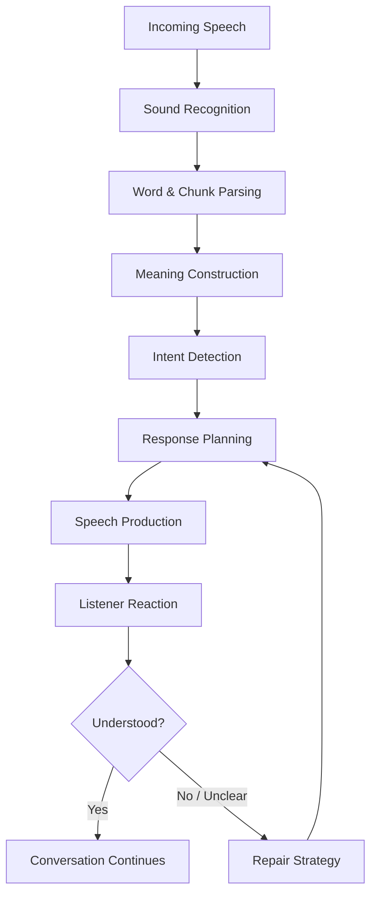
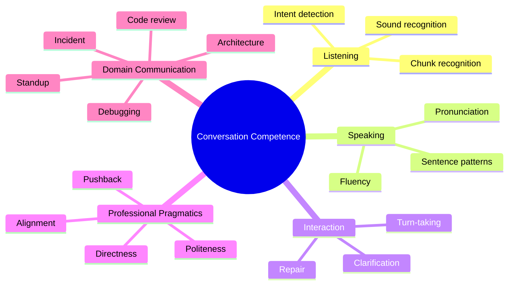
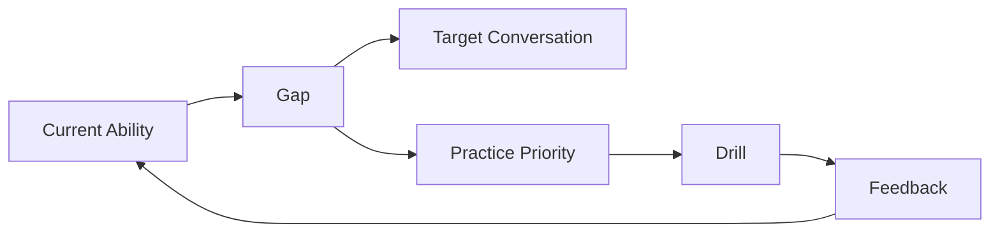
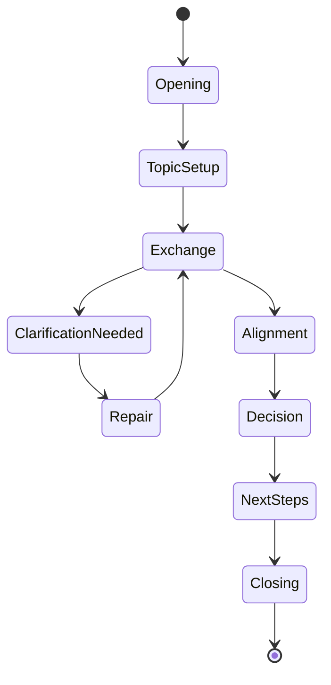

# English for Conversation Part 01 — Skill Definition: What English for Conversation Actually Means

## 1. Tujuan Part Ini

Part pertama ini bukan tentang grammar, vocabulary list, atau tips cepat agar terdengar seperti native speaker. Fokusnya adalah mendefinisikan **skill yang benar-benar ingin dikuasai**.

Dalam kerangka *The First 20 Hours*, langkah pertama untuk belajar cepat adalah menentukan **target performance level**: kemampuan konkret apa yang ingin bisa dilakukan setelah latihan. Tanpa definisi performa, belajar English akan melebar ke terlalu banyak arah: grammar, pronunciation, vocabulary, TOEFL, IELTS, reading, writing, idiom, slang, accent, dan akhirnya tidak ada satu kemampuan pun yang benar-benar naik secara signifikan.

Untuk konteks ini, target kita adalah:

> Mampu menggunakan English secara cukup spontan, jelas, dan fleksibel untuk menjalankan percakapan nyata, terutama dalam konteks software engineering dan kerja global.

Artinya, kita tidak mengejar English sebagai mata pelajaran. Kita mengejar **English as an operational communication skill**.

Setelah menyelesaikan part ini, kamu harus punya:

- definisi personal tentang conversational fluency;
- pemetaan gap antara kemampuan sekarang dan kebutuhan nyata;
- daftar situasi percakapan prioritas;
- baseline awal untuk speaking, listening, confidence, dan repair ability;
- target performa 20 jam pertama.

---

## 2. English for Conversation Bukan English for Grammar

Banyak orang gagal berbicara English bukan karena mereka benar-benar tidak tahu English. Mereka gagal karena skill yang dilatih tidak sama dengan skill yang dibutuhkan.

Perhatikan perbedaan berikut.

| Area | Fokus Utama | Output | Kegagalan Umum |
|---|---|---|---|
| English for Grammar | Aturan bahasa | Jawaban benar secara struktural | Bisa mengerjakan soal, tetapi lambat bicara |
| English for Reading | Memahami teks | Comprehension | Bisa baca dokumentasi, tetapi sulit merespons oral |
| English for Testing | Skor ujian | Band/score | Optimal untuk tes, belum tentu natural di meeting |
| English for Writing | Struktur tulisan | Email, docs, reports | Punya waktu berpikir, bukan real-time |
| English for Conversation | Interaksi real-time | Respons, klarifikasi, diskusi | Harus cepat, adaptif, dan toleran terhadap error |

**Conversation** punya karakteristik yang berbeda:

1. terjadi real-time;
2. tidak bisa selalu diedit;
3. melibatkan listening dan speaking sekaligus;
4. membutuhkan respons dalam waktu pendek;
5. penuh ambiguity;
6. sering tidak lengkap secara grammar;
7. sangat dipengaruhi konteks, gesture, tone, dan intent;
8. membutuhkan kemampuan memperbaiki misunderstanding.

Jadi, conversation bukan sekadar “grammar yang diucapkan”. Conversation adalah sistem interaksi.

---

## 3. Definisi Kerja: Apa Itu Conversational Fluency?

Untuk seri ini, **conversational fluency** didefinisikan sebagai kemampuan untuk:

> memahami maksud lawan bicara, merespons dengan cukup cepat, menjaga alur percakapan, memperbaiki kesalahpahaman, dan menyampaikan ide dengan jelas walaupun belum sempurna secara grammar atau accent.

Definisi ini sengaja realistis. Fluency bukan berarti:

- berbicara tanpa kesalahan;
- punya accent seperti native speaker;
- tahu semua vocabulary;
- tidak pernah meminta pengulangan;
- bisa membahas semua topik secara mendalam;
- bicara sangat cepat.

Fluency yang berguna di dunia kerja berarti:

- lawan bicara paham maksudmu;
- kamu bisa paham maksud utama mereka;
- percakapan tidak sering macet;
- ketika macet, kamu bisa memperbaikinya;
- kamu bisa mengelola meeting, diskusi, disagreement, dan keputusan;
- kamu bisa bertanya saat tidak paham tanpa terlihat pasif;
- kamu bisa menjelaskan reasoning, trade-off, risk, dan next step.

Untuk software engineer, ini jauh lebih penting daripada hafal semua tense.

---

## 4. Conversation Sebagai Sistem Input-Output-Feedback

Skill conversation bisa dimodelkan seperti sistem distributed communication.



Dalam percakapan nyata, kegagalan bisa terjadi di banyak titik:

- kamu tidak menangkap sound;
- kamu menangkap sound tapi tidak tahu kata;
- kamu tahu kata tapi tidak paham maksud;
- kamu paham maksud tapi tidak tahu cara menjawab;
- kamu tahu jawaban tapi tidak bisa mengucapkannya cepat;
- kamu mengucapkan sesuatu tapi lawan bicara salah paham;
- kamu panik ketika diminta mengulang;
- kamu terlalu sibuk memikirkan grammar sehingga kehilangan alur.

Model ini penting karena banyak learner salah diagnosis. Mereka berkata, “English saya jelek,” padahal bottleneck-nya spesifik:

- listening terhadap connected speech;
- kurang phrasebank untuk respons cepat;
- takut salah;
- tidak punya repair strategy;
- translating word-by-word;
- pronunciation pada beberapa kata kunci;
- tidak terbiasa berpikir dalam chunk.

Kita tidak akan memperbaiki “English” secara umum. Kita akan memperbaiki bottleneck spesifik dalam conversation system.

---

## 5. Mental Model Utama: Conversation Is Not Translation

Salah satu hambatan terbesar penutur Indonesia adalah kebiasaan ini:

```text
Ide dalam Bahasa Indonesia -> Terjemahkan ke English -> Cek grammar -> Bicara
```

Pipeline ini terlalu lambat untuk conversation.

Target kita adalah mengganti pipeline itu menjadi:

```text
Intent -> English chunk -> Speak -> Adjust
```

Contoh:

Daripada berpikir:

> “Saya ingin mengatakan bahwa bug ini mungkin terjadi karena cache lama masih dipakai. Bahasa Inggrisnya apa ya?”

Gunakan chunk siap pakai:

> “I think this might be caused by stale cache.”

Atau lebih sederhana:

> “It might be a cache issue.”

Conversation yang baik sering bergantung pada **reusable chunks**, bukan kalimat hasil terjemahan sempurna.

### Contoh Chunk untuk Software Engineer

| Intent | Chunk |
|---|---|
| Menyampaikan dugaan | “I think this might be caused by…” |
| Minta klarifikasi | “Could you clarify what you mean by…?” |
| Menyampaikan risiko | “The main risk is…” |
| Menawarkan opsi | “One option is to…” |
| Menolak halus | “I’m not sure that would work because…” |
| Mengakui belum tahu | “I’m not sure yet. I need to check…” |
| Mengajak alignment | “Let’s make sure we’re on the same page.” |
| Menyimpulkan | “So the next step is…” |

Chunk mengurangi cognitive load. Kamu tidak perlu membuat semua kalimat dari nol.

---

## 6. Target Conversation untuk Software Engineer

English conversation untuk software engineer punya domain yang cukup jelas. Kita tidak perlu mulai dari semua topik dunia. Kita mulai dari situasi bernilai tinggi.

### 6.1 Daily Work Conversation

Kamu harus bisa:

- menjelaskan apa yang sedang dikerjakan;
- menyampaikan progress;
- menjelaskan blocker;
- meminta bantuan;
- memberi update singkat;
- menyampaikan estimasi;
- mengatakan belum selesai secara profesional.

Contoh target performa:

> “Yesterday I finished the API integration. Today I’ll work on error handling and tests. I’m currently blocked by unclear requirements around retry behavior.”

### 6.2 Debugging and Pair Programming

Kamu harus bisa:

- berpikir keras secara verbal;
- menjelaskan hypothesis;
- meminta lawan bicara menjalankan langkah tertentu;
- mengonfirmasi hasil;
- mengubah arah investigation.

Contoh target performa:

> “Let’s check the logs first. If the request reaches the service but the response is empty, the issue is probably in the mapping layer.”

### 6.3 Code Review

Kamu harus bisa:

- memberi feedback tanpa terdengar menyerang;
- menerima feedback tanpa defensif;
- meminta alasan;
- menawarkan alternatif.

Contoh target performa:

> “This works, but I’m a bit concerned about the edge case where the input is null. Could we add a guard clause here?”

### 6.4 Architecture and Design Discussion

Kamu harus bisa:

- menjelaskan trade-off;
- membandingkan opsi;
- menyampaikan constraint;
- menantang assumption;
- membahas scalability, reliability, latency, consistency, observability, security.

Contoh target performa:

> “The synchronous approach is simpler, but it increases coupling between services. An async flow gives us better resilience, but it also adds operational complexity.”

### 6.5 Conflict and Pushback

Kamu harus bisa:

- disagree secara profesional;
- meminta evidence;
- menyampaikan concern;
- menjaga hubungan kerja;
- mengeskalasi risiko tanpa drama.

Contoh target performa:

> “I understand the deadline pressure, but I’m concerned that skipping the migration test could create a production risk.”

---

## 7. Conversation Competence: Lima Dimensi

Untuk belajar efektif, kita perlu memecah fluency menjadi dimensi yang bisa dilatih.



### 7.1 Listening

Listening bukan sekadar “tahu arti kata”. Listening berarti mampu memproses spoken input cukup cepat untuk menjaga percakapan.

Komponen listening:

- mengenali sound;
- mengenali kata dalam connected speech;
- mengenali chunk;
- menebak makna dari konteks;
- membedakan main point vs detail;
- memahami tone dan intent.

### 7.2 Speaking

Speaking berarti menghasilkan ujaran yang bisa dipahami dalam waktu nyata.

Komponen speaking:

- sentence pattern;
- active vocabulary;
- pronunciation;
- rhythm;
- response speed;
- ability to simplify.

### 7.3 Interaction

Interaction adalah kemampuan menjaga percakapan tetap berjalan.

Komponen interaction:

- bertanya;
- menjawab;
- follow-up;
- backchanneling;
- interrupting politely;
- repairing misunderstanding;
- summarizing.

### 7.4 Professional Pragmatics

Pragmatics adalah cara menggunakan bahasa sesuai konteks sosial.

Contoh:

- “That’s wrong” secara grammar benar, tetapi bisa terdengar kasar.
- “I think there might be an issue with this approach” lebih aman untuk code review.

Pragmatics menentukan apakah kamu terdengar:

- jelas atau vague;
- tegas atau agresif;
- sopan atau pasif;
- percaya diri atau defensif.

### 7.5 Domain Communication

English untuk engineer punya domain komunikasi sendiri:

- bug report;
- incident update;
- system design;
- trade-off discussion;
- migration plan;
- architecture review;
- rollout plan;
- root cause analysis.

Kita akan memakai domain ini sebagai bahan latihan karena paling relevan dengan kebutuhan nyata.

---

## 8. The Performance Ladder

Target belajar harus bertahap. Jangan mulai dengan target “saya ingin fluent seperti native speaker”. Itu terlalu vague dan tidak actionable.

Gunakan ladder berikut.

| Level | Deskripsi | Indikator |
|---|---|---|
| Level 0 | Silent Knowledge | Bisa baca, tapi sulit bicara |
| Level 1 | Scripted Survival | Bisa memakai kalimat template |
| Level 2 | Controlled Conversation | Bisa berdialog dalam skenario familiar |
| Level 3 | Adaptive Conversation | Bisa menyesuaikan respons saat arah berubah |
| Level 4 | Professional Fluency | Bisa berdiskusi, disagree, dan decide dalam konteks kerja |
| Level 5 | Strategic Communication | Bisa memimpin diskusi kompleks dan memengaruhi keputusan |

Untuk 20 jam pertama, target realistis adalah bergerak dari Level 0/1 ke Level 2/3 pada situasi prioritas. Seri lengkap ini akan membawa kamu menuju Level 4 dan memberi jalur menuju Level 5.

---

## 9. Why Software Engineers Often Have an Advantage

Sebagai software engineer, kamu punya beberapa keuntungan:

1. **Terbiasa dengan sistem dan abstraction.**  
   Conversation bisa dipahami sebagai pipeline, protocol, state machine, dan feedback loop.

2. **Terbiasa debugging.**  
   Kesalahan speaking bisa di-debug: pronunciation, grammar, chunk, hesitation, listening, or pragmatics.

3. **Terbiasa dengan pattern.**  
   English conversation sangat bergantung pada reusable pattern.

4. **Terbiasa membaca dokumentasi English.**  
   Passive vocabulary biasanya sudah cukup besar. Tantangannya adalah mengubah passive vocabulary menjadi active speech.

5. **Punya domain jelas.**  
   Kamu tidak perlu belajar semua conversation topic dari nol. Mulai dari domain kerja yang sering dipakai.

Namun ada juga risiko khas software engineer:

- terlalu analitis saat berbicara;
- ingin grammar sempurna sebelum bicara;
- over-explaining;
- memakai technical terms tanpa structure;
- kurang practice real-time;
- merasa “saya sudah bisa English karena bisa baca docs”.

Kita akan memanfaatkan kekuatan engineering mindset, tetapi menghindari jebakannya.

---

## 10. Baseline Assessment

Sebelum latihan, kamu perlu mengukur posisi awal. Bukan untuk menghakimi, tapi untuk memilih latihan yang tepat.

Gunakan skala 1–5.

| Dimensi | 1 | 3 | 5 | Skor Awal |
|---|---|---|---|---|
| Listening | Sering tidak menangkap main point | Paham topik familiar | Paham diskusi kerja real-time |  |
| Speaking Speed | Sering stuck | Bisa jawab dengan jeda | Respons cukup spontan |  |
| Sentence Control | Sangat terbatas | Bisa pakai pola umum | Bisa variasi struktur |  |
| Pronunciation | Sering tidak dipahami | Umumnya dipahami | Jelas dan stabil |  |
| Clarification | Panik saat tidak paham | Bisa minta ulang | Bisa repair dengan natural |  |
| Work Conversation | Sulit update kerja | Bisa standup sederhana | Bisa diskusi teknis |  |
| Confidence | Menghindari bicara | Berani di situasi aman | Aktif di meeting |  |

### Drill Baseline 1 — One-Minute Self Introduction

Rekam dirimu menjawab:

> “Can you introduce yourself and explain what kind of software work you usually do?”

Evaluasi:

- Apakah kamu berhenti terlalu lama?
- Apakah struktur jelas?
- Apakah banyak kata yang kamu tahu tapi tidak keluar?
- Apakah kamu terlalu banyak menerjemahkan?
- Apakah kamu bisa menyebut role, domain, stack, dan responsibility?

### Drill Baseline 2 — Work Update

Rekam jawaban:

> “What did you work on yesterday, what are you working on today, and are there any blockers?”

Evaluasi:

- Apakah kamu bisa menjawab dalam 45–60 detik?
- Apakah kalimatnya sederhana tapi jelas?
- Apakah blocker dijelaskan dengan concrete?
- Apakah kamu bisa menyampaikan next step?

### Drill Baseline 3 — Technical Explanation

Rekam jawaban:

> “Explain a recent bug you fixed.”

Struktur minimal:

1. context;
2. symptom;
3. cause;
4. fix;
5. lesson learned.

---

## 11. Conversation Gap Map

Setelah baseline, buat gap map.



Gunakan format berikut.

| Situation | Current Problem | Target Behavior | Practice Needed |
|---|---|---|---|
| Standup | Saya terlalu pendek dan vague | Bisa update 45 detik dengan jelas | Work update script drill |
| Code review | Takut terdengar kasar | Bisa memberi feedback halus | Softening phrase drill |
| Debugging | Sulit thinking aloud | Bisa menjelaskan hypothesis | Pair programming roleplay |
| Architecture | Vocabulary belum aktif | Bisa jelaskan trade-off | Trade-off phrasebank |
| Meeting | Sulit interrupt | Bisa masuk diskusi sopan | Turn-taking drill |

Gap map membuat latihan menjadi targeted.

---

## 12. Core Principle: Speak in Small Correctable Units

Banyak learner ingin langsung bicara panjang. Ini berbahaya karena makin panjang kalimat, makin tinggi risiko error, makin tinggi cognitive load.

Gunakan prinsip:

> Speak in small correctable units.

Contoh buruk:

> “Actually I was thinking that maybe if we are using another approach which is more better because the current implementation is not really good and maybe will make problem in production.”

Contoh lebih baik:

> “I think we should consider another approach. The current implementation works, but it may create production issues. My main concern is error handling.”

Kuncinya:

- kalimat pendek;
- satu ide per kalimat;
- gunakan connector sederhana;
- pause natural;
- lanjutkan jika lawan bicara mengikuti.

Ini sangat penting untuk conversation karena kamu bisa memperbaiki arah lebih cepat.

---

## 13. The Minimum Viable Conversation Skill

Sebelum mengejar fluency tinggi, kamu butuh **Minimum Viable Conversation Skill**.

Skill minimal ini terdiri dari 10 kemampuan:

1. memperkenalkan diri dan role;
2. menjelaskan pekerjaan saat ini;
3. memberi update progress;
4. menjelaskan blocker;
5. meminta bantuan;
6. bertanya klarifikasi;
7. meminta pengulangan;
8. menjelaskan masalah teknis sederhana;
9. menyampaikan pendapat;
10. menyimpulkan next step.

Jika 10 skill ini stabil, kamu sudah bisa survive dalam banyak situasi kerja global.

### Minimum Phrasebank

| Function | Phrase |
|---|---|
| Introduce role | “I work as a software engineer, mainly focusing on…” |
| Current work | “I’m currently working on…” |
| Progress | “I’ve finished…, and now I’m working on…” |
| Blocker | “I’m blocked by…” |
| Ask help | “Could you help me check…?” |
| Clarify | “Could you clarify…?” |
| Repeat | “Could you say that again?” |
| Explain issue | “The issue is that…” |
| Opinion | “I think we should…” |
| Next step | “The next step is…” |

Latih ini sampai otomatis.

---

## 14. Anti-Goals: Hal yang Tidak Kita Kejar di Awal

Untuk belajar cepat, kamu juga harus tahu apa yang tidak dikerjakan dulu.

Pada fase awal, kita tidak mengejar:

- accent native;
- grammar sempurna;
- idiom kompleks;
- slang;
- debating seperti public speaker;
- vocabulary akademik;
- British vs American nuance yang terlalu detail;
- semua tense sekaligus;
- berbicara cepat;
- menghafal kamus.

Mengapa? Karena semua itu bisa menjadi distraction.

Target awal adalah:

- clear enough;
- fast enough;
- polite enough;
- structured enough;
- repairable enough.

Itulah fondasi conversation.

---

## 15. Error Tolerance: Kesalahan Mana yang Masih Aman?

Tidak semua error sama. Dalam conversation, beberapa error masih aman selama maksud tersampaikan.

### 15.1 Low-Risk Errors

Biasanya tidak menghentikan pemahaman:

- article error: “I found bug” vs “I found a bug”;
- plural error ringan: “two service” vs “two services”;
- tense error jika konteks jelas;
- preposition minor;
- accent non-native.

### 15.2 Medium-Risk Errors

Bisa mengganggu clarity:

- word order salah;
- wrong verb untuk action penting;
- pronunciation kata kunci tidak jelas;
- terlalu banyak filler;
- kalimat terlalu panjang;
- pronoun ambiguity.

### 15.3 High-Risk Errors

Bisa menyebabkan misunderstanding serius:

- salah menyampaikan risk;
- salah mengatakan sudah selesai padahal belum;
- salah menyatakan approval;
- salah timeline;
- tidak jelas antara bug, feature, blocker, incident;
- terdengar setuju padahal sebenarnya concern.

Contoh high-risk:

> “It’s done” padahal maksudnya “I’m working on it.”

Dalam engineering context, ini bisa berdampak ke planning dan delivery.

Jadi prioritas kita bukan membasmi semua error, tetapi mengendalikan error yang berdampak pada komunikasi.

---

## 16. Conversation State Machine

Percakapan bisa dipahami sebagai state machine.



Setiap state punya fungsi bahasa sendiri.

| State | Goal | Example Phrase |
|---|---|---|
| Opening | Memulai | “Hi, do you have a minute?” |
| TopicSetup | Menentukan topik | “I wanted to discuss the deployment issue.” |
| Exchange | Bertukar informasi | “The service started failing after the last release.” |
| ClarificationNeeded | Menandai tidak paham | “Sorry, what do you mean by timeout here?” |
| Repair | Memperbaiki ambiguity | “Let me rephrase that.” |
| Alignment | Menyamakan pemahaman | “So we agree the issue is in the retry logic?” |
| Decision | Memilih arah | “Let’s go with the safer option.” |
| NextSteps | Menentukan aksi | “I’ll update the config and you’ll review the PR.” |
| Closing | Menutup | “Thanks, I’ll follow up after testing.” |

Kita akan melatih bahasa per state, bukan hanya vocabulary random.

---

## 17. Practical Target for the First 20 Hours

Target 20 jam pertama harus konkret.

Setelah 20 jam deliberate practice, target minimum:

1. bisa melakukan self-introduction 60–90 detik;
2. bisa memberi standup update 45–60 detik;
3. bisa menjelaskan bug sederhana 90 detik;
4. bisa meminta klarifikasi dengan natural;
5. bisa menggunakan minimal 50 conversation chunks aktif;
6. bisa melakukan roleplay code review sederhana;
7. bisa melakukan roleplay debugging 5 menit;
8. bisa menyampaikan disagreement ringan;
9. bisa merekam dan mengevaluasi speaking sendiri;
10. bisa membuat next-step summary setelah diskusi.

Ini bukan akhir. Ini fondasi operasional.

---

## 18. Daily Practice Contract

Belajar conversation tidak bisa hanya membaca materi. Kamu perlu kontrak praktik.

Gunakan format:

```text
I will practice English conversation for 20 focused hours.
I will prioritize speaking, listening, clarification, and repair.
I will not wait until I feel ready.
I will record myself.
I will review mistakes without shame.
I will measure progress by real conversation ability, not by theory consumed.
```

Dalam Bahasa Indonesia:

```text
Saya akan melatih English conversation selama 20 jam fokus.
Saya akan memprioritaskan speaking, listening, clarification, dan repair.
Saya tidak akan menunggu sampai merasa siap.
Saya akan merekam diri sendiri.
Saya akan meninjau kesalahan tanpa malu.
Saya akan mengukur progres dari kemampuan percakapan nyata, bukan jumlah teori yang dibaca.
```

---

## 19. Exercises

### Exercise 1 — Define Your Target Performance

Isi template berikut.

```text
After 20 hours, I want to be able to:
1. ...
2. ...
3. ...

The most important conversation situations for me are:
1. ...
2. ...
3. ...

The biggest problems I currently have are:
1. ...
2. ...
3. ...
```

Contoh:

```text
After 20 hours, I want to be able to:
1. explain my work clearly in standup;
2. ask questions during technical discussions;
3. give code review feedback politely.

The most important conversation situations for me are:
1. daily standup;
2. debugging with teammates;
3. architecture review.

The biggest problems I currently have are:
1. I translate from Indonesian first;
2. I freeze when I don't understand;
3. I know words passively but cannot use them quickly.
```

### Exercise 2 — Record Your Baseline

Rekam 3 audio pendek:

1. self-introduction;
2. daily work update;
3. recent bug explanation.

Durasi masing-masing: 60–90 detik.

Jangan ulang terlalu banyak. Tujuannya baseline, bukan performance sempurna.

### Exercise 3 — Build Your Conversation Gap Map

Isi tabel ini.

| Situation | Current Problem | Target Behavior | Practice Needed | Priority |
|---|---|---|---|---|
|  |  |  |  |  |
|  |  |  |  |  |
|  |  |  |  |  |

Prioritas tertinggi adalah situasi yang:

- sering terjadi;
- berdampak besar;
- membuat kamu paling sering diam;
- menyebabkan misunderstanding;
- menghambat karier atau kolaborasi.

### Exercise 4 — Choose Your First 10 Chunks

Pilih 10 phrase yang paling relevan dari minimum phrasebank.

Latih dengan pola:

```text
Chunk -> Personal example -> Say it aloud 5 times -> Record once -> Review
```

Contoh:

```text
Chunk: “I’m currently working on...”
Personal example: “I’m currently working on the payment retry flow.”
```

---

## 20. Self-Review Rubric

Gunakan rubric berikut setelah latihan speaking.

| Dimension | Question | Score 1–5 |
|---|---|---|
| Clarity | Apakah maksud utama jelas? |  |
| Structure | Apakah urutan ide mudah diikuti? |  |
| Speed | Apakah respons terlalu lambat? |  |
| Simplicity | Apakah kalimat terlalu panjang? |  |
| Repair | Jika salah, apakah bisa memperbaiki? |  |
| Confidence | Apakah suara stabil? |  |
| Relevance | Apakah jawaban sesuai pertanyaan? |  |

Jangan hanya mencari kesalahan. Cari juga reusable pattern yang sudah berhasil.

---

## 21. Key Takeaways

- English conversation adalah skill performa real-time, bukan hanya pengetahuan grammar.
- Fluency berarti mampu menjaga percakapan tetap berjalan, bukan berbicara tanpa error.
- Untuk software engineer, target awal harus berbasis situasi kerja: standup, debugging, code review, architecture, meeting, dan conflict.
- Conversation bisa dimodelkan sebagai sistem input-output-feedback.
- Bottleneck harus didiagnosis spesifik: listening, speaking, chunk, pronunciation, repair, confidence, atau pragmatics.
- Jangan menerjemahkan word-by-word. Gunakan intent-to-chunk pipeline.
- Target awal: clear enough, fast enough, polite enough, structured enough, repairable enough.

---

## 22. Output Part Ini

Sebelum lanjut ke Part 02, kamu harus sudah punya:

- baseline recording;
- skor awal 7 dimensi conversation;
- conversation gap map;
- 3 situasi prioritas;
- 10 chunk pertama;
- target performa untuk 20 jam pertama.

Jika belum, jangan jadikan ini blocker, tetapi tetap lanjut dengan catatan bahwa semua latihan berikutnya akan lebih efektif jika baseline sudah dibuat.
