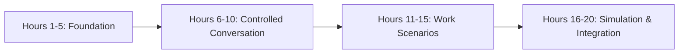
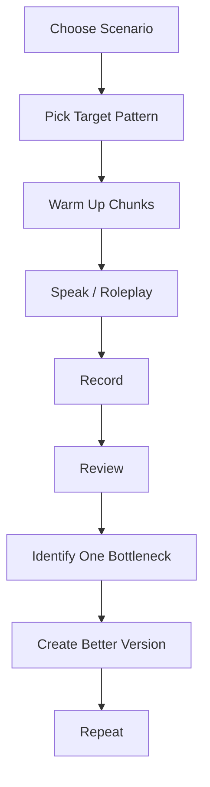
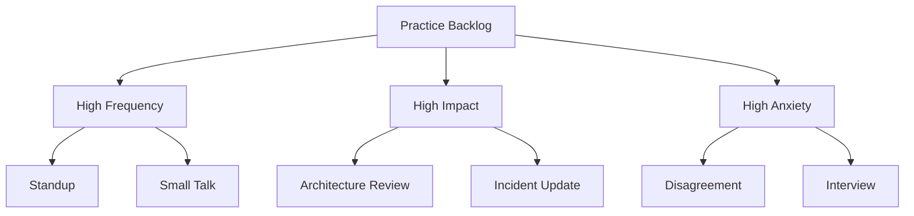

# English for Conversation Part 02 — Kaufman Framework Applied to English Conversation

## 1. Tujuan Part Ini

Part ini menerjemahkan framework *The First 20 Hours* ke dalam sistem belajar English conversation yang operasional. Kita tidak akan memakai pendekatan “belajar English sebanyak mungkin”. Kita akan memakai pendekatan engineering: definisikan target, pecah skill, buat feedback loop, hilangkan bottleneck, lalu jalankan practice cycle.

Tujuan akhirnya adalah membuat sistem belajar yang menjawab lima pertanyaan:

1. **Apa kemampuan percakapan yang ingin dicapai?**
2. **Sub-skill apa saja yang membentuk kemampuan itu?**
3. **Materi minimum apa yang perlu diketahui agar bisa self-correct?**
4. **Hambatan apa yang membuat latihan tidak terjadi?**
5. **Bagaimana 20 jam pertama diatur agar menghasilkan progress nyata?**

Setelah part ini, kamu akan punya rancangan program latihan 20 jam yang jelas, bukan sekadar niat “mau belajar speaking”.

---

## 2. Prinsip Inti The First 20 Hours

Kerangka Kaufman bisa diringkas menjadi beberapa prinsip praktis:

1. tentukan skill spesifik yang ingin dikuasai;
2. pecah skill menjadi bagian kecil;
3. pelajari secukupnya untuk bisa berlatih dan mengoreksi diri;
4. singkirkan hambatan yang menghalangi latihan;
5. praktik minimal 20 jam secara fokus.

Untuk English conversation, prinsip ini berarti:

- jangan mulai dari semua grammar;
- jangan mulai dari semua vocabulary;
- jangan menunggu percaya diri dulu;
- jangan mengandalkan konsumsi pasif;
- jangan belajar tanpa output speaking;
- jangan belajar tanpa feedback.

Kita akan membuat sistem belajar yang memaksa output sejak awal.

---

## 3. Translasi Framework ke English Conversation

| Kaufman Principle | Applied to English Conversation | Output |
|---|---|---|
| Define target performance | Tentukan situasi percakapan prioritas | Target conversation map |
| Deconstruct the skill | Pecah menjadi listening, speaking, chunks, repair, pragmatics | Skill tree |
| Learn enough to self-correct | Pelajari grammar, pronunciation, dan phrase pattern minimum | Correction checklist |
| Remove barriers | Atasi malu, tidak ada partner, tidak ada skenario, takut salah | Practice environment |
| Practice 20 hours | Jalankan latihan terjadwal dengan recording dan review | Measurable progress |

Ini bukan “English course” tradisional. Ini adalah **conversation skill acquisition system**.

---

## 4. Step 1 — Define Target Performance

Target performa harus berupa aktivitas nyata, bukan istilah vague.

Target vague:

```text
I want to be fluent in English.
```

Target operasional:

```text
I want to be able to explain my work, ask questions, clarify issues, and participate in technical discussions in English without freezing.
```

Target yang lebih konkret:

```text
After 20 hours, I can:
1. give a clear 60-second standup update;
2. explain a bug I fixed using context-problem-cause-fix;
3. ask clarification questions when I don't understand;
4. give polite code review feedback;
5. discuss a simple technical trade-off.
```

### 4.1 Target Performance Formula

Gunakan formula:

```text
I want to be able to [action] in [situation] with [quality threshold].
```

Contoh:

```text
I want to be able to explain a production issue in a team meeting with enough clarity that other engineers understand impact, cause, and next step.
```

Atau:

```text
I want to be able to participate in code review discussion by asking questions and giving feedback politely without overthinking grammar.
```

### 4.2 Quality Threshold

Quality threshold harus realistis. Untuk 20 jam pertama, threshold-nya bukan “perfect”. Gunakan:

- understandable;
- structured;
- responsive;
- polite;
- repairable.

Contoh:

> “I can explain the issue clearly enough, even if my grammar is not perfect.”

Itu target yang benar.

---

## 5. Step 2 — Deconstruct the Skill

English conversation terlihat seperti satu skill, tetapi sebenarnya gabungan banyak sub-skill.

```mermaid
flowchart TD
    A[English Conversation] --> B[Listening]
    A --> C[Speaking]
    A --> D[Interaction]
    A --> E[Pragmatics]
    A --> F[Domain Communication]

    B --> B1[Sound Recognition]
    B --> B2[Chunk Recognition]
    B --> B3[Main Point Extraction]
    B --> B4[Intent Detection]

    C --> C1[Sentence Patterns]
    C --> C2[Active Vocabulary]
    C --> C3[Pronunciation]
    C --> C4[Fluency Control]

    D --> D1[Questions]
    D --> D2[Turn-Taking]
    D --> D3[Clarification]
    D --> D4[Repair]

    E --> E1[Politeness]
    E --> E2[Softening]
    E --> E3[Disagreement]
    E --> E4[Confidence]

    F --> F1[Standup]
    F --> F2[Debugging]
    F --> F3[Code Review]
    F --> F4[Architecture]
```



Deconstruction penting karena practice harus spesifik.

Kalau masalahmu adalah tidak bisa merespons cepat, membaca grammar book tidak langsung menyelesaikan masalah. Kamu butuh latihan chunk retrieval.

Kalau masalahmu adalah tidak menangkap lawan bicara, latihan speaking saja tidak cukup. Kamu butuh listening terhadap connected speech dan meeting phrases.

Kalau masalahmu adalah takut terdengar kasar, vocabulary teknis tidak cukup. Kamu butuh pragmatics dan softening language.

---

## 6. Skill Tree Prioritas untuk 20 Jam Pertama

Untuk fase awal, tidak semua sub-skill punya bobot sama. Kita pilih yang paling tinggi dampaknya.

| Priority | Sub-Skill | Why It Matters | Practice Type |
|---|---|---|---|
| P0 | Core sentence patterns | Membuat kamu bisa membangun kalimat cepat | substitution drill |
| P0 | Conversation chunks | Mengurangi translation latency | phrase recall drill |
| P0 | Clarification and repair | Membuat percakapan tidak mati saat tidak paham | roleplay |
| P0 | Work update | Situasi paling sering untuk engineer | standup simulation |
| P1 | Listening for main point | Membantu respons real-time | active listening drill |
| P1 | Pronunciation for intelligibility | Agar dipahami | recording review |
| P1 | Question patterns | Menjaga conversation berjalan | question drill |
| P1 | Explanation structure | Menjelaskan ide teknis | 1-minute explanation |
| P2 | Disagreement | Penting tapi perlu fondasi | scenario roleplay |
| P2 | Architecture discussion | Lebih kompleks | structured discussion |

Fokus awal:

```text
P0 first. P1 next. P2 after base stability.
```

Jangan melompat terlalu cepat ke idiom, slang, atau advanced debate.

---

## 7. Step 3 — Learn Enough to Self-Correct

Salah satu insight penting: kamu tidak perlu belajar semua teori sebelum praktik. Kamu perlu belajar cukup agar bisa:

- mengenali error;
- memperbaiki error umum;
- tahu kenapa lawan bicara tidak paham;
- memilih pattern yang lebih jelas;
- menyederhanakan kalimat;
- mengevaluasi rekaman sendiri.

Untuk English conversation, “learn enough” mencakup 6 area.

### 7.1 Sentence Pattern Minimum

Kuasai pola ini dulu:

```text
I think + sentence.
I’m working on + noun/verb-ing.
I need to + verb.
We should + verb.
Could you + verb?
The issue is + sentence/noun.
The main concern is + noun/sentence.
It depends on + noun.
If + condition, then + result.
Let’s + verb.
```

Contoh:

```text
I think the issue is in the retry logic.
I’m working on the API integration.
I need to check the logs first.
We should add a guard clause.
Could you review this part?
The main concern is data consistency.
It depends on the deployment timeline.
If the service fails, then we need to roll back.
Let’s test it in staging first.
```

### 7.2 Grammar Minimum for Conversation

Grammar yang paling berdampak:

- subject-verb order;
- basic tense: present, past, future;
- question formation;
- modal verbs: can, could, should, might, need to;
- conditionals dasar;
- singular/plural untuk technical nouns;
- prepositions umum: in, on, at, for, with, by, from, to;
- articles dasar: a, an, the.

Jangan mulai dari grammar langka.

### 7.3 Pronunciation Minimum

Tujuan pronunciation awal:

> Make your speech easy enough to understand.

Fokus:

- word stress pada kata teknis;
- final consonants untuk kata penting;
- difference between similar words;
- sentence stress;
- intonation untuk question vs statement;
- pacing.

Contoh kata engineering yang perlu jelas:

```text
cache
queue
event
error
issue
service
deploy
timeout
throughput
latency
consistency
availability
reliability
```

### 7.4 Listening Minimum

Fokus listening awal:

- menangkap main point;
- mengenali meeting phrases;
- mengenali reduced forms;
- membedakan request, suggestion, concern, decision;
- tidak panik jika kehilangan beberapa kata.

Kamu tidak perlu menangkap 100% kata. Kamu perlu menangkap enough untuk merespons.

### 7.5 Pragmatics Minimum

Pragmatics minimum:

- cara meminta bantuan;
- cara mengatakan tidak paham;
- cara disagree halus;
- cara memberi feedback;
- cara menyampaikan blocker;
- cara mengakui uncertainty.

Contoh:

| Direct | More Professional |
|---|---|
| “You are wrong.” | “I see it differently.” |
| “This code is bad.” | “I’m concerned this might be hard to maintain.” |
| “I don’t understand.” | “Could you clarify the expected behavior?” |
| “No.” | “I’m not sure that would work because…” |
| “I can’t.” | “I don’t think I can finish it by then without reducing scope.” |

### 7.6 Self-Correction Minimum

Saat review rekaman, jangan koreksi semua. Gunakan urutan:

1. Apakah maksud utama jelas?
2. Apakah struktur ide jelas?
3. Apakah ada kata kunci yang salah atau hilang?
4. Apakah ada pronunciation yang mengganggu pemahaman?
5. Apakah grammar error mengubah makna?
6. Apakah ada versi yang lebih simple?

Ini mencegah perfectionism.

---

## 8. Step 4 — Remove Practice Barriers

Banyak orang bukan gagal karena tidak tahu metode. Mereka gagal karena barrier latihan terlalu tinggi.

### 8.1 Barrier Map

| Barrier | Symptom | Root Cause | Fix |
|---|---|---|---|
| Takut salah | Diam di meeting | Error dianggap memalukan | Latihan repair phrase |
| Tidak ada partner | Tidak pernah speaking | Bergantung pada orang lain | Solo recording + AI roleplay |
| Overthinking grammar | Respons lambat | Ingin sempurna | Small correctable units |
| Translating in head | Delay panjang | Tidak punya chunk aktif | Chunk recall drill |
| Listening panic | Blank saat tidak paham | Ingin menangkap semua kata | Main-point listening |
| Tidak ada skenario | Latihan random | Tidak domain-specific | Scenario bank |
| Malu dengar suara sendiri | Tidak review recording | Self-image barrier | 30-second recording habit |

Barrier harus dihilangkan secara desain, bukan motivasi.

---

## 9. Practice Environment Design

Agar latihan terjadi, buat environment yang frictionless.

### 9.1 Minimum Setup

Kamu hanya butuh:

- phone atau laptop untuk recording;
- notes app untuk phrasebank;
- timer;
- daftar skenario;
- feedback rubric;
- optionally AI/tutor/peer untuk roleplay.

### 9.2 Folder Structure

Buat struktur sederhana:

```text
english-conversation-practice/
  recordings/
    week-01/
    week-02/
  phrasebank.md
  practice-log.md
  error-log.md
  scenario-bank.md
  weekly-review.md
```

### 9.3 Practice Log Template

```text
Date:
Duration:
Scenario:
Practice type:
What I practiced:
What went well:
Top 3 issues:
Better version:
Next drill:
```

Contoh:

```text
Date: 2026-06-26
Duration: 20 minutes
Scenario: Standup update
Practice type: Recording + self-review
What I practiced: Explaining progress and blocker
What went well: I used "I'm currently working on..."
Top 3 issues:
1. Too many pauses
2. I forgot "blocked by"
3. I said "discuss about" instead of "discuss"
Better version: "I'm blocked by unclear requirements around retry behavior."
Next drill: Blocker explanation 5 times
```

---

## 10. Step 5 — Practice for 20 Hours

20 jam bukan angka magis yang membuatmu expert. 20 jam adalah cukup banyak untuk melewati fase sangat tidak nyaman jika latihannya fokus.

Kita akan membagi 20 jam menjadi 4 fase.



### 10.1 Hours 1–5: Foundation

Fokus:

- baseline recording;
- core sentence patterns;
- 50 chunks pertama;
- pronunciation baseline;
- clarification phrases.

Output:

- bisa self-introduction;
- bisa standup update sederhana;
- punya phrasebank aktif;
- mulai bisa minta klarifikasi.

### 10.2 Hours 6–10: Controlled Conversation

Fokus:

- question patterns;
- follow-up questions;
- work explanation;
- listening for main point;
- repair simulation.

Output:

- bisa menjaga dialog pendek;
- tidak langsung panik saat tidak paham;
- bisa menjelaskan bug sederhana.

### 10.3 Hours 11–15: Work Scenarios

Fokus:

- standup;
- debugging;
- code review;
- pair programming;
- meeting participation.

Output:

- bisa roleplay 5–10 menit;
- bisa memberi feedback;
- bisa menyampaikan blocker dan next step.

### 10.4 Hours 16–20: Simulation and Integration

Fokus:

- architecture trade-off;
- disagreement;
- decision-making;
- final conversation simulation;
- comparison with baseline.

Output:

- bisa mengikuti diskusi teknis sederhana;
- bisa menyampaikan concern;
- bisa summarize keputusan;
- punya roadmap lanjutan.

---

## 11. 20-Hour Schedule

Berikut rancangan awal. Part 28 nanti akan memberikan versi paling detail, tetapi versi ini cukup untuk mulai.

| Hour | Focus | Activity | Output |
|---|---|---|---|
| 1 | Baseline | Record 3 speaking samples | Initial benchmark |
| 2 | Target + phrasebank | Build 50 chunks | Active phrasebank v1 |
| 3 | Core patterns | Sentence substitution drill | Faster sentence creation |
| 4 | Work update | Standup script + recording | 60-sec update |
| 5 | Clarification | Repair phrase roleplay | Recovery ability |
| 6 | Listening | Main point extraction | Less panic |
| 7 | Questions | WH + follow-up drill | Better interaction |
| 8 | Explanation | Context-problem-cause-fix | Bug explanation |
| 9 | Pronunciation | Record key technical words | Better intelligibility |
| 10 | Controlled dialogue | 5-min work conversation | Interaction baseline |
| 11 | Debugging | Think-aloud roleplay | Pair programming speech |
| 12 | Code review | Feedback phrases | Polite review comments |
| 13 | Meeting | Turn-taking drill | Join discussion |
| 14 | Decision | Option/risk/next step | Clear recommendation |
| 15 | Work scenario | Full standup + Q&A | Adaptive update |
| 16 | Architecture | Trade-off explanation | Structured technical speech |
| 17 | Disagreement | Pushback roleplay | Professional disagreement |
| 18 | Repair stress test | Misunderstanding simulation | Stronger recovery |
| 19 | Final simulation | 10-min technical discussion | Integrated performance |
| 20 | Review | Compare baseline vs final | Improvement map |

---

## 12. Practice Cycle

Setiap sesi latihan harus punya loop yang sama.



Jangan hanya berbicara random. Tanpa review, kamu hanya mengulang kebiasaan lama.

### 12.1 Session Template: 20 Minutes

```text
Minute 0-2: choose scenario
Minute 2-5: review phrasebank
Minute 5-10: first speaking attempt
Minute 10-14: listen and identify issues
Minute 14-18: second speaking attempt
Minute 18-20: write practice log
```

### 12.2 Session Template: 45 Minutes

```text
Minute 0-5: warm-up
Minute 5-10: chunk recall
Minute 10-20: scenario roleplay
Minute 20-30: recording review
Minute 30-40: repeat with correction
Minute 40-45: log and next action
```

---

## 13. Feedback Loop Design

Feedback harus cepat, spesifik, dan actionable.

### 13.1 Bad Feedback

```text
My English is bad.
I need to improve grammar.
I sound weird.
I am not fluent.
```

Feedback seperti ini tidak bisa dieksekusi.

### 13.2 Good Feedback

```text
I paused too long before explaining the cause.
I need a better phrase for uncertainty.
I used a long sentence; I should split it into three.
I forgot to summarize the next step.
The word "queue" was unclear.
```

Good feedback mengarah ke drill.

### 13.3 Error Taxonomy

Gunakan taxonomy berikut.

| Error Type | Example | Fix |
|---|---|---|
| Structure | Ide loncat-loncat | Use context-problem-action-result |
| Vocabulary | Tidak tahu kata aktif | Add chunk to phrasebank |
| Grammar | Error mengubah makna | Practice target pattern |
| Pronunciation | Kata kunci tidak jelas | Record and repeat word |
| Fluency | Pause terlalu panjang | Use filler and chunk |
| Pragmatics | Terdengar terlalu direct | Use softening phrase |
| Listening | Salah tangkap request | Confirm interpretation |
| Repair | Diam saat tidak paham | Use clarification phrase |

---

## 14. The Conversation Practice Backlog

Sebagai engineer, kamu bisa memakai backlog untuk latihan.



Prioritaskan item dengan skor tertinggi:

```text
Priority Score = Frequency + Impact + Anxiety
```

Skala masing-masing 1–5.

| Scenario | Frequency | Impact | Anxiety | Total |
|---|---:|---:|---:|---:|
| Standup | 5 | 4 | 3 | 12 |
| Code review | 4 | 4 | 4 | 12 |
| Architecture discussion | 2 | 5 | 5 | 12 |
| Small talk | 4 | 2 | 4 | 10 |
| Interview | 1 | 5 | 5 | 11 |

Jika semua terasa penting, mulai dari yang paling sering terjadi.

---

## 15. Building a Phrasebank Like an Engineering Asset

Phrasebank adalah aset utama. Jangan simpan phrase secara random. Strukturkan berdasarkan intent.

### 15.1 Phrasebank Structure

```text
phrasebank.md
  01-openings
  02-work-updates
  03-clarification
  04-questions
  05-explaining
  06-agreeing
  07-disagreeing
  08-code-review
  09-debugging
  10-architecture
  11-decision-making
  12-closings
```

### 15.2 Phrase Entry Format

```text
Intent:
Phrase:
Example:
Variation:
When to use:
Common mistake:
```

Contoh:

```text
Intent: Ask for clarification
Phrase: Could you clarify what you mean by "retry behavior"?
Example: Could you clarify what you mean by "eventual consistency" in this context?
Variation: Just to clarify, do you mean the client retry or the server retry?
When to use: When a term is ambiguous.
Common mistake: Saying only "I don't understand" without pointing to the unclear part.
```

### 15.3 Phrase Quality Criteria

Phrase yang baik:

- pendek;
- reusable;
- natural;
- domain-relevant;
- mudah dimodifikasi;
- punya clear function.

Phrase yang kurang baik:

- terlalu panjang;
- terlalu formal;
- terlalu idiomatic;
- jarang dipakai;
- sulit diingat;
- tidak sesuai konteks kerja.

---

## 16. Chunk Retrieval Drill

Masalah terbesar bukan “tidak tahu phrase”, tetapi tidak bisa mengambil phrase saat dibutuhkan.

Latihan:

```text
Intent prompt -> Say phrase immediately -> Personalize -> Repeat
```

Contoh:

| Intent Prompt | Response Chunk |
|---|---|
| Ask for clarification | “Could you clarify…?” |
| Explain uncertainty | “I’m not fully sure yet, but…” |
| Suggest action | “We should probably…” |
| Raise concern | “My main concern is…” |
| Summarize next step | “So the next step is…” |

### Drill 5-Minute

1. Tulis 10 intent.
2. Set timer 5 menit.
3. Untuk setiap intent, ucapkan 1 phrase.
4. Tambahkan contoh dari pekerjaanmu.
5. Ulangi tanpa melihat catatan.

Tujuan: mengurangi translation latency.

---

## 17. Roleplay Design

Roleplay harus cukup realistis, tetapi tidak terlalu kompleks di awal.

### 17.1 Roleplay Anatomy

```text
Scenario:
Your role:
Other person role:
Goal:
Constraints:
Expected phrases:
Failure mode:
Success criteria:
```

Contoh:

```text
Scenario: A teammate asks why your task is delayed.
Your role: Backend engineer.
Other person role: Tech lead.
Goal: Explain blocker and propose next step.
Constraints: You must not sound defensive.
Expected phrases:
- “I’m currently blocked by...”
- “The main issue is...”
- “I can move forward if...”
Failure mode: blaming others or being vague.
Success criteria: clear blocker, clear next step, professional tone.
```

### 17.2 Roleplay Levels

| Level | Description | Example |
|---|---|---|
| 1 | Scripted | Read prepared dialogue |
| 2 | Semi-scripted | Use phrasebank, change details |
| 3 | Guided | Scenario with expected goals |
| 4 | Adaptive | Other person challenges you |
| 5 | Realistic | Multi-turn technical discussion |

Mulai dari Level 1–2, lalu naik.

---

## 18. Self-Correction Without Shame

Self-correction harus objektif. Jangan mengubah latihan English menjadi self-judgment.

Gunakan framing:

```text
This is not my identity. This is system output.
System output can be debugged.
```

Saat mendengar rekaman, jangan berkata:

```text
My English is terrible.
```

Ganti menjadi:

```text
The structure is unclear after the second sentence.
I need a better phrase for explaining root cause.
The pause before the answer is too long.
```

Ini mirip debugging production issue: jangan menyalahkan service secara moral; cari failure mode.

---

## 19. Common Failure Modes in Learning English Conversation

### 19.1 Consuming Too Much, Speaking Too Little

Gejala:

- menonton banyak video;
- membaca grammar;
- menyimpan vocabulary;
- tetap freeze saat meeting.

Fix:

- setiap input harus menghasilkan output;
- setelah belajar phrase, gunakan dalam 3 kalimat;
- setelah listening, summarize aloud.

### 19.2 Practicing Randomly

Gejala:

- hari ini pronunciation;
- besok idiom;
- lusa grammar;
- tidak ada progress terukur.

Fix:

- pakai 20-hour plan;
- satu session satu target;
- log hasil.

### 19.3 Trying to Sound Native

Gejala:

- terlalu fokus accent;
- malu dengan suara sendiri;
- menghindari bicara.

Fix:

- target intelligibility;
- cari clarity, bukan imitation sempurna.

### 19.4 No Repair Strategy

Gejala:

- diam saat tidak paham;
- mengangguk pura-pura paham;
- meeting selesai tapi action item salah.

Fix:

- hafalkan repair phrases;
- latih misunderstanding simulation.

### 19.5 Over-Engineering the Learning System

Gejala:

- membuat Notion terlalu kompleks;
- mencari resource terbaik terus;
- tidak mulai speaking.

Fix:

- gunakan setup minimum;
- 20 menit speaking lebih baik daripada 2 jam setup.

---

## 20. Minimum Viable Study System

Gunakan sistem sederhana ini selama 2 minggu pertama.

### Daily 20-Minute Practice

```text
5 minutes  — chunk recall
10 minutes — speaking scenario
3 minutes  — listen to recording
2 minutes  — write one correction
```

### Weekly Review

```text
1. What scenarios did I practice?
2. Which phrases became easier to use?
3. What errors repeated?
4. What situations still make me freeze?
5. What is the next highest-impact drill?
```

### Success Metric

Bukan:

```text
I studied English for 7 days.
```

Tetapi:

```text
I can now give a clearer standup update than last week.
I can ask for clarification without freezing.
I can explain a bug using a stable structure.
```

---

## 21. The First 50 Chunks

Berikut starter phrasebank untuk 20 jam pertama.

### 21.1 Opening and Context

```text
Hi, do you have a minute?
I wanted to discuss...
I have a quick question about...
I’d like to clarify something about...
Can we quickly go over...?
```

### 21.2 Work Update

```text
I’m currently working on...
I’ve finished...
I’m still working on...
The next thing I need to do is...
I’m blocked by...
I’m waiting for...
I should be able to finish it by...
```

### 21.3 Clarification

```text
Could you clarify...?
Could you say that again?
What do you mean by...?
Do you mean...?
Just to make sure I understand...
Let me repeat that back.
```

### 21.4 Explaining Issues

```text
The issue is that...
The problem happens when...
It looks like...
It seems to be related to...
I think this is caused by...
The root cause might be...
```

### 21.5 Asking Questions

```text
What behavior did you expect?
When did this start happening?
Is this reproducible?
Have we checked the logs?
What are the constraints?
What is the expected outcome?
```

### 21.6 Suggesting

```text
We could try...
We should probably...
One option is to...
Another approach would be...
It might be safer to...
Let’s test it first.
```

### 21.7 Agreeing and Confirming

```text
That makes sense.
I agree with that.
That sounds reasonable.
Yes, that matches my understanding.
Exactly.
Right, I see.
```

### 21.8 Disagreeing and Raising Concern

```text
I see your point, but...
I’m not fully convinced because...
My concern is...
I’m worried that...
That might be risky because...
Can we consider another option?
```

### 21.9 Decision and Next Step

```text
So the next step is...
I’ll take care of...
Could you handle...?
Let’s follow up after...
I’ll update the PR.
I’ll share the summary after this.
```

### 21.10 Closing

```text
Thanks for clarifying.
That helps.
Sounds good.
Let’s go with that.
I’ll get back to you once I check.
Thanks, talk to you later.
```

---

## 22. Starter Practice Scenarios

Gunakan skenario ini untuk 20 jam pertama.

### Scenario 1 — Standup Update

```text
You need to explain what you did yesterday, what you will do today, and what is blocking you.
```

Target phrases:

```text
I’ve finished...
I’m currently working on...
I’m blocked by...
The next step is...
```

### Scenario 2 — Asking for Clarification

```text
A teammate explains a requirement, but you are not sure what “retry behavior” means.
```

Target phrases:

```text
Could you clarify what you mean by retry behavior?
Do you mean client-side retry or server-side retry?
Let me make sure I understand.
```

### Scenario 3 — Explaining a Bug

```text
You fixed a bug where the API returned an empty response for some users.
```

Target structure:

```text
Context -> Symptom -> Cause -> Fix -> Next Step
```

### Scenario 4 — Code Review Feedback

```text
You notice a possible null input issue in a teammate's PR.
```

Target phrases:

```text
This works, but...
I’m concerned about...
Could we add...?
```

### Scenario 5 — Technical Trade-Off

```text
The team is choosing between a simple synchronous call and a more resilient async flow.
```

Target phrases:

```text
The synchronous approach is simpler, but...
The async approach gives us..., but...
The main trade-off is...
```

---

## 23. Measurement System

Setelah setiap 5 jam, lakukan checkpoint.

### Checkpoint 5 Hours

Pertanyaan:

- Bisa self-introduction 60 detik?
- Bisa standup update 45 detik?
- Punya 50 chunks aktif?
- Bisa minta klarifikasi tanpa panik?

### Checkpoint 10 Hours

Pertanyaan:

- Bisa menjelaskan bug 90 detik?
- Bisa bertanya follow-up?
- Bisa menangkap main point audio pendek?
- Bisa memperbaiki kalimat sendiri?

### Checkpoint 15 Hours

Pertanyaan:

- Bisa roleplay debugging 5 menit?
- Bisa memberi code review feedback?
- Bisa join meeting dengan satu pertanyaan?
- Bisa summarize next step?

### Checkpoint 20 Hours

Pertanyaan:

- Apakah rekaman akhir lebih jelas dari baseline?
- Apakah respons lebih cepat?
- Apakah repair ability meningkat?
- Apakah kamu lebih aktif dalam skenario kerja?
- Apa bottleneck berikutnya?

---

## 24. Exercises

### Exercise 1 — Write Your 20-Hour Target

Isi:

```text
After 20 hours, I want to be able to:
1.
2.
3.
4.
5.
```

Pastikan setiap target berupa action nyata.

### Exercise 2 — Build Your Skill Tree

Tulis skor 1–5 untuk setiap area:

```text
Listening:
Speaking:
Pronunciation:
Clarification:
Work update:
Technical explanation:
Code review:
Meeting participation:
Disagreement:
```

Pilih 3 area terlemah dengan impact tertinggi.

### Exercise 3 — Create Your Phrasebank v1

Buat file `phrasebank.md` dan masukkan minimal:

- 10 work update phrases;
- 10 clarification phrases;
- 10 explaining issue phrases;
- 10 question phrases;
- 10 next-step phrases.

### Exercise 4 — Run One 20-Minute Session

Gunakan template:

```text
Scenario: Standup update
Target phrases:
- I’ve finished...
- I’m currently working on...
- I’m blocked by...
- The next step is...

Attempt 1:
Record 60 seconds.

Review:
Write 3 issues.

Attempt 2:
Record again.

Log:
What improved?
```

### Exercise 5 — Barrier Removal

Isi tabel:

| Barrier | My Symptom | Small Fix I Will Apply Today |
|---|---|---|
| Fear of mistakes |  |  |
| No practice partner |  |  |
| Translation habit |  |  |
| Listening panic |  |  |
| No consistency |  |  |

---

## 25. Common Mistakes and Corrections

### Mistake 1 — “Discuss About”

Incorrect:

```text
We need to discuss about the issue.
```

Better:

```text
We need to discuss the issue.
```

### Mistake 2 — “Explain Me”

Incorrect:

```text
Can you explain me the requirement?
```

Better:

```text
Can you explain the requirement to me?
```

Or:

```text
Can you walk me through the requirement?
```

### Mistake 3 — “I’m Confuse”

Incorrect:

```text
I’m confuse.
```

Better:

```text
I’m confused.
```

More professional:

```text
I’m not sure I understand this part.
```

### Mistake 4 — “More Better”

Incorrect:

```text
This approach is more better.
```

Better:

```text
This approach is better.
```

Or:

```text
This approach might be more reliable.
```

### Mistake 5 — “Until Now Still”

Incorrect:

```text
Until now I still working on it.
```

Better:

```text
I’m still working on it.
```

More specific:

```text
I’m still working on the integration tests.
```

---

## 26. Engineering Analogy: Skill Acquisition as Iterative Delivery

Belajar conversation mirip membangun sistem.

| Engineering | English Conversation Learning |
|---|---|
| Requirement | Target performance |
| System design | Skill deconstruction |
| MVP | Minimum viable conversation |
| Test | Speaking drill |
| Logs | Recording |
| Debugging | Self-correction |
| Observability | Practice log |
| Iteration | Repeat with feedback |
| Production usage | Real conversation |

Jangan tunggu sistem sempurna sebelum deploy. Gunakan MVP, test, observe, improve.

---

## 27. Key Takeaways

- Framework Kaufman membantu menghindari belajar English secara terlalu luas dan tidak terarah.
- Target harus berupa performa percakapan nyata, bukan “ingin fluent”.
- English conversation perlu didekomposisi menjadi sub-skill kecil.
- Kamu hanya perlu belajar teori secukupnya untuk bisa praktik dan self-correct.
- Barrier latihan harus dihilangkan dengan desain environment.
- 20 jam pertama harus menghasilkan output terukur: rekaman, phrasebank, roleplay, dan improvement log.
- Practice tanpa feedback hanya mengulang kebiasaan lama.
- Feedback harus spesifik dan actionable.

---

## 28. Output Part Ini

Sebelum lanjut ke Part 03, kamu harus memiliki:

- target performa 20 jam;
- skill tree personal;
- phrasebank v1 berisi minimal 50 chunks;
- practice folder/log;
- daftar barrier dan fix-nya;
- jadwal latihan 20 jam;
- minimal satu sesi latihan 20 menit yang sudah direkam dan direview.

Jika belum lengkap, tetap bisa lanjut. Tetapi semakin konkret output part ini, semakin cepat part berikutnya memberi hasil.
