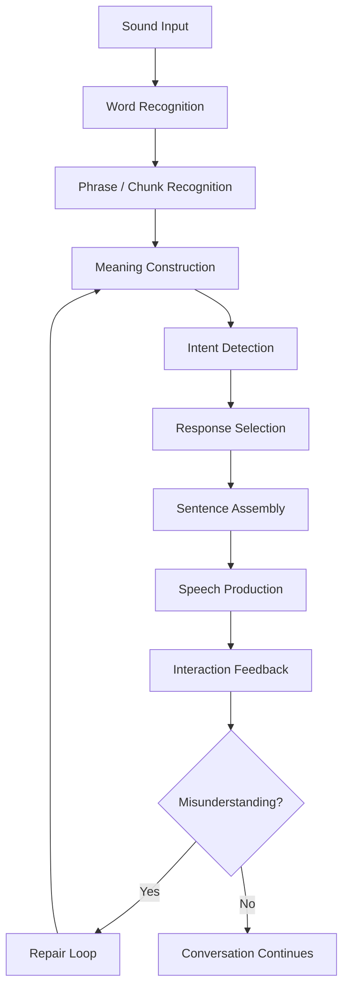
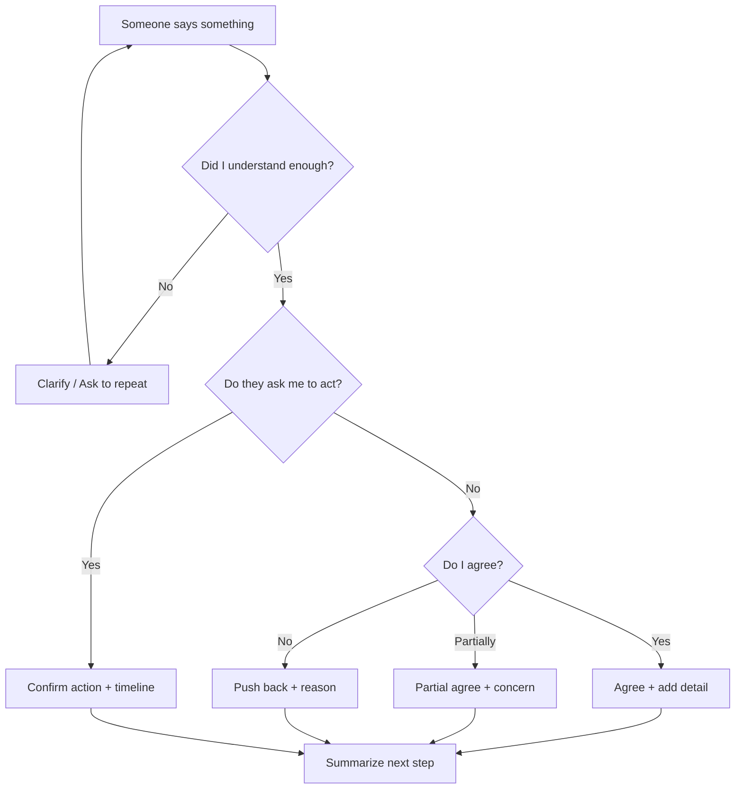
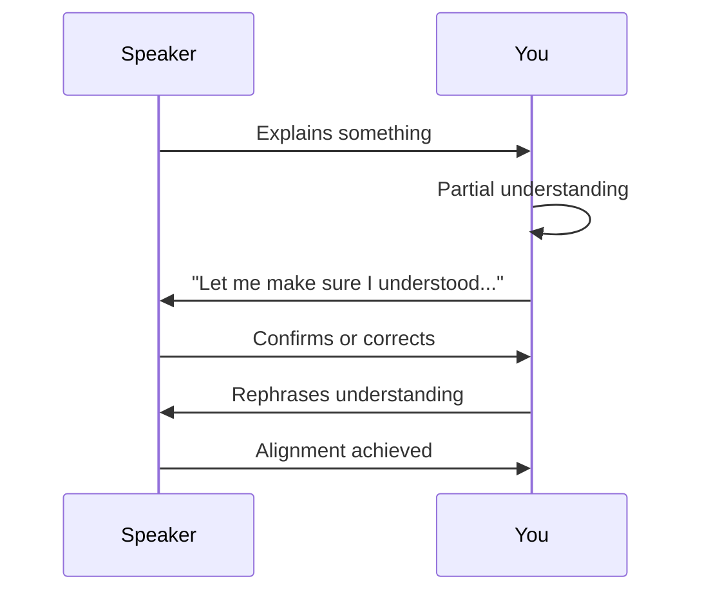
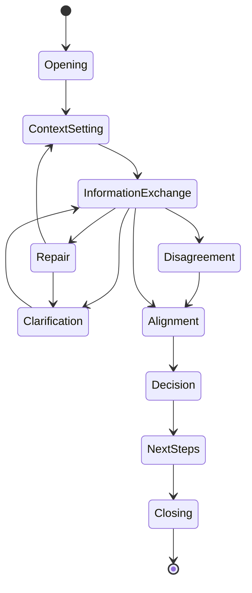
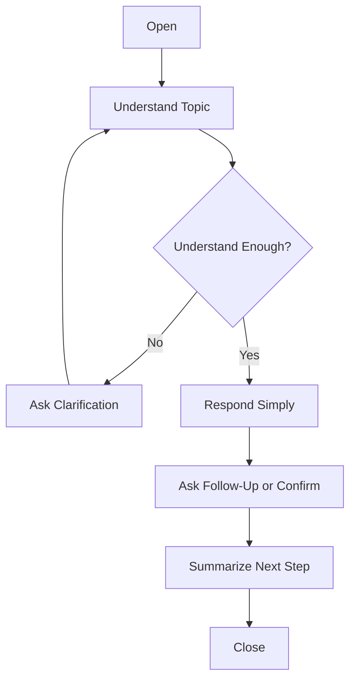

# Part 03 — The Conversation Stack: From Sound to Meaning to Response

> Tujuan part ini: membuat kamu memahami **apa yang sebenarnya terjadi saat conversation berlangsung**. Banyak learner merasa masalahnya adalah “vocabulary kurang” atau “grammar belum siap”. Kadang benar, tetapi sering kali bottleneck sebenarnya ada di pipeline: telinga menangkap sound, otak memetakan sound ke words, lalu mengubahnya menjadi meaning, intent, response, dan speech output dalam waktu singkat.

Part ini bukan tentang menghafal expression. Part ini adalah **arsitektur runtime** untuk English conversation.

---

## 1. Positioning dalam Framework Kaufman

Dalam pendekatan *The First 20 Hours*, skill yang kompleks harus dipecah menjadi sub-skill kecil yang bisa dilatih secara langsung. English conversation terlihat seperti satu skill, padahal di dalamnya ada beberapa proses yang berjalan paralel.

Conversation bukan hanya speaking. Conversation adalah sistem real-time yang terdiri dari:

1. menangkap bunyi,
2. mengenali kata/frasa,
3. memahami makna literal,
4. membaca intent,
5. memilih respons,
6. memproduksi kalimat,
7. memperbaiki kesalahpahaman,
8. menjaga alur sosial percakapan.

Kalau salah satu proses lambat, percakapan terasa macet.

Mental model yang akan dipakai:

> **Conversation is a real-time protocol, not a vocabulary test.**

Sebagai software engineer, bayangkan conversation seperti distributed system dengan latency, backpressure, retry, fallback, error recovery, dan observability.

---

## 2. Masalah Umum: “Saya Paham Kalau Membaca, Tapi Blank Saat Bicara”

Kalimat ini sangat umum. Penyebabnya biasanya bukan karena “bodoh English”, tetapi karena mode pemrosesan yang dipakai berbeda.

Saat membaca:

- kamu punya waktu lebih lama,
- input stabil,
- bisa membaca ulang,
- spelling terlihat jelas,
- tidak ada tekanan sosial,
- bisa berhenti untuk berpikir.

Saat conversation:

- input datang cepat,
- sound tidak selalu jelas,
- kata sering disingkat atau disambung,
- kamu harus merespons dalam beberapa detik,
- ada tekanan sosial,
- kamu perlu menjaga giliran bicara,
- kamu tidak bisa “pause the system” terlalu lama.

Jadi, masalahnya bukan hanya knowledge. Masalahnya adalah **runtime execution**.

---

## 3. Conversation Stack

Kita akan memecah conversation menjadi stack berikut:



Setiap layer punya tugas berbeda. Latihan conversation yang efektif harus tahu layer mana yang sedang dilatih.

---

## 4. Layer 1 — Sound Input

Layer pertama adalah kemampuan menangkap sound English.

Di level ini, kamu belum memikirkan grammar. Kamu hanya berusaha membedakan bunyi yang masuk.

Contoh kalimat meeting:

> “Could you walk us through what happened after the deployment?”

Dalam speech nyata, ini bisa terdengar seperti:

> “Couldja walk us through wha happened after the deployment?”

Masalah learner sering muncul karena mereka mengharapkan English terdengar seperti teks tertulis.

### 4.1 Written English vs Spoken English

| Written Form | Spoken Reality | Catatan |
|---|---|---|
| could you | couldja / could you | /d/ dan /y/ bisa menyatu |
| what happened | wha happened | final /t/ bisa sangat lemah |
| going to | gonna | reduction umum |
| want to | wanna | reduction umum |
| have to | hafta | sound berubah |
| did you | didja | /d/ + /y/ menyatu |
| kind of | kinda | reduction umum |
| sort of | sorta | reduction umum |

Kamu tidak harus selalu meniru semua reduction. Tapi kamu perlu mengenalinya agar listening tidak collapse.

### 4.2 Engineering Example

Kalimat tertulis:

> “Did you check whether the service was still running?”

Kemungkinan terdengar:

> “Didja check whether the service was still running?”

Kalau kamu tidak terbiasa dengan “didja”, kamu mungkin kehilangan awal kalimat, lalu kehilangan konteks, lalu blank.

### 4.3 Drill: Sound Recognition

Latihan 5 menit:

1. Ambil satu kalimat English pendek.
2. Dengarkan versi audio atau text-to-speech.
3. Tulis apa yang kamu dengar tanpa melihat teks.
4. Bandingkan dengan teks asli.
5. Tandai bagian yang hilang:
   - sound lemah,
   - reduction,
   - word stress,
   - connected speech.

Target bukan sempurna. Targetnya adalah tahu pattern sound yang sering gagal kamu tangkap.

---

## 5. Layer 2 — Word Recognition

Setelah sound ditangkap, otak harus mengenali kata.

Masalahnya: kata yang kamu tahu saat membaca belum tentu langsung dikenali saat didengar.

Contoh:

- `cache`
- `queue`
- `throughput`
- `latency`
- `failure`
- `retry`
- `schema`
- `deprecate`
- `idempotent`

Kamu mungkin tahu artinya, tapi belum tentu langsung mengenalinya dalam speech.

### 5.1 Passive Vocabulary vs Listening Vocabulary

Ada beberapa jenis vocabulary:

| Jenis | Definisi | Contoh |
|---|---|---|
| Reading vocabulary | Kata yang kamu pahami saat membaca | tahu `throughput` saat baca docs |
| Listening vocabulary | Kata yang kamu kenali saat didengar | langsung paham saat orang bilang `throughput` |
| Speaking vocabulary | Kata yang bisa kamu pakai spontan | bisa bilang “The throughput drops under load.” |
| Active chunk vocabulary | Frasa yang bisa keluar tanpa menyusun dari nol | “The main issue is...” |

Conversation membutuhkan listening vocabulary dan active chunk vocabulary, bukan hanya reading vocabulary.

### 5.2 Drill: Convert Reading Vocabulary to Listening Vocabulary

Pilih 20 kata teknis yang sering kamu pakai. Untuk setiap kata:

1. cek pronunciation,
2. dengarkan minimal 3 kali,
3. ucapkan sendiri,
4. pakai dalam satu kalimat kerja,
5. rekam,
6. dengarkan ulang.

Contoh:

- `latency` → “The latency increased after the rollout.”
- `regression` → “This looks like a regression from the last release.”
- `rollback` → “We may need to rollback if the error rate keeps increasing.”

---

## 6. Layer 3 — Chunk Recognition

Native dan fluent speakers tidak memproses conversation kata per kata. Mereka memproses banyak input sebagai chunks.

Chunk adalah unit makna yang sering muncul bersama.

Contoh:

- “as far as I know”
- “from my perspective”
- “the main issue is”
- “what I’m trying to say is”
- “let me clarify”
- “that makes sense”
- “I’m not sure if”
- “it depends on”
- “we need to figure out”

Kalau kamu memproses kata per kata, latency tinggi.

Kalau kamu memproses chunk, latency turun.

### 6.1 Chunk vs Word-by-Word Translation

Word-by-word:

> Saya / tidak / yakin / apakah / ini / akan / bekerja.

English output yang lambat:

> I... am... not... sure... whether... this... will... work.

Chunk-based:

> I’m not sure if this will work.

Lebih natural, lebih cepat, dan lebih mudah dipakai.

### 6.2 High-Value Chunks for Conversation

| Function | Chunk | Example |
|---|---|---|
| Thinking | “Let me think for a second.” | Let me think for a second. I think the issue is in the cache layer. |
| Clarifying | “Do you mean...?” | Do you mean the API fails only in production? |
| Explaining | “The main issue is...” | The main issue is that the retry logic is too aggressive. |
| Disagreeing | “I see your point, but...” | I see your point, but I’m worried about the migration risk. |
| Suggesting | “We might want to...” | We might want to add a feature flag first. |
| Confirming | “Let me make sure I understood.” | Let me make sure I understood. You want us to delay the release, right? |
| Summarizing | “So the next step is...” | So the next step is to reproduce the issue locally. |

### 6.3 Drill: Chunk Recognition

Ambil 10 chunks. Untuk setiap chunk:

1. ucapkan 5 kali,
2. buat 3 variasi kalimat,
3. pakai dalam roleplay 1 menit,
4. rekam,
5. ulangi sampai bisa keluar tanpa berpikir panjang.

---

## 7. Layer 4 — Meaning Construction

Setelah mengenali words dan chunks, kamu membangun meaning.

Meaning bukan sekadar terjemahan literal. Meaning adalah jawaban dari:

- apa yang sedang dibicarakan?
- apa masalahnya?
- siapa melakukan apa?
- kapan terjadi?
- apa dampaknya?
- apa yang diminta dariku?

Contoh:

> “We’re seeing intermittent failures after the last deployment, mostly on the payment service. Could you check whether this is related to the timeout change?”

Meaning yang perlu kamu tangkap:

- ada failure,
- sifatnya intermittent,
- terjadi setelah deployment terakhir,
- mostly di payment service,
- kamu diminta check hubungan dengan timeout change.

Kamu tidak perlu menangkap setiap kata untuk bisa merespons dengan baik.

### 7.1 Meaning Compression

Conversation membutuhkan compression. Kamu harus cepat mengambil inti.

Input panjang:

> “The customer support team has been reporting a few issues since yesterday. It looks like some users can’t complete checkout, but we’re not sure if it’s a frontend issue or a backend issue. The logs show some timeout errors, but they’re not consistent.”

Compressed meaning:

> Some users can’t checkout. It started yesterday. Possible timeout issue. Root cause unclear.

Possible response:

> “Got it. I’ll first check the timeout errors and compare them with checkout failures. Do we know which user segment is affected?”

### 7.2 Drill: Compress the Meaning

Latihan:

1. Ambil satu paragraph meeting transcript.
2. Ringkas menjadi 1 kalimat.
3. Ringkas lagi menjadi 5 keywords.
4. Buat respons berdasarkan 5 keywords.

Format:

```text
Original:
...
One-sentence meaning:
...
Five keywords:
...
Response:
...
```

---

## 8. Layer 5 — Intent Detection

Conversation sering gagal bukan karena meaning literal tidak dipahami, tetapi karena intent tidak terbaca.

Satu kalimat bisa punya beberapa intent.

Kalimat:

> “Do you have a minute?”

Literal meaning:

> Apakah kamu punya satu menit?

Real intent:

> Saya ingin bicara sebentar / minta bantuan / membahas sesuatu.

Kalimat:

> “Can we revisit this decision?”

Literal meaning:

> Bisakah kita membahas ulang keputusan ini?

Possible intent:

- dia tidak setuju,
- ada concern baru,
- data berubah,
- keputusan sebelumnya belum solid,
- dia ingin membuka diskusi ulang tanpa terdengar konfrontatif.

### 8.1 Intent Categories

| Intent | Signal | Example |
|---|---|---|
| Request | Can you / Could you / Would you | Could you check the logs? |
| Clarification | Do you mean / Are you saying | Do you mean the failure happens only on mobile? |
| Concern | I’m worried / My concern is | My concern is the migration risk. |
| Suggestion | We could / We might want to | We could add a retry limit. |
| Pushback | I’m not sure / I’m not convinced | I’m not convinced this solves the root cause. |
| Alignment | Just to confirm / So we agree | Just to confirm, we’re postponing the release? |
| Escalation | We need to / This is urgent | We need to involve infra now. |

### 8.2 Engineering Intent Examples

#### Example 1

> “I’m not sure this will scale.”

Possible intent:

- concern about performance,
- request for evidence,
- soft disagreement,
- invitation to discuss trade-off.

Good response:

> “That’s fair. The main risk is write throughput. I can run a load test and share the numbers before we commit.”

#### Example 2

> “Can we make this simpler?”

Possible intent:

- design feels over-engineered,
- maintainability concern,
- asking for alternative,
- challenging complexity.

Good response:

> “Yes, we can simplify it. The current design handles two edge cases, but if those are not required now, we can start with a smaller version.”

---

## 9. Layer 6 — Response Selection

Setelah memahami intent, kamu harus memilih jenis respons.

Ini bagian yang sering membuat learner freeze. Mereka mencoba membuat kalimat sempurna, bukan memilih response type terlebih dahulu.

Urutan yang lebih baik:

1. pilih response type,
2. pakai pattern siap pakai,
3. isi detail sesuai konteks.

### 9.1 Response Types

| Situation | Response Type | Useful Frame |
|---|---|---|
| Tidak paham | Clarify | “Could you clarify what you mean by...?” |
| Butuh waktu berpikir | Buy time | “Let me think for a second.” |
| Setuju | Agree | “That makes sense.” |
| Setuju sebagian | Partial agree | “I agree with the goal, but I’m concerned about...” |
| Tidak setuju | Push back | “I’m not fully convinced because...” |
| Punya ide | Suggest | “We might want to...” |
| Butuh data | Ask evidence | “Do we have data on...?” |
| Ambil keputusan | Decide | “Given the risk, I’d recommend...” |
| Tutup diskusi | Summarize | “So the next step is...” |

### 9.2 Response Selection Decision Tree



### 9.3 Response Template: Understand → Decide → Speak

Gunakan template internal ini:

```text
1. What is the topic?
2. What is their intent?
3. What response type do I need?
4. Which sentence frame fits?
5. What detail should I add?
```

Example:

Input:

> “Can you check why the deployment failed?”

Internal processing:

```text
Topic: deployment failure
Intent: request for investigation
Response type: confirm action
Frame: “Sure, I’ll check...”
Detail: logs + CI pipeline + update in 30 minutes
```

Output:

> “Sure, I’ll check the CI logs and deployment events first. I’ll update you once I find the failing step.”

---

## 10. Layer 7 — Sentence Assembly

Sentence assembly adalah proses menyusun output.

Learner sering mencoba membuat kalimat dari grammar rule. Ini lambat.

Lebih efektif: gunakan **sentence frames**.

### 10.1 Frame-Based Assembly

Frame:

> “The main issue is [problem].”

Variasi:

- The main issue is the timeout setting.
- The main issue is the migration risk.
- The main issue is that the cache is not invalidated.
- The main issue is that we don’t have enough observability.

Frame:

> “I’m concerned about [risk].”

Variasi:

- I’m concerned about the rollback plan.
- I’m concerned about data consistency.
- I’m concerned about the operational impact.
- I’m concerned about how this behaves under load.

Frame mengurangi cognitive load. Kamu tidak membuat struktur dari nol.

### 10.2 Sentence Assembly Layers

Kalimat conversation biasanya bisa dibangun dari:

```text
Function + Frame + Detail + Optional Reason
```

Example:

```text
Function: disagree politely
Frame: I’m not fully convinced that...
Detail: this solves the root cause
Reason: because the error also happens before authentication
```

Output:

> “I’m not fully convinced that this solves the root cause, because the error also happens before authentication.”

---

## 11. Layer 8 — Speech Production

Speech production adalah kemampuan mengucapkan kalimat dengan cukup jelas dan cukup cepat.

Goal-nya bukan native accent. Goal-nya:

- understandable,
- stable,
- confident enough,
- not too slow,
- easy to follow.

### 11.1 The Real Problem: Mouth Has Not Practiced the Path

Kamu bisa tahu kalimatnya, tetapi mulut belum otomatis mengucapkannya.

Contoh kalimat:

> “I’m not fully convinced this approach solves the root cause.”

Kalau belum pernah diucapkan, kamu akan tersendat.

Solusi: drilling kalimat yang sering dipakai sampai mouth memory terbentuk.

### 11.2 Mouth Memory Drill

Pilih satu sentence frame:

> “I’m not fully convinced that...”

Latihan:

1. ucapkan pelan 3 kali,
2. ucapkan normal 5 kali,
3. isi dengan 5 variasi,
4. rekam 1 menit,
5. dengarkan apakah jelas,
6. ulangi esok hari.

Variasi:

- I’m not fully convinced that this will scale.
- I’m not fully convinced that this is the root cause.
- I’m not fully convinced that we need a new service.
- I’m not fully convinced that the migration is safe.
- I’m not fully convinced that the data supports that conclusion.

---

## 12. Layer 9 — Interaction Feedback

Conversation adalah loop. Kamu harus membaca feedback dari lawan bicara.

Feedback bisa berupa:

- mereka mengangguk,
- mereka diam,
- mereka bertanya ulang,
- mereka terlihat bingung,
- mereka memotong,
- mereka summarize ulang,
- mereka mengubah topik.

### 12.1 Signals That You Were Understood

| Signal | Meaning |
|---|---|
| “Got it.” | Mereka paham cukup untuk lanjut |
| “That makes sense.” | Penjelasan diterima |
| Follow-up question | Mereka engaged atau butuh detail |
| Mereka summarize ulang dengan benar | Alignment terbentuk |
| Mereka memberi next step | Conversation berhasil bergerak |

### 12.2 Signals That You Need to Repair

| Signal | Possible Meaning | Action |
|---|---|---|
| “Sorry, what do you mean?” | Penjelasan kurang jelas | Rephrase |
| “Can you give an example?” | Terlalu abstrak | Give concrete example |
| “So are you saying...?” | Mereka mencoba confirm | Confirm or correct |
| Silence | Bingung / berpikir / tidak setuju | Check understanding |
| Topic jumps unexpectedly | Misalignment | Bring back context |

Useful repair phrase:

> “Let me rephrase that.”

> “What I mean is...”

> “A simpler way to say it is...”

> “For example...”

---

## 13. The Repair Loop

Repair adalah kemampuan memperbaiki conversation saat ada error.

Tanpa repair loop, learner merasa conversation gagal saat tidak paham satu kalimat. Dengan repair loop, misunderstanding menjadi normal.



### 13.1 Repair Is Not Failure

Kalimat penting:

> Misunderstanding is not failure. Not repairing is failure.

Dalam engineering, tidak ada distributed system yang reliable tanpa retry, timeout, idempotency, dan error handling. Conversation juga begitu.

### 13.2 Repair Phrasebank

| Situation | Phrase |
|---|---|
| Tidak dengar | “Sorry, I didn’t catch that.” |
| Tidak paham kata tertentu | “What do you mean by ‘blast radius’ in this context?” |
| Butuh rephrase | “Could you rephrase that?” |
| Confirm meaning | “Do you mean the issue happens only after login?” |
| Confirm action | “Just to confirm, you want me to check the logs first?” |
| Correct misunderstanding | “Actually, what I meant was...” |
| Simplify your own explanation | “Let me put it another way.” |

---

## 14. Conversation Latency

Latency adalah waktu antara input lawan bicara dan respons kamu.

Learner sering punya high latency karena pipeline internal terlalu panjang:

```text
English input → translate to Indonesian → think in Indonesian → translate to English → check grammar → speak
```

Ini lambat dan fragile.

Targetnya bukan langsung berpikir 100% dalam English. Target awal adalah mengurangi beberapa translation hops.

Pipeline yang lebih baik:

```text
English input → capture intent → choose response frame → fill detail → speak
```

### 14.1 Where Latency Comes From

| Bottleneck | Symptom | Fix |
|---|---|---|
| Listening uncertainty | sering “hah?” | sound + chunk recognition |
| Vocabulary retrieval | tahu kata tapi lupa | active phrasebank |
| Grammar checking | freeze sebelum bicara | sentence frames |
| Fear of mistakes | terlalu lama diam | repair phrases |
| No response strategy | bingung harus jawab apa | response type decision tree |

### 14.2 Latency Reduction Drill

Latihan 10 menit:

Gunakan prompt acak:

- “Can you explain the issue?”
- “What’s the blocker?”
- “Do you agree with this approach?”
- “Can we deploy this today?”
- “What’s the risk?”

Untuk setiap prompt:

1. jawab dalam maksimal 5 detik,
2. boleh pakai kalimat sederhana,
3. jangan pause untuk grammar perfection,
4. setelah menjawab, baru self-correct.

Example:

Prompt:

> “What’s the risk?”

Fast response:

> “The main risk is data inconsistency during the migration.”

Self-correction optional:

> “More specifically, if the sync job fails halfway, some records may be updated in one system but not the other.”

---

## 15. Conversation as State Machine

Untuk software engineer, conversation bisa dimodelkan sebagai state machine.



State penting:

| State | Goal | Example Phrase |
|---|---|---|
| Opening | mulai percakapan | “Hey, do you have a minute?” |
| ContextSetting | set konteks | “I wanted to talk about the payment issue.” |
| InformationExchange | tukar informasi | “The error started after the deployment.” |
| Clarification | kurangi ambiguity | “Do you mean only mobile users are affected?” |
| Disagreement | challenge idea | “I’m not sure that approach is safe.” |
| Alignment | samakan pemahaman | “So we agree that rollback is the safest option.” |
| Decision | pilih action | “Let’s rollback first, then investigate.” |
| NextSteps | assign follow-up | “I’ll check the logs, and you can notify support.” |
| Closing | tutup percakapan | “Thanks, I’ll send an update shortly.” |

Kalau kamu tahu state percakapan, kamu lebih mudah memilih kalimat.

---

## 16. Practical Scenario: Debugging Conversation

### 16.1 Raw Conversation

Engineer A:

> “We’re seeing intermittent checkout failures after the latest deployment. I’m not sure if it’s related to the payment timeout change or the new validation logic. Can you take a look?”

You:

> “Sure. Let me make sure I understood. The failures started after the latest deployment, and the two possible causes are the payment timeout change or the validation logic, right?”

Engineer A:

> “Exactly.”

You:

> “Got it. I’ll check the error logs and compare the failure timestamps with the deployment timeline. Do we know if this affects all users or only a specific segment?”

### 16.2 Stack Analysis

| Layer | What Happened |
|---|---|
| Sound input | kamu menangkap kalimat panjang |
| Word recognition | checkout, failures, deployment, timeout, validation |
| Chunk recognition | “I’m not sure if...”, “Can you take a look?” |
| Meaning | ada failure setelah deployment, root cause belum pasti |
| Intent | request investigation |
| Response selection | confirm understanding + accept task + ask diagnostic question |
| Sentence assembly | pakai frame “Let me make sure I understood...” |
| Speech production | output jelas dan structured |
| Feedback | “Exactly” memberi alignment |

### 16.3 Why This Works

Respons tersebut bagus karena:

- tidak langsung sok tahu,
- mengkonfirmasi pemahaman,
- mengubah input panjang menjadi hypothesis set,
- menunjukkan next step,
- bertanya diagnostic question.

---

## 17. Practical Scenario: Architecture Discussion

### 17.1 Raw Conversation

Architect:

> “I’m concerned that introducing another service here might increase operational complexity. What do you think?”

You:

> “I see the concern. The trade-off is between isolation and operational overhead. If we keep it inside the existing service, it’s simpler to operate, but the domain boundary stays blurry. If we split it, we get clearer ownership, but we need better monitoring and deployment automation.”

Architect:

> “So which one would you recommend?”

You:

> “Given our current team size, I’d recommend keeping it inside the existing service for now, but separating the module boundary clearly so we can extract it later if needed.”

### 17.2 Stack Analysis

| Layer | What Happened |
|---|---|
| Intent detection | concern + request for opinion |
| Response selection | acknowledge + compare trade-offs |
| Sentence assembly | “The trade-off is between...” |
| Meaning construction | isolation vs operational complexity |
| Decision response | recommendation based on constraint |

This is professional conversation: not just English, but structured thinking expressed in English.

---

## 18. Common Failure Modes

### 18.1 Trying to Understand Every Word

Bad strategy:

> “I missed one word, so I lost everything.”

Better strategy:

> “I missed one word, but I can still catch topic, intent, and required action.”

Practice:

- listen for nouns,
- listen for verbs,
- listen for request signals,
- listen for contrast words:
  - but,
  - however,
  - although,
  - the problem is,
  - my concern is.

### 18.2 Translating Full Sentences Internally

Bad pipeline:

> Indonesian thought → perfect English sentence → speak.

Better pipeline:

> intent → frame → detail.

Example:

Intent:

> kurang setuju karena risk besar.

Frame:

> “I’m not fully convinced because...”

Detail:

> “the rollback plan is not clear yet.”

Output:

> “I’m not fully convinced because the rollback plan is not clear yet.”

### 18.3 Over-Optimizing Grammar

Conversation grammar should be good enough to preserve meaning.

Bad:

> diam 20 detik karena mencari tense sempurna.

Better:

> bicara sederhana, lalu repair jika perlu.

Example:

Initial:

> “The issue start after deployment.”

Self-repair:

> “Sorry, I mean it started after the deployment.”

This is acceptable. Repair is part of fluency.

### 18.4 Having No Default Response

Kalau kamu tidak punya default response, kamu freeze.

Siapkan default:

| Situation | Default Response |
|---|---|
| Butuh waktu | “Let me think for a second.” |
| Tidak dengar | “Sorry, I didn’t catch that.” |
| Tidak paham | “Could you clarify that?” |
| Setuju | “That makes sense.” |
| Tidak yakin | “I’m not sure yet. My initial thought is...” |
| Butuh data | “Do we have any data on that?” |
| Mau summarize | “So, just to summarize...” |

---

## 19. Minimal Viable Conversation Protocol

Untuk 20 jam pertama, kamu tidak butuh semua expression. Kamu butuh protocol minimum agar bisa survive dan berkembang.

### 19.1 MVC: Minimum Viable Conversation



### 19.2 Minimum Phrase Set

| Function | Phrase |
|---|---|
| Start | “Can I ask you something?” |
| Ask context | “What’s the context?” |
| Clarify | “Could you clarify that?” |
| Confirm | “Do you mean...?” |
| Think | “Let me think for a second.” |
| Explain | “The main issue is...” |
| Suggest | “We might want to...” |
| Concern | “My concern is...” |
| Agree | “That makes sense.” |
| Disagree | “I’m not fully convinced because...” |
| Summarize | “So the next step is...” |
| Close | “Thanks, I’ll follow up on that.” |

Dengan phrase set ini, kamu sudah bisa menjalankan banyak conversation sederhana.

---

## 20. Self-Diagnostic: Find Your Bottleneck

Gunakan checklist berikut untuk menemukan bottleneck utama.

### 20.1 Listening Bottleneck

Tanda:

- sering gagal menangkap awal kalimat,
- hanya paham kalau orang bicara pelan,
- bingung dengan reduction,
- sulit memahami meeting tanpa transcript.

Latihan utama:

- sound recognition,
- chunk listening,
- shadowing,
- transcript comparison.

### 20.2 Meaning Bottleneck

Tanda:

- mendengar kata-kata, tapi tidak menangkap inti,
- sulit membedakan detail penting dan tidak penting,
- butuh waktu lama untuk summarize.

Latihan utama:

- meaning compression,
- 5-keyword summary,
- summarize-back drill.

### 20.3 Response Bottleneck

Tanda:

- paham pertanyaan, tapi bingung jawab apa,
- sering freeze,
- respons terlalu pendek atau terlalu panjang,
- tidak punya phrase default.

Latihan utama:

- response type selection,
- sentence frames,
- 5-second response drills.

### 20.4 Speech Production Bottleneck

Tanda:

- kalimat sudah ada di kepala tapi sulit diucapkan,
- pronunciation tidak stabil,
- banyak pause di tengah phrase,
- kehilangan confidence saat bicara.

Latihan utama:

- mouth memory,
- shadowing,
- recording,
- repeated phrase practice.

### 20.5 Repair Bottleneck

Tanda:

- panik saat tidak paham,
- malu minta ulang,
- membiarkan misunderstanding berlanjut,
- tidak bisa mengoreksi diri.

Latihan utama:

- repair phrasebank,
- clarification roleplay,
- misunderstanding simulation.

---

## 21. The 30-Minute Practice Session for This Part

Gunakan sesi berikut untuk melatih conversation stack.

### 21.1 Minute 0–5: Warm-Up

Ucapkan 10 phrase berikut:

1. Let me think for a second.
2. Could you clarify that?
3. Do you mean this happens in production?
4. The main issue is the timeout.
5. My concern is the migration risk.
6. That makes sense.
7. I’m not fully convinced because we don’t have enough data.
8. We might want to add more logging.
9. So the next step is to check the logs.
10. Thanks, I’ll follow up on that.

### 21.2 Minute 5–10: Listening to Chunks

Dengarkan 5 kalimat English pendek. Tulis chunks yang kamu tangkap, bukan semua kata.

Format:

```text
Sentence:
Chunks I heard:
Meaning:
Intent:
```

### 21.3 Minute 10–20: Response Selection Drill

Gunakan prompt:

1. “Can you explain what happened?”
2. “Do you agree with this design?”
3. “Can we deploy this today?”
4. “What’s your main concern?”
5. “Could you check the logs?”

Untuk setiap prompt:

```text
Prompt:
Intent:
Response type:
Frame:
Response:
```

### 21.4 Minute 20–25: Repair Drill

Simulasikan tidak paham:

Prompt:

> “The issue seems to be related to the downstream dependency timeout.”

Possible repair:

> “Could you clarify what you mean by downstream dependency in this case?”

Prompt:

> “We should reduce the blast radius before rolling this out.”

Possible repair:

> “Do you mean we should release it to a smaller group first?”

### 21.5 Minute 25–30: Recording

Rekam jawaban 1 menit:

> “Explain a recent technical issue you worked on.”

Gunakan struktur:

```text
Context → Problem → Cause → Action → Next Step
```

Lalu evaluasi:

| Area | Score 1–5 | Note |
|---|---:|---|
| Clarity |  |  |
| Response speed |  |  |
| Sentence structure |  |  |
| Pronunciation |  |  |
| Repair ability |  |  |

---

## 22. Engineering Conversation Pattern Library

### 22.1 Asking for Context

- “Can you give me a bit more context?”
- “What happened before this issue started?”
- “Which environment are we talking about?”
- “Is this happening in production or staging?”
- “Who is affected by this?”

### 22.2 Confirming Understanding

- “Let me make sure I understood.”
- “So the issue started after the deployment, right?”
- “Do you mean the API fails only for new users?”
- “If I understand correctly, the problem is with the retry logic.”

### 22.3 Explaining Cause

- “The likely cause is...”
- “This might be caused by...”
- “It looks like the service is timing out because...”
- “The error suggests that...”

### 22.4 Expressing Uncertainty

- “I’m not completely sure yet.”
- “My initial guess is...”
- “I need to check the logs first.”
- “It’s too early to say, but...”

### 22.5 Suggesting Next Steps

- “We should first reproduce the issue.”
- “We might want to check the deployment diff.”
- “I’d suggest adding more logging before changing the logic.”
- “The safest next step is to rollback.”

---

## 23. Key Invariants

Pegang invariants berikut:

1. **Conversation is real-time.** Jangan memakai strategi belajar yang hanya bagus untuk reading.
2. **Listening and speaking are coupled.** Kalau listening lambat, speaking ikut lambat.
3. **Chunks beat isolated words.** Conversation berjalan dengan phrase, bukan dictionary lookup.
4. **Intent matters more than literal translation.** Respons harus menjawab maksud, bukan hanya kata.
5. **Repair is part of fluency.** Minta klarifikasi bukan tanda gagal.
6. **Frames reduce latency.** Sentence frames membuat output lebih cepat dan stabil.
7. **Meaning compression is essential.** Kamu tidak perlu menangkap setiap kata untuk merespons baik.
8. **Feedback closes the loop.** Perhatikan apakah lawan bicara paham.

---

## 24. Common Anti-Patterns

### 24.1 Memorizing Long Dialogues Without Understanding State

Menghafal dialog panjang tidak scalable. Lebih baik pahami state:

- opening,
- context,
- clarification,
- response,
- alignment,
- next step.

Dengan state, kamu bisa adaptif.

### 24.2 Waiting Until Grammar Is Perfect

Grammar penting, tetapi conversation skill tidak muncul dari grammar study saja.

Kamu perlu praktik real-time sejak awal.

### 24.3 Avoiding Clarification

Banyak learner pura-pura paham karena malu. Ini berbahaya di konteks engineering.

Lebih baik:

> “Let me make sure I understood.”

Daripada salah implementasi.

### 24.4 Speaking Too Abstractly

Bad:

> “The system has some problem related to data.”

Better:

> “The sync job failed halfway, so some records were updated in the billing system but not in the reporting database.”

---

## 25. Homework

### 25.1 Build Your Conversation Stack Log

Selama 3 hari, setiap kali kamu berlatih English, catat bottleneck.

Format:

```text
Date:
Scenario:
What I heard:
What I understood:
What I wanted to say:
What I actually said:
Where I got stuck:
Layer affected:
Next drill:
```

Layer affected:

- sound input,
- word recognition,
- chunk recognition,
- meaning,
- intent,
- response selection,
- sentence assembly,
- speech production,
- repair.

### 25.2 Create 20 Default Responses

Buat 20 response yang bisa kamu pakai dalam meeting.

Minimal mencakup:

- 3 clarification phrases,
- 3 thinking-time phrases,
- 3 agreement phrases,
- 3 disagreement phrases,
- 3 suggestion phrases,
- 3 next-step phrases,
- 2 closing phrases.

### 25.3 Record One Debugging Explanation

Prompt:

> “Explain a bug you recently fixed.”

Struktur:

```text
The issue was...
It happened when...
The root cause was...
I fixed it by...
The next thing I would improve is...
```

Target durasi: 60–90 detik.

---

## 26. Part Summary

Di part ini, kamu mempelajari bahwa English conversation adalah stack, bukan satu skill tunggal.

Stack tersebut terdiri dari:

1. sound input,
2. word recognition,
3. chunk recognition,
4. meaning construction,
5. intent detection,
6. response selection,
7. sentence assembly,
8. speech production,
9. interaction feedback,
10. repair loop.

Skill conversation meningkat cepat ketika kamu tahu bottleneck mana yang sedang dilatih.

Kamu tidak perlu menunggu vocabulary sempurna. Kamu perlu membangun runtime conversation yang cukup reliable:

```text
understand enough → choose response type → use frame → speak → repair if needed
```

---

## 27. What Comes Next

Part berikutnya akan membahas **core sentence patterns**.

Kita akan membangun pattern dasar yang menjadi “standard library” untuk English conversation:

- statement,
- question,
- negative,
- request,
- suggestion,
- opinion,
- uncertainty,
- clarification,
- agreement,
- disagreement.

Tujuannya adalah mengurangi latency dan membuat kamu bisa berbicara dengan struktur yang jelas tanpa harus merakit grammar dari nol setiap kali.
