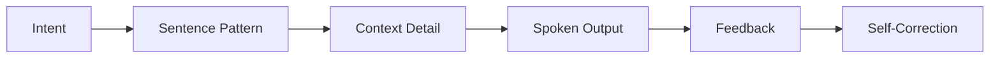
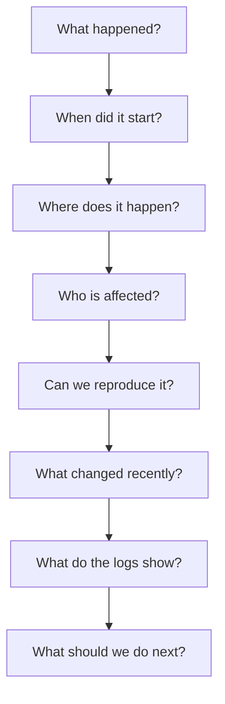

# Part 04 — Core Sentence Patterns for Real Conversation

> Tujuan part ini: membangun **standard library kalimat** untuk conversation. Kamu tidak akan mulai dari grammar textbook. Kamu akan mulai dari pattern yang paling sering dipakai dalam percakapan nyata, terutama di konteks software engineering.

Part ini menjawab masalah utama learner:

> “Saya tahu grammar, tapi saat bicara saya tidak tahu harus mulai dari mana.”

Solusinya adalah **sentence pattern**.

---

## 1. Positioning dalam Framework Kaufman

Dalam framework *The First 20 Hours*, setelah skill dipecah menjadi sub-skill, kita perlu belajar cukup teori untuk bisa praktik dan self-correct. Untuk English conversation, grammar tidak boleh menjadi bottleneck. Grammar harus menjadi alat untuk membangun output yang jelas.

Di part ini, kita tidak mengejar semua grammar. Kita memilih pattern dengan return on investment paling tinggi:

- statement,
- negative statement,
- yes/no question,
- WH question,
- request,
- suggestion,
- opinion,
- uncertainty,
- clarification,
- confirmation,
- agreement,
- disagreement,
- next step.

Mental model:

> **Conversation fluency comes from reusable patterns plus context-specific details.**

Bukan:

```text
Think in Indonesian → translate word by word → check grammar → speak
```

Melainkan:

```text
Intent → Pattern → Detail → Speak
```

---

## 2. Why Sentence Patterns Matter

Kalau kamu membuat kalimat dari nol setiap kali bicara, cognitive load terlalu tinggi.

Kamu harus memikirkan:

- grammar,
- vocabulary,
- pronunciation,
- meaning,
- intent,
- social tone,
- response timing.

Pattern mengurangi beban itu.

### 2.1 Pattern as API

Sebagai software engineer, pikirkan pattern seperti API.

Kamu tidak menulis TCP stack setiap kali ingin memanggil service. Kamu memakai abstraction.

Sentence pattern juga begitu.

```text
Function: express concern
Pattern: "My concern is [risk]."
Detail: "the migration may break existing reports"
Output: "My concern is the migration may break existing reports."
```

Pattern adalah function signature. Detail adalah argument.



---

## 3. The Core Conversation Grammar You Actually Need Early

Untuk early conversation, grammar yang paling penting adalah:

1. subject + verb + object/complement,
2. auxiliary verbs,
3. simple tense control,
4. modal verbs,
5. question formation,
6. negation,
7. clause connection,
8. conditionals.

Kamu tidak perlu memulai dari semua grammar exception. Kamu perlu struktur stabil yang bisa dipakai.

---

## 4. Pattern 1 — Basic Statement

### 4.1 Structure

```text
Subject + Verb + Object / Complement
```

Examples:

- “The service failed.”
- “The API returns an error.”
- “The cache stores stale data.”
- “The deployment caused a regression.”
- “The user cannot complete checkout.”

### 4.2 Why This Matters

Statement adalah default unit of meaning. Kalau kamu bisa membuat statement jelas, kamu bisa menjelaskan hampir semua hal.

Bad:

> “In payment maybe error because deployment.”

Better:

> “The payment service started failing after the deployment.”

### 4.3 Engineering Statement Frames

| Frame | Example |
|---|---|
| “The issue is [problem].” | The issue is the timeout configuration. |
| “The problem happens when [condition].” | The problem happens when the user refreshes the page. |
| “The service returns [result].” | The service returns a 500 error. |
| “The logs show [evidence].” | The logs show repeated timeout errors. |
| “The deployment changed [component].” | The deployment changed the validation logic. |
| “The system expects [input].” | The system expects a valid session token. |
| “The client sends [data].” | The client sends an empty payload. |

### 4.4 Drill

Buat 10 statement dari pekerjaanmu.

Format:

```text
The issue is...
The problem happens when...
The logs show...
The service returns...
The user sees...
```

Example answers:

- The issue is the missing index.
- The problem happens when the request payload is empty.
- The logs show a database timeout.
- The service returns a 401 error.
- The user sees a blank page.

---

## 5. Pattern 2 — Negative Statement

### 5.1 Structure

```text
Subject + do/does/did + not + base verb
Subject + is/are/was/were + not + complement
Subject + has/have + not + past participle
```

Examples:

- “The service does not return a response.”
- “The issue does not happen in staging.”
- “The user did not receive the email.”
- “The cache is not updated.”
- “The migration has not finished.”

### 5.2 Common Mistake

Wrong:

> “The service not return response.”

Correct:

> “The service does not return a response.”

Wrong:

> “The issue not happen in staging.”

Correct:

> “The issue does not happen in staging.”

### 5.3 Engineering Negative Frames

| Frame | Example |
|---|---|
| “It does not happen in [environment].” | It does not happen in staging. |
| “The service does not [verb].” | The service does not retry the request. |
| “The user cannot [action].” | The user cannot complete checkout. |
| “We do not have [resource/data].” | We do not have enough logs yet. |
| “This is not related to [component].” | This is not related to authentication. |
| “The change has not been deployed yet.” | The change has not been deployed yet. |

### 5.4 Drill

Convert positive to negative:

| Positive | Negative |
|---|---|
| The service returns a response. | The service does not return a response. |
| The issue happens in staging. | The issue does not happen in staging. |
| The user received the email. | The user did not receive the email. |
| The job has finished. | The job has not finished. |
| The cache is updated. | The cache is not updated. |

---

## 6. Pattern 3 — Simple Present for General Facts and Current Behavior

### 6.1 Use When

Gunakan simple present untuk:

- general truth,
- system behavior,
- repeated behavior,
- current architecture,
- documentation-style explanation.

Examples:

- “The service validates the token before processing the request.”
- “The API returns cached data for repeated queries.”
- “The worker retries failed jobs three times.”
- “The frontend sends the request to the gateway.”

### 6.2 Structure

```text
I/You/We/They + base verb
He/She/It/The service + verb-s
```

Examples:

- “We store the data in Postgres.”
- “The service stores the data in Postgres.”
- “They call the API every five minutes.”
- “The scheduler calls the API every five minutes.”

### 6.3 Common Mistake

Wrong:

> “The service validate the token.”

Correct:

> “The service validates the token.”

Wrong:

> “The worker retry the job.”

Correct:

> “The worker retries the job.”

### 6.4 Drill

Explain a system using simple present:

```text
The frontend...
The gateway...
The service...
The database...
The worker...
```

Example:

> The frontend sends the request to the gateway. The gateway validates the token. The payment service processes the transaction. The database stores the result. The worker sends a confirmation email.

---

## 7. Pattern 4 — Simple Past for Incidents and Completed Work

### 7.1 Use When

Gunakan simple past untuk:

- incident timeline,
- completed task,
- past bug,
- previous decision,
- debugging story.

Examples:

- “The issue started after the deployment.”
- “We rolled back the release.”
- “The job failed at 2 AM.”
- “I checked the logs yesterday.”
- “The team decided to postpone the migration.”

### 7.2 Structure

```text
Subject + past verb
```

Examples:

- start → started
- fail → failed
- check → checked
- deploy → deployed
- rollback → rolled back
- decide → decided

Irregular examples:

- go → went
- find → found
- send → sent
- make → made
- break → broke
- write → wrote

### 7.3 Incident Timeline Frame

```text
The issue started when...
Then we checked...
We found that...
So we...
After that...
```

Example:

> The issue started after the deployment. Then we checked the logs and found repeated timeout errors. So we rolled back the release. After that, the error rate went back to normal.

### 7.4 Drill

Tell a debugging story using simple past:

```text
The issue started...
I checked...
I found...
I fixed...
I verified...
```

---

## 8. Pattern 5 — Future and Intention

### 8.1 Use When

Gunakan future pattern untuk:

- next steps,
- plan,
- commitment,
- prediction,
- decision.

Common forms:

| Form | Use | Example |
|---|---|---|
| will | decision / prediction | I’ll check the logs. |
| going to | plan / intention | We’re going to deploy tomorrow. |
| need to | required action | We need to update the schema. |
| should | recommendation | We should add more logging. |
| might | possibility | This might affect existing users. |

### 8.2 Engineering Future Frames

| Frame | Example |
|---|---|
| “I’ll [action].” | I’ll check the logs. |
| “We’ll [action].” | We’ll rollback if the error rate increases. |
| “I’m going to [action].” | I’m going to reproduce the issue locally. |
| “We need to [action].” | We need to update the migration script. |
| “We should [action].” | We should add a feature flag. |
| “This might [impact].” | This might increase latency. |

### 8.3 Commitment vs Suggestion vs Possibility

| Meaning | Phrase | Strength |
|---|---|---:|
| Commitment | “I’ll check it.” | High |
| Plan | “I’m going to check it.” | High |
| Requirement | “We need to check it.” | High |
| Recommendation | “We should check it.” | Medium |
| Possibility | “We might need to check it.” | Low / uncertain |

### 8.4 Drill

Convert action into different strengths:

Action: check the logs.

- I’ll check the logs.
- I’m going to check the logs.
- We need to check the logs.
- We should check the logs.
- We might need to check the logs.

Action: rollback the deployment.

- I’ll rollback the deployment.
- We’re going to rollback the deployment.
- We need to rollback the deployment.
- We should rollback the deployment.
- We might need to rollback the deployment.

---

## 9. Pattern 6 — Yes/No Questions

### 9.1 Structure

```text
Do/Does/Did + subject + base verb?
Is/Are/Was/Were + subject + complement?
Can/Could/Should/Would + subject + base verb?
Has/Have + subject + past participle?
```

Examples:

- “Does this happen in production?”
- “Did the deployment finish?”
- “Is the service still running?”
- “Are the logs available?”
- “Can you reproduce the issue?”
- “Should we rollback?”
- “Have you checked the logs?”

### 9.2 Engineering Diagnostic Questions

| Intent | Question |
|---|---|
| Check environment | “Does this happen in production?” |
| Check reproducibility | “Can you reproduce the issue?” |
| Check timeline | “Did this start after the deployment?” |
| Check ownership | “Is this owned by our team?” |
| Check evidence | “Have you checked the logs?” |
| Check urgency | “Is this blocking the release?” |
| Check decision | “Should we rollback?” |

### 9.3 Common Mistakes

Wrong:

> “This happen in production?”

Better:

> “Does this happen in production?”

Wrong:

> “You checked the logs?”

Acceptable informal, but better:

> “Have you checked the logs?”

Wrong:

> “The service is running?”

Acceptable in casual confirmation, but better:

> “Is the service running?”

### 9.4 Drill

Turn statements into questions:

| Statement | Question |
|---|---|
| This happens in production. | Does this happen in production? |
| The deployment finished. | Did the deployment finish? |
| The service is running. | Is the service running? |
| You checked the logs. | Have you checked the logs? |
| We should rollback. | Should we rollback? |

---

## 10. Pattern 7 — WH Questions

### 10.1 Structure

```text
What/When/Where/Why/Who/How + auxiliary + subject + verb?
```

Examples:

- “What happened?”
- “When did it start?”
- “Where does the error happen?”
- “Why did the job fail?”
- “Who owns this service?”
- “How can we reproduce it?”

### 10.2 Engineering WH Question Map

| Question | Use |
|---|---|
| What happened? | get event |
| When did it start? | establish timeline |
| Where does it happen? | locate scope |
| Why did it fail? | identify cause |
| Who is affected? | understand impact |
| Who owns this? | identify owner |
| How can we reproduce it? | debug |
| How often does it happen? | measure frequency |
| How severe is it? | assess priority |

### 10.3 Debugging Question Sequence



### 10.4 Drill

For each situation, ask 3 WH questions.

Situation:

> Checkout fails for some users.

Questions:

- When did it start?
- Who is affected?
- What do the logs show?

Situation:

> Latency increased after deployment.

Questions:

- When did the latency increase?
- Which endpoint is affected?
- What changed in the deployment?

---

## 11. Pattern 8 — Requests

### 11.1 Directness Levels

English requests have levels of directness.

| Level | Phrase | Tone |
|---|---|---|
| Very direct | “Check the logs.” | Command |
| Direct polite | “Please check the logs.” | Clear |
| Neutral polite | “Can you check the logs?” | Common |
| Softer | “Could you check the logs?” | Polite |
| Very soft | “Would you mind checking the logs?” | Very polite |
| Collaborative | “Can we check the logs first?” | Team-oriented |

For work conversation, `Can you...`, `Could you...`, and `Can we...` are extremely useful.

### 11.2 Request Frames

| Frame | Example |
|---|---|
| “Can you [action]?” | Can you check the logs? |
| “Could you [action]?” | Could you review this PR? |
| “Can we [action]?” | Can we discuss this after standup? |
| “Could we [action]?” | Could we revisit the decision? |
| “Would you mind [verb-ing]?” | Would you mind checking the migration script? |
| “I need your help with [topic].” | I need your help with the deployment issue. |

### 11.3 Request With Context

Better requests include context.

Weak:

> “Can you check this?”

Better:

> “Can you check this migration script? I’m concerned it might lock the table during peak traffic.”

Structure:

```text
Can you [action]? I’m asking because [reason].
```

Examples:

- “Can you review this PR? I’m asking because it touches the payment flow.”
- “Could you check the logs? I’m asking because the error started after the deployment.”
- “Can we discuss the design? I’m asking because I’m concerned about operational complexity.”

### 11.4 Drill

Make polite requests:

```text
Review my PR.
Check the logs.
Explain the error.
Join the incident call.
Validate the migration plan.
```

Possible answers:

- Could you review my PR when you have a chance?
- Can you check the logs for the payment service?
- Could you explain what this error means?
- Can you join the incident call for a few minutes?
- Could you validate the migration plan before we deploy?

---

## 12. Pattern 9 — Suggestions

### 12.1 Suggestion Strength

| Phrase | Strength | Example |
|---|---:|---|
| “We could...” | light | We could add more logging. |
| “We might want to...” | light/medium | We might want to add a feature flag. |
| “I suggest...” | medium | I suggest rolling this out gradually. |
| “I’d recommend...” | strong professional | I’d recommend delaying the release. |
| “We should...” | strong | We should rollback now. |
| “We need to...” | very strong | We need to stop the deployment. |

### 12.2 Engineering Suggestion Frames

| Frame | Example |
|---|---|
| “We could [action].” | We could cache the response. |
| “We might want to [action].” | We might want to add a retry limit. |
| “One option is to [action].” | One option is to split the migration into smaller steps. |
| “Another approach is to [action].” | Another approach is to use a feature flag. |
| “I’d recommend [verb-ing].” | I’d recommend rolling this out gradually. |
| “The safest option is to [action].” | The safest option is to rollback first. |

### 12.3 Suggestion With Reason

Structure:

```text
I’d recommend [action] because [reason].
```

Examples:

- “I’d recommend adding a feature flag because this change affects checkout.”
- “I’d recommend delaying the release because we don’t have enough test coverage.”
- “I’d recommend rolling back because the error rate is still increasing.”

### 12.4 Suggestion With Trade-Off

Structure:

```text
We could [option A], but [trade-off]. Another option is [option B].
```

Example:

> “We could split this into a new service, but that adds operational overhead. Another option is to keep it in the same service but separate the module boundary clearly.”

---

## 13. Pattern 10 — Opinion

### 13.1 Opinion Frames

| Frame | Example |
|---|---|
| “I think...” | I think the issue is in the cache layer. |
| “I don’t think...” | I don’t think this is related to authentication. |
| “In my opinion...” | In my opinion, the design is too complex. |
| “From my perspective...” | From my perspective, the main risk is observability. |
| “My view is that...” | My view is that we should keep it simple for now. |
| “The way I see it...” | The way I see it, this is more of a product decision. |

### 13.2 Opinion Strength

| Phrase | Strength |
|---|---:|
| “Maybe...” | low |
| “I think...” | medium |
| “I believe...” | medium/high |
| “I’m confident that...” | high |
| “The evidence suggests...” | evidence-based |

### 13.3 Avoid Overusing “According to Me”

In English conversation, “according to me” sounds unnatural in many professional contexts.

Prefer:

- “I think...”
- “In my opinion...”
- “From my perspective...”
- “My understanding is...”

### 13.4 Engineering Opinion Examples

- “I think the current design is good enough for the first release.”
- “I don’t think we need a new service yet.”
- “From my perspective, the biggest risk is data consistency.”
- “My understanding is that this is only a temporary workaround.”
- “The evidence suggests that the issue started after the deployment.”

---

## 14. Pattern 11 — Uncertainty

Uncertainty is essential in professional English. Good engineers do not pretend to know everything.

### 14.1 Uncertainty Frames

| Frame | Example |
|---|---|
| “I’m not sure yet.” | I’m not sure yet. I need to check the logs first. |
| “I’m not completely sure.” | I’m not completely sure, but it looks like a timeout issue. |
| “My initial guess is...” | My initial guess is that the cache is stale. |
| “It might be...” | It might be related to the deployment. |
| “It could be...” | It could be a configuration issue. |
| “It’s too early to say.” | It’s too early to say. We need more data. |

### 14.2 Good Uncertainty vs Weak Uncertainty

Weak:

> “I don’t know.”

Better:

> “I’m not sure yet. I’ll check the logs and confirm.”

Weak:

> “Maybe problem in database.”

Better:

> “It might be a database issue, but I need to verify it with the logs.”

### 14.3 Engineering Uncertainty Ladder

| Certainty | Phrase | Example |
|---|---|---|
| Low | “It might be...” | It might be a timeout issue. |
| Low-medium | “It could be...” | It could be related to the deployment. |
| Medium | “It looks like...” | It looks like the worker is stuck. |
| Medium-high | “The logs suggest...” | The logs suggest the database is timing out. |
| High | “I’m confident that...” | I’m confident that the migration caused the issue. |

### 14.4 Drill

Answer with uncertainty:

Prompt:

> “Why did the service fail?”

Possible responses:

- “I’m not sure yet. I need to check the logs first.”
- “It might be related to the timeout change.”
- “The logs suggest that the database connection failed.”
- “I’m confident that the deployment triggered it, but I still need to find the exact cause.”

---

## 15. Pattern 12 — Clarification

Clarification protects you from misunderstanding.

### 15.1 Clarification Frames

| Situation | Phrase |
|---|---|
| Tidak dengar | “Sorry, I didn’t catch that.” |
| Minta ulang | “Could you say that again?” |
| Minta rephrase | “Could you rephrase that?” |
| Minta detail | “Could you clarify what you mean by...?” |
| Confirm meaning | “Do you mean...?” |
| Confirm scope | “Are you saying this affects all users?” |
| Confirm action | “Just to confirm, you want me to...?” |

### 15.2 Clarification Is Professional

Di engineering, salah paham bisa mahal.

Misunderstanding tentang:

- requirement,
- release timing,
- rollback decision,
- data migration,
- production impact,
- security risk,

bisa menyebabkan incident.

Jadi clarification bukan kelemahan. Clarification adalah quality control.

### 15.3 Clarification Patterns

```text
Could you clarify what you mean by [term]?
Do you mean [interpretation]?
Are you saying [summary]?
Just to confirm, [summary], right?
```

Examples:

- “Could you clarify what you mean by ‘safe to deploy’?”
- “Do you mean the issue happens only on mobile?”
- “Are you saying we should rollback immediately?”
- “Just to confirm, you want me to check the payment logs first, right?”

---

## 16. Pattern 13 — Agreement

Agreement in professional conversation should often include a useful addition.

Weak:

> “Yes.”

Better:

> “Yes, that makes sense. It reduces the rollout risk.”

### 16.1 Agreement Frames

| Frame | Example |
|---|---|
| “That makes sense.” | That makes sense. The current design is simpler. |
| “I agree.” | I agree. We should avoid changing too much at once. |
| “I agree with that approach.” | I agree with that approach because it limits the blast radius. |
| “That sounds reasonable.” | That sounds reasonable for the first release. |
| “I’m aligned with that.” | I’m aligned with that. Let’s proceed. |

### 16.2 Agreement With Reason

```text
I agree because [reason].
```

Examples:

- “I agree because this reduces operational risk.”
- “I agree because the current data is not strong enough.”
- “I agree because we need more observability before scaling this.”

### 16.3 Partial Agreement

Partial agreement is extremely useful.

```text
I agree with [part], but I’m concerned about [risk].
```

Examples:

- “I agree with the goal, but I’m concerned about the timeline.”
- “I agree that we need to simplify it, but I’m not sure we should remove the validation.”
- “I agree with the direction, but I think we need a rollback plan first.”

---

## 17. Pattern 14 — Disagreement

Disagreement needs structure. Direct disagreement can sound rude if not framed well.

### 17.1 Disagreement Ladder

| Strength | Phrase | Example |
|---|---|---|
| Soft | “I’m not sure about that.” | I’m not sure about that. The data is still incomplete. |
| Soft-medium | “I see your point, but...” | I see your point, but I’m worried about the migration risk. |
| Medium | “I’m not fully convinced...” | I’m not fully convinced this solves the root cause. |
| Strong | “I disagree because...” | I disagree because this could break existing users. |
| Very strong | “I don’t think we should...” | I don’t think we should deploy this today. |

### 17.2 Good Disagreement Structure

```text
Acknowledge → Concern → Reason → Alternative
```

Example:

> “I see your point, but I’m concerned about the rollback plan. If the migration fails halfway, recovery will be difficult. We might want to split it into smaller steps.”

### 17.3 Bad vs Better

Bad:

> “No, this is wrong.”

Better:

> “I’m not fully convinced this handles the edge case where the payment provider times out.”

Bad:

> “Your design is too complex.”

Better:

> “I’m concerned that this design adds operational complexity. Could we simplify the first version?”

### 17.4 Drill

Respond professionally:

Prompt:

> “Let’s deploy this today.”

Possible response:

> “I’m not sure we should deploy this today. We still don’t have a rollback plan, and the change affects checkout.”

Prompt:

> “We should create a new microservice for this.”

Possible response:

> “I see the benefit, but I’m concerned about the operational overhead. Could we start with a clear module boundary first?”

---

## 18. Pattern 15 — Cause and Effect

Cause-effect pattern is critical for explaining bugs, incidents, and decisions.

### 18.1 Cause Frames

| Frame | Example |
|---|---|
| “This happens because...” | This happens because the token expires too early. |
| “The issue is caused by...” | The issue is caused by a missing index. |
| “The root cause is...” | The root cause is an invalid cache key. |
| “This leads to...” | This leads to duplicate records. |
| “As a result...” | As a result, some users cannot complete checkout. |
| “Because of that...” | Because of that, the worker keeps retrying. |

### 18.2 Engineering Example

> “The root cause is a missing database index. Because of that, the query becomes slow under high traffic. As a result, the API times out and the user sees a checkout error.”

This is clear because it follows:

```text
Root cause → Mechanism → Impact
```

### 18.3 Drill

Explain cause-effect:

```text
The root cause is...
Because of that...
As a result...
```

Example:

> The root cause is an invalid cache key. Because of that, the service reads stale data. As a result, the user sees outdated account information.

---

## 19. Pattern 16 — Conditionals for Risk and Scenarios

Conditionals are important for engineering discussions.

### 19.1 Basic Conditional

```text
If [condition], [result].
```

Examples:

- “If the migration fails, we need to rollback.”
- “If the service times out, the worker retries the job.”
- “If we deploy this today, we need monitoring in place.”
- “If the traffic increases, latency may go up.”

### 19.2 Risk Discussion Frames

| Frame | Example |
|---|---|
| “If [risk happens], [impact].” | If the sync fails, the data may become inconsistent. |
| “If we [action], we need to [mitigation].” | If we deploy this today, we need to monitor error rates. |
| “If we don’t [action], [consequence].” | If we don’t add logging, debugging will be difficult. |
| “Unless we [condition], [risk].” | Unless we add a feature flag, rollback will be risky. |

### 19.3 Drill

Complete:

```text
If we deploy this today, ...
If the migration fails, ...
If the API times out, ...
If we don't fix this, ...
Unless we add monitoring, ...
```

Possible answers:

- If we deploy this today, we need to monitor the payment flow closely.
- If the migration fails, we need to rollback immediately.
- If the API times out, the user cannot complete checkout.
- If we don’t fix this, support tickets will increase.
- Unless we add monitoring, we won’t detect failures quickly.

---

## 20. Pattern 17 — Comparison and Trade-Off

Engineering conversation is full of trade-offs.

### 20.1 Comparison Frames

| Frame | Example |
|---|---|
| “Option A is simpler, but...” | Option A is simpler, but it gives us less flexibility. |
| “Option B is more scalable, but...” | Option B is more scalable, but it adds operational overhead. |
| “The trade-off is between X and Y.” | The trade-off is between simplicity and isolation. |
| “Compared to X, Y is...” | Compared to the current design, this is easier to test. |
| “The benefit is..., but the downside is...” | The benefit is clear ownership, but the downside is extra deployment complexity. |

### 20.2 Trade-Off Template

```text
The trade-off is between [value A] and [value B].
Option A gives us [benefit], but [cost].
Option B gives us [benefit], but [cost].
Given [constraint], I recommend [choice].
```

Example:

> “The trade-off is between simplicity and isolation. Keeping it in the existing service is simpler, but the boundary stays blurry. Creating a new service gives us clearer ownership, but it adds operational overhead. Given our current team size, I recommend keeping it in the existing service for now.”

### 20.3 Drill

Compare two options:

```text
Option A:
Option B:
Trade-off:
Recommendation:
```

Scenario:

> Add cache vs optimize query.

Possible answer:

> Adding cache is faster to implement, but it increases invalidation complexity. Optimizing the query may take longer, but it fixes the root cause. Given that the issue is caused by a missing index, I’d recommend optimizing the query first.

---

## 21. Pattern 18 — Summarizing and Next Steps

Conversation should end with alignment.

### 21.1 Summary Frames

| Frame | Example |
|---|---|
| “So, to summarize...” | So, to summarize, the issue started after the deployment. |
| “Let me summarize the decision.” | Let me summarize the decision. We’ll rollback first. |
| “The next step is...” | The next step is to check the payment logs. |
| “I’ll take care of...” | I’ll take care of the backend investigation. |
| “You’ll handle...” | You’ll handle the customer update. |
| “We’ll follow up by...” | We’ll follow up by end of day. |

### 21.2 Next-Step Structure

```text
Decision → Owner → Action → Time
```

Example:

> “So, the decision is to rollback the deployment. I’ll handle the rollback, and Maya will notify support. We’ll send an update in 30 minutes.”

### 21.3 Drill

Summarize this discussion:

> The team discussed whether to deploy today. The change affects checkout. Monitoring is incomplete. Rollback is possible but manual.

Possible summary:

> “So, to summarize, we won’t deploy today because the change affects checkout and monitoring is incomplete. The next step is to add the missing dashboard and prepare an automated rollback plan.”

---

## 22. Pattern 19 — Polite Interruption

Conversation is not always linear. You need to enter, pause, or redirect discussion.

### 22.1 Interruption Frames

| Situation | Phrase |
|---|---|
| Enter conversation | “Can I jump in for a second?” |
| Add point | “Just to add to that...” |
| Clarify | “Sorry, can I clarify one thing?” |
| Redirect | “Can we step back for a moment?” |
| Time control | “I want to be mindful of time.” |
| Park topic | “Can we park this and come back to it later?” |

### 22.2 Engineering Examples

- “Can I jump in for a second? I think there’s an edge case we haven’t covered.”
- “Sorry, can I clarify one thing? Are we talking about the current release or the next release?”
- “Can we step back for a moment? I think we’re mixing the API design and the rollout plan.”

### 22.3 Drill

Practice entering a meeting:

Prompt:

> Two people are discussing deployment, but they missed rollback risk.

Response:

> “Can I jump in for a second? I think we should also discuss the rollback risk before deciding to deploy.”

---

## 23. Pattern 20 — Softening Direct Statements

English professional conversation often uses softeners to avoid sounding too harsh.

### 23.1 Direct vs Softened

| Direct | Softer |
|---|---|
| “This is wrong.” | “I think there might be an issue here.” |
| “You forgot the test.” | “It looks like the test is missing.” |
| “This design is bad.” | “I’m concerned this design may be hard to operate.” |
| “We can’t do that.” | “I don’t think that’s feasible with the current timeline.” |
| “You misunderstood.” | “I think there may be a misunderstanding.” |

### 23.2 Softening Tools

| Tool | Example |
|---|---|
| I think | I think this may need another review. |
| might | This might break existing users. |
| may | This may increase latency. |
| a bit | This is a bit risky. |
| looks like | It looks like the test is missing. |
| I’m concerned | I’m concerned about the migration plan. |

### 23.3 Important Warning

Softening does not mean being vague.

Bad softening:

> “Maybe somehow there is something not good.”

Better:

> “I’m concerned this could break checkout for existing users.”

Clear + polite is the target.

---

## 24. Pattern 21 — Repair and Self-Correction

Fluent speakers self-correct. You should too.

### 24.1 Self-Correction Frames

| Situation | Phrase |
|---|---|
| Fix wording | “Sorry, let me rephrase that.” |
| Clarify meaning | “What I mean is...” |
| Correct fact | “Actually, that started yesterday, not today.” |
| Simplify | “A simpler way to say it is...” |
| Add precision | “More specifically...” |

### 24.2 Example

Initial:

> “The service not handle retry.”

Self-correct:

> “Sorry, let me rephrase that. The service does not handle retries correctly.”

Initial:

> “The problem is database.”

Self-correct:

> “More specifically, the query is slow because the index is missing.”

### 24.3 Drill

Say a rough sentence, then repair it.

Rough:

> “Deployment make error.”

Repair:

> “Sorry, let me rephrase that. The deployment caused an error in the payment service.”

Rough:

> “This not good for scale.”

Repair:

> “What I mean is, this design may not scale well under high traffic.”

---

## 25. The Core Pattern Matrix

Gunakan matrix ini sebagai cheat sheet.

| Intent | Pattern | Example |
|---|---|---|
| Explain issue | “The issue is...” | The issue is the timeout setting. |
| Explain condition | “This happens when...” | This happens when the payload is empty. |
| Explain cause | “This happens because...” | This happens because the token expires too early. |
| Explain impact | “As a result...” | As a result, users cannot complete checkout. |
| Ask yes/no | “Does this...?” | Does this happen in production? |
| Ask detail | “What/When/Where/Why/How...” | When did it start? |
| Request | “Could you...?” | Could you check the logs? |
| Suggest | “We might want to...” | We might want to add logging. |
| Recommend | “I’d recommend...” | I’d recommend delaying the release. |
| Express uncertainty | “I’m not sure yet...” | I’m not sure yet. I need more data. |
| Clarify | “Do you mean...?” | Do you mean all users are affected? |
| Agree | “That makes sense...” | That makes sense. It reduces risk. |
| Partial agree | “I agree with..., but...” | I agree with the goal, but the timeline is risky. |
| Disagree | “I’m not fully convinced...” | I’m not fully convinced this solves the root cause. |
| Compare | “The trade-off is...” | The trade-off is between simplicity and scalability. |
| Summarize | “So, to summarize...” | So, to summarize, we’ll rollback first. |
| Next step | “The next step is...” | The next step is to reproduce the issue. |
| Repair | “Let me rephrase that.” | Let me rephrase that. The service times out under load. |

---

## 26. 50 Reusable Conversation Frames

Memorize as chunks, not as grammar theory.

### 26.1 Clarification

1. “Could you clarify that?”
2. “Could you say that again?”
3. “Could you rephrase that?”
4. “What do you mean by...?”
5. “Do you mean...?”
6. “Are you saying that...?”
7. “Let me make sure I understood.”
8. “Just to confirm...”

### 26.2 Explanation

9. “The issue is...”
10. “The main problem is...”
11. “This happens when...”
12. “This happens because...”
13. “The root cause is...”
14. “The logs show...”
15. “The error suggests...”
16. “As a result...”

### 26.3 Opinion and Uncertainty

17. “I think...”
18. “I don’t think...”
19. “From my perspective...”
20. “My understanding is...”
21. “I’m not sure yet.”
22. “My initial guess is...”
23. “It might be...”
24. “The evidence suggests...”

### 26.4 Suggestion and Decision

25. “We could...”
26. “We might want to...”
27. “One option is...”
28. “Another approach is...”
29. “I’d recommend...”
30. “The safest option is...”
31. “We should...”
32. “We need to...”

### 26.5 Agreement and Disagreement

33. “That makes sense.”
34. “I agree with that.”
35. “I agree with the goal, but...”
36. “I see your point, but...”
37. “I’m not sure about that.”
38. “I’m not fully convinced...”
39. “My concern is...”
40. “I don’t think we should...”

### 26.6 Meeting Control

41. “Can I jump in for a second?”
42. “Just to add to that...”
43. “Can we step back for a moment?”
44. “I want to be mindful of time.”
45. “Can we park this for now?”

### 26.7 Summary and Next Steps

46. “So, to summarize...”
47. “The decision is...”
48. “The next step is...”
49. “I’ll take care of...”
50. “We’ll follow up by...”

---

## 27. Pattern Composition

Real conversation often combines several patterns.

### 27.1 Clarify + Confirm + Act

```text
Could you clarify [point]?
Do you mean [interpretation]?
If so, I’ll [action].
```

Example:

> “Could you clarify which environment is affected? Do you mean production only? If so, I’ll check the production logs first.”

### 27.2 Acknowledge + Concern + Suggest

```text
I see your point, but I’m concerned about [risk].
We might want to [action].
```

Example:

> “I see your point, but I’m concerned about the migration risk. We might want to split it into smaller steps.”

### 27.3 Explain + Evidence + Next Step

```text
The issue is [problem].
The logs show [evidence].
The next step is [action].
```

Example:

> “The issue is a database timeout. The logs show slow queries on the checkout endpoint. The next step is to check the missing index.”

### 27.4 Compare + Recommend

```text
Option A gives us [benefit], but [cost].
Option B gives us [benefit], but [cost].
Given [constraint], I’d recommend [choice].
```

Example:

> “Option A is simpler, but it may not scale. Option B is more scalable, but it adds operational overhead. Given our timeline, I’d recommend starting with Option A.”

---

## 28. Real Conversation Examples

### 28.1 Standup Update

Weak:

> “Yesterday I do API. Today continue. No blocker.”

Better:

> “Yesterday, I worked on the payment API validation. Today, I’ll finish the integration tests and open a PR. I don’t have any blockers right now.”

Pattern:

```text
Yesterday, I worked on...
Today, I’ll...
I don’t have any blockers.
```

### 28.2 Bug Explanation

Weak:

> “Bug happen because cache wrong.”

Better:

> “The bug happens because the service reads stale data from the cache. As a result, the user sees outdated account information.”

Pattern:

```text
The bug happens because...
As a result...
```

### 28.3 Code Review Response

Weak:

> “Okay I change.”

Better:

> “That makes sense. I’ll update the validation logic and add a test case for the empty payload scenario.”

Pattern:

```text
That makes sense.
I’ll update...
and add...
```

### 28.4 Pushback

Weak:

> “No, cannot deploy.”

Better:

> “I don’t think we should deploy this today because the rollback plan is still manual and the change affects checkout.”

Pattern:

```text
I don’t think we should...
because...
```

### 28.5 Architecture Recommendation

Weak:

> “Better same service first.”

Better:

> “Given our current team size, I’d recommend keeping it in the existing service for now, but separating the module boundary clearly so we can extract it later if needed.”

Pattern:

```text
Given [constraint], I’d recommend [decision], but [mitigation/future option].
```

---

## 29. 30-Minute Practice Session

### 29.1 Minute 0–5: Pattern Warm-Up

Ucapkan 10 frame:

1. The issue is...
2. This happens when...
3. This happens because...
4. Could you clarify...?
5. Do you mean...?
6. I’m not sure yet.
7. My concern is...
8. We might want to...
9. I’d recommend...
10. So, to summarize...

### 29.2 Minute 5–10: Statement Drill

Buat 10 statement tentang pekerjaanmu.

```text
The service...
The API...
The database...
The user...
The deployment...
```

### 29.3 Minute 10–15: Question Drill

Buat 10 questions untuk debugging.

```text
What happened?
When did it start?
Where does it happen?
Who is affected?
How can we reproduce it?
```

### 29.4 Minute 15–20: Suggestion Drill

Untuk setiap problem, beri suggestion:

Problem:

> Logs are incomplete.

Suggestion:

> “We might want to add structured logging before changing the business logic.”

Problem:

> Deployment is risky.

Suggestion:

> “I’d recommend adding a feature flag and rolling it out gradually.”

### 29.5 Minute 20–25: Disagreement Drill

Prompt:

> “Let’s skip the test to save time.”

Response:

> “I’m not sure we should skip the test because this change affects payment. We might want to add at least one integration test.”

Prompt:

> “Let’s migrate all users at once.”

Response:

> “I’m not fully convinced that migrating all users at once is safe. My concern is that rollback will be difficult if something goes wrong.”

### 29.6 Minute 25–30: Full Mini-Conversation

Prompt:

> Your teammate asks whether the team should deploy a checkout change today.

Answer using:

```text
Opinion → Concern → Condition → Recommendation → Next step
```

Example:

> “I don’t think we should deploy it today. My concern is that the change affects checkout and we don’t have enough monitoring yet. If we deploy it, we need a clear rollback plan. I’d recommend delaying it until tomorrow and adding the missing dashboard first. The next step is to validate the monitoring and prepare the rollback script.”

---

## 30. Self-Correction Checklist

Saat kamu berbicara, gunakan checklist ini setelah selesai, bukan saat sedang bicara.

| Area | Question |
|---|---|
| Clarity | Did I express the main idea clearly? |
| Structure | Did I use a recognizable pattern? |
| Grammar | Did the grammar preserve meaning? |
| Vocabulary | Did I use precise enough words? |
| Tone | Did I sound too direct or too vague? |
| Response | Did I answer the intent? |
| Repair | Did I clarify when needed? |

Jangan melakukan semua correction saat bicara. Itu akan membuat freeze.

Runtime mode:

```text
Speak → complete idea → repair if needed → reflect after
```

---

## 31. Minimal Pattern Set for Daily Use

Kalau hanya boleh menghafal 12 pattern, hafalkan ini:

1. “The issue is...”
2. “This happens when...”
3. “This happens because...”
4. “Could you clarify...?”
5. “Do you mean...?”
6. “I’m not sure yet.”
7. “My initial guess is...”
8. “We might want to...”
9. “I’d recommend...”
10. “My concern is...”
11. “I’m not fully convinced...”
12. “So, the next step is...”

Dengan 12 pattern ini, kamu bisa survive dalam banyak percakapan engineering.

---

## 32. Homework

### 32.1 Build Your Pattern Bank

Buat personal phrasebank dengan format:

```text
Intent:
Pattern:
Example from my work:
Variation 1:
Variation 2:
Variation 3:
```

Minimal 30 entries.

### 32.2 Record 5 One-Minute Answers

Record jawaban untuk prompt:

1. “What are you working on?”
2. “What is the issue?”
3. “What do the logs show?”
4. “What is your concern?”
5. “What do you recommend?”

Setiap jawaban harus memakai minimal 3 pattern dari part ini.

### 32.3 Convert Indonesian Thought to English Pattern

Ambil 10 pikiran kerja dalam bahasa Indonesia, lalu ubah menjadi pattern English.

Example:

Indonesian thought:

> “Saya khawatir migrasi ini bisa bikin data tidak konsisten.”

Pattern:

> “I’m concerned that this migration could make the data inconsistent.”

Indonesian thought:

> “Menurut saya kita jangan deploy hari ini karena rollback belum jelas.”

Pattern:

> “I don’t think we should deploy today because the rollback plan is not clear yet.”

---

## 33. Part Summary

Di part ini, kamu membangun core sentence patterns untuk real conversation.

Key idea:

> Jangan membuat English conversation dari nol. Gunakan pattern sebagai reusable building blocks.

Pattern utama:

- statement,
- negative,
- simple present,
- simple past,
- future/intention,
- yes/no questions,
- WH questions,
- requests,
- suggestions,
- opinions,
- uncertainty,
- clarification,
- agreement,
- disagreement,
- cause-effect,
- conditionals,
- comparison/trade-off,
- summary/next steps,
- polite interruption,
- softening,
- repair.

Target setelah part ini:

```text
Intent → Pattern → Detail → Speak
```

Bukan:

```text
Indonesian sentence → word-by-word translation → grammar panic → freeze
```

---

## 34. What Comes Next

Part berikutnya akan membahas **Survival Conversation: Starting, Maintaining, and Ending**.

Kita akan masuk ke conversation flow:

- membuka percakapan,
- melakukan small talk singkat,
- menjaga alur,
- bertanya follow-up,
- memberi backchannel,
- menutup percakapan dengan natural.

Part 04 memberi kalimat. Part 05 akan memberi alur percakapan.
