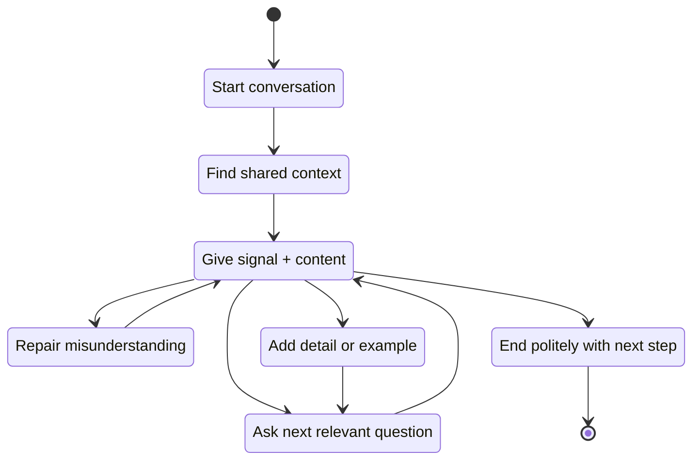

# Part 05 — Survival Conversation: Starting, Maintaining, and Ending

> Tujuan part ini: membuat kamu mampu **masuk ke percakapan, menjaga percakapan tetap hidup, dan menutup percakapan dengan natural** tanpa harus menunggu grammar sempurna.

Di tahap awal English conversation, target bukan terdengar seperti native speaker. Targetnya adalah:

- bisa membuka percakapan tanpa panik,
- bisa memberi respons pendek yang cukup natural,
- bisa mengajukan follow-up question,
- bisa memperbaiki percakapan saat mulai macet,
- bisa menutup percakapan dengan sopan dan jelas.

Ini disebut **survival conversation**.

Bukan karena levelnya rendah, tapi karena ini adalah lapisan operasional paling penting. Kalau kamu tidak bisa membuka, menjaga, dan menutup percakapan, semua vocabulary dan grammar yang kamu tahu tidak punya tempat untuk digunakan.

---

## 1. Positioning dalam Framework Kaufman

Dalam kerangka *The First 20 Hours*, kita perlu fokus pada sub-skill yang menghasilkan performa nyata secepat mungkin.

Untuk English conversation, salah satu sub-skill dengan ROI tertinggi adalah kemampuan mengelola alur percakapan:

```text
Open → Respond → Ask → Expand → Repair → Close
```

Ini adalah conversation loop minimum.

Kamu tidak perlu menguasai seluruh grammar untuk menjalankan loop ini. Kamu hanya perlu cukup pattern untuk:

1. menunjukkan bahwa kamu mengikuti pembicaraan,
2. memberi respons yang relevan,
3. mengajukan pertanyaan lanjutan,
4. meminta klarifikasi jika perlu,
5. keluar dari percakapan dengan rapi.

Dalam konteks Kaufman, part ini mengurangi **practice barrier** terbesar:

> “Saya takut mulai bicara karena tidak tahu harus ngomong apa.”

Kita ubah menjadi:

> “Saya punya beberapa opening, response, follow-up, repair, dan closing pattern yang bisa saya pakai kapan pun.”

---

## 2. Mental Model: Conversation Is a State Machine

Percakapan bukan esai. Percakapan adalah state machine.

Setiap kalimat memindahkan state:

- dari belum mulai menjadi sudah mulai,
- dari topik A ke topik B,
- dari tidak jelas menjadi lebih jelas,
- dari diskusi terbuka menjadi keputusan,
- dari meeting aktif menjadi closed loop.



Kalau kamu melihat conversation sebagai state machine, kamu tidak lagi berpikir:

> “Apa kalimat sempurna yang harus saya ucapkan?”

Kamu berpikir:

> “State saat ini apa, dan transisi berikutnya apa?”

Ini jauh lebih mudah dipraktikkan.

---

## 3. The Minimal Survival Conversation Loop

Formula paling sederhana:

```text
Acknowledge → Answer → Ask
```

Contoh:

```text
A: How was your weekend?
B: It was good. I spent most of it resting. How about you?
```

Breakdown:

| Step | Function | Example |
|---|---|---|
| Acknowledge | memberi sinyal kamu menangkap pertanyaan | “It was good.” |
| Answer | memberi isi singkat | “I spent most of it resting.” |
| Ask | mengembalikan giliran bicara | “How about you?” |

Untuk konteks kerja:

```text
A: How is the migration going?
B: It's moving forward. I finished the schema changes yesterday, but I still need to test the rollback path. Have you seen any issue from the API side?
```

Breakdown:

| Step | Function | Example |
|---|---|---|
| Acknowledge | status singkat | “It's moving forward.” |
| Answer | progress + detail | “I finished the schema changes yesterday...” |
| Ask | menjaga kolaborasi | “Have you seen any issue from the API side?” |

Ini adalah pola utama yang akan sering kamu pakai.

---

## 4. Opening: Cara Memulai Percakapan

Opening yang baik tidak harus kreatif. Opening yang baik harus:

- sesuai konteks,
- mudah dijawab,
- tidak terlalu berat,
- memberi jalan ke topik berikutnya.

### 4.1 Basic Social Opening

Gunakan untuk coworker, teammate, atau orang yang sudah pernah kamu temui.

| Situation | Opening |
|---|---|
| Awal hari | “Morning. How's your day going?” |
| Setelah weekend | “How was your weekend?” |
| Sebelum meeting | “Hey, how's everything going?” |
| Setelah lama tidak bertemu | “It's been a while. How have you been?” |
| Saat casual chat | “Anything interesting this week?” |

Respons aman:

```text
Pretty good, thanks. How about you?
Not bad. A bit busy, but manageable.
It's going well so far.
A bit packed today, but I'm okay.
```

Catatan penting: jawaban tidak perlu panjang. Dalam small talk, respons pendek + pertanyaan balik sering lebih natural daripada cerita panjang.

---

### 4.2 Work Context Opening

Gunakan saat kamu ingin masuk ke topik kerja.

| Intent | Opening |
|---|---|
| Tanya progress | “How is the deployment going?” |
| Tanya blocker | “Any blockers on your side?” |
| Mulai diskusi teknis | “Can we talk through the API change?” |
| Minta alignment | “Can we quickly align on the rollout plan?” |
| Minta bantuan | “Do you have a few minutes to look at this issue?” |
| Minta pendapat | “I'd like to get your thoughts on this approach.” |

Pola umum:

```text
Can we + verb + topic?
Do you have a few minutes to + verb + topic?
I'd like to + verb + topic.
```

Contoh:

```text
Can we review the migration plan?
Do you have a few minutes to check this query?
I'd like to discuss the retry strategy.
```

---

### 4.3 Meeting Opening

Untuk meeting, opening harus mengatur konteks dan ekspektasi.

```text
Thanks for joining. The goal of this meeting is to align on the rollout plan.
Let's use the first ten minutes to review the current issue, then we can decide the next step.
I think we have three topics today: the API change, the migration risk, and the release timeline.
```

Pattern:

```text
Thanks for joining. The goal is...
Let's start with...
We have three things to cover...
By the end of this meeting, we should decide...
```

Untuk software engineer, ini sangat berguna karena banyak percakapan kerja gagal bukan karena English-nya buruk, tapi karena konteksnya tidak jelas.

---

## 5. Maintaining: Cara Menjaga Percakapan Tetap Hidup

Percakapan sering mati karena salah satu pihak hanya menjawab pendek tanpa memberi jalan lanjut.

Contoh lemah:

```text
A: How was the deployment?
B: Good.
```

Ini tidak salah, tapi percakapan berhenti.

Contoh lebih baik:

```text
A: How was the deployment?
B: It went well. We had one small issue with the cache warm-up, but it was resolved quickly. Did you notice anything from monitoring?
```

Kamu menjaga percakapan dengan tiga alat:

1. **backchanneling**,
2. **follow-up question**,
3. **small expansion**.

---

## 6. Backchanneling: Sinyal Bahwa Kamu Mengikuti

Backchanneling adalah respons kecil yang menunjukkan kamu mendengar dan mengikuti.

Tanpa backchanneling, kamu bisa terdengar diam, dingin, atau tidak paham.

### 6.1 Basic Backchannel

| Function | Phrases |
|---|---|
| Mengikuti | “I see.” / “Right.” / “Got it.” |
| Setuju | “That makes sense.” / “Exactly.” |
| Terkejut | “Oh, really?” / “Interesting.” |
| Minta lanjut | “Go on.” / “Tell me more.” |
| Memahami masalah | “That sounds tricky.” / “I can see why that's a problem.” |

Contoh:

```text
A: The issue only happens when the user has multiple active sessions.
B: I see. So it's probably related to session state?
```

Backchannel + inference:

```text
I see. So you're saying the issue is not in the API, but in the session handling?
```

Ini jauh lebih kuat daripada hanya “yes”.

---

### 6.2 Engineering Backchannel

| Situation | Useful Response |
|---|---|
| Orang menjelaskan bug | “Got it. That sounds like a state issue.” |
| Orang menjelaskan trade-off | “Right, so the concern is latency.” |
| Orang menjelaskan risk | “That makes sense. The blast radius could be bigger than expected.” |
| Orang menjelaskan timeline | “Okay, so the critical path is the migration.” |
| Orang menjelaskan constraint | “I see. So we don't have much room to change the schema.” |

Pattern:

```text
Backchannel + summary/inference
```

Contoh:

```text
Right, so the main risk is the rollback path.
Got it. So the blocker is not implementation, but coordination.
I see. So this is more of a data consistency issue.
```

---

## 7. Follow-Up Questions: Mesin Utama Conversation

Kalau kamu hanya menghafal satu prinsip dari part ini, hafal ini:

> Conversation survives through follow-up questions.

Pertanyaan lanjutan membuat percakapan bergerak.

### 7.1 Universal Follow-Up Questions

| Intent | Question |
|---|---|
| Minta detail | “Can you tell me more about that?” |
| Minta contoh | “Do you have an example?” |
| Minta alasan | “What makes you think that?” |
| Minta dampak | “What would be the impact?” |
| Minta prioritas | “How urgent is this?” |
| Minta next step | “What should we do next?” |
| Minta konfirmasi | “Is that the main concern?” |

Contoh:

```text
A: I'm worried about the migration.
B: What part are you most concerned about?
```

Lebih baik daripada:

```text
B: Why?
```

“Why?” tidak salah, tapi kadang terdengar terlalu tajam. Pertanyaan spesifik terasa lebih kolaboratif.

---

### 7.2 Follow-Up Questions untuk Debugging

| Debugging Intent | Question |
|---|---|
| Reproducibility | “Can you reproduce it consistently?” |
| Scope | “Does it happen for all users or only some users?” |
| Timeline | “When did it start happening?” |
| Change detection | “Did anything change before the issue started?” |
| Expected behavior | “What behavior did you expect?” |
| Actual behavior | “What actually happened?” |
| Logs | “Do we have logs for that request?” |
| Environment | “Is this happening in staging or production?” |

Mini-dialogue:

```text
A: The payment flow is failing for some users.
B: Got it. Does it happen for all users or only a specific segment?
A: It seems to affect users with saved cards.
B: I see. Did anything change recently in the tokenization flow?
```

Perhatikan pola:

```text
Backchannel → Scope question → Hypothesis question
```

---

### 7.3 Follow-Up Questions untuk Architecture Discussion

| Intent | Question |
|---|---|
| Constraint | “What constraints are we optimizing for?” |
| Trade-off | “What are we trading off here?” |
| Alternative | “What alternatives did we consider?” |
| Risk | “What could go wrong with this approach?” |
| Scalability | “How would this behave under higher load?” |
| Operability | “How would we monitor and debug this?” |
| Rollback | “What is the rollback plan?” |

Contoh:

```text
A: I think we should move this to an async workflow.
B: That makes sense. What are we optimizing for: latency, reliability, or operational simplicity?
```

Ini bukan hanya English practice. Ini juga memperbaiki kualitas engineering discussion.

---

## 8. Small Expansion: Cara Menjawab Tanpa Terlalu Pendek

Banyak learner menjawab terlalu pendek karena takut salah.

Contoh:

```text
A: How is the task going?
B: Good.
```

Masalahnya bukan grammar. Masalahnya kurang informasi.

Gunakan formula:

```text
Status → Detail → Next Step
```

Contoh:

```text
It's going well. I finished the API changes, and I'm testing the edge cases now. I should have an update by this afternoon.
```

Atau:

```text
I'm still working on it. The implementation is mostly done, but I found an issue with the validation logic. I'll check that first before opening the PR.
```

### 8.1 Expansion Formula untuk Work Update

| Formula | Example |
|---|---|
| Status → Detail → Next step | “It's almost done. I fixed the main bug, and now I'm adding tests. I'll push it today.” |
| Status → Blocker → Ask | “I'm blocked. The staging data is inconsistent. Could you help me check the migration?” |
| Status → Risk → Mitigation | “The implementation works, but the rollout is risky. I suggest we release it behind a feature flag.” |
| Status → Uncertainty → Clarification | “I'm not fully sure yet. The logs point to the cache layer, but I need to verify it.” |

---

## 9. Topic Transition: Cara Pindah Topik

Percakapan kerja sering perlu pindah dari small talk ke work, dari detail ke decision, atau dari problem ke next step.

### 9.1 Social to Work

```text
By the way, can we talk about the deployment?
Speaking of work, I wanted to ask about the migration.
Before I forget, do you have an update on the API change?
```

### 9.2 Problem to Next Step

```text
Given that, what should we do next?
So the next step would be to check the logs first.
Let's turn this into an action item.
```

### 9.3 Detail to Summary

```text
Let me summarize what we have so far.
So, if I understand correctly, there are two issues.
At a high level, the problem is data consistency.
```

### 9.4 Discussion to Decision

```text
Do we have enough information to make a decision?
Can we agree on this approach for now?
Should we go with option A and revisit if the risk becomes bigger?
```

Transition phrase sangat penting karena membuat kamu terdengar lebih terstruktur.

---

## 10. Closing: Cara Menutup Percakapan

Menutup percakapan adalah skill. Closing yang buruk membuat orang bingung:

- apakah diskusi selesai?
- siapa melakukan apa?
- kapan update berikutnya?
- apakah ada keputusan?

Gunakan formula:

```text
Summary → Next Step → Appreciation
```

Contoh:

```text
So we'll check the logs first, then decide whether we need a rollback. I'll take the logging part and update you by the end of the day. Thanks for walking through this with me.
```

### 10.1 Basic Closing

| Situation | Closing |
|---|---|
| Casual chat | “Good talking to you. See you later.” |
| Quick help | “Thanks, that helps a lot.” |
| Meeting | “Thanks everyone. I'll send a quick summary after this.” |
| Decision made | “Great, let's go with that plan.” |
| Need follow-up | “I'll follow up once I have more data.” |
| Need pause | “Let's pause here and continue after we check the logs.” |

---

### 10.2 Closing with Action Items

Pattern:

```text
I'll + action + time.
You'll + action + time.
We'll + action + condition.
```

Examples:

```text
I'll check the logs and update the channel by 3 PM.
You'll confirm the API contract with the frontend team.
We'll proceed with the rollout if staging looks stable.
```

More natural full closing:

```text
Okay, so I'll check the logs and you’ll verify the latest deployment. Let's regroup tomorrow morning if the issue is still happening.
```

---

## 11. Common Mistakes by Indonesian Speakers

Bagian ini bukan untuk menyalahkan accent atau grammar. Tujuannya self-correction.

### 11.1 Answering Too Minimally

Less effective:

```text
A: How is the task?
B: Done.
```

Better:

```text
It's done. I opened the PR this morning, and I'm waiting for review.
```

### 11.2 Overusing “Yes”

Less effective:

```text
A: So the issue is in the cache layer?
B: Yes.
```

Better:

```text
Yes, that's my current assumption. I still need to verify it with logs.
```

### 11.3 Translating Indonesian Structure Directly

Less natural:

```text
I want to ask about this one.
```

More natural:

```text
I have a question about this.
Can I ask about this part?
```

Less natural:

```text
The problem is already solved or not?
```

More natural:

```text
Has the problem been solved?
Is the issue resolved now?
```

### 11.4 Sounding Too Direct Without Intending To

Less diplomatic:

```text
This is wrong.
```

Better:

```text
I think this might cause an issue when the input is empty.
```

Less diplomatic:

```text
You must change this.
```

Better:

```text
Could we change this to make the behavior more predictable?
```

### 11.5 Over-Apologizing

Less effective:

```text
Sorry, sorry, my English is bad. Sorry if I make mistake.
```

Better:

```text
Let me try to explain it clearly.
If anything is unclear, please stop me.
```

Kamu tidak perlu membuka percakapan dengan melemahkan diri sendiri.

---

## 12. Phrase Bank: Survival Conversation

### 12.1 Opening Bank

```text
Hi, how's it going?
How's your day so far?
Do you have a few minutes?
Can I ask you about something?
Can we quickly discuss the issue from yesterday?
I'd like to get your thoughts on this.
I wanted to follow up on the deployment.
```

### 12.2 Response Bank

```text
That makes sense.
I see what you mean.
Got it.
Right, that explains it.
Interesting. I hadn't thought about it that way.
I agree with the general direction.
I'm not sure yet, but I have a hypothesis.
```

### 12.3 Follow-Up Bank

```text
Can you tell me more about that?
Do you have an example?
What makes this urgent?
What is the main concern?
What would be the impact?
How should we approach this?
What should we check first?
What would be a reasonable next step?
```

### 12.4 Clarification Bank

```text
Sorry, could you say that again?
Could you rephrase that?
Do you mean the API layer or the database layer?
Let me make sure I understood.
So you're saying that the issue started after the latest deployment?
```

### 12.5 Closing Bank

```text
Thanks, that helps.
Okay, that sounds good.
Let's go with that for now.
I'll follow up after I check the logs.
I'll send a summary after this.
Let's continue this tomorrow if needed.
Good talking to you.
```

---

## 13. Dialogue Patterns

### 13.1 Casual Work Opening

```text
A: Morning. How's your day going?
B: Pretty good, thanks. A bit packed, but manageable. How about you?
A: Same here. I have a few meetings today.
B: Got it. By the way, do you have a few minutes later to discuss the deployment?
```

Pattern:

```text
Greeting → short answer → return question → transition to work
```

---

### 13.2 Asking for Help

```text
A: Do you have a few minutes to look at this issue?
B: Sure. What's going on?
A: The endpoint works locally, but it fails in staging. I think it might be related to config, but I'm not sure yet.
B: Got it. What error are you seeing?
A: It's a timeout from the downstream service.
B: Okay. Let's check the service URL and network policy first.
```

Pattern:

```text
Ask availability → explain symptom → state hypothesis → invite diagnosis
```

---

### 13.3 Maintaining a Technical Conversation

```text
A: The new workflow might increase latency.
B: That makes sense. Do we know how much latency it adds?
A: Not exactly. We haven't benchmarked it yet.
B: Got it. Should we test it with production-like data before deciding?
```

Pattern:

```text
Backchannel → measurement question → risk question → next step
```

---

### 13.4 Closing with Next Steps

```text
A: So we agree that the migration should happen behind a feature flag.
B: Yes. I'll update the implementation, and you can review the rollout plan.
A: Sounds good.
B: Great. I'll send the PR link once it's ready. Thanks for the discussion.
```

Pattern:

```text
Decision → owner → next action → appreciation
```

---

## 14. Practice Drills

### Drill 1 — Acknowledge, Answer, Ask

Ambil pertanyaan berikut dan jawab dengan formula:

```text
Acknowledge → Answer → Ask
```

Questions:

```text
How was your weekend?
How is your day going?
How is the task going?
How was the deployment?
Did you find the root cause?
Are you okay with this approach?
What do you think about the new design?
```

Example answer:

```text
It's going well. I finished the main part, but I still need to add tests. Do you want me to open a draft PR first?
```

Target:

- 7 questions,
- 3 versions each,
- total 21 responses.

---

### Drill 2 — Backchannel + Follow-Up

For each statement, respond using:

```text
Backchannel → Follow-up question
```

Statements:

```text
The deployment failed last night.
The API response is slower than expected.
I'm concerned about the migration.
The frontend team is blocked.
The rollback plan is not clear yet.
The error only happens in production.
```

Example:

```text
Got it. Do we know when it started failing?
```

Target:

- 6 statements,
- 3 responses each,
- total 18 responses.

---

### Drill 3 — Small Expansion

Convert short answers into useful answers.

Less useful:

```text
Done.
Blocked.
Good.
Not sure.
Maybe.
```

Better:

```text
It's done. I opened the PR this morning, and I'm waiting for review.
I'm blocked by an unclear API contract. I need to confirm the expected response format with the frontend team.
```

Target:

- 5 short answers,
- 5 expanded versions each.

---

### Drill 4 — Open and Close

Practice starting and ending the same conversation.

Scenario:

```text
You need to ask a teammate about a production bug.
```

Opening:

```text
Do you have a few minutes to look at the production issue from this morning?
```

Closing:

```text
Thanks, that helps. I'll check the logs and update the incident channel by 2 PM.
```

Create openings and closings for:

1. asking for code review,
2. discussing deployment risk,
3. clarifying API behavior,
4. asking for help debugging,
5. aligning on sprint scope,
6. following up on an unresolved blocker.

---

## 15. 60-Minute Practice Session

Gunakan sesi ini untuk latihan mandiri atau dengan partner.

| Minute | Activity | Output |
|---:|---|---|
| 0–5 | Warm-up: read phrase bank aloud | mouth activation |
| 5–15 | Acknowledge → Answer → Ask drill | 15 responses |
| 15–25 | Backchannel + follow-up drill | 15 responses |
| 25–40 | Roleplay: ask for help + debug issue | 2 dialogues |
| 40–50 | Closing with action items | 10 closing statements |
| 50–60 | Record 2-minute conversation summary | self-feedback |

Self-feedback questions:

```text
Did I answer too shortly?
Did I ask at least one follow-up question?
Did I use backchanneling naturally?
Did I close with a next step?
Where did I freeze?
Which phrase helped me recover?
```

---

## 16. Self-Correction Checklist

Saat mendengar ulang rekaman, jangan koreksi semua hal. Fokus pada alur percakapan.

Checklist:

```text
[ ] I opened the conversation clearly.
[ ] I responded with more than one word.
[ ] I used at least one backchannel phrase.
[ ] I asked a relevant follow-up question.
[ ] I clarified when something was ambiguous.
[ ] I did not over-apologize for my English.
[ ] I closed the conversation with a clear next step.
```

Scoring:

| Score | Meaning |
|---:|---|
| 0–2 | conversation still fragile |
| 3–4 | functional but inconsistent |
| 5–6 | usable in low-pressure work context |
| 7 | strong survival conversation control |

---

## 17. Engineering Scenarios for Practice

Use these scenarios repeatedly. Fluency comes from repeated exposure to realistic situations.

### Scenario 1 — Ask for Review

You opened a PR and need review.

Required moves:

```text
Open → explain context → ask for review → mention priority → close
```

Useful phrases:

```text
Could you review my PR when you have time?
The change is mostly in the validation layer.
It's not urgent, but I'd like to merge it before tomorrow's release.
Thanks, I appreciate it.
```

---

### Scenario 2 — Clarify a Requirement

The acceptance criteria are unclear.

Required moves:

```text
Open → identify ambiguity → ask specific question → confirm understanding
```

Useful phrases:

```text
I have a question about the expected behavior.
Do we allow users to retry after the payment fails?
Let me make sure I understood: if the payment fails, we show the retry option but keep the order pending.
```

---

### Scenario 3 — Discuss a Blocker

You are blocked by another team's API.

Required moves:

```text
State blocker → explain impact → ask for help/ETA → agree next step
```

Useful phrases:

```text
I'm currently blocked by the API contract.
The main impact is that I can't finish the integration tests.
Do we know when the contract will be finalized?
I'll proceed with a mock for now and update it once the contract is stable.
```

---

### Scenario 4 — Production Issue

There is an incident and you need to coordinate.

Required moves:

```text
State symptom → ask diagnostic question → propose first step → close with owner
```

Useful phrases:

```text
We're seeing increased error rates on checkout.
Do we know if this started after the latest deployment?
I suggest we check the logs and compare them with the deployment timeline.
I'll take the logs. Can you check metrics from the payment service?
```

---

## 18. Anti-Patterns

### Anti-Pattern 1 — Waiting for Perfect Grammar

Bad habit:

```text
Thinking silently for 20 seconds because you want a perfect sentence.
```

Better:

```text
Let me think for a second.
I think the issue might be related to the cache, but I need to verify it.
```

Use filler to buy thinking time.

---

### Anti-Pattern 2 — Saying “Yes” When You Don't Understand

Dangerous in engineering.

Less safe:

```text
Yes, yes, understood.
```

Better:

```text
I understand part of it, but I want to clarify one thing.
Do you mean the old endpoint or the new endpoint?
```

Clarity beats fake fluency.

---

### Anti-Pattern 3 — Ending Without Next Step

Less effective:

```text
Okay, thanks.
```

Better:

```text
Okay, thanks. I'll update the PR and tag you once it's ready for review.
```

---

## 19. Part 05 Practice Assignment

Complete these tasks before moving to Part 06.

### Assignment A — Build Your Personal Survival Phrasebank

Create 10 phrases for each category:

```text
Opening
Backchannel
Follow-up
Clarification
Small expansion
Closing
```

Total: 60 phrases.

Rules:

- choose phrases you can actually say,
- avoid overly formal phrases unless needed,
- include engineering-specific phrases,
- read them aloud daily for 5 minutes.

---

### Assignment B — Record 5 Micro-Conversations

Each conversation should be 60–90 seconds.

Topics:

1. ask for code review,
2. discuss a blocker,
3. clarify a requirement,
4. ask for debugging help,
5. close a meeting with action items.

For each recording, score yourself using:

```text
Opening clarity: 1–5
Response usefulness: 1–5
Follow-up quality: 1–5
Closing clarity: 1–5
```

---

### Assignment C — Replace One-Word Answers

For the next 7 days, whenever you answer in English, avoid one-word answers if the context allows expansion.

Instead of:

```text
Yes.
No.
Done.
Good.
Maybe.
```

Use:

```text
Yes, that works for me.
No, I don't think that's safe because...
It's done, and I opened the PR.
It's going well, but I still need to test one edge case.
Maybe, but I want to check the impact first.
```

---

## 20. Summary

Survival conversation is the minimum operational layer of English speaking.

You learned:

- conversation as a state machine,
- the minimal loop: acknowledge → answer → ask,
- how to open social, work, and meeting conversations,
- how to maintain conversation with backchanneling and follow-up questions,
- how to expand short answers,
- how to transition between topics,
- how to close with summary and next step,
- how to avoid common Indonesian-speaker conversation anti-patterns.

Key principle:

> You do not need perfect English to have a useful conversation. You need enough structure to keep the conversation moving and enough self-awareness to repair it when it breaks.

In the next part, we move to the other side of conversation: **listening**. Because you cannot respond well if you cannot parse what people actually say in real spoken English.
