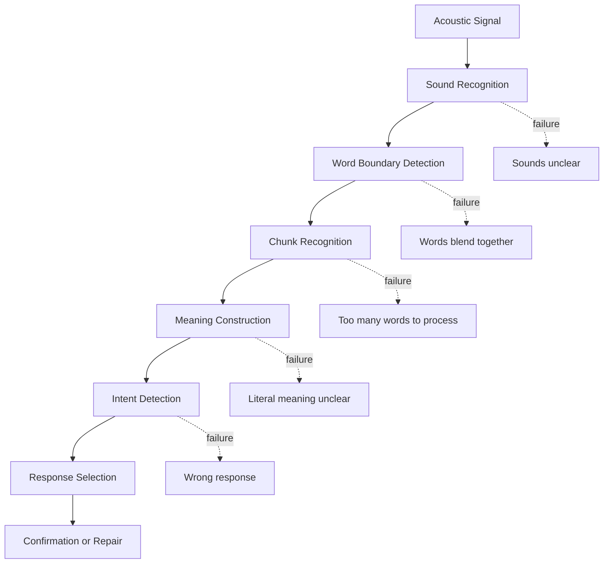
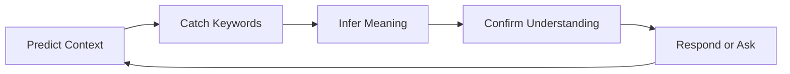

# Part 06 — Listening Foundations: Understanding Real Spoken English

> Tujuan part ini: membangun fondasi listening yang membuat kamu bisa memahami English yang benar-benar diucapkan orang, bukan hanya English yang tertulis rapi di textbook.

Banyak software engineer bisa membaca dokumentasi English dengan baik, tetapi tetap kesulitan saat meeting, interview, atau diskusi teknis.

Penyebabnya bukan sekadar vocabulary. Penyebab utamanya sering ini:

- spoken English terdengar berbeda dari written English,
- kata-kata menyambung,
- suara melemah,
- speaker berbicara dalam chunk,
- informasi penting dibawa oleh stress dan intonation,
- otak masih mencoba menerjemahkan kata per kata,
- learner panik saat kehilangan satu kata.

Part ini membangun listening sebagai skill operasional.

---

## 1. Positioning dalam Framework Kaufman

Dalam *The First 20 Hours*, Kaufman menekankan pentingnya memecah skill menjadi sub-skill kecil dan belajar cukup untuk bisa self-correct.

Untuk English conversation, listening adalah sub-skill yang sering diremehkan.

Banyak learner ingin langsung “speaking fluent”, tetapi conversation adalah sistem dua arah:

```text
Listen → Interpret → Respond → Confirm → Continue
```

Kalau listening lemah, speaking ikut rusak karena kamu tidak punya input yang stabil.

Contoh:

```text
A: Could we roll this out gradually instead of enabling it for everyone at once?
B: Yes, I already finished the code.
```

Masalah respons di atas bukan grammar. Masalahnya adalah listening dan interpretation. Speaker bertanya tentang rollout strategy, tetapi jawaban membahas implementation status.

Listening yang baik berarti kamu bisa menangkap:

- topic,
- intent,
- key details,
- uncertainty,
- implication,
- expected response.

---

## 2. Spoken English Is Not Written English Read Aloud

Kalimat tertulis:

```text
What are you going to do about it?
```

Dalam spoken English, bisa terdengar seperti:

```text
Whaddaya gonna do about it?
```

Kalimat tertulis:

```text
Did you check the logs?
```

Dalam spoken English, bisa terdengar seperti:

```text
Didja check the logs?
```

Kalimat tertulis:

```text
I want to look at the deployment first.
```

Dalam spoken English, bisa terdengar seperti:

```text
I wanna look at the deployment first.
```

Kalau kamu hanya belajar dari written English, kamu akan mengenali kata ketika melihatnya, tetapi gagal mengenali kata ketika mendengarnya.

---

## 3. The Listening Pipeline

Listening bukan proses pasif. Listening adalah pipeline.



Setiap failure punya solusi berbeda.

| Failure | Symptom | Better Practice |
|---|---|---|
| Sound recognition | “I can't catch the words.” | pronunciation awareness, minimal pairs, shadowing |
| Word boundary | “Everything sounds connected.” | connected speech drills |
| Chunk recognition | “I know the words but lose the sentence.” | phrase/chunk listening |
| Meaning construction | “I heard it but don't understand it.” | meaning-first listening, context prediction |
| Intent detection | “I answered the wrong thing.” | listen for function, not only words |

---

## 4. Listening Goal: Meaning, Not Every Word

A common beginner trap:

> “Saya harus menangkap semua kata.”

Dalam real conversation, bahkan advanced speakers tidak selalu memproses semua kata dengan kesadaran penuh. Mereka menangkap **signal penting**.

Fokus utama:

```text
Who/what is this about?
What happened?
What matters?
What does the speaker want from me?
What should I do next?
```

Contoh:

```text
I think we should hold off on the deployment until we verify the rollback path.
```

Kata penting:

```text
hold off
on the deployment
until
verify
the rollback path
```

Intent:

```text
Do not deploy yet. Check rollback first.
```

Respons yang baik:

```text
Got it. So you suggest delaying the deployment until the rollback path is verified, right?
```

---

## 5. Connected Speech

Connected speech adalah fenomena saat kata-kata dalam spoken English menyambung, berubah, atau melemah ketika diucapkan natural.

Ini bukan slang semata. Ini bagian normal dari spoken English.

### 5.1 Linking

Ketika satu kata berakhir dengan consonant sound dan kata berikutnya mulai dengan vowel sound, suara sering tersambung.

```text
check it → che-ki-t
look at it → loo-ka-dit
turn it off → tur-ni-toff
```

Engineering examples:

```text
check it again
look at the logs
turn it on gradually
roll it out slowly
```

Latihan:

Read slowly:

```text
Can you check it again?
```

Then naturally:

```text
Can you che-ki-t again?
```

Tujuannya bukan memaksa accent tertentu, tapi agar telinga kamu mengenali bentuk natural.

---

### 5.2 Assimilation

Assimilation terjadi saat satu sound berubah karena sound di dekatnya.

Examples:

```text
did you → didja
would you → wouldja
could you → couldja
```

Work examples:

```text
Did you check the logs?
Would you mind reviewing this?
Could you take a look?
```

Natural hearing forms:

```text
Didja check the logs?
Wouldja mind reviewing this?
Couldja take a look?
```

Kamu tidak wajib selalu mengucapkan seperti ini, tapi kamu perlu mengenalinya saat mendengar.

---

### 5.3 Elision

Elision adalah hilangnya sound tertentu dalam speech cepat.

Examples:

```text
next step → nex step
last time → las time
must be → mus be
```

Engineering examples:

```text
What's the next step?
The last deployment failed.
It must be a config issue.
```

Could sound like:

```text
What's the nex step?
The las deployment failed.
It mus be a config issue.
```

---

## 6. Reduction and Weak Forms

Dalam English, banyak function words menjadi lemah.

Function words:

```text
to, for, of, and, are, you, can, have, should, would
```

Content words biasanya lebih kuat:

```text
deployment, rollback, latency, issue, database, migration
```

Kalimat:

```text
We need to check the logs before the deployment.
```

Yang terdengar kuat:

```text
need / check / logs / before / deployment
```

Yang melemah:

```text
we / to / the / the
```

### 6.1 Common Reductions

| Written Form | Common Spoken Form | Example |
|---|---|---|
| going to | gonna | “We're gonna test it first.” |
| want to | wanna | “I wanna check the logs.” |
| got to | gotta | “We've gotta fix this today.” |
| kind of | kinda | “It's kinda risky.” |
| sort of | sorta | “It's sorta related to caching.” |
| have to | hafta | “We hafta rollback.” |
| has to | hasta | “It hasta be stable.” |
| supposed to | supposed ta / sposta | “It's supposed to retry.” |

Important nuance:

- These forms are common in informal speech.
- In professional settings, understanding them is more important than overusing them.
- You can still speak clearly with full forms.

---

## 7. Stress and Rhythm

English is stress-timed. Indonesian tends to be more syllable-timed. This difference affects listening.

Dalam English, tidak semua syllable punya bobot sama. Kata penting mendapat stress lebih kuat.

Example:

```text
We need to check the logs before deployment.
```

Likely stress:

```text
NEED / CHECK / LOGS / before / dePLOYment
```

Kalau kamu mendengarkan setiap syllable dengan bobot sama, spoken English terasa sangat cepat. Padahal yang perlu ditangkap adalah kata-kata yang di-stress.

### 7.1 Content Words Carry Meaning

Content words:

- nouns: `deployment`, `database`, `issue`, `rollback`, `latency`,
- main verbs: `check`, `fix`, `deploy`, `verify`, `monitor`,
- adjectives/adverbs: `risky`, `slow`, `gradually`, `critical`.

Function words:

- articles: `a`, `an`, `the`,
- auxiliaries: `do`, `does`, `did`, `can`, `should`,
- prepositions: `to`, `for`, `of`, `in`,
- pronouns: `we`, `you`, `it`, `they`.

You should train your ear to prioritize content words.

---

## 8. Intonation: Meaning Beyond Words

Intonation changes meaning.

Same words, different meaning:

```text
You're deploying today.
```

Could mean:

1. neutral statement,
2. surprise,
3. concern,
4. confirmation question.

### 8.1 Rising Intonation

Often signals:

- question,
- uncertainty,
- checking,
- inviting confirmation.

Example:

```text
We're deploying today?
```

Meaning:

```text
I thought maybe not. Please confirm.
```

### 8.2 Falling Intonation

Often signals:

- completion,
- confidence,
- finality.

Example:

```text
We're deploying today.
```

Meaning:

```text
This is decided.
```

### 8.3 Fall-Rise Intonation

Often signals:

- partial agreement,
- hesitation,
- “yes, but...”.

Example:

```text
That could work...
```

Meaning may be:

```text
It could work, but I have concerns.
```

In engineering conversation, this is crucial. Someone may sound polite while signaling risk.

---

## 9. Listen for Function, Not Just Words

A sentence has a communication function.

Example:

```text
Could we maybe test this in staging first?
```

Literal form: question.

Actual function: suggestion or soft pushback.

Possible meaning:

```text
I don't think we should deploy directly.
```

Another example:

```text
I'm not sure we have enough data to decide.
```

Actual function:

```text
Slow down. Do not decide yet.
```

### 9.1 Function Categories

| Function | Signals |
|---|---|
| Request | “Could you...”, “Can you...”, “Would you mind...” |
| Suggestion | “Maybe we should...”, “What if we...” |
| Concern | “I'm worried that...”, “My concern is...” |
| Pushback | “I'm not sure...”, “I don't think...” |
| Decision | “Let's go with...”, “We'll proceed with...” |
| Clarification | “Do you mean...”, “Are you saying...” |
| Escalation | “We need to involve...”, “This needs attention...” |

Listening target:

```text
Not only: what words did they say?
But: what are they trying to do with those words?
```

---

## 10. Engineering Listening Scenarios

### 10.1 Standup Update

Input:

```text
Yesterday I finished most of the API changes, but I'm still blocked on the auth flow because the token format is different in staging.
```

What to catch:

| Signal | Meaning |
|---|---|
| finished most | not fully done |
| still blocked | needs help or dependency |
| auth flow | affected area |
| token format different | likely environment/config issue |
| staging | not production yet |

Good response:

```text
Got it. Do you need help checking the staging config, or are you waiting for another team?
```

---

### 10.2 Architecture Discussion

Input:

```text
I like the async approach, but I'm concerned about observability. If the workflow fails halfway, it may be hard to know where it stopped.
```

What to catch:

| Signal | Meaning |
|---|---|
| I like | partial agreement |
| but | contrast coming |
| concerned | risk |
| observability | operational issue |
| fails halfway | failure mode |
| hard to know | debugging problem |

Good response:

```text
That makes sense. So the main concern is not the async model itself, but how we trace failures across steps.
```

---

### 10.3 Code Review Feedback

Input:

```text
This works for the happy path, but I think we should handle the empty response case explicitly.
```

What to catch:

| Signal | Meaning |
|---|---|
| works for happy path | current code is partially okay |
| but | gap coming |
| should handle | requested change |
| empty response | edge case |
| explicitly | do not rely on implicit behavior |

Good response:

```text
Got it. I'll add an explicit check for the empty response case and update the tests.
```

---

### 10.4 Incident Conversation

Input:

```text
We're seeing elevated error rates on checkout. It started about ten minutes after the last deployment, but we don't know yet if it's related.
```

What to catch:

| Signal | Meaning |
|---|---|
| elevated error rates | production impact |
| checkout | critical flow |
| ten minutes after deployment | possible correlation |
| don't know yet | not confirmed |
| if related | avoid premature conclusion |

Good response:

```text
Understood. Let's compare the error timeline with the deployment and check whether the errors are concentrated in the changed path.
```

---

## 11. Listening Strategy: Predict, Catch, Confirm

Use this loop:

```text
Predict → Catch Keywords → Build Meaning → Confirm
```



### 11.1 Predict Context

Before listening, ask:

```text
What is this conversation probably about?
What vocabulary is likely to appear?
What decision or issue is likely being discussed?
```

Example: before a deployment meeting, expect words like:

```text
rollout, rollback, feature flag, monitoring, staging, production, risk, owner, timeline
```

Prediction reduces cognitive load.

---

### 11.2 Catch Keywords

Do not chase every word. Catch words that change meaning.

Priority words:

```text
not
but
however
unless
until
before
after
only
all
some
must
should
might
could
because
therefore
```

In engineering, missing these words can be dangerous.

Compare:

```text
We should deploy today.
We should not deploy today.
We could deploy today.
We should deploy today only if staging is stable.
```

Small words change operational decisions.

---

### 11.3 Confirm Understanding

When uncertain, confirm.

```text
Let me make sure I understood.
So you're saying we should delay the deployment until rollback is verified?
Do you mean the issue affects all users or only users with saved cards?
```

This is not a weakness. In professional engineering communication, confirmation reduces risk.

---

## 12. Practical Listening Drills

### Drill 1 — Keyword Listening

Take a short English audio/video clip from a technical talk, meeting recording, podcast, or tutorial.

Process:

1. Listen once without transcript.
2. Write only keywords.
3. Listen again.
4. Add missing keywords.
5. Summarize meaning in one sentence.

Template:

```text
Topic:
Keywords I caught:
Important verbs:
Important nouns:
Risk/decision/action:
One-sentence summary:
```

Target:

- 10 minutes per session,
- 5 sessions per week.

---

### Drill 2 — Chunk Listening

Instead of writing individual words, write chunks.

Example audio sentence:

```text
We need to check the logs before we roll this out.
```

Bad note:

```text
we / need / to / check / the / logs / before / we / roll / this / out
```

Better note:

```text
need to check logs
before rollout
```

Practice with chunks like:

```text
need to check...
we should verify...
before we deploy...
if this fails...
the main concern is...
```

---

### Drill 3 — Shadowing

Shadowing means listening and repeating almost at the same time.

Goal:

- improve sound recognition,
- improve rhythm,
- improve chunking,
- connect listening and speaking.

Process:

1. Choose 20–40 seconds of clear audio.
2. Listen once for meaning.
3. Listen again with transcript if available.
4. Repeat phrase by phrase.
5. Shadow at natural speed.
6. Record yourself.
7. Compare rhythm, stress, and pauses.

Do not start with very fast native content. Start with clear professional English.

---

### Drill 4 — Dictation for Connected Speech

Dictation is useful if done carefully.

Process:

1. Choose one sentence.
2. Listen 3 times.
3. Write what you hear.
4. Check transcript.
5. Mark what disappeared, reduced, or connected.

Example:

```text
Audio: Did you check it again?
You heard: did you check again
Missing: it
Reason: check it connected into che-ki-t
```

Template:

```text
Sentence:
What I heard:
Actual transcript:
Missing words:
Reason:
Correction:
```

---

### Drill 5 — Intent Detection

Listen to a sentence and classify its function.

Categories:

```text
request
suggestion
concern
pushback
decision
clarification
status update
escalation
```

Examples:

```text
Could we test this in staging first?
Function: suggestion / soft pushback

I'm not sure this is safe to deploy today.
Function: concern / pushback

Let's proceed with option B.
Function: decision
```

This drill trains professional pragmatics, not only vocabulary.

---

## 13. Meeting Listening Checklist

Before meeting:

```text
[ ] What is the meeting topic?
[ ] What decisions might be made?
[ ] What vocabulary is likely?
[ ] What do I need to listen for?
```

During meeting:

```text
[ ] Who owns which action?
[ ] What decision was made?
[ ] What is still uncertain?
[ ] What risks were mentioned?
[ ] What timeline was discussed?
```

After meeting:

```text
[ ] Can I summarize the decision?
[ ] Can I list action items?
[ ] Do I need to clarify anything?
[ ] Did I miss any important condition?
```

If you are unsure, say:

```text
Before we close, can I quickly confirm the action items?
```

This single phrase can prevent many misunderstandings.

---

## 14. Listening Notes for Software Engineers

Use structured notes during meetings.

```text
Topic:
Decision:
Owner:
Deadline:
Risk:
Open question:
Next step:
```

Example:

```text
Topic: Payment retry rollout
Decision: Roll out to 10% first
Owner: Backend team handles feature flag
Deadline: Tomorrow afternoon
Risk: Duplicate charge edge case
Open question: Monitoring dashboard not ready
Next step: Add dashboard before rollout
```

This reduces the burden of remembering everything.

---

## 15. How to Recover When You Miss Something

You will miss words. The goal is not zero failure. The goal is fast recovery.

### 15.1 If You Miss One Word

Say:

```text
Sorry, what was the word after “rollback”?
```

or:

```text
Did you say “cache” or “cash”?
```

### 15.2 If You Miss a Sentence

Say:

```text
Sorry, could you repeat that last part?
```

or:

```text
I missed the last sentence. Could you say it again?
```

### 15.3 If You Understand Partially

Say:

```text
I understood the part about the deployment, but I'm not sure about the rollback condition.
```

### 15.4 If You Need Rephrasing

Say:

```text
Could you rephrase that?
```

or:

```text
Could you explain that in a different way?
```

### 15.5 If You Need Confirmation

Say:

```text
So the action item is for me to update the tests, right?
```

These repair phrases keep the conversation safe.

---

## 16. Common Listening Anti-Patterns

### Anti-Pattern 1 — Translating Every Word

Problem:

```text
Speaker is still talking, but your brain is translating the previous sentence.
```

Better:

```text
Catch chunks and intent.
```

Example:

```text
hold off deployment until rollback verified
```

Meaning:

```text
Do not deploy yet.
```

---

### Anti-Pattern 2 — Panicking After Missing One Word

Problem:

```text
You miss one word, then stop listening to the rest.
```

Better:

```text
Continue listening for context.
```

One missing word often becomes clear later.

---

### Anti-Pattern 3 — Pretending to Understand

Dangerous:

```text
Yes, got it.
```

when you did not get it.

Better:

```text
I want to make sure I understood. Are we delaying the release or only reducing the rollout percentage?
```

---

### Anti-Pattern 4 — Listening Only for Technical Words

Technical words matter, but function words can change decision.

Compare:

```text
Deploy if staging is stable.
Deploy unless staging is unstable.
Don't deploy until staging is stable.
```

You need both technical nouns and logical connectors.

---

## 17. 60-Minute Practice Session

| Minute | Activity | Output |
|---:|---|---|
| 0–5 | Prepare vocabulary for one topic | prediction list |
| 5–15 | Listen once, write keywords only | keyword notes |
| 15–25 | Listen again, write chunks | chunk notes |
| 25–35 | Check transcript if available | gap analysis |
| 35–45 | Shadow 30 seconds | recording |
| 45–55 | Summarize the audio verbally | 1-minute summary |
| 55–60 | Write self-correction notes | improvement target |

Self-correction template:

```text
Words I missed:
Chunks I recognized:
Reductions I noticed:
Main meaning:
Speaker intent:
One thing to practice next:
```

---

## 18. 7-Day Listening Sprint

### Day 1 — Baseline

Record your current ability.

Task:

```text
Listen to 2 minutes of professional English.
Write summary without transcript.
Then check transcript and mark gaps.
```

### Day 2 — Keyword Listening

Focus only on important words.

### Day 3 — Connected Speech

Find examples of:

```text
check it
look at
did you
would you
could you
```

### Day 4 — Reductions

Listen for:

```text
gonna
wanna
gotta
kinda
hafta
```

### Day 5 — Stress and Rhythm

Mark stressed words in 10 sentences.

### Day 6 — Intent Detection

Classify 20 sentences by function:

```text
request / concern / suggestion / pushback / decision
```

### Day 7 — Meeting Simulation

Watch or listen to a technical discussion. Produce:

```text
summary
decisions
action items
risks
questions
```

---

## 19. Self-Assessment Rubric

| Level | Listening Behavior |
|---|---|
| Fragile | understands isolated words but loses sentence meaning |
| Basic | catches topic and some details if speaker is clear |
| Functional | follows common work conversations with occasional clarification |
| Strong | catches intent, risk, and next steps in technical discussion |
| Professional | can summarize, clarify, and act accurately after meetings |

Score yourself on 1–5:

```text
I can catch the main topic.
I can catch key details.
I can identify speaker intent.
I can recover when I miss something.
I can summarize decisions and action items.
```

Target after this part:

```text
Functional listening in controlled professional scenarios.
```

Not perfect listening. Functional listening.

---

## 20. Part 06 Practice Assignment

Complete before moving to Part 07.

### Assignment A — Listening Gap Log

For 5 listening sessions, fill this:

```text
Audio source:
Topic:
Duration:
Words I caught:
Chunks I caught:
Words I missed:
Reason I missed them:
Main meaning:
Speaker intent:
Repair phrase I would use:
```

### Assignment B — 30 Connected Speech Examples

Collect or create 30 examples:

```text
check it
look at it
turn it on
roll it out
fix it later
push it today
did you check
would you mind
could you review
```

Read them aloud and listen for how they connect.

### Assignment C — Meeting Summary Drill

Listen to any 5–10 minute technical content and produce:

```text
3-sentence summary
3 keywords
1 risk
1 decision or possible decision
1 follow-up question
```

---

## 21. Summary

Listening is not passive hearing. It is active meaning construction.

You learned:

- spoken English differs from written English,
- listening has multiple failure points,
- connected speech makes words blend,
- reductions and weak forms are normal,
- stress and rhythm carry meaning,
- intonation can signal uncertainty, concern, or decision,
- function matters as much as literal words,
- professional listening requires catching decisions, risks, owners, and next steps,
- repair phrases are part of listening competence.

Key principle:

> Good listening is not catching every word. Good listening is catching enough meaning to respond, clarify, and act correctly.

Next, we move to pronunciation. Not to erase your accent, but to make your speech clear, intelligible, and easier for others to process.
