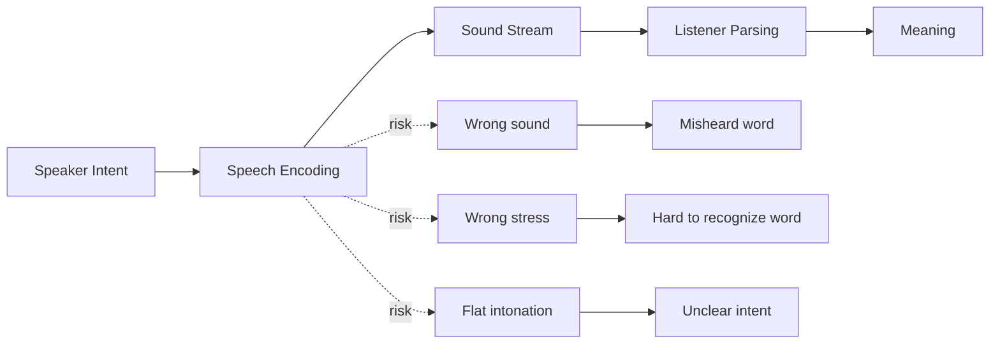
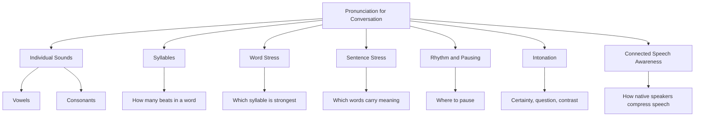
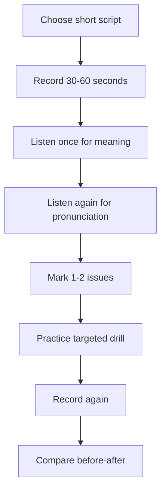
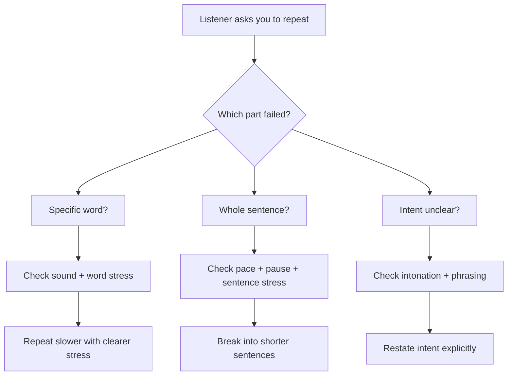

# Part 07 — Pronunciation That Matters for Being Understood

> Tujuan part ini: membuat ucapan English kamu **lebih mudah dipahami** dalam percakapan nyata, terutama meeting, debugging, code review, interview, dan diskusi teknis.

Pronunciation sering disalahpahami.

Banyak learner mengira pronunciation berarti:

- harus terdengar seperti native speaker,
- harus menghapus accent Indonesia,
- harus melafalkan semua kata secara sempurna,
- harus menguasai phonetic symbols dulu,
- harus bisa meniru aksen Amerika atau British.

Itu framing yang kurang produktif.

Untuk English conversation, target pronunciation yang benar adalah:

> **intelligibility**: orang lain bisa memahami maksud kamu dengan effort rendah.

Accent bukan masalah utama. Yang menjadi masalah adalah ketika pronunciation menyebabkan:

- kata terdengar seperti kata lain,
- stress jatuh di tempat yang membingungkan,
- kalimat terdengar datar sehingga intent tidak jelas,
- speaker lain perlu sering meminta pengulangan,
- kamu sendiri kehilangan confidence karena takut salah bunyi.

Part ini bukan latihan aksen. Ini adalah sistem pronunciation yang pragmatis.

---

## 1. Positioning dalam Framework Kaufman

Dalam kerangka *The First 20 Hours*, kita tidak mencoba mempelajari semua aspek pronunciation sekaligus. Kita mencari sub-skill kecil dengan dampak besar.

Untuk English conversation, pronunciation bisa didekomposisi menjadi empat lapisan:

```text
Sound Accuracy → Word Stress → Sentence Stress → Intonation
```

Urutannya penting.

Kalau hanya fokus pada individual sounds, kamu bisa terdengar terlalu lambat dan mekanis. Kalau hanya fokus pada intonation tanpa word stress yang jelas, kalimat tetap sulit diproses.

Target 20 jam pertama bukan perfect pronunciation. Targetnya adalah:

1. mengenali bunyi yang paling sering menyebabkan misunderstanding,
2. memperbaiki stress pada kata penting,
3. menggunakan sentence stress untuk menonjolkan informasi utama,
4. memakai intonation untuk menunjukkan pertanyaan, kepastian, keraguan, dan disagreement,
5. membangun recording-feedback loop agar kamu bisa self-correct.

Dalam istilah Kaufman:

| Kaufman Principle | Aplikasi ke Pronunciation |
|---|---|
| Deconstruct the skill | Pecah pronunciation menjadi sound, stress, rhythm, intonation |
| Learn enough to self-correct | Tahu apa yang harus didengarkan saat merekam diri sendiri |
| Remove barriers | Hilangkan obsesi native accent dan rasa malu merekam suara |
| Practice deliberately | Latihan short drills dengan feedback spesifik |

---

## 2. Mental Model: Pronunciation Is an API Contract

Sebagai software engineer, bayangkan pronunciation sebagai kontrak API antara speaker dan listener.

Kamu mengirim payload berupa suara. Listener mencoba melakukan parsing.



Pronunciation yang baik bukan “indah”. Pronunciation yang baik adalah **parseable**.

Contoh:

```text
I will deploy the service tomorrow.
```

Kalau kata `deploy`, `service`, dan `tomorrow` terdengar jelas, listener bisa memahami inti kalimat walaupun accent kamu tidak native.

Tetapi kalau stress salah:

```text
DE-ploy  → salah karena stress seharusnya de-PLOY
SER-vice → benar
TO-mor-row → kurang natural; biasanya to-MOR-row
```

Listener mungkin tetap paham, tetapi processing cost naik.

Dalam conversation, processing cost matters. Orang tidak hanya mendengar kamu. Mereka juga memikirkan masalah, membaca screen, mengecek logs, membuat keputusan, dan menjaga alur meeting.

Pronunciation yang jelas menurunkan cognitive load listener.

---

## 3. Goal: Intelligibility, Not Accent Erasure

Accent adalah bagian normal dari global English.

Dalam engineering team global, kamu akan mendengar banyak accent:

- Indonesian English,
- Indian English,
- Singaporean English,
- Japanese English,
- German English,
- French English,
- American English,
- British English,
- Australian English.

Tujuanmu bukan memilih satu accent lalu menghapus identitas bicara. Tujuanmu adalah memastikan signal utama tidak rusak.

### 3.1 The Intelligibility Ladder

```text
Level 0: Frequently misunderstood
Level 1: Understandable with repetition
Level 2: Understandable with effort
Level 3: Easily understandable
Level 4: Clear, expressive, and natural
```

Target awal kita adalah naik ke **Level 3**.

Level 4 bisa dikejar nanti, tetapi Level 3 sudah cukup untuk:

- standup,
- meeting,
- code review,
- technical explanation,
- interview,
- pair programming,
- stakeholder update.

### 3.2 Jangan Mengukur Pronunciation dari “Apakah Mirip Native?”

Ukur dari pertanyaan ini:

| Diagnostic Question | Meaning |
|---|---|
| Apakah orang sering meminta kamu mengulang kata tertentu? | Ada issue pada sound/stress tertentu |
| Apakah orang salah menangkap kata teknis? | Ada issue pada pronunciation atau vocabulary context |
| Apakah kalimatmu terdengar seperti satu blok panjang? | Ada issue pada sentence stress dan pausing |
| Apakah pertanyaan terdengar seperti statement? | Ada issue pada intonation |
| Apakah kamu kehilangan confidence saat mengucapkan kata tertentu? | Perlu targeted drill |

---

## 4. Pronunciation Decomposition

Pronunciation dapat dipraktikkan sebagai sistem berlapis.



Kita tidak akan membahas semuanya secara akademik. Kita fokus ke bagian yang paling mempengaruhi conversation.

---

## 5. High-Impact Individual Sounds

Individual sounds penting jika salah bunyinya menyebabkan kata berubah meaning.

Untuk banyak Indonesian speakers, beberapa area yang sering perlu perhatian:

1. `th` sounds,
2. final consonants,
3. vowel length and quality,
4. `v` vs `f`,
5. `z` vs `s`,
6. `sh` vs `s`,
7. consonant clusters,
8. `r` and `l` clarity.

Tidak semua orang punya masalah yang sama. Gunakan bagian ini sebagai diagnostic checklist.

---

## 6. `th`: Think vs Sink, This vs Dis

English punya dua jenis `th` utama:

| Sound | Example | Approximation |
|---|---|---|
| voiceless `th` | think, three, method | udara keluar antara lidah dan gigi |
| voiced `th` | this, that, they | mirip di atas, tapi vocal cords bergetar |

Masalah umum:

```text
think → sink / tink
three → tree
this → dis
that → dat
method → metod
```

Dalam conversation global, pengucapan `th` yang tidak sempurna masih sering dipahami dari context. Tetapi beberapa kata bisa menyebabkan ambiguity.

Contoh:

```text
I think it failed.
```

Jika `think` terdengar seperti `sink`, listener mungkin tetap paham karena context. Tetapi jika kamu sering mengatakan kata ini dalam meeting, memperbaikinya memberi ROI tinggi.

### 6.1 Drill: Think / This Contrast

Latihan pendek:

```text
think — this
thin — then
three — they
method — mother
thread — there
```

Kalimat:

```text
I think this is the main issue.
There are three things we need to check.
This method is not thread-safe.
They said the third option is safer.
```

Cara latihan:

1. Ucapkan perlahan.
2. Rekam 30 detik.
3. Dengarkan apakah `think` terdengar berbeda dari `sink`.
4. Jangan kejar kecepatan dulu.
5. Ulangi sampai bunyinya cukup stabil.

---

## 7. Final Consonants: The Hidden Clarity Problem

Bahasa Indonesia tidak menekankan final consonants sekuat English. Akibatnya, ending sounds sering hilang.

Dalam English, final consonants sering membawa informasi penting:

| Word | Jika final sound hilang | Potensi ambiguity |
|---|---|---|
| bug | bu | terdengar tidak lengkap |
| bugs | bug | singular/plural hilang |
| fixed | fix | tense/aspect hilang |
| failed | fail | past event terdengar present |
| logs | log | jumlah berubah |
| tests | test | plural hilang |
| changed | change | past action hilang |

Di engineering conversation, ini sangat penting.

Bandingkan:

```text
I already fix the bug.
I already fixed the bug.
```

Kalimat pertama masih bisa dimengerti, tetapi terdengar kurang akurat. Kalimat kedua jelas: action sudah selesai.

### 7.1 Final Consonant Drill

Latihan kata:

```text
bug — bugs
log — logs
test — tests
fail — failed
change — changed
merge — merged
push — pushed
build — builds
request — requests
branch — branches
```

Latihan kalimat:

```text
I checked the logs.
The tests failed.
The build passed.
I pushed the changes.
The request timed out.
The branch was merged yesterday.
```

Practice rule:

> Jangan menambahkan vowel ekstra setelah final consonant.

Hindari:

```text
logs-eh
tests-eh
failed-eh
merged-eh
```

Ucapkan ending dengan ringan tapi ada.

---

## 8. Vowel Length: Ship vs Sheep, Live vs Leave

English vowel tidak hanya berbeda “huruf”, tetapi juga quality dan length.

Beberapa pasangan penting:

| Shorter Sound | Longer Sound |
|---|---|
| ship | sheep |
| live | leave |
| bit | beat |
| sit | seat |
| full | fool |
| pull | pool |

Dalam konteks kerja:

```text
We need to ship it today.
```

Jika `ship` terdengar seperti `sheep`, listener mungkin bingung walaupun context membantu.

```text
The service is live.
```

Jika `live` terdengar seperti `leave`, meaning berubah.

### 8.1 Drill: Short vs Long Vowels

```text
ship — sheep
live — leave
bit — beat
sit — seat
pull — pool
full — fool
```

Kalimat:

```text
We need to ship this feature.
The service is live now.
Please leave the old config for now.
This is a bit risky.
The process is still running in the pool.
```

Self-check:

- Apakah kata pendek benar-benar pendek?
- Apakah kata panjang punya durasi lebih panjang?
- Apakah mulut berubah posisi, bukan hanya durasi?

---

## 9. `v` vs `f`: Very vs Ferry, Version vs Fashion

Dalam beberapa Indonesian speaker patterns, `v` dan `f` bisa terdengar mirip.

| Sound | Example | Cue |
|---|---|---|
| `f` | fail, feature, fix | tidak ada getaran vocal cords |
| `v` | version, value, verify | ada getaran vocal cords |

Engineering words:

```text
version
value
verify
validation
available
environment
feature
failure
fallback
function
```

Kalimat:

```text
Can you verify the version?
The value is not available.
We need a fallback if the feature fails.
This function validates the input.
```

Drill:

```text
fail — veil
fine — vine
fast — vast
feature — v-feature is not a word, but contrast the sound
verify — ferry
value — failure
```

Focus:

- Untuk `v`, bibir bawah dan gigi atas bersentuhan ringan.
- Vocal cords bergetar.
- Jangan ubah `v` menjadi `f` sepenuhnya.

---

## 10. `z` vs `s`: Logs, Bugs, Uses

Final `s` dalam English bisa berbunyi `s` atau `z` tergantung kata.

Kamu tidak perlu menghafal semua rules dulu. Tapi untuk conversation, kamu perlu menyadari bahwa banyak plural/third-person endings terdengar seperti `z`.

| Word | Natural sound |
|---|---|
| logs | logz |
| bugs | bugz |
| runs | runz |
| fails | failz |
| uses | usez / yuziz depending form |
| services | service-iz |

Kalimat engineering:

```text
The service runs every hour.
The logs show a timeout.
This method uses a cache.
The API returns different values.
The bug happens only in production.
```

Kalau semua ending kamu ucapkan sebagai `s`, biasanya masih dipahami, tetapi terdengar kurang natural dan kadang lebih sulit diproses.

---

## 11. `sh` vs `s`: Cache, Crash, Push, Issue

Beberapa kata teknis menggunakan sound `sh`:

```text
cache
crash
push
issue
shell
shutdown
snapshot
```

Masalah umum:

```text
push → pus
cache → cash is actually same pronunciation in many accents
issue → isyu / isu
shutdown → sutdown
```

Catatan: `cache` memang terdengar seperti `cash`, jadi jangan overcorrect.

Kalimat:

```text
Please push the branch.
The service crashed after the deployment.
There is an issue with the cache.
We need to check the shell script.
The shutdown sequence failed.
```

Drill:

```text
sip — ship
see — she
so — show
push — pus
crash — class
shell — sell
```

---

## 12. Consonant Clusters: Builds, Scripts, Requests

English sering menumpuk consonants:

```text
builds
scripts
requests
branches
strengths
contexts
deployments
```

Indonesian speakers kadang menambahkan vowel ekstra agar mudah diucapkan.

Contoh yang perlu dihindari:

```text
scripts → se-cripts
builds → build-es
requests → request-es, padahal bisa lebih ringkas
```

Dalam conversation, jangan mengejar perfect cluster. Kejar clarity.

### 12.1 Cluster Drill for Engineering

```text
scripts
builds
tests
requests
contexts
branches
changes
deployments
rollbacks
constraints
```

Kalimat:

```text
The scripts run during deployment.
The builds failed twice.
The tests passed locally.
The requests are timing out.
The constraints are different in production.
We need to review the rollback steps.
```

Technique:

1. Ucapkan kata dasar dulu: `test`.
2. Tambahkan ending: `tests`.
3. Masukkan ke chunk: `the tests passed`.
4. Masukkan ke kalimat: `The tests passed locally.`

---

## 13. Word Stress: More Important Than Perfect Sounds

Word stress sering lebih penting daripada individual sounds.

English words punya syllable yang lebih kuat.

Contoh:

| Word | Stress |
|---|---|
| deploy | de-PLOY |
| deployment | de-PLOY-ment |
| production | pro-DUC-tion |
| environment | en-VI-ron-ment atau en-VAI-ron-ment depending accent |
| architecture | AR-chi-tec-ture |
| dependency | de-PEN-den-cy |
| configuration | con-fi-gu-RA-tion |
| analysis | a-NA-ly-sis |
| performance | per-FOR-mance |
| reliability | re-lia-BI-li-ty |

Kalau stress salah, kata bisa sulit dikenali walaupun semua sounds cukup benar.

Contoh:

```text
CON-fi-gu-ra-tion  ❌
con-fi-gu-RA-tion  ✅
```

Dalam meeting cepat, listener mengenali kata dari stress pattern. Stress adalah index untuk lookup kata.

---

## 14. Engineering Word Stress List

Latih kata-kata ini karena sering muncul di work conversation.

| Category | Words |
|---|---|
| Delivery | de-PLOY, de-PLOY-ment, RE-lease, roll-BACK, mi-GRA-tion |
| Runtime | pro-DUC-tion, STAG-ing, EN-vi-ron-ment, SER-vice, CON-tainer |
| Quality | RE-gres-sion, BUG, IS-sue, FAIL-ure, re-LI-a-ble |
| Architecture | AR-chi-tec-ture, de-PEN-den-cy, in-TE-gra-tion, SCAL-a-ble |
| Data | DA-ta / DAY-ta, SCHE-ma, que-RY, trans-AC-tion, con-SIS-ten-cy |
| Process | re-QUIRE-ment, pri-OR-i-ty, es-ti-MA-tion, col-LAB-o-rate |

### 14.1 Word Stress Drill

Gunakan pattern ini:

```text
Word → Chunk → Sentence
```

Contoh:

```text
de-PLOY
roll out the deployment
We should delay the deployment until the rollback path is tested.
```

```text
pro-DUC-tion
production issue
This is a production issue, so we need to reduce the blast radius.
```

```text
con-fi-gu-RA-tion
configuration change
The configuration change caused a regression in staging.
```

---

## 15. Sentence Stress: Make the Important Words Pop

English conversation tidak memberi stress yang sama pada semua kata.

Content words biasanya lebih kuat:

- nouns,
- main verbs,
- adjectives,
- adverbs,
- numbers,
- contrast words.

Function words biasanya lebih lemah:

- articles,
- prepositions,
- auxiliary verbs,
- pronouns,
- conjunctions.

Contoh:

```text
We need to check the logs before we deploy.
```

Stress natural:

```text
We NEED to CHECK the LOGS before we de-PLOY.
```

Bukan:

```text
WE NEED TO CHECK THE LOGS BEFORE WE DEPLOY.
```

Kalimat kedua terdengar terlalu datar atau terlalu menekan semua hal.

### 15.1 Sentence Stress Changes Meaning

Kalimat yang sama bisa memiliki meaning berbeda tergantung stress.

```text
I didn't say we should deploy today.
```

| Stress | Meaning |
|---|---|
| **I** didn't say... | orang lain yang bilang |
| I didn't **say**... | mungkin saya imply, tapi tidak bilang langsung |
| I didn't say **we**... | mungkin team lain |
| I didn't say we **should**... | bukan rekomendasi kuat |
| I didn't say we should **deploy**... | mungkin test/review dulu |
| I didn't say we should deploy **today**... | waktunya bukan hari ini |

Ini sangat penting untuk disagreement dan decision-making.

---

## 16. Pausing: The Underrated Fluency Tool

Banyak learner berbicara terlalu cepat karena takut terlihat tidak fluent. Akibatnya:

- pronunciation rusak,
- grammar rusak,
- listener sulit mengikuti,
- speaker sendiri panik.

Fluency bukan berarti tanpa pause. Fluency berarti pause kamu berada di tempat yang membantu meaning.

Contoh buruk:

```text
I think the issue is because the service cannot connect to database and maybe the configuration is wrong so we need to check logs and maybe rollback.
```

Versi lebih jelas:

```text
I think the issue is the database connection. 
The service cannot connect after the deployment. 
So first, we should check the logs. 
If the config is wrong, we can roll it back.
```

Pauses membuat kamu terdengar lebih jelas dan lebih senior.

### 16.1 Engineering Pause Pattern

Gunakan pause setelah:

- context,
- problem,
- cause,
- impact,
- proposal,
- next step.

```text
Context: We deployed the new version this morning.
Problem: After that, the payment service started timing out.
Cause: My current guess is a connection pool issue.
Impact: It affects checkout for some users.
Proposal: I suggest we roll back first, then investigate safely.
```

---

## 17. Intonation: Showing Intent

Intonation membantu listener memahami apakah kamu:

- bertanya,
- yakin,
- ragu,
- memberi saran,
- menolak halus,
- meminta klarifikasi,
- menekankan contrast.

### 17.1 Rising Intonation

Sering dipakai untuk:

- yes/no questions,
- checking understanding,
- uncertainty,
- inviting response.

```text
Do you want me to check the logs?
So the issue started after the deployment?
You mean the staging environment, not production?
```

### 17.2 Falling Intonation

Sering dipakai untuk:

- statement,
- decision,
- confidence,
- finality.

```text
The rollback is complete.
The issue is fixed.
Let's deploy it tomorrow.
```

### 17.3 Fall-Rise Intonation

Sering dipakai untuk:

- partial agreement,
- polite reservation,
- soft disagreement.

```text
That could work, but I'm worried about the migration risk.
I agree with the direction, but not the timeline.
It's possible, but we need more data.
```

Kalau semua kalimat kamu datar, kamu kehilangan nuance.

---

## 18. Common Indonesian Speaker Patterns

Bagian ini bukan stereotyping. Ini diagnostic map. Tidak semua speaker punya pattern yang sama.

| Pattern | Risk | Example |
|---|---|---|
| Final consonant hilang | tense/plural kurang jelas | `fixed` terdengar `fix` |
| Stress terlalu rata | kata sulit dikenali | `configuration` tanpa stress |
| Vowel terlalu mirip | word confusion | `ship` vs `sheep` |
| Menambah vowel akhir | terdengar tidak natural | `logs-eh` |
| Intonation datar | intent kurang jelas | question terdengar statement |
| Word-by-word rhythm | lambat dan berat | semua kata diberi stress sama |

### 18.1 Correction Priority

Jangan perbaiki semuanya sekaligus. Gunakan prioritas:

1. kata yang sering kamu pakai di kerja,
2. kata yang sering diminta diulang,
3. ending sounds untuk tense/plural,
4. word stress technical vocabulary,
5. sentence stress untuk explanation,
6. intonation untuk meeting interaction.

---

## 19. Self-Recording: The Core Feedback Loop

Kamu tidak bisa memperbaiki pronunciation hanya dari “feeling”. Saat berbicara, otakmu sibuk memikirkan meaning. Kamu perlu external feedback.

Cara paling murah: rekam suara sendiri.



### 19.1 Jangan Evaluasi Terlalu Banyak Hal Sekaligus

Untuk satu recording, pilih satu focus:

- final consonants,
- word stress,
- sentence stress,
- pause,
- intonation,
- specific sounds.

Kalau kamu mengevaluasi semua, kamu akan overwhelmed dan berhenti.

---

## 20. The 60-Second Recording Protocol

Gunakan protokol ini 3-5 kali seminggu.

### Step 1 — Pilih Script

Contoh:

```text
Yesterday, I investigated the production issue in the payment service. 
The logs showed multiple timeout errors after the deployment. 
My current guess is that the new configuration changed the connection pool behavior. 
I suggest we roll back first and investigate the root cause in staging.
```

### Step 2 — Rekam Versi Natural

Jangan baca terlalu lambat. Baca seperti sedang update meeting.

### Step 3 — Dengarkan Tanpa Menghakimi

Pertanyaan:

- Apakah meaning jelas?
- Kata mana yang terdengar lemah?
- Apakah ending sounds terdengar?
- Apakah stress technical words jelas?
- Apakah pause membantu?

### Step 4 — Pilih Maksimal 2 Issue

Contoh:

```text
Issue 1: deployment stress masih salah.
Issue 2: logs/tests ending kurang jelas.
```

### Step 5 — Drill 3 Menit

```text
de-PLOY
 de-PLOY-ment
 after the de-PLOY-ment
 timeout errors after the de-PLOY-ment

logs
 the logs
 the logs showed
 the logs showed multiple timeout errors
```

### Step 6 — Rekam Ulang

Bandingkan before-after.

---

## 21. Shadowing for Pronunciation

Shadowing adalah latihan meniru audio pendek dengan delay kecil.

Tapi untuk conversation, jangan shadowing terlalu panjang. Gunakan 10-20 detik.

### 21.1 Shadowing Protocol

1. Pilih audio pendek dari speaker yang jelas.
2. Dengarkan sekali untuk meaning.
3. Dengarkan lagi dan tandai stress.
4. Ulangi per chunk.
5. Rekam versi kamu.
6. Bandingkan rhythm, stress, dan pause.

### 21.2 What to Shadow

Pilih materi yang dekat dengan goal:

- engineering talk,
- conference clips,
- technical explanation,
- meeting dialogue,
- interview answers,
- product demo.

Jangan hanya shadow movie dialogue jika target kamu adalah workplace conversation. Movie dialogue sering terlalu idiomatic, cepat, dan tidak selalu relevan.

---

## 22. Pronunciation in Engineering Scenarios

### 22.1 Standup Update

Script:

```text
Yesterday, I fixed the bug in the authentication flow. 
Today, I'm going to add more tests and prepare the pull request. 
I don't have any blockers at the moment.
```

Focus:

- `fixed` final consonant,
- `authentication` stress,
- `tests` final cluster,
- `blockers` plural ending,
- pause after each sentence.

### 22.2 Debugging

Script:

```text
The service started failing after the deployment. 
The logs show repeated timeout errors. 
I think the database connection pool might be exhausted.
```

Focus:

- `service`,
- `failing`,
- `deployment`,
- `logs show`,
- `timeout errors`,
- `connection pool`,
- `exhausted`.

### 22.3 Code Review

Script:

```text
This approach works, but I'm concerned about the edge case where the input is null. 
Could we add a test for that scenario?
```

Focus:

- fall-rise intonation on `works, but`,
- `concerned`,
- `edge case`,
- rising intonation on question.

### 22.4 Architecture Discussion

Script:

```text
The main trade-off is consistency versus availability. 
If we choose asynchronous replication, we reduce latency, but we also introduce eventual consistency.
```

Focus:

- `trade-off`,
- `consistency`,
- `availability`,
- `asynchronous`,
- `replication`,
- `latency`,
- contrastive stress on `reduce` and `introduce`.

---

## 23. Pronunciation Phrasebank for Daily Engineering

Gunakan phrasebank ini untuk drill.

### 23.1 Progress

```text
I finished the implementation.
I pushed the changes.
The tests passed locally.
The build is still running.
I'm working on the migration.
```

### 23.2 Blockers

```text
I'm blocked by the deployment issue.
The staging environment is unstable.
The logs don't show enough information.
The request fails intermittently.
I need access to the production dashboard.
```

### 23.3 Debugging

```text
The service started failing after the release.
The error happens only in production.
The issue is reproducible locally.
The timeout happens before the request reaches the database.
The rollback should be safe.
```

### 23.4 Decision

```text
I think this option is safer.
The trade-off is higher latency.
We should reduce the blast radius.
Let's roll it out gradually.
I suggest we postpone the deployment.
```

---

## 24. The Pronunciation Debugger

Gunakan checklist ini saat orang tidak memahami ucapan kamu.



### 24.1 Recovery Phrases

Kalau pronunciation gagal, jangan freeze. Repair dengan tenang.

```text
Let me say that again.
Let me rephrase that.
What I mean is...
The key point is...
I'm talking about the deployment, not the implementation.
Sorry, I mean the staging environment.
```

Skill penting bukan hanya mengucapkan benar. Skill penting adalah **memperbaiki saat tidak jelas**.

---

## 25. Practice Set A — Minimal Pair Drill

Lakukan 5 menit.

```text
ship — sheep
live — leave
bit — beat
pull — pool
fail — veil
sink — think
tree — three
dis — this
sip — ship
sell — shell
```

Kalimat:

```text
We need to ship this feature.
The service is live.
I think this is the third issue.
Please check the shell script.
The failure happens in the connection pool.
```

Focus:

- jangan cepat,
- bedakan meaning,
- rekam dan dengarkan ulang.

---

## 26. Practice Set B — Final Consonant Drill

Lakukan 5 menit.

```text
fix — fixed
fail — failed
change — changed
merge — merged
push — pushed
test — tests
log — logs
bug — bugs
request — requests
build — builds
```

Kalimat:

```text
I fixed the bug.
The tests failed.
I pushed the changes.
The logs showed a timeout.
The pull request was merged.
The builds passed yesterday.
```

Focus:

- final sound harus terdengar ringan,
- jangan tambahkan vowel ekstra,
- jangan menghapus plural/past ending.

---

## 27. Practice Set C — Word Stress Drill

Lakukan 5 menit.

```text
de-PLOY
 de-PLOY-ment
pro-DUC-tion
con-fi-gu-RA-tion
in-TE-gra-tion
re-LI-a-bil-i-ty
per-FOR-mance
ar-CHI-tec-ture
mi-GRA-tion
a-NA-ly-sis
```

Kalimat:

```text
The deployment failed in production.
The configuration caused a performance issue.
The integration is blocked by a dependency.
The architecture improves reliability.
The analysis shows a migration risk.
```

Focus:

- stress technical words,
- jangan memberi stress sama rata,
- jadikan kata penting lebih menonjol.

---

## 28. Practice Set D — Sentence Stress Drill

Ambil satu kalimat dan pindahkan stress.

```text
I didn't say we should deploy today.
```

Ucapkan dengan stress berbeda:

```text
I didn't say we should deploy today.
I didn't say we should deploy today.
I didn't say we should deploy today.
I didn't say we should deploy today.
I didn't say we should deploy today.
I didn't say we should deploy today.
```

Lalu ucapkan versi dengan marked stress:

```text
I didn't SAY we should deploy today.
I didn't say we SHOULD deploy today.
I didn't say we should DEPLOY today.
I didn't say we should deploy TODAY.
```

Reflection:

- Apa meaning yang berubah?
- Mana yang terdengar seperti correction?
- Mana yang terdengar seperti disagreement?

---

## 29. Practice Set E — Intonation Drill

Gunakan satu sentence frame.

```text
We should roll it back.
```

Versi statement:

```text
We should roll it back.
```

Versi suggestion:

```text
Maybe we should roll it back.
```

Versi uncertainty:

```text
Should we roll it back?
```

Versi soft pushback:

```text
We could roll it back, but I'm not sure that's necessary yet.
```

Focus:

- falling intonation untuk statement,
- rising intonation untuk question,
- fall-rise untuk reservation.

---

## 30. Pronunciation Review Rubric

Gunakan rubric ini untuk menilai recording kamu.

| Area | 1 — Needs Work | 2 — Understandable | 3 — Clear |
|---|---|---|---|
| Individual sounds | Banyak kata ambiguous | Beberapa kata kurang jelas | Kata penting jelas |
| Final consonants | Sering hilang | Kadang hilang | Umumnya terdengar |
| Word stress | Banyak stress salah | Kata umum cukup jelas | Technical words jelas |
| Sentence stress | Semua kata rata | Beberapa kata penting menonjol | Meaning mudah diikuti |
| Pausing | Terlalu cepat/panjang | Ada pause tapi belum stabil | Pause membantu struktur |
| Intonation | Datar/membingungkan | Intent cukup jelas | Intent terdengar natural |
| Repair | Freeze saat tidak dipahami | Bisa repeat | Bisa rephrase dengan jelas |

Target awal:

```text
Rata-rata 2 dulu, lalu naik ke 3 pada kata dan situasi kerja yang paling sering kamu pakai.
```

---

## 31. Common Mistakes and Corrections

### Mistake 1 — Mengejar Native Accent

Problem:

```text
Saya menunda speaking karena accent saya belum bagus.
```

Correction:

```text
Saya perlu cukup jelas untuk dipahami, lalu memperbaiki pronunciation secara bertahap.
```

### Mistake 2 — Latihan Kata Terpisah Saja

Problem:

```text
Saya bisa mengucapkan kata "deployment", tapi gagal saat meeting.
```

Correction:

Latih dalam chunk:

```text
deployment
failed deployment
a failed deployment in production
We had a failed deployment in production.
```

### Mistake 3 — Bicara Terlalu Cepat

Problem:

```text
Saya ingin terdengar fluent, jadi saya mempercepat speech.
```

Correction:

Gunakan shorter sentence + pause.

### Mistake 4 — Tidak Pernah Rekam Diri

Problem:

```text
Saya tidak tahu apa yang salah.
```

Correction:

Recording adalah observability untuk pronunciation.

---

## 32. 7-Day Pronunciation Micro-Plan

### Day 1 — Baseline Recording

Rekam 60 detik work update. Jangan perbaiki dulu. Simpan sebagai baseline.

### Day 2 — Final Consonants

Latih fixed, failed, changed, logs, tests, builds.

### Day 3 — Word Stress

Latih deployment, production, configuration, architecture, reliability, performance.

### Day 4 — Sentence Stress

Latih 5 kalimat technical explanation. Tonjolkan kata utama.

### Day 5 — Pausing

Latih explanation dengan struktur context-problem-cause-impact-proposal.

### Day 6 — Intonation

Latih question, suggestion, disagreement, uncertainty.

### Day 7 — Re-record Baseline

Rekam script Day 1 lagi. Bandingkan.

---

## 33. Output Akhir Part Ini

Setelah menyelesaikan part ini, kamu harus memiliki:

1. **Pronunciation baseline recording**
   - 60 detik work update.

2. **Personal pronunciation issue list**
   - maksimal 3 issue utama.

3. **Engineering word stress list**
   - 20 kata teknis yang sering kamu pakai.

4. **Final consonant drill set**
   - fixed, failed, changed, pushed, logs, tests, builds, requests.

5. **Recording feedback loop**
   - record → listen → mark → drill → record again.

6. **Repair phrases**
   - untuk memulihkan percakapan saat pronunciation tidak jelas.

---

## 34. Checklist Kelulusan

Kamu boleh lanjut ke part berikutnya jika:

- [ ] Bisa merekam 60 detik work update tanpa membaca terlalu kaku.
- [ ] Bisa mendengar minimal 2 pronunciation issue dari recording sendiri.
- [ ] Bisa mengucapkan final consonants pada `fixed`, `failed`, `logs`, `tests`, `builds` dengan cukup jelas.
- [ ] Bisa memberi word stress yang benar pada minimal 10 kata teknis utama.
- [ ] Bisa menggunakan pause untuk memecah explanation.
- [ ] Bisa menggunakan rising intonation untuk clarification question.
- [ ] Bisa rephrase saat listener tidak memahami ucapan kamu.

---

## 35. Key Takeaways

- Pronunciation untuk conversation bukan tentang native accent, tetapi **intelligibility**.
- Accent tidak perlu dihapus; signal utama harus dibuat jelas.
- Untuk software engineer, high-impact area adalah final consonants, word stress technical vocabulary, sentence stress, pausing, dan intonation.
- Word stress sering lebih penting daripada perfect individual sounds.
- Recording adalah observability system untuk speaking.
- Jangan latihan pronunciation hanya di level kata. Selalu naikkan ke chunk dan sentence.
- Skill penting bukan hanya mengucapkan benar, tetapi memperbaiki percakapan saat ucapan tidak dipahami.

---

## 36. Transition ke Part 08

Pronunciation membuat speech kamu lebih mudah diparse. Tetapi speech yang jelas tetap membutuhkan bahan baku: vocabulary.

Part berikutnya membahas **Vocabulary Architecture**.

Kita tidak akan menghafal daftar kata acak. Kita akan membangun sistem vocabulary berbasis:

- useful words,
- chunks,
- collocations,
- reusable engineering phrases,
- active recall,
- conversation scenario.

Tujuannya: ketika berbicara, kamu tidak menyusun kalimat dari nol. Kamu mengambil chunk siap pakai dan menyesuaikannya dengan situasi.
