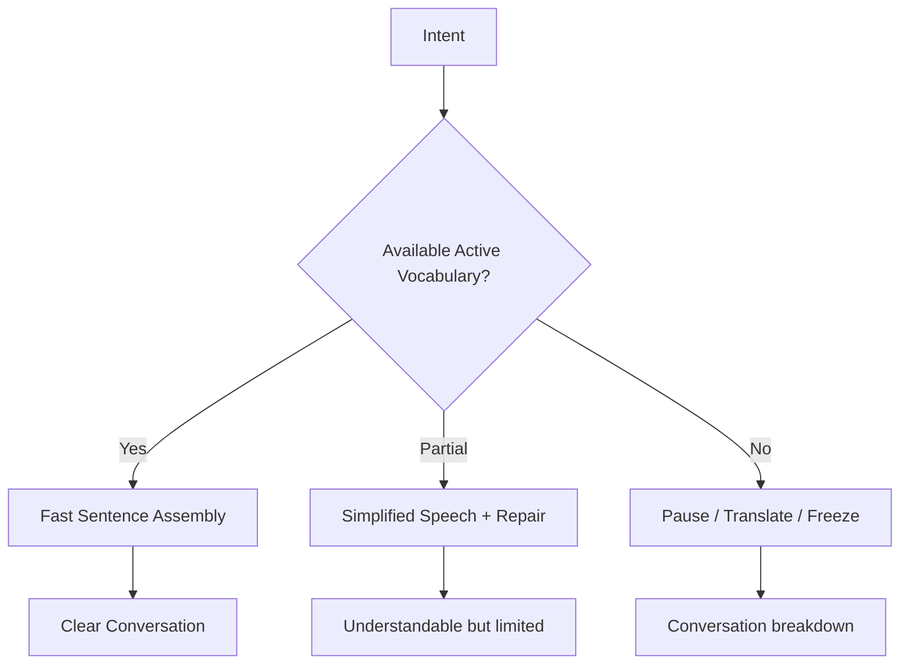
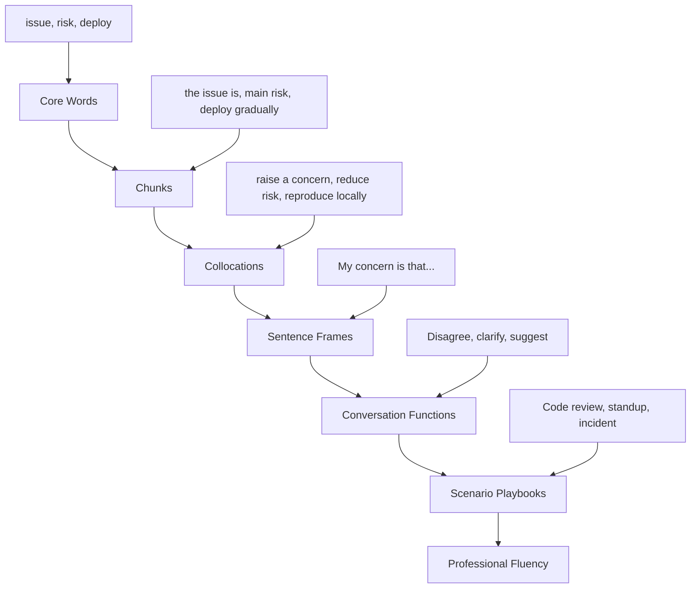
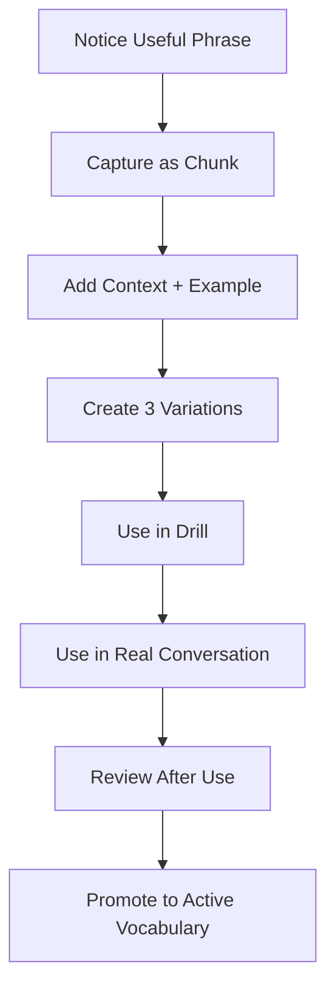
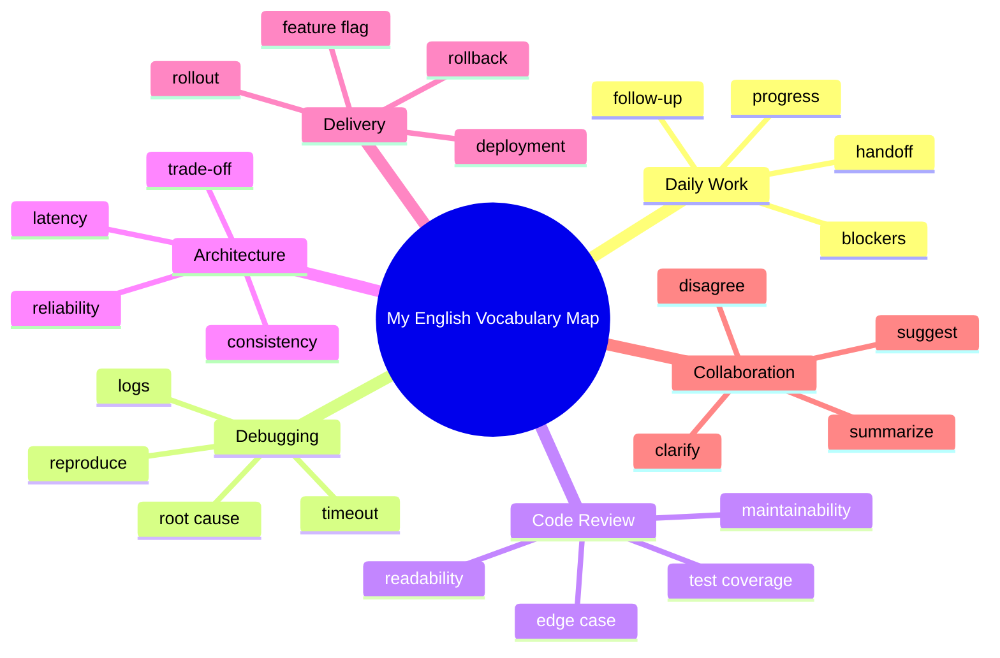

# Part 08 — Vocabulary Architecture: Useful Words, Chunks, and Collocations

> Tujuan part ini: membangun vocabulary yang benar-benar bisa dipakai saat conversation, bukan hanya dikenali saat membaca dokumentasi.

Banyak software engineer punya passive vocabulary besar. Mereka bisa membaca:

- documentation,
- RFC,
- GitHub issue,
- stack trace,
- architecture article,
- pull request comment,
- technical blog.

Tetapi saat speaking, vocabulary itu tidak otomatis keluar.

Kenapa?

Karena passive vocabulary dan active vocabulary adalah dua sistem berbeda.

```text
Passive vocabulary = kata yang bisa kamu pahami saat melihat/mendengar.
Active vocabulary  = kata/chunk yang bisa kamu ambil cepat saat berbicara.
```

English conversation membutuhkan **retrieval speed**. Kamu tidak punya waktu 20 detik untuk mencari kata, menerjemahkan, menyusun grammar, lalu baru bicara.

Solusinya bukan menghafal lebih banyak kata acak. Solusinya adalah membangun **vocabulary architecture**:

```text
Words → Chunks → Collocations → Sentence Frames → Scenario Playbooks
```

Part ini mengubah vocabulary dari daftar kata menjadi operating system untuk speaking.

---

## 1. Positioning dalam Framework Kaufman

Dalam *The First 20 Hours*, Kaufman menekankan skill deconstruction dan practice yang langsung terkait performa.

Untuk English conversation, vocabulary bukan target akhir. Vocabulary adalah bahan baku untuk action:

- asking,
- explaining,
- clarifying,
- agreeing,
- disagreeing,
- suggesting,
- deciding,
- escalating,
- summarizing.

Maka kita tidak bertanya:

> “Berapa banyak kata English yang saya tahu?”

Kita bertanya:

> “Kata dan chunk apa yang saya bisa pakai cepat dalam situasi percakapan nyata?”

Dalam 20 jam pertama, kamu tidak perlu 10.000 kata aktif. Kamu perlu beberapa ratus chunk dengan utility tinggi.

---

## 2. Mental Model: Vocabulary Is a Runtime Dependency

Bayangkan conversation sebagai runtime system.

Kamu punya intent:

```text
Saya ingin bilang bahwa deployment sebaiknya ditunda karena rollback belum dites.
```

Untuk mengeksekusi intent itu, kamu butuh dependency:

- phrase untuk suggestion,
- vocabulary untuk deployment,
- phrase untuk risk,
- phrase untuk condition,
- phrase untuk recommendation.

Output yang bagus:

```text
I suggest we delay the deployment because the rollback path hasn't been tested yet.
```

Kalau dependency belum tersedia, runtime error terjadi:

```text
Maybe deployment... not now... because rollback... not test... so better later.
```

Kalimat kedua masih bisa dipahami, tetapi tidak cukup precise untuk banyak situasi profesional.

Vocabulary architecture bertujuan membuat dependency utama tersedia secara cepat.



---

## 3. Passive vs Active Vocabulary

### 3.1 Passive Vocabulary

Kamu mengenali kata ketika membaca atau mendengar.

Contoh:

```text
rollback
latency
constraint
assumption
trade-off
investigate
intermittent
reproducible
```

Kamu paham saat membaca:

```text
The issue is intermittent and not reproducible locally.
```

Tetapi saat meeting, kamu mungkin tidak spontan mengatakan:

```text
The issue seems intermittent, and I haven't been able to reproduce it locally yet.
```

Itulah active vocabulary gap.

### 3.2 Active Vocabulary

Kamu bisa memakai kata/chunk cepat, tanpa banyak berpikir.

Active vocabulary biasanya berbentuk chunk:

```text
seems intermittent
reproduce it locally
not fully sure yet
the main trade-off is
my concern is
the safer option is
we need to validate this first
```

Conversation fluency lebih banyak dibangun dari chunk daripada isolated words.

---

## 4. Why Isolated Word Memorization Fails

Menghafal kata seperti ini kurang efektif untuk speaking:

```text
constraint = batasan
assumption = asumsi
mitigation = mitigasi
reproduce = mereproduksi
```

Masalahnya: saat berbicara, kamu tidak hanya butuh meaning. Kamu butuh tahu:

- kata ini dipakai dengan verb apa,
- preposition apa yang mengikuti,
- phrase apa yang natural,
- konteks formal/informal,
- apakah kata ini countable/uncountable,
- bagaimana menyisipkannya ke sentence frame.

Contoh kata `concern`.

Knowing the translation is not enough.

Useful chunks:

```text
My concern is...
I'm concerned about...
One concern I have is...
That addresses my concern.
I don't think this is a major concern.
```

Kalau hanya tahu `concern = kekhawatiran`, kamu masih sulit berbicara. Kalau punya chunks di atas, kamu bisa langsung participate dalam design review.

---

## 5. Vocabulary Unit: Prefer Chunks Over Words

Unit belajar utama harus berubah:

```text
word → chunk
```

| Weak Unit | Better Unit |
|---|---|
| blocker | I'm blocked by... |
| issue | The issue is... |
| clarify | Could you clarify...? |
| suggest | I suggest we... |
| concern | My concern is... |
| trade-off | The trade-off is... |
| reproduce | I can reproduce it locally. |
| rollback | We may need to roll it back. |
| assumption | My assumption is that... |
| risk | The main risk is... |

Chunks mengurangi beban grammar karena sebagian struktur sudah siap.

---

## 6. The Vocabulary Architecture Stack



### 6.1 Core Words

Words that carry meaning:

```text
issue
risk
blocker
deploy
rollback
latency
failure
constraint
assumption
impact
```

### 6.2 Chunks

Small reusable language blocks:

```text
the main issue is
I'm blocked by
we need to roll back
my assumption is
this could impact
```

### 6.3 Collocations

Words that naturally go together:

```text
raise a concern
make a decision
reduce latency
increase reliability
meet a requirement
reproduce a bug
run a test
review a pull request
```

### 6.4 Sentence Frames

Reusable structures:

```text
The main issue is that...
My concern is that...
I suggest we...
Could you clarify...?
The trade-off is between... and...
```

### 6.5 Conversation Functions

What you are trying to do:

```text
ask
clarify
explain
agree
disagree
suggest
decide
summarize
escalate
```

### 6.6 Scenario Playbooks

Vocabulary organized by situation:

```text
standup
code review
debugging
architecture discussion
incident update
stakeholder meeting
interview
```

---

## 7. Functional Vocabulary: The Highest ROI Layer

For conversation, vocabulary should be grouped by function.

### 7.1 Asking

```text
Could you explain...?
Could you clarify...?
What do you mean by...?
Can you walk me through...?
Do you know why...?
Do we have any data on...?
What are the constraints?
What are the next steps?
```

Engineering examples:

```text
Could you clarify the expected behavior?
Can you walk me through the deployment process?
Do we have any data on the failure rate?
What are the constraints for this migration?
```

### 7.2 Explaining

```text
The main issue is...
The reason is...
This happens because...
The impact is...
The trade-off is...
The current behavior is...
The expected behavior is...
```

Examples:

```text
The main issue is that the service times out under load.
This happens because the connection pool is exhausted.
The impact is that checkout becomes unreliable.
The trade-off is higher latency but better consistency.
```

### 7.3 Clarifying

```text
Let me clarify that.
What I mean is...
To be more specific...
Just to confirm...
So you're saying that...?
Do you mean...?
```

Examples:

```text
Let me clarify that. I'm not suggesting a full rollback.
What I mean is we should disable the feature flag first.
Just to confirm, this only affects staging, right?
```

### 7.4 Agreeing

```text
That makes sense.
I agree with that.
I think that's reasonable.
That sounds like a good approach.
I'm aligned with the direction.
```

Examples:

```text
That makes sense. A gradual rollout would reduce the risk.
I agree with that. We should validate it in staging first.
```

### 7.5 Disagreeing

```text
I see your point, but...
I'm not fully convinced that...
My concern is...
I'm worried that...
I would be careful with...
I think there is another risk here.
```

Examples:

```text
I see your point, but I'm worried about the migration risk.
I'm not fully convinced that this solves the root cause.
My concern is that we don't have enough observability yet.
```

### 7.6 Suggesting

```text
I suggest we...
We could...
Maybe we should...
One option is to...
It might be safer to...
What if we...?
```

Examples:

```text
I suggest we roll it out gradually.
We could add a feature flag first.
It might be safer to postpone the deployment.
What if we test the rollback path before merging this?
```

### 7.7 Deciding

```text
Let's go with...
I think the best option is...
Based on the risk, we should...
Let's align on the next step.
So the decision is...
```

Examples:

```text
Let's go with the safer option for now.
Based on the risk, we should delay the deployment.
So the decision is to roll this out to 10% of users first.
```

### 7.8 Summarizing

```text
Let me summarize.
So far, we know that...
The key points are...
The decision is...
The next steps are...
```

Examples:

```text
Let me summarize. The issue started after the deployment, it affects checkout, and the safest next step is to roll back.
The next steps are to check the logs, validate the config, and prepare a patch.
```

---

## 8. Core Engineering Vocabulary Categories

### 8.1 Work Status

Words:

```text
progress
blocker
update
priority
timeline
scope
estimate
dependency
handoff
follow-up
```

Chunks:

```text
I'm working on...
I'm currently blocked by...
The main dependency is...
The timeline is tight.
This is out of scope for now.
I'll follow up after the meeting.
```

Examples:

```text
I'm currently blocked by the missing API contract.
The main dependency is the authentication service.
This is out of scope for the current sprint.
```

### 8.2 Bugs and Debugging

Words:

```text
bug
issue
error
failure
exception
stack trace
log
timeout
regression
root cause
reproducible
intermittent
```

Chunks:

```text
The issue is reproducible locally.
The error happens intermittently.
The logs show a timeout.
The root cause seems to be...
This looks like a regression.
```

Examples:

```text
The issue is reproducible locally, but only with test data.
The logs show a timeout before the request reaches the database.
This looks like a regression from the last release.
```

### 8.3 Delivery and Deployment

Words:

```text
deploy
deployment
release
rollback
rollout
feature flag
migration
staging
production
canary
blast radius
```

Chunks:

```text
deploy to staging
release to production
roll it back
roll it out gradually
reduce the blast radius
behind a feature flag
```

Examples:

```text
We should deploy this to staging first.
Let's roll it out gradually behind a feature flag.
If anything goes wrong, we can roll it back quickly.
```

### 8.4 Architecture and Design

Words:

```text
architecture
design
constraint
assumption
trade-off
scalability
reliability
availability
consistency
latency
throughput
coupling
cohesion
boundary
```

Chunks:

```text
The main trade-off is...
This increases coupling.
This improves reliability.
The assumption is that...
The constraint is...
We need a clear boundary between...
```

Examples:

```text
The main trade-off is latency versus consistency.
This design improves reliability, but it increases operational complexity.
The assumption is that traffic will grow gradually.
```

### 8.5 Code Review

Words:

```text
approach
implementation
edge case
readability
maintainability
abstraction
validation
naming
side effect
behavior
```

Chunks:

```text
This approach works, but...
Could we simplify this?
What happens if...?
This might break when...
Could we add a test for...?
The naming is a bit unclear.
```

Examples:

```text
This approach works, but I'm concerned about the edge case where the input is null.
Could we add a test for the failure scenario?
The naming is a bit unclear because this method does more than validation.
```

---

## 9. Collocations: Natural Word Partnerships

Collocations make your English sound less translated.

### 9.1 Common Engineering Collocations

| Verb | Natural Collocation |
|---|---|
| raise | raise a concern, raise an issue |
| make | make a decision, make a change |
| take | take a look, take ownership, take action |
| run | run tests, run a query, run a migration |
| deploy | deploy a service, deploy to staging |
| roll out | roll out a feature, roll out gradually |
| roll back | roll back a deployment, roll back a change |
| fix | fix a bug, fix an issue |
| reproduce | reproduce a bug, reproduce locally |
| investigate | investigate an issue, investigate the root cause |
| reduce | reduce latency, reduce risk, reduce complexity |
| increase | increase reliability, increase throughput |
| meet | meet a requirement, meet the deadline |
| miss | miss a requirement, miss a deadline |
| handle | handle errors, handle retries, handle edge cases |

### 9.2 Collocation Mistakes

Less natural:

```text
make a test
make a bug
open the feature
close the risk
```

More natural:

```text
run a test
find a bug / fix a bug
enable the feature
reduce the risk / mitigate the risk
```

### 9.3 Practice

Complete the chunk:

```text
raise a ______
run a ______
reduce ______
roll out ______
reproduce ______
meet the ______
handle edge ______
make a ______
```

Expected:

```text
raise a concern
run a test
reduce latency / reduce risk
roll out a feature
reproduce a bug
meet the requirement / deadline
handle edge cases
make a decision
```

---

## 10. Sentence Frames for Fast Speaking

Sentence frames are templates with slots.

### 10.1 Problem Frame

```text
The main issue is that [problem].
```

Examples:

```text
The main issue is that the service times out under load.
The main issue is that we don't have enough observability.
The main issue is that the migration path is not reversible.
```

### 10.2 Cause Frame

```text
This happens because [cause].
```

Examples:

```text
This happens because the connection pool is exhausted.
This happens because the cache is not invalidated correctly.
This happens because the config is different in production.
```

### 10.3 Impact Frame

```text
This affects [user/system] because [impact].
```

Examples:

```text
This affects checkout because payment requests time out.
This affects internal users because the dashboard shows stale data.
This affects the deployment because the migration takes too long.
```

### 10.4 Suggestion Frame

```text
I suggest we [action] so that [benefit].
```

Examples:

```text
I suggest we roll it out gradually so that we can reduce the blast radius.
I suggest we add more logging so that we can debug this faster.
I suggest we postpone the deployment so that we can test the rollback path.
```

### 10.5 Concern Frame

```text
My concern is that [risk].
```

Examples:

```text
My concern is that this change increases coupling between services.
My concern is that we don't have a safe rollback plan.
My concern is that this may create a regression in the checkout flow.
```

### 10.6 Trade-Off Frame

```text
The trade-off is [benefit] versus [cost].
```

Examples:

```text
The trade-off is lower latency versus weaker consistency.
The trade-off is faster delivery versus higher operational risk.
The trade-off is simpler implementation versus lower flexibility.
```

### 10.7 Decision Frame

```text
Based on [reason], I think we should [decision].
```

Examples:

```text
Based on the production risk, I think we should delay the deployment.
Based on the logs, I think we should investigate the database connection first.
Based on the timeline, I think we should reduce the scope.
```

---

## 11. Vocabulary for Uncertainty

Professional English conversation often requires calibrated uncertainty.

Avoid extremes:

```text
This is definitely wrong.
This will never work.
I don't know anything.
```

Use calibrated phrases:

```text
I'm not fully sure yet.
My current guess is...
It seems like...
It looks like...
This might be...
This could be related to...
I need to verify this first.
```

Examples:

```text
I'm not fully sure yet, but it seems related to the deployment.
My current guess is that the cache is returning stale data.
This could be related to the config change from yesterday.
I need to verify this in staging first.
```

### 11.1 Certainty Ladder

```text
I don't know yet.
I'm not sure.
It might be...
It could be...
It seems like...
It looks like...
I think...
I'm fairly sure...
I'm confident that...
```

Use this ladder to avoid sounding either too weak or too absolute.

---

## 12. Vocabulary for Politeness and Softening

Direct translation from Indonesian can sometimes sound too blunt in English workplace conversation.

Blunt:

```text
Your code is wrong.
This design is bad.
You must change this.
I don't agree.
```

More professional:

```text
I think this might break in this edge case.
I'm concerned about this part of the design.
Could we consider another approach?
I see your point, but I have a different concern.
```

### 12.1 Softening Tools

| Tool | Example |
|---|---|
| might | This might cause a regression. |
| could | We could simplify this. |
| maybe | Maybe we should test this first. |
| I think | I think the naming could be clearer. |
| I'm concerned | I'm concerned about the rollout risk. |
| Would it make sense | Would it make sense to add a feature flag? |

Softening is not weakness. It is control over social impact.

---

## 13. Active Vocabulary System

You need a system that converts passive vocabulary into active speech.



### 13.1 Capture Format

Use this format:

```text
Chunk: My concern is that...
Function: soft disagreement / risk expression
Scenario: code review, design review
Examples:
1. My concern is that this increases coupling.
2. My concern is that the rollback path is not tested.
3. My concern is that this will be hard to debug in production.
```

### 13.2 The 3-Variation Rule

Never save a phrase with only one example. Create three variations.

Why?

Because one example becomes memorized script. Three variations become flexible pattern.

Example:

```text
I suggest we add more logging.
I suggest we delay the deployment.
I suggest we split this into two pull requests.
```

Now your brain learns the reusable structure:

```text
I suggest we + verb phrase
```

---

## 14. Personal Phrasebank Design

Your phrasebank should not be a dictionary. It should be organized by conversation job.

Recommended structure:

```text
01-asking.md
02-clarifying.md
03-explaining.md
04-agreeing.md
05-disagreeing.md
06-suggesting.md
07-decision-making.md
08-standup.md
09-debugging.md
10-code-review.md
11-architecture.md
12-incident.md
```

Each entry:

```text
Phrase:
Function:
Formality:
Scenario:
Example 1:
Example 2:
Example 3:
Common mistake:
```

### 14.1 Example Entry

```text
Phrase: Could you walk me through...?
Function: ask for explanation
Formality: neutral/professional
Scenario: debugging, onboarding, design review
Example 1: Could you walk me through the deployment process?
Example 2: Could you walk me through how this service handles retries?
Example 3: Could you walk me through the failure scenario?
Common mistake: Explain me about... ❌
Better: Could you explain...? / Could you walk me through...? ✅
```

---

## 15. 100 High-Utility Conversation Chunks

Use these as starter inventory.

### 15.1 Opening and Context

```text
I wanted to ask about...
I have a quick question about...
Can we talk about...?
I need your input on...
I want to clarify one thing before we move on.
Let me give a bit of context.
For context, this started after...
The background is...
```

### 15.2 Understanding

```text
I see.
Got it.
That makes sense.
I understand the concern.
I see what you mean.
Let me make sure I understood.
So you're saying that...
Just to confirm...
```

### 15.3 Clarification

```text
Could you clarify that?
Could you say that again?
Could you rephrase that?
What do you mean by...?
Do you mean...?
Are you referring to...?
Can you give an example?
Can you be more specific?
```

### 15.4 Explaining

```text
The main issue is...
The problem is that...
This happens because...
The reason is...
The impact is...
The current behavior is...
The expected behavior is...
The difference is...
```

### 15.5 Debugging

```text
I can reproduce it locally.
I can't reproduce it yet.
The logs show...
The error happens when...
This started after...
My current guess is...
The root cause seems to be...
We need more data before deciding.
```

### 15.6 Suggesting

```text
I suggest we...
We could...
Maybe we should...
One option is to...
It might be safer to...
What if we...?
Would it make sense to...?
Let's consider...
```

### 15.7 Disagreeing and Pushback

```text
I see your point, but...
I'm not fully convinced that...
My concern is...
I'm worried that...
I would be careful with...
That might work, but...
I think there is another risk.
Can we validate that assumption first?
```

### 15.8 Decision and Alignment

```text
Let's go with...
I think the best option is...
Based on the risk, we should...
So the decision is...
The next step is...
Who will own this?
When do we need to decide?
Let's align on the timeline.
```

### 15.9 Closing

```text
Thanks, that helps.
That answers my question.
I'll follow up after checking the logs.
I'll update the ticket.
Let's continue this in the thread.
I'll send a summary after the meeting.
Talk to you later.
Thanks for the clarification.
```

---

## 16. Common False Friends and Awkward Direct Translations

### 16.1 “Discuss About”

Less natural:

```text
Let's discuss about the issue.
```

Better:

```text
Let's discuss the issue.
Let's talk about the issue.
```

Rule:

```text
discuss + object
talk about + object
```

### 16.2 “Explain Me”

Less natural:

```text
Can you explain me this code?
```

Better:

```text
Can you explain this code to me?
Could you walk me through this code?
```

### 16.3 “I Ever”

Less natural:

```text
I ever worked on that service.
```

Better:

```text
I've worked on that service before.
I worked on that service previously.
```

### 16.4 “Join With”

Less natural:

```text
I'll join with the meeting.
```

Better:

```text
I'll join the meeting.
I'll join the call.
```

### 16.5 “Request For”

Depends on usage.

Natural noun:

```text
I sent a request for access.
```

Natural verb:

```text
I requested access.
```

### 16.6 “Until Now” Overuse

Less natural in some contexts:

```text
Until now, I don't have any blocker.
```

Better:

```text
I don't have any blockers at the moment.
So far, I don't have any blockers.
```

---

## 17. Engineering Phrasebank by Scenario

### 17.1 Standup

```text
Yesterday, I worked on...
Today, I'm going to...
I'm currently blocked by...
I need help with...
I don't have any blockers at the moment.
This is taking longer than expected because...
I should be able to finish it by...
```

Example:

```text
Yesterday, I worked on the authentication flow. Today, I'm going to add integration tests. I'm currently blocked by the missing test credentials.
```

### 17.2 Debugging

```text
The issue started after...
The error happens when...
The logs show...
I can reproduce it by...
I haven't found the root cause yet.
My current guess is...
Let's check the logs first.
Let's isolate the failing component.
```

Example:

```text
The issue started after the deployment. The logs show repeated timeout errors. My current guess is that the database connection pool is exhausted.
```

### 17.3 Code Review

```text
Could we simplify this part?
What happens if the input is null?
This might cause a regression.
Could we add a test for this scenario?
The naming is a bit unclear.
This looks good to me.
Thanks for the update.
```

Example:

```text
This looks good overall. One concern I have is the edge case where the input is null. Could we add a test for that scenario?
```

### 17.4 Architecture Discussion

```text
The main trade-off is...
The constraint is...
The assumption is...
This improves reliability but increases complexity.
This creates tighter coupling between services.
We need to define the service boundary clearly.
How does this behave under load?
What is the rollback strategy?
```

Example:

```text
The main trade-off is lower latency versus weaker consistency. If we choose asynchronous replication, we need to handle stale reads explicitly.
```

### 17.5 Incident Update

```text
We are investigating the issue.
The impact is limited to...
The current hypothesis is...
We have mitigated the immediate impact.
The service is recovering.
We will share a follow-up after the root cause analysis.
```

Example:

```text
We are investigating a timeout issue in the payment service. The impact is limited to checkout requests in one region. We have mitigated the immediate impact by rolling back the latest deployment.
```

---

## 18. Retrieval Practice: Make Vocabulary Available Under Pressure

Recognition is not enough. You need retrieval.

### 18.1 Indonesian Prompt → English Output

Prompt:

```text
Saya ingin bilang bahwa saya belum yakin root cause-nya.
```

Output options:

```text
I'm not sure about the root cause yet.
I haven't found the root cause yet.
My current guess is that it's related to the deployment, but I need to verify it.
```

Prompt:

```text
Saya ingin menyampaikan concern tentang risiko rollback.
```

Output:

```text
My concern is that the rollback path hasn't been tested yet.
I'm worried that we don't have a safe rollback plan.
```

### 18.2 Function Prompt → Phrase Output

Prompt:

```text
Ask for clarification.
```

Output:

```text
Could you clarify that?
Do you mean the staging environment or production?
Let me make sure I understood.
```

Prompt:

```text
Disagree politely.
```

Output:

```text
I see your point, but I'm concerned about the rollout risk.
I'm not fully convinced that this solves the root cause.
```

---

## 19. The Active Vocabulary Drill

Gunakan format 10 menit.

### Step 1 — Pick One Function

Example:

```text
Function: expressing concern
```

### Step 2 — Pick 5 Chunks

```text
My concern is...
I'm concerned about...
I'm worried that...
One risk is...
I would be careful with...
```

### Step 3 — Generate 3 Engineering Examples Each

```text
My concern is that the migration is not reversible.
My concern is that the service boundary is unclear.
My concern is that this increases operational complexity.
```

### Step 4 — Speak, Don't Write Only

Read once, then close notes and speak.

### Step 5 — Use in Mini Roleplay

Prompt:

```text
Your teammate wants to deploy today, but rollback hasn't been tested.
```

Response:

```text
I see why we want to deploy today, but my concern is that the rollback path hasn't been tested yet. It might be safer to delay the deployment until we validate that.
```

---

## 20. Vocabulary Compression: Say More with Less

In conversation, shorter often beats longer.

Long and translated:

```text
I want to say that maybe we need to do checking about the log first before we make decision for rollback.
```

Compressed:

```text
We should check the logs before deciding whether to roll back.
```

Long:

```text
The problem that happens is maybe because the configuration in production is not same with staging.
```

Compressed:

```text
The issue might be caused by a config difference between staging and production.
```

Long:

```text
I am afraid that if we deploy this, it will make another problem in checkout.
```

Compressed:

```text
I'm concerned this could cause a regression in checkout.
```

Compression comes from chunks and collocations.

---

## 21. Avoid Over-Engineering Your English

Software engineers sometimes over-optimize speech like code.

They try to produce the perfect sentence:

```text
Considering the architectural implications and the operational constraints, perhaps it would be prudent to evaluate whether the deployment strategy should be modified.
```

Often, this is better:

```text
Given the risk, I think we should change the deployment strategy.
```

Conversation values:

- clarity,
- timing,
- relevance,
- repairability,
- shared understanding.

Not maximum lexical complexity.

---

## 22. Vocabulary for Conversation Control

These chunks help you manage the interaction itself.

### 22.1 Entering a Conversation

```text
Can I add something here?
Can I jump in for a second?
I have one quick point.
Just to add to that...
```

### 22.2 Holding the Floor

```text
Let me finish this thought.
There are two parts to this.
The first point is...
The second point is...
```

### 22.3 Returning the Floor

```text
What do you think?
Does that make sense?
How does that sound?
Any concerns with that approach?
```

### 22.4 Parking a Topic

```text
Maybe we should park this for now.
Let's take this offline.
We can follow up on this after the meeting.
This might need a separate discussion.
```

### 22.5 Closing the Loop

```text
So the next step is...
I'll take ownership of that.
Let's document the decision.
I'll update the ticket after this.
```

---

## 23. Vocabulary Review System

Use spaced repetition, but not as isolated flashcards only.

### 23.1 Bad Flashcard

Front:

```text
mitigate
```

Back:

```text
mengurangi risiko
```

This is incomplete.

### 23.2 Better Flashcard

Front:

```text
How do you say: "mengurangi risiko deployment"?
```

Back:

```text
reduce the deployment risk
mitigate the deployment risk
```

### 23.3 Best Flashcard

Front:

```text
You want to suggest feature flag because it reduces deployment risk.
Say it in English.
```

Back:

```text
I suggest we put this behind a feature flag to reduce the deployment risk.
```

Conversation vocabulary should be reviewed as **scenario output**, not only translation.

---

## 24. Personal Vocabulary Map

Build your own map based on your actual work.



### 24.1 How to Fill It

For each node, add:

- 5 core words,
- 5 chunks,
- 3 sentence frames,
- 2 example dialogues.

This creates a personal speaking system.

---

## 25. Practice Set A — Convert Words to Chunks

Convert each word into 3 chunks.

### Word: `risk`

```text
The main risk is...
This reduces the risk of...
I'm worried about the risk of...
```

### Word: `deploy`

```text
deploy to staging
deploy to production
deploy it behind a feature flag
```

### Word: `clarify`

```text
Could you clarify that?
Let me clarify my point.
Just to clarify, are we talking about production?
```

### Word: `blocker`

```text
I'm blocked by...
I don't have any blockers.
This is a blocker for the release.
```

### Word: `impact`

```text
The impact is...
This impacts checkout.
This has no user impact.
```

---

## 26. Practice Set B — Complete the Sentence Frame

Complete each frame with your own work context.

```text
The main issue is that...
This happens because...
The impact is...
My concern is that...
I suggest we...
The trade-off is...
Based on the risk, we should...
Let me summarize...
```

Example answers:

```text
The main issue is that the service times out under load.
This happens because the connection pool is too small.
The impact is that some checkout requests fail.
My concern is that the rollback path hasn't been tested.
I suggest we deploy this behind a feature flag.
The trade-off is faster delivery versus higher operational risk.
Based on the risk, we should postpone the deployment.
Let me summarize the decision and next steps.
```

---

## 27. Practice Set C — Scenario Retrieval

Use the scenario, then speak for 30 seconds.

### Scenario 1 — Standup Blocker

```text
You are blocked because the API contract is unclear.
```

Useful chunks:

```text
I'm currently blocked by...
I need clarification on...
The expected behavior is unclear.
```

Possible response:

```text
I'm currently blocked by the API contract. I need clarification on the expected response when the user is inactive. Once that's clear, I can finish the implementation.
```

### Scenario 2 — Code Review Concern

```text
A teammate's PR works, but you see an edge case.
```

Useful chunks:

```text
This looks good overall.
One concern I have is...
What happens if...?
Could we add a test for...?
```

Possible response:

```text
This looks good overall. One concern I have is the edge case where the input is null. What happens in that case? Could we add a test for it?
```

### Scenario 3 — Deployment Risk

```text
Team wants to deploy, but rollback is not tested.
```

Useful chunks:

```text
I see why we want to...
My concern is...
It might be safer to...
```

Possible response:

```text
I see why we want to deploy today, but my concern is that the rollback path hasn't been tested yet. It might be safer to validate that first before releasing to production.
```

---

## 28. Practice Set D — Phrase Expansion

Start from a small chunk and expand.

### Chunk: `The issue is...`

```text
The issue is the timeout.
The issue is the timeout in the payment service.
The issue is the timeout in the payment service after the deployment.
The issue is that the payment service started timing out after the deployment.
```

### Chunk: `My concern is...`

```text
My concern is the rollback.
My concern is the rollback strategy.
My concern is that the rollback strategy hasn't been tested.
My concern is that the rollback strategy hasn't been tested in staging yet.
```

### Chunk: `I suggest we...`

```text
I suggest we delay.
I suggest we delay the deployment.
I suggest we delay the deployment until the rollback path is tested.
```

This drill builds flexibility.

---

## 29. Practice Set E — Phrase Compression

Compress long translated sentences.

### Input 1

```text
I want to say that the problem is coming from the configuration that is different between staging and production.
```

Better:

```text
The issue might be caused by a config difference between staging and production.
```

### Input 2

```text
Maybe we need to make the deployment not for all users first.
```

Better:

```text
Maybe we should roll this out gradually.
```

### Input 3

```text
I am not really agree because this can make the service more difficult to maintain.
```

Better:

```text
I'm not fully convinced because this could make the service harder to maintain.
```

### Input 4

```text
Can you explain me about how this function works?
```

Better:

```text
Could you walk me through how this function works?
```

---

## 30. Vocabulary Feedback Rubric

| Area | 1 — Weak | 2 — Functional | 3 — Strong |
|---|---|---|---|
| Retrieval speed | sering freeze | bisa bicara dengan pause | chunk keluar cepat |
| Precision | kata terlalu umum | cukup jelas | technical meaning precise |
| Collocation | banyak direct translation | beberapa natural chunks | mostly natural phrasing |
| Function coverage | hanya bisa answer | bisa ask/explain/clarify | bisa disagree/decide/escalate |
| Scenario readiness | tidak siap meeting | siap situasi umum | siap situasi engineering spesifik |
| Flexibility | hafal satu script | bisa variasi sederhana | bisa adaptasi spontan |

Target awal:

```text
Level 2 untuk semua function utama, Level 3 untuk scenario kerja paling sering.
```

---

## 31. 7-Day Vocabulary Activation Plan

### Day 1 — Build Core Phrasebank

Capture 30 chunks:

- 5 asking,
- 5 clarifying,
- 5 explaining,
- 5 suggesting,
- 5 disagreeing,
- 5 closing.

### Day 2 — Standup Vocabulary

Create and speak 5 standup updates.

### Day 3 — Debugging Vocabulary

Practice issue, logs, reproduce, root cause, hypothesis.

### Day 4 — Code Review Vocabulary

Practice concern, edge case, test, naming, maintainability.

### Day 5 — Architecture Vocabulary

Practice trade-off, constraint, assumption, latency, reliability.

### Day 6 — Decision Vocabulary

Practice option, risk, recommendation, decision, next step.

### Day 7 — Scenario Simulation

Run 5 mini roleplays:

- standup blocker,
- debugging update,
- code review concern,
- deployment risk,
- architecture trade-off.

---

## 32. Output Akhir Part Ini

Setelah menyelesaikan part ini, kamu harus memiliki:

1. **Personal active phrasebank**
   - minimal 100 chunks.

2. **Function-based vocabulary map**
   - asking, clarifying, explaining, agreeing, disagreeing, suggesting, deciding, summarizing.

3. **Engineering scenario phrasebank**
   - standup, debugging, code review, architecture, deployment.

4. **Collocation list**
   - minimal 50 natural collocations.

5. **Retrieval practice routine**
   - prompt → speak → correct → repeat.

6. **Compression skill**
   - mengubah kalimat translated menjadi concise professional English.

---

## 33. Checklist Kelulusan

Kamu boleh lanjut ke part berikutnya jika:

- [ ] Bisa memakai minimal 30 chunks tanpa membaca.
- [ ] Bisa menjelaskan satu work issue menggunakan `problem → cause → impact → suggestion`.
- [ ] Bisa menyampaikan concern dengan phrase `My concern is...`.
- [ ] Bisa bertanya clarification menggunakan minimal 5 phrase berbeda.
- [ ] Bisa membuat standup update 30 detik.
- [ ] Bisa memberikan code review concern secara sopan.
- [ ] Bisa menyebut trade-off teknis dengan pattern `The trade-off is...`.
- [ ] Bisa mengubah 5 direct translations menjadi English yang lebih natural.

---

## 34. Key Takeaways

- Vocabulary untuk conversation harus aktif, bukan hanya pasif.
- Unit belajar utama bukan isolated word, tetapi chunk.
- Collocations membuat speech terdengar lebih natural dan lebih cepat diproduksi.
- Sentence frames mempercepat speaking karena struktur sudah tersedia.
- Vocabulary harus dikelompokkan berdasarkan function dan scenario.
- Active vocabulary dibangun lewat retrieval practice, bukan hanya membaca.
- Untuk software engineer, phrasebank harus mencakup standup, debugging, code review, architecture, delivery, dan incident communication.

---

## 35. Transition ke Part 09

Sekarang kamu punya pronunciation yang lebih parseable dan vocabulary yang lebih siap dipakai.

Part berikutnya membahas **Questions: The Engine of Conversation**.

Pertanyaan adalah mesin percakapan karena membantu kamu:

- menjaga alur,
- mendapatkan informasi,
- mengklarifikasi ambiguity,
- mendiagnosis masalah,
- menunjukkan engagement,
- mengontrol arah diskusi.

Banyak learner terlalu fokus pada “how to answer”. Dalam conversation nyata, kemampuan “how to ask” sering lebih penting.
