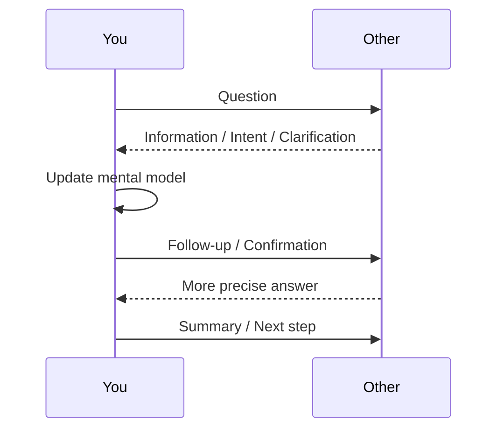
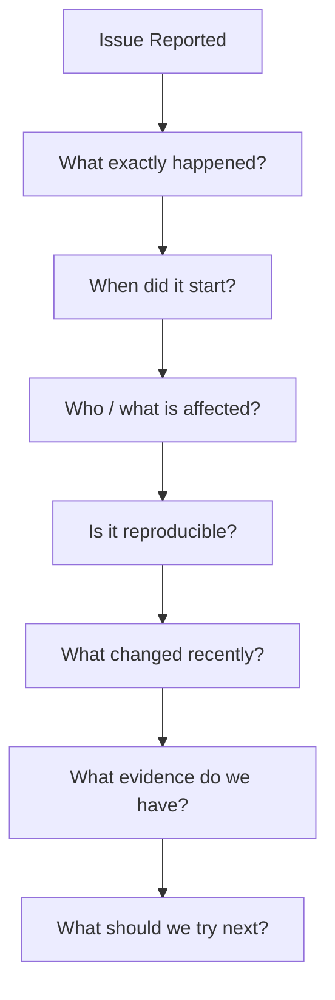
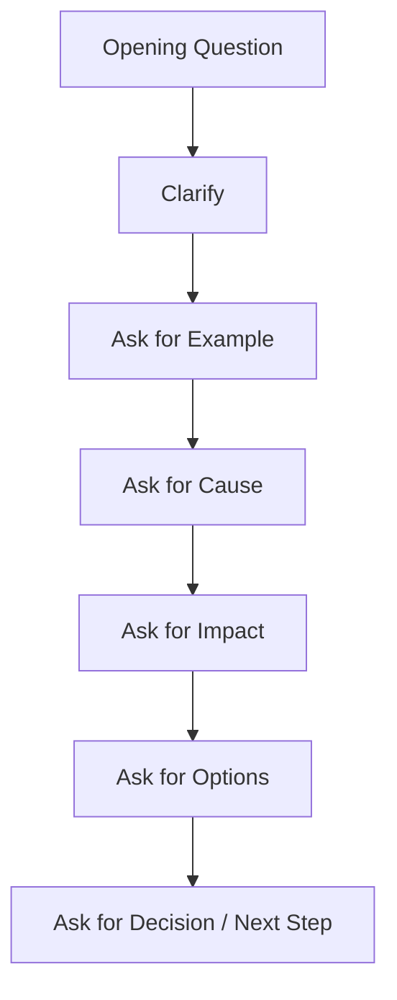

# Part 09 — Questions: The Engine of Conversation

> Tujuan part ini: membuat kamu mampu menjaga percakapan tetap hidup, jelas, dan produktif dengan pertanyaan yang tepat.

Dalam conversation, pertanyaan adalah mesin penggerak.

Tanpa pertanyaan, kamu hanya bisa:

- menjawab pendek,
- menunggu lawan bicara memimpin,
- kehilangan arah ketika tidak paham,
- terdengar pasif dalam meeting,
- sulit menggali masalah teknis,
- sulit membangun hubungan sosial.

Dengan pertanyaan yang tepat, kamu bisa:

- membuka percakapan,
- memperdalam topik,
- memperbaiki misunderstanding,
- mengarahkan diskusi,
- menemukan root cause,
- mengklarifikasi requirement,
- menantang asumsi tanpa terdengar kasar,
- membuat keputusan lebih cepat.

Banyak learner English terlalu fokus pada jawaban.

Mereka berpikir:

> “Saya harus bisa menjelaskan semuanya dalam English.”

Itu benar, tetapi tidak lengkap.

Dalam percakapan nyata, orang yang bisa bertanya dengan baik sering terlihat lebih fluent, lebih engaged, dan lebih senior daripada orang yang hanya bisa memberi monolog panjang.

Untuk software engineer, skill bertanya bukan hanya skill bahasa. Ini adalah skill berpikir.

---

## 1. Positioning dalam Framework Kaufman

Dalam kerangka *The First 20 Hours*, kita tidak belajar semua kemungkinan grammar pertanyaan terlebih dahulu. Kita mulai dari target performa.

Target performa part ini:

> Kamu bisa menggunakan pertanyaan untuk memulai, menjaga, mengklarifikasi, menggali, mengarahkan, dan menutup percakapan kerja maupun sosial.

Kita deconstruct skill bertanya menjadi beberapa sub-skill:

1. membentuk pertanyaan dasar,
2. memilih tipe pertanyaan yang sesuai,
3. menggunakan follow-up,
4. bertanya tanpa terdengar terlalu tajam,
5. mengklarifikasi ambiguity,
6. menggali root cause,
7. mengarahkan keputusan,
8. bertanya sambil tetap mendengarkan.

Dalam 20 jam pertama, kamu tidak perlu menguasai semua bentuk interrogative grammar. Kamu perlu menguasai **high-frequency question frames** yang bisa dipakai berulang dalam situasi nyata.

---

## 2. Mental Model: Questions Are Conversation Control Packets

Bayangkan conversation seperti distributed system.

Setiap orang punya local state:

- apa yang mereka tahu,
- apa yang mereka maksud,
- apa yang mereka asumsikan,
- apa yang mereka butuhkan,
- apa yang mereka khawatirkan.

Masalahnya, local state itu tidak otomatis sinkron.

Pertanyaan adalah control packet untuk sinkronisasi state.



Tanpa pertanyaan, kamu menebak state lawan bicara.

Dengan pertanyaan, kamu mengurangi ambiguity.

Dalam engineering, ini sangat penting karena banyak failure bukan disebabkan oleh kurangnya kemampuan teknis, tetapi oleh **misaligned assumptions**.

Contoh:

```text
Weak:
Okay, I will implement it.
```

Masalah: kamu belum tahu detail requirement.

Lebih baik:

```text
Before I implement this, can I clarify the expected behavior?
```

Pertanyaan kecil ini bisa mencegah rework besar.

---

## 3. Why Questions Matter More Than Perfect Answers

Dalam conversation, perfect answer jarang dibutuhkan. Yang lebih dibutuhkan adalah kemampuan menjaga alur.

Kalau kamu tidak tahu jawaban, kamu masih bisa tetap produktif dengan bertanya:

```text
I'm not sure yet. Can you show me where you saw the error?
```

Kalau kamu tidak paham, kamu bisa bertanya:

```text
Could you clarify what you mean by "unstable" in this context?
```

Kalau meeting melebar, kamu bisa bertanya:

```text
What decision do we need to make today?
```

Kalau proposal terdengar riskan, kamu bisa bertanya:

```text
What happens if this migration fails halfway?
```

Pertanyaan membuat kamu tetap hadir dalam percakapan meskipun vocabulary belum sempurna.

---

## 4. Question Categories You Actually Need

Untuk conversation praktis, pertanyaan bisa dibagi menjadi 10 kategori.

| Category | Function | Example |
|---|---|---|
| Opening | membuka percakapan | `How's your day going?` |
| Continuation | menjaga alur | `What happened next?` |
| Clarification | memperjelas makna | `What do you mean by that?` |
| Confirmation | memastikan pemahaman | `So you mean the API fails only in staging?` |
| Diagnostic | menggali penyebab | `When did this start happening?` |
| Scope | membatasi area | `Is this issue affecting all users or only admins?` |
| Priority | menentukan urgensi | `How urgent is this?` |
| Decision | mendorong keputusan | `Which option should we choose?` |
| Reflection | menggali alasan | `Why do you think this approach is safer?` |
| Closing | menutup loop | `What are the next steps?` |

Kamu tidak perlu menghafal semuanya sekaligus. Tetapi kamu perlu tahu bahwa setiap tipe pertanyaan punya fungsi berbeda.

---

## 5. Grammar Minimum for Questions

Kita belajar grammar pertanyaan hanya secukupnya untuk self-correction.

### 5.1 Be Questions

Pakai `be` ketika bertanya tentang state, identity, condition, location, atau status.

Pattern:

```text
Am/Is/Are + subject + complement?
Was/Were + subject + complement?
```

Examples:

```text
Is this issue reproducible?
Are we ready to deploy?
Is the service down?
Are the tests passing?
Was the bug introduced recently?
Were there any changes yesterday?
```

Common mistake:

```text
❌ This issue is reproducible?
```

Ini bisa dipahami dalam informal speech dengan intonation, tetapi untuk professional English lebih aman:

```text
✅ Is this issue reproducible?
```

### 5.2 Do/Does/Did Questions

Pakai `do/does/did` untuk bertanya tentang action, behavior, atau event.

Pattern:

```text
Do/Does/Did + subject + base verb?
```

Examples:

```text
Do we need to update the schema?
Does this happen in production?
Did you check the logs?
Did the deployment finish successfully?
Does the client retry the request?
```

Common mistake:

```text
❌ Did you checked the logs?
```

Correct:

```text
✅ Did you check the logs?
```

Setelah `did`, verb kembali ke base form.

### 5.3 Modal Questions

Pakai modal untuk ability, possibility, permission, request, suggestion, atau expectation.

Pattern:

```text
Can/Could/Should/Would/Will + subject + base verb?
```

Examples:

```text
Can you share your screen?
Could you explain the context?
Should we roll back?
Would it make sense to postpone the release?
Will this affect existing users?
Can we handle this asynchronously?
```

`Could` dan `Would` biasanya terdengar lebih polite daripada `Can` dan `Will`.

Bandingkan:

```text
Can you explain this?
Could you explain this?
```

Keduanya benar. Yang kedua terdengar lebih halus.

### 5.4 WH Questions

Pakai WH question untuk mendapatkan informasi terbuka.

| WH Word | Use | Example |
|---|---|---|
| What | thing/action | `What changed recently?` |
| Why | reason | `Why do we need this migration?` |
| When | time | `When did the issue start?` |
| Where | place/source | `Where is the config defined?` |
| Who | person/owner | `Who owns this service?` |
| Which | option | `Which option is safer?` |
| How | method/degree | `How do we reproduce this?` |
| How many | count | `How many users are affected?` |
| How much | amount | `How much latency did we add?` |
| How long | duration | `How long will the migration take?` |
| How often | frequency | `How often does this fail?` |

Examples:

```text
What behavior did you expect?
Why did we choose this approach?
When was the last successful deployment?
Where do we store this value?
Who should review this PR?
Which service is responsible for authentication?
How can we reduce the blast radius?
```

---

## 6. Direct Questions vs Embedded Questions

Direct questions bagus untuk clarity.

```text
What is the root cause?
```

Embedded questions terdengar lebih soft dan natural dalam meeting.

```text
Do we know what the root cause is?
```

Perhatikan word order.

Direct question:

```text
What is the root cause?
```

Embedded question:

```text
Do we know what the root cause is?
```

Common mistake:

```text
❌ Do we know what is the root cause?
```

Correct:

```text
✅ Do we know what the root cause is?
```

Useful embedded question frames:

```text
Do we know why...?
Do we know when...?
Do we know how...?
Can you explain what...?
Can you clarify why...?
I'm wondering whether...
I'm trying to understand how...
```

Examples:

```text
Do we know why the job failed?
Can you clarify what the expected behavior is?
I'm trying to understand how this affects the checkout flow.
Do we know whether this impacts mobile users?
```

Embedded questions are powerful because they combine clarity with politeness.

---

## 7. Yes/No Questions

Yes/no questions are useful when you want a quick binary answer.

Examples:

```text
Is this urgent?
Is the issue reproducible?
Are we blocked?
Do we need a migration?
Does this affect production?
Can we roll back safely?
Should we involve the platform team?
```

The risk: yes/no questions can end the conversation too quickly.

Example:

```text
A: Is this issue reproducible?
B: No.
```

If you stop there, the conversation dies.

Better:

```text
A: Is this issue reproducible?
B: No.
A: What have we tried so far?
```

Use yes/no questions for narrowing. Use follow-up questions for depth.

---

## 8. WH Questions

WH questions invite more information.

Examples:

```text
What changed recently?
What are we trying to optimize for?
Why is this a priority now?
How do we validate this?
Which part is still unclear?
Who needs to approve this?
When do we need to ship it?
```

Use WH questions when:

- the problem is unclear,
- the answer may be complex,
- you need reasoning,
- you need context,
- you need someone to explain assumptions.

In engineering, WH questions are often better than opinions.

Instead of:

```text
I think this design is risky.
```

Try:

```text
What happens if the queue grows faster than expected?
```

This still communicates concern, but invites reasoning.

---

## 9. Choice Questions

Choice questions help reduce ambiguity.

Pattern:

```text
Is it A or B?
Are we optimizing for A or B?
Should we do A first, or B first?
```

Examples:

```text
Is this a frontend issue or a backend issue?
Are we optimizing for latency or reliability?
Should we roll back now, or investigate for another 30 minutes?
Is the goal to fix the bug quickly or redesign the flow properly?
```

Choice questions are useful when open-ended questions are too broad.

Weak:

```text
What should we do?
```

Better:

```text
Should we roll back, or should we disable the feature flag first?
```

Choice questions reduce cognitive load for the other person.

---

## 10. Clarifying Questions

Clarifying questions make vague language concrete.

Common vague words:

```text
slow
broken
unstable
weird
bad
better
soon
high priority
simple
scalable
clean
```

Clarifying questions:

```text
What do you mean by "slow"?
How slow is it compared to normal?
When you say "broken", what exactly happens?
What does "high priority" mean in terms of deadline?
Can you give an example?
Could you be more specific?
```

Engineering example:

```text
A: The API is slow.
B: How slow are we talking about? Are we seeing seconds, or just higher latency than usual?
```

This is better than immediately guessing.

---

## 11. Confirmation Questions

Confirmation questions verify your understanding.

Pattern:

```text
So, you mean...?
Just to confirm, ...?
Let me check if I understood: ...?
Am I right that...?
```

Examples:

```text
So, you mean the issue only happens after login?
Just to confirm, we are not changing the database schema, right?
Let me check if I understood: the mobile app sends the old payload, but the backend expects the new format.
Am I right that we need to support both versions for now?
```

Confirmation questions are critical because they convert implicit understanding into explicit agreement.

Use them when:

- requirement is ambiguous,
- action item is important,
- stakeholder expectation matters,
- production risk is involved,
- you are about to implement something.

---

## 12. Diagnostic Questions

Diagnostic questions are essential for debugging conversations.

They help answer:

```text
What happened?
Where did it happen?
When did it start?
Who is affected?
How often does it happen?
What changed recently?
What have we already tried?
```

Core diagnostic question set:

```text
What exactly happened?
When did it start?
Is it still happening?
Is it reproducible?
Can you reproduce it locally?
What changed recently?
Which users are affected?
How often does it fail?
What error do you see?
Do we have logs for that request?
What have we tried so far?
```

This is a reusable debugging protocol.



---

## 13. Scope Questions

Scope questions prevent overreaction and underreaction.

Examples:

```text
Is this affecting all users or only a subset?
Is this limited to one region?
Does this happen in production or only in staging?
Is this related to the new release?
Does this affect existing customers?
Is this a blocker for launch?
```

Scope questions are important because the same bug can require very different responses depending on impact.

Compare:

```text
The payment flow is failing for all users.
```

vs

```text
The payment flow is failing for one internal test account in staging.
```

Same category of issue. Very different urgency.

---

## 14. Priority and Urgency Questions

Not every issue deserves the same response.

Useful questions:

```text
How urgent is this?
Is this blocking anyone?
Do we need to fix this today?
Can this wait until the next sprint?
What is the impact if we delay this?
Is there a deadline we need to meet?
Who is waiting for this?
```

In professional conversation, you often need to clarify priority without sounding resistant.

Weak:

```text
I don't have time for this.
```

Better:

```text
Can you help me understand the urgency so I can prioritize it correctly?
```

This signals responsibility, not avoidance.

---

## 15. Assumption Questions

Architecture and product discussions often fail because assumptions are hidden.

Useful questions:

```text
What are we assuming here?
Are we assuming traffic will stay the same?
Are we assuming users will always have a verified email?
Are we assuming the downstream service is always available?
What assumption would make this design fail?
```

These questions sound senior because they expose hidden risk.

Example:

```text
Are we assuming that every event will be processed exactly once?
```

This question can open a deeper conversation about idempotency, retries, ordering, and consistency.

---

## 16. Risk Questions

Risk questions are useful in design review, rollout planning, and incident management.

Examples:

```text
What could go wrong?
What is the worst-case scenario?
How do we roll back?
What is the blast radius?
How do we detect failure?
What happens if the migration stops halfway?
Do we have a fallback plan?
```

Risk questions are not negativity. They are professional responsibility.

Use softer framing if needed:

```text
Just to think through the risk, what happens if the migration fails halfway?
```

---

## 17. Decision Questions

Decision questions help move a conversation from discussion to action.

Examples:

```text
What decision do we need to make today?
Are we aligned on option B?
Can we agree on the next step?
Who will own this action item?
When should we revisit this?
What is the exit criterion?
```

Many meetings fail because people discuss but do not decide.

Decision questions prevent that.

At the end of a technical discussion, use:

```text
So what are we deciding here?
```

Or more polished:

```text
To make sure we leave with a clear outcome, what decision do we need to make today?
```

---

## 18. Follow-Up Questions

Follow-up questions are where conversation becomes natural.

A beginner asks one question, hears the answer, then freezes.

A stronger speaker asks a second question based on the answer.

Example:

```text
A: What are you working on today?
B: I'm fixing a bug in the checkout flow.
A: What's the issue?
B: The payment status doesn't update after retry.
A: Is it a frontend state issue or a backend sync issue?
```

The key is not memorizing random questions. The key is listening for hooks.

Hooks can be:

- a noun,
- a problem,
- a time reference,
- a decision,
- an emotion,
- a blocker,
- a vague word,
- an assumption.

Example:

```text
B: The deployment was a bit messy yesterday.
```

Hooks:

- deployment,
- messy,
- yesterday.

Possible follow-ups:

```text
What happened during the deployment?
What do you mean by messy?
Was it related to yesterday's config change?
```

---

## 19. The Follow-Up Ladder

Use this ladder to deepen conversation gradually.



Example:

```text
Opening:
What are you working on?

Clarify:
What part of the checkout flow?

Example:
Can you show me an example request?

Cause:
Why do you think the status is not updating?

Impact:
Is this affecting real users?

Options:
What options do we have?

Decision:
What should we try first?
```

This ladder works in debugging, planning, code review, and architecture discussion.

---

## 20. Softening Questions

Some English questions can sound too direct if phrased bluntly.

Direct does not always mean rude, but in professional settings you often need tone control.

### 20.1 Harsh vs Professional

| Harsh / Too Direct | Better |
|---|---|
| `Why did you do this?` | `Can you walk me through the reasoning here?` |
| `Why is this wrong?` | `What behavior are we expecting here?` |
| `Who made this mistake?` | `Do we know where this was introduced?` |
| `Why didn't you test it?` | `Do we have test coverage for this case?` |
| `What are you talking about?` | `Can you clarify what you mean?` |

### 20.2 Softening Frames

```text
Can you help me understand...?
Could you clarify...?
I'm trying to understand...
Can you walk me through...?
Do we know...?
Would it make sense to...?
Is there a reason why...?
```

Examples:

```text
Can you help me understand why we need a new table here?
Could you clarify how this affects existing users?
I'm trying to understand the trade-off between these two options.
Can you walk me through the failure scenario?
Is there a reason why we are not using the existing endpoint?
```

---

## 21. Engineering Question Frames

This section gives reusable frames for common engineering contexts.

### 21.1 Requirement Clarification

```text
What problem are we trying to solve?
What is the expected behavior?
What should happen if the input is invalid?
Who is the primary user for this flow?
Is this requirement final, or still open for discussion?
What are the edge cases we need to handle?
Do we need to support backward compatibility?
```

### 21.2 Debugging

```text
What exactly failed?
When did it start failing?
Can we reproduce it?
What changed recently?
Do we have logs for this request?
Is this happening in production?
How many users are affected?
What have we ruled out so far?
```

### 21.3 Code Review

```text
Can you walk me through this part?
Is there a reason we are doing it this way?
What happens if this value is null?
Could this introduce a race condition?
Do we need a test for this edge case?
Would it be simpler to extract this into a helper?
```

### 21.4 Architecture Discussion

```text
What are we optimizing for?
What are the main constraints?
What assumptions are we making?
What is the failure mode?
How do we roll back?
How does this scale with traffic?
What is the operational cost?
What is the migration path?
```

### 21.5 Planning

```text
What is the smallest useful version?
What is the riskiest part?
Can we split this into smaller milestones?
Who needs to be involved?
What is blocked right now?
What can we do in parallel?
```

### 21.6 Incident Response

```text
What is the customer impact?
When did the incident start?
Is the issue still ongoing?
What mitigation is available?
Who is the incident owner?
How do we verify recovery?
What should we communicate to stakeholders?
```

---

## 22. Social Questions for Work Relationships

Conversation is not only technical. Relationship-building matters.

Useful social questions:

```text
How's your day going?
How was your weekend?
Do you have any plans for the weekend?
How's the project going?
How are you feeling about the release?
Have you worked with this team before?
What got you interested in this area?
```

Follow-up examples:

```text
That sounds interesting. How did it go?
Nice. What did you like about it?
Was it your first time doing that?
How long have you been working on it?
```

Avoid turning social conversation into interrogation. Use a rhythm:

```text
Question → Answer → Reaction → Follow-up → Share briefly
```

Example:

```text
A: How was your weekend?
B: Pretty good. I went hiking.
A: Nice, where did you go?
B: To a trail near the lake.
A: That sounds relaxing. I usually stay home on weekends, but I’ve been thinking about hiking more.
```

You do not need advanced English. You need rhythm.

---

## 23. Weak Questions vs Strong Questions

### 23.1 Weak: Too Broad

```text
What do you think?
```

Better:

```text
What do you think about the rollback risk?
```

### 23.2 Weak: Too Vague

```text
Is it okay?
```

Better:

```text
Are you comfortable with releasing this without a migration test?
```

### 23.3 Weak: Too Accusatory

```text
Why did you do that?
```

Better:

```text
Can you walk me through the reasoning behind this approach?
```

### 23.4 Weak: Too Late

```text
I thought you meant something else.
```

Better earlier:

```text
Before I start, let me confirm the expected behavior.
```

### 23.5 Weak: No Follow-Up

```text
A: Is this urgent?
B: Yes.
A: Okay.
```

Better:

```text
A: Is this urgent?
B: Yes.
A: What is the deadline, and who is blocked by it?
```

---

## 24. Question Chains for Common Scenarios

### 24.1 Bug Report Chain

```text
What exactly happened?
When did it start?
Is it reproducible?
Where does it happen?
Who is affected?
What changed recently?
Do we have logs?
What should we try first?
```

### 24.2 Requirement Chain

```text
What problem are we solving?
Who is the user?
What is the expected behavior?
What are the edge cases?
What is out of scope?
How do we know this is done?
```

### 24.3 Design Review Chain

```text
What are we optimizing for?
What constraints do we have?
What alternatives did we consider?
What are the trade-offs?
What can go wrong?
How do we roll back?
What is the migration plan?
```

### 24.4 Stakeholder Update Chain

```text
What outcome do they need?
What level of detail is useful for them?
What risk do they care about?
What decision do they need to make?
What timeline do they expect?
```

### 24.5 Pair Programming Chain

```text
What are we trying to change?
Where should we start?
What does this function do?
What happens if this value is null?
Should we write the test first?
How can we verify this?
```

---

## 25. How to Ask When You Do Not Know the Vocabulary

Sometimes you know what you want to ask, but not the exact word.

Use workaround frames.

### 25.1 Describe the Concept

```text
What do we call the part that handles user login?
```

```text
What is the word for when the system tries again after a failure?
```

### 25.2 Ask for the Term

```text
What's the right term for this?
What's the technical term for this behavior?
How would you describe this in English?
```

### 25.3 Use Simple Words First

Instead of freezing because you forgot `retry mechanism`, say:

```text
What happens when the request fails and the system sends it again?
```

Then the other person may say:

```text
You mean the retry logic?
```

Now you learned the term through conversation.

---

## 26. How to Ask Without Interrupting Too Much

In meetings, timing matters.

Useful entry phrases:

```text
Can I ask a quick question?
Can I clarify one thing?
Before we move on, can I check something?
Just to make sure I understand...
Can I jump in for a second?
```

Examples:

```text
Before we move on, can I clarify the migration timeline?
```

```text
Can I ask a quick question about rollback?
```

```text
Just to make sure I understand, are we releasing this to all users or only beta users?
```

These phrases signal that you are entering the conversation politely.

---

## 27. How to Ask Follow-Up Without Sounding Like an Interrogation

Bad rhythm:

```text
Where did it happen?
When did it happen?
Who saw it?
Why did it happen?
How many users?
```

This can sound like interrogation.

Better rhythm:

```text
I see. So it started after the deployment. Do we know whether it's affecting all users or only a subset?
```

Use short acknowledgments between questions:

```text
Got it.
That makes sense.
I see.
Okay, that helps.
Right, so...
```

Example:

```text
A: It started after yesterday's deployment.
B: Got it. Do we know which change introduced it?
```

Acknowledgment makes the question feel collaborative.

---

## 28. Question Intonation

In spoken English, intonation affects how questions are perceived.

### 28.1 Rising Intonation

Often used for yes/no questions or uncertainty.

```text
Are we ready to deploy?
```

### 28.2 Falling Intonation

Often used for WH questions, especially when confident.

```text
What changed recently?
```

### 28.3 Soft Uncertainty

You can use slightly rising intonation with statements to check understanding.

```text
So the issue only happens in staging?
```

This is common in real conversation.

It is grammatically a statement, but pragmatically a confirmation question.

---

## 29. Question Anti-Patterns

### 29.1 Asking Without Listening

Bad:

```text
A: The issue happens only in staging.
B: Does it happen in staging?
```

This signals you missed the answer.

Better:

```text
A: The issue happens only in staging.
B: Got it. Do we know why production is not affected?
```

### 29.2 Asking Too Many Broad Questions

Bad:

```text
What do you think about the system?
```

Better:

```text
What do you think about the consistency trade-off in this design?
```

### 29.3 Hiding Opinions as Questions

Bad:

```text
Don't you think this is a bad idea?
```

Better:

```text
My concern is the rollback path. How do we handle that risk?
```

### 29.4 Using “Why” Too Aggressively

`Why` can sound accusatory depending on tone.

Instead of:

```text
Why did you change this?
```

Use:

```text
Can you walk me through the reason for this change?
```

---

## 30. Phrasebank: High-Utility Question Frames

### 30.1 Clarification

```text
What do you mean by...?
Could you clarify...?
Can you give an example?
Can you be more specific?
Do you mean...?
Let me check if I understood...
```

### 30.2 Context

```text
What's the context here?
What problem are we trying to solve?
What triggered this discussion?
Why is this coming up now?
```

### 30.3 Technical Investigation

```text
What changed recently?
Is it reproducible?
Where do we see the error?
Do we have logs?
What have we tried so far?
What have we ruled out?
```

### 30.4 Design and Architecture

```text
What are the trade-offs?
What are the constraints?
What assumptions are we making?
How does this scale?
What is the failure mode?
How do we roll back?
```

### 30.5 Decision and Alignment

```text
What decision do we need to make?
Are we aligned on this?
What is the next step?
Who owns this?
When should we follow up?
```

### 30.6 Polite Entry

```text
Can I ask a quick question?
Can I clarify one thing?
Before we move on, can I check something?
Can I jump in for a second?
```

---

## 31. Drills

### Drill 1 — Convert Statements into Questions

Convert each statement into 3 questions.

Statement:

```text
The deployment failed.
```

Possible questions:

```text
When did the deployment fail?
Do we know why it failed?
What changed in this deployment?
```

Practice set:

```text
The API is slow.
The test is flaky.
The user cannot log in.
The migration is risky.
The design is too complex.
The deadline is tight.
The stakeholder is unhappy.
The cache is stale.
The queue is growing.
The rollback failed.
```

### Drill 2 — Follow-Up Chain

Pick one answer and create 5 follow-up questions.

Answer:

```text
The issue started after we enabled the new feature flag.
```

Follow-up chain:

```text
Which feature flag?
Was it enabled for all users?
Can we disable it quickly?
Do we know which code path changed?
How do we verify recovery after disabling it?
```

### Drill 3 — Softening Direct Questions

Rewrite harsh questions into professional questions.

```text
Why did you do this?
Why is this so slow?
Who broke production?
Why didn't you test this?
What are you talking about?
```

Better versions:

```text
Can you walk me through the reasoning here?
Do we know what is causing the latency?
Do we know where the issue was introduced?
Do we have test coverage for this case?
Could you clarify what you mean?
```

### Drill 4 — Meeting Interruption Practice

Practice saying these aloud:

```text
Can I ask a quick question before we move on?
Just to clarify, are we changing the API contract?
Can I check one assumption here?
Before we decide, can we talk through the rollback plan?
```

### Drill 5 — Debugging Roleplay

Scenario:

```text
A customer reports that checkout sometimes fails after payment retry.
```

Ask 10 diagnostic questions.

Minimum required topics:

- exact behavior,
- time,
- reproducibility,
- affected users,
- recent changes,
- logs,
- rollback,
- mitigation,
- owner,
- next step.

---

## 32. 60-Minute Practice Session

Use this as one hour of your 20-hour practice program.

### 0–10 Minutes — Warm-Up

Say 20 question frames aloud.

```text
What do you mean by...?
Could you clarify...?
Do we know why...?
What changed recently?
How do we verify this?
```

### 10–25 Minutes — Transformation Drill

Take 10 engineering statements and turn each into 3 questions.

### 25–40 Minutes — Follow-Up Drill

Use one scenario and build a 7-question chain.

### 40–50 Minutes — Roleplay

Simulate a conversation:

```text
You are debugging a production issue with a teammate.
```

You may speak both roles if no partner is available.

### 50–60 Minutes — Reflection

Write:

```text
Which question frames came easily?
Which ones felt slow?
Which grammar mistakes happened repeatedly?
Which question helped move the conversation forward?
```

---

## 33. Self-Correction Checklist

After practice, check:

```text
Did I use correct auxiliary verbs?
Did I use base verb after did/can/should?
Did I ask follow-up questions based on the answer?
Did I avoid overly broad questions?
Did I clarify vague words?
Did I confirm important assumptions?
Did I sound collaborative rather than accusatory?
Did my question move the conversation forward?
```

---

## 34. Output Akhir Part Ini

Setelah menyelesaikan part ini, kamu harus memiliki:

1. **Question pattern library**
   - at least 50 reusable question frames.

2. **Debugging question protocol**
   - a reusable chain for investigating issues.

3. **Clarification habit**
   - automatic response to vague language.

4. **Follow-up ability**
   - ability to ask 3–5 questions from one answer.

5. **Tone control**
   - ability to ask direct questions politely.

---

## 35. Part Summary

Questions are not just grammar forms. They are conversation control mechanisms.

In English conversation, especially for software engineers, good questions help you:

- reduce ambiguity,
- discover missing information,
- expose assumptions,
- diagnose problems,
- challenge designs,
- align decisions,
- build relationships,
- stay active even when you do not know everything.

The goal is not to ask more questions randomly. The goal is to ask the right question for the current conversation state.

The simplest practical rule:

```text
When unclear, clarify.
When broad, narrow.
When stuck, ask for next step.
When risky, ask what could go wrong.
When aligned, confirm.
```

In the next part, we will go deeper into clarification and repair: how to survive misunderstanding, recover from blank moments, ask people to repeat or rephrase, and keep the conversation moving even when comprehension breaks.
