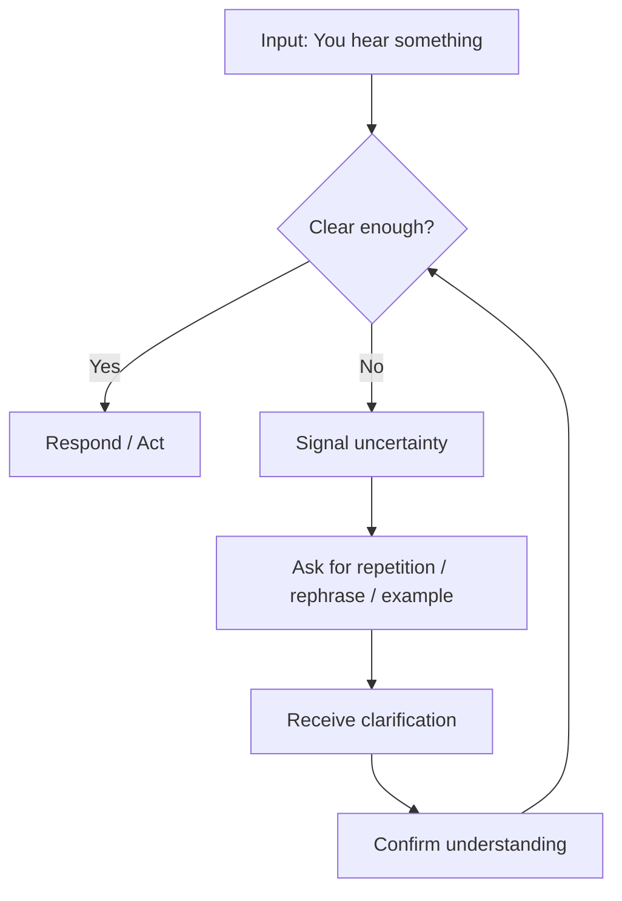
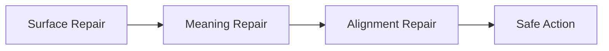

# Part 10 — Clarification and Repair: How to Survive Misunderstanding

> Tujuan part ini: membuat kamu tetap bisa bertahan dan produktif saat tidak paham, salah dengar, lupa kata, salah ucap, atau terjadi misunderstanding.

Misunderstanding bukan kegagalan.

Misunderstanding adalah bagian normal dari conversation.

Bahkan native speaker pun sering melakukan repair:

- “Sorry, what do you mean?”
- “Let me rephrase that.”
- “Actually, I meant...”
- “Just to clarify...”
- “So you’re saying...”

Masalah learner English bukan karena mereka tidak pernah salah paham. Masalahnya adalah mereka tidak punya repair strategy.

Akibatnya:

```text
Not understand → panic → silent → nodding → wrong assumption → bad execution
```

Dalam konteks software engineering, ini berbahaya. Salah paham kecil bisa berubah menjadi:

- salah implementasi requirement,
- salah prioritas bug,
- salah interpretasi architecture decision,
- salah action item,
- production risk,
- wasted sprint,
- broken trust.

Part ini membangun kemampuan untuk **recover**.

---

## 1. Positioning dalam Framework Kaufman

Dalam *The First 20 Hours*, salah satu prinsip penting adalah belajar secukupnya untuk bisa self-correct.

Clarification and repair adalah self-correction dalam conversation.

Target performa part ini:

> Kamu mampu mendeteksi ketika pemahamanmu tidak cukup jelas, lalu menggunakan phrase dan strategy untuk memperbaiki conversation sebelum kesalahan menyebar.

Skill ini dideconstruct menjadi:

1. mendeteksi uncertainty,
2. meminta repetition,
3. meminta rephrasing,
4. meminta contoh,
5. mengonfirmasi pemahaman,
6. menyummary kembali,
7. memperbaiki ucapan sendiri,
8. recovery saat blank,
9. mengklarifikasi action item,
10. menutup loop dengan next step.

Dalam 20 jam pertama, skill ini wajib diprioritaskan karena membuat kamu berani berbicara meskipun belum sempurna.

Tanpa repair skill, kamu akan menunggu sampai English sempurna.

Dengan repair skill, kamu bisa mulai sekarang.

---

## 2. Mental Model: Conversation Repair Loop

Conversation bukan jalur lurus. Conversation adalah loop.



Tujuannya bukan memahami 100% setiap kata. Tujuannya memahami cukup untuk merespons atau mengambil tindakan dengan aman.

Dalam engineering, definisi “clear enough” tergantung risiko.

Untuk small talk:

```text
70% understanding may be enough.
```

Untuk production incident:

```text
95% understanding may still not be enough if the action is risky.
```

Jadi kamu perlu menyesuaikan level clarification dengan konteks.

---

## 3. Types of Misunderstanding

Tidak semua misunderstanding sama. Kalau kamu tahu tipenya, kamu bisa memilih repair strategy yang tepat.

| Type | Problem | Example Repair |
|---|---|---|
| Acoustic | tidak jelas mendengar bunyi | `Sorry, could you say that again?` |
| Speed | lawan bicara terlalu cepat | `Could you say that a bit slower?` |
| Vocabulary | tidak tahu kata tertentu | `What does "idempotent" mean in this context?` |
| Reference | tidak tahu yang dimaksud | `Which service are you referring to?` |
| Scope | batasan tidak jelas | `Is this for all users or only beta users?` |
| Intent | maksud tidak jelas | `Are you suggesting we roll back?` |
| Action | next step tidak jelas | `What should I do next?` |
| Ownership | siapa melakukan apa tidak jelas | `Who owns this action item?` |
| Timing | kapan dilakukan tidak jelas | `When do we need this by?` |
| Agreement | keputusan tidak jelas | `Are we aligned on option B?` |

Misunderstanding yang tidak diklarifikasi biasanya berubah menjadi assumption.

Assumption yang salah biasanya mahal.

---

## 4. The Three Levels of Repair

Repair bisa dibagi menjadi tiga level.

### Level 1 — Surface Repair

Digunakan ketika kamu tidak mendengar atau tidak menangkap kata.

```text
Sorry, could you repeat that?
Could you say that again?
I missed the last part.
```

### Level 2 — Meaning Repair

Digunakan ketika kamu mendengar kata-katanya, tapi belum paham maknanya.

```text
What do you mean by that?
Could you clarify what you mean?
Can you give an example?
```

### Level 3 — Alignment Repair

Digunakan ketika kamu perlu memastikan action, decision, atau implication.

```text
So, are we saying that we should delay the release?
Just to confirm, I will update the API contract and you will handle the migration, right?
Let me summarize the decision before we move on.
```



Semakin tinggi risiko, semakin penting alignment repair.

---

## 5. Asking for Repetition

Use when you did not hear clearly.

Basic phrases:

```text
Sorry, could you repeat that?
Could you say that again?
Sorry, I didn't catch that.
I missed that. Could you repeat it?
```

More natural variations:

```text
Sorry, I missed the last part.
Could you repeat the part about the migration?
I didn't catch the name of the service. Which one was it?
```

Avoid overusing:

```text
What?
```

`What?` can sound abrupt depending on tone.

Better:

```text
Sorry, what was that?
```

or:

```text
Sorry, could you say that again?
```

---

## 6. Asking Someone to Slow Down

This is useful with fast speakers, native speakers, or high-pressure meetings.

Phrases:

```text
Could you say that a bit slower?
Could you slow down a little?
Sorry, I'm still processing that. Could you repeat it more slowly?
Could we go through that step by step?
```

Professional version:

```text
Could we go through that step by step? I want to make sure I understand the sequence correctly.
```

This sounds mature because you frame it around accuracy, not weakness.

---

## 7. Asking for Rephrasing

Use when repetition does not help.

If someone repeats the same sentence and you still do not understand, ask for rephrasing.

Phrases:

```text
Could you rephrase that?
Could you explain it another way?
Can you put it differently?
Could you simplify that a bit?
```

Technical version:

```text
Could you explain that in terms of the request flow?
Could you explain that from the user's perspective?
Could you explain what happens step by step?
```

Example:

```text
A: The consumer offset is drifting because the downstream dependency introduces backpressure.
B: Could you explain that step by step? I want to understand where the delay comes from.
```

You do not pretend to understand. You ask for a better representation.

---

## 8. Asking for Examples

Examples reduce abstraction.

Phrases:

```text
Can you give an example?
Could you show me an example?
What would that look like in practice?
Can you walk me through a concrete case?
```

Engineering examples:

```text
Can you give an example payload?
Can you show me an example request?
What would the failure look like in logs?
Can you walk me through one user journey?
```

Example:

```text
A: We need to make the validation more flexible.
B: Can you give an example of an input that should be accepted but currently fails?
```

This turns vague requirement into testable behavior.

---

## 9. Asking for Definition

Use when a word is unfamiliar or used ambiguously.

Phrases:

```text
What does that mean?
What does that mean in this context?
How are we defining that here?
When you say "stable", what do you mean exactly?
```

Engineering examples:

```text
What does "done" mean for this ticket?
What does "slow" mean here? Are we talking about p95 latency?
What does "ready" mean for the release?
What does "backward compatible" mean in this case?
```

Many technical words are context-sensitive.

`Stable` can mean:

- no crash,
- low latency variance,
- no API changes,
- enough test coverage,
- no critical bugs,
- ready for production.

Always clarify context-sensitive terms.

---

## 10. Confirming Understanding

Confirmation is the core repair move.

Phrases:

```text
So, you mean...?
Just to confirm, ...?
Let me make sure I understood.
If I understand correctly, ...
Am I right that...?
```

Examples:

```text
So, you mean the bug happens only when the user retries payment?
Just to confirm, we are not changing the public API, right?
Let me make sure I understood: the frontend sends the old field, but the backend now expects the new one.
If I understand correctly, we need to support both payload formats for two weeks.
Am I right that we should disable the feature flag first?
```

Confirmation is especially important before:

- implementing,
- deploying,
- rolling back,
- escalating,
- sending stakeholder updates,
- agreeing to a deadline,
- changing architecture.

---

## 11. Summary Back Technique

Summary back means repeating the key points in your own words.

Pattern:

```text
Let me summarize to make sure I got it.
```

Then:

```text
1. The issue started after yesterday's deployment.
2. It affects only Android users.
3. The suspected cause is the new payment retry logic.
4. The next step is to disable the feature flag and monitor recovery.
```

This is extremely powerful in professional English.

It shows:

- you listened,
- you understood structure,
- you can reduce ambiguity,
- you are reliable.

Example:

```text
Let me summarize to make sure I got it. The login issue started after the token validation change. It affects users with expired sessions, but not new logins. The next step is to add a compatibility check and release a hotfix. Is that correct?
```

This single move can prevent many mistakes.

---

## 12. Repairing Your Own Speech

Sometimes you make a mistake while speaking.

Do not panic. Repair yourself.

Phrases:

```text
Sorry, let me rephrase that.
What I mean is...
Actually, that's not what I meant.
Let me say that differently.
I mean...
```

Examples:

```text
The bug is from database—sorry, let me rephrase that. The issue seems related to the database migration.
```

```text
We should delete the data—actually, that's not what I meant. We should remove the stale cache entry.
```

```text
This is not good. Let me say that differently: this approach might be risky because we don't have a rollback plan yet.
```

Self-repair makes you sound more fluent, not less.

Fluent speakers repair constantly.

---

## 13. Recovery When You Blank Out

Blanking out is common.

The wrong response is panic silence.

Better: buy thinking time.

Phrases:

```text
Let me think for a second.
That's a good question.
I'm trying to find the right word.
Give me a moment to phrase this clearly.
```

Then simplify.

Example:

```text
Let me think for a second. I don't remember the exact term, but I mean the part that sends the request again after it fails.
```

The other person may say:

```text
You mean retry logic?
```

Then you can continue:

```text
Yes, exactly. The retry logic might be causing duplicate requests.
```

This is repair through collaboration.

---

## 14. Repair When You Forget a Word

Use description instead of translation.

Pattern:

```text
I don't remember the exact word, but...
```

Examples:

```text
I don't remember the exact word, but it's the process where we move data from the old table to the new one.
```

Likely word: migration.

```text
I don't remember the exact term, but it's when the same request can be safely processed more than once.
```

Likely word: idempotency.

```text
I don't remember the exact word, but it's the delay between sending a request and getting a response.
```

Likely word: latency.

This keeps conversation moving.

---

## 15. Repair When You Mispronounce Something

If pronunciation causes confusion, use spelling, description, or reference.

Phrases:

```text
Let me spell that.
I mean the service called...
I'm referring to the endpoint...
I mean the config key...
```

Examples:

```text
I mean cache, C-A-C-H-E, not cash.
```

```text
I'm referring to the `/payments/retry` endpoint.
```

```text
I mean the `user_session_timeout` config key.
```

In engineering, writing the term in chat can also help:

```text
I'll type it in the chat.
```

---

## 16. Repair When You Mishear a Number, Date, or Name

Numbers, dates, and names are high-risk.

Always confirm.

Phrases:

```text
Did you say fifteen or fifty?
Was that June 15 or July 15?
Could you spell the name?
Which ticket number was that?
Did you say 10 milliseconds or 10 seconds?
```

Engineering examples:

```text
Did you say p95 latency is 200 milliseconds or 2 seconds?
```

```text
Was the deployment at 9 AM UTC or 9 AM local time?
```

```text
Could you repeat the incident ID?
```

Never guess numbers in professional contexts.

---

## 17. Repairing Action Items

Misunderstood action items create execution failure.

Always clarify:

```text
Who will do what by when?
```

Phrases:

```text
Just to confirm, what are the action items?
Who owns this?
What should I take from this?
When do we need this done?
Should I update the ticket after this meeting?
```

Example:

```text
Just to confirm the action items: I will update the API contract, Maya will review the migration plan, and we will decide on rollout tomorrow. Is that right?
```

This is alignment repair.

---

## 18. Repairing Decisions

Sometimes people discuss for 30 minutes but decision remains unclear.

Use decision repair.

Phrases:

```text
What did we decide?
Are we aligned on option A?
Is the decision final, or do we need more input?
Should we document this in the design doc?
Can I summarize the decision?
```

Example:

```text
Before we close, can I summarize the decision? We will keep the existing API for now, add the new field as optional, and revisit the breaking change next quarter. Is everyone aligned?
```

This makes you valuable in meetings.

---

## 19. Repairing Scope

Scope misunderstanding is common.

Phrases:

```text
Is this in scope for this sprint?
Is this part of the MVP?
Are we solving this now or later?
Does this apply to all users?
Is this only for internal users?
Are we changing the backend, frontend, or both?
```

Example:

```text
Just to clarify the scope, are we only updating the validation message, or are we changing the validation rule itself?
```

Small clarification. Big difference.

---

## 20. Repairing Technical Terms

Some technical terms are overloaded.

Examples:

- service,
- client,
- session,
- token,
- event,
- job,
- queue,
- worker,
- model,
- environment,
- production,
- release,
- deployment.

Clarify references:

```text
When you say client, do you mean the frontend app or the external customer?
```

```text
When you say model, do you mean the data model or the ML model?
```

```text
When you say production, do you mean live users or the production-like test environment?
```

This is not language weakness. This is engineering precision.

---

## 21. Repairing Intent

Sometimes the words are clear, but the intent is not.

Examples:

```text
Are you suggesting we roll back?
Are you asking me to investigate this now?
Do you want a quick fix or a proper redesign?
Are you raising this as a blocker or just a concern?
Is this a decision we need to make today?
```

Intent repair prevents hidden expectations.

Example:

```text
A: The error rate is still high.
B: Are you suggesting we roll back, or should we keep investigating for now?
```

Now the conversation moves toward action.

---

## 22. Repairing Politeness and Tone

Sometimes you say something too direct.

Repair immediately.

Example:

```text
This design is bad—sorry, let me rephrase that. I think this design has some risks we should discuss.
```

```text
You didn't test it—sorry, I mean do we have test coverage for this case?
```

```text
That's wrong—let me say that differently. I think there may be a mismatch between the requirement and the implementation.
```

This is important in global teams.

You do not need to be perfect. You need to be able to recover.

---

## 23. Repair in Meetings

Meeting repair phrases:

```text
Can I pause for a second and clarify something?
Before we move on, can I check my understanding?
I may have missed this, but what did we decide about the rollout?
Could we summarize the action items?
Can we define what "ready" means here?
```

Example:

```text
Before we move on, can I check my understanding? Are we saying that the backend work is done, but the frontend integration is still blocked?
```

This is polite and productive.

---

## 24. Repair in Debugging

Debugging repair phrases:

```text
Let me make sure I understand the failure.
So the request succeeds, but the status update fails, right?
Where exactly do we see the error?
Can you show me one example log line?
What have we ruled out so far?
```

Debugging conversation should avoid assumptions.

Bad:

```text
It must be the database.
```

Better:

```text
Do we have evidence that the database is the bottleneck?
```

---

## 25. Repair in Code Review

Code review repair phrases:

```text
Can you walk me through this part?
I may be missing something, but what happens if this value is null?
Do you mean this is temporary, or should this be the final design?
Let me rephrase my concern.
My concern is not the implementation style, but the edge case around retries.
```

When receiving feedback:

```text
Thanks. Just to clarify, are you suggesting I extract this method or change the flow entirely?
```

This prevents over-fixing.

---

## 26. Repair in Architecture Discussion

Architecture repair phrases:

```text
Let me clarify the assumption.
Are we assuming at-least-once delivery here?
When you say consistency, do you mean strong consistency or eventual consistency?
Can we walk through the failure mode?
What is the rollback path?
Let me summarize the trade-off.
```

Example:

```text
When you say the system should be consistent, do you mean users should never see stale data, or is a short delay acceptable?
```

This question can change the entire architecture.

---

## 27. Repair in Incident Communication

Incident communication must be explicit.

Phrases:

```text
Just to confirm the current status...
Is the incident still ongoing?
What is the customer impact?
What mitigation is active right now?
Who is the incident owner?
What is the next update time?
How do we verify recovery?
```

Example:

```text
Just to confirm the current status: checkout is still degraded, the feature flag has been disabled, and we are monitoring recovery. The next update will be in 15 minutes. Is that correct?
```

In incidents, repair is not optional.

---

## 28. The “I Think I Understand, But...” Pattern

This is useful when you partially understand.

Pattern:

```text
I think I understand the high-level idea, but I'm not clear on...
```

Examples:

```text
I think I understand the high-level idea, but I'm not clear on how the migration works.
```

```text
I think I understand the user flow, but I'm not clear on the edge case for expired sessions.
```

```text
I think I understand why we need this, but I'm not clear on the timeline.
```

This is more precise than saying:

```text
I don't understand.
```

It shows what part is clear and what part needs repair.

---

## 29. The “Let Me Check One Assumption” Pattern

This is useful in senior-level discussions.

Pattern:

```text
Let me check one assumption: ...
```

Examples:

```text
Let me check one assumption: are we assuming that all clients will upgrade within two weeks?
```

```text
Let me check one assumption: do we expect the downstream service to be available during the migration?
```

```text
Let me check one assumption: are we treating duplicate events as acceptable?
```

This phrase is powerful because it makes challenge sound collaborative.

---

## 30. The “Correct Me If I’m Wrong” Pattern

Use this when you summarize uncertainly.

Pattern:

```text
Correct me if I'm wrong, but...
```

Examples:

```text
Correct me if I'm wrong, but the main risk is not the schema change itself. It's the old clients that may still send the old payload.
```

```text
Correct me if I'm wrong, but we are choosing option B because it has lower operational risk, even though it takes longer.
```

Do not overuse this phrase. Use it when uncertainty is real.

---

## 31. The “What I Heard Is...” Pattern

This is useful for summarizing stakeholder statements.

Pattern:

```text
What I heard is...
```

Examples:

```text
What I heard is that the business priority is to reduce checkout failure, not necessarily to redesign the whole payment flow.
```

```text
What I heard is that the deadline is flexible, but the rollback plan must be ready before launch.
```

This helps align technical work with actual stakeholder intent.

---

## 32. Repair Phrasebank

### 32.1 Repetition

```text
Sorry, could you repeat that?
Could you say that again?
I missed the last part.
I didn't catch the name of the service.
```

### 32.2 Slowing Down

```text
Could you say that a bit slower?
Could we go through that step by step?
I'm still processing that. Could you repeat it more slowly?
```

### 32.3 Rephrasing

```text
Could you rephrase that?
Could you explain it another way?
Can you put it differently?
Could you simplify that a bit?
```

### 32.4 Examples

```text
Can you give an example?
Could you show me an example request?
What would that look like in practice?
Can you walk me through a concrete case?
```

### 32.5 Confirmation

```text
Just to confirm, ...
Let me make sure I understood.
If I understand correctly, ...
Am I right that...?
So, you mean...?
```

### 32.6 Self-Repair

```text
Sorry, let me rephrase that.
What I mean is...
Actually, that's not what I meant.
Let me say that differently.
```

### 32.7 Blank Recovery

```text
Let me think for a second.
I'm trying to find the right word.
Give me a moment to phrase this clearly.
I don't remember the exact term, but...
```

### 32.8 Action Alignment

```text
What are the action items?
Who owns this?
When do we need this done?
What should I do next?
Are we aligned on the next step?
```

---

## 33. Misunderstanding Simulation Drills

### Drill 1 — Repetition Drill

Practice saying these aloud until they feel automatic:

```text
Sorry, could you repeat that?
I missed the last part.
Could you say that a bit slower?
Could you repeat the part about the migration?
```

Goal: no hesitation.

### Drill 2 — Clarification Drill

For each vague statement, ask 3 clarification questions.

Statement:

```text
The API is slow.
```

Possible questions:

```text
What do you mean by slow?
How slow is it compared to normal?
Is this affecting all endpoints or only one endpoint?
```

Practice set:

```text
The system is unstable.
The requirement is unclear.
The design is risky.
The rollout is complicated.
The test is flaky.
The user flow is broken.
```

### Drill 3 — Summary Back Drill

Read this scenario and summarize it.

Scenario:

```text
The login issue started after the token validation change. It affects users with expired sessions. New logins work normally. The suggested fix is to add a compatibility check and release a hotfix today.
```

Summary:

```text
Let me summarize to make sure I got it. The issue started after the token validation change. It affects users with expired sessions, but new logins are fine. The next step is to add a compatibility check and release a hotfix today. Is that correct?
```

### Drill 4 — Self-Repair Drill

Start with a rough sentence. Repair it.

Rough:

```text
This code bad because maybe race.
```

Repair:

```text
Sorry, let me rephrase that. This code might be risky because it could introduce a race condition.
```

Practice rough sentences:

```text
Deployment not safe.
Database maybe problem.
This function too many things.
We need rollback before release.
User cannot pay after retry.
```

### Drill 5 — Blank Recovery Drill

Practice describing terms without naming them.

Describe:

```text
latency
migration
idempotency
rollback
feature flag
race condition
cache invalidation
schema change
```

Example:

```text
I don't remember the exact term, but it's the delay between sending a request and getting a response.
```

---

## 34. 60-Minute Practice Session

Use this as one hour of your 20-hour practice program.

### 0–10 Minutes — Phrase Warm-Up

Say these aloud:

```text
Sorry, could you repeat that?
Could you rephrase that?
Let me make sure I understood.
Just to confirm...
Sorry, let me rephrase that.
```

### 10–25 Minutes — Vague Statement Clarification

Take 10 vague technical statements and ask clarification questions.

### 25–40 Minutes — Summary Back Practice

Take 5 short scenarios and summarize them aloud.

### 40–50 Minutes — Self-Repair Practice

Speak deliberately imperfect sentences, then repair them.

### 50–60 Minutes — Reflection

Write:

```text
When did I tend to panic?
Which repair phrase felt most useful?
Which clarification questions helped most?
Did I confirm action items clearly?
Which vocabulary gaps appeared?
```

---

## 35. Self-Correction Checklist

After any real conversation, ask:

```text
Did I pretend to understand anything?
Did I ask for repetition when needed?
Did I ask for rephrasing when repetition was not enough?
Did I clarify vague words?
Did I confirm high-risk details?
Did I summarize decisions or action items?
Did I repair my own unclear speech?
Did I avoid panic silence?
Did I leave the conversation knowing the next step?
```

If you answer “no” to several items, that is not failure. That is data for the next practice loop.

---

## 36. Real-World Playbook

### Situation 1 — You Missed What Someone Said

```text
Sorry, I missed the last part. Could you repeat the part about the rollback?
```

### Situation 2 — You Heard the Words but Not the Meaning

```text
Could you clarify what you mean by "unstable" here?
```

### Situation 3 — You Need an Example

```text
Can you show me an example request that fails?
```

### Situation 4 — You Are Not Sure About the Decision

```text
Before we close, can I confirm the decision?
```

### Situation 5 — You Forgot a Word

```text
I don't remember the exact term, but I mean the process where we move data from the old table to the new one.
```

### Situation 6 — You Said Something Too Direct

```text
Sorry, let me rephrase that. My concern is that this approach may be risky without a rollback plan.
```

### Situation 7 — You Need to Confirm Ownership

```text
Just to confirm, who owns the migration task?
```

### Situation 8 — You Need to Confirm Timeline

```text
When do we need this completed?
```

---

## 37. Output Akhir Part Ini

Setelah menyelesaikan part ini, kamu harus memiliki:

1. **Repair phrasebank**
   - repetition,
   - rephrasing,
   - confirmation,
   - self-repair,
   - blank recovery.

2. **Misunderstanding recovery habit**
   - tidak panik saat tidak paham.

3. **Summary back technique**
   - mampu menyimpulkan ulang sebelum action.

4. **Action alignment skill**
   - mampu memastikan siapa melakukan apa dan kapan.

5. **Self-repair confidence**
   - mampu memperbaiki ucapan sendiri tanpa kehilangan percakapan.

---

## 38. Part Summary

Clarification and repair adalah safety mechanism dalam English conversation.

Kamu tidak perlu memahami semuanya secara sempurna. Kamu perlu tahu kapan pemahaman belum cukup aman, lalu memperbaikinya.

Prinsip utama:

```text
Do not pretend to understand.
Do not panic when you miss something.
Do not guess high-risk details.
Repair early, confirm clearly, summarize before action.
```

Untuk software engineer, repair skill adalah bagian dari professional reliability.

Orang yang mampu berkata:

```text
Let me make sure I understood.
```

sering lebih dipercaya daripada orang yang hanya mengangguk tetapi salah eksekusi.

Di part berikutnya, kita akan masuk ke skill menjelaskan ide dengan jelas: bagaimana menyusun context, problem, cause, impact, dan proposal dalam English tanpa rambling.
