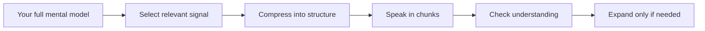
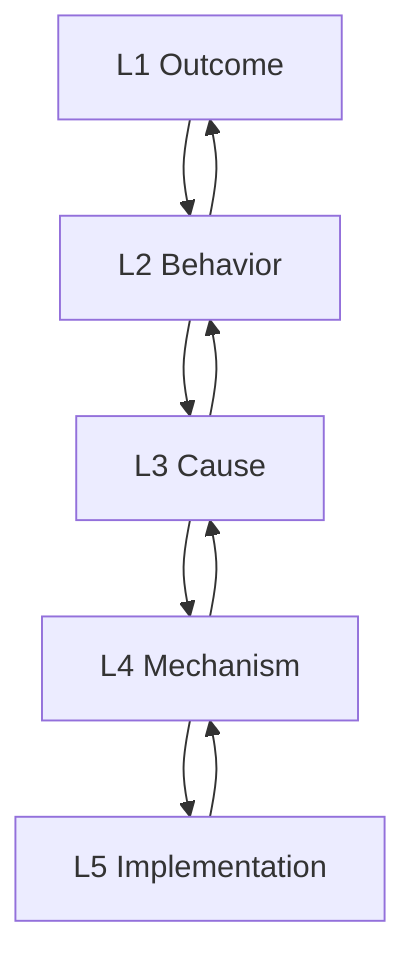

# Part 11 — Explaining Ideas Clearly

> Tujuan part ini: membuat kamu mampu menjelaskan ide, masalah, keputusan, dan konsep teknis dalam English dengan struktur yang jelas, ringkas, dan mudah diikuti.

Banyak orang merasa speaking mereka lemah karena vocabulary kurang.

Sering kali masalah sebenarnya bukan vocabulary. Masalahnya adalah **structure**.

Mereka tahu kata-katanya, tetapi tidak tahu urutan menyampaikannya.

Akibatnya explanation menjadi:

- terlalu panjang,
- melompat-lompat,
- terlalu banyak detail teknis,
- tidak jelas problem utamanya,
- tidak jelas action yang diminta,
- sulit diikuti oleh lawan bicara,
- terdengar kurang confident walaupun isi teknisnya benar.

Dalam percakapan engineering, kemampuan menjelaskan sangat penting karena hampir semua aktivitas senior engineer bergantung pada explanation:

- menjelaskan bug,
- menjelaskan design,
- menjelaskan trade-off,
- menjelaskan risk,
- menjelaskan incident,
- menjelaskan timeline,
- menjelaskan why something matters,
- menjelaskan technical concept ke non-technical stakeholder.

Part ini bukan tentang membuat English kamu “indah”.

Part ini tentang membuat English kamu **operationally clear**.

---

## 1. Positioning dalam Framework Kaufman

Dalam framework *The First 20 Hours*, kita tidak mencoba menguasai semua gaya presentasi atau public speaking terlebih dahulu.

Kita mulai dari target performa kecil dan praktis:

> Kamu bisa menjelaskan satu ide kerja dalam 30–90 detik dengan struktur: context, problem, cause, impact, proposal, and next step.

Skill ini dideconstruct menjadi beberapa sub-skill:

1. memilih point utama,
2. memberi context secukupnya,
3. menyatakan problem dengan jelas,
4. menjelaskan cause atau reasoning,
5. menjelaskan impact,
6. memberi proposal atau next step,
7. menggunakan signposting,
8. menyesuaikan detail dengan audience,
9. berhenti sebelum terlalu panjang,
10. mengecek apakah lawan bicara paham.

Dalam 20 jam pertama, kamu tidak perlu bisa menjelaskan semua topik secara spontan. Kamu perlu punya **explanation templates** yang bisa dipakai ulang.

---

## 2. Mental Model: Explanation Is Compression

Explanation bukan memindahkan semua isi kepala kamu ke orang lain.

Explanation adalah proses compression.

Kamu punya banyak detail internal:

- logs,
- assumptions,
- failed attempts,
- edge cases,
- trade-offs,
- historical context,
- emotional frustration,
- implementation detail,
- uncertainty.

Lawan bicara biasanya hanya butuh subset tertentu.



Good explanation bukan yang paling lengkap.

Good explanation adalah yang cukup akurat, cukup ringkas, dan cukup actionable untuk situasi tersebut.

Contoh buruk:

```text
So yesterday I was checking the logs, and then I found something strange in the retry logic, but before that I also noticed the old code was written differently, and maybe because of the previous migration, I'm not sure, but there is some timeout, and the service seems unstable.
```

Masalah:

- tidak jelas point utama,
- terlalu banyak chronology,
- tidak jelas impact,
- tidak jelas request.

Versi lebih baik:

```text
The main issue is that the payment service sometimes times out during retry. It seems related to the new timeout configuration after the migration. The impact is that some users may see duplicate pending transactions. I suggest we temporarily reduce the retry count and add better logging before the next release.
```

Ini bukan lebih fancy. Ini lebih structured.

---

## 3. The Core Explanation Template

Gunakan template ini sebagai default:

```text
Context → Problem → Cause → Impact → Proposal → Next Step
```

Dalam bentuk English:

```text
The context is...
The main problem is...
It seems to happen because...
The impact is...
I suggest...
The next step is...
```

Tidak semua explanation butuh enam bagian. Tetapi template ini memberi urutan berpikir.

| Component | Purpose | Example |
|---|---|---|
| Context | memberi background minimum | `This happens in the checkout flow.` |
| Problem | menyatakan issue utama | `The payment request sometimes times out.` |
| Cause | memberi reasoning/hypothesis | `It may be caused by the new retry logic.` |
| Impact | menjelaskan why it matters | `Users may see delayed confirmation.` |
| Proposal | menyarankan action | `I suggest we add logging first.` |
| Next Step | menutup dengan action jelas | `I'll prepare a patch today.` |

### Full Example

```text
This happens in the checkout flow after the user clicks Pay.
The main problem is that the payment request sometimes times out.
It seems to be related to the new retry logic we added last week.
The impact is that users may see delayed confirmation even though the payment is still being processed.
I suggest we add detailed logging first before changing the retry behavior.
I'll prepare a small patch today and share the logs after testing.
```

Struktur ini aman untuk:

- standup,
- debugging,
- incident update,
- manager update,
- design discussion,
- code review explanation.

---

## 4. Explanation Levels

Tidak semua audience butuh detail yang sama.

Salah satu kesalahan umum engineer adalah menjelaskan semua hal pada level implementation detail.

Gunakan level berikut.

| Level | Audience | Focus | Example |
|---|---|---|---|
| L1 — Outcome | manager, stakeholder | result and impact | `The release is delayed because of a payment issue.` |
| L2 — Behavior | product, QA, support | what happens | `Some users see timeout after clicking Pay.` |
| L3 — Cause | engineer | why it happens | `The retry logic keeps the request open too long.` |
| L4 — Mechanism | senior engineer | internal mechanics | `The timeout value conflicts with the upstream gateway SLA.` |
| L5 — Implementation | pair programming | code-level detail | `The retry policy wraps the client call without respecting context cancellation.` |

Good speaker bisa naik turun level.



### Example: Same Idea, Different Audience

#### To Product Manager

```text
The checkout issue may affect some users during payment. The main risk is delayed confirmation, not data loss. We're checking the retry behavior and should have a safer fix today.
```

#### To Backend Engineer

```text
The timeout seems to happen when the payment client retries after the gateway slows down. The retry policy does not stop early enough, so the user-facing request stays open longer than expected.
```

#### To Tech Lead

```text
The risk is not only timeout, but also unclear transaction state. We need to separate user-facing confirmation from backend reconciliation so the system can recover safely even if the gateway response is delayed.
```

The technical truth may be the same. The explanation must adapt.

---

## 5. Signposting: Make Your Structure Visible

Signposting adalah phrase yang memberi sinyal struktur ke listener.

Tanpa signposting, lawan bicara harus menebak apakah kamu sedang memberi context, problem, cause, atau conclusion.

Gunakan phrases ini.

### To Start

```text
Let me explain the issue briefly.
Let me give some context first.
Here's the short version.
There are two things to consider.
The main point is this.
```

### To Structure

```text
First, ...
Second, ...
The reason is ...
The impact is ...
The trade-off is ...
The risk is ...
The alternative is ...
```

### To Clarify Scope

```text
I'm focusing only on the backend behavior here.
This is about reliability, not performance.
This is not a user-facing bug yet.
This only affects the retry path.
```

### To Conclude

```text
So my recommendation is ...
The safest next step is ...
For now, I suggest ...
In short, ...
That's why I think we should ...
```

### To Check Understanding

```text
Does that make sense?
Is that clear so far?
Should I go deeper into the implementation detail?
Do you want the short version or the technical version?
```

Signposting membuat kamu terdengar lebih fluent karena listener bisa mengikuti struktur, bukan hanya kata.

---

## 6. The 30-Second Explanation Formula

Untuk conversation, kamu sering tidak punya waktu 5 menit.

Gunakan formula 30 detik:

```text
Point → Reason → Impact → Ask/Next Step
```

Template:

```text
The main point is [point].
This matters because [reason].
The impact is [impact].
I suggest [next step].
```

Example:

```text
The main point is that the current cache strategy is risky.
This matters because stale data can be shown after a user updates their profile.
The impact is user confusion and possible support tickets.
I suggest we either invalidate the cache on update or reduce the TTL for this endpoint.
```

### Use This When

- kamu memberi update di meeting,
- kamu menjawab pertanyaan cepat,
- kamu menjelaskan risk,
- kamu ingin membuat proposal singkat,
- kamu butuh bicara walaupun belum fully prepared.

---

## 7. The 90-Second Explanation Formula

Untuk topik yang sedikit kompleks, gunakan formula 90 detik:

```text
Context → Problem → Evidence → Cause/Hypothesis → Options → Recommendation
```

Template:

```text
For context, [background].
The problem is [problem].
We saw [evidence].
My current hypothesis is [cause].
We have two options: [option A] or [option B].
I recommend [recommendation] because [reason].
```

Example:

```text
For context, this service handles user profile updates and publishes an event after each update.
The problem is that some downstream services receive the event late.
We saw several delays in the logs, especially when the message broker is under load.
My current hypothesis is that our publisher does not retry consistently when the broker responds slowly.
We have two options: improve the retry policy or move publishing to an outbox pattern.
I recommend the outbox pattern because it gives us better reliability and makes recovery easier.
```

Ini cukup detail untuk technical discussion tetapi tidak menjadi monolog panjang.

---

## 8. Explaining Problems

Problem explanation harus menjawab tiga pertanyaan:

1. What is happening?
2. Where does it happen?
3. Why does it matter?

Template:

```text
The issue is that [unexpected behavior].
It happens when [condition/context].
This matters because [impact/risk].
```

Examples:

```text
The issue is that the login request sometimes fails with a timeout.
It happens when the identity provider responds slowly.
This matters because users may not be able to access the system during peak traffic.
```

```text
The issue is that the report shows inconsistent totals.
It happens when the user filters by multiple regions.
This matters because the finance team may make decisions based on incorrect data.
```

### Avoid This Pattern

```text
There is some issue in the backend.
```

Too vague.

Better:

```text
There is an issue in the billing endpoint. It returns a 500 error when the invoice has more than one discount rule.
```

Good problem explanation reduces search space.

---

## 9. Explaining Causes Without Overclaiming

In engineering, you often do not know the exact cause yet.

Do not pretend certainty.

Use calibrated language.

| Certainty | Phrase | Example |
|---|---|---|
| Low | `It might be...` | `It might be related to the cache.` |
| Medium | `It seems to be...` | `It seems to be caused by the retry logic.` |
| Medium-high | `The evidence points to...` | `The evidence points to a timeout in the payment client.` |
| High | `The root cause is...` | `The root cause is a missing index on the transaction table.` |

### Useful Phrases

```text
My current hypothesis is...
Based on the logs, it looks like...
The evidence points to...
I'm not fully sure yet, but...
We need more data before confirming the root cause.
```

### Weak vs Better

Weak:

```text
The database is the problem.
```

Better:

```text
The logs suggest the database query is the bottleneck, but we need to check the query plan before confirming it.
```

This sounds more senior because it separates observation, hypothesis, and conclusion.

---

## 10. Explaining Impact

Impact answers: “So what?”

Engineers often skip impact because the technical issue feels obvious to them.

But impact is what makes explanation useful.

Impact can be:

- user impact,
- business impact,
- operational impact,
- security impact,
- maintainability impact,
- delivery impact,
- team impact.

### Impact Phrasebank

```text
The user impact is...
The business impact is...
The operational risk is...
The main risk is...
This may delay...
This could increase...
This makes it harder to...
This creates a risk of...
```

### Examples

```text
The user impact is that some users may not receive confirmation immediately after payment.
```

```text
The operational risk is that support may not know whether the transaction succeeded or failed.
```

```text
This makes it harder to debug production issues because the logs do not include the correlation ID.
```

### Impact Ladder

Use this ladder to make impact more concrete.

```text
Code issue → system behavior → user effect → business/operational risk
```

Example:

```text
The missing timeout causes the request to wait too long.
That keeps the checkout page hanging.
Users may retry the payment.
That increases the risk of duplicate pending transactions and support tickets.
```

---

## 11. Explaining Proposals

Proposal explanation must include:

1. What you suggest.
2. Why it is better.
3. What trade-off exists.
4. What next step is needed.

Template:

```text
I suggest [proposal].
The reason is [reason].
The trade-off is [trade-off].
The next step is [next step].
```

Example:

```text
I suggest we add a short-term feature flag for this change.
The reason is that we can roll it back quickly if the behavior is unexpected.
The trade-off is a bit more configuration complexity.
The next step is to define the flag scope and test both paths before release.
```

### Proposal Verbs

```text
I suggest...
I recommend...
We could...
One option is...
A safer approach is...
My preference is...
I would avoid...
```

### Directness Ladder

| Strength | Phrase |
|---|---|
| Soft | `We could consider...` |
| Medium | `I suggest...` |
| Strong | `I recommend...` |
| Very strong | `I think we should...` |
| Risk warning | `I would avoid this because...` |

Use stronger language when risk is higher or when you own the decision.

---

## 12. Explaining Technical Concepts to Non-Technical People

Technical explanation to non-technical audience should not be dumbed down. It should be reframed.

Use this structure:

```text
Analogy → Meaning → Impact → Action
```

Example:

```text
Think of the cache like a temporary copy of data.
It helps the system respond faster, but sometimes the copy can become outdated.
In this case, users may see old profile information for a short time.
We can reduce this by clearing the cache when the profile is updated.
```

### Rules

1. Do not start with implementation detail.
2. Avoid unexplained acronyms.
3. Explain consequence, not just mechanism.
4. Use analogy only if it clarifies.
5. End with action or decision.

### Weak vs Better

Weak:

```text
The issue is caused by eventual consistency between services.
```

Better:

```text
The system updates data in more than one place, and those updates do not always appear at exactly the same time. For a short period, one part of the system may show older data. That is why users may see different values for a few seconds.
```

The second version is longer, but clearer.

---

## 13. Explaining Trade-Offs

Senior engineering conversation is full of trade-offs.

Common trade-off dimensions:

- speed vs safety,
- simplicity vs flexibility,
- performance vs maintainability,
- consistency vs availability,
- short-term fix vs long-term design,
- automation vs manual control,
- user experience vs implementation cost.

### Trade-Off Template

```text
Option A gives us [benefit], but it has [cost].
Option B gives us [benefit], but it has [cost].
Given [constraint], I recommend [option].
```

Example:

```text
Option A is to patch the current retry logic. It is faster, but it may not solve the reliability issue completely.
Option B is to introduce an outbox pattern. It takes longer, but it gives us better recovery and traceability.
Given the risk around payment state, I recommend Option B for the long-term fix and a small patch for the immediate release.
```

### Useful Phrases

```text
The trade-off is...
The upside is...
The downside is...
The risk with this option is...
The benefit of this approach is...
Given our constraint, I would choose...
```

---

## 14. Explaining Uncertainty

Uncertainty is normal. Poorly expressed uncertainty sounds weak. Well-expressed uncertainty sounds professional.

Weak:

```text
I don't know.
```

Better:

```text
I don't know the root cause yet, but I know the failure happens after the payment gateway call. I'll check the gateway response logs next.
```

Structure:

```text
What I know → What I don't know → What I will do next
```

Examples:

```text
What we know is that the error started after the deployment.
What we don't know yet is whether it is caused by the config change or the new code path.
I'll compare the logs before and after the deployment.
```

```text
I don't have enough data to confirm the root cause yet.
The next step is to add correlation IDs and reproduce the issue in staging.
```

This keeps conversation moving.

---

## 15. Avoiding Rambling

Rambling happens when you speak before deciding the structure.

Common causes:

- translating from Indonesian,
- trying to be complete,
- explaining chronology instead of conclusion,
- fear of silence,
- not knowing the audience,
- no signposting.

### Anti-Rambling Rule

Before speaking, silently choose one of these:

```text
Problem explanation
Proposal explanation
Status update
Trade-off explanation
Decision request
```

Then use the matching template.

### Use Pauses

```text
Let me think for a second.
The main point is...
```

A short pause is better than a long unclear sentence.

### Stop Marker

Use a stop marker when you finish.

```text
That's the main issue.
That's my recommendation.
That's the short version.
I can go deeper if needed.
```

This prevents accidental over-explaining.

---

## 16. Good vs Weak Explanation Patterns

### Pattern 1: Starting with Details

Weak:

```text
So in the code, there is this function, and it calls another function, and then maybe the object is null...
```

Better:

```text
The main issue is a null value in the request payload. It causes the validation step to fail before the order is created.
```

### Pattern 2: No Impact

Weak:

```text
The correlation ID is missing.
```

Better:

```text
The correlation ID is missing, so we cannot trace a failed request across services. That makes production debugging much slower.
```

### Pattern 3: Unclear Proposal

Weak:

```text
Maybe we can improve it.
```

Better:

```text
I suggest we add a timeout and fallback path. That should prevent the request from hanging when the downstream service is slow.
```

### Pattern 4: Too Much Certainty

Weak:

```text
This is definitely caused by the database.
```

Better:

```text
The slow query logs suggest the database is a likely bottleneck, but I want to confirm it with the query plan.
```

---

## 17. Engineering Explanation Phrasebank

### Explaining Context

```text
For context, this service handles...
This happens when...
This flow starts with...
The relevant part is...
This only affects...
```

### Explaining Problem

```text
The main issue is...
The unexpected behavior is...
The failure happens when...
The system currently...
The user sees...
```

### Explaining Cause

```text
It seems to be caused by...
My current hypothesis is...
Based on the logs...
The evidence points to...
This may be related to...
```

### Explaining Impact

```text
The impact is...
The user impact is...
The operational risk is...
This could cause...
This makes it harder to...
```

### Explaining Proposal

```text
I suggest...
I recommend...
A safer approach is...
One option is...
The next step is...
```

### Explaining Trade-Off

```text
The trade-off is...
The benefit is...
The downside is...
Compared to the other option...
Given the constraint...
```

### Asking for Understanding

```text
Does that make sense?
Is that clear so far?
Should I explain the technical detail?
Do you want the short version or the detailed version?
```

---

## 18. Drill 1 — One Idea, Three Levels

Choose one technical topic:

- cache invalidation,
- retry logic,
- database index,
- message queue,
- feature flag,
- rate limiting,
- transaction consistency,
- API timeout.

Explain it at three levels.

### Level 1 — Non-Technical

```text
[Simple analogy]
[Why it matters]
[What we should do]
```

### Level 2 — Engineer

```text
[Behavior]
[Cause]
[Risk]
[Fix]
```

### Level 3 — Senior Engineer

```text
[System constraint]
[Trade-off]
[Failure mode]
[Recommended design]
```

Example topic: feature flag.

```text
Non-technical:
A feature flag is like a switch. It lets us turn a feature on or off without deploying new code. This reduces release risk because we can disable the feature quickly if something goes wrong.
```

```text
Engineer:
A feature flag lets us control a code path at runtime. The benefit is safer rollout. The risk is that flags add configuration complexity, so we need cleanup after the release.
```

```text
Senior engineer:
A feature flag reduces deployment risk by decoupling release from exposure. The trade-off is operational complexity and possible divergent behavior across environments. We should define ownership, default behavior, and removal criteria before adding it.
```

---

## 19. Drill 2 — 30-Second Work Explanation

Use this prompt:

```text
Explain what you worked on today in 30 seconds.
```

Structure:

```text
Today I worked on [task].
The main issue was [problem].
I found that [cause/evidence].
The next step is [next action].
```

Example:

```text
Today I worked on the login timeout issue.
The main problem was that some requests waited too long when the identity provider was slow.
I found that our client timeout was higher than expected.
The next step is to lower the timeout and add better error handling.
```

Repeat with 5 different work topics.

---

## 20. Drill 3 — Problem to Proposal

Take a problem and convert it into a proposal.

Template:

```text
Problem: [problem]
Impact: [impact]
Proposal: [proposal]
Reason: [reason]
Next step: [next step]
```

Example:

```text
Problem: The API returns inconsistent error messages.
Impact: Frontend needs custom handling for each case.
Proposal: We should standardize the error response format.
Reason: It will make frontend handling simpler and improve debugging.
Next step: I'll draft a small error schema and share it for review.
```

Say it aloud.

Then make it shorter.

Then make it more formal.

Then make it more conversational.

---

## 21. Drill 4 — Explain with Constraint

Pick one topic and explain it with different constraints.

### Constraint A: 15 seconds

```text
The issue is [problem]. It affects [impact]. I suggest [action].
```

### Constraint B: 60 seconds

```text
For context, ...
The problem is ...
The impact is ...
I suggest ...
```

### Constraint C: non-technical audience

```text
In simple terms, ...
This means ...
The risk is ...
What we can do is ...
```

### Constraint D: senior engineer

```text
The core trade-off is ...
The failure mode is ...
The safer option is ...
```

This trains flexibility.

---

## 22. Self-Correction Checklist

After recording yourself, check:

| Question | Yes/No |
|---|---|
| Did I state the main point early? |  |
| Did I give enough context, but not too much? |  |
| Did I explain impact? |  |
| Did I separate fact from hypothesis? |  |
| Did I use signposting? |  |
| Did I end with proposal or next step? |  |
| Did I avoid unnecessary chronology? |  |
| Did I check understanding? |  |

Do not fix everything at once.

For one practice session, focus on only one improvement:

- clearer main point,
- shorter sentences,
- better impact explanation,
- stronger conclusion,
- fewer fillers.

---

## 23. 20-Hour Practice Allocation for This Skill

From the total 20-hour program, allocate around **90 minutes** to explanation skill.

Suggested breakdown:

| Time | Activity |
|---|---|
| 15 min | read templates aloud |
| 15 min | explain 5 work topics in 30 seconds |
| 20 min | one topic, three audience levels |
| 20 min | problem-to-proposal drill |
| 10 min | record and listen |
| 10 min | self-correction notes |

Repeat this twice across two different days if explanation is your main bottleneck.

---

## 24. Practice Scenarios

Use these scenarios for roleplay.

### Scenario 1 — Bug Explanation

```text
You found a bug in the notification service. Explain the issue, impact, and next step to your team lead.
```

### Scenario 2 — Technical Concept

```text
Explain rate limiting to a product manager who wants to understand why some requests are rejected.
```

### Scenario 3 — Trade-Off

```text
Explain whether the team should implement a quick patch or a long-term redesign.
```

### Scenario 4 — Incident Update

```text
Explain the current status of a production issue when the root cause is not confirmed yet.
```

### Scenario 5 — Design Proposal

```text
Explain why you recommend using a message queue between two services.
```

---

## 25. Final Output for This Part

By the end of this part, you should have:

1. 5 recorded 30-second explanations.
2. 3 recorded 90-second explanations.
3. 1 explanation at three audience levels.
4. A personal explanation phrasebank.
5. A self-correction checklist.
6. A default template for problem, proposal, trade-off, and uncertainty.

---

## 26. Summary

Clear explanation is not about speaking more English.

It is about structuring thought before speaking.

The core system:

```text
Context → Problem → Cause → Impact → Proposal → Next Step
```

For shorter explanations:

```text
Point → Reason → Impact → Next Step
```

For uncertainty:

```text
What I know → What I don't know → What I will do next
```

For trade-offs:

```text
Option A → Option B → Constraint → Recommendation
```

The goal is not perfect speech. The goal is reliable communication.

In engineering conversation, a clear imperfect sentence is better than a perfect but late sentence.
