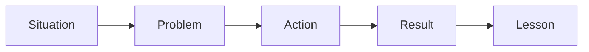

# Part 12 — Storytelling for Conversation

> Tujuan part ini: membuat kamu mampu menceritakan pengalaman, kejadian kerja, debugging journey, project history, dan lesson learned dalam English dengan natural, jelas, dan relevan.

Conversation bukan hanya bertanya dan menjelaskan.

Conversation juga membutuhkan cerita.

Kamu memakai storytelling ketika:

- memperkenalkan diri,
- menjawab “How was your weekend?”,
- menjelaskan pengalaman kerja,
- menceritakan bug yang pernah kamu tangani,
- menjelaskan kenapa sebuah keputusan dibuat,
- menjawab interview behavioral question,
- sharing lesson learned di retrospective,
- membangun trust dengan teammate,
- memberi context sebelum technical discussion.

Tanpa storytelling, English kamu bisa terasa terlalu kaku:

```text
I fixed bug. It was hard. Now it works.
```

Dengan storytelling, kamu bisa menyampaikan context, reasoning, dan impact:

```text
Last week, we had a tricky issue in the payment flow. At first, it looked like a frontend bug because users saw a timeout after clicking Pay. But after checking the logs, we found that the backend retry logic kept the request open too long. I updated the timeout handling and added better logging, so now the team can diagnose similar issues faster.
```

Cerita membuat conversation hidup.

Untuk software engineer, cerita juga membuat pengalaman teknis terlihat nyata.

---

## 1. Positioning dalam Framework Kaufman

Dalam *The First 20 Hours*, kita tidak belajar storytelling sebagai seni bebas tanpa batas. Kita deconstruct skill menjadi pola kecil yang bisa dilatih.

Target performa part ini:

> Kamu bisa menceritakan pengalaman kerja atau personal dalam 60–120 detik dengan struktur jelas: situation, problem, action, result, lesson.

Sub-skill storytelling:

1. memilih cerita yang relevan,
2. memberi setting singkat,
3. menjelaskan problem,
4. menjelaskan action,
5. menyebut result,
6. menyampaikan lesson,
7. menggunakan past tense cukup akurat,
8. menjaga cerita tetap singkat,
9. membuat transisi antar bagian,
10. menjawab follow-up questions.

Dalam 20 jam pertama, kamu tidak perlu menjadi storyteller hebat. Kamu perlu punya **10 reusable stories** yang bisa dipakai di conversation kerja dan interview.

---

## 2. Mental Model: Story Is Context Over Time

Explanation biasanya menjawab:

```text
What is the idea?
```

Story menjawab:

```text
What happened, how did it change, and what did we learn?
```

Story punya time dimension.



Dalam distributed systems, kamu sering berpikir dalam event sequence. Storytelling mirip event trace manusia.

```text
Initial state → Trigger → Failure/Challenge → Investigation → Intervention → Outcome → Learning
```

Contoh engineering:

```text
Initial state: service was stable
Trigger: new deployment
Failure: timeout increased
Investigation: checked logs and metrics
Intervention: changed retry policy
Outcome: latency returned to normal
Learning: retry needs timeout budget
```

Story yang baik membuat listener bisa mengikuti perubahan state.

---

## 3. The Core Story Template: SPARL

Gunakan template SPARL:

```text
Situation → Problem → Action → Result → Lesson
```

| Component | Purpose | Example |
|---|---|---|
| Situation | background singkat | `Last quarter, our team migrated the billing service.` |
| Problem | challenge utama | `The main challenge was keeping transaction data consistent.` |
| Action | apa yang kamu lakukan | `I designed an outbox-based event publishing flow.` |
| Result | outcome | `It reduced reconciliation errors and made retries safer.` |
| Lesson | insight | `I learned that reliability needs to be designed around failure, not just success paths.` |

### Full Example

```text
Last quarter, our team migrated the billing service from a monolith to a separate service.
The main challenge was keeping transaction data consistent while other teams were still reading from the old database.
I helped design an outbox-based event publishing flow so every billing update could be published reliably after the database transaction.
As a result, we reduced reconciliation errors and made failure recovery easier.
I learned that in distributed systems, reliability depends on designing around partial failure, not just the happy path.
```

This structure is reusable for many situations.

---

## 4. SPARL vs STAR

For interviews, many people know STAR:

```text
Situation → Task → Action → Result
```

STAR is useful, but for conversation we add **Lesson**.

Why?

Because lesson shows reflection.

| Framework | Best For | Weakness |
|---|---|---|
| STAR | behavioral interview | may sound formal and mechanical |
| SPARL | conversation + interview | includes learning and reflection |
| CAR | challenge-action-result | fast and simple |
| PAR | problem-action-result | good for short answers |

Use STAR when interviewer expects structured answer.

Use SPARL for natural conversation.

Use PAR for short meeting context.

---

## 5. Story Lengths

You need three versions of each story.

### 15-Second Version

```text
I once worked on a payment timeout issue. We found that the retry logic kept requests open too long, so I adjusted the timeout and added better logging. It taught me to always design retries with a clear timeout budget.
```

Use for small talk or quick context.

### 60-Second Version

```text
Last year, I worked on a payment timeout issue after a release. At first, it looked like a frontend problem because users saw a timeout after clicking Pay. But after checking the backend logs, we found that the retry logic kept the request open too long when the payment gateway was slow. I updated the timeout handling and added better logging so we could trace the gateway response more clearly. The issue became easier to diagnose, and we reduced user-facing timeout cases. The main lesson for me was that retries need a clear timeout budget, otherwise they can make user experience worse instead of better.
```

Use for meetings, interview, and technical sharing.

### 2-Minute Version

Use when someone asks follow-up or when the context is important.

Structure:

```text
Background → Trigger → Investigation → Decision → Result → Lesson
```

Do not start with the 2-minute version unless asked.

---

## 6. Story Inventory for Software Engineers

Prepare 10 stories.

These are reusable across conversation, interview, and meetings.

| Story Type | Prompt | Useful For |
|---|---|---|
| Bug story | `Tell me about a tricky bug you fixed.` | interview, team sharing |
| Incident story | `Tell me about a production issue.` | reliability discussion |
| Design story | `Tell me about an architecture decision.` | senior interview, design review |
| Conflict story | `Tell me about a disagreement.` | behavioral interview |
| Learning story | `Tell me about something you learned.` | social/work conversation |
| Failure story | `Tell me about a mistake.` | interview, trust building |
| Leadership story | `Tell me about mentoring or leading.` | tech lead conversation |
| Collaboration story | `Tell me about working with another team.` | cross-functional work |
| Performance story | `Tell me about improving performance.` | technical credibility |
| Migration story | `Tell me about changing a system safely.` | architecture conversation |

You do not need 100 stories. Ten strong stories can cover many prompts.

---

## 7. How to Choose a Good Story

A good conversation story has:

1. clear context,
2. one main problem,
3. your action,
4. concrete result,
5. transferable lesson.

Avoid stories that are:

- too complex,
- too confidential,
- too negative,
- too long,
- too dependent on company-specific context,
- mostly blaming others,
- impossible to explain without deep background.

### Good Story Candidate

```text
A bug was hard to reproduce, but you found it by improving logging and narrowing the failure condition.
```

Why good:

- clear problem,
- shows debugging process,
- shows methodical thinking,
- easy to explain.

### Weak Story Candidate

```text
A huge architecture migration with five teams, many dependencies, and political conflict.
```

Could be useful, but too complex for early practice.

Start with compact stories.

---

## 8. Tense Control for Storytelling

Storytelling mainly uses past tense.

You do not need perfect tense mastery, but you need enough control to avoid confusing time.

### Basic Timeline

```text
Past background → Past event → Present lesson
```

Example:

```text
I worked on a checkout issue last year.
The problem started after we changed the retry logic.
I investigated the logs and found the timeout mismatch.
Now I always check timeout budgets when designing retries.
```

### Useful Verb Patterns

| Meaning | Pattern | Example |
|---|---|---|
| past action | `I worked on...` | `I worked on a migration project.` |
| past problem | `We had...` | `We had a timeout issue.` |
| discovery | `I found that...` | `I found that the config was wrong.` |
| action | `I changed...` | `I changed the retry policy.` |
| result | `It improved...` | `It improved response time.` |
| lesson | `I learned that...` | `I learned that logs need context.` |

### Common Mistake

Weak:

```text
Yesterday I fix the bug and then I check logs.
```

Better:

```text
Yesterday I fixed the bug and then I checked the logs.
```

For early conversation, one simple rule helps:

> When telling a past story, most action verbs should be past tense.

Do not freeze trying to be perfect. Keep the story moving.

---

## 9. Transition Phrases for Storytelling

Transitions make story easier to follow.

### Starting

```text
A good example is...
I had a similar situation before.
This reminds me of a project I worked on.
One time, we had an issue where...
```

### Setting Context

```text
At that time, we were...
The system was responsible for...
The team was trying to...
The goal was to...
```

### Introducing Problem

```text
The challenge was...
The problem started when...
The tricky part was...
At first, it looked like...
```

### Describing Action

```text
So I started by...
Then I checked...
After that, we decided to...
I worked with...
```

### Showing Result

```text
As a result,...
In the end,...
That helped us...
The issue was resolved after...
```

### Sharing Lesson

```text
What I learned was...
The main lesson for me was...
Since then, I usually...
That experience taught me...
```

---

## 10. Debugging Story Template

Debugging stories are highly useful for software engineers.

Template:

```text
We saw [symptom].
At first, we thought [initial hypothesis].
I checked [evidence].
Then I found [root cause or better hypothesis].
I fixed it by [action].
The result was [outcome].
The lesson was [lesson].
```

Example:

```text
We saw random timeout errors in the checkout service.
At first, we thought it was a frontend issue because users reported the error after clicking Pay.
I checked the backend logs and noticed that the timeout happened after the payment gateway call.
Then I found that our retry policy waited longer than the user-facing request timeout.
I fixed it by aligning the timeout budget and adding clearer logging around the gateway response.
The result was fewer user-facing timeout errors and faster debugging when the gateway was slow.
The lesson was that retries need to be designed with the full request lifecycle in mind.
```

### Why This Works

It shows:

- you can investigate systematically,
- you do not jump to conclusions,
- you use evidence,
- you understand failure mode,
- you learn from the issue.

---

## 11. Incident Story Template

Incident stories need careful language. Do not sound like you are blaming people.

Template:

```text
We had an incident where [impact].
The immediate priority was [containment].
I helped by [action].
After the system was stable, we found that [root cause].
We improved [preventive action].
The main lesson was [lesson].
```

Example:

```text
We had an incident where some users could not complete checkout for about 20 minutes.
The immediate priority was to reduce user impact, so we rolled back the last deployment and monitored the error rate.
I helped by checking the logs and comparing the behavior before and after the deployment.
After the system was stable, we found that a new validation rule rejected a valid edge case.
We improved our test coverage and added a canary check for that flow.
The main lesson was that even small validation changes need realistic production-like test cases.
```

### Avoid Blame Language

Weak:

```text
The QA team missed the bug.
```

Better:

```text
The edge case was not covered in our test scenarios.
```

Weak:

```text
Someone deployed bad code.
```

Better:

```text
The deployment introduced a validation behavior we did not expect.
```

Senior communication focuses on system learning, not blame.

---

## 12. Architecture Decision Story Template

Architecture stories should highlight constraints and trade-offs.

Template:

```text
We needed to [goal].
The main constraint was [constraint].
We considered [option A] and [option B].
I recommended [choice] because [reason].
The trade-off was [cost].
The result was [outcome].
```

Example:

```text
We needed to improve reliability in the order processing flow.
The main constraint was that payments could succeed even if our internal service timed out.
We considered a direct synchronous call and an asynchronous event-based flow.
I recommended an outbox-based approach because it gave us better recovery when downstream services were unavailable.
The trade-off was extra operational complexity and more moving parts.
The result was a more resilient flow with clearer retry and reconciliation behavior.
```

This story shows architecture thinking, not just implementation.

---

## 13. Conflict or Disagreement Story Template

Disagreement stories are useful in interviews and leadership conversations.

Template:

```text
We had a disagreement about [topic].
One concern was [their perspective].
My concern was [your perspective].
I tried to understand [their reasoning].
Then I suggested [way to evaluate].
In the end, we decided [decision].
The lesson was [lesson].
```

Example:

```text
We had a disagreement about whether to ship a quick fix or delay the release for a safer redesign.
One concern was delivery pressure because the feature was already promised.
My concern was that the quick fix could increase operational risk in the payment flow.
I tried to understand the product deadline first, then I suggested a phased approach: a small guarded fix with a feature flag, followed by a proper redesign in the next sprint.
In the end, we shipped the guarded fix and monitored it closely.
The lesson was that disagreement becomes easier when we separate the shared goal from the implementation preference.
```

Notice the tone:

- respectful,
- balanced,
- no villain,
- decision-oriented.

---

## 14. Failure or Mistake Story Template

A good mistake story shows accountability and learning.

Template:

```text
I made a mistake when [situation].
The impact was [impact].
I handled it by [immediate action].
After that, I changed [prevention].
The lesson was [lesson].
```

Example:

```text
I made a mistake when I underestimated the impact of a small schema change.
The change worked in the main flow, but it broke one reporting query that depended on the old field behavior.
I handled it by rolling back the change and helping the team identify the affected query.
After that, I started checking downstream dependencies more carefully before changing shared data structures.
The lesson was that small data model changes can have a large blast radius if ownership is not clear.
```

Avoid fake mistakes like:

```text
My mistake is that I work too hard.
```

That sounds artificial.

Real but controlled mistakes build trust.

---

## 15. Leadership Story Template

As a tech lead, you need stories showing influence without overclaiming.

Template:

```text
The team was facing [challenge].
I noticed [pattern/problem].
I helped by [action].
The team changed [behavior/process].
The result was [outcome].
The lesson was [leadership insight].
```

Example:

```text
The team was facing repeated delays during code review because reviewers often found design issues too late.
I noticed that we were discussing architecture only after implementation was almost done.
I helped by introducing a lightweight design review before larger changes.
The team started aligning on trade-offs earlier, so code review became more focused on implementation quality.
The result was fewer late-stage redesigns and smoother delivery.
The lesson was that many review problems are actually upstream alignment problems.
```

This shows process thinking and leadership.

---

## 16. Personal Social Story Template

Not every conversation is technical.

For social conversation, use a lighter structure:

```text
When → Where/Context → What happened → Feeling/Result
```

Example:

```text
Last weekend, I went to a small coffee shop near my place.
I was planning to work on a side project, but I ended up talking with an old friend for almost two hours.
It was a nice break because the week had been pretty intense.
```

Useful prompts:

- weekend,
- food,
- travel,
- hobbies,
- learning English,
- learning a new technology,
- moving to a new team,
- attending a meetup.

Social stories should be short. Give the other person room to respond.

---

## 17. How to Sound Natural, Not Memorized

Templates are scaffolding. Do not sound like you are reading a report.

Use conversational markers:

```text
At first,...
To be honest,...
The interesting part was...
What surprised me was...
It turned out that...
Looking back,...
```

Example:

```text
At first, I thought it was a frontend issue. But it turned out that the backend retry logic was the real problem.
```

Natural speech often uses contrast:

```text
I expected X, but actually Y.
```

Examples:

```text
I expected the issue to be in the database, but actually it was caused by a timeout mismatch.
```

```text
We thought the migration would be mostly straightforward, but the tricky part was coordinating downstream consumers.
```

This pattern makes stories easier to follow.

---

## 18. Avoiding Overlong Stories

A story becomes too long when it includes every detail you remember.

Use this rule:

> One story, one point.

Before telling the story, decide the point:

- I learned to use evidence.
- I learned to communicate risk early.
- I learned that retries can make systems worse.
- I learned to align before implementation.
- I learned to ask better questions.

Then keep only details that support that point.

### Cutting Detail

Too much:

```text
We had a service, it was written in Java, and the old version used a different library, and then there was this configuration from another team, and I think it was added two years ago...
```

Better:

```text
The service had an old timeout configuration that no longer matched the new payment gateway behavior.
```

Remove details that do not change the listener's understanding.

---

## 19. Story Repair: What If You Forget a Word?

When telling a story, you may forget a word.

Do not stop.

Use paraphrase.

```text
I forgot the exact word, but it's the part that controls how long the request waits before failing.
```

Useful repair phrases:

```text
I don't remember the exact term, but...
What I mean is...
Let me say it another way.
Basically, ...
The important part is...
```

Example:

```text
I don't remember the exact term, but it's the mechanism that stores failed events and sends them again later.
Basically, it helps the system recover when another service is down.
```

This is better than freezing.

---

## 20. Story Follow-Up Questions

After telling a story, people may ask follow-up questions.

Prepare for these:

| Follow-Up | Response Pattern |
|---|---|
| `Why did that happen?` | `The main reason was...` |
| `How did you find it?` | `I started by checking...` |
| `What was your role?` | `My role was...` |
| `What did you learn?` | `The main lesson was...` |
| `Would you do anything differently?` | `Looking back, I would...` |
| `How did the team react?` | `The team decided to...` |

### Example

Question:

```text
How did you find the root cause?
```

Answer:

```text
I started by comparing successful and failed requests. The failed ones all waited longer after the payment gateway call, so I checked the retry configuration and found the timeout mismatch.
```

Follow-ups are not interruptions. They are proof that your story created interest.

---

## 21. Build Your 10-Story Bank

Create a story bank using this format.

```text
Title:
Type:
Situation:
Problem:
Action:
Result:
Lesson:
15-second version:
60-second version:
Useful for:
```

Example:

```text
Title: Payment Timeout Retry Issue
Type: Debugging / Reliability
Situation: Checkout service after a release
Problem: Users saw timeout during payment
Action: Checked logs, found timeout mismatch, updated retry policy
Result: Reduced user-facing timeout and improved logging
Lesson: Retry logic needs a clear timeout budget
15-second version: I fixed a payment timeout issue caused by retry logic that waited too long. It taught me to design retries with the full request lifecycle in mind.
60-second version: Last year, I worked on...
Useful for: debugging story, reliability discussion, interview
```

Ten stories are enough for a strong foundation.

---

## 22. Drill 1 — Turn a Bullet List into a Story

Start with bullets:

```text
- payment timeout
- looked like frontend bug
- checked backend logs
- retry policy too long
- changed timeout
- added logging
- fewer support tickets
```

Turn into SPARL:

```text
Last year, we had a payment timeout issue that initially looked like a frontend bug.
The main problem was that users saw an error after clicking Pay, but the payment process was still running in the backend.
I checked the backend logs and found that the retry policy waited longer than the user-facing timeout.
I changed the timeout configuration and added better logging around the payment gateway call.
As a result, the issue became easier to diagnose and we reduced user-facing timeout cases.
The main lesson was that retry behavior must be designed around the full request lifecycle.
```

Practice with your own bullets.

---

## 23. Drill 2 — Same Story, Three Audiences

Tell the same story to:

1. teammate,
2. manager,
3. interviewer.

### To Teammate

Focus on mechanism.

```text
The issue was in the retry policy. It waited longer than the user-facing timeout, so the request looked failed even though the backend was still processing it.
```

### To Manager

Focus on impact and resolution.

```text
Some users saw payment timeout errors. We found the issue, adjusted the timeout behavior, and added better logging to reduce future debugging time.
```

### To Interviewer

Focus on your role and learning.

```text
I investigated a payment timeout issue by comparing frontend behavior with backend logs. I found a retry timeout mismatch, fixed it, and learned to always design retry policies with clear timeout budgets.
```

Same story. Different framing.

---

## 24. Drill 3 — 60-Second Story Recording

Pick one story.

Record yourself for 60 seconds.

Use this exact order:

```text
Last [time], I worked on [situation].
The main challenge was [problem].
I handled it by [action].
The result was [result].
The main lesson was [lesson].
```

Then listen and check:

- Did I state the problem clearly?
- Did I explain my action?
- Did I include result?
- Did I include lesson?
- Was it under 90 seconds?
- Did I use mostly past tense?

Do not aim for native accent. Aim for clear sequence.

---

## 25. Drill 4 — Interview Story Bank

Prepare answers for these prompts:

```text
Tell me about a difficult bug you solved.
Tell me about a time you disagreed with someone.
Tell me about a mistake you made.
Tell me about a project you are proud of.
Tell me about a time you improved a process.
Tell me about a time you handled pressure.
Tell me about a time you had to learn something quickly.
```

For each prompt, write:

```text
Situation:
Problem:
Action:
Result:
Lesson:
```

Then say it aloud.

Keep each answer around 90 seconds.

---

## 26. Common Mistakes by Indonesian Speakers

### Mistake 1: Present Tense for Past Story

Weak:

```text
Last week I work on bug and I find the issue.
```

Better:

```text
Last week I worked on a bug and found the issue.
```

### Mistake 2: Too Much “Actually”

Weak:

```text
Actually, I was actually checking the logs, and actually the issue was actually...
```

Better:

```text
I checked the logs and found that the issue was related to the retry policy.
```

### Mistake 3: Missing Article Before Countable Noun

Weak:

```text
We had issue in payment service.
```

Better:

```text
We had an issue in the payment service.
```

### Mistake 4: Too Direct Blame

Weak:

```text
The frontend team made mistake.
```

Better:

```text
There was a mismatch between frontend expectations and backend behavior.
```

### Mistake 5: No Ending

Weak:

```text
And then we changed it, and yeah.
```

Better:

```text
In the end, the issue was resolved, and the main lesson was to validate timeout behavior across the full flow.
```

---

## 27. Self-Correction Checklist

Use this after recording stories.

| Question | Yes/No |
|---|---|
| Did I start with clear context? |  |
| Did I explain one main problem? |  |
| Did I explain my action? |  |
| Did I include result? |  |
| Did I include lesson? |  |
| Did I use past tense for past actions? |  |
| Did I avoid blaming people? |  |
| Did I keep it under 90 seconds? |  |
| Did I end clearly? |  |

Pick only one weakness to improve per recording.

---

## 28. 20-Hour Practice Allocation for This Skill

From the total 20-hour program, allocate around **90–120 minutes** to storytelling.

Suggested breakdown:

| Time | Activity |
|---|---|
| 15 min | choose 10 story candidates |
| 20 min | write SPARL bullets for 3 stories |
| 20 min | record 60-second version of each story |
| 15 min | rewrite one story for three audiences |
| 15 min | practice follow-up questions |
| 15 min | self-correction and phrasebank update |

Storytelling improves quickly because stories are reusable.

---

## 29. Practice Scenarios

### Scenario 1 — Bug Story

```text
Tell a teammate about a bug you fixed recently.
```

### Scenario 2 — Incident Story

```text
Tell your manager what happened during a production issue and what the team learned.
```

### Scenario 3 — Interview Story

```text
Answer: Tell me about a difficult technical problem you solved.
```

### Scenario 4 — Conflict Story

```text
Tell a story about a technical disagreement and how it was resolved.
```

### Scenario 5 — Social Story

```text
Tell a coworker what you did last weekend in 45 seconds.
```

---

## 30. Final Output for This Part

By the end of this part, you should have:

1. A 10-story bank.
2. At least 3 complete SPARL stories.
3. 15-second and 60-second versions for each story.
4. One debugging story.
5. One mistake story.
6. One conflict story.
7. One leadership or collaboration story.
8. A self-correction checklist for storytelling.

---

## 31. Summary

Storytelling is not decoration.

For English conversation, storytelling is a core fluency tool.

The main structure:

```text
Situation → Problem → Action → Result → Lesson
```

For debugging:

```text
Symptom → Hypothesis → Evidence → Cause → Fix → Result → Lesson
```

For incidents:

```text
Impact → Containment → Investigation → Root Cause → Prevention → Lesson
```

For architecture:

```text
Goal → Constraint → Options → Recommendation → Trade-Off → Result
```

Your goal is not to memorize scripts. Your goal is to build reusable stories that reduce speaking latency.

When you have 10 prepared stories, conversation becomes easier because you are not inventing everything from zero.
