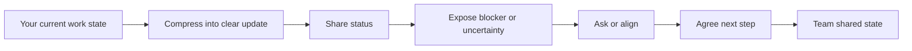

# Part 13 — Daily Work Conversation for Software Engineers

> Tujuan part ini: membuat kamu mampu berkomunikasi dalam English untuk percakapan kerja harian sebagai software engineer: update progress, menjelaskan blocker, meminta bantuan, memberi context, menyampaikan uncertainty, dan menyepakati next step.

Percakapan harian di engineering jarang membutuhkan English yang puitis.

Yang dibutuhkan adalah English yang:

- jelas,
- cepat dipahami,
- tidak ambigu,
- actionable,
- cukup sopan,
- cukup spesifik,
- tidak membuat orang menebak-nebak status pekerjaanmu.

Banyak engineer yang sebenarnya mampu membaca dokumentasi English, tetapi kesulitan ketika harus berbicara spontan dalam meeting kecil, Slack huddle, pair debugging, atau sync singkat dengan teammate global.

Masalahnya biasanya bukan “tidak bisa English sama sekali”.

Masalahnya adalah belum punya **conversation operating patterns** untuk situasi kerja sehari-hari.

Part ini membangun pola tersebut.

---

## 1. Positioning dalam Framework Kaufman

Dalam framework *The First 20 Hours*, kita tidak mengejar semua bentuk English conversation sekaligus.

Kita memilih target performa kecil dengan nilai praktis tinggi:

> Kamu mampu melakukan percakapan kerja harian selama 3–5 menit dalam English: menjelaskan apa yang sedang dikerjakan, statusnya, masalahnya, bantuan yang dibutuhkan, dan next step-nya.

Skill ini dideconstruct menjadi sub-skill kecil:

1. menyebut pekerjaan yang sedang dikerjakan,
2. menyebut progress,
3. menyebut status,
4. menjelaskan blocker,
5. memberi context singkat,
6. meminta bantuan,
7. menyampaikan uncertainty,
8. menyampaikan delay,
9. menyepakati next step,
10. menutup percakapan dengan alignment.

Kamu tidak perlu menunggu grammar sempurna untuk melakukan ini.

Kamu perlu punya **template komunikasi harian** yang bisa dipakai berulang sampai otomatis.

---

## 2. Mental Model: Daily Work Conversation Is State Synchronization

Dalam sistem terdistribusi, node perlu saling sinkron agar state tidak divergen.

Dalam tim engineering, orang juga perlu sinkron:

- apa yang sedang terjadi,
- apa yang sudah selesai,
- apa yang belum selesai,
- apa yang berubah,
- apa yang menghambat,
- siapa perlu melakukan apa,
- kapan perlu follow up.

Daily work conversation adalah proses **state synchronization between humans**.



Kalau update kamu terlalu vague, shared state tim menjadi buruk.

Contoh vague:

```text
I'm still working on it.
```

Masalah:

- tidak jelas progress,
- tidak jelas apakah on track,
- tidak jelas blocker,
- tidak jelas next step,
- tidak jelas kapan selesai.

Versi lebih baik:

```text
I'm still working on the payment retry issue. The main implementation is done, but I'm checking one edge case around duplicate callbacks. I should have an update by this afternoon. No blocker for now.
```

Ini lebih panjang sedikit, tetapi jauh lebih berguna.

---

## 3. The Daily Work Update Template

Gunakan template default ini:

```text
I'm working on [task].
Current status: [progress].
The main issue is [blocker/risk], or no blocker for now.
Next, I'll [next action].
I expect to [timeline / outcome].
```

Contoh:

```text
I'm working on the login rate-limiting task.
Current status: the middleware is implemented and unit tests are passing.
The main issue is that I still need to confirm the Redis TTL behavior in staging.
Next, I'll run a staging test with concurrent login attempts.
I expect to post the result before the end of the day.
```

Versi singkat:

```text
I'm working on the rate-limiting task. The implementation is mostly done, but I still need to validate the Redis TTL behavior in staging. I'll share the result later today.
```

Versi sangat singkat:

```text
The rate-limiting task is mostly done. I'm validating one Redis TTL case and will share an update later today.
```

### Pattern yang perlu dihafal

| Function | Pattern |
|---|---|
| Menyebut task | `I'm working on...` |
| Menyebut progress | `So far, I've...` |
| Menyebut status | `The current status is...` |
| Menyebut blocker | `I'm blocked by...` |
| Menyebut risk | `The main risk is...` |
| Menyebut next step | `Next, I'll...` |
| Menyebut timeline | `I expect to finish it by...` |
| Meminta bantuan | `Could you help me check...?` |
| Meminta keputusan | `Can we decide whether...?` |
| Menutup update | `That's it from my side.` |

---

## 4. Status Language: Jangan Hanya Bilang “Done” atau “Not Done”

Dalam engineering, status biasanya tidak binary.

Ada banyak state:

- not started,
- in progress,
- partially done,
- implemented but not tested,
- tested locally,
- waiting for review,
- blocked,
- needs decision,
- ready to merge,
- deployed,
- monitoring,
- rolled back.

Gunakan language yang lebih presisi.

### 4.1 Not Started

```text
I haven't started it yet because I'm still finishing the API migration task.
```

```text
I haven't picked it up yet. I plan to start after lunch.
```

```text
It's still in my queue. I can start it once the current blocker is resolved.
```

### 4.2 In Progress

```text
It's in progress. I'm currently working on the validation logic.
```

```text
I'm in the middle of implementing the retry mechanism.
```

```text
I've started it, but it's still early. I don't have a reliable estimate yet.
```

### 4.3 Partially Done

```text
The main implementation is done, but the tests are not complete yet.
```

```text
The backend part is done. I'm still coordinating with frontend on the error states.
```

```text
The happy path works. I still need to handle a few edge cases.
```

### 4.4 Implemented but Not Tested

```text
The code is implemented, but I haven't tested it end to end yet.
```

```text
It works locally, but I still need to verify it in staging.
```

```text
The unit tests pass, but I need to add integration coverage.
```

### 4.5 Waiting

```text
I'm waiting for the API contract to be confirmed.
```

```text
I'm waiting for review from the platform team.
```

```text
This is currently waiting on a product decision.
```

### 4.6 Blocked

```text
I'm blocked because the staging environment is unstable.
```

```text
I'm blocked on access to the production logs.
```

```text
I can't move forward until we decide which migration path to use.
```

### 4.7 Ready

```text
The PR is ready for review.
```

```text
The change is ready to merge once CI passes.
```

```text
The fix is deployed to staging and ready for QA.
```

### 4.8 Monitoring

```text
The fix has been deployed, and I'm monitoring the error rate.
```

```text
The rollout is at 10 percent. So far, the metrics look stable.
```

```text
We're monitoring latency before increasing the rollout percentage.
```

---

## 5. Progress Update Formula: Done, Doing, Next, Risk

Untuk daily conversation, pakai formula:

```text
Done → Doing → Next → Risk
```

Dalam English:

```text
I've completed...
I'm currently working on...
Next, I'll...
The main risk is...
```

Contoh:

```text
I've completed the database migration script and tested it locally. I'm currently adding rollback handling. Next, I'll run it against staging data. The main risk is that some old records may not match the new schema.
```

Versi singkat:

```text
The migration script is done locally. I'm adding rollback handling now. The main risk is old records with inconsistent schema.
```

### Kapan formula ini dipakai?

Gunakan saat:

- standup,
- sync dengan tech lead,
- update ke reviewer,
- update ke PM,
- meminta bantuan,
- memberi status sebelum meeting,
- menjelaskan delay.

---

## 6. Cara Menjelaskan Blocker

Blocker yang buruk biasanya terdengar seperti keluhan.

Blocker yang baik terdengar seperti informasi operasional.

### 6.1 Blocker Template

```text
I'm blocked by [specific issue].
I tried [attempted solution].
The current impact is [impact].
I need [specific help/decision/access].
```

Contoh:

```text
I'm blocked by a permission issue in the staging database. I tried using the standard service account, but it doesn't have access to the new schema. The current impact is that I can't validate the migration script. I need temporary read access or someone from the infra team to run the validation query.
```

### 6.2 Jangan bilang ini saja

```text
I'm blocked.
```

Itu terlalu kosong.

Lebih baik:

```text
I'm blocked on staging database access. I need read access to validate the migration script.
```

### 6.3 Blocker Categories

| Category | English Pattern |
|---|---|
| Access | `I'm blocked on access to...` |
| Decision | `I'm blocked until we decide...` |
| Dependency | `I'm blocked by a dependency on...` |
| Environment | `I'm blocked because staging is...` |
| Review | `I'm blocked waiting for review from...` |
| Information | `I'm blocked because I don't have enough context on...` |
| Reproducibility | `I'm blocked because I can't reproduce the issue locally.` |

### 6.4 Good Blocker Examples

```text
I'm blocked on the feature flag configuration. I can implement the code, but I need confirmation on the rollout strategy before merging it.
```

```text
I'm blocked because I can't reproduce the production error locally. I need access to the exact request payload or more detailed logs.
```

```text
I'm blocked by a failing integration test that seems unrelated to my change. I'm checking whether it's flaky or caused by the new validation logic.
```

---

## 7. Asking for Help Without Sounding Weak

Meminta bantuan bukan tanda lemah. Dalam engineering, meminta bantuan dengan jelas adalah tanda ownership.

Yang terdengar lemah bukan “asking for help”.

Yang terdengar lemah adalah meminta bantuan tanpa context dan tanpa usaha awal.

### 7.1 Weak Help Request

```text
Can you help me with this?
```

Masalah:

- this apa?
- sudah coba apa?
- butuh bantuan jenis apa?
- urgency-nya apa?

### 7.2 Strong Help Request

```text
Could you help me check the retry logic in this PR? I think the failure happens when the external API returns a timeout after the first attempt. I've checked the logs, but I'm not sure if the retry count is being applied correctly.
```

Lebih baik karena:

- task jelas,
- area jelas,
- hypothesis jelas,
- effort awal jelas,
- bantuan yang diminta spesifik.

### 7.3 Help Request Template

```text
Could you help me [specific action]?
I'm trying to [goal].
I already checked [what you tried].
I'm not sure about [uncertainty].
```

Contoh:

```text
Could you help me review the error handling in this service? I'm trying to make sure we don't retry non-retryable errors. I already checked the existing error mapping, but I'm not sure whether 409 should be treated as retryable in this flow.
```

### 7.4 Asking for Different Kinds of Help

| Need | Pattern |
|---|---|
| Review | `Could you review...?` |
| Explanation | `Could you walk me through...?` |
| Sanity check | `Could you sanity-check...?` |
| Decision | `Could you help me decide...?` |
| Debugging | `Could you help me debug...?` |
| Context | `Could you give me more context on...?` |
| Access | `Could you help me get access to...?` |
| Pairing | `Could we pair on this for 15 minutes?` |

---

## 8. Saying “I Don’t Know” Professionally

Banyak learner takut mengatakan “I don't know” karena terdengar tidak kompeten.

Masalahnya bukan frasa itu sendiri. Masalahnya adalah jika berhenti di sana.

### 8.1 Weak Version

```text
I don't know.
```

### 8.2 Professional Version

```text
I don't know yet, but I can check the logs and get back to you by this afternoon.
```

```text
I'm not sure yet. My current guess is that it's related to the cache invalidation, but I need to verify it.
```

```text
I don't have enough context to answer that confidently. Let me check the previous design doc first.
```

### 8.3 Formula

```text
I don't know yet + current hypothesis / next action / follow-up time.
```

Contoh:

```text
I don't know yet. My initial guess is that the job failed because of a timeout, but I'll verify it from the worker logs and update you in the thread.
```

### 8.4 Useful Patterns

```text
I'm not sure yet.
```

```text
I need to verify that.
```

```text
I don't want to guess without checking the logs.
```

```text
I can give you a better answer after I inspect the data.
```

```text
My current understanding is..., but I need to confirm it.
```

---

## 9. Saying “Not Yet” Without Sounding Defensive

Dalam kerja nyata, banyak hal belum selesai. Yang penting adalah menyampaikan status dengan jelas.

### 9.1 Weak Version

```text
Not yet.
```

### 9.2 Better Versions

```text
Not yet. I'm still validating the edge cases.
```

```text
Not yet. The implementation is done, but I still need to add tests.
```

```text
Not yet. I ran into an issue with the staging environment, but I'm working around it.
```

```text
Not yet. I expect to finish the first version by tomorrow morning.
```

### 9.3 Formula

```text
Not yet + current state + next action + expected update.
```

Contoh:

```text
Not yet. The backend change is ready, but I'm still waiting for confirmation on the frontend error message. I'll follow up with design today.
```

---

## 10. Explaining Delay

Delay perlu dikomunikasikan lebih awal, bukan setelah deadline lewat.

### 10.1 Delay Template

```text
This may take longer than expected because [reason].
The current status is [status].
The impact is [impact].
My proposed next step is [plan].
```

Contoh:

```text
This may take longer than expected because the existing data has more inconsistent records than we assumed. The migration script works for the normal case, but it fails on some legacy records. The impact is that I may need one extra day to add validation and rollback handling. My proposed next step is to split the migration into two smaller batches.
```

### 10.2 Jangan Menyembunyikan Delay

Buruk:

```text
Still working on it.
```

Lebih baik:

```text
This is taking longer than expected because the integration test exposes a schema mismatch. I can still finish the implementation today, but the full validation may move to tomorrow.
```

Clear delay is better than fake confidence.

---

## 11. Giving Context Before Details

Engineer sering langsung lompat ke detail teknis.

Dalam conversation, mulai dari context.

### 11.1 Bad Order

```text
The token expires after 900 seconds, and then the worker retries three times, but the cache key is not updated, so it returns the old payload.
```

Mungkin benar, tetapi lawan bicara belum tahu ini tentang apa.

### 11.2 Better Order

```text
We're seeing intermittent failures in the invoice generation flow. The main issue seems to be token expiration during the worker retry. When the token expires, the worker may reuse an old cached payload.
```

Urutan lebih jelas:

1. flow apa,
2. symptom apa,
3. suspected cause apa,
4. technical detail apa.

### 11.3 Context Template

```text
For context, this is about [area/feature/flow].
The issue is [symptom/problem].
The relevant detail is [technical detail].
```

Contoh:

```text
For context, this is about the checkout callback flow. The issue is that some callbacks are processed twice. The relevant detail is that the idempotency key is generated after validation, not before it.
```

---

## 12. Handoff Conversation

Handoff terjadi ketika kamu menyerahkan pekerjaan, context, atau issue ke orang lain.

Handoff yang buruk menyebabkan context loss.

### 12.1 Handoff Template

```text
Here's the current status.
What has been done is...
What's still missing is...
The main risk is...
The next recommended step is...
Relevant links are...
```

Contoh:

```text
Here's the current status. The API change is implemented and tested locally. What's still missing is staging validation with real callback payloads. The main risk is duplicate processing if the idempotency key is missing. The next recommended step is to run the staging test with the sample payload from yesterday's incident. The PR and logs are linked in the ticket.
```

### 12.2 Handoff Checklist

Sebelum handoff, pastikan kamu menyebut:

- current state,
- completed work,
- remaining work,
- known issues,
- risk,
- next step,
- owner,
- link.

### 12.3 Handoff Phrasebank

```text
Let me give you the current context.
```

```text
The latest status is...
```

```text
The part that needs attention is...
```

```text
The main thing to watch out for is...
```

```text
If you continue from here, I suggest starting with...
```

```text
Everything is documented in the ticket, but the key point is...
```

---

## 13. Alignment Conversation

Alignment conversation bertujuan memastikan semua orang punya pemahaman yang sama.

Gunakan ketika:

- task ambigu,
- scope berubah,
- ada beberapa opsi,
- ada dependency,
- ada risk,
- ada potential conflict.

### 13.1 Alignment Template

```text
Let me make sure we're aligned.
We are going to [decision/action].
The scope is [scope].
The owner is [owner].
The expected timeline is [timeline].
Anything I'm missing?
```

Contoh:

```text
Let me make sure we're aligned. We are going to ship the backend change first behind a feature flag. The scope is limited to the checkout flow, not the refund flow. I'll own the backend PR, and Nina will validate the frontend behavior. We expect to test it in staging tomorrow. Anything I'm missing?
```

### 13.2 Confirming Understanding

```text
Just to confirm, the priority is reliability over speed for this release, right?
```

```text
So the decision is to delay the migration until we complete the rollback plan, correct?
```

```text
Let me repeat the next step: I'll update the API contract, and you'll confirm it with mobile. Is that right?
```

---

## 14. Escalation Conversation

Escalation bukan drama. Escalation adalah mekanisme untuk mengangkat risiko ke level yang tepat.

### 14.1 When to Escalate

Escalate ketika:

- blocker tidak bisa diselesaikan sendiri,
- ada risiko production,
- scope berubah signifikan,
- timeline tidak realistis,
- decision owner tidak jelas,
- impact ke user cukup besar,
- cross-team dependency macet.

### 14.2 Escalation Template

```text
I want to flag a potential risk.
The issue is [issue].
The impact is [impact].
The current blocker is [blocker].
I think we need [decision/help/action].
```

Contoh:

```text
I want to flag a potential risk. The migration script works for normal records, but fails for some legacy data. The impact is that we may not be able to complete the migration safely this week. The current blocker is that we don't have a confirmed rollback path. I think we need a decision on whether to delay the migration or reduce the scope.
```

### 14.3 Escalation Without Blaming

Hindari:

```text
The infra team didn't give me access, so I can't do anything.
```

Lebih baik:

```text
I'm currently blocked on database access. I requested access yesterday, but it hasn't been approved yet. The impact is that I can't validate the migration script. Could we help prioritize that approval?
```

Fokus pada state, impact, dan action. Bukan menyalahkan orang.

---

## 15. Daily Work Phrasebank

### 15.1 Progress

```text
I've finished the initial implementation.
```

```text
I've made some progress on the API changes.
```

```text
I'm still working through the edge cases.
```

```text
The main logic is done, but the test coverage is still incomplete.
```

```text
I have a working version locally.
```

### 15.2 Blocker

```text
I'm blocked on access to the staging database.
```

```text
I'm blocked because the API contract is still unclear.
```

```text
The main blocker is the failing integration test.
```

```text
I need a decision before I can move forward.
```

```text
I need more context on the expected behavior.
```

### 15.3 Help

```text
Could you take a quick look at this?
```

```text
Could you sanity-check my approach?
```

```text
Could we pair on this for a few minutes?
```

```text
Can you help me understand why this was designed this way?
```

```text
Who would be the right person to ask about this?
```

### 15.4 Uncertainty

```text
I'm not fully sure yet.
```

```text
My current hypothesis is...
```

```text
I need to verify that with the logs.
```

```text
I don't want to assume without checking the data.
```

```text
I'll confirm and update the thread.
```

### 15.5 Next Step

```text
Next, I'll add integration tests.
```

```text
Next, I'll validate it in staging.
```

```text
Next, I'll check the logs from yesterday's incident.
```

```text
I'll follow up with the platform team.
```

```text
I'll post the result in the ticket.
```

---

## 16. Common Mistakes by Indonesian Speakers

### 16.1 Overusing “Already”

Natural Indonesian influence:

```text
I already finish the task.
```

Better:

```text
I've finished the task.
```

Or:

```text
The task is done.
```

Use `already` only when timing expectation matters:

```text
I've already pushed the fix, so we can start testing now.
```

### 16.2 “Still Progress”

Unnatural:

```text
It's still progress.
```

Better:

```text
It's still in progress.
```

Or:

```text
I'm still working on it.
```

### 16.3 “Discuss About”

Unnatural:

```text
Let's discuss about the API design.
```

Better:

```text
Let's discuss the API design.
```

Or:

```text
Let's talk about the API design.
```

### 16.4 “Explain Me”

Unnatural:

```text
Can you explain me the issue?
```

Better:

```text
Can you explain the issue to me?
```

Or:

```text
Can you walk me through the issue?
```

### 16.5 “I Confuse”

Unnatural:

```text
I confuse about this behavior.
```

Better:

```text
I'm confused about this behavior.
```

Or more professional:

```text
I'm not sure I understand this behavior.
```

### 16.6 “Until Now Still”

Unnatural:

```text
Until now still failing.
```

Better:

```text
It's still failing.
```

Or:

```text
It has been failing since yesterday.
```

---

## 17. Conversation Scenarios

### Scenario 1 — Update to Tech Lead

Weak:

```text
I'm still doing the task. Maybe today finish.
```

Strong:

```text
I'm still working on the login throttling task. The implementation is mostly done, but I'm validating the behavior when Redis is unavailable. I expect to finish the validation today and open the PR tomorrow morning.
```

### Scenario 2 — Asking for Context

```text
Could you give me more context on this requirement? I understand that we need to block duplicate transactions, but I'm not sure whether the rule applies only to checkout or also to refunds.
```

### Scenario 3 — Reporting a Blocker

```text
I'm blocked on the staging environment. The deployment keeps failing because the migration job times out. I checked the application logs, but I need help from infra to inspect the database lock.
```

### Scenario 4 — Saying Not Done

```text
Not yet. The implementation is done, but I found one edge case during testing. If the external API times out after creating the transaction, our retry logic may create a duplicate pending state. I'm fixing that now.
```

### Scenario 5 — Aligning Next Step

```text
Just to confirm the next step: I'll update the backend validation, and Maya will update the frontend error message. We'll test the full flow in staging tomorrow. Is that correct?
```

---

## 18. Deliberate Practice: 60-Minute Session

### Goal

Melatih daily work conversation sampai kamu bisa memberi update, menjelaskan blocker, dan meminta bantuan tanpa banyak berpikir.

### Structure

```text
10 min — Warm-up phrase reading
15 min — Status transformation drill
15 min — Blocker explanation drill
10 min — Help request roleplay
10 min — Recording and correction
```

### Drill 1 — Status Transformation

Ubah status pendek menjadi update profesional.

Input:

```text
Still working.
```

Output:

```text
I'm still working on the notification retry task. The main logic is done, but I'm adding tests for timeout handling. No blocker for now.
```

Input:

```text
Not yet.
```

Output:

```text
Not yet. The implementation is complete, but I still need to validate it in staging. I'll update the ticket once the staging test passes.
```

Input:

```text
Blocked.
```

Output:

```text
I'm blocked on access to the production-like dataset. I need it to validate the migration script against legacy records.
```

### Drill 2 — Blocker Explanation

Gunakan template:

```text
I'm blocked by...
I tried...
The impact is...
I need...
```

Practice prompts:

1. staging environment down,
2. unclear API contract,
3. failing test not related to your change,
4. missing production logs,
5. product decision not finalized,
6. dependency team not responding,
7. migration script fails on old data,
8. feature flag strategy unclear.

### Drill 3 — Help Request

Gunakan template:

```text
Could you help me...?
I'm trying to...
I already checked...
I'm not sure about...
```

Practice prompts:

1. review error handling,
2. understand legacy logic,
3. debug failing integration test,
4. choose between two designs,
5. verify database migration approach.

---

## 19. Self-Correction Checklist

Setelah recording, cek:

| Area | Question |
|---|---|
| Clarity | Apakah task jelas? |
| Status | Apakah progress jelas? |
| Specificity | Apakah blocker spesifik? |
| Ownership | Apakah ada next action? |
| Timeline | Apakah ada expected update? |
| Tone | Apakah terdengar profesional? |
| Fluency | Apakah terlalu banyak pause karena translating? |
| Grammar | Apakah error mengganggu meaning? |

Jangan koreksi semuanya sekaligus.

Pilih maksimal 2 improvement per sesi.

---

## 20. Personal Phrasebank Template

Buat phrasebank pribadi dengan format:

```markdown
## Daily Work Phrasebank

### My Common Tasks
- I'm working on...
- I'm validating...
- I'm debugging...
- I'm refactoring...
- I'm reviewing...

### My Common Blockers
- I'm blocked on...
- I need clarification on...
- I need access to...
- I need a decision on...

### My Common Next Steps
- Next, I'll...
- I'll follow up with...
- I'll post an update in...
- I'll validate this in...
```

Isi dengan konteks pekerjaanmu sendiri.

Phrasebank yang terlalu generic akan cepat dilupakan. Phrasebank yang terkait pekerjaan nyata akan cepat aktif.

---

## 21. Mini Benchmark

Kamu dianggap menguasai part ini jika bisa melakukan hal berikut tanpa script penuh:

1. memberi update progress 45 detik,
2. menjelaskan blocker 60 detik,
3. meminta bantuan dengan context 45 detik,
4. mengatakan “not yet” secara profesional,
5. menjelaskan delay tanpa defensif,
6. melakukan handoff singkat,
7. mengkonfirmasi alignment dan next step.

Target bukan perfect English.

Targetnya adalah English yang cukup jelas untuk membuat tim tahu state sebenarnya.

---

## 22. Summary

Daily work conversation adalah fondasi English profesional untuk software engineer.

Yang perlu kamu kuasai bukan banyak grammar rumit, tetapi pola komunikasi yang sering muncul:

- progress update,
- blocker explanation,
- help request,
- uncertainty handling,
- delay communication,
- handoff,
- alignment,
- escalation.

Dalam kerangka Kaufman, part ini adalah high-leverage practice area: kecil, sering muncul, dan langsung usable.

Kalau kamu hanya menguasai satu hal dari part ini, kuasai formula ini:

```text
Current task → Current status → Blocker/risk → Next step → Expected update
```

Itu adalah grammar operasional dari percakapan kerja harian.
