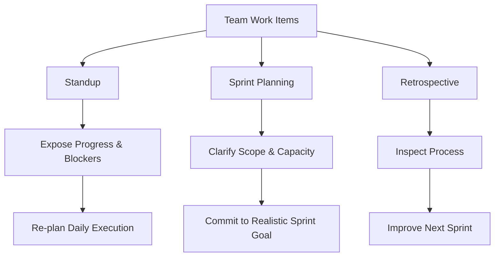
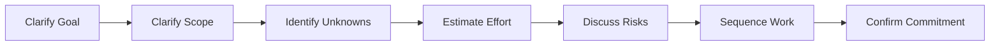

# Part 14 — Standup, Sprint Planning, and Retrospective English

> Tujuan part ini: membuat kamu mampu berpartisipasi aktif dalam agile meetings berbahasa English: standup, sprint planning, backlog refinement, dan retrospective.

Agile meeting sering terlihat sederhana.

Tetapi untuk non-native speaker, meeting seperti standup atau sprint planning bisa terasa sulit karena harus berbicara cepat, jelas, dan singkat di depan tim.

Masalah umumnya:

- terlalu singkat sampai tidak informatif,
- terlalu panjang sampai menghabiskan waktu,
- bingung menjelaskan blocker,
- sulit menolak scope tambahan,
- sulit memberi estimasi dengan uncertainty,
- sulit menyampaikan risk tanpa terdengar negatif,
- sulit memberi feedback retrospective dengan sopan.

Part ini membangun English yang praktis untuk meeting rutin engineering.

---

## 1. Positioning dalam Framework Kaufman

Dalam *The First 20 Hours*, kita memilih sub-skill yang sering muncul dan memberikan feedback cepat.

Agile meeting adalah area latihan ideal karena:

- formatnya berulang,
- frasa yang dipakai relatif predictable,
- konteksnya dekat dengan pekerjaan nyata,
- feedback dari tim bisa langsung terlihat,
- kesalahan kecil tidak terlalu fatal,
- practice frequency tinggi.

Target performa part ini:

> Kamu mampu memberikan standup update yang jelas, mendiskusikan scope dan estimation di sprint planning, serta menyampaikan feedback retrospective secara spesifik dan profesional dalam English.

Sub-skill yang dilatih:

1. concise status update,
2. blocker reporting,
3. scope clarification,
4. estimation language,
5. dependency discussion,
6. risk communication,
7. prioritization conversation,
8. retrospective feedback,
9. improvement proposal,
10. meeting alignment.

---

## 2. Mental Model: Agile Meetings Are Coordination Protocols

Agile meeting bukan ritual.

Agile meeting adalah coordination protocol.

Tujuannya bukan “melaporkan supaya terlihat bekerja”.

Tujuannya adalah membuat tim bisa mengatur flow kerja:

- siapa mengerjakan apa,
- apa yang selesai,
- apa yang tertahan,
- apa yang berubah,
- apa yang berisiko,
- apa yang perlu diputuskan,
- apa yang perlu diperbaiki.



Kalau English kamu tidak jelas, coordination protocol rusak.

Bukan karena grammar kamu salah, tetapi karena signal yang dibutuhkan tim tidak sampai.

---

## 3. Standup English: The Core Pattern

Standup biasanya menjawab tiga hal:

1. apa yang dikerjakan kemarin,
2. apa yang akan dikerjakan hari ini,
3. apakah ada blocker.

Namun update yang bagus bukan sekadar menjawab tiga pertanyaan itu.

Update yang bagus memberi **operational signal**.

### 3.1 Basic Standup Template

```text
Yesterday, I worked on [task/result].
Today, I'll focus on [next task].
I'm blocked by [blocker], or no blockers for now.
```

Contoh:

```text
Yesterday, I worked on the checkout validation changes and finished the main implementation. Today, I'll add integration tests and validate the flow in staging. No blockers for now.
```

### 3.2 Better Standup Template

```text
Yesterday, I [completed/progressed/investigated] [specific thing].
The current status is [state].
Today, I'll [next action].
The main risk/blocker is [risk/blocker], or no blockers for now.
```

Contoh:

```text
Yesterday, I finished the retry logic for payment callbacks. The current status is that the happy path works locally, but I still need to test timeout behavior. Today, I'll add integration tests and run the flow in staging. No blocker for now, but the main risk is duplicate callback processing.
```

### 3.3 Senior-Level Standup Template

Untuk engineer senior, update sebaiknya menyertakan impact, risk, atau ask.

```text
Yesterday, I [progress].
This means [impact/status].
Today, I'll [next step].
I need [ask], or I want to flag [risk].
```

Contoh:

```text
Yesterday, I finished the first version of the migration script and tested it against a sample dataset. This means we're on track for staging validation, but not ready for production yet. Today, I'll add rollback handling. I want to flag one risk: some legacy records don't match the new schema.
```

---

## 4. Standup Anti-Patterns

### 4.1 Too Vague

```text
Yesterday I worked on the task. Today I continue. No blocker.
```

Masalah:

- task apa?
- progress apa?
- continue bagian apa?
- no blocker benar atau belum terlihat?

Better:

```text
Yesterday, I worked on the notification retry task and completed the main implementation. Today, I'll add tests for timeout and non-retryable errors. No blocker for now.
```

### 4.2 Too Detailed

```text
Yesterday, I opened the retry service file, then I checked the existing method, then I saw that the old implementation used a different enum, then I changed the validation, then I had to update the mapper...
```

Masalah:

- terlalu chronological,
- tidak jelas signal utama,
- standup berubah jadi debugging diary.

Better:

```text
Yesterday, I updated the retry validation and fixed the mapper mismatch. Today, I'll add test coverage for retryable and non-retryable errors. No blocker.
```

### 4.3 Hidden Blocker

```text
No blocker.
```

Padahal kamu menunggu API contract.

Better:

```text
I'm not fully blocked, but I need confirmation on the API contract before merging. I can continue writing tests today.
```

Ini lebih akurat. Kamu belum total blocked, tetapi ada dependency.

---

## 5. Standup Phrasebank

### 5.1 Yesterday

```text
Yesterday, I worked on...
```

```text
Yesterday, I finished...
```

```text
Yesterday, I investigated...
```

```text
Yesterday, I made progress on...
```

```text
Yesterday, I paired with...
```

```text
Yesterday, I reviewed...
```

### 5.2 Today

```text
Today, I'll focus on...
```

```text
Today, I'll continue with...
```

```text
Today, I'll validate...
```

```text
Today, I'll follow up on...
```

```text
Today, I'll open a PR for...
```

```text
Today, I'll address the review comments.
```

### 5.3 Blocker

```text
No blockers for now.
```

```text
I'm blocked by...
```

```text
I'm waiting for...
```

```text
I need clarification on...
```

```text
I need a decision on...
```

```text
I want to flag a potential risk around...
```

### 5.4 Ask

```text
Could someone help me review...?
```

```text
Could someone confirm...?
```

```text
I may need help from...
```

```text
I'd like to sync with... after standup.
```

```text
Can we discuss this after standup?
```

---

## 6. Sprint Planning English

Sprint planning bukan hanya “ambil ticket”.

Sprint planning adalah percakapan tentang:

- goal,
- scope,
- priority,
- dependency,
- estimate,
- risk,
- capacity,
- sequencing,
- definition of done.

Kalau kamu hanya diam di planning, kamu kehilangan kesempatan untuk mempengaruhi realitas sprint.

### 6.1 Planning Conversation Flow



### 6.2 Clarifying Sprint Goal

```text
What's the main goal for this sprint?
```

```text
Are we optimizing for speed, reliability, or scope completion?
```

```text
Which outcome matters most by the end of the sprint?
```

```text
Is the goal to ship this to production or only complete staging validation?
```

### 6.3 Clarifying Scope

```text
Can we clarify the scope of this ticket?
```

```text
Does this include both backend and frontend changes?
```

```text
Is this limited to the checkout flow, or does it also include refunds?
```

```text
Are we expected to support legacy records in this iteration?
```

```text
What is explicitly out of scope?
```

The most powerful planning question:

```text
What is out of scope for this sprint?
```

Karena banyak sprint gagal bukan karena tim tidak bekerja keras, tetapi karena scope terlalu kabur.

---

## 7. Estimation English

Estimation bukan janji mutlak.

Estimation adalah komunikasi tentang effort, uncertainty, dan risk.

### 7.1 Basic Estimation Phrases

```text
I think this is a small task.
```

```text
This looks medium-sized because it touches multiple services.
```

```text
This is probably larger than it looks.
```

```text
The implementation is small, but the validation may take time.
```

```text
The risk is not in the code change, but in the migration.
```

### 7.2 Estimation with Uncertainty

```text
My rough estimate is two days, assuming the API contract doesn't change.
```

```text
I can estimate the backend work, but I'm not sure about the frontend impact yet.
```

```text
This is hard to estimate until we inspect the existing data.
```

```text
I would call this a medium task with high uncertainty.
```

```text
If the existing data is clean, it's probably one day. If not, it could take three or more.
```

### 7.3 Estimation Formula

```text
Estimate + Assumption + Risk + Validation Step
```

Contoh:

```text
My estimate is around two days, assuming the current API contract stays the same. The main risk is that the mobile app may depend on the existing error format. I suggest we validate that before committing.
```

### 7.4 Saying “Too Big” Professionally

```text
This seems too large for one sprint if we include migration, testing, and rollout.
```

```text
I think we should split this into smaller pieces.
```

```text
The core implementation is manageable, but the full rollout plan needs more time.
```

```text
I don't think we can commit to the full scope safely in this sprint.
```

---

## 8. Scope Negotiation English

Scope negotiation adalah skill penting.

Bukan untuk menolak pekerjaan, tetapi untuk menjaga delivery tetap realistis.

### 8.1 Splitting Scope

```text
Can we split this into two parts?
```

```text
I suggest we handle the backend change first, then the UI improvement in a separate ticket.
```

```text
Could we ship the minimal version first and add the advanced validation later?
```

```text
Maybe we can separate the migration from the feature work.
```

### 8.2 Reducing Scope

```text
To keep this sprint realistic, I suggest we limit the scope to the checkout flow.
```

```text
Can we exclude legacy records from the first iteration?
```

```text
Could we defer the reporting dashboard to the next sprint?
```

```text
If the deadline is fixed, we need to reduce scope.
```

### 8.3 Clarifying Definition of Done

```text
What does done mean for this ticket?
```

```text
Is it done when the PR is merged, or when it's deployed to production?
```

```text
Does done include monitoring after rollout?
```

```text
Do we need documentation as part of this ticket?
```

```text
Should we include integration tests in the definition of done?
```

---

## 9. Dependency and Risk Language

Sprint planning harus mengekspos dependency sebelum menjadi blocker.

### 9.1 Dependency

```text
This depends on the platform team finishing the new event schema.
```

```text
We need confirmation from mobile before changing the response format.
```

```text
This ticket depends on the feature flag being available in staging.
```

```text
We can't start the migration safely until the rollback plan is reviewed.
```

### 9.2 Risk

```text
The main risk is backward compatibility.
```

```text
The main risk is that this touches the payment flow.
```

```text
The risk is low for implementation but high for rollout.
```

```text
The biggest unknown is the quality of existing data.
```

```text
I want to flag this as a high-risk change because it affects all checkout traffic.
```

### 9.3 Mitigation

```text
We can reduce the risk by putting this behind a feature flag.
```

```text
We can start with a small rollout percentage.
```

```text
We can add extra logging before enabling the new behavior.
```

```text
We can split the migration into smaller batches.
```

```text
We should define rollback criteria before deployment.
```

---

## 10. Backlog Refinement English

Backlog refinement sering lebih penting daripada sprint planning karena di sinilah ambiguity seharusnya dibersihkan.

### 10.1 Refinement Questions

```text
What problem are we trying to solve with this ticket?
```

```text
Who is the user or consumer of this change?
```

```text
What is the expected behavior?
```

```text
What should happen in the failure case?
```

```text
Are there any edge cases we should define upfront?
```

```text
What are the acceptance criteria?
```

```text
How will we test this?
```

```text
How will we know this is working in production?
```

### 10.2 Acceptance Criteria Language

```text
Can we make the acceptance criteria more specific?
```

```text
I think we should add an acceptance criterion for the timeout case.
```

```text
Should we define what happens when the external API returns a 500?
```

```text
Can we include the expected error message in the ticket?
```

```text
Can we clarify whether this applies to existing users or only new users?
```

---

## 11. Retrospective English

Retrospective bukan sesi menyalahkan.

Retrospective adalah inspect-and-adapt loop.

Tujuannya:

- mengidentifikasi apa yang berjalan baik,
- mengidentifikasi friction,
- memahami root cause,
- membuat improvement kecil yang bisa dilakukan sprint berikutnya.

### 11.1 Retrospective Structure

Common categories:

```text
What went well?
What didn't go well?
What can we improve?
What should we start, stop, or continue?
```

### 11.2 Saying What Went Well

```text
I think the incident response went well because we aligned quickly and had a clear owner.
```

```text
The code review process was smoother this sprint. Most PRs got feedback within a day.
```

```text
The feature flag approach helped us reduce rollout risk.
```

```text
Pairing on the migration early helped us catch edge cases before implementation.
```

### 11.3 Saying What Did Not Go Well

Gunakan format:

```text
Observation + Impact + Possible Cause
```

Contoh:

```text
One thing that didn't go well was the late change in API requirements. The impact was that we had to rework the validation logic near the end of the sprint. I think the possible cause is that we didn't confirm the contract with mobile early enough.
```

Lebih pendek:

```text
The API requirement changed late, and it caused rework. We should confirm cross-team contracts earlier next time.
```

### 11.4 Giving Feedback Without Blame

Hindari:

```text
Product changed the requirement too late.
```

Lebih baik:

```text
The requirement changed late in the sprint, which created rework for engineering. I think we need an earlier alignment point before implementation starts.
```

Hindari:

```text
Reviews were slow because people didn't care.
```

Lebih baik:

```text
Some PRs waited more than two days for review, which slowed down integration. Maybe we need a clearer review ownership rotation.
```

### 11.5 Proposing Improvement

```text
I suggest we add a short API contract review before implementation.
```

```text
Could we define rollback criteria during planning?
```

```text
Maybe we should reserve capacity for review and stabilization.
```

```text
I think we should create a checklist for high-risk changes.
```

```text
Can we agree on a review SLA for critical PRs?
```

---

## 12. Retro Phrasebank

### 12.1 What Went Well

```text
One thing that went well was...
```

```text
I think we did a good job on...
```

```text
The team handled... well.
```

```text
I appreciated how we...
```

```text
This helped us because...
```

### 12.2 What Did Not Go Well

```text
One thing that was difficult was...
```

```text
We had some friction around...
```

```text
This created some rework because...
```

```text
The main challenge was...
```

```text
We underestimated...
```

### 12.3 Improvement

```text
Next time, we could...
```

```text
I suggest we...
```

```text
Could we try... in the next sprint?
```

```text
One small improvement would be...
```

```text
Maybe we should stop/start/continue...
```

---

## 13. Meeting Turn-Taking in Agile Context

Kamu tidak harus menunggu ditanya untuk berbicara.

Tapi kamu perlu masuk dengan sopan.

### 13.1 Entering the Conversation

```text
Can I add one point here?
```

```text
I have a quick concern about the scope.
```

```text
One thing to consider is...
```

```text
Can we clarify one detail before we move on?
```

### 13.2 Parking a Topic

```text
This might be too detailed for standup. Can we discuss it after the meeting?
```

```text
Maybe we should park this and continue with the remaining updates.
```

```text
This probably needs a separate discussion.
```

### 13.3 Bringing Back Focus

```text
Can we bring this back to the sprint goal?
```

```text
To keep this actionable, what decision do we need now?
```

```text
What is the next step from here?
```

```text
Who should own this follow-up?
```

---

## 14. Complete Example Dialogues

### 14.1 Standup Example

```text
Facilitator:
Raka, can you go next?

Raka:
Sure. Yesterday, I finished the first version of the checkout validation change and added unit tests for the normal flow. Today, I'll add integration tests for timeout and duplicate callback cases. No blocker for now, but I want to flag one risk: the current idempotency behavior is different between checkout and refund flows.

Facilitator:
Do you need help with that?

Raka:
Not immediately. I'll investigate it today and post a summary in the ticket. If it affects the refund flow, we may need a small design discussion.
```

### 14.2 Sprint Planning Example

```text
PM:
Can we include the full payment retry improvement in this sprint?

Engineer:
I think we need to clarify the scope first. Does this include only checkout callbacks, or also refunds and manual reconciliation?

PM:
Ideally all of them.

Engineer:
If we include all three, I don't think it's realistic for one sprint. The checkout part is manageable, but refunds and reconciliation have different edge cases. I suggest we split it: checkout retry improvement this sprint, then refunds and reconciliation in separate tickets.

Tech Lead:
That sounds reasonable. What's the main risk?

Engineer:
The main risk is duplicate processing during timeout. We can reduce the risk by adding idempotency checks and rolling it out behind a feature flag.
```

### 14.3 Retrospective Example

```text
Facilitator:
What didn't go well this sprint?

Engineer:
One thing that didn't go well was the late change in the API contract. It caused rework in both backend and frontend near the end of the sprint. I don't think it was anyone's fault, but we probably need an earlier contract review when a ticket touches multiple clients.

Facilitator:
What improvement do you suggest?

Engineer:
I suggest adding a short API contract checklist during refinement. It doesn't need to be heavy, just enough to confirm request format, response format, error behavior, and backward compatibility.
```

---

## 15. Common Mistakes and Better Alternatives

### 15.1 “Yesterday I Do…”

Wrong:

```text
Yesterday I do testing.
```

Better:

```text
Yesterday, I tested the checkout flow.
```

Or:

```text
Yesterday, I worked on testing the checkout flow.
```

### 15.2 “Today I Will Continue It”

Too vague:

```text
Today I will continue it.
```

Better:

```text
Today, I'll continue adding integration tests for the timeout cases.
```

### 15.3 “No Blocker” When There Is a Dependency

Too simplistic:

```text
No blocker.
```

Better:

```text
No hard blocker, but I'm waiting for confirmation on the API contract before merging.
```

### 15.4 “I Think Can”

Unnatural:

```text
I think can finish today.
```

Better:

```text
I think I can finish it today.
```

Or more professional:

```text
I expect to finish it today.
```

### 15.5 “Need Discuss”

Unnatural:

```text
Need discuss after standup.
```

Better:

```text
We need to discuss this after standup.
```

Or:

```text
I'd like to discuss this after standup.
```

---

## 16. Deliberate Practice: Standup Drill

### Goal

Mampu memberi update 30–60 detik dengan jelas.

### Template

```text
Yesterday, I...
The current status is...
Today, I'll...
Blocker/risk/ask...
```

### Practice Prompts

Buat standup update untuk setiap situasi:

1. Kamu menyelesaikan unit test tetapi belum integration test.
2. Kamu menemukan edge case dalam payment callback.
3. Kamu blocked karena staging down.
4. Kamu menunggu review dari senior engineer.
5. Kamu mengerjakan refactor yang lebih besar dari perkiraan.
6. Kamu perlu keputusan product sebelum lanjut.
7. Kamu sudah deploy fix dan sedang monitoring.
8. Kamu membantu teammate debugging production issue.
9. Kamu belum mulai ticket karena incident.
10. Kamu menemukan requirement ambiguity.

### Example Output

Prompt:

```text
Kamu blocked karena staging down.
```

Response:

```text
Yesterday, I finished the implementation for the notification retry logic. The current status is that it works locally, but I haven't validated it end to end yet. Today, I planned to test it in staging, but I'm currently blocked because staging is down. I'll follow up with infra and continue adding test coverage in the meantime.
```

---

## 17. Deliberate Practice: Sprint Planning Drill

### Goal

Mampu bertanya tentang scope, risk, dan estimate.

### Drill Format

Untuk setiap ticket, jawab:

```text
What is unclear?
What is the estimated effort?
What is the main risk?
What should be split or clarified?
```

### Ticket 1

```text
Improve payment retry behavior.
```

Possible response:

```text
I think we need to clarify the scope. Does this include only checkout callbacks, or also refunds and reconciliation? The implementation might be medium-sized, but the risk is high because it touches payment behavior. I suggest we start with checkout callbacks and put the change behind a feature flag.
```

### Ticket 2

```text
Migrate user preference data to the new schema.
```

Possible response:

```text
This looks larger than a simple schema change. The main unknown is the quality of existing data. My rough estimate is two to three days if the data is clean, but longer if we need cleanup logic. I suggest adding a validation step before committing to the migration timeline.
```

### Ticket 3

```text
Add new error message for failed login.
```

Possible response:

```text
This sounds small, but we should clarify whether it requires backend changes, frontend changes, localization, and analytics tracking. If it's only frontend copy, it's small. If it includes error code changes, we need to coordinate with backend.
```

---

## 18. Deliberate Practice: Retrospective Drill

### Goal

Mampu memberi feedback spesifik tanpa menyalahkan.

### Template

```text
One thing that [went well/didn't go well] was...
The impact was...
I think the reason was...
Next time, we could...
```

### Practice Prompts

1. PR review terlalu lambat.
2. Requirement berubah di akhir sprint.
3. Incident mengganggu sprint goal.
4. Scope terlalu besar.
5. Tim sukses deploy dengan feature flag.
6. Pairing membantu menyelesaikan bug.
7. Test coverage kurang sehingga bug lolos.
8. Meeting terlalu panjang dan tidak menghasilkan keputusan.

### Example Output

Prompt:

```text
PR review terlalu lambat.
```

Response:

```text
One thing that didn't go well was PR review latency. Some PRs waited more than two days for feedback, which delayed integration. I think the reason is that we didn't have clear review ownership. Next time, we could assign a daily reviewer or set a lightweight review SLA for critical PRs.
```

---

## 19. 60-Minute Practice Session

```text
10 min — Read phrasebank aloud
15 min — Standup update drill
15 min — Sprint planning scope/risk drill
10 min — Retrospective feedback drill
10 min — Record one full agile meeting simulation
```

### Recording Script

Record yourself answering:

1. standup update,
2. planning scope question,
3. estimation with uncertainty,
4. retro feedback,
5. improvement proposal.

Then self-correct using this checklist:

| Area | Check |
|---|---|
| Specificity | Did I mention the actual task? |
| Status | Did I explain current state? |
| Risk | Did I expose risk early? |
| Scope | Did I clarify what is included/excluded? |
| Estimate | Did I mention assumptions? |
| Tone | Did I avoid blaming? |
| Action | Did I propose next step? |
| Fluency | Did I speak in chunks? |

---

## 20. Mini Benchmark

Kamu dianggap menguasai part ini jika bisa:

1. memberi standup update 45 detik,
2. menjelaskan blocker di standup,
3. meminta diskusi setelah standup,
4. mengklarifikasi scope ticket,
5. memberi estimation dengan assumption,
6. menyebut risk dan mitigation,
7. mengusulkan scope split,
8. menyampaikan retro feedback tanpa menyalahkan,
9. mengusulkan improvement konkret,
10. mengkonfirmasi decision dan next step.

Target bukan menjadi “native speaker”.

Targetnya adalah menjadi engineer yang bisa membuat meeting lebih jelas.

---

## 21. Summary

Agile meetings adalah tempat ideal untuk deliberate practice English conversation karena formatnya berulang dan langsung terkait pekerjaan.

Kunci utamanya:

- standup harus memberi operational signal,
- planning harus mengklarifikasi scope, risk, dependency, dan estimate,
- retrospective harus spesifik, tidak menyalahkan, dan menghasilkan improvement.

Formula yang paling penting:

```text
Progress → Status → Next Step → Blocker/Risk/Ask
```

Untuk planning:

```text
Scope → Assumption → Estimate → Risk → Mitigation
```

Untuk retro:

```text
Observation → Impact → Cause → Improvement
```

Kalau kamu menguasai tiga formula ini, kamu akan terdengar jauh lebih jelas, profesional, dan berguna dalam agile meetings berbahasa English.
