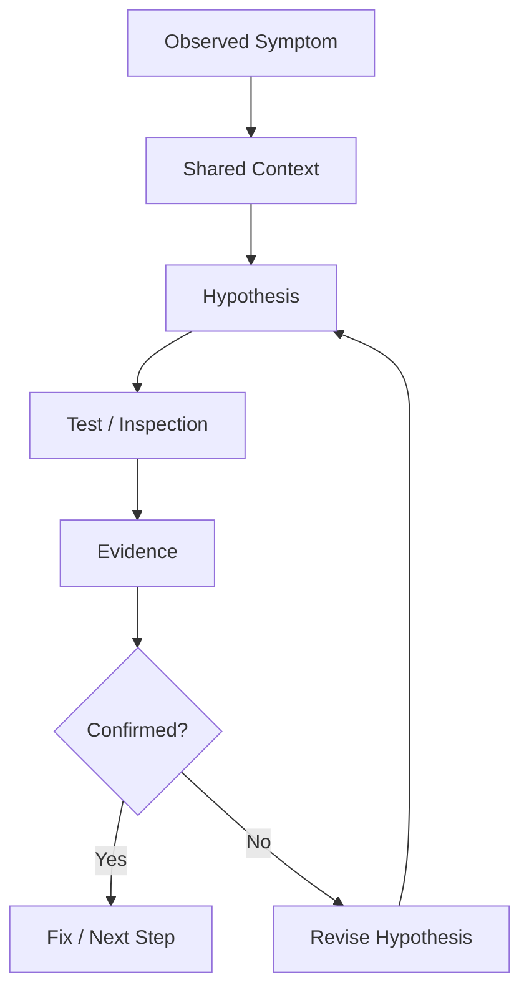
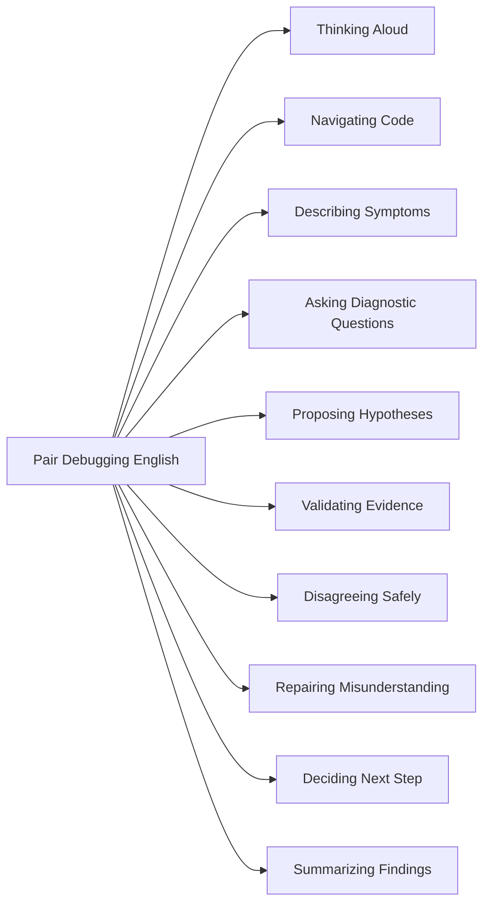
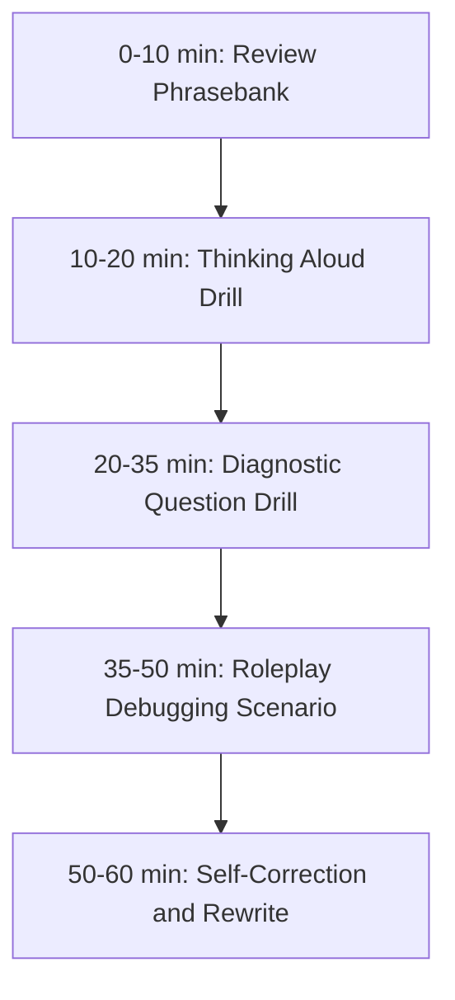

# English for Conversation Part 15 — Pair Programming and Debugging Conversation

> Goal part ini: kamu bisa **berpikir keras dalam English**, menavigasi kode secara verbal, bertanya secara diagnostik, mengusulkan hipotesis debugging, dan menyepakati next step ketika bekerja bersama engineer lain.

Pair programming dan debugging adalah conversation yang sangat berbeda dari small talk. Di sini, English tidak dipakai untuk “terlihat fluent”, tetapi untuk membuat proses berpikir bersama menjadi jelas.

Dalam konteks software engineering, conversation yang bagus biasanya punya tiga kualitas:

1. **Low ambiguity** — orang lain tahu persis bagian sistem, file, function, state, atau behavior yang sedang kamu maksud.
2. **High observability** — kamu menjelaskan apa yang kamu lihat, bukan hanya kesimpulan.
3. **Hypothesis-driven** — kamu tidak lompat ke solusi sebelum memvalidasi sebab.

Part ini akan memakai prinsip Josh Kaufman dari *The First 20 Hours*: skill dipecah menjadi sub-skill kecil, kita belajar cukup untuk self-correct, lalu berlatih pada skenario nyata berulang-ulang sampai respons menjadi otomatis.

---

## 1. Target Performance

Setelah part ini, target performa kamu bukan “bisa bicara English tanpa salah”, tetapi mampu menjalankan conversation seperti ini:

```text
I think the failure starts before the request reaches the service.
Let's verify the logs first.

Can you scroll to the middleware section?
I want to check whether the auth context is being attached correctly.

The weird part is that the token is valid, but the user id is missing.
So my current hypothesis is that the parsing step succeeds, but the mapping step fails.

Could you run the test again with a breakpoint right after decodeToken()?
```

Perhatikan bahwa kalimat-kalimat tersebut tidak rumit secara grammar. Yang membuatnya kuat adalah struktur berpikirnya:

- menyatakan observasi,
- membedakan fakta dari dugaan,
- mengarahkan perhatian,
- meminta tindakan spesifik,
- dan menjaga alur kolaborasi.

---

## 2. Mental Model: Debugging Conversation Is Distributed Reasoning

Debugging bersama bukan sekadar “dua orang melihat kode yang sama”. Itu adalah proses membangun shared mental model.



Dalam English conversation, setiap node butuh language pattern:

| Debugging Step | Conversation Function | Example |
|---|---|---|
| Observed Symptom | describe what happens | “The request returns 500 after the retry.” |
| Shared Context | align understanding | “Just to confirm, this only happens in staging, right?” |
| Hypothesis | propose possible cause | “My guess is the cache key changed.” |
| Test | request an action | “Can we reproduce it with the same payload?” |
| Evidence | interpret result | “That suggests the issue is not in the controller.” |
| Revision | update thinking | “Okay, then my previous assumption was wrong.” |
| Fix | propose next step | “Let’s add a guard before we access the field.” |

Debugging English bukan tentang banyak vocabulary. Yang penting adalah punya pola kalimat untuk setiap tahap berpikir.

---

## 3. Sub-Skill Decomposition

Untuk conversation debugging, skill ini bisa dipecah menjadi 10 sub-skill kecil.



Kamu tidak perlu menguasai semuanya sekaligus. Dalam 20-hour acquisition model, kita mulai dari sub-skill yang paling sering dipakai dan memberi leverage terbesar:

1. thinking aloud,
2. asking diagnostic questions,
3. proposing hypotheses,
4. confirming understanding,
5. summarizing next step.

---

## 4. Thinking Aloud: Berpikir Keras Tanpa Terdengar Berantakan

Pair programming menuntut kamu menjelaskan proses berpikir saat belum yakin. Banyak learner stuck karena merasa harus memberi jawaban final. Padahal dalam debugging, justru penting membedakan “what I know” dan “what I suspect”.

### 4.1 Core Patterns

| Intent | Pattern | Example |
|---|---|---|
| Mengamati | “I’m noticing that…” | “I’m noticing that the response time spikes after the third retry.” |
| Menduga | “My guess is…” | “My guess is the request body is not being deserialized correctly.” |
| Belum yakin | “I’m not sure yet, but…” | “I’m not sure yet, but this looks like a race condition.” |
| Memikirkan opsi | “One possibility is…” | “One possibility is that the config is different in staging.” |
| Mengubah pikiran | “Actually, that might not be the issue.” | “Actually, that might not be the issue because the test passes locally.” |
| Mengarahkan investigasi | “Let’s check…” | “Let’s check the middleware first.” |

### 4.2 Safe Thinking-Aloud Script

Gunakan template ini ketika kamu sedang bingung:

```text
I’m not fully sure yet.
What I see is <observation>.
One possible explanation is <hypothesis>.
Let’s verify it by <test/action>.
```

Example:

```text
I’m not fully sure yet.
What I see is the user id is null after the token is decoded.
One possible explanation is that the claim name changed.
Let’s verify it by printing the decoded payload.
```

Template ini powerful karena tidak memaksa kamu terdengar pasti. Kamu cukup menunjukkan alur berpikir.

---

## 5. Navigating Code Verbally

Saat pair programming, kamu sering perlu mengarahkan orang lain ke bagian tertentu dari codebase.

### 5.1 Navigation Phrases

| Situation | Phrase |
|---|---|
| Minta scroll | “Can you scroll down a bit?” |
| Minta naik | “Can you go back to the previous function?” |
| Minta buka file | “Can you open the service implementation?” |
| Minta cari symbol | “Can you search for `validateToken`?” |
| Minta lihat caller | “Can we check where this function is called?” |
| Minta lihat definition | “Can we jump to the definition?” |
| Minta lihat test | “Can we look at the test for this case?” |
| Minta lihat logs | “Can we check the logs around that timestamp?” |
| Minta lihat config | “Can we compare the local config with staging?” |

### 5.2 Precision Pattern

Hindari:

```text
Look there.
Check that one.
Maybe this.
```

Lebih baik:

```text
Can you open the controller that handles this endpoint?
Can we inspect the function that maps the token payload to the user context?
Can you scroll to the part where we build the cache key?
```

Precision membuat kamu terdengar lebih profesional meskipun English kamu sederhana.

---

## 6. Describing Symptoms

Debugging dimulai dari symptom, bukan solusi.

### 6.1 Symptom Vocabulary

| Word | Meaning in Debugging | Example |
|---|---|---|
| fail | tidak berhasil | “The job fails after three retries.” |
| crash | proses berhenti/error keras | “The service crashes during startup.” |
| timeout | terlalu lama sampai batas waktu | “The request times out after 30 seconds.” |
| hang | stuck/tidak lanjut | “The process hangs after loading the config.” |
| spike | naik tajam | “CPU usage spikes during batch processing.” |
| drop | turun tajam | “Throughput drops after deployment.” |
| mismatch | tidak cocok | “There is a mismatch between the schema and the payload.” |
| regression | bug muncul lagi setelah change | “This looks like a regression from the latest release.” |
| intermittent | kadang terjadi, kadang tidak | “The failure is intermittent.” |
| reproducible | bisa direproduksi | “The issue is reproducible locally.” |

### 6.2 Symptom Sentence Frames

```text
The issue happens when <condition>.
The failure occurs after <event>.
The error appears before <step>.
The behavior is different between <environment A> and <environment B>.
The weird part is that <unexpected observation>.
```

Examples:

```text
The issue happens when the user has more than one active session.
The failure occurs after the retry policy kicks in.
The error appears before the request reaches the service layer.
The behavior is different between local and staging.
The weird part is that the token is valid, but the user context is empty.
```

### 6.3 Avoid Premature Diagnosis

Weak:

```text
The database is broken.
```

Better:

```text
The query returns no rows, but I’m not sure yet whether the issue is in the database, the filter, or the input.
```

Weak:

```text
The API is wrong.
```

Better:

```text
The API response does not match the contract we expected.
```

Professional debugging English separates evidence from conclusion.

---

## 7. Asking Diagnostic Questions

Questions are the engine of debugging. Good questions reduce search space.

### 7.1 Categories of Diagnostic Questions

| Category | Purpose | Examples |
|---|---|---|
| Reproduction | Can we reproduce it? | “Can we reproduce this locally?” |
| Scope | How wide is it? | “Does this happen for all users or only some users?” |
| Timing | When did it start? | “When did this start failing?” |
| Environment | Where does it happen? | “Is this only happening in staging?” |
| Input | What data triggers it? | “What payload causes the failure?” |
| Change | What changed recently? | “Did we deploy anything related to auth?” |
| Evidence | What do logs show? | “Do the logs show the same error every time?” |
| Contract | What should happen? | “What behavior did we expect here?” |

### 7.2 High-Leverage Debugging Questions

Use these often:

```text
Can we reproduce it?
Is it deterministic or intermittent?
What changed recently?
What input triggers the issue?
Does it happen in production as well?
What do the logs say?
What behavior did we expect?
Where does the actual behavior diverge from the expected behavior?
Can we isolate the smallest failing case?
```

### 7.3 Softening Questions

Direct questions can sound accusatory if phrased poorly.

Too direct:

```text
Why did you change this?
```

Better:

```text
What was the reason behind this change?
Can you walk me through the thinking behind this change?
Do you remember what problem this change was solving?
```

Too direct:

```text
Did you break it?
```

Better:

```text
Do we know whether this started after the latest deployment?
Could this be related to the recent change?
```

The goal is not to avoid directness entirely. The goal is to preserve collaboration.

---

## 8. Proposing Hypotheses

A hypothesis is not a conclusion. In debugging conversation, you need language that communicates uncertainty clearly.

### 8.1 Hypothesis Ladder

| Confidence | Phrase | Example |
|---|---|---|
| Very low | “One possibility is…” | “One possibility is that the queue message is malformed.” |
| Low | “It might be…” | “It might be a config issue.” |
| Medium | “My guess is…” | “My guess is the token parsing succeeds but the mapping fails.” |
| Medium-high | “This looks like…” | “This looks like a race condition.” |
| High | “The evidence points to…” | “The evidence points to a schema mismatch.” |
| Confirmed | “The root cause is…” | “The root cause is a missing migration.” |

### 8.2 Bad vs Good Hypothesis

Bad:

```text
It’s definitely Redis.
```

Good:

```text
It might be related to Redis because the timeout happens right after the cache lookup.
Let’s confirm by bypassing the cache locally.
```

Bad:

```text
This code is wrong.
```

Good:

```text
This condition might be too broad. It also matches inactive users.
```

### 8.3 Hypothesis Template

```text
My current hypothesis is <possible cause>
because <evidence>.
We can verify it by <test>.
```

Example:

```text
My current hypothesis is that the retry creates duplicate messages
because the same event id appears twice in the logs.
We can verify it by checking the idempotency key.
```

This pattern is one of the most important conversation tools in technical English.

---

## 9. Validating Evidence

After a test, you need to interpret results.

### 9.1 Evidence Phrases

| Intent | Phrase |
|---|---|
| Evidence supports hypothesis | “That supports the hypothesis.” |
| Evidence weakens hypothesis | “That makes the hypothesis less likely.” |
| Evidence contradicts hypothesis | “That contradicts our assumption.” |
| Evidence narrows scope | “That narrows it down to the service layer.” |
| Evidence is insufficient | “That is useful, but it does not prove the root cause yet.” |
| Need more data | “We need one more data point.” |

### 9.2 Example Flow

```text
The same request works locally but fails in staging.
That makes a code-level bug less likely.
It points more toward configuration, environment, or data.
Let’s compare the feature flags and environment variables.
```

Notice the reasoning:

1. compare environments,
2. reduce likelihood of one cause,
3. increase likelihood of another cause,
4. choose next test.

---

## 10. Pair Programming Control Language

Pair programming requires smooth control transfer.

### 10.1 Driver/Navigator Language

When you are the navigator:

```text
Can you try extracting this into a helper function?
Let’s rename this variable to make the intent clearer.
Can we add a test for the null case?
Maybe we should handle the empty list before the loop.
```

When you are the driver:

```text
I’m going to refactor this part first.
Let me add a failing test before changing the implementation.
I’ll keep this change small so we can verify it quickly.
I’m not sure about this naming. What do you think?
```

### 10.2 Asking for Control

```text
Can I drive for a minute?
Let me try something quickly.
Can I take over and test one idea?
```

### 10.3 Giving Control

```text
Do you want to drive from here?
Can you take over and add the test?
I’ll let you drive while I think through the edge cases.
```

This language matters because pair programming is a social protocol, not just a coding technique.

---

## 11. Handling Disagreement During Debugging

Debugging often includes disagreement. The danger is sounding dismissive.

### 11.1 Disagreement Patterns

| Weak / Risky | Better |
|---|---|
| “No, that’s wrong.” | “I’m not sure that explains the staging-only behavior.” |
| “That doesn’t make sense.” | “I might be missing something, but I don’t see how that causes the timeout.” |
| “It’s not the database.” | “The database is possible, but the logs point earlier in the flow.” |
| “You forgot the migration.” | “Could the migration be missing in this environment?” |

### 11.2 Strong but Professional Pushback

```text
I don’t think we should deploy this yet because we haven’t tested the rollback path.
I’m concerned that this fix only handles the symptom, not the root cause.
I agree this works for the current case, but I’m worried it breaks the empty-state case.
```

A strong disagreement is acceptable when it is tied to risk, evidence, or system behavior.

---

## 12. Repair Phrases During Pairing

You will misunderstand things. You will blank out. You will miss words. That is normal.

### 12.1 When You Didn’t Hear

```text
Sorry, I didn’t catch the last part.
Could you say that again?
Could you repeat the function name?
```

### 12.2 When You Heard but Didn’t Understand

```text
I heard the words, but I’m not sure I understood the idea.
Can you rephrase that?
Could you explain what you mean by “stale context” here?
```

### 12.3 When You Need Time

```text
Give me a second to think.
Let me process that for a moment.
I need to look at the code again before I answer.
```

### 12.4 When You Want to Confirm

```text
Let me make sure I understood.
So you’re saying that the token is valid, but the user mapping fails?
Do you mean the issue happens before the controller?
```

The most dangerous habit is pretending to understand. In technical work, fake understanding creates bugs.

---

## 13. Summarizing Findings

At the end of debugging, summarize clearly.

### 13.1 Summary Template

```text
Here’s what we found:
- <fact 1>
- <fact 2>
- <likely cause>
- <next step>
```

Spoken version:

```text
Here’s what we found.
The issue only happens in staging.
The request reaches the service, but the user context is empty.
The token itself is valid, so the problem is probably in the mapping step.
Next, we’ll compare the claim names between environments.
```

### 13.2 Handoff Summary

When you need to hand off to another person:

```text
We reproduced the issue in staging but not locally.
The failing request has a valid token.
The user id is missing after token mapping.
We suspect an environment-specific claim mismatch.
The next step is to compare the auth provider config between staging and production.
```

This kind of English is extremely valuable in global engineering teams.

---

## 14. Common Conversation Failures

### 14.1 Overusing “Maybe”

Weak:

```text
Maybe this maybe config maybe token maybe database.
```

Better:

```text
There are three possible causes: config, token parsing, or database lookup.
Based on the logs, I would check token parsing first.
```

### 14.2 Translating Indonesian Structure Too Directly

Common pattern:

```text
The error is because the data not same.
```

Better:

```text
The error happens because the data does not match the expected format.
```

Common pattern:

```text
I already try but still error.
```

Better:

```text
I already tried that, but it still fails.
```

Common pattern:

```text
The bug happen in staging only.
```

Better:

```text
The bug only happens in staging.
```

### 14.3 Jumping to Fix Too Early

Weak:

```text
Let’s change this code.
```

Better:

```text
Before changing the code, let’s confirm that this is actually the failing branch.
```

---

## 15. Phrasebank: Pair Programming and Debugging

### 15.1 Starting the Session

```text
Can you walk me through the issue?
What have you tried so far?
Do we have a reproducible case?
Let’s start from the failing test.
Let’s look at the logs first.
```

### 15.2 During Investigation

```text
Can you scroll down a bit?
Can we check where this value is set?
Let’s trace the request from the controller.
This part looks suspicious.
I want to verify one assumption.
Can we add a breakpoint here?
Can we print the payload before mapping?
```

### 15.3 Proposing Direction

```text
I suggest we isolate the smallest failing case.
Let’s compare the working and failing payloads.
We should check whether this is environment-specific.
Maybe we can add a regression test first.
```

### 15.4 When Stuck

```text
I’m stuck on this part.
I don’t see the connection yet.
Let’s step back and restate what we know.
Maybe we’re looking at the wrong layer.
Can we draw the flow quickly?
```

### 15.5 Closing

```text
I think we have enough to move forward.
Let’s write down the findings.
The next step is to validate the config difference.
I’ll take the action item to add the regression test.
```

---

## 16. Dialogue Example: Debugging a Staging Failure

```text
A: Can you walk me through the issue?

B: Sure. The login flow works locally, but it fails in staging. The API returns 500.

A: Do we have the logs?

B: Yes. The error says user id is null.

A: Interesting. So the token is accepted, but the user id is missing?

B: That’s what it looks like.

A: My current hypothesis is that the token parsing succeeds, but the mapping from claims to user context fails.

B: Could be. How do we verify that?

A: Let’s print the decoded payload before we create the user context.

B: Okay, I’ll add a log here.

A: Great. Also, can we compare the claim names between local and staging?

B: Good idea. The local token uses “user_id”. Staging uses “sub”.

A: That explains it. The mapping expects “user_id”, so staging produces an empty user id.

B: Should we support both fields?

A: I think so, but let’s add a regression test first and confirm with the auth contract.
```

Important patterns:

- “Can you walk me through…?”
- “So the token is accepted, but…?”
- “My current hypothesis is…”
- “How do we verify that?”
- “That explains it.”
- “Let’s add a regression test first.”

---

## 17. Drill 1 — Thinking Aloud

Use this template 10 times with different bugs:

```text
I’m not fully sure yet.
What I see is <observation>.
One possible explanation is <hypothesis>.
Let’s verify it by <action>.
```

Prompts:

1. API returns 500 only in staging.
2. Test passes locally but fails in CI.
3. User cannot upload large files.
4. Background job processes the same event twice.
5. Cache returns stale data.
6. Login fails for some users only.
7. Deployment succeeds but health check fails.
8. CPU usage spikes after release.
9. Database query becomes slow after migration.
10. Feature flag works for one tenant but not another.

---

## 18. Drill 2 — Diagnostic Question Expansion

For each symptom, ask 5 diagnostic questions.

Example symptom:

```text
The payment callback sometimes fails.
```

Questions:

```text
Is the failure deterministic or intermittent?
When did it start happening?
Does it happen for all payment providers?
What status code do we receive?
Do we retry the callback?
```

Now practice with:

1. Search results are inconsistent.
2. Notifications are delayed.
3. The service crashes on startup.
4. The UI shows old data.
5. The batch job takes twice as long as usual.

---

## 19. Drill 3 — Evidence Interpretation

Complete these sentences:

```text
That supports the hypothesis because...
That makes the hypothesis less likely because...
That narrows the issue down to...
That contradicts our assumption because...
We still need to verify...
```

Example:

```text
The request fails before reaching the controller.
That makes the controller bug hypothesis less likely because the controller is not executed.
That narrows the issue down to routing, middleware, or gateway configuration.
```

---

## 20. Drill 4 — Pair Programming Roleplay

### Scenario A — Failing CI Test

Roles:
- Person A: driver
- Person B: navigator

Goal:
- identify why a test passes locally but fails in CI.

Required phrases:
- “Can we reproduce this locally?”
- “What changed recently?”
- “My current hypothesis is…”
- “That makes it less likely that…”
- “Let’s summarize what we found.”

### Scenario B — Slow Endpoint

Roles:
- Person A: backend engineer
- Person B: tech lead

Goal:
- investigate an endpoint whose latency increased after deployment.

Required phrases:
- “Where does the time increase?”
- “Can we compare before and after?”
- “This points to…”
- “We should verify…”
- “The next step is…”

### Scenario C — Incorrect User Permission

Roles:
- Person A: developer
- Person B: reviewer

Goal:
- investigate why inactive users can still access a feature.

Required phrases:
- “What behavior did we expect?”
- “Where is the permission checked?”
- “This condition might be too broad.”
- “Can we add a regression test?”
- “Let’s confirm the edge cases.”

---

## 21. Self-Correction Checklist

After each debugging conversation, score yourself from 1 to 5.

| Area | Question | Score |
|---|---|---|
| Clarity | Did I describe the symptom clearly? | 1–5 |
| Precision | Did I refer to specific files/functions/states? | 1–5 |
| Hypothesis | Did I separate facts from guesses? | 1–5 |
| Questions | Did I ask diagnostic questions? | 1–5 |
| Collaboration | Did I sound collaborative, not accusatory? | 1–5 |
| Repair | Did I ask for clarification when needed? | 1–5 |
| Summary | Did I summarize findings and next steps? | 1–5 |

Improvement target:

```text
Do not try to improve everything at once.
Pick one weak area per session.
```

---

## 22. 60-Minute Practice Plan



### Practice Script

1. Pick one debugging scenario.
2. Speak for 2 minutes explaining the symptom.
3. Ask 5 diagnostic questions.
4. Propose 2 hypotheses.
5. Choose 1 verification step.
6. Summarize findings.
7. Record yourself.
8. Rewrite your weak sentences.

---

## 23. High-Value Patterns to Memorize

Memorize these until they become automatic:

```text
Can you walk me through the issue?
What behavior did we expect?
What actually happened?
Can we reproduce it?
What changed recently?
My current hypothesis is...
Let’s verify that by...
That makes the hypothesis less likely.
I might be missing something, but...
Let’s step back and summarize what we know.
The next step is...
```

These 11 patterns cover a large percentage of real pair debugging conversations.

---

## 24. Final Assignment

Record a 5-minute simulated debugging session in English.

Your recording must include:

1. description of the symptom,
2. at least 5 diagnostic questions,
3. at least 2 hypotheses,
4. at least 1 disagreement or uncertainty phrase,
5. at least 1 repair phrase,
6. final summary with next step.

Use this closing structure:

```text
Here’s what we know.
Here’s what we don’t know yet.
The most likely cause is...
The next step is...
```

---

## Part 15 Summary

Pair programming and debugging English is not about speaking beautifully. It is about making reasoning visible.

The core patterns are:

- describe symptoms before solutions,
- ask diagnostic questions,
- propose hypotheses with uncertainty,
- validate evidence,
- repair misunderstanding,
- and summarize next steps.

When you can say what you see, what you suspect, what you want to verify, and what should happen next, you can function effectively in technical debugging conversations even without perfect English.

---
