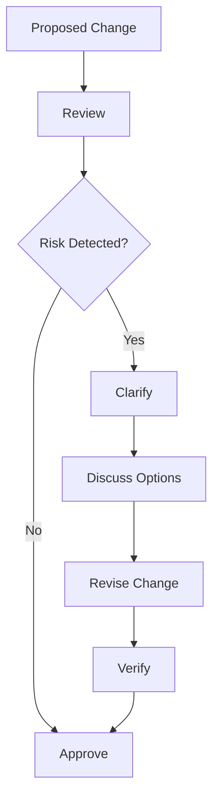
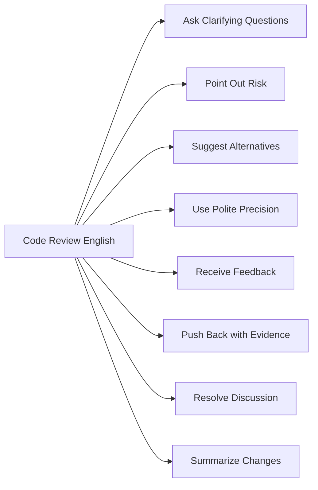
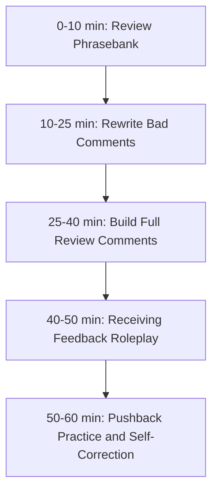

# English for Conversation Part 16 — Code Review Conversation

> Goal part ini: kamu bisa memberi dan menerima code review feedback dalam English secara **clear, respectful, specific, evidence-based, dan action-oriented**.

Code review adalah salah satu bentuk conversation paling penting dalam engineering team. Walaupun sering terjadi secara tertulis di pull request, pola komunikasinya tetap conversation: ada intent, interpretation, response, clarification, negotiation, dan decision.

Untuk English conversation, code review adalah latihan yang sangat bagus karena:

- konteksnya jelas,
- objek diskusinya konkret,
- feedback bisa disusun dengan pola berulang,
- ada banyak opportunity untuk self-correction,
- dan output-nya berdampak langsung pada kualitas software.

---

## 1. Target Performance

Setelah part ini, kamu harus mampu mengatakan hal seperti ini:

```text
I think this condition might be too broad.
It also matches inactive users, which could allow unauthorized access.
Can we add an explicit status check before returning the permission?
```

Atau ketika menerima feedback:

```text
Good catch.
I missed the inactive-user case.
I’ll add a guard and include a regression test for it.
```

Perhatikan bahwa code review conversation yang baik memiliki empat komponen:

```text
Observation → Risk/Reason → Suggestion → Agreement
```

Bukan hanya:

```text
This is wrong.
Fix this.
```

---

## 2. Mental Model: Code Review Is Risk Reduction

Code review bukan ritual untuk mencari salah orang. Code review adalah mekanisme untuk menurunkan risiko sebelum change masuk ke sistem.



Risiko yang biasa dicari:

| Risk Type | Example |
|---|---|
| correctness risk | logic salah, edge case tidak tertangani |
| security risk | authorization bypass, data exposure |
| reliability risk | retry salah, timeout tidak jelas |
| performance risk | query berat, loop mahal |
| maintainability risk | naming buruk, coupling tinggi |
| observability risk | log/metric tidak cukup |
| compatibility risk | breaking change |
| operational risk | rollback sulit, migration berbahaya |

English review yang bagus menyebut risiko secara spesifik.

---

## 3. Sub-Skill Decomposition

Code review conversation terdiri dari beberapa sub-skill.



Kita akan mulai dari pattern yang paling sering dipakai:

1. asking for clarification,
2. giving feedback,
3. suggesting changes,
4. receiving feedback,
5. pushing back professionally.

---

## 4. Review Comment Anatomy

A strong review comment has this structure:

```text
<Observation>
<Reason / Risk>
<Suggestion or Question>
```

Example:

```text
This condition only checks whether the user exists.
It does not verify whether the user is active, so inactive users might still pass the permission check.
Can we include the user status in this condition?
```

### 4.1 Anatomy Breakdown

| Component | Function |
|---|---|
| Observation | What exactly do you see? |
| Reason/Risk | Why does it matter? |
| Suggestion/Question | What should happen next? |

This avoids two common problems:

1. feedback sounds personal,
2. feedback is too vague to act on.

---

## 5. Asking Clarifying Questions

Sometimes you are not sure whether code is wrong. Do not accuse. Ask.

### 5.1 Clarification Patterns

```text
Can you clarify why we need this check here?
Can you walk me through this part?
What case is this branch handling?
Is this meant to support backward compatibility?
Do we expect this value to be nullable?
What happens if the list is empty?
```

### 5.2 Stronger Technical Clarification

```text
Is this function expected to be idempotent?
Do we guarantee that this event is processed only once?
Could this endpoint be called by unauthenticated users?
Does this migration run before or after the application deployment?
Are we relying on ordering here?
```

### 5.3 Avoid Accusatory Questions

Risky:

```text
Why did you write it like this?
```

Better:

```text
Can you share the reasoning behind this approach?
```

Risky:

```text
Why didn’t you add a test?
```

Better:

```text
Can we add a test for this edge case?
```

Risky:

```text
Did you forget null handling?
```

Better:

```text
What should happen if this value is null?
```

---

## 6. Giving Feedback with Polite Precision

Politeness without precision is weak. Precision without politeness can sound rude.

The target is both.

### 6.1 Feedback Severity Ladder

| Severity | Pattern | Example |
|---|---|---|
| Minor | “Nit:” | “Nit: maybe rename this to `activeUsers` for clarity.” |
| Suggestion | “Consider…” | “Consider extracting this into a helper function.” |
| Concern | “I’m concerned that…” | “I’m concerned that this can return stale data.” |
| Risk | “This might…” | “This might allow inactive users to access the feature.” |
| Blocker | “I think we should address this before merging.” | “I think we should address the authorization check before merging.” |

### 6.2 Common Review Verbs

| Verb | Use |
|---|---|
| clarify | make meaning clearer |
| extract | move logic out |
| simplify | reduce complexity |
| rename | improve naming |
| validate | check input/assumption |
| guard | protect edge case |
| handle | cover scenario |
| avoid | prevent risk |
| verify | confirm behavior |
| document | explain decision |

Examples:

```text
Can we clarify the naming here?
Can we extract this validation into a separate function?
Can we guard against an empty list?
Can we verify this behavior with a regression test?
```

---

## 7. Commenting on Correctness

Correctness feedback must be specific.

### 7.1 Patterns

```text
This condition might not cover <case>.
This branch also matches <unexpected case>.
This assumes that <assumption>, but that may not always be true.
This can fail when <condition>.
This does not handle <edge case>.
```

Examples:

```text
This condition might not cover users with expired subscriptions.
This branch also matches inactive accounts.
This assumes that the payload always contains `user_id`, but staging uses `sub`.
This can fail when the list is empty.
This does not handle duplicate events.
```

### 7.2 Add the Risk

Weak:

```text
This does not handle null.
```

Better:

```text
This does not handle null. If the external API omits this field, the service will throw before we can return a meaningful error.
```

Weak:

```text
This condition is wrong.
```

Better:

```text
This condition also matches inactive users, which could allow access after an account is disabled.
```

---

## 8. Commenting on Tests

Tests are frequent in review conversation.

### 8.1 Asking for Tests

```text
Can we add a test for this edge case?
Can we include a regression test for the bug we fixed?
Can we add a negative test for unauthorized users?
Can we verify the empty-list case?
Can we cover the retry path?
```

### 8.2 Explaining Why a Test Matters

```text
This test would prevent the bug from coming back.
This case is easy to break during refactoring.
The behavior is security-sensitive, so I think it should be covered.
This documents the expected behavior better than a comment.
```

### 8.3 When a Test Is Too Coupled

```text
This test seems tightly coupled to the implementation.
Can we assert the observable behavior instead?
```

This is a high-value phrase. It shifts the review from “your test is bad” to “let’s test the contract, not the implementation”.

---

## 9. Commenting on Naming and Readability

Naming feedback should be light unless it affects correctness.

### 9.1 Naming Patterns

```text
Could we rename this to make the intent clearer?
This name sounds a bit broad.
Maybe `eligibleUsers` would be more precise than `users`.
I initially thought this meant <meaning>. Would a more specific name help?
```

### 9.2 Readability Patterns

```text
This part is a bit hard to follow.
Can we split it into smaller steps?
Can we extract the condition into a named variable?
Can we reduce the nesting here?
```

### 9.3 Example

Weak:

```text
Bad name.
```

Better:

```text
Could we rename `data` to `activeSubscriptions`? That would make the intent easier to follow.
```

---

## 10. Commenting on Performance

Performance feedback should avoid vague claims like “this is slow” unless measured.

### 10.1 Patterns

```text
This might create an N+1 query.
This loops over all records before filtering.
This could be expensive for large tenants.
Do we have an upper bound for this list?
Can we push this filtering to the database?
Should we add pagination here?
```

### 10.2 Evidence-Based Performance Feedback

Weak:

```text
This is inefficient.
```

Better:

```text
This loads all records into memory before filtering. For large tenants, this could increase latency and memory usage. Can we apply the filter in the query instead?
```

### 10.3 When You Are Not Sure

```text
I’m not sure this is a problem at our current scale, but this might become expensive if the list grows.
```

This phrase is useful because it avoids overstating risk.

---

## 11. Commenting on Security and Authorization

Security feedback can be direct, but should remain precise.

### 11.1 Patterns

```text
Can this endpoint be called by unauthenticated users?
Where do we verify the caller’s permission?
This seems to trust client-provided data.
Can we validate this server-side?
This might expose data across tenants.
This could allow users to access resources they do not own.
```

### 11.2 Strong Blocker Language

```text
I think this should block the merge until we verify the authorization check.
This path is security-sensitive, so I’d prefer not to rely on client-side validation.
We should confirm tenant isolation before merging this.
```

Security is one place where soft language should not hide risk.

---

## 12. Commenting on Reliability and Operations

Operationally mature review comments think beyond “does it work locally?”

### 12.1 Reliability Patterns

```text
What happens if this external service is unavailable?
Do we need a timeout here?
Should this operation be retried?
Is this retry idempotent?
Can this create duplicate messages?
What happens if the job fails halfway?
```

### 12.2 Observability Patterns

```text
Can we add a log for this failure path?
Do we have a metric for this case?
How would we know if this starts failing in production?
Can we include the request id in the log?
```

### 12.3 Rollback and Migration Patterns

```text
Is this migration backward compatible?
Can the old version still run after this schema change?
What is the rollback plan?
Do we need to deploy this in two phases?
```

This is where senior-level review English becomes visible.

---

## 13. Receiving Feedback Without Defensiveness

Receiving feedback well is a conversation skill. The goal is to clarify, learn, and resolve.

### 13.1 Useful Responses

```text
Good catch.
That makes sense.
I missed that edge case.
I’ll update it.
I’ll add a regression test.
Let me check that assumption.
I’ll push a follow-up commit.
```

### 13.2 When You Need Clarification

```text
Can you clarify what case you’re concerned about?
Do you mean this can fail when the input is null?
Are you suggesting we move this logic to the service layer?
Can you give an example of the scenario you have in mind?
```

### 13.3 When You Agree

```text
Agreed. I’ll rename it for clarity.
Good point. I’ll add the empty-list case.
That makes sense. I’ll move the validation server-side.
```

### 13.4 When You Need Time

```text
Let me think through the trade-off.
I’ll check the behavior and get back with an update.
I want to verify this locally before changing it.
```

Avoid:

```text
But it works on my machine.
That is not a problem.
I copied it from another file.
```

These responses may be true, but they do not move the review forward.

---

## 14. Pushing Back Professionally

Sometimes reviewer feedback is not right, not worth it, or has trade-offs. You can push back.

### 14.1 Pushback Pattern

```text
I see the concern.
My reasoning was <reason>.
The trade-off is <trade-off>.
Would you be okay with <alternative>?
```

Example:

```text
I see the concern about extracting this function.
My reasoning was to keep the validation close to the handler because it is only used here.
The trade-off is that the handler becomes a bit longer.
Would you be okay if I extract only the condition into a named variable?
```

### 14.2 Evidence-Based Pushback

```text
I checked the call sites, and this function is only used after authentication.
So I don’t think this specific path is reachable by anonymous users.
I’ll add a comment or test to make that clearer.
```

### 14.3 Disagreeing with a Suggested Implementation

```text
I agree with the problem, but I’m not sure about this implementation.
It might increase coupling between the service and repository.
Could we solve it by passing the required field explicitly instead?
```

Notice the pattern:

```text
agree with concern → question implementation → offer alternative
```

This is mature engineering conversation.

---

## 15. Resolving a Review Thread

A review thread should not end in ambiguity.

### 15.1 Resolution Phrases

```text
Updated in the latest commit.
I added a regression test for this case.
I renamed the variable to make the intent clearer.
I moved the validation to the service layer.
I checked the call sites and added a note in the PR description.
```

### 15.2 When You Do Not Change the Code

```text
I checked this and decided to keep the current approach because <reason>.
I added a comment to explain the trade-off.
Let me know if you still think we should change it.
```

### 15.3 When You Need a Decision

```text
There are two options here.
Option A is simpler but less flexible.
Option B is more extensible but adds complexity.
I recommend Option A for now because this is only used in one place.
Are you okay with that direction?
```

---

## 16. Common Code Review Phrases by Intent

### 16.1 Ask

```text
Can you clarify this part?
Can you walk me through the reason for this change?
What happens if this value is missing?
Do we need to handle this case?
```

### 16.2 Suggest

```text
Consider extracting this into a helper.
Maybe we can simplify this condition.
Could we rename this for clarity?
Can we add a guard here?
```

### 16.3 Warn

```text
This might break existing clients.
This could create duplicate events.
This may expose data across tenants.
This assumes the list is never empty.
```

### 16.4 Block

```text
I think we should address this before merging.
I’d prefer not to merge this until we verify the authorization path.
This looks risky without a rollback plan.
```

### 16.5 Accept

```text
Looks good to me.
Thanks for updating this.
This is much clearer now.
I’m good with this approach.
```

---

## 17. Dialogue Example: Reviewer and Author

```text
Reviewer: Can you clarify why we skip the status check here?

Author: The caller already filters inactive users before calling this function.

Reviewer: Got it. Is that guaranteed for all call sites?

Author: Good question. Let me check.

Author: I checked the call sites. One path comes from the admin endpoint and does not filter inactive users.

Reviewer: In that case, this function might allow inactive users to pass the permission check.

Author: Good catch. I’ll add the status check here and include a regression test.

Reviewer: Sounds good. Once that’s added, I’m happy to approve.
```

Patterns:

- reviewer asks, not accuses,
- author checks assumption,
- reviewer states risk,
- author accepts and acts,
- thread resolves clearly.

---

## 18. Dialogue Example: Professional Pushback

```text
Reviewer: Can we extract this into a shared utility?

Author: I see why that seems useful.
My concern is that the validation rules are slightly different between the two flows.
If we extract it too early, we might hide those differences.

Reviewer: That makes sense. What do you suggest?

Author: I can extract the common condition into a named helper, but keep the flow-specific validation separate.

Reviewer: That sounds like a good compromise.
```

Patterns:

- acknowledge concern,
- explain trade-off,
- propose compromise,
- reach agreement.

---

## 19. Review Comment Quality Scale

Use this scale to self-correct your English review comments.

| Level | Comment | Quality |
|---|---|---|
| 1 | “Wrong.” | rude, vague |
| 2 | “This is wrong.” | still vague |
| 3 | “This does not handle null.” | specific but minimal |
| 4 | “This does not handle null. It can throw when the API omits the field.” | specific with risk |
| 5 | “This does not handle null. If the API omits the field, this can throw before we return a meaningful error. Can we add a guard and a test for the missing-field case?” | clear, actionable, professional |

Aim for level 4–5 in important comments.

---

## 20. Anti-Patterns

### 20.1 Personalizing the Feedback

Avoid:

```text
You forgot to validate this.
You wrote this wrong.
Your code is confusing.
```

Better:

```text
This path does not validate the input.
This condition might not handle the edge case.
This part is a bit hard to follow.
```

Focus on code, behavior, and risk.

### 20.2 Hiding the Actual Concern

Too soft:

```text
Maybe we can maybe think about this?
```

Better:

```text
I’m concerned that this path can bypass authorization.
Can we verify the permission check before merging?
```

Do not soften critical risk until it becomes invisible.

### 20.3 Vague Approval

Weak:

```text
LGTM.
```

Better:

```text
Looks good to me. The error handling and regression test cover the case I was concerned about.
```

Approval can also communicate what was verified.

---

## 21. Drill 1 — Rewrite Bad Review Comments

Rewrite each into professional English.

1. “Wrong condition.”
2. “Bad name.”
3. “Why no test?”
4. “This is slow.”
5. “You forgot auth.”
6. “This code is messy.”
7. “This will break.”
8. “Not good.”
9. “Fix this.”
10. “This function is too long.”

Example rewrite:

Bad:

```text
Why no test?
```

Better:

```text
Can we add a regression test for this edge case? This behavior is easy to break during refactoring.
```

---

## 22. Drill 2 — Build Full Review Comments

For each issue, write:

```text
Observation:
Risk:
Suggestion:
```

Issues:

1. An endpoint does not check tenant id.
2. A migration removes a column immediately.
3. A retry may process the same message twice.
4. A function accepts null but does not guard against it.
5. A query loads all records before filtering.
6. A variable is named `data`.
7. A test asserts implementation details.
8. Logs do not include request id.
9. The code assumes events arrive in order.
10. A feature flag is checked only in the frontend.

---

## 23. Drill 3 — Receiving Feedback

Respond professionally to each comment.

1. “Can we add a test for the inactive-user case?”
2. “This might create an N+1 query.”
3. “I’m not sure this naming is clear.”
4. “Can you explain why this belongs in the controller?”
5. “This seems risky without a rollback plan.”

Example:

```text
Good catch. I missed the inactive-user case.
I’ll add a guard and a regression test.
```

---

## 24. Drill 4 — Pushback Practice

Use this template:

```text
I see the concern.
My reasoning was...
The trade-off is...
Would you be okay with...?
```

Scenarios:

1. Reviewer asks to extract a utility, but the logic is only used once.
2. Reviewer asks for abstraction, but it would hide domain differences.
3. Reviewer suggests a larger refactor, but the PR is a hotfix.
4. Reviewer asks for performance optimization, but the dataset is bounded.
5. Reviewer wants a new dependency, but the team avoids adding libraries for small helpers.

---

## 25. Self-Correction Checklist

After writing or speaking in a code review, check:

| Question | Yes/No |
|---|---|
| Did I refer to code behavior instead of the person? | |
| Did I explain the risk or reason? | |
| Did I make the next action clear? | |
| Did I avoid vague words like “bad”, “wrong”, “messy”? | |
| Did I soften appropriately without hiding important risk? | |
| Did I ask when I was unsure instead of accusing? | |
| Did I resolve the thread clearly? | |

---

## 26. 60-Minute Practice Plan



### Practice Method

1. Pick a real or imaginary PR.
2. Write 5 review comments.
3. Rewrite each comment using:
   - observation,
   - risk,
   - suggestion.
4. Speak each comment aloud.
5. Record yourself.
6. Check whether your tone sounds accusatory, vague, or too soft.

---

## 27. High-Value Patterns to Memorize

```text
Can you clarify why...?
What happens if...?
This might not handle...
This assumes that...
Can we add a test for...?
Can we make the intent clearer?
I’m concerned that...
I think we should address this before merging.
Good catch.
I missed that edge case.
I’ll update it.
I see the concern, but...
Would you be okay with...?
Updated in the latest commit.
```

These patterns cover most real code review conversation needs.

---

## 28. Final Assignment

Create a simulated code review conversation.

Your scenario:

```text
A pull request adds a new permission check for a feature.
The code checks whether the user exists, but does not check whether the user is active.
There is no regression test.
```

Write and speak a conversation that includes:

1. reviewer asking a clarification question,
2. reviewer explaining the risk,
3. reviewer suggesting a test,
4. author accepting or pushing back,
5. final resolution.

Example opening:

```text
Can you clarify whether this function is expected to reject inactive users?
I’m asking because the current condition only checks whether the user exists.
```

---

## Part 16 Summary

Code review English is a high-leverage professional skill. The goal is not to sound fancy. The goal is to reduce risk while preserving trust.

A strong code review comment usually follows this structure:

```text
Observation → Risk/Reason → Suggestion/Question
```

A strong response to feedback follows this structure:

```text
Acknowledge → Clarify or Agree → Action
```

A strong pushback follows this structure:

```text
Acknowledge concern → Explain reasoning → Name trade-off → Offer alternative
```

Master these patterns and your code review conversations will become clearer, calmer, and more technically effective.

---
