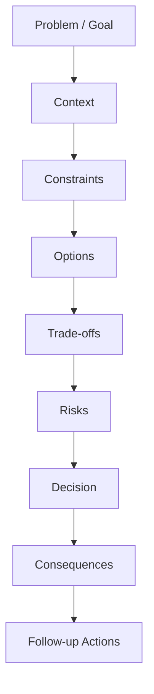
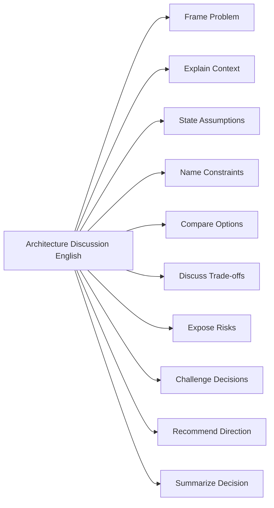
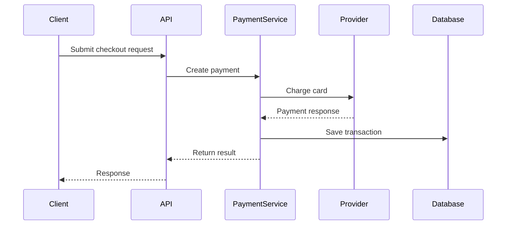
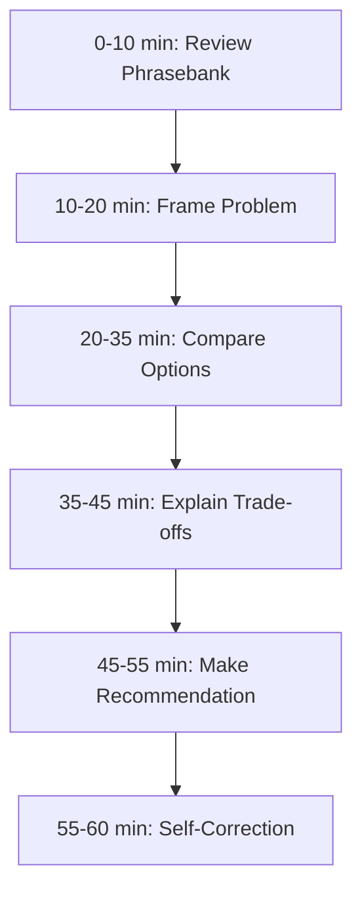

# English for Conversation Part 17 — Architecture Discussion and Design Review English

> Goal part ini: kamu bisa berpartisipasi dalam architecture discussion dan design review dalam English dengan jelas, terstruktur, evidence-based, dan matang secara engineering.

Architecture discussion berbeda dari daily update atau code review. Di sini, yang dibahas bukan hanya “kode ini benar atau salah”, tetapi:

- sistem seperti apa yang akan dibangun,
- constraint apa yang membatasi pilihan,
- trade-off apa yang diterima,
- risiko apa yang harus dimitigasi,
- dan keputusan apa yang perlu disepakati.

Dalam konteks software engineering, kemampuan English conversation untuk architecture discussion adalah skill senior. Kamu tidak hanya perlu bisa menjelaskan teknis, tetapi juga perlu bisa memimpin reasoning kolektif.

---

## 1. Target Performance

Setelah part ini, kamu harus mampu mengatakan hal seperti ini:

```text
The main trade-off is between operational simplicity and scalability.
Option A is easier to maintain because it keeps the workflow synchronous.
However, it may not handle peak traffic well.

Option B introduces a queue, which improves resilience and load smoothing,
but it also adds operational complexity and eventual consistency.

Given our current scale and the fact that this is not user-facing,
I recommend starting with Option A and adding clear extension points for async processing later.
```

Kalimat di atas menunjukkan beberapa kemampuan penting:

1. menjelaskan trade-off,
2. membandingkan opsi,
3. menyebut risk,
4. mengaitkan keputusan dengan constraint,
5. memberi rekomendasi,
6. dan menjaga ruang untuk future evolution.

Architecture English bukan tentang menggunakan kata-kata rumit. Ini tentang membuat struktur berpikir terlihat.

---

## 2. Mental Model: Architecture Discussion Is Decision Design

Architecture discussion bukan brainstorming bebas. Tujuan akhirnya adalah menghasilkan keputusan yang bisa dipertanggungjawabkan.



Setiap node membutuhkan language pattern:

| Stage | Conversation Function | Example |
|---|---|---|
| Problem | define what we solve | “The problem we’re trying to solve is delayed invoice processing.” |
| Context | align background | “This service currently processes requests synchronously.” |
| Constraint | name limitation | “The main constraint is that we cannot change the external API contract.” |
| Option | present alternative | “One option is to introduce a queue between the API and worker.” |
| Trade-off | compare consequences | “This improves resilience but adds eventual consistency.” |
| Risk | expose failure mode | “The main risk is duplicate processing.” |
| Decision | recommend direction | “I recommend Option B because reliability matters more here.” |
| Follow-up | define actions | “Next, we should validate retry and idempotency behavior.” |

If you can move through this sequence in English, you can participate in most technical design discussions.

---

## 3. Sub-Skill Decomposition

Following the Kaufman-style acquisition approach, we decompose architecture English into smaller sub-skills.



High-leverage sub-skills for the first 20 hours:

1. framing the problem,
2. comparing options,
3. explaining trade-offs,
4. stating assumptions,
5. summarizing decisions.

---

## 4. Framing the Problem

A bad architecture discussion often starts with solution talk:

```text
Let’s use Kafka.
Let’s use microservices.
Let’s add Redis.
Let’s make it event-driven.
```

A better discussion starts with the problem.

### 4.1 Problem Framing Patterns

```text
The problem we’re trying to solve is...
The main goal is...
The current pain point is...
The system currently struggles with...
We need a design that can...
```

Examples:

```text
The problem we’re trying to solve is delayed invoice processing during peak traffic.
The main goal is to reduce request latency without losing reliability.
The current pain point is that one slow external dependency blocks the whole workflow.
The system currently struggles with retrying failed jobs safely.
We need a design that can handle partial failures without duplicating transactions.
```

### 4.2 Scope Control

Architecture discussions can expand too much. Use scope language.

```text
For this discussion, I think we should focus on the processing flow, not the UI.
Let’s separate the data model question from the deployment question.
That is related, but maybe we should park it for a separate discussion.
The decision we need today is whether this should be synchronous or asynchronous.
```

Scope control is a sign of maturity.

---

## 5. Explaining Current Architecture

Before discussing a new design, align on the current system.

### 5.1 Current-State Patterns

```text
Currently, the request goes through...
At the moment, this service is responsible for...
The existing flow is...
This component owns...
This dependency is called during...
```

Example:

```text
Currently, the API receives the request, validates the payload, calls the payment provider synchronously, and then writes the result to the database.
```

### 5.2 Describing Flow

```text
First, the client sends...
Then, the gateway forwards...
After that, the service validates...
Finally, the worker processes...
```

Example:

```text
First, the client sends a checkout request.
Then, the API validates the user and creates an order.
After that, the payment service calls the provider.
Finally, the order service updates the order status.
```

### 5.3 Mermaid Diagram for Architecture Explanation



When explaining architecture verbally, diagrams reduce language burden. You do not need perfect English if the structure is clear.

---

## 6. Stating Assumptions

Architecture decisions are dangerous when assumptions stay hidden.

### 6.1 Assumption Patterns

```text
I’m assuming that...
This assumes that...
One assumption here is...
We should validate whether...
If this assumption is wrong, then...
```

Examples:

```text
I’m assuming that the external provider supports idempotency keys.
This assumes that events are delivered at least once.
One assumption here is that most requests can tolerate eventual consistency.
We should validate whether tenants can have custom retry rules.
If this assumption is wrong, then the async design may create a bad user experience.
```

### 6.2 Asking About Assumptions

```text
What assumptions are we making here?
Are we assuming this service owns the source of truth?
Do we know whether ordering is guaranteed?
Are we assuming the consumer is idempotent?
```

### 6.3 Assumption Risk Pattern

```text
This design depends on <assumption>.
If <assumption> is false, then <failure mode>.
So we should verify <validation step>.
```

Example:

```text
This design depends on the provider supporting idempotency keys.
If that is false, then retries could create duplicate charges.
So we should verify the provider contract before finalizing the design.
```

This is architecture conversation at a high level: assumption, consequence, validation.

---

## 7. Naming Constraints

Constraints are not excuses. They are design inputs.

### 7.1 Constraint Types

| Constraint Type | Example |
|---|---|
| business constraint | “We need to launch before the end of the quarter.” |
| technical constraint | “We cannot change the legacy schema yet.” |
| operational constraint | “The team does not operate Kafka today.” |
| compliance constraint | “We need an audit trail for every state transition.” |
| performance constraint | “The endpoint must respond under 300 ms.” |
| migration constraint | “We need backward compatibility during rollout.” |
| organizational constraint | “Two teams own different parts of the flow.” |

### 7.2 Constraint Patterns

```text
The main constraint is...
We are limited by...
We cannot assume that...
We need to preserve...
This has to remain compatible with...
```

Examples:

```text
The main constraint is that we cannot break existing clients.
We are limited by the provider’s rate limit.
We cannot assume that events arrive in order.
We need to preserve the audit trail for compliance.
This has to remain compatible with the current mobile app version.
```

### 7.3 Turning Constraint into Design Criteria

```text
Because we need auditability, every state transition should be explicit.
Because rollback is important, the migration should be backward compatible.
Because the provider is unreliable, the workflow should tolerate retries and timeouts.
```

This connects design choices to real constraints.

---

## 8. Comparing Options

Most architecture discussions involve options. Avoid presenting only your favorite solution.

### 8.1 Option Framing Pattern

```text
I see three possible options.
Option A is...
Option B is...
Option C is...
The main difference is...
```

Example:

```text
I see three possible options.
Option A is to keep the flow synchronous.
Option B is to introduce a queue between the API and the worker.
Option C is to split the workflow into separate state transitions.
The main difference is how much complexity we introduce now versus later.
```

### 8.2 Comparison Table Language

```text
Compared to Option A, Option B gives us better resilience.
The downside is that it introduces eventual consistency.
Option C is the most flexible, but it is also the most complex.
```

### 8.3 Option Evaluation Criteria

Use stable engineering criteria:

| Criterion | Question |
|---|---|
| correctness | Does it preserve expected behavior? |
| reliability | What happens during partial failure? |
| scalability | Can it handle growth? |
| operability | Can the team run it? |
| observability | Can we detect failure? |
| migration | Can we roll it out safely? |
| cost | Is the complexity justified? |
| compliance | Can we defend the decision? |

---

## 9. Discussing Trade-Offs

Trade-off language is central to architecture English.

### 9.1 Core Trade-Off Patterns

```text
The trade-off is...
This improves <benefit>, but it increases <cost>.
We gain <advantage>, but we lose <disadvantage>.
This is simpler operationally, but less flexible.
This is more scalable, but harder to debug.
```

Examples:

```text
The trade-off is between simplicity and resilience.
This improves throughput, but it increases operational complexity.
We gain better isolation, but we lose some transactional simplicity.
This is simpler operationally, but less flexible for future workflows.
This is more scalable, but harder to debug because failures become asynchronous.
```

### 9.2 Avoid Fake Trade-Offs

Weak:

```text
Kafka is better.
```

Better:

```text
Kafka gives us durable event processing and better load smoothing, but it adds infrastructure and operational complexity that the team must own.
```

Weak:

```text
Microservices are more scalable.
```

Better:

```text
Splitting the service can improve team autonomy and independent scaling, but it introduces distributed failure modes, network latency, and data consistency challenges.
```

---

## 10. Discussing Scalability

Scalability should be described precisely. Avoid generic “it scales”.

### 10.1 Scalability Patterns

```text
This design scales horizontally because...
The bottleneck is likely to be...
At higher traffic, this component may become...
We can scale this independently from...
This reduces load on...
```

Examples:

```text
This design scales horizontally because workers can process jobs independently.
The bottleneck is likely to be the provider rate limit, not the database.
At higher traffic, the synchronous API call may become the main latency driver.
We can scale the worker independently from the API.
This reduces load on the checkout service during peak traffic.
```

### 10.2 Capacity Questions

```text
What is the expected request volume?
What is the peak traffic pattern?
Do we know the upper bound?
Which component becomes the bottleneck first?
Can this be scaled independently?
```

---

## 11. Discussing Reliability

Reliability discussion focuses on failure modes.

### 11.1 Reliability Patterns

```text
What happens if <component> fails?
How does the system recover from <failure>?
Can this operation be retried safely?
Do we need idempotency here?
What is the fallback behavior?
```

Examples:

```text
What happens if the provider times out after charging the card?
How does the system recover if the worker crashes halfway?
Can this operation be retried safely?
Do we need idempotency here to prevent duplicate transactions?
What is the fallback behavior if the config service is unavailable?
```

### 11.2 Failure Mode Explanation

```text
The failure mode I’m worried about is...
If this fails after <step>, then...
The worst case is...
```

Example:

```text
The failure mode I’m worried about is duplicate processing.
If the worker saves the transaction but crashes before acknowledging the message,
the message may be retried and processed again.
```

That is clear, concrete, and defensible.

---

## 12. Discussing Consistency

Consistency is often hard to explain in conversation.

### 12.1 Consistency Patterns

```text
This design gives us strong consistency between...
This design introduces eventual consistency between...
There may be a short window where...
The user might see stale data until...
We need to decide whether that is acceptable.
```

Examples:

```text
This design gives us strong consistency between order creation and payment creation.
This design introduces eventual consistency between payment status and order status.
There may be a short window where the order is created but the payment is still pending.
The user might see stale data until the worker updates the status.
We need to decide whether that is acceptable for this workflow.
```

### 12.2 Key Question

```text
Where do we need strong consistency, and where can we tolerate eventual consistency?
```

This is one of the most valuable architecture discussion questions.

---

## 13. Challenging a Design Choice

Challenging design is not the same as attacking the designer.

### 13.1 Challenge Patterns

```text
Can we revisit the assumption that...?
I’m not fully convinced that this needs...
My concern with this approach is...
What would happen if...?
Have we considered...?
```

Examples:

```text
Can we revisit the assumption that ordering is guaranteed?
I’m not fully convinced that this needs a new service yet.
My concern with this approach is that it adds async failure modes.
What would happen if the provider returns success but our database write fails?
Have we considered a simpler phased rollout?
```

### 13.2 Stronger Challenge

```text
I think this design may be too complex for the current problem.
The operational cost seems higher than the benefit at our current scale.
Can we start with a simpler design and keep the extension point open?
```

Strong pushback is acceptable when it is tied to complexity, cost, risk, or constraints.

---

## 14. Making Recommendations

A recommendation should include reasoning.

### 14.1 Recommendation Pattern

```text
Given <context/constraint>,
I recommend <option>
because <reason>.
The main risk is <risk>,
so we should <mitigation>.
```

Example:

```text
Given our current traffic and the fact that this workflow is not user-facing,
I recommend keeping it synchronous for now
because it is simpler to operate and easier to debug.
The main risk is that it may not handle peak traffic later,
so we should keep the processing boundary clean enough to move it async later.
```

### 14.2 When You Are Uncertain

```text
I lean toward Option B, but I think we should validate the provider behavior first.
I don’t have a strong preference yet. The decision depends on whether we need strict ordering.
I would recommend Option A unless the volume estimate is higher than expected.
```

This is better than pretending certainty.

---

## 15. Summarizing Decisions

Architecture discussions often fail because no one summarizes the decision.

### 15.1 Decision Summary Template

```text
Let me summarize the decision.
We decided to <decision>.
The main reason is <reason>.
The trade-off is <trade-off>.
The risks are <risks>.
The follow-up actions are <actions>.
```

Example:

```text
Let me summarize the decision.
We decided to keep the API synchronous for the first release.
The main reason is operational simplicity.
The trade-off is that we may need to revisit this when traffic grows.
The main risk is provider latency during peak traffic.
The follow-up action is to add metrics around provider response time and checkout latency.
```

### 15.2 ADR-Friendly Summary

```text
Context:
Decision:
Consequences:
Risks:
Follow-ups:
```

Spoken version:

```text
For the ADR, I think we should capture the context, the decision, the consequences, the main risks, and the follow-up actions.
```

---

## 16. Architecture Discussion Phrasebank

### 16.1 Framing

```text
The problem we’re solving is...
The goal of this design is...
The main constraint is...
The decision we need today is...
```

### 16.2 Assumptions

```text
I’m assuming that...
This design depends on...
We should validate whether...
If that assumption is wrong...
```

### 16.3 Options

```text
I see two possible options.
Option A is...
Option B is...
The main difference is...
```

### 16.4 Trade-Offs

```text
The trade-off is...
This improves..., but it adds...
We gain..., but we lose...
The cost of this approach is...
```

### 16.5 Risk

```text
The failure mode I’m worried about is...
The main risk is...
This could break if...
We can mitigate that by...
```

### 16.6 Decision

```text
I recommend...
I lean toward...
Given the constraints, I think...
Let’s decide whether...
```

### 16.7 Summary

```text
Let me summarize where we landed.
We agreed to...
The open question is...
The next step is...
```

---

## 17. Dialogue Example: Synchronous vs Asynchronous Processing

```text
A: The current design calls the payment provider synchronously during checkout.

B: The problem is that provider latency can slow down the whole checkout flow.

A: Right. One option is to keep it synchronous and add better timeout handling.
Another option is to move payment processing to a queue.

B: The async option improves resilience, but it introduces eventual consistency.
The user may see the order as pending for a short period.

A: Do we know whether that is acceptable from a product perspective?

B: Not yet. That is an assumption we need to validate.

A: Given that, I would not move fully async yet.
I recommend keeping the first release synchronous, adding metrics, and designing the boundary so we can move it async later.

B: That makes sense. Let’s capture that as the decision and add a follow-up to validate product tolerance for pending state.
```

Patterns:

- “One option is… Another option is…”
- “The async option improves…, but…”
- “Do we know whether…?”
- “That is an assumption we need to validate.”
- “I recommend…”

---

## 18. Dialogue Example: Challenging Over-Engineering

```text
A: I propose splitting this into three services: workflow, notification, and audit.

B: Can we revisit whether we need three services for the first release?

A: Why do you think that might be too much?

B: My concern is operational complexity.
Right now, the workflow is used by one product area, and the traffic is low.
Splitting it gives us independent scaling, but it also introduces distributed tracing, deployment coordination, and cross-service failure modes.

A: That’s fair. What would you suggest?

B: I’d start with a modular monolith boundary.
We can separate the modules internally and extract a service later if the scaling or ownership pressure becomes real.

A: That seems reasonable.
```

This is a useful pattern for senior engineers: challenge complexity without dismissing future scalability.

---

## 19. Common Mistakes

### 19.1 Jumping to Technology

Weak:

```text
We should use Kafka.
```

Better:

```text
If we need durable async processing and load smoothing, Kafka is one option.
But we should first confirm whether the workflow requires async processing.
```

### 19.2 Overclaiming

Weak:

```text
This will scale.
```

Better:

```text
This should scale horizontally at the worker layer, but the provider rate limit may still be the bottleneck.
```

### 19.3 Hiding Uncertainty

Weak:

```text
This is definitely the best approach.
```

Better:

```text
Given what we know now, this seems like the best trade-off. The main assumption we still need to validate is traffic volume.
```

### 19.4 No Decision Summary

Weak ending:

```text
Okay, cool.
```

Better ending:

```text
Let me summarize. We’re choosing Option A for the first release, mainly for operational simplicity. We’ll add metrics and revisit async processing if latency becomes a problem.
```

---

## 20. Drill 1 — Problem Framing

Rewrite each solution-first statement into problem-first English.

1. “Let’s use Redis.”
2. “We need Kafka.”
3. “Let’s split this service.”
4. “We should add GraphQL.”
5. “Let’s rewrite this module.”

Example:

```text
Solution-first:
We need Kafka.

Problem-first:
The problem is that the synchronous flow cannot absorb traffic spikes.
If we need durable async processing, Kafka is one option, but we should compare it with simpler queue-based alternatives.
```

---

## 21. Drill 2 — Trade-Off Construction

Use this template:

```text
This improves <benefit>, but it increases <cost>.
```

Prompts:

1. Add a queue.
2. Split into microservices.
3. Use caching.
4. Add retries.
5. Use eventual consistency.
6. Add an abstraction layer.
7. Denormalize data.
8. Add a feature flag.
9. Introduce a workflow engine.
10. Move validation to the backend.

---

## 22. Drill 3 — Assumption and Risk

Use this template:

```text
This design assumes that <assumption>.
If that assumption is wrong, <failure mode>.
We should validate it by <action>.
```

Prompts:

1. Events arrive in order.
2. Provider supports idempotency.
3. Traffic remains low.
4. Users can tolerate pending status.
5. The old client version is no longer used.
6. The retry operation is safe.
7. The database migration is backward compatible.
8. Logs contain enough data to debug failures.

---

## 23. Drill 4 — Recommendation Practice

Use this template:

```text
Given <constraint>,
I recommend <option>
because <reason>.
The main risk is <risk>,
so we should <mitigation>.
```

Scenarios:

1. Low traffic, small team, strict launch deadline.
2. High traffic, external provider latency, user-facing flow.
3. Compliance-heavy workflow requiring audit trail.
4. Legacy clients still active.
5. Unclear traffic estimate.
6. Complex workflow with many state transitions.

---

## 24. Self-Correction Checklist

After an architecture discussion, evaluate yourself:

| Area | Question | Score |
|---|---|---|
| Problem framing | Did I define the problem before the solution? | 1–5 |
| Context | Did I explain current state clearly? | 1–5 |
| Assumptions | Did I expose assumptions? | 1–5 |
| Constraints | Did I name real constraints? | 1–5 |
| Options | Did I compare more than one option? | 1–5 |
| Trade-offs | Did I explain benefits and costs? | 1–5 |
| Risk | Did I name failure modes? | 1–5 |
| Decision | Did I recommend or summarize a direction? | 1–5 |

Pick one weak area for the next practice session.

---

## 25. 60-Minute Practice Plan



### Practice Scenario

Design a notification system for a product that sends email, SMS, and in-app notifications.

Practice explaining:

1. current problem,
2. constraints,
3. two design options,
4. trade-offs,
5. failure modes,
6. recommendation,
7. decision summary.

---

## 26. Final Assignment

Record a 7-minute architecture discussion monologue.

Topic:

```text
Should a payment processing workflow remain synchronous or move to asynchronous processing?
```

Your answer must include:

1. problem statement,
2. current-state explanation,
3. at least two options,
4. at least three trade-offs,
5. at least two assumptions,
6. at least two risks,
7. final recommendation,
8. decision summary.

Use this closing:

```text
Given these constraints, my recommendation is...
The main trade-off is...
The main risk is...
The next step is...
```

---

## Part 17 Summary

Architecture discussion English is decision-oriented language.

The most important patterns are:

```text
The problem we’re trying to solve is...
The main constraint is...
This assumes that...
One option is...
The trade-off is...
The failure mode I’m worried about is...
Given the constraints, I recommend...
Let me summarize the decision.
```

Master these and you can participate in serious design reviews with clarity, even if your English is not perfect.

---
