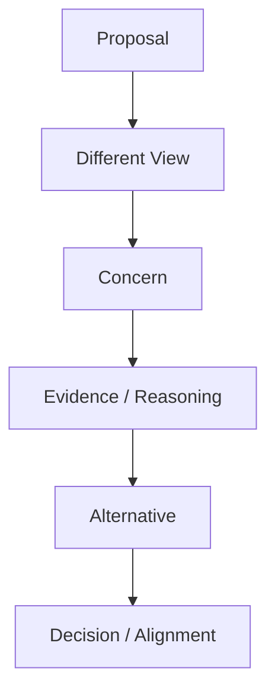
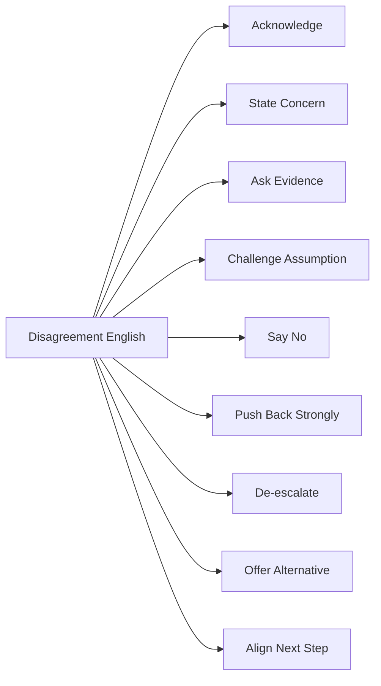
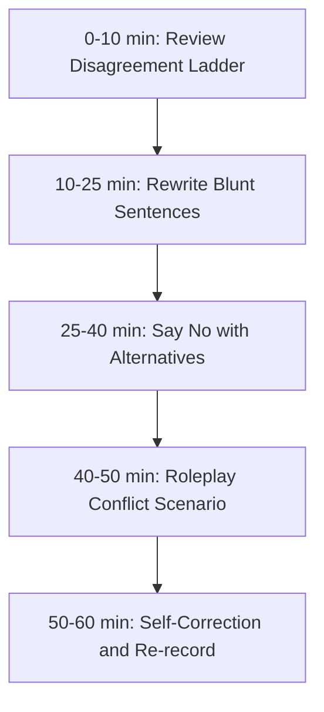

# English for Conversation Part 18 — Disagreement, Pushback, and Conflict Without Sounding Rude

> Goal part ini: kamu bisa disagree, push back, challenge assumptions, say no, dan menangani tension dalam English tanpa terdengar kasar, pasif-agresif, atau defensif.

Dalam engineering, disagreement bukan masalah. Justru banyak keputusan bagus muncul karena ada orang yang berani bertanya:

- “Are we solving the right problem?”
- “Is this complexity justified?”
- “What happens if this fails?”
- “Do we have evidence for that assumption?”
- “Should we block the release?”

Masalahnya bukan disagreement. Masalahnya adalah cara disagreement disampaikan.

Part ini membangun skill untuk menyampaikan ketidaksetujuan secara jelas, kuat, dan tetap profesional.

---

## 1. Target Performance

Setelah part ini, kamu harus mampu mengatakan hal seperti ini:

```text
I understand why this approach is attractive.
It keeps the first version simple.

My concern is that it does not give us a safe rollback path.
If the migration fails halfway, we may leave the system in an inconsistent state.

I don’t think we should deploy this until we have a rollback plan.
```

Kalimat ini kuat, tetapi tidak kasar. Struktur berpikirnya jelas:

1. acknowledge,
2. state concern,
3. explain risk,
4. make recommendation.

Itulah pola utama part ini.

---

## 2. Mental Model: Disagreement Is Risk Communication

Disagreement dalam engineering sebaiknya tidak dipahami sebagai “saya melawan kamu”. Lebih tepat:

```text
I am surfacing a risk that may not be visible yet.
```



Good disagreement membantu tim melihat:

- hidden assumptions,
- edge cases,
- failure modes,
- cost of complexity,
- migration risks,
- user impact,
- operational burden.

Bad disagreement membuat orang defensif dan mengaburkan masalah sebenarnya.

---

## 3. Sub-Skill Decomposition

Following the Kaufman-style approach, kita pecah skill ini menjadi beberapa sub-skill kecil.



High-leverage sub-skills:

1. acknowledge before disagreeing,
2. state concern clearly,
3. ask evidence-based questions,
4. say no professionally,
5. offer alternatives.

---

## 4. The Disagreement Ladder

Tidak semua disagreement butuh tingkat kekuatan yang sama.

| Level | Use When | Phrase |
|---|---|---|
| 1. Soft concern | low risk, early discussion | “I wonder if…” |
| 2. Mild disagreement | you see a possible issue | “I’m not sure that…” |
| 3. Clear concern | meaningful risk | “My concern is…” |
| 4. Strong pushback | high risk | “I don’t think we should…” |
| 5. Blocker | severe risk | “I think this should block the release until…” |

### 4.1 Level 1 — Soft Concern

```text
I wonder if this might become hard to maintain later.
Could there be a simpler way to handle this?
Maybe we should consider the migration path as well.
```

### 4.2 Level 2 — Mild Disagreement

```text
I’m not sure this solves the root cause.
I’m not fully convinced that we need a new service for this.
I see the idea, but I’m not sure the trade-off is worth it.
```

### 4.3 Level 3 — Clear Concern

```text
My concern is that this can create duplicate messages.
I’m concerned that this bypasses the existing authorization check.
The risk I see is that rollback becomes difficult.
```

### 4.4 Level 4 — Strong Pushback

```text
I don’t think we should deploy this without a rollback plan.
I don’t think this is safe to merge until we verify tenant isolation.
I would push back on adding this dependency for such a small use case.
```

### 4.5 Level 5 — Blocker

```text
I think this should block the release until the authorization issue is fixed.
I don’t think we can approve this design without an audit trail.
This is a security-sensitive path, so I think we need explicit validation before merging.
```

The ladder helps you avoid two bad extremes:

- too soft when the risk is serious,
- too aggressive when the issue is minor.

---

## 5. Acknowledge Without Agreeing

Acknowledge does not mean agree. It means you understand the other person’s reasoning.

### 5.1 Acknowledgment Patterns

```text
I see why you prefer this approach.
That makes sense from a simplicity perspective.
I understand the goal.
I agree with the problem we’re trying to solve.
I see the benefit of doing it this way.
```

### 5.2 Then Disagree

```text
I see why you prefer this approach.
My concern is the operational cost.

I agree with the problem we’re trying to solve.
I’m not sure this solution is the right level of complexity.

That makes sense from a short-term delivery perspective.
The risk is that we may create a difficult migration later.
```

This pattern prevents unnecessary defensiveness.

---

## 6. State Concern Clearly

Many people soften disagreement so much that the actual concern disappears.

Weak:

```text
Maybe maybe we can think again?
```

Better:

```text
My concern is that this design makes rollback difficult.
```

### 6.1 Concern Patterns

```text
My concern is...
The risk I see is...
The part that worries me is...
I’m worried that...
This could become a problem if...
```

Examples:

```text
My concern is that the retry is not idempotent.
The risk I see is duplicate payment processing.
The part that worries me is the lack of rollback path.
I’m worried that this introduces a cross-team dependency.
This could become a problem if traffic grows faster than expected.
```

### 6.2 Concern Should Point to Consequence

Weak:

```text
I don’t like this.
```

Better:

```text
I’m concerned that this makes the service harder to operate because failures will be split across three components.
```

Engineering disagreement must be tied to consequence.

---

## 7. Ask for Evidence Without Sounding Hostile

Sometimes you need to challenge a claim.

Risky:

```text
Where is your proof?
```

Better:

```text
Do we have data to support that assumption?
```

### 7.1 Evidence Questions

```text
Do we have data for that?
What evidence do we have that this is the bottleneck?
Have we measured the current latency?
Do we know how often this case happens?
Can we validate this before committing to the design?
```

### 7.2 Assumption Questions

```text
What assumption are we making here?
Are we assuming that traffic will stay low?
Are we assuming that events arrive in order?
Are we assuming that the client will always send this field?
What happens if that assumption is wrong?
```

### 7.3 Soft Challenge Pattern

```text
I might be missing something, but do we have evidence that <claim>?
```

Example:

```text
I might be missing something, but do we have evidence that the database is the bottleneck?
```

Use this when you want to challenge without sounding dismissive.

---

## 8. Saying No Professionally

Saying no is necessary. The key is to include reason, boundary, and alternative.

### 8.1 No Pattern

```text
I don’t think we should <action>
because <reason>.
Instead, I suggest <alternative>.
```

Examples:

```text
I don’t think we should deploy this today because we have not tested the rollback path.
Instead, I suggest we run the migration in staging and verify the recovery plan first.
```

```text
I don’t think we should add a new dependency for this small helper.
Instead, I suggest keeping the implementation local until the pattern appears in more places.
```

### 8.2 Softer No

```text
I’d prefer not to do that yet.
I don’t think that is the right trade-off right now.
I would avoid that for the first version.
```

### 8.3 Strong No

```text
I don’t think this is safe to ship as-is.
I can’t support this release without an authorization check.
I would not approve this until the audit trail is covered.
```

Strong no is appropriate for security, compliance, data loss, and severe operational risk.

---

## 9. Pushback on Scope

Scope conflict is common in software projects.

### 9.1 Scope Pushback Patterns

```text
I think this is outside the scope of this PR.
Can we separate this into a follow-up?
This is a valid concern, but I don’t think we need to solve it in this change.
I’d prefer to keep this PR focused on the bug fix.
```

Examples:

```text
This refactor is useful, but I think it is outside the scope of this hotfix.
Can we merge the minimal fix first and create a follow-up ticket for the cleanup?
```

### 9.2 Avoid Sounding Dismissive

Risky:

```text
Not now.
```

Better:

```text
I agree this is worth improving, but I’d separate it from this PR so we can keep the risk low.
```

---

## 10. Pushback on Complexity

Complexity is one of the most important engineering disagreements.

### 10.1 Complexity Pushback Patterns

```text
I’m not sure the added complexity is justified yet.
This seems more complex than the problem requires.
Can we start with a simpler approach?
Could we keep the extension point open without adding the abstraction now?
```

### 10.2 Example

```text
I agree that this abstraction could be useful later.
My concern is that we only have one implementation today.
If we introduce the abstraction now, we add indirection without clear benefit.
Could we keep the code simple and extract it when a second use case appears?
```

This is clear and senior-level.

---

## 11. Pushback on Timeline

Timeline pushback must be realistic, not emotional.

### 11.1 Patterns

```text
I don’t think this timeline is realistic given the migration risk.
We can hit the date if we reduce the scope.
If the scope stays the same, I think we need more time.
The risky part is not the implementation; it is validation and rollout.
```

### 11.2 Trade-Off Framing

```text
We have three options:
1. reduce scope,
2. extend the timeline,
3. accept higher risk.

I don’t recommend option 3 because this touches payment processing.
```

This reframes conflict into decision-making.

---

## 12. Pushback on Product or Business Request

Engineering pushback should not sound like “engineering says no”. It should translate technical risk into product consequence.

### 12.1 Patterns

```text
We can do that, but the trade-off is...
The risk to users is...
The operational risk is...
If we skip this validation, we may...
A safer version would be...
```

Examples:

```text
We can launch this faster, but the trade-off is that rollback becomes manual.
The risk to users is that some orders may remain stuck in pending state.
A safer version would be to launch it behind a feature flag for one tenant first.
```

---

## 13. De-escalating Tension

Sometimes the conversation gets tense. De-escalation does not mean avoiding the issue.

### 13.1 De-escalation Phrases

```text
I think we’re talking past each other.
Let’s step back for a second.
I don’t think we disagree on the goal.
Maybe we’re disagreeing on the trade-off.
Let’s separate the problem from the solution.
```

### 13.2 Reset Pattern

```text
Let’s reset.
The shared goal is <goal>.
The disagreement is about <decision/trade-off>.
The options are <option A> and <option B>.
```

Example:

```text
Let’s reset.
The shared goal is to reduce checkout latency.
The disagreement is about whether we should introduce async processing now.
The options are to keep it synchronous with better timeouts, or move provider calls to a queue.
```

This turns conflict back into structured reasoning.

---

## 14. Handling Being Challenged

You also need to respond when someone disagrees with you.

### 14.1 Non-Defensive Responses

```text
That’s a fair concern.
Can you say more about the risk you see?
I may be missing that case.
Let me think through that.
Good point. I had not considered the rollback path.
```

### 14.2 When You Still Disagree

```text
I see the concern, but I still think Option A is better because...
I agree that risk exists, but I think we can mitigate it with...
I understand the point. My concern is that the alternative creates a bigger operational burden.
```

### 14.3 When You Were Wrong

```text
You’re right. I missed that case.
Good catch. My assumption was wrong.
I agree. Let’s update the design.
```

Being able to admit error quickly is a senior communication skill.

---

## 15. Handling Interruptions

In meetings, you may need to enter the conversation or regain the floor.

### 15.1 Entering

```text
Can I add one concern here?
Can I jump in for a second?
I want to highlight one risk before we decide.
```

### 15.2 Regaining the Floor

```text
Let me finish this point, and then I’d like your take.
I’ll be quick. The main point is...
Just to complete the thought...
```

### 15.3 Redirecting

```text
That is related, but I think the decision here is...
Maybe we should park that and come back to the main question.
```

---

## 16. Language for Different Strength Levels

### 16.1 Soft

```text
I wonder if...
Maybe we should consider...
Could it be worth checking...?
```

### 16.2 Neutral

```text
I’m not sure that...
My concern is...
The risk I see is...
```

### 16.3 Strong

```text
I don’t think we should...
I would push back on...
I think this should block...
```

### 16.4 Very Strong but Professional

```text
I don’t think this is safe to ship as-is.
I can’t support this without a rollback plan.
I would not approve this until the authorization gap is closed.
```

Use strength based on risk.

---

## 17. Common Mistakes by Indonesian Speakers

### 17.1 Too Direct Without Context

Risky:

```text
No, cannot.
Wrong.
I don't agree.
```

Better:

```text
I don’t think this is the right trade-off because it increases migration risk.
```

### 17.2 Too Indirect Until Meaning Disappears

Weak:

```text
Maybe if possible we can consider maybe another way.
```

Better:

```text
I suggest a different approach because this one makes rollback difficult.
```

### 17.3 Over-Apologizing

Weak:

```text
Sorry sorry, maybe I’m wrong, but maybe this is not good.
```

Better:

```text
I might be missing something, but I’m concerned about the rollback path.
```

### 17.4 Saying “I Think” Too Often

Weak:

```text
I think maybe I think this maybe can break.
```

Better:

```text
This could break if the migration fails halfway.
```

Confidence comes from clarity, not from sounding aggressive.

---

## 18. Phrasebank by Scenario

### 18.1 Disagreeing with a Design

```text
I see the benefit, but I’m concerned about the operational cost.
I’m not convinced that we need this level of complexity yet.
Can we start simpler and leave room to evolve?
```

### 18.2 Blocking a Risky Release

```text
I don’t think this is safe to ship as-is.
The rollback path is not clear yet.
I think we should block the release until that is tested.
```

### 18.3 Challenging an Assumption

```text
What assumption are we making here?
Do we know that for sure?
What happens if that assumption is wrong?
```

### 18.4 Asking for Evidence

```text
Do we have data to support that?
Have we measured the current behavior?
Can we validate this before committing to the design?
```

### 18.5 Offering an Alternative

```text
A safer option would be...
Could we solve this with a smaller change?
What if we launch this behind a feature flag first?
```

### 18.6 De-escalating

```text
I don’t think we disagree on the goal.
I think we’re disagreeing on the trade-off.
Let’s separate the problem from the solution.
```

---

## 19. Dialogue Example: Pushback on Release Risk

```text
PM: Can we release this tomorrow? The customer is waiting for it.

Engineer: We can try, but I want to highlight one risk.

PM: What risk?

Engineer: The migration changes the order status table, and we haven’t tested rollback yet.
If the migration fails halfway, some orders may be left in an inconsistent state.

PM: How much work is needed?

Engineer: The implementation is done.
The risky part is validation and rollback.
I don’t think we should release this tomorrow unless we test the rollback path today.

PM: What do you suggest?

Engineer: A safer option is to release the non-migration part first, then run the migration behind a feature flag after validation.
```

Good patterns:

- “I want to highlight one risk.”
- “The risky part is…”
- “I don’t think we should… unless…”
- “A safer option is…”

---

## 20. Dialogue Example: Disagreeing with Senior Engineer

```text
Senior: I think we should split this into a separate service.

You: I see the benefit, especially for ownership and future scaling.
My concern is that we only have one workflow today, and the team does not operate another service in this area yet.

Senior: The service boundary will help later.

You: That makes sense.
I’m wondering if we can start with a modular boundary inside the current service first.
That gives us a path to extract later without adding operational complexity now.

Senior: That could work.
Let’s define the module boundary clearly.
```

The key is not “fighting the senior”. The key is naming trade-off and offering a reasonable alternative.

---

## 21. Dialogue Example: De-escalating a Tense Meeting

```text
A: This design is too complicated.

B: It’s not complicated. We need it for scale.

You: Let’s step back for a second.
I don’t think we disagree on the goal. We all want the system to handle growth.
I think the disagreement is about timing: whether we need this complexity now or later.

A: Yes, that’s my concern.

B: Okay, fair.

You: So maybe the decision is not “complex design or no complex design.”
Maybe the decision is whether we build the extension point now and delay the extraction until the second use case appears.
```

This is facilitation-level English.

---

## 22. Drill 1 — Choose the Right Strength

For each scenario, choose Level 1–5 from the disagreement ladder and write a response.

1. Minor naming issue in a PR.
2. Reviewer suggests a larger refactor outside PR scope.
3. Design adds a new dependency for a tiny helper.
4. Migration has no rollback plan.
5. Authorization check is missing.
6. Product wants to skip validation to hit deadline.
7. Someone assumes events are ordered but there is no guarantee.
8. A teammate proposes microservices for a single workflow.
9. Logs contain sensitive user data.
10. Release may cause duplicate payments.

Example:

```text
Scenario: Authorization check is missing.
Level: 5
Response:
I think this should block the release until the authorization check is added.
This path is security-sensitive, and right now it may allow users to access resources they do not own.
```

---

## 23. Drill 2 — Rewrite Blunt Disagreement

Rewrite each sentence.

1. “No, this is wrong.”
2. “This design is bad.”
3. “You don’t understand the problem.”
4. “That’s overengineering.”
5. “We can’t do that.”
6. “This will fail.”
7. “Your timeline is impossible.”
8. “That makes no sense.”
9. “Why did you do that?”
10. “I disagree.”

Example:

```text
Blunt:
That’s overengineering.

Better:
I’m not sure the added complexity is justified yet. We only have one use case today, so I’d prefer to keep the design simpler and extract the abstraction when a second use case appears.
```

---

## 24. Drill 3 — Say No with Alternative

Use this template:

```text
I don’t think we should <action>
because <reason>.
Instead, I suggest <alternative>.
```

Prompts:

1. Deploy without rollback plan.
2. Add a new service immediately.
3. Skip tests for a hotfix.
4. Add a dependency for a small helper.
5. Refactor unrelated code in a risky PR.
6. Store sensitive data in logs.
7. Launch to all tenants at once.
8. Remove a column before all clients migrate.

---

## 25. Drill 4 — De-escalation Practice

Use this template:

```text
Let’s step back.
The shared goal is...
The disagreement is about...
The options are...
```

Scenarios:

1. Product wants speed; engineering wants safety.
2. Backend wants async; frontend wants immediate state.
3. Senior engineer wants service split; team worries about operations.
4. Reviewer wants refactor; author wants minimal change.
5. Security wants stricter validation; product worries about conversion.

---

## 26. Self-Correction Checklist

After a disagreement conversation, score yourself:

| Area | Question | Score |
|---|---|---|
| Clarity | Did I state the concern clearly? | 1–5 |
| Tone | Did I avoid attacking the person? | 1–5 |
| Evidence | Did I give reason, risk, or data? | 1–5 |
| Strength | Did my language match the risk level? | 1–5 |
| Alternative | Did I offer a path forward? | 1–5 |
| De-escalation | Did I keep the conversation productive? | 1–5 |
| Decision | Did we end with next step or open question? | 1–5 |

---

## 27. 60-Minute Practice Plan



### Practice Method

1. Pick one high-stakes scenario.
2. Speak your pushback aloud.
3. Record it.
4. Check:
   - Was it too soft?
   - Was it too blunt?
   - Did you explain risk?
   - Did you offer alternative?
5. Rewrite and record again.

---

## 28. High-Value Patterns to Memorize

```text
I see the benefit, but...
My concern is...
The risk I see is...
I’m not fully convinced that...
Do we have evidence for that?
What happens if that assumption is wrong?
I don’t think we should...
I would push back on...
I think this should block...
A safer option would be...
Let’s step back for a second.
I don’t think we disagree on the goal.
```

These patterns are enough for many real-world disagreement situations.

---

## 29. Final Assignment

Record a 6-minute roleplay where you push back on a risky release.

Scenario:

```text
A product manager wants to release a payment workflow tomorrow.
The implementation is complete, but rollback has not been tested.
There is also no idempotency test for retry behavior.
```

Your conversation must include:

1. acknowledgement of business pressure,
2. clear concern,
3. explanation of failure mode,
4. evidence or missing evidence,
5. professional no,
6. safer alternative,
7. final next step.

Use this structure:

```text
I understand the urgency.
My concern is...
If this fails, then...
I don’t think we should...
A safer option is...
The next step is...
```

---

## Part 18 Summary

Disagreement is not rudeness. In engineering, good disagreement is risk communication.

The core operating pattern is:

```text
Acknowledge → State Concern → Explain Risk → Offer Alternative → Align Next Step
```

Use the disagreement ladder:

```text
Soft concern → Mild disagreement → Clear concern → Strong pushback → Blocker
```

The better you get at matching language strength to risk, the more credible and useful your English becomes in serious engineering conversations.

---
