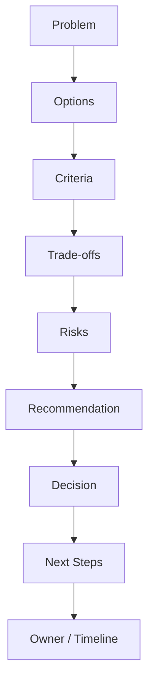
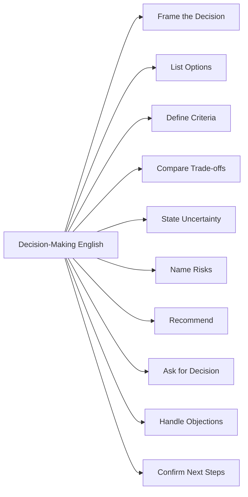
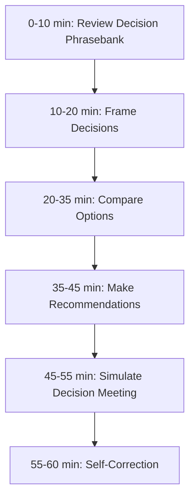

# English for Conversation Part 19 — Decision-Making Conversation

> Goal part ini: kamu bisa memimpin atau berpartisipasi dalam percakapan pengambilan keputusan teknis dalam English: membandingkan opsi, menjelaskan trade-off, menyatakan uncertainty, memberi rekomendasi, meminta keputusan, dan menyepakati next step.

Banyak engineer bisa menjelaskan masalah teknis, tetapi masih sulit ketika harus membawa diskusi menuju keputusan. Percakapan decision-making bukan hanya menjawab “mana yang benar”, karena dalam engineering sering tidak ada satu jawaban absolut.

Yang ada adalah:

- pilihan dengan biaya berbeda,
- risiko yang berbeda,
- constraint yang berbeda,
- informasi yang belum lengkap,
- dan deadline yang memaksa keputusan.

Part ini membangun bahasa percakapan untuk situasi tersebut.

---

## 1. Target Performance

Setelah part ini, kamu harus mampu mengatakan hal seperti ini:

```text
We have two realistic options.

Option A is to keep the workflow synchronous.
It is simpler and easier to debug, but it may increase latency during peak traffic.

Option B is to move the provider call to a queue.
It improves resilience, but it introduces eventual consistency and requires idempotency.

Given the launch timeline and our current traffic,
I recommend Option A for the first release,
with metrics in place so we can revisit the async design later.

Does anyone see a blocking risk with that direction?
```

Kalimat di atas melakukan beberapa hal sekaligus:

1. membingkai opsi,
2. menyebut trade-off,
3. menempatkan constraint,
4. memberi rekomendasi,
5. dan meminta alignment.

Decision-making English adalah language for convergence.

---

## 2. Mental Model: Decision Conversation Is Convergence Under Constraints

Percakapan teknis sering dimulai divergent: banyak ide, banyak opsi, banyak concern. Tetapi decision conversation harus berakhir convergent: arah dipilih, risiko diterima, dan next step jelas.



Bahasa yang kamu butuhkan di setiap tahap:

| Stage | Conversation Function | Example |
|---|---|---|
| Problem | define decision context | “The decision we need today is whether to keep this sync or async.” |
| Options | list realistic alternatives | “I see two realistic options.” |
| Criteria | define what matters | “The most important criteria are reliability and rollout safety.” |
| Trade-offs | compare consequences | “Option A is simpler, but less resilient.” |
| Risks | expose failure modes | “The main risk is duplicate processing.” |
| Recommendation | propose direction | “I recommend Option B.” |
| Decision | confirm alignment | “Are we aligned on that?” |
| Next Steps | operationalize | “I’ll update the design doc and add the follow-up tasks.” |

This is the operating system of decision conversation.

---

## 3. Sub-Skill Decomposition

Following the Kaufman-style approach, kita pecah decision-making conversation menjadi sub-skill kecil.



High-leverage sub-skills:

1. framing the decision,
2. comparing options,
3. making recommendations,
4. asking for alignment,
5. turning decision into action.

---

## 4. Framing the Decision

A common failure in meetings: people discuss for 30 minutes without knowing what decision is needed.

### 4.1 Decision-Framing Patterns

```text
The decision we need today is...
We need to decide whether...
The question is not <X>, but <Y>.
The main decision point is...
By the end of this discussion, we should decide...
```

Examples:

```text
The decision we need today is whether to release this behind a feature flag or to delay the release.
We need to decide whether this workflow should be synchronous for the first version.
The question is not whether async processing is useful, but whether we need it for this release.
The main decision point is whether rollback risk is acceptable.
By the end of this discussion, we should decide the rollout strategy and owner.
```

### 4.2 Decision vs Discussion

Sometimes the meeting is not for decision yet. Clarify that.

```text
Are we trying to make a decision today, or are we still exploring options?
Is the goal to align on direction or to finalize implementation details?
Do we need a final decision now, or do we need more data first?
```

This avoids false closure.

---

## 5. Listing Options Clearly

Decision quality improves when options are explicit.

### 5.1 Option Patterns

```text
I see two realistic options.
There are three paths we can take.
One option is...
Another option is...
A third option is...
```

Example:

```text
I see two realistic options.
One option is to ship the minimal fix today and follow up with a larger refactor.
Another option is to delay the release and include the refactor now.
```

### 5.2 Avoid Fake Options

Bad:

```text
Option A is my solution.
Option B is doing nothing.
```

Better:

```text
Option A is to fix only the production bug.
Option B is to fix the bug and refactor the validation path.
Option C is to revert the feature and redesign the flow.
```

Decision conversation should compare realistic choices, not strawman alternatives.

---

## 6. Defining Decision Criteria

Without criteria, decision-making becomes preference battle.

### 6.1 Criteria Patterns

```text
The most important criteria are...
We should evaluate this based on...
The decision depends on...
For this case, I think we should optimize for...
```

Examples:

```text
The most important criteria are rollout safety, implementation effort, and user impact.
We should evaluate this based on reliability, complexity, and time to release.
The decision depends on whether users can tolerate eventual consistency.
For this case, I think we should optimize for safety over speed.
```

### 6.2 Common Engineering Criteria

| Criterion | Useful Question |
|---|---|
| correctness | Does it preserve expected behavior? |
| safety | Can we roll it back? |
| reliability | What happens during failure? |
| performance | What happens under load? |
| operability | Can the team run it? |
| complexity | Is the complexity justified? |
| maintainability | Will future changes be easy? |
| compatibility | Will old clients still work? |
| compliance | Can we audit and defend it? |
| delivery | Can we ship in time? |

### 6.3 Criteria Ranking

```text
I think safety matters more than speed here.
For this release, compatibility is more important than elegance.
Given the incident risk, rollback should be a hard requirement.
```

Ranking criteria is often more useful than listing them.

---

## 7. Comparing Options

Use comparison language to avoid long, unstructured explanations.

### 7.1 Basic Comparison Patterns

```text
Compared to Option A, Option B...
Option A is better for...
Option B is stronger when...
The downside of Option A is...
The advantage of Option B is...
```

Examples:

```text
Compared to Option A, Option B gives us better resilience but requires more operational work.
Option A is better for speed and simplicity.
Option B is stronger when failures are frequent or traffic is unpredictable.
The downside of Option A is that request latency still depends on the provider.
The advantage of Option B is that it decouples checkout from payment processing.
```

### 7.2 Contrast Pattern

```text
Option A optimizes for <X>.
Option B optimizes for <Y>.
The question is which constraint matters more right now.
```

Example:

```text
Option A optimizes for delivery speed.
Option B optimizes for long-term resilience.
The question is which constraint matters more for this release.
```

This pattern is concise and mature.

---

## 8. Explaining Trade-Offs

Trade-off language is central to decision-making.

### 8.1 Core Pattern

```text
This gives us <benefit>, but it costs us <cost>.
```

Examples:

```text
This gives us faster delivery, but it costs us some long-term maintainability.
This gives us better resilience, but it costs us operational simplicity.
This gives us stronger consistency, but it costs us performance and flexibility.
```

### 8.2 Trade-Off Categories

| Trade-Off | Example Phrase |
|---|---|
| speed vs safety | “We can ship faster, but rollback becomes riskier.” |
| simplicity vs flexibility | “This is simpler now, but harder to extend later.” |
| consistency vs availability | “This preserves consistency, but reduces availability during provider failure.” |
| performance vs correctness | “This improves latency, but we need to ensure stale data is acceptable.” |
| isolation vs complexity | “This isolates ownership, but adds cross-service failure modes.” |
| short-term vs long-term | “This solves the immediate issue, but creates cleanup work later.” |

### 8.3 Senior-Level Trade-Off Phrase

```text
I don’t think the question is whether this approach is good.
The question is whether the benefits justify the added complexity right now.
```

This phrase is useful when people are debating in absolute terms.

---

## 9. Stating Uncertainty

A good decision conversation does not pretend certainty. It handles uncertainty explicitly.

### 9.1 Uncertainty Patterns

```text
The part I’m not sure about is...
We don’t know yet whether...
This depends on...
There is still uncertainty around...
I would be more confident if we had...
```

Examples:

```text
The part I’m not sure about is the provider’s retry behavior.
We don’t know yet whether users can tolerate pending status.
This depends on the expected traffic volume.
There is still uncertainty around migration compatibility.
I would be more confident if we had staging test results.
```

### 9.2 Uncertainty Should Lead to Action

Weak:

```text
I’m not sure.
```

Better:

```text
I’m not sure whether the old client still depends on this field.
We can verify that by checking the client version distribution before removing the column.
```

### 9.3 Decision Under Uncertainty

Sometimes you must decide without full information.

```text
We don’t have perfect data, but we have enough to choose a low-risk first step.
Given the uncertainty, I suggest the option that is easiest to roll back.
```

This is practical engineering judgment.

---

## 10. Naming Risks

Decision-making must include risk ownership.

### 10.1 Risk Patterns

```text
The main risk is...
The failure mode I’m worried about is...
This could fail if...
The worst case is...
The risk is acceptable if...
The risk is not acceptable because...
```

Examples:

```text
The main risk is that retries create duplicate charges.
The failure mode I’m worried about is a partial migration.
This could fail if events arrive out of order.
The worst case is that users see incorrect payment status.
The risk is acceptable if we launch behind a feature flag.
The risk is not acceptable because it affects authorization.
```

### 10.2 Risk Mitigation Pattern

```text
We can mitigate this by...
```

Examples:

```text
We can mitigate this by adding idempotency keys.
We can mitigate this by rolling out to one tenant first.
We can mitigate this by keeping the old column until all clients migrate.
```

### 10.3 Risk Acceptance Pattern

```text
I think this risk is acceptable because...
I don’t think this risk is acceptable unless...
```

Examples:

```text
I think this risk is acceptable because the feature is internal and can be disabled quickly.
I don’t think this risk is acceptable unless we have a tested rollback path.
```

---

## 11. Making Recommendations

A recommendation is stronger than an opinion because it includes reasoning.

### 11.1 Recommendation Template

```text
Given <context>,
I recommend <option>
because <reason>.
The main risk is <risk>,
so we should <mitigation>.
```

Example:

```text
Given the launch deadline and the fact that the feature is behind a flag,
I recommend shipping the minimal fix today
because it reduces user impact quickly.
The main risk is that the validation path remains duplicated,
so we should create a follow-up task to refactor it after the release.
```

### 11.2 Weak vs Strong Recommendation

Weak:

```text
I like Option B.
```

Strong:

```text
I recommend Option B because it gives us a safer retry model and decouples the provider failure from the user request.
```

Weak:

```text
Maybe Option A.
```

Strong:

```text
I lean toward Option A because it is simpler to roll back, and rollback safety matters more than flexibility for this release.
```

### 11.3 Recommendation with Confidence Level

```text
I strongly recommend...
I recommend...
I lean toward...
I don’t have a strong preference yet, but...
```

Examples:

```text
I strongly recommend blocking the release until authorization is fixed.
I recommend Option A for the first release.
I lean toward Option B, but I want to validate the traffic estimate first.
I don’t have a strong preference yet, but I think rollback should be the deciding factor.
```

---

## 12. Asking for Alignment

A decision is not complete until people know whether they agree, disagree, or commit despite disagreement.

### 12.1 Alignment Patterns

```text
Are we aligned on that direction?
Does anyone see a blocking concern?
Can we agree on this for the first version?
Is everyone comfortable with this trade-off?
Do we have enough information to decide?
```

### 12.2 Stronger Alignment

```text
Before we move forward, I want to confirm whether anyone sees a release-blocking risk.
```

This is useful before deployment decisions.

### 12.3 Handling Silence

In many meetings, silence does not mean agreement.

```text
I want to make sure silence means agreement, not uncertainty.
Does anyone have concerns with this direction?
```

Use this carefully, but it is very useful in cross-cultural teams.

---

## 13. Asking for a Decision

Sometimes teams keep discussing because no one asks for closure.

### 13.1 Decision Closure Patterns

```text
Can we make a decision on this now?
What would prevent us from deciding today?
Do we need more data, or can we choose a direction?
Who is the decision owner for this?
```

### 13.2 When Data Is Missing

```text
It sounds like we cannot decide until we know <data>.
Can we assign someone to verify that and come back with a recommendation?
```

Example:

```text
It sounds like we cannot decide until we know whether old clients still use this field.
Can we assign someone to check client version distribution and come back with a recommendation?
```

### 13.3 Decision Owner Language

```text
Who owns the final call here?
I can make a recommendation, but I think the final decision should come from the service owner.
```

This avoids hidden decision ambiguity.

---

## 14. Handling Objections

Objections are not interruptions. They are part of decision quality.

### 14.1 Acknowledge and Classify

```text
That is a valid concern.
I think that is a rollout risk, not an implementation risk.
That sounds like a future scalability concern.
That seems like a blocker, not just a preference.
```

### 14.2 Objection Response Pattern

```text
I agree that <concern> matters.
I think we can address it by <mitigation>.
Does that resolve the concern, or is there still a blocker?
```

Example:

```text
I agree that rollback matters.
I think we can address it by deploying the schema change in two phases.
Does that resolve the concern, or is there still a blocker?
```

### 14.3 When the Objection Should Change the Decision

```text
That changes the decision for me.
If old clients still depend on this field, then removing it now is too risky.
I would switch my recommendation to a two-phase migration.
```

This sentence is powerful: it shows you are not attached to ego.

---

## 15. Decision Documentation Language

In engineering teams, decisions should often be captured in writing. But even in conversation, you can speak in ADR-style structure.

### 15.1 ADR Spoken Template

```text
Context:
We need to decide...

Decision:
We chose...

Consequences:
This means...

Risks:
The main risks are...

Follow-ups:
Next, we need to...
```

### 15.2 Spoken Example

```text
Context: we need to reduce checkout latency without taking on too much operational risk.
Decision: we will keep the provider call synchronous for the first release.
Consequences: the implementation stays simpler, but request latency still depends on the provider.
Risks: the main risk is latency during peak traffic.
Follow-ups: we will add metrics and revisit async processing if latency crosses the threshold.
```

This style is excellent for meeting summaries.

---

## 16. Decision-Making Phrasebank

### 16.1 Frame

```text
The decision we need today is...
We need to decide whether...
The main decision point is...
```

### 16.2 Options

```text
I see two realistic options.
Option A is...
Option B is...
The main difference is...
```

### 16.3 Criteria

```text
We should optimize for...
The most important criteria are...
The decision depends on...
```

### 16.4 Trade-Offs

```text
This gives us..., but it costs us...
The trade-off is...
The downside is...
```

### 16.5 Uncertainty

```text
The part I’m not sure about is...
We still need to validate...
This depends on...
```

### 16.6 Risk

```text
The main risk is...
The failure mode I’m worried about is...
We can mitigate that by...
```

### 16.7 Recommendation

```text
Given the constraints, I recommend...
I lean toward...
I strongly recommend...
```

### 16.8 Alignment

```text
Are we aligned on that?
Does anyone see a blocking concern?
Can we agree on this direction?
```

### 16.9 Next Step

```text
The next step is...
I’ll take the action item to...
Let’s capture this in the design doc.
```

---

## 17. Dialogue Example: Feature Flag Rollout Decision

```text
A: The decision we need today is whether to launch this to all tenants or start with a limited rollout.

B: From product side, we prefer all tenants because the customer impact is high.

C: I understand the urgency. My concern is that the new permission path has not been exercised in production yet.

A: What are the options?

C: I see two options.
Option A is to launch to all tenants today.
That gives us faster impact, but rollback is riskier if the permission logic fails.

Option B is to launch behind a feature flag for one tenant first.
That is slower, but it limits blast radius.

B: How long would the limited rollout take?

C: We can enable one tenant today, monitor the metrics, and expand tomorrow if there are no issues.

A: Given the permission risk, I recommend Option B.
Does anyone see a blocking concern with the limited rollout?

B: No. As long as we can expand tomorrow, that works.

A: Great. Decision: limited rollout today, expand tomorrow if metrics are clean.
```

Key patterns:

- “The decision we need today is…”
- “I understand the urgency.”
- “I see two options.”
- “That gives us…, but…”
- “I recommend…”
- “Decision: …”

---

## 18. Dialogue Example: Technical Debt vs Hotfix

```text
Engineer A: This code path is messy. We should refactor it before merging.

Engineer B: I agree it needs cleanup, but the production bug is affecting users now.

Tech Lead: Let’s frame the decision.
Are we deciding whether to fix only the bug, or whether to include the refactor in the same PR?

Engineer A: I want the refactor because otherwise we keep adding debt.

Engineer B: The risk is that a larger refactor makes the hotfix harder to review and slower to release.

Tech Lead: I see two options.
Option A is a minimal hotfix now and a follow-up refactor.
Option B is a combined fix and refactor.

Given the user impact and release urgency, I recommend Option A.
The trade-off is that we carry the messy code for a bit longer.
We can mitigate that by creating a follow-up ticket and assigning an owner.

Engineer A: I can accept that if the follow-up is tracked.

Tech Lead: Good. Decision: minimal hotfix now, refactor tracked as follow-up.
```

This is a realistic engineering decision conversation.

---

## 19. Dialogue Example: Uncertainty Blocks Decision

```text
A: Should we remove the old column in this migration?

B: I’m not sure we can decide yet.
The decision depends on whether old clients still read that field.

A: Do we have that data?

B: Not yet. We need client version distribution and access logs.

A: So what should we do?

B: I recommend we keep the column for now and mark it deprecated.
Then we can remove it in a second migration once we confirm old clients are no longer using it.

A: That seems safer.

B: The next step is to check usage and create a removal plan.
```

Pattern:

- uncertainty identified,
- missing data named,
- safe interim decision proposed,
- next step assigned.

---

## 20. Common Mistakes

### 20.1 Discussing Without Framing the Decision

Weak:

```text
So what do you think about async?
```

Better:

```text
The decision we need is whether to move this workflow async for the first release or keep it synchronous and revisit later.
```

### 20.2 Giving Preference Without Reason

Weak:

```text
I prefer Option A.
```

Better:

```text
I prefer Option A because it is easier to roll back, and rollback safety is the most important criterion for this release.
```

### 20.3 Not Naming Risk

Weak:

```text
This might be bad.
```

Better:

```text
The main risk is duplicate processing if the worker retries after a partial failure.
```

### 20.4 Not Asking for Alignment

Weak ending:

```text
Okay, sounds good.
```

Better ending:

```text
Are we aligned on Option A for the first release, with a follow-up to revisit async processing after metrics are available?
```

### 20.5 Treating Uncertainty as Weakness

Weak:

```text
I don’t know.
```

Better:

```text
We don’t know whether old clients still use this field. That is the key uncertainty blocking the decision.
```

---

## 21. Drill 1 — Frame the Decision

Rewrite each vague meeting topic into a clear decision statement.

1. “Discuss Kafka.”
2. “Talk about deployment.”
3. “Review migration.”
4. “Async processing.”
5. “Feature flag?”
6. “Refactor validation.”
7. “Incident follow-up.”
8. “Caching strategy.”
9. “Testing approach.”
10. “API versioning.”

Example:

```text
Vague:
Discuss Kafka.

Decision statement:
We need to decide whether introducing Kafka is justified for this workflow, or whether a simpler queue is enough for the first version.
```

---

## 22. Drill 2 — Compare Options

Use this template:

```text
Option A is...
Option B is...
Option A optimizes for...
Option B optimizes for...
The deciding factor should be...
```

Scenarios:

1. synchronous vs asynchronous processing,
2. hotfix now vs refactor first,
3. launch all tenants vs feature-flagged rollout,
4. remove old API field now vs two-phase migration,
5. use shared library vs duplicate small logic temporarily,
6. cache result vs query every time.

---

## 23. Drill 3 — Recommendation Practice

Use this template:

```text
Given <context>,
I recommend <option>
because <reason>.
The main risk is <risk>,
so we should <mitigation>.
```

Prompts:

1. High user impact, low implementation risk.
2. Security-sensitive change, no test coverage.
3. Unknown traffic estimate.
4. Legacy clients still active.
5. Product wants speed, engineering sees rollback risk.
6. Internal-only tool with low blast radius.
7. Payment flow with retry behavior.
8. Compliance workflow requiring auditability.

---

## 24. Drill 4 — Ask for Alignment

Practice saying these naturally:

```text
Are we aligned on that direction?
Does anyone see a blocking concern?
Can we agree on this for the first version?
Do we have enough information to decide?
Is everyone comfortable with this trade-off?
Who owns the final decision here?
```

Then create 5 custom alignment questions for your own work context.

---

## 25. Self-Correction Checklist

After each decision conversation, score yourself:

| Area | Question | Score |
|---|---|---|
| Decision framing | Did I clearly state what decision was needed? | 1–5 |
| Options | Did I make the options explicit? | 1–5 |
| Criteria | Did I name what mattered most? | 1–5 |
| Trade-offs | Did I compare benefits and costs? | 1–5 |
| Uncertainty | Did I name missing information? | 1–5 |
| Risk | Did I describe failure modes clearly? | 1–5 |
| Recommendation | Did I make a reasoned recommendation? | 1–5 |
| Alignment | Did I ask for agreement or objections? | 1–5 |
| Next step | Did the decision lead to action? | 1–5 |

---

## 26. 60-Minute Practice Plan



### Practice Scenario

Topic:

```text
Should the team launch a new permission feature to all tenants immediately or use a limited rollout?
```

Practice:

1. state the decision,
2. list options,
3. define criteria,
4. compare trade-offs,
5. state recommendation,
6. ask for alignment,
7. define next step.

---

## 27. High-Value Patterns to Memorize

```text
The decision we need today is...
I see two realistic options.
The main difference is...
The decision depends on...
This gives us..., but it costs us...
The main risk is...
We can mitigate that by...
Given the constraints, I recommend...
Does anyone see a blocking concern?
Are we aligned on that direction?
The next step is...
```

These patterns are enough to make you useful in most engineering decision meetings.

---

## 28. Final Assignment

Record an 8-minute simulated decision meeting.

Scenario:

```text
A production bug affects some users.
There is a minimal hotfix available.
A larger refactor would clean up the root cause but adds release risk.
The team must decide whether to ship the hotfix now or delay for the refactor.
```

Your conversation must include:

1. clear decision framing,
2. two options,
3. three criteria,
4. three trade-offs,
5. at least one uncertainty,
6. at least one risk mitigation,
7. final recommendation,
8. alignment question,
9. next step.

Use this final structure:

```text
The decision we need today is...
The options are...
The deciding criteria are...
Given these constraints, I recommend...
The main risk is...
We can mitigate it by...
Are we aligned on this direction?
The next step is...
```

---

## Part 19 Summary

Decision-making English is about helping a group converge.

The core pattern is:

```text
Decision → Options → Criteria → Trade-offs → Risk → Recommendation → Alignment → Next Step
```

The most valuable phrases are:

```text
The decision we need today is...
I see two realistic options.
The main trade-off is...
Given the constraints, I recommend...
Does anyone see a blocking concern?
The next step is...
```

When you can use these naturally, you become more than a participant. You become someone who helps the team move from discussion to decision.

---
