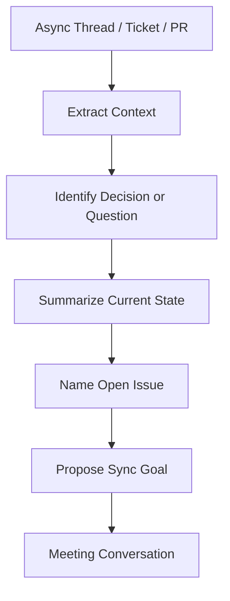
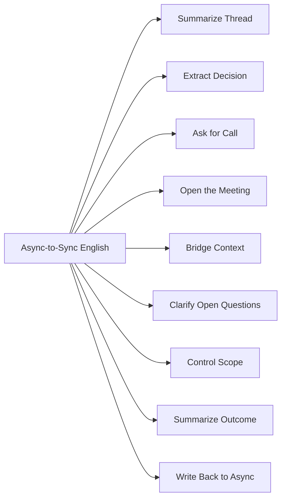
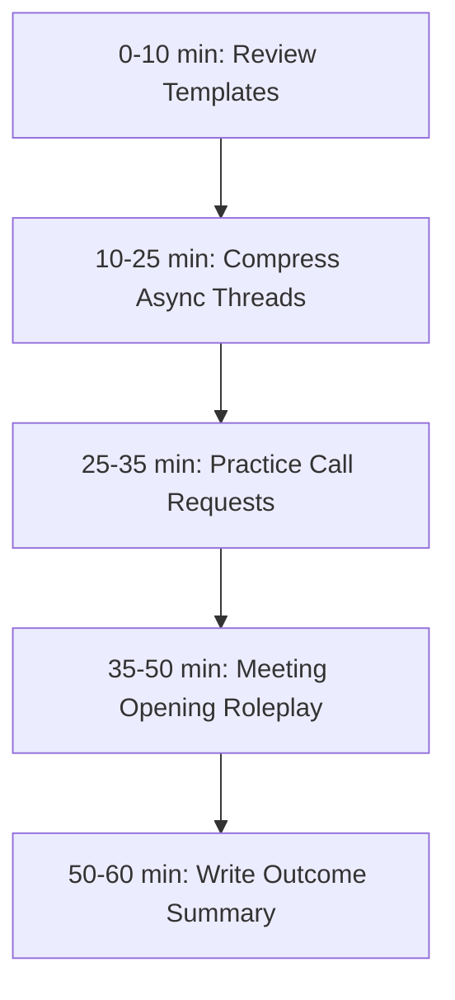

# English for Conversation Part 20 — Async-to-Sync Communication: From Slack to Meeting Talk

> Goal part ini: kamu bisa mengubah komunikasi async seperti Slack, email, issue, ticket, dan PR comment menjadi percakapan sync yang jelas, singkat, dan efektif.

Dalam remote engineering team, banyak percakapan dimulai secara async:

- Slack thread,
- email,
- issue tracker,
- pull request discussion,
- incident channel,
- design document comments,
- ticket comments.

Lalu pada titik tertentu, diskusi perlu berubah menjadi sync:

- quick call,
- meeting,
- pairing session,
- decision discussion,
- escalation,
- incident coordination.

Masalah umum: orang membawa seluruh detail async ke meeting secara mentah, lalu bicara panjang, tidak terstruktur, dan membuat orang lain kehilangan konteks.

Skill part ini adalah: **compress async context into spoken alignment.**

---

## 1. Target Performance

Setelah part ini, kamu harus mampu mengatakan hal seperti ini:

```text
Let me summarize the Slack thread quickly.

The issue is that the staging deployment is failing after the migration step.
We have already confirmed that the application code starts correctly.
The open question is whether the migration is backward compatible with the current schema.

I think we need this call to decide whether to rollback or patch the migration.
```

Atau:

```text
This came up in the PR discussion.
The reviewer is concerned that the retry path may process the same event twice.
I think the fastest way to resolve it is to walk through the failure scenario together.
```

Ini adalah kemampuan bridging: dari written async context ke spoken sync conversation.

---

## 2. Mental Model: Async Context Must Be Compressed Before Speaking

Async communication biasanya penuh detail. Meeting membutuhkan compression.



Kalau kamu masuk meeting tanpa compression, kamu cenderung membaca ulang thread. Itu tidak efektif.

Tujuan sync conversation bukan mengulang semua history, tetapi membuat semua orang aligned pada:

1. apa masalahnya,
2. apa yang sudah diketahui,
3. apa yang belum diketahui,
4. keputusan atau bantuan apa yang dibutuhkan.

---

## 3. Sub-Skill Decomposition

Following the Kaufman-style approach, kita pecah async-to-sync communication menjadi sub-skill kecil.



High-leverage sub-skills:

1. asking for a call,
2. summarizing async context,
3. opening sync discussion,
4. converting discussion into decision,
5. writing back the result.

---

## 4. Asking to Jump on a Call

Sometimes async is enough. Sometimes sync is faster.

### 4.1 Call Request Patterns

```text
Do you have 10 minutes to talk this through?
Can we jump on a quick call?
This might be faster to resolve live.
Could we sync for 15 minutes to align on the decision?
I think we’re going in circles in the thread. A quick call might help.
```

### 4.2 Professional Context

Add reason and goal.

```text
Can we jump on a quick call to walk through the retry scenario?
Do you have 15 minutes to align on the rollout plan?
This might be faster live because there are a few moving parts.
```

### 4.3 Avoid Vague Call Requests

Weak:

```text
Call?
```

Better:

```text
Can we jump on a 10-minute call to decide whether we should rollback or patch the migration?
```

Good call request includes:

```text
time box + topic + desired outcome
```

---

## 5. Moving from Slack Thread to Meeting

### 5.1 Opening Pattern

```text
Thanks for joining.
Let me summarize the thread quickly.
The issue is...
What we know so far is...
The open question is...
The goal of this call is...
```

Example:

```text
Thanks for joining.
Let me summarize the thread quickly.
The issue is that the worker is processing some events twice.
What we know so far is that retries happen after a timeout.
The open question is whether the consumer is idempotent.
The goal of this call is to decide whether we need to block the release.
```

### 5.2 Why This Works

This opening reduces cognitive load. It tells people:

- why they are here,
- what context matters,
- what decision is needed,
- and what to ignore for now.

---

## 6. The Async Context Compression Template

Use this template frequently.

```text
Context:
<what happened>

Current state:
<what we know>

Open question:
<what is unresolved>

Goal:
<what we need from this conversation>
```

### 6.1 Spoken Version

```text
Here’s the context.
<what happened>

What we know so far is...
<current state>

The open question is...
<unresolved issue>

The goal of this call is...
<decision/help/alignment needed>
```

### 6.2 Example — PR Discussion

```text
Here’s the context.
This came up in the PR discussion for the new retry logic.

What we know so far is that the retry handles provider timeouts,
but we have not confirmed whether the operation is idempotent.

The open question is whether a retried message can create a duplicate transaction.

The goal of this call is to walk through that failure mode and decide whether this blocks the merge.
```

---

## 7. Summarizing a Slack Thread

Slack threads are often noisy. Your job is to extract signal.

### 7.1 Thread Summary Patterns

```text
The thread has three main points.
The main concern raised was...
We seem to agree on...
The unresolved part is...
There are two proposed solutions...
```

Examples:

```text
The thread has three main points.
First, the deployment failed after the migration step.
Second, the application itself starts correctly.
Third, the rollback path has not been tested yet.
The unresolved part is whether we should rollback now or patch the migration.
```

### 7.2 Avoid Chronological Overload

Weak:

```text
First John said this, then Maria said that, then I replied, then the bot posted logs...
```

Better:

```text
The important points from the thread are:
the migration failed, the app starts correctly, and rollback has not been tested.
```

Summarize by meaning, not chronology.

---

## 8. Summarizing an Email or Ticket

Email/ticket context often includes background, request, and deadline.

### 8.1 Ticket Summary Pattern

```text
The ticket is about...
The user/customer is seeing...
The expected behavior is...
The actual behavior is...
The impact is...
The requested outcome is...
```

Example:

```text
The ticket is about delayed invoice generation.
The customer expects invoices to appear within five minutes.
The actual behavior is that some invoices remain pending for more than an hour.
The impact is high because finance cannot close daily reconciliation.
The requested outcome is to identify whether this is a processing delay or a data issue.
```

### 8.2 Email Summary Pattern

```text
The email is asking for...
The main concern is...
The deadline is...
The decision needed from us is...
```

Example:

```text
The email is asking whether we can support tenant-specific retention rules.
The main concern is compliance for regulated customers.
The deadline is next Friday.
The decision needed from us is whether the current data model can support this without a schema change.
```

---

## 9. Summarizing a PR Discussion

PR discussion often needs a different compression style.

### 9.1 PR Summary Pattern

```text
The PR changes...
The reviewer is concerned about...
The author’s reasoning is...
The unresolved decision is...
```

Example:

```text
The PR changes the retry behavior for payment callbacks.
The reviewer is concerned about duplicate processing.
The author’s reasoning is that the provider timeout is currently causing failed payments.
The unresolved decision is whether idempotency should be added in this PR or as a follow-up.
```

### 9.2 Turning PR Debate into Sync Goal

```text
I think the fastest way to resolve this is to walk through the failure scenario together.
```

Very useful phrase.

---

## 10. Summarizing an Incident Channel

Incident communication must be crisp.

### 10.1 Incident Sync Opening

```text
Current status:
<what is happening>

Impact:
<who/what is affected>

Known facts:
<confirmed facts>

Unknowns:
<what we do not know>

Immediate decision:
<what needs to be decided now>
```

Example:

```text
Current status: checkout latency is elevated.
Impact: about 20% of checkout requests are slower than usual.
Known facts: the latency started after the latest deployment, and provider calls are taking longer.
Unknowns: we do not know yet whether this is caused by our retry change or the provider.
Immediate decision: we need to decide whether to rollback the deployment.
```

### 10.2 Avoid Incident Rambling

Weak:

```text
So many things happened, and I saw some logs, and maybe the provider is slow...
```

Better:

```text
The confirmed fact is that latency increased after deployment.
The leading hypothesis is provider retry behavior.
We still need to verify whether rollback reduces latency.
```

Incident English must separate fact, hypothesis, and action.

---

## 11. Opening a Meeting from Async Context

### 11.1 Opening Script

```text
Thanks everyone.
I’ll give a quick context summary, then we can focus on the decision.

The context is...
What we know is...
The open question is...
The decision we need is...
```

### 11.2 Example

```text
Thanks everyone.
I’ll give a quick context summary, then we can focus on the decision.

The context is that the PR introduced a new migration for order status.
What we know is that the migration works locally but failed in staging.
The open question is whether the migration is safe to run in production.
The decision we need is whether to patch it, rollback, or delay the release.
```

This is meeting facilitation English.

---

## 12. Controlling Scope in Sync Discussion

When async context is large, sync discussion can drift.

### 12.1 Scope Control Patterns

```text
That is related, but I think the decision for this call is...
Let’s park the refactor discussion and focus on the release risk.
Can we separate the long-term design from the immediate incident response?
For now, let’s decide the next action. We can revisit the broader cleanup later.
```

### 12.2 Example

```text
That is related, but I think the decision for this call is whether to rollback.
The refactor is important, but it does not change the immediate production risk.
```

This keeps meetings short and productive.

---

## 13. Clarifying Open Questions

Async threads often contain implicit disagreement. Bring it into explicit questions.

### 13.1 Open Question Patterns

```text
The open question is whether...
The unresolved part is...
What we still need to decide is...
The main disagreement seems to be...
```

Examples:

```text
The open question is whether the retry operation is idempotent.
The unresolved part is whether this should block the release.
What we still need to decide is whether to use a feature flag.
The main disagreement seems to be whether the migration risk is acceptable.
```

### 13.2 Converting Confusion into Question

Async confusion:

```text
People are talking about rollback, migration, feature flag, and old clients.
```

Spoken clarification:

```text
I think there are two separate questions here:
First, is the migration backward compatible?
Second, should the feature be enabled immediately after deployment?
```

This is a powerful compression move.

---

## 14. Handling “Can You Give Context?”

When someone joins late or lacks context, answer with the compression template.

### 14.1 Short Context

```text
Sure. Short version:
The deployment failed during migration.
The app code starts correctly.
The open question is whether the schema change is backward compatible.
We’re deciding whether to rollback or patch.
```

### 14.2 More Structured Context

```text
Sure.
The issue started after the latest deployment.
The failure happens during the migration step.
We confirmed the application starts correctly if the migration is skipped.
So the current focus is migration compatibility.
```

### 14.3 Avoid Overloading

Do not answer with the entire history unless asked.

---

## 15. Asking People to Move from Sync Back to Async

Not every discussion needs to continue live.

### 15.1 Back-to-Async Patterns

```text
I think we have enough alignment for now.
Let’s capture the decision in the thread.
Can we move the detailed implementation discussion back to the PR?
Let’s document the options and continue async.
```

### 15.2 Example

```text
I think we’ve decided the rollout strategy.
The remaining discussion is implementation detail, so let’s continue that in the PR.
```

This saves meeting time.

---

## 16. Writing Back the Outcome

After a sync discussion, write a short async summary. This is part of conversation loop closure.

### 16.1 Write-Back Template

```text
Summary:
- Decision:
- Reason:
- Risks:
- Owner:
- Next step:
```

### 16.2 Example Slack Update

```text
Summary from the call:

Decision:
We will do a limited rollout to one tenant today instead of enabling all tenants.

Reason:
The permission path is new, and we want to limit blast radius.

Risk:
If metrics look bad, we will disable the feature flag.

Owner:
Rina will monitor the rollout.

Next step:
Enable tenant A today and review metrics tomorrow morning.
```

### 16.3 Spoken Lead-In

```text
I’ll write a quick summary in the thread so everyone has the decision and next steps.
```

This creates accountability.

---

## 17. Remote Collaboration Phrasebank

### 17.1 Ask for Sync

```text
Can we jump on a quick call?
This might be faster to resolve live.
Do you have 10 minutes to align on the decision?
```

### 17.2 Summarize Async Context

```text
Let me summarize the thread quickly.
The main concern raised was...
The unresolved part is...
```

### 17.3 Open a Meeting

```text
The goal of this call is...
The decision we need is...
What we know so far is...
```

### 17.4 Clarify Scope

```text
For this call, let’s focus on...
That is related, but not the decision we need right now.
Can we park that for a follow-up?
```

### 17.5 Close Meeting

```text
Let me summarize where we landed.
The decision is...
The next step is...
I’ll post the summary in the thread.
```

---

## 18. Dialogue Example: Slack Thread to Quick Call

```text
A: This thread is getting long. Can we jump on a quick call to decide whether we should rollback?

B: Sure.

A: Thanks. Let me summarize the thread quickly.
The deployment failed during the migration step.
We confirmed that the application code starts correctly.
The open question is whether the migration is backward compatible with the current schema.
The goal of this call is to decide whether to rollback or patch.

B: Do we know if production has the same schema state as staging?

A: Not yet. That is the main uncertainty.

B: Then I would avoid patching blindly.

A: Agreed. My recommendation is to rollback first, compare schema state, and then patch safely.

B: Works for me.

A: Great. I’ll post the summary in the thread.
```

Key patterns:

- “This thread is getting long.”
- “Let me summarize the thread quickly.”
- “The open question is…”
- “The goal of this call is…”
- “I’ll post the summary…”

---

## 19. Dialogue Example: PR Discussion to Pairing Session

```text
Reviewer: I’m still concerned about the retry path.

Author: I think this might be faster to resolve live.
Do you have 15 minutes to walk through the failure scenario?

Reviewer: Yes.

Author: Great. The PR changes the retry behavior for payment callbacks.
Your concern is that a retry may process the same event twice.
My reasoning was that the provider timeout currently causes failed payments.
The unresolved question is whether the callback operation is idempotent.

Reviewer: Exactly.

Author: Let’s trace the scenario where the provider succeeds but our service times out before saving the response.

Reviewer: In that case, the retry could send the same callback again.

Author: Right. So we need an idempotency key before merging.

Reviewer: Yes. If you add that and a regression test, I’m good with the PR.
```

This is exactly how async-to-sync should work: compress, align, resolve.

---

## 20. Dialogue Example: Ticket to Stakeholder Call

```text
Engineer: Let me summarize the ticket before we discuss options.

The customer expects invoice generation within five minutes.
Some invoices are staying pending for more than an hour.
The impact is high because it blocks daily reconciliation.
What we know so far is that the job queue is delayed during peak traffic.
The open question is whether the delay is caused by queue capacity or a slow downstream dependency.

The goal of this call is to decide whether we should increase worker capacity immediately or investigate the downstream dependency first.

Stakeholder: What do you recommend?

Engineer: I recommend increasing worker capacity as a short-term mitigation while we investigate the dependency.
That reduces customer impact quickly, but it may not solve the root cause.
```

This is good stakeholder conversation: clear, compressed, action-oriented.

---

## 21. Common Mistakes

### 21.1 Reading the Whole Thread Aloud

Weak:

```text
So first John said..., then Maria replied..., then the bot posted..., then I said...
```

Better:

```text
The important points are: migration failed, app startup works, rollback is untested.
```

### 21.2 Asking for a Call Without Purpose

Weak:

```text
Can we call?
```

Better:

```text
Can we jump on a 10-minute call to decide whether to rollback or patch the migration?
```

### 21.3 Starting Meeting Without Goal

Weak:

```text
So, about the Slack thread...
```

Better:

```text
The goal of this call is to decide whether this blocks the release.
```

### 21.4 Not Writing Back

Weak:

```text
Meeting ends, no summary.
```

Better:

```text
I’ll post the decision and next steps in the thread.
```

In remote teams, undocumented sync decisions create async confusion later.

---

## 22. Drill 1 — Compress a Thread

Given this noisy thread:

```text
The deployment failed.
Someone says the app starts locally.
Someone else says staging schema may be different.
A bot posted migration logs.
A reviewer asks whether rollback was tested.
A PM asks whether release is still possible today.
```

Compress it using:

```text
Context:
Current state:
Open question:
Goal:
```

Expected shape:

```text
Context:
The deployment failed during the migration step.

Current state:
The application code appears to start correctly, but staging schema may differ from local.

Open question:
We do not know whether the migration is backward compatible or whether rollback is safe.

Goal:
Decide whether to rollback, patch the migration, or delay the release.
```

---

## 23. Drill 2 — Ask for a Call

Rewrite each vague request.

1. “Call?”
2. “Can we talk?”
3. “Need discuss.”
4. “This thread too long.”
5. “I don’t understand.”
6. “Let’s meet.”
7. “PR issue.”
8. “Deployment problem.”
9. “Need decision.”
10. “Can you explain?”

Example:

```text
Vague:
Can we talk?

Better:
Can we jump on a 10-minute call to align on whether this retry issue blocks the release?
```

---

## 24. Drill 3 — Open the Meeting

Use this template:

```text
Thanks for joining.
Let me summarize the context quickly.
The issue is...
What we know so far is...
The open question is...
The goal of this call is...
```

Scenarios:

1. migration failed in staging,
2. PR discussion about retry idempotency,
3. incident channel about checkout latency,
4. ticket about delayed invoice generation,
5. Slack debate about feature flag rollout,
6. email request about compliance retention rules.

---

## 25. Drill 4 — Write Back the Outcome

Use this template:

```text
Summary from the call:

Decision:
Reason:
Risks:
Owner:
Next step:
```

Scenarios:

1. rollback deployment,
2. patch migration,
3. merge PR after idempotency test,
4. limited rollout to one tenant,
5. continue investigation async,
6. schedule follow-up design review.

---

## 26. Self-Correction Checklist

After async-to-sync communication, score yourself:

| Area | Question | Score |
|---|---|---|
| Compression | Did I summarize by meaning, not chronology? | 1–5 |
| Context | Did I state the issue clearly? | 1–5 |
| Current state | Did I separate known facts from assumptions? | 1–5 |
| Open question | Did I name what was unresolved? | 1–5 |
| Goal | Did I define what the sync discussion should achieve? | 1–5 |
| Scope | Did I keep the discussion focused? | 1–5 |
| Outcome | Did I summarize decision and next step? | 1–5 |
| Write-back | Did I post the result async? | 1–5 |

---

## 27. 60-Minute Practice Plan



### Practice Method

1. Pick one real Slack thread, PR discussion, or ticket.
2. Compress it into:
   - context,
   - current state,
   - open question,
   - goal.
3. Say the summary aloud.
4. Record it.
5. Rewrite it to be 30% shorter.
6. Speak again.

The goal is not to include everything. The goal is to include what matters.

---

## 28. High-Value Patterns to Memorize

```text
Can we jump on a quick call?
This might be faster to resolve live.
Let me summarize the thread quickly.
The issue is...
What we know so far is...
The open question is...
The goal of this call is...
That is related, but the decision for this call is...
Let me summarize where we landed.
I’ll post the summary in the thread.
```

These patterns cover most async-to-sync transitions.

---

## 29. Final Assignment

Record a 6-minute async-to-sync simulation.

Scenario:

```text
A Slack thread about a failed staging deployment has become long and confusing.
The migration failed.
The app code seems fine.
Rollback has not been tested.
Product wants to know whether release is still possible today.
```

Your simulation must include:

1. asking for a call,
2. opening the call,
3. compressing the thread,
4. naming facts,
5. naming uncertainty,
6. defining the decision,
7. controlling scope,
8. summarizing the outcome,
9. writing back the async summary.

Use this structure:

```text
Can we jump on a quick call to...
Let me summarize the thread quickly.
The issue is...
What we know is...
The open question is...
The goal of this call is...
Let me summarize where we landed.
I’ll post the summary in the thread.
```

---

## Part 20 Summary

Async-to-sync communication is a high-leverage remote engineering skill.

The core pattern is:

```text
Context → Current State → Open Question → Goal → Decision → Write-Back
```

The biggest mistake is bringing raw async detail into a sync meeting. Compress the context, clarify the decision, keep scope tight, and write the outcome back to the async channel.

When you master this, you become easier to work with in global remote teams because you reduce confusion, shorten meetings, and help decisions survive outside the call.

---
