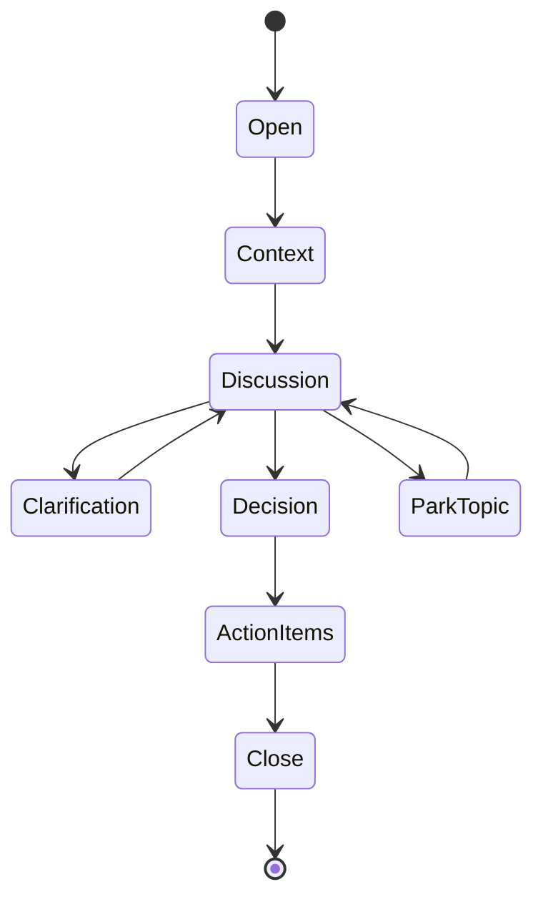
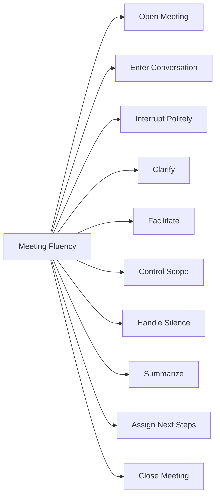
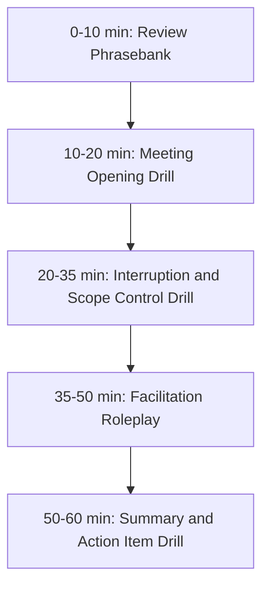

# English for Conversation Part 21 — Meeting Fluency: Facilitation, Interruption, and Turn-Taking

> Goal part ini: kamu bisa berpartisipasi dan memfasilitasi meeting dalam English dengan jelas: masuk ke percakapan, interrupt dengan sopan, menjaga scope, mengembalikan diskusi ke keputusan, menyimpulkan, dan menutup dengan action item.

Meeting fluency bukan berarti kamu bicara paling banyak. Meeting fluency berarti kamu bisa membuat percakapan bergerak ke arah yang berguna.

Dalam software engineering, meeting sering gagal bukan karena orang tidak pintar, tetapi karena:

- topik tidak jelas,
- tidak ada decision framing,
- orang saling memotong tanpa struktur,
- diskusi melebar,
- yang diam dianggap setuju,
- keputusan tidak disimpulkan,
- action item tidak jelas.

English meeting fluency adalah skill untuk mengelola alur percakapan, bukan hanya menjawab pertanyaan.

---

## 1. Target Performance

Setelah part ini, kamu harus mampu mengatakan hal seperti ini:

```text
Before we go deeper, can we clarify the decision we need from this meeting?

I think there are two separate topics here:
the immediate release risk and the long-term refactor.
Can we focus on the release risk first and park the refactor for a follow-up?

Let me summarize where we are:
we agree to do a limited rollout today,
Rina will monitor the metrics,
and we will decide tomorrow whether to expand to all tenants.
```

Ini menunjukkan tiga kemampuan penting:

1. mengklarifikasi tujuan,
2. mengontrol scope,
3. menyimpulkan decision dan next step.

---

## 2. Mental Model: Meeting Is a State Machine

Meeting bisa dipahami sebagai state machine. Percakapan yang baik bergerak dari context menuju decision dan action.



Meeting fluency berarti kamu tahu phrase apa yang dipakai untuk memindahkan meeting dari satu state ke state berikutnya.

| State | Function | Example |
|---|---|---|
| Open | start cleanly | “Thanks everyone. The goal today is...” |
| Context | align background | “Let me give a quick context.” |
| Discussion | exchange views | “What do people think about Option A?” |
| Clarification | reduce ambiguity | “Can you clarify what you mean by rollback risk?” |
| Park Topic | control scope | “Let’s park that for a follow-up.” |
| Decision | converge | “Are we aligned on Option B?” |
| Action Items | assign ownership | “Who owns the follow-up?” |
| Close | end clearly | “Let me summarize the decision and next steps.” |

---

## 3. Sub-Skill Decomposition

Following Kaufman-style skill deconstruction, meeting fluency can be broken into smaller sub-skills.



High-leverage sub-skills:

1. entering the conversation,
2. interrupting politely,
3. scope control,
4. summarizing decisions,
5. closing with action items.

---

## 4. Opening a Meeting

A good opening reduces ambiguity.

### 4.1 Basic Opening

```text
Thanks everyone for joining.
The goal of this meeting is...
By the end of this meeting, we should...
```

Examples:

```text
Thanks everyone for joining.
The goal of this meeting is to decide the rollout strategy for the permission feature.
By the end of this meeting, we should know whether we are launching to one tenant or all tenants.
```

### 4.2 Context + Goal Opening

```text
Let me start with quick context.
<short context>
The goal today is <goal>.
```

Example:

```text
Let me start with quick context.
The staging deployment failed during the migration step, and rollback has not been tested yet.
The goal today is to decide whether to rollback, patch, or delay the release.
```

### 4.3 Decision-Oriented Opening

```text
The decision we need today is...
The options are...
I suggest we spend the first few minutes aligning on context, then decide.
```

This opening is useful for design review, release review, incident discussion, and architecture meeting.

---

## 5. Entering a Conversation

In meetings, timing matters. You may need to enter without interrupting harshly.

### 5.1 Entry Phrases

```text
Can I add something here?
Can I jump in for a second?
I want to add one concern.
I have one question before we move on.
Can I build on that point?
```

### 5.2 Technical Entry

```text
Can I add one operational concern here?
Can I add a migration perspective?
I want to highlight one edge case before we decide.
Can I clarify the failure mode?
```

### 5.3 When You Agree and Add

```text
I agree with that, and I’d add one more point.
That makes sense. Another consideration is...
Building on that, we should also think about...
```

### 5.4 When You Disagree

```text
I see the point, but I have a concern.
I agree with the goal, but I’m not sure about the approach.
I want to challenge one assumption here.
```

These phrases are safe because they show intent before content.

---

## 6. Interrupting Politely

Interrupting is sometimes necessary. The key is to interrupt for a reason, not ego.

### 6.1 When Interruption Is Useful

Interrupt when:

- the discussion is going off-topic,
- a false assumption is spreading,
- a decision is being made without key risk,
- someone misunderstood the context,
- time is running out,
- the meeting needs structure.

### 6.2 Polite Interruption Phrases

```text
Sorry to interrupt, but...
Can I pause us there for a second?
Before we go further, can we clarify...
I want to stop us for a moment because...
Can I quickly correct one detail?
```

Examples:

```text
Sorry to interrupt, but I think we may be mixing two different issues.
Can I pause us there for a second? The rollback risk is separate from the refactor discussion.
Before we go further, can we clarify whether this is a blocker or a follow-up?
```

### 6.3 Interrupting to Correct

```text
Can I quickly correct one detail?
The failure happened in staging, not production.
```

### 6.4 Interrupting to Protect Decision Quality

```text
Before we decide, I want to highlight one risk.
The migration rollback has not been tested yet.
```

This kind of interruption is valuable.

---

## 7. Regaining the Floor

Sometimes you are interrupted before finishing.

### 7.1 Regaining Phrases

```text
Let me finish this point, and then I’d like your take.
Just to complete the thought...
I’ll be quick. The main point is...
Can I finish the risk scenario first?
```

### 7.2 Example

```text
Let me finish this point, and then I’d like your take.
The issue is not just that the migration can fail.
The issue is that if it fails halfway, rollback may leave the order status inconsistent.
```

You do not need to sound angry. You need to preserve the reasoning chain.

---

## 8. Facilitating Discussion

Facilitation means helping the group think.

### 8.1 Asking for Views

```text
What do people think?
Does anyone see a risk with this approach?
Who has context on the migration path?
Can someone from backend weigh in here?
```

### 8.2 Bringing Quiet People In

```text
Rina, you worked on the migration. What do you think?
Alex, from the frontend side, would pending state be acceptable?
I’d like to hear from the service owner before we decide.
```

Use names respectfully and with context. Do not put people on the spot without reason.

### 8.3 Balancing Voices

```text
I want to make sure we hear from the people who will operate this.
We’ve heard the product concern. Can we also check the operational risk?
```

This is senior facilitation.

---

## 9. Clarifying Ambiguity

Meetings often contain vague language.

### 9.1 Clarification Phrases

```text
When you say <term>, do you mean <interpretation>?
Can you clarify what you mean by <term>?
Are we talking about <A> or <B>?
Can you give an example?
```

Examples:

```text
When you say “safe to release,” do you mean rollback is tested, or that the feature is behind a flag?
Can you clarify what you mean by “async later”?
Are we talking about production rollout or staging validation?
```

### 9.2 Clarifying Decision Status

```text
Is this a decision, a recommendation, or still an open question?
Are we aligned, or are there still objections?
Is this a blocker or a follow-up?
```

These are extremely useful phrases.

---

## 10. Controlling Scope

Scope drift kills meeting productivity.

### 10.1 Scope Control Phrases

```text
That is related, but I think it is a separate topic.
Can we park that for a follow-up?
For this meeting, let’s focus on...
Let’s separate the immediate issue from the long-term design.
```

Examples:

```text
That is related, but I think it is a separate topic.
For this meeting, let’s focus on whether the release is safe today.
```

```text
Let’s separate the immediate incident response from the long-term refactor.
```

### 10.2 Parking Lot Language

```text
Let’s put that in the parking lot.
I’ll capture that as a follow-up.
That deserves a separate discussion.
```

### 10.3 Avoid Dismissive Scope Control

Risky:

```text
That’s irrelevant.
```

Better:

```text
That is important, but I don’t think it changes the decision we need in this meeting.
```

---

## 11. Handling Silence

In cross-cultural and remote meetings, silence is ambiguous.

### 11.1 Silence Clarification

```text
I want to check: does silence mean agreement, or do people need more time?
Does anyone have concerns that haven’t been raised yet?
Before we move on, is anyone uncomfortable with this direction?
```

### 11.2 Give Thinking Time

```text
Let’s take 30 seconds to think about risks before we decide.
```

### 11.3 Invite Specific Concern Types

```text
Any concerns from a rollout perspective?
Any concerns from security?
Any concerns from data migration?
```

Specific prompts get better answers than generic “Any questions?”

---

## 12. Handling Dominant Speakers

Sometimes one person dominates the discussion.

### 12.1 Redirecting Politely

```text
Thanks, that context is helpful.
I want to pause there and hear from the service owner as well.
```

```text
That makes sense.
Before we go deeper, can we check whether others see the same risk?
```

### 12.2 Time-Aware Redirect

```text
We have 10 minutes left, so I want to move us toward a decision.
```

### 12.3 Stronger Redirect

```text
I think we’re going too deep into implementation details.
Can we come back to the decision we need today?
```

This is not rude when said calmly and purposefully.

---

## 13. Handling Side Discussions

### 13.1 Side Discussion Phrases

```text
I think this is turning into a separate discussion.
Can the two of you take that offline and bring back a recommendation?
Let’s not solve the full implementation here.
```

### 13.2 Example

```text
I think this is turning into a detailed API design discussion.
Can we agree on the rollout strategy now and take the API details back to the design doc?
```

This keeps the main meeting alive.

---

## 14. Summarizing During the Meeting

Summaries are not only for the end. They help reset shared understanding.

### 14.1 Mid-Meeting Summary

```text
Let me summarize where we are.
We agree on...
We disagree on...
The open question is...
```

Example:

```text
Let me summarize where we are.
We agree that the feature should be behind a flag.
We disagree on whether to enable it for one tenant or all tenants.
The open question is how much blast radius we are willing to accept.
```

### 14.2 Summary After Debate

```text
It sounds like there are two concerns:
first, rollback safety;
second, customer impact if we delay.
```

### 14.3 Summary Before Decision

```text
Before we decide, here’s the trade-off:
Option A is faster but riskier.
Option B is safer but delays impact by one day.
```

This helps people converge.

---

## 15. Asking for Decision

### 15.1 Decision Prompt

```text
Can we make a decision on this now?
Do we have enough information to choose a direction?
What would prevent us from deciding today?
```

### 15.2 Decision Owner

```text
Who owns the final call here?
I think the service owner should make the final decision, with input from product and security.
```

### 15.3 Decision Confirmation

```text
So are we choosing Option B?
Is everyone aligned on limited rollout today?
Does anyone have a blocking objection?
```

---

## 16. Assigning Action Items

A meeting without action items creates confusion.

### 16.1 Action Item Pattern

```text
Action item:
<person> will <action> by <time>.
```

Spoken examples:

```text
Rina will update the rollout plan by end of day.
Alex will add the idempotency test before merge.
I’ll post the decision summary in the Slack thread.
```

### 16.2 Asking for Owner

```text
Who can own this follow-up?
Who will update the design doc?
Can someone take the action to validate the rollback path?
```

### 16.3 Clarifying Completion

```text
What does “done” mean for this action item?
Do we need a written update, a PR, or a follow-up meeting?
```

This is very useful for vague tasks.

---

## 17. Closing a Meeting

### 17.1 Clean Closing Template

```text
Let me summarize before we close.
Decision:
<decision>

Reason:
<reason>

Action items:
<owner/action/time>

Open questions:
<remaining uncertainty>
```

### 17.2 Spoken Example

```text
Let me summarize before we close.
Decision: we will do a limited rollout to one tenant today.
Reason: this limits blast radius while still giving product some customer impact.
Action items: Rina will enable the flag, Alex will monitor metrics, and I’ll post the summary.
Open question: tomorrow we decide whether to expand to all tenants.
```

### 17.3 Closing Phrase

```text
Thanks everyone. I’ll share the notes in the thread.
```

---

## 18. Meeting Phrasebank

### 18.1 Opening

```text
Thanks everyone for joining.
The goal of this meeting is...
By the end, we should decide...
```

### 18.2 Entering

```text
Can I add something here?
Can I jump in for a second?
I want to highlight one risk.
```

### 18.3 Interrupting

```text
Sorry to interrupt, but...
Can I pause us there?
Before we go further...
```

### 18.4 Clarifying

```text
Can you clarify what you mean by...?
Are we talking about A or B?
Is this a blocker or a follow-up?
```

### 18.5 Scope Control

```text
That is related, but separate.
Can we park that?
For this meeting, let’s focus on...
```

### 18.6 Decision

```text
Do we have enough information to decide?
Are we aligned on that?
Does anyone see a blocking concern?
```

### 18.7 Close

```text
Let me summarize where we landed.
The decision is...
The next steps are...
I’ll post the summary after this.
```

---

## 19. Dialogue Example: Facilitating a Release Meeting

```text
Facilitator: Thanks everyone for joining.
The goal of this meeting is to decide whether we release the permission feature today.

Facilitator: Let me start with context.
The implementation is done, but the rollback path has not been tested.
The options are to release to all tenants, do a limited rollout, or delay.

Engineer: I think we should delay until rollback is tested.

PM: Delaying is painful because the customer is waiting.

Facilitator: Let me summarize the trade-off.
Releasing today gives faster customer impact, but higher rollback risk.
Delaying gives more safety, but delays customer value.

Facilitator: Is limited rollout a possible middle ground?

Engineer: Yes, if it is behind a feature flag.

PM: That works if we can expand tomorrow.

Facilitator: Great. Are there any blocking concerns with limited rollout today?

Engineer: No, as long as we monitor metrics.

Facilitator: Decision: limited rollout today.
Rina owns feature flag enablement.
Alex owns monitoring.
We decide tomorrow whether to expand.
I’ll post the summary in Slack.
```

This is effective meeting English: context, options, trade-off, decision, action items.

---

## 20. Dialogue Example: Interrupting to Correct Scope

```text
A: We should redesign the whole validation module.

B: Yes, and maybe split the service too.

You: Can I pause us there for a second?
I agree the validation module needs cleanup, but I think the decision for this meeting is narrower:
do we merge the hotfix today or delay it?

A: Fair.

You: Can we decide that first, then capture the refactor as a follow-up?
```

This is not rude. It protects the meeting.

---

## 21. Dialogue Example: Handling Silence

```text
Facilitator: It sounds like we’re leaning toward Option B: limited rollout.

Facilitator: I want to check: does silence mean agreement, or does anyone need more time?

Engineer: I’m not against it, but I’m worried about monitoring.

Facilitator: Good point. What monitoring would make you comfortable?

Engineer: We need error rate, latency, and permission-denied metrics.

Facilitator: Great. Let’s add that as a release condition.
```

Silence check surfaced a real concern.

---

## 22. Common Mistakes

### 22.1 Waiting Too Long to Speak

If you wait until the meeting ends, your risk may be too late.

Useful phrase:

```text
Before we decide, I want to highlight one risk.
```

### 22.2 Interrupting Without Purpose

Weak:

```text
Sorry, but I think...
```

Better:

```text
Sorry to interrupt, but I think we may be mixing the release decision with the long-term refactor.
```

### 22.3 Summarizing Chronology Instead of Decision

Weak:

```text
First we talked about rollout, then rollback, then feature flags...
```

Better:

```text
The decision is limited rollout today. The open question is expansion tomorrow.
```

### 22.4 Ending Without Action Items

Weak:

```text
Okay, thanks.
```

Better:

```text
Before we close, let’s confirm action items and owners.
```

---

## 23. Drill 1 — Meeting Opening

Write and speak an opening for each meeting.

Use:

```text
Thanks everyone.
The goal of this meeting is...
By the end, we should...
```

Scenarios:

1. release decision,
2. architecture review,
3. incident follow-up,
4. code review escalation,
5. sprint planning,
6. retro discussion,
7. stakeholder update,
8. migration risk review.

---

## 24. Drill 2 — Polite Interruption

Rewrite each interruption.

1. “Stop. Wrong topic.”
2. “No, listen.”
3. “You misunderstand.”
4. “That’s not the point.”
5. “We already discussed this.”
6. “Too much detail.”
7. “Can you be quiet?”
8. “This meeting is useless.”

Example:

```text
Blunt:
Stop. Wrong topic.

Better:
Can I pause us there for a second?
I think this is a separate topic from the decision we need today.
```

---

## 25. Drill 3 — Scope Control

Use this template:

```text
That is important, but I think it is separate from <current decision>.
Can we park it and come back after we decide <decision>?
```

Prompts:

1. refactor during hotfix meeting,
2. long-term architecture during incident call,
3. UI detail during backend migration review,
4. naming discussion during release decision,
5. future scalability during MVP scope discussion.

---

## 26. Drill 4 — Meeting Summary

Use this template:

```text
Let me summarize where we landed.
Decision:
Reason:
Action items:
Open questions:
```

Scenarios:

1. limited rollout,
2. rollback deployment,
3. delay release,
4. merge PR after test,
5. schedule design review,
6. split work into follow-up.

---

## 27. Self-Correction Checklist

After a meeting, score yourself:

| Area | Question | Score |
|---|---|---|
| Entry | Did I enter the conversation at the right time? | 1–5 |
| Clarity | Did I state my point clearly? | 1–5 |
| Interruption | Did I interrupt only when useful? | 1–5 |
| Scope | Did I help keep the meeting focused? | 1–5 |
| Clarification | Did I clarify ambiguity? | 1–5 |
| Facilitation | Did I help others contribute? | 1–5 |
| Summary | Did I summarize decisions or open questions? | 1–5 |
| Action | Did I help define next steps? | 1–5 |

---

## 28. 60-Minute Practice Plan



### Practice Method

1. Pick a meeting scenario.
2. Record a 2-minute opening.
3. Practice 5 interruption phrases.
4. Practice 3 scope-control phrases.
5. Record a closing summary.
6. Rewrite weak phrases and record again.

---

## 29. High-Value Patterns to Memorize

```text
The goal of this meeting is...
By the end, we should decide...
Can I jump in for a second?
Before we go further, can we clarify...?
Can I pause us there?
That is related, but separate.
Let’s park that for a follow-up.
Do we have enough information to decide?
Does anyone see a blocking concern?
Let me summarize where we landed.
The decision is...
The next steps are...
```

These patterns give you enough control to function well in most engineering meetings.

---

## 30. Final Assignment

Record a 7-minute simulated meeting.

Scenario:

```text
The team must decide whether to release a new feature today.
Product wants speed.
Engineering is worried about rollback.
Security wants one additional validation test.
```

Your simulation must include:

1. opening the meeting,
2. framing the decision,
3. entering the conversation,
4. interrupting politely,
5. controlling scope,
6. handling silence,
7. asking for decision,
8. summarizing action items,
9. closing the meeting.

Use this final structure:

```text
The goal of this meeting is...
The decision we need is...
Can I add one concern?
Before we go further...
That is related, but separate...
Does anyone see a blocking concern?
Let me summarize where we landed...
```

---

## Part 21 Summary

Meeting fluency is not about speaking more. It is about improving the state of the conversation.

The core pattern is:

```text
Open → Context → Discuss → Clarify → Decide → Assign → Close
```

The most valuable phrases are:

```text
The goal of this meeting is...
Can I pause us there?
That is related, but separate.
Do we have enough information to decide?
Let me summarize where we landed.
```

When you can use these naturally, you become a clearer participant and a better facilitator in global engineering meetings.

---
