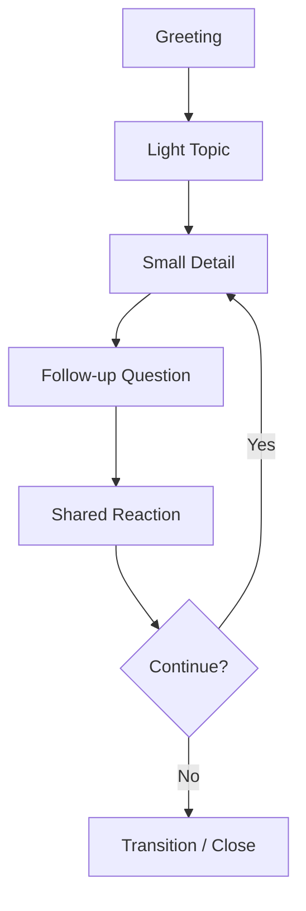
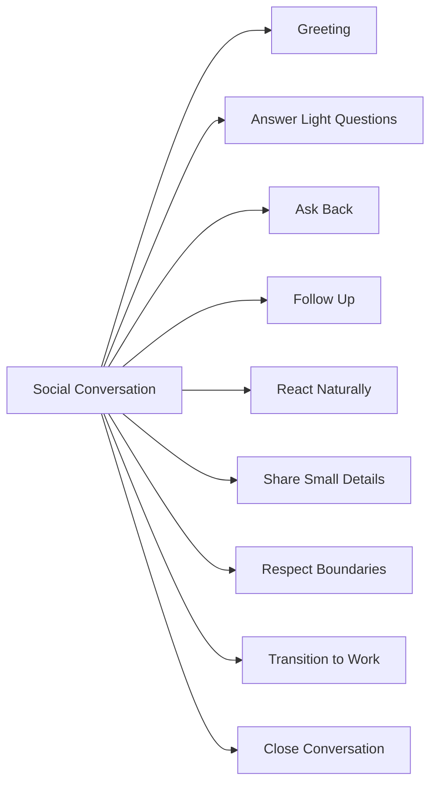
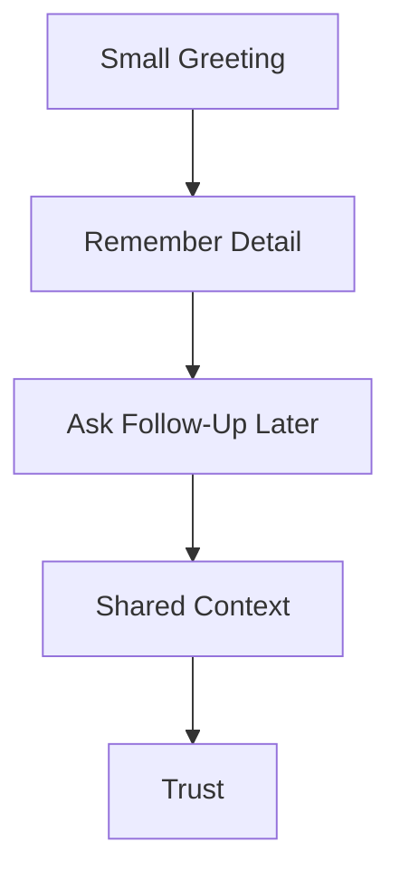
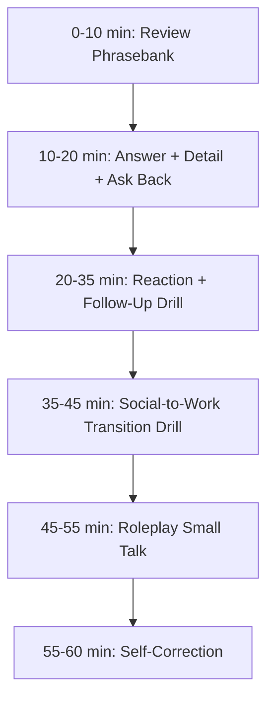

# English for Conversation Part 22 — Social Conversation and Relationship Building

> Goal part ini: kamu bisa melakukan social conversation dalam English dengan natural, ringan, aman secara budaya, dan berguna untuk membangun trust dengan rekan kerja global.

Banyak software engineer menganggap small talk tidak penting. Secara teknis, small talk memang tidak menyelesaikan bug, tidak memperbaiki latency, dan tidak menulis test.

Tetapi dalam kerja global, social conversation punya fungsi penting:

- membangun trust,
- mengurangi awkwardness,
- membuat collaboration lebih mudah,
- membantu meeting terasa manusiawi,
- membuka jalan untuk feedback yang lebih sehat,
- dan membuat kamu terlihat approachable.

Target part ini bukan menjadi “super extrovert”. Targetnya adalah bisa berpartisipasi secara cukup natural dalam percakapan ringan tanpa panik, kaku, atau terlalu personal.

---

## 1. Target Performance

Setelah part ini, kamu harus mampu melakukan percakapan seperti ini:

```text
A: How was your weekend?

B: Pretty good. I spent some time with family and did a bit of reading.
How about you?

A: Nice. I went hiking.

B: That sounds fun. Do you usually hike around your area, or was this a special trip?
```

Atau dalam konteks kerja:

```text
A: Morning! How are you?

B: Doing well, thanks. A bit busy with the release this week, but good overall.
How about you?

A: Same here. Lots going on.

B: Yeah, release weeks are always intense.
Hopefully this one goes smoothly.
```

Percakapan ringan yang baik biasanya tidak panjang. Yang penting adalah:

1. respond,
2. add small detail,
3. ask back or follow up,
4. respect boundaries.

---

## 2. Mental Model: Social Conversation Is Trust Maintenance

Social conversation bukan sekadar pertukaran informasi. Ini adalah trust maintenance protocol.



Kamu tidak perlu membuat percakapan luar biasa. Kamu hanya perlu menjaga loop tetap nyaman.

| Step | Function | Example |
|---|---|---|
| Greeting | open politely | “Hey, how’s it going?” |
| Light Topic | safe topic | “How was your weekend?” |
| Small Detail | give something to respond to | “I watched a movie and relaxed.” |
| Follow-up | show interest | “What did you watch?” |
| Reaction | build warmth | “Nice, that sounds fun.” |
| Transition | move back to work | “Anyway, should we start with the release plan?” |

---

## 3. Sub-Skill Decomposition

Following Kaufman-style skill deconstruction, social conversation can be split into small sub-skills.



High-leverage sub-skills:

1. greeting,
2. answering with small detail,
3. asking back,
4. follow-up questions,
5. transitioning to work.

---

## 4. The Basic Small Talk Formula

Many learners answer too shortly.

Weak:

```text
A: How was your weekend?
B: Good.
```

This ends the conversation.

Better:

```text
A: How was your weekend?
B: Pretty good. I stayed home and watched a movie. How about you?
```

Formula:

```text
Answer + Small Detail + Ask Back
```

### 4.1 Examples

```text
Pretty good. I spent time with family. How about you?
Not bad. I mostly relaxed at home. How was yours?
Good, thanks. I tried a new restaurant. What about you?
A bit busy, but good overall. How are things on your side?
```

### 4.2 Why It Works

Small detail gives the other person something to respond to. Ask back shows reciprocity.

---

## 5. Greetings and Openers

### 5.1 Common Greetings

```text
Hi, how are you?
Hey, how’s it going?
Good morning.
How’s your day going?
How are things?
```

### 5.2 Work-Friendly Openers

```text
How’s your week going?
Busy week?
How’s the release going?
How are things on your side?
How’s the project going?
```

### 5.3 Remote Work Openers

```text
Can you hear me okay?
How’s your day going so far?
Hope your morning is going well.
Thanks for joining.
```

### 5.4 Avoid Overly Formal Phrases

Awkward:

```text
How do you do?
I am fine, thank you, and you?
```

Better:

```text
I’m good, thanks. How about you?
```

---

## 6. Answering Common Small Talk Questions

### 6.1 “How are you?”

Safe answers:

```text
I’m good, thanks. How about you?
Doing well, thanks.
Pretty good. A bit busy, but good overall.
Not bad. How are you?
```

If you are tired:

```text
A bit tired, but doing okay.
It’s been a busy week, but I’m good.
```

Avoid oversharing unless relationship is close.

### 6.2 “How was your weekend?”

```text
Pretty good. I mostly relaxed at home.
Good. I spent some time with family.
Nice. I tried a new café.
Quiet, but nice. How was yours?
```

### 6.3 “How’s your week going?”

```text
Busy, but manageable.
Pretty productive so far.
A bit intense because of the release, but okay.
Good overall. We’re making progress on the migration.
```

### 6.4 “Any plans for the weekend?”

```text
Nothing big. I’ll probably rest and catch up on some reading.
I might meet some friends.
I’m planning to spend time with family.
Not sure yet. How about you?
```

---

## 7. Asking Follow-Up Questions

Follow-up questions keep conversation alive.

### 7.1 Safe Follow-Ups

```text
How was it?
Did you enjoy it?
Was it your first time there?
Do you usually do that on weekends?
How did that go?
```

### 7.2 Work-Social Follow-Ups

```text
How’s that project going?
Is the release still on track?
How’s the new setup working for you?
Has the week been busy on your side?
```

### 7.3 Follow-Up Example

```text
A: I went hiking this weekend.
B: Nice. Was it a long hike?

A: Around three hours.
B: That sounds fun. Do you hike often?
```

This is simple, but natural.

---

## 8. Reacting Naturally

Many learners skip reactions and jump to questions. That can sound mechanical.

### 8.1 Reaction Phrases

```text
Nice.
That sounds fun.
That sounds relaxing.
That sounds intense.
That must have been tiring.
That’s interesting.
Good to hear.
Sorry to hear that.
```

### 8.2 Reaction + Follow-Up

```text
Nice. How was it?
That sounds fun. Where did you go?
That sounds intense. Is it getting better now?
Good to hear. What changed?
```

### 8.3 Avoid Fake Overreaction

Too much:

```text
Wow amazing incredible fantastic!
```

Better:

```text
Nice, that sounds fun.
```

Natural social English is often moderate.

---

## 9. Sharing Small Details

You do not need to share private information. Share small, safe details.

### 9.1 Safe Topics

| Topic | Example |
|---|---|
| weekend | “I mostly relaxed at home.” |
| food | “I tried a new restaurant.” |
| weather | “It’s been raining a lot here.” |
| hobbies | “I’ve been reading a bit lately.” |
| work pace | “This week has been busy because of the release.” |
| travel | “I visited family last weekend.” |
| learning | “I’m trying to improve my English conversation.” |

### 9.2 Small Detail Patterns

```text
I mostly...
I spent some time...
I tried...
I’ve been...
I’m planning to...
```

Examples:

```text
I mostly stayed home and rested.
I spent some time with family.
I tried a new coffee place.
I’ve been reading about system design.
I’m planning to take it easy this weekend.
```

### 9.3 Avoid Too Much Detail

Weak:

```text
Let me tell you everything that happened from Friday night...
```

Better:

```text
Pretty good. I had a quiet weekend and spent time with family.
```

Small talk is lightweight.

---

## 10. Cultural Sensitivity and Boundaries

Social conversation in global teams should be safe and respectful.

### 10.1 Safer Topics

Generally safe:

- weekend,
- food,
- weather,
- hobbies,
- travel,
- light work context,
- books,
- movies,
- local events,
- learning.

### 10.2 Sensitive Topics

Be careful with:

- politics,
- religion,
- salary,
- age,
- family status,
- health details,
- relationship status,
- personal finances,
- immigration status,
- physical appearance.

### 10.3 Boundary Phrases

If someone asks something too personal:

```text
I usually keep that private, but thanks for asking.
I’d rather not go into details, but everything is okay.
That’s a long story. Maybe another time.
```

If you accidentally ask something too personal:

```text
No pressure to answer if that’s too personal.
```

This phrase is very useful.

---

## 11. Social Conversation in Engineering Context

Small talk can connect naturally to work.

### 11.1 Work-Light Topics

```text
How’s the release going?
How’s the migration work going?
Busy week with the sprint?
How’s the new service behaving?
How are things with the incident follow-up?
```

### 11.2 Light Responses

```text
Busy, but moving forward.
A bit intense, but manageable.
We’re still working through a few edge cases.
Better now that the deployment is stable.
```

### 11.3 Avoid Turning Small Talk into Full Technical Deep Dive

If the meeting has not started:

```text
A: How’s the release going?
B: Busy, but okay. We found a few edge cases, but nothing blocking so far.
```

Do not launch into a 10-minute incident report unless asked.

---

## 12. Transitioning from Social to Work

A key skill is moving from small talk to agenda.

### 12.1 Transition Phrases

```text
Anyway, should we get started?
Alright, shall we jump into the agenda?
Okay, let’s start with the release update.
Good to hear. So, about the PR...
Nice. Let’s talk about the migration.
```

### 12.2 Example

```text
A: How was your weekend?
B: Pretty good. I spent time with family. How about you?
A: Nice, I went hiking.
B: That sounds fun. Anyway, should we get started with the design review?
```

This transition is natural and efficient.

---

## 13. Ending Social Conversation

### 13.1 Closing Phrases

```text
Nice talking to you.
Good catching up.
Hope the rest of your day goes well.
Have a good one.
Enjoy your weekend.
Talk to you later.
```

### 13.2 Meeting Context Closing

```text
Thanks, good chatting.
Let’s catch up more later.
I’ll let you get back to your day.
```

### 13.3 Avoid Abrupt Ending

Abrupt:

```text
Ok bye.
```

Better:

```text
Nice talking to you. I’ll let you get back to work.
```

---

## 14. Building Relationship Over Time

Relationship building is not one big conversation. It is repeated lightweight contact.



### 14.1 Remembering Details

If someone said they were moving house:

```text
How did the move go?
Are you settled in now?
```

If someone mentioned a release:

```text
How did the release go?
Did everything go smoothly?
```

If someone mentioned vacation:

```text
How was your trip?
Hope you had a good break.
```

This is simple but powerful.

### 14.2 Professional Warmth

Professional warmth means being friendly without becoming intrusive.

```text
Good to see you.
Hope your week is going well.
Thanks again for your help yesterday.
I appreciated your feedback on the PR.
```

---

## 15. Handling Awkward Silence

Awkward silence is normal.

### 15.1 Recovery Phrases

```text
Anyway, how’s your week going?
By the way, how’s the project going?
So, should we get started?
```

### 15.2 Use Work Transition

If small talk stalls:

```text
Alright, should we jump into the topic?
```

No need to force it.

---

## 16. Social Conversation for Introverts

You do not need to be highly expressive. Use repeatable patterns.

### 16.1 Minimal but Warm

```text
Good morning. How’s your day going?
Pretty good, thanks. How about you?
Nice. Glad to hear that.
Shall we get started?
```

### 16.2 Low-Energy Friendly Responses

```text
I’m doing okay, thanks.
It’s been a busy week, but good overall.
Nothing too exciting, but I had a nice weekend.
```

### 16.3 Your Goal

Your goal is not to entertain. Your goal is to be pleasant, clear, and responsive.

---

## 17. Social Conversation Phrasebank

### 17.1 Greetings

```text
Hey, how’s it going?
Good morning.
How are things?
How’s your day going?
```

### 17.2 Weekend

```text
How was your weekend?
Any plans for the weekend?
Did you do anything fun?
```

### 17.3 Work-Light

```text
Busy week?
How’s the release going?
How are things on your side?
```

### 17.4 Reactions

```text
Nice.
That sounds fun.
That sounds relaxing.
That sounds intense.
Good to hear.
Sorry to hear that.
```

### 17.5 Follow-Ups

```text
How was it?
Did you enjoy it?
Do you do that often?
How did that go?
```

### 17.6 Transitions

```text
Anyway, should we get started?
Alright, let’s jump into the agenda.
So, about the PR...
```

### 17.7 Closings

```text
Nice talking to you.
Have a good one.
Enjoy your weekend.
Talk to you later.
```

---

## 18. Dialogue Example: Before a Meeting

```text
A: Hey, how’s it going?

B: Pretty good, thanks. A bit busy with the release, but good overall.
How about you?

A: Same here. Lots going on this week.

B: Yeah, release weeks are always intense.
Hopefully this one goes smoothly.

A: I hope so too.

B: Anyway, should we get started with the rollout plan?
```

Good points:

- short,
- natural,
- work-related but light,
- clean transition.

---

## 19. Dialogue Example: Building on Past Detail

```text
A: Morning!

B: Morning! How was your trip last week?

A: It was great, thanks. Good to take a break.

B: Nice. Glad to hear that.
Was it your first time there?

A: Yes, actually.

B: Cool. We can catch up more later.
Should we start with the design review?
```

Remembering small details builds trust.

---

## 20. Dialogue Example: Safe Boundary

```text
A: Do you have family here?

B: I usually keep family details private, but I’ve been enjoying living here so far.
How about you? Have you been in this city long?

A: Fair enough. I’ve been here for five years.

B: Nice. Do you like it?
```

You can set boundaries without making the conversation awkward.

---

## 21. Dialogue Example: Social to Technical Transition

```text
A: Any plans for the weekend?

B: Nothing big. I’ll probably rest and catch up on reading.
How about you?

A: I might go hiking.

B: Nice, hope the weather is good.
Anyway, about the incident follow-up, should we start with the timeline?
```

The transition is smooth because it uses “Anyway” and a specific work topic.

---

## 22. Common Mistakes

### 22.1 One-Word Answers

Weak:

```text
Good.
```

Better:

```text
Good, thanks. A bit busy, but okay. How about you?
```

### 22.2 Too Much Personal Detail

Weak:

```text
Let me explain every family issue I had this weekend...
```

Better:

```text
It was a bit busy, but okay overall.
```

### 22.3 Asking Sensitive Questions Too Early

Risky:

```text
Are you married?
How old are you?
How much do you earn?
```

Better:

```text
How was your weekend?
Do you have any plans for the weekend?
```

### 22.4 No Transition to Work

Weak:

```text
Small talk continues until meeting time is gone.
```

Better:

```text
Anyway, should we jump into the agenda?
```

### 22.5 Sounding Robotic

Robotic:

```text
I am fine thank you and you.
```

Natural:

```text
I’m good, thanks. How about you?
```

---

## 23. Drill 1 — Answer + Detail + Ask Back

Respond to each prompt using:

```text
Answer + Small Detail + Ask Back
```

Prompts:

1. How are you?
2. How was your weekend?
3. Any plans for the weekend?
4. How’s your week going?
5. How are things on your side?
6. Busy week?
7. How’s the release going?
8. Did you do anything fun recently?
9. How’s your day going?
10. How was your holiday?

Example:

```text
A: How was your weekend?
B: Pretty good. I mostly relaxed at home and watched a movie. How was yours?
```

---

## 24. Drill 2 — Reaction + Follow-Up

For each statement, respond with reaction + follow-up.

1. “I went hiking.”
2. “The release was intense.”
3. “I tried a new restaurant.”
4. “I spent the weekend with family.”
5. “I’m a bit tired today.”
6. “I just came back from vacation.”
7. “The project is finally stable.”
8. “I had a quiet weekend.”
9. “I watched a good movie.”
10. “I’m learning a new tool.”

Example:

```text
A: I went hiking.
B: Nice. Was it a long hike?
```

---

## 25. Drill 3 — Transition to Work

Practice transitioning from social conversation to work.

Use:

```text
Anyway, should we get started with <topic>?
```

Prompts:

1. design review,
2. rollout plan,
3. sprint planning,
4. PR discussion,
5. architecture review,
6. incident follow-up,
7. backlog grooming,
8. debugging session.

Example:

```text
Anyway, should we get started with the rollout plan?
```

---

## 26. Drill 4 — Boundary Practice

Respond politely.

1. Someone asks about your salary.
2. Someone asks about your relationship status.
3. Someone asks about family details.
4. Someone asks about politics.
5. Someone asks about religion.
6. Someone asks why you look tired.
7. Someone asks about health details.
8. Someone asks a question you do not want to answer.

Useful template:

```text
I usually keep that private, but thanks for asking.
```

or:

```text
I’d rather not go into details, but everything is okay.
```

---

## 27. Self-Correction Checklist

After social conversation, score yourself:

| Area | Question | Score |
|---|---|---|
| Responsiveness | Did I answer with more than one word? | 1–5 |
| Reciprocity | Did I ask back or follow up? | 1–5 |
| Naturalness | Did I sound relaxed, not robotic? | 1–5 |
| Boundaries | Did I avoid overly personal topics? | 1–5 |
| Warmth | Did I react naturally? | 1–5 |
| Transition | Did I move to work smoothly when needed? | 1–5 |
| Listening | Did I respond to what they actually said? | 1–5 |

---

## 28. 60-Minute Practice Plan



### Practice Method

1. Pick 5 common small talk prompts.
2. Answer each with:
   - answer,
   - small detail,
   - ask back.
3. Record yourself.
4. Check if your response is:
   - too short,
   - too long,
   - too robotic,
   - too personal.
5. Rewrite and repeat.

---

## 29. High-Value Patterns to Memorize

```text
I’m good, thanks. How about you?
Pretty good. A bit busy, but good overall.
How was your weekend?
Any plans for the weekend?
That sounds fun.
That sounds intense.
Good to hear.
How did that go?
Anyway, should we get started?
Nice talking to you.
Have a good one.
```

These patterns cover most light workplace social conversations.

---

## 30. Final Assignment

Record a 5-minute social conversation roleplay.

Scenario:

```text
You join a remote meeting 3 minutes early with a teammate from another country.
You need to make light conversation, respond naturally, ask follow-up questions, and transition to the meeting topic.
```

Your conversation must include:

1. greeting,
2. answer + small detail + ask back,
3. at least two follow-up questions,
4. at least three natural reactions,
5. one safe work-light topic,
6. smooth transition to agenda,
7. friendly closing phrase.

Use this structure:

```text
Hey, how’s it going?
Pretty good...
How about you?
That sounds...
How did that go?
Anyway, should we get started with...?
```

---

## Part 22 Summary

Social conversation is not useless. In global engineering teams, it is lightweight trust maintenance.

The core pattern is:

```text
Greeting → Answer + Small Detail → Ask Back → Follow Up → React → Transition
```

The most valuable phrases are:

```text
I’m good, thanks. How about you?
Pretty good. A bit busy, but good overall.
That sounds fun.
How did that go?
Anyway, should we get started?
```

You do not need to be a social expert. You just need to be responsive, respectful, and able to keep small conversations comfortable.

---
