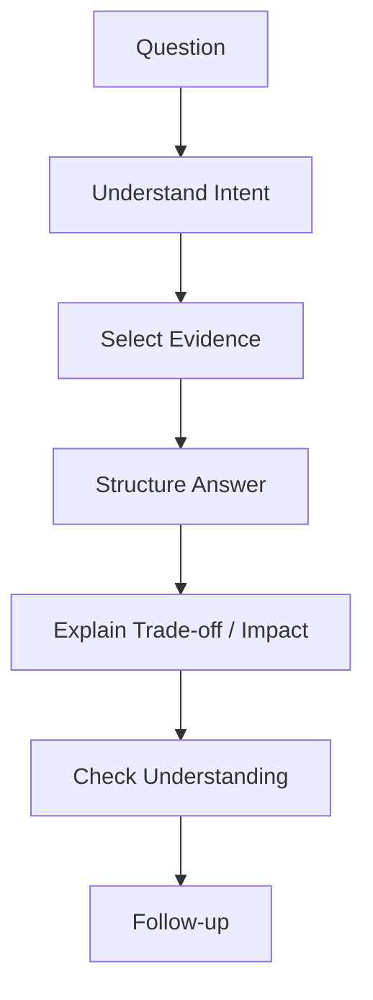
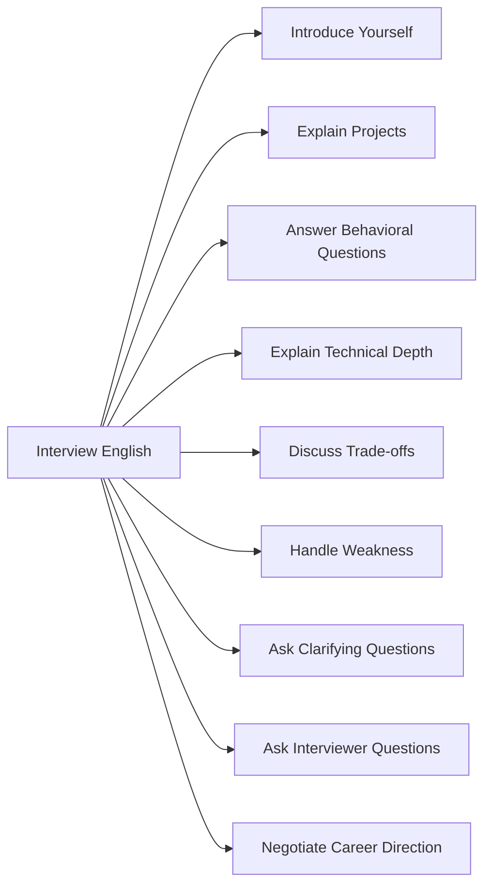
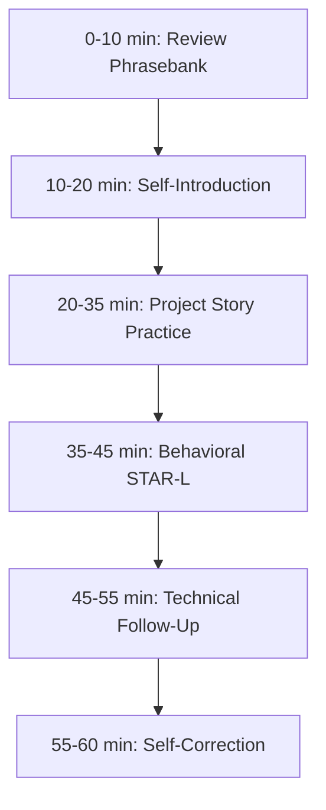

# English for Conversation Part 23 — Interview and Career Conversation

> Goal part ini: kamu bisa menjalani interview dan career conversation dalam English dengan struktur yang jelas, kredibel, natural, dan tidak terdengar seperti menghafal script.

Interview conversation berbeda dari daily work conversation. Dalam interview, kamu tidak hanya menjawab pertanyaan. Kamu sedang membangun evidence bahwa kamu bisa:

- memahami masalah,
- menjelaskan pengalaman,
- membuat keputusan teknis,
- bekerja dengan orang lain,
- belajar dari kegagalan,
- dan cocok dengan kebutuhan role.

Banyak engineer gagal bukan karena tidak punya skill, tetapi karena tidak bisa mengubah pengalaman menjadi cerita yang jelas.

Part ini membangun conversation pattern untuk menjelaskan diri, project, technical decision, conflict, impact, dan career direction.

---

## 1. Target Performance

Setelah part ini, kamu harus mampu menjawab seperti ini:

```text
One project I’m proud of was a case management platform for a regulatory workflow.

The main problem was that the existing process was spread across spreadsheets, emails, and manual approvals.
My role was to design the state model and implement the escalation logic.

The hardest part was making the workflow flexible without making it impossible to audit.
We solved that by separating the case lifecycle, task lifecycle, and approval lifecycle.

The result was a system where each transition was traceable, reviewable, and easier to defend during compliance review.
```

Jawaban ini kuat karena:

1. memberi context,
2. menjelaskan role,
3. menyebut complexity,
4. menjelaskan decision,
5. menyebut impact.

Interview English yang baik bukan sekadar fluent. Ia harus **structured, evidence-based, and relevant.**

---

## 2. Mental Model: Interview Is Evidence Delivery

Interview bukan ujian hafalan. Interview adalah proses mengirim evidence.



Setiap jawaban interview sebaiknya menjawab dua lapisan:

| Layer | Meaning | Example |
|---|---|---|
| Surface question | what they ask | “Tell me about a project.” |
| Hidden intent | what they evaluate | scope, ownership, clarity, impact, technical judgment |

Jika interviewer bertanya:

```text
Tell me about a challenging project.
```

Mereka mungkin mengevaluasi:

- seberapa kompleks pengalaman kamu,
- apa peran spesifik kamu,
- bagaimana kamu berpikir,
- bagaimana kamu bekerja dengan constraint,
- bagaimana kamu mengukur hasil.

---

## 3. Sub-Skill Decomposition

Following Kaufman-style deconstruction, interview conversation can be split into small sub-skills.



High-leverage sub-skills:

1. self-introduction,
2. project explanation,
3. behavioral storytelling,
4. technical decision explanation,
5. asking strong questions.

---

## 4. Self-Introduction

A good self-introduction is not your full biography. It is a targeted positioning statement.

### 4.1 Basic Structure

```text
I’m a <role> with experience in <domain/scope>.
I’ve worked on <systems/problems>.
My strengths are <strengths>.
Recently, I’ve been focused on <current focus>.
I’m interested in this role because <fit>.
```

Example:

```text
I’m a software engineer and tech lead with experience building workflow-heavy systems and case management platforms.
I’ve worked on systems involving state machines, escalation logic, auditability, and cross-team integration.
My strengths are backend architecture, process modelling, and turning complex business rules into maintainable systems.
Recently, I’ve been focused on improving how teams design defensible workflows.
I’m interested in this role because it combines complex domain logic with scalable system design.
```

### 4.2 Short Version

```text
I’m a backend-focused software engineer with strong experience in workflow systems, state modelling, and distributed services.
I enjoy solving problems where technical architecture and business process need to fit together clearly.
```

### 4.3 Avoid

Weak:

```text
My name is... I graduated from... I know Java, Go, JavaScript, SQL...
```

Better:

```text
I’m a software engineer focused on distributed systems and workflow-heavy applications.
```

Interview introduction should lead with relevance, not chronology.

---

## 5. Explaining Projects

Project explanation is one of the most important interview skills.

### 5.1 Project Answer Template

```text
Context:
<what system/problem>

Problem:
<what was difficult or broken>

My role:
<what you owned>

Approach:
<what you did and why>

Result:
<impact>

Learning:
<what you learned>
```

### 5.2 Spoken Version

```text
One project I worked on was...
The main problem was...
My role was...
The approach I took was...
The result was...
One thing I learned was...
```

### 5.3 Example — Technical Project

```text
One project I worked on was a workflow engine for handling enforcement cases.

The main problem was that each case could move through different paths depending on risk level, evidence completeness, and approval requirements.
My role was to model the lifecycle and implement the transition rules.

The approach I took was to separate the case state, task state, and approval state.
That made the system easier to reason about because each lifecycle had its own invariant.

The result was a workflow that was more flexible but still auditable.
One thing I learned was that state modelling is not just a technical concern; it also affects compliance, operations, and user trust.
```

This answer shows depth without becoming too long.

---

## 6. Explaining Technical Depth

When interviewers ask technical follow-up, they want to know if you actually understand the system.

### 6.1 Technical Depth Pattern

```text
At a high level...
The key challenge was...
The tricky part was...
The trade-off was...
The reason we chose this approach was...
```

Example:

```text
At a high level, the system processed case events and moved cases through a controlled lifecycle.
The key challenge was preventing invalid transitions while still allowing different paths for different case types.
The tricky part was that business users wanted flexibility, but compliance needed a clear audit trail.
The trade-off was between configurability and control.
The reason we chose explicit transition rules was that they made the workflow easier to test and defend.
```

### 6.2 Depth Without Rambling

Use layers:

```text
High level:
<simple explanation>

Deeper detail:
<architecture / decision>

Edge case:
<failure / trade-off>
```

Example:

```text
High level, it was a workflow system.
Deeper detail, the core was a state machine with guarded transitions.
One edge case was reopening a closed case when new evidence arrived.
We had to allow reopening but preserve the original closure reason for auditability.
```

---

## 7. STAR for Behavioral Questions

STAR is useful, but many candidates use it mechanically. Use it as structure, not script.

```text
Situation → Task → Action → Result
```

For engineering interviews, add one more layer:

```text
Situation → Task → Action → Result → Learning
```

### 7.1 STAR-L Template

```text
Situation:
At <context>, we had <problem>.

Task:
I was responsible for <responsibility>.

Action:
I did <actions>, focusing on <reason>.

Result:
As a result, <impact>.

Learning:
What I learned was <lesson>.
```

### 7.2 Example — Conflict

```text
At one point, our team disagreed about whether to build a flexible workflow configuration system or keep the rules hardcoded.

I was responsible for the backend design, so I needed to make sure the solution was maintainable and auditable.

I proposed separating rules into explicit transition definitions, but keeping high-risk transitions controlled by code review instead of fully dynamic configuration.
That gave business users some flexibility while preserving engineering control over risky paths.

The result was a design both product and compliance could accept.
What I learned was that flexibility is not always the highest goal; sometimes controlled change is more important.
```

This sounds mature because it balances technical and organizational constraints.

---

## 8. Common Interview Questions and Answer Patterns

### 8.1 “Tell Me About Yourself”

Pattern:

```text
I’m a <role> with experience in <area>.
I’ve worked on <types of systems>.
My strongest areas are <strengths>.
I’m now looking for <direction>.
```

Example:

```text
I’m a software engineer with experience building backend systems for complex workflows.
I’ve worked on distributed services, case management platforms, and systems that require auditability and clear state transitions.
My strongest areas are system design, domain modelling, and turning ambiguous requirements into reliable software.
I’m now looking for a role where I can work on technically complex systems with meaningful operational impact.
```

### 8.2 “What Is Your Biggest Strength?”

Pattern:

```text
One of my strengths is...
For example...
The impact was...
```

Example:

```text
One of my strengths is structuring ambiguous problems.
For example, in a case management project, the requirements were initially described as a long list of exceptions.
I helped model them as state transitions, roles, and escalation rules.
That made the system easier to implement, test, and explain to stakeholders.
```

### 8.3 “What Is Your Weakness?”

Bad answers:

```text
I am perfectionist.
I work too hard.
I have no weakness.
```

Better pattern:

```text
One area I’ve been improving is...
In the past, this caused...
I’ve been addressing it by...
The result is...
```

Example:

```text
One area I’ve been improving is communicating uncertainty earlier.
In the past, I sometimes tried to resolve ambiguity myself before raising it.
That could slow down alignment.
I’ve been addressing it by explicitly naming assumptions and risks earlier in design discussions.
That has helped teams make decisions faster.
```

This is honest and credible.

### 8.4 “Tell Me About a Failure”

Pattern:

```text
The situation was...
The mistake was...
The impact was...
What I changed afterward was...
```

Example:

```text
In one project, I underestimated the complexity of a migration because the schema change looked simple.
The mistake was focusing too much on the implementation and not enough on rollback and old client compatibility.
The impact was that we had to delay the release to validate the migration path.
After that, I started treating migration design as part of the feature design, not as an afterthought.
```

This answer is strong because it shows learning, not self-blame.

---

## 9. Explaining Trade-Offs in Interviews

Senior interviews often test judgment through trade-offs.

### 9.1 Trade-Off Pattern

```text
We considered <Option A> and <Option B>.
Option A gave us <benefit>, but <cost>.
Option B gave us <benefit>, but <cost>.
We chose <option> because <reason>.
```

Example:

```text
We considered making the workflow rules fully configurable or keeping them explicit in code.
Full configurability gave product more flexibility, but it increased the risk of invalid transitions.
Explicit rules were less flexible, but easier to test, review, and audit.
We chose explicit rules with limited configuration because auditability mattered more than maximum flexibility.
```

### 9.2 Add Consequence

```text
The consequence of that decision was...
```

Example:

```text
The consequence of that decision was that some rule changes required deployment, but the workflow became easier to reason about and safer to operate.
```

---

## 10. Explaining Impact

Impact does not always mean revenue numbers. In engineering, impact can be:

- reliability improvement,
- reduced operational burden,
- faster debugging,
- safer rollout,
- clearer audit trail,
- lower support volume,
- better developer experience,
- reduced risk.

### 10.1 Impact Patterns

```text
The impact was...
This reduced...
This improved...
This made it easier to...
This helped the team...
```

Examples:

```text
The impact was that support could track case status more clearly.
This reduced manual follow-up between teams.
This improved traceability for compliance review.
This made it easier to debug failed transitions.
This helped the team release workflow changes with more confidence.
```

### 10.2 If You Do Not Have Metrics

Do not invent numbers. Use qualitative impact honestly.

```text
We did not have a precise metric for that, but qualitatively it reduced confusion during support handoff.
```

This is better than making unsupported claims.

---

## 11. Handling Clarification During Interview

If you do not understand a question, clarify.

### 11.1 Clarification Phrases

```text
Could you clarify what aspect you want me to focus on?
Do you mean the technical design or the team process?
Are you asking about the implementation detail or the decision behind it?
```

### 11.2 Buying Thinking Time

```text
That’s a good question. Let me think for a moment.
I want to choose the most relevant example.
Let me structure my answer in two parts.
```

### 11.3 When You Need to Correct Yourself

```text
Actually, let me rephrase that.
What I meant was...
Let me be more precise.
```

Self-correction is acceptable. It often sounds mature.

---

## 12. Talking About Career Direction

### 12.1 Career Direction Pattern

```text
I’m looking for a role where I can...
I’m especially interested in...
I want to grow toward...
I enjoy working on...
```

Examples:

```text
I’m looking for a role where I can work on complex backend systems and influence architecture decisions.
I’m especially interested in systems with meaningful workflow, reliability, and operational complexity.
I want to grow toward broader technical leadership while staying close to engineering execution.
I enjoy working on problems where domain modelling and system design both matter.
```

### 12.2 Avoid Overly Generic Answers

Weak:

```text
I want to grow and learn.
```

Better:

```text
I want to grow in technical leadership, especially around system design, cross-team architecture, and helping teams make better engineering decisions.
```

---

## 13. Talking About Leaving a Role

Be professional. Avoid negativity.

### 13.1 Pattern

```text
I’ve learned a lot in my current role, especially around...
At this point, I’m looking for...
```

Example:

```text
I’ve learned a lot in my current role, especially around workflow systems and domain-heavy backend design.
At this point, I’m looking for a role with broader architecture responsibility and more exposure to large-scale distributed systems.
```

### 13.2 Avoid

```text
My manager is bad.
The company is messy.
I hate the process.
```

Even if true, frame it professionally.

---

## 14. Asking Questions to the Interviewer

Strong candidates ask strong questions.

### 14.1 Role Clarity Questions

```text
What would success look like in the first six months?
What are the main problems this role is expected to solve?
How much of the role is hands-on implementation versus technical leadership?
```

### 14.2 System Questions

```text
What are the most challenging technical problems the team is working on?
What are the biggest reliability or scalability concerns today?
How does the team make architecture decisions?
```

### 14.3 Team Process Questions

```text
How does the team handle code review and design review?
How are incidents reviewed?
How do engineers collaborate across teams?
```

### 14.4 Growth Questions

```text
What does growth look like for engineers at this level?
What distinguishes a strong engineer from an exceptional one on this team?
```

These questions show seriousness and maturity.

---

## 15. Salary and Expectation Conversation Basics

Salary negotiation can be sensitive. Keep it clear and professional.

### 15.1 If Asked Salary Expectation

```text
I’m flexible depending on the overall package, role scope, and growth opportunity.
Based on the market and the level of responsibility, I’m looking for something in the range of <range>.
```

### 15.2 If You Want to Defer

```text
I’d like to understand the role scope and level expectations better before giving a specific number.
```

### 15.3 If Asked Current Salary

Depending on local norms and comfort:

```text
I’d prefer to focus on the compensation range for this role and the value I can bring.
```

### 15.4 Keep Tone Calm

Do not apologize for discussing compensation. It is a normal professional topic.

---

## 16. Interview Phrasebank

### 16.1 Structure

```text
Let me structure my answer in two parts.
At a high level...
The key challenge was...
The trade-off was...
The result was...
```

### 16.2 Ownership

```text
My role was...
I was responsible for...
I led the design of...
I worked closely with...
```

### 16.3 Impact

```text
The impact was...
This improved...
This reduced...
This made it easier to...
```

### 16.4 Uncertainty

```text
I don’t remember the exact number, but...
We did not have precise metrics, but...
The main signal was...
```

### 16.5 Clarification

```text
Could you clarify what aspect you want me to focus on?
Do you mean technical design or team process?
```

### 16.6 Closing

```text
Does that answer your question?
I can go deeper into the technical design if useful.
```

---

## 17. Dialogue Example: Project Explanation

```text
Interviewer: Tell me about a challenging project you worked on.

Candidate: One challenging project was a case management platform for a regulatory workflow.

The main problem was that the process had many case paths depending on risk level, evidence completeness, and approval requirements.

My role was to design the lifecycle model and implement the escalation logic.

The hardest part was balancing flexibility with auditability.
Business users wanted flexible paths, but compliance needed every state transition to be explainable.

We solved this by separating the case lifecycle, task lifecycle, and approval lifecycle.
That made each part easier to reason about and test.

The impact was that the team could track case status more clearly and review historical transitions during audit.

Interviewer: Interesting. What was the main trade-off?

Candidate: The main trade-off was configurability versus control.
Full configuration would be flexible, but risky for high-impact transitions.
Explicit transition rules were less flexible, but safer and easier to defend.
```

---

## 18. Dialogue Example: Handling Weakness

```text
Interviewer: What is one area you are working to improve?

Candidate: One area I’ve been improving is communicating uncertainty earlier.

In the past, when requirements were ambiguous, I sometimes tried to resolve too much myself before raising assumptions.
That could delay alignment.

I’ve been improving this by naming assumptions explicitly in design discussions.
For example, instead of saying “this design should work,” I now say “this design assumes events are delivered at least once, and we need to validate idempotency.”

That has helped discussions become clearer and reduced late surprises.
```

This is a strong weakness answer because it shows behavioral change.

---

## 19. Dialogue Example: Asking Interviewer Questions

```text
Candidate: I have a few questions about the role.

First, what would success look like in the first six months?

Interviewer: We’d expect the person to help improve our workflow platform and reduce operational issues.

Candidate: That makes sense.
What are the biggest operational issues today?

Interviewer: Mostly unclear state transitions and manual escalation.

Candidate: That is very relevant to my background.
How does the team currently make decisions around workflow design?
```

Good interviewer questions create deeper conversation and show fit.

---

## 20. Common Mistakes

### 20.1 Answering Too Broadly

Weak:

```text
I worked on backend, frontend, database, everything.
```

Better:

```text
My main ownership was backend workflow design, especially state transitions, escalation logic, and audit trail.
```

### 20.2 No Specific Example

Weak:

```text
I am good at problem solving.
```

Better:

```text
One example was when we had to model a workflow with multiple approval paths...
```

### 20.3 Too Much Technical Detail Too Early

Weak:

```text
First the table had columns A, B, C, then the DTO...
```

Better:

```text
At a high level, the system tracked case transitions. I can go deeper into the data model if useful.
```

### 20.4 Not Explaining Impact

Weak:

```text
I implemented the feature.
```

Better:

```text
I implemented the feature, and it reduced manual handoff because teams could track escalation status directly in the system.
```

### 20.5 Memorized Sound

Weak:

```text
I am passionate and hardworking and a fast learner.
```

Better:

```text
I enjoy complex backend problems where domain rules, system reliability, and team process intersect.
```

---

## 21. Drill 1 — Self-Introduction

Create three versions:

### 21.1 30-Second Version

```text
I’m a...
I’ve worked on...
My strengths are...
I’m looking for...
```

### 21.2 60-Second Version

Add:

```text
One example is...
```

### 21.3 2-Minute Version

Add:

```text
The kind of problems I enjoy are...
```

Practice until you can say each without reading.

---

## 22. Drill 2 — Project Story

Prepare 5 project stories:

1. most technically complex project,
2. project with conflict or trade-off,
3. project with failure or learning,
4. project with measurable or qualitative impact,
5. project where you showed leadership.

Use:

```text
Context:
Problem:
My role:
Approach:
Result:
Learning:
```

---

## 23. Drill 3 — Behavioral STAR-L

Answer these prompts:

1. Tell me about a conflict.
2. Tell me about a failure.
3. Tell me about a time you led a technical decision.
4. Tell me about a time you disagreed with a teammate.
5. Tell me about a time you handled ambiguity.
6. Tell me about a time you improved a system.
7. Tell me about a time you had to learn quickly.
8. Tell me about a time you made a trade-off.

Add “Learning” to each answer.

---

## 24. Drill 4 — Technical Depth Follow-Up

For each project, prepare answers to:

```text
Why did you choose that design?
What alternatives did you consider?
What was the main trade-off?
What could go wrong?
How did you test it?
How did you know it worked?
What would you do differently now?
```

These are common follow-up questions.

---

## 25. Drill 5 — Interviewer Questions

Prepare 10 questions for the interviewer:

1. role success,
2. team problems,
3. system architecture,
4. reliability,
5. decision-making,
6. code review,
7. incidents,
8. growth,
9. cross-team collaboration,
10. expectations for level.

Practice asking them naturally.

---

## 26. Self-Correction Checklist

After interview practice, score yourself:

| Area | Question | Score |
|---|---|---|
| Structure | Did my answer have clear beginning, middle, end? | 1–5 |
| Relevance | Did I answer the hidden intent? | 1–5 |
| Specificity | Did I give a concrete example? | 1–5 |
| Ownership | Did I explain my role clearly? | 1–5 |
| Trade-off | Did I show technical judgment? | 1–5 |
| Impact | Did I explain the result? | 1–5 |
| Concision | Did I avoid rambling? | 1–5 |
| Naturalness | Did I sound conversational, not scripted? | 1–5 |

---

## 27. 60-Minute Practice Plan



### Practice Method

1. Pick one interview question.
2. Answer for 2 minutes.
3. Record yourself.
4. Check:
   - was it structured?
   - did it show ownership?
   - did it include impact?
   - did it ramble?
5. Rewrite into cleaner version.
6. Speak again.

---

## 28. High-Value Patterns to Memorize

```text
Let me structure my answer.
At a high level...
The main problem was...
My role was...
The key challenge was...
The trade-off was...
We chose this approach because...
The impact was...
One thing I learned was...
Could you clarify what aspect you want me to focus on?
Does that answer your question?
I can go deeper into the technical details if useful.
```

These patterns cover most interview conversation situations.

---

## 29. Final Assignment

Record a 10-minute mock interview.

Your mock interview must include:

1. self-introduction,
2. project explanation,
3. technical follow-up,
4. behavioral question,
5. failure or weakness answer,
6. career direction answer,
7. two questions for interviewer,
8. closing.

Use these required phrases:

```text
Let me structure my answer.
The main problem was...
My role was...
The trade-off was...
The impact was...
One thing I learned was...
I’m looking for a role where...
What would success look like in the first six months?
```

---

## Part 23 Summary

Interview English is evidence delivery.

The core pattern is:

```text
Question → Hidden Intent → Evidence → Structure → Impact → Follow-Up
```

The most important answer patterns are:

```text
Self-introduction:
role + experience + strengths + direction

Project:
context + problem + role + approach + result + learning

Behavioral:
situation + task + action + result + learning

Technical decision:
options + trade-off + reason + consequence
```

If you can explain your experience with clarity, specificity, and impact, you do not need perfect English to sound credible.

---
