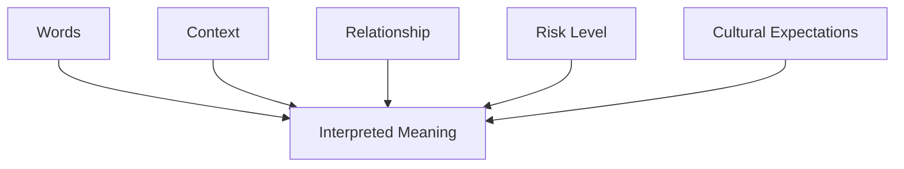
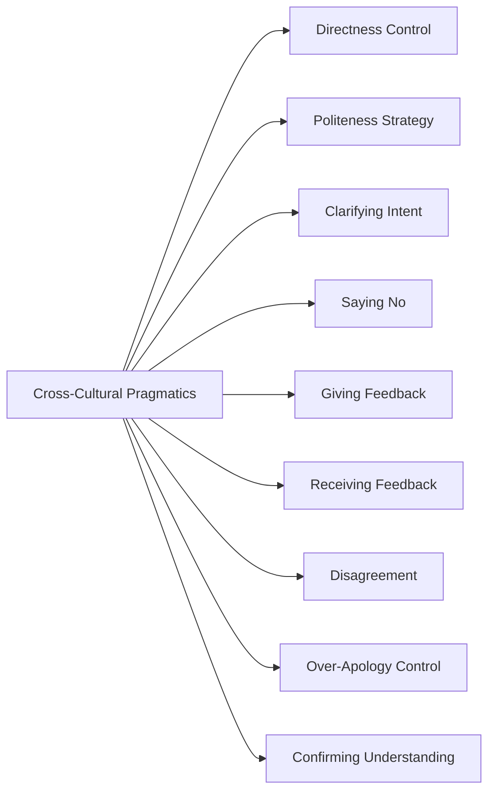
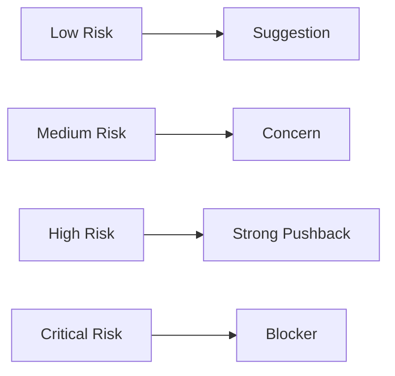
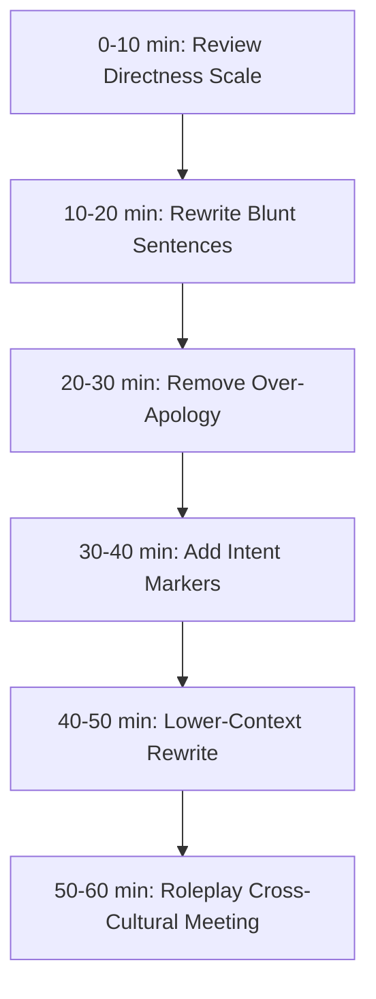

# English for Conversation Part 24 — Cross-Cultural Pragmatics for Global Engineering Teams

> Goal part ini: kamu bisa berkomunikasi dalam English secara tepat secara budaya dan konteks, bukan hanya benar secara grammar.

Grammar menjawab pertanyaan:

```text
Is this sentence structurally correct?
```

Pragmatics menjawab pertanyaan:

```text
What will this sentence mean to the listener in this context?
```

Dalam global engineering team, pragmatics sering lebih penting daripada grammar kecil. Kalimat yang secara grammar benar bisa terdengar:

- terlalu kasar,
- terlalu lemah,
- terlalu tidak jelas,
- terlalu pasif-agresif,
- terlalu formal,
- atau terlalu informal.

Part ini membahas English sebagai alat kerja lintas budaya: bagaimana menyampaikan maksud dengan clarity, respect, and appropriate force.

---

## 1. Target Performance

Setelah part ini, kamu harus mampu memilih level komunikasi yang tepat.

Misalnya, bukan:

```text
Your design is wrong.
```

Tetapi:

```text
I’m concerned that this design may not handle rollback safely.
Can we walk through the failure scenario before we decide?
```

Bukan:

```text
Maybe if possible perhaps we can consider maybe not releasing.
```

Tetapi:

```text
I don’t think we should release today because the rollback path has not been tested.
```

Keduanya menunjukkan pragmatics:

- tidak terlalu kasar,
- tidak terlalu kabur,
- jelas tentang risiko,
- tetap menjaga kolaborasi.

---

## 2. Mental Model: Meaning = Words + Context + Relationship + Risk

Dalam conversation, meaning tidak hanya datang dari kata-kata.



Kalimat yang sama bisa bermakna berbeda tergantung konteks.

```text
We should discuss this.
```

Bisa berarti:

- “Mari diskusi santai.”
- “Saya punya concern.”
- “Saya tidak setuju.”
- “Ini mungkin masalah serius.”

Karena itu, dalam global team, kamu perlu membuat intent lebih eksplisit.

---

## 3. Sub-Skill Decomposition

Following Kaufman-style deconstruction, cross-cultural pragmatics can be split into small skills.



High-leverage sub-skills:

1. controlling directness,
2. making intent explicit,
3. saying no clearly,
4. giving feedback without personal attack,
5. confirming understanding.

---

## 4. Direct vs Indirect Communication

Different cultures interpret directness differently. Some teams value blunt clarity. Others value softened wording.

In global engineering, the target is usually:

```text
clear but respectful
```

### 4.1 Directness Scale

| Level | Example | Use When |
|---|---|---|
| Too indirect | “Maybe perhaps if possible...” | usually avoid |
| Soft | “I wonder if...” | low-risk suggestion |
| Neutral | “I’m not sure this handles...” | normal technical concern |
| Clear | “My concern is...” | meaningful risk |
| Strong | “I don’t think we should...” | high risk |
| Too blunt | “This is wrong.” | usually avoid |

### 4.2 Examples

Too indirect:

```text
Maybe if possible we can consider not merging this maybe.
```

Clear:

```text
I don’t think we should merge this until the authorization check is added.
```

Too blunt:

```text
This design is bad.
```

Clear and respectful:

```text
I’m concerned that this design adds more operational complexity than the current problem requires.
```

---

## 5. Politeness Without Losing Clarity

Politeness is not the same as vagueness.

### 5.1 Weak Politeness

```text
Maybe just a small suggestion if you don’t mind, maybe we can check this?
```

Problem: the risk disappears.

### 5.2 Strong Politeness

```text
Can we check the rollback path before release?
I’m concerned that we do not have a safe recovery plan yet.
```

This is polite because it is respectful. It is also clear.

### 5.3 Politeness Tools

| Tool | Example |
|---|---|
| acknowledge | “I see the benefit of this approach.” |
| reason | “My concern is rollback safety.” |
| question | “Can we verify this before merging?” |
| alternative | “A safer option would be...” |
| ownership | “I may be missing something, but...” |

Use tools intentionally, not automatically.

---

## 6. Making Intent Explicit

In cross-cultural teams, hidden intent causes confusion.

### 6.1 Intent Markers

```text
I have a clarification question.
I have a concern.
I have a suggestion.
I want to challenge one assumption.
I think this is a blocker.
I’m not objecting; I just want to understand the trade-off.
```

These phrases tell the listener how to interpret what comes next.

### 6.2 Examples

Without intent marker:

```text
Why did we choose this approach?
```

Can sound like challenge.

With intent marker:

```text
I have a clarification question.
Why did we choose this approach instead of keeping the logic in the service?
```

Without intent marker:

```text
What happens if rollback fails?
```

Can sound accusatory.

With intent marker:

```text
I have one release-risk concern.
What happens if rollback fails?
```

Intent markers reduce misunderstanding.

---

## 7. Saying No Across Cultures

Some cultures expect direct “no”. Others avoid it. In global teams, clear no with reason is usually safest.

### 7.1 No Pattern

```text
I don’t think we should <action>
because <reason>.
A safer alternative is <alternative>.
```

Examples:

```text
I don’t think we should release today because rollback has not been tested.
A safer alternative is to do a limited rollout tomorrow after validation.
```

```text
I don’t think we should add this abstraction yet because we only have one use case.
A safer alternative is to keep the code simple and extract later if the pattern repeats.
```

### 7.2 Soft No

```text
I’d prefer not to do that yet.
I don’t think that is the right trade-off right now.
I would avoid that for the first version.
```

### 7.3 Strong No

```text
I don’t think this is safe to ship as-is.
I can’t support this release without an authorization check.
I think this should block the merge.
```

Use strong no when risk is serious. Being too soft about serious risk is not polite; it is dangerous.

---

## 8. Asking for Clarification

Clarification is culturally safe when framed correctly.

### 8.1 Clarification Patterns

```text
Can you clarify what you mean by...?
When you say <term>, do you mean <A> or <B>?
Can you give an example?
Let me make sure I understood.
```

### 8.2 Avoid

Risky:

```text
What are you talking about?
I don’t understand you.
```

Better:

```text
I’m not sure I understood the last part.
Can you rephrase it?
```

### 8.3 Confirming Understanding

```text
So if I understand correctly, you’re saying that...
Let me repeat that back to make sure I got it.
Do you mean that the migration is safe, but the rollback is still untested?
```

This is one of the best cross-cultural conversation tools.

---

## 9. Giving Feedback Across Cultures

Feedback can easily sound personal if phrased poorly.

### 9.1 Behavior/Code/Impact Pattern

```text
When <behavior/code>,
the impact is <impact>.
Could we <suggestion>?
```

Example:

```text
When the review comment only says “fix this,”
it is hard for the author to understand the reason.
Could we include the risk or expected behavior in the comment?
```

### 9.2 Code Review Feedback

Avoid:

```text
You wrote this wrong.
```

Better:

```text
This condition might not handle inactive users.
Can we add an explicit status check?
```

### 9.3 Team Feedback

Avoid:

```text
You are always late.
```

Better:

```text
When the update comes after the deadline, the release planning becomes harder.
Can we agree on an earlier status update next time?
```

Focus on observable behavior and impact.

---

## 10. Receiving Feedback Across Cultures

Feedback style varies. Some people are direct. Some are indirect. Your job is to extract the useful signal.

### 10.1 Non-Defensive Responses

```text
Thanks for the feedback.
Can you give me an example?
That makes sense.
I’ll think about how to improve that.
Let me make sure I understand the concern.
```

### 10.2 If Feedback Is Too Vague

```text
Can you give me a specific example so I can improve it?
When did you notice this?
What would a better version look like?
```

### 10.3 If Feedback Sounds Harsh

```text
I understand the concern.
Can we focus on the specific behavior or outcome you want changed?
```

This keeps the conversation constructive.

---

## 11. Disagreement Across Cultures

Use disagreement patterns that separate person from idea.

### 11.1 Safe Disagreement Pattern

```text
I see the point.
My concern is...
Could we consider...?
```

Example:

```text
I see the point about moving faster.
My concern is that the migration rollback is not tested.
Could we consider a limited rollout instead?
```

### 11.2 Challenging Assumptions

```text
Can we revisit the assumption that...?
Do we know that for sure?
What happens if that assumption is wrong?
```

### 11.3 Strong Disagreement

```text
I don’t think we should move forward with this until...
```

Example:

```text
I don’t think we should move forward with this until we verify tenant isolation.
```

Strong, but clear and risk-based.

---

## 12. Over-Apology Control

Many non-native speakers overuse “sorry”. This can make you sound less confident, especially when you did nothing wrong.

### 12.1 When “Sorry” Is Appropriate

Use “sorry” when:

- you interrupted,
- you made an actual mistake,
- you caused inconvenience,
- you did not hear something.

```text
Sorry, I missed the last part. Could you repeat it?
Sorry, I made a mistake in the previous update.
```

### 12.2 When to Avoid “Sorry”

Weak:

```text
Sorry, can I ask a question?
Sorry, maybe I have a concern.
Sorry, I think this is not safe.
```

Better:

```text
Can I ask a question?
I have one concern.
I don’t think this is safe to release yet.
```

### 12.3 Replace “Sorry” With Better Phrases

| Instead of | Say |
|---|---|
| “Sorry, can I ask?” | “Can I ask a question?” |
| “Sorry, I disagree.” | “I see it differently.” |
| “Sorry, maybe this is wrong.” | “I’m concerned this may not handle the edge case.” |
| “Sorry for asking again.” | “Let me confirm one detail.” |

Confidence improves when you remove unnecessary apology.

---

## 13. Under-Clarity Control

Some learners try to be polite by being vague. This creates risk.

### 13.1 Too Vague

```text
Maybe there is some issue in this part.
```

Better:

```text
This part may bypass the authorization check when the user is inactive.
```

### 13.2 Too Soft for Serious Risk

```text
Maybe we can think about rollback.
```

Better:

```text
Rollback is a release blocker for me because this migration can leave data in an inconsistent state.
```

### 13.3 Clarity Pattern

```text
The specific concern is...
The risk is...
The action I suggest is...
```

Example:

```text
The specific concern is tenant isolation.
The risk is that users from one tenant may access another tenant’s data.
The action I suggest is adding a server-side tenant check before merge.
```

---

## 14. Directness Calibration by Risk

Match communication strength to risk.



### 14.1 Low Risk — Suggestion

```text
Maybe we can rename this for clarity.
```

### 14.2 Medium Risk — Concern

```text
I’m concerned this condition does not handle empty lists.
```

### 14.3 High Risk — Strong Pushback

```text
I don’t think we should merge this until the retry behavior is tested.
```

### 14.4 Critical Risk — Blocker

```text
I think this should block the release because it may expose data across tenants.
```

Do not use the same softness for all situations.

---

## 15. High-Context vs Low-Context Communication

In high-context communication, people rely more on shared background and indirect signals. In low-context communication, people expect explicit details.

Global engineering teams often benefit from lower-context communication:

```text
more explicit, less assumed
```

### 15.1 High-Context Risk

```text
As discussed, please handle this.
```

Problem: what exactly was discussed? What does “handle” mean?

### 15.2 Lower-Context Version

```text
As discussed, please add a server-side tenant check before merging this PR.
The goal is to prevent cross-tenant access if the client sends an invalid tenant id.
```

### 15.3 Lower-Context Meeting Summary

```text
Decision:
We will delay the release until rollback is tested.

Owner:
Rina will test rollback in staging.

Deadline:
End of day Friday.
```

Explicit communication reduces cross-cultural ambiguity.

---

## 16. Formality Calibration

English can sound too formal or too casual depending on setting.

### 16.1 Too Formal

```text
Dear respected colleague, kindly allow me to inquire regarding the aforementioned implementation.
```

### 16.2 Too Casual

```text
yo this thing is busted lol
```

### 16.3 Professional Neutral

```text
Can you clarify the reasoning behind this implementation?
I’m concerned it may not handle the empty-state case.
```

Professional neutral is safest for global engineering teams.

---

## 17. Polite Requests

### 17.1 Request Patterns

```text
Could you...
Can you...
Would you be able to...
When you have a chance, could you...
```

### 17.2 Direct Work Request

```text
Can you add a regression test for this case before merging?
```

### 17.3 Softer Request

```text
When you have a chance, could you update the PR description with the rollout plan?
```

### 17.4 Urgent Request

```text
Can you prioritize this today? It is blocking the release.
```

Urgency should be explicit.

---

## 18. Polite Reminders

### 18.1 Reminder Patterns

```text
Just following up on...
Quick reminder that...
Wanted to check whether...
Do you have an update on...?
```

Examples:

```text
Just following up on the rollback test.
Do you have an update on the migration validation?
Quick reminder that the release decision is tomorrow morning.
```

### 18.2 Avoid Passive-Aggressive Reminders

Risky:

```text
As I already said...
As per my last message...
Obviously this is still not done.
```

Better:

```text
Just following up on this because it is blocking the release decision.
```

---

## 19. Polite Escalation

Escalation does not have to be aggressive.

### 19.1 Escalation Pattern

```text
I want to escalate this because <reason>.
The impact is <impact>.
The decision needed is <decision>.
```

Example:

```text
I want to escalate this because the rollback path is still untested and the release is scheduled for tomorrow.
The impact is that we may not be able to recover safely if the migration fails.
The decision needed is whether to delay the release or reduce scope.
```

### 19.2 Escalation Without Blame

Avoid:

```text
The backend team did not do rollback.
```

Better:

```text
The rollback path has not been validated yet.
```

Focus on state, not blame.

---

## 20. Common Pragmatic Misfires

### 20.1 Too Blunt

```text
You are wrong.
```

Better:

```text
I see it differently because the logs point to the middleware, not the controller.
```

### 20.2 Too Vague

```text
Maybe some issue.
```

Better:

```text
The issue is that this condition allows inactive users to pass.
```

### 20.3 Too Apologetic

```text
Sorry, sorry, maybe I can say something?
```

Better:

```text
Can I add one concern?
```

### 20.4 Too Formal

```text
Kindly revert back with the same.
```

Better:

```text
Could you send an update when you have one?
```

### 20.5 Too Indirect for Risk

```text
Maybe we should think about security.
```

Better:

```text
I think security should block this merge until tenant isolation is verified.
```

---

## 21. Cross-Cultural Phrasebank

### 21.1 Intent

```text
I have a clarification question.
I have one concern.
I have a suggestion.
I want to challenge one assumption.
```

### 21.2 Clarification

```text
Can you clarify what you mean by...?
Let me make sure I understood.
Do you mean...?
```

### 21.3 Disagreement

```text
I see the point, but...
I’m not fully convinced that...
My concern is...
```

### 21.4 Strong Pushback

```text
I don’t think we should...
I would push back on...
I think this should block...
```

### 21.5 No

```text
I don’t think that is the right trade-off right now.
I’d prefer not to do that yet.
A safer alternative would be...
```

### 21.6 Reminder

```text
Just following up on...
Do you have an update on...?
This is blocking...
```

### 21.7 Escalation

```text
I want to escalate this because...
The impact is...
The decision needed is...
```

---

## 22. Dialogue Example: Too Blunt → Calibrated

### 22.1 Weak Version

```text
A: I think we should release today.

B: No. This is wrong. You don’t understand the risk.
```

### 22.2 Better Version

```text
A: I think we should release today.

B: I understand the urgency.
My concern is that the rollback path has not been tested.
If the migration fails halfway, we may leave some records in an inconsistent state.
I don’t think we should release until rollback is validated.
```

This is direct enough for serious risk, but not personal.

---

## 23. Dialogue Example: Too Indirect → Clear

### 23.1 Weak Version

```text
A: Should we merge this PR?

B: Maybe perhaps if possible we can maybe check something again.
```

### 23.2 Better Version

```text
A: Should we merge this PR?

B: I have one concern before merge.
The retry path may process the same event twice.
Can we add an idempotency test before approving it?
```

Clarity helps the team act.

---

## 24. Dialogue Example: Cross-Cultural Clarification

```text
A: This solution is okay.

B: When you say “okay,” do you mean approved, or do you still have concerns?

A: I mean it is acceptable for the first version, but I want a follow-up for cleanup.

B: Got it. So the decision is to merge now and create a cleanup task?

A: Yes.
```

Words like “okay”, “fine”, “soon”, “later”, and “done” can be ambiguous. Clarify them.

---

## 25. Dialogue Example: Polite Escalation

```text
Engineer: I want to escalate the migration risk.

Manager: What is the issue?

Engineer: The migration changes the order status table, and rollback has not been tested yet.
The impact is that if the migration fails halfway, some orders may be left in an inconsistent state.

Manager: What decision do you need?

Engineer: We need to decide whether to delay the release or reduce scope.
My recommendation is to delay until rollback is validated in staging.
```

Escalation is clear, not emotional.

---

## 26. Drill 1 — Directness Calibration

Rewrite each sentence to be clear but respectful.

1. “You are wrong.”
2. “This is stupid.”
3. “Maybe maybe not good.”
4. “I don’t like this.”
5. “No.”
6. “Why you do this?”
7. “This code bad.”
8. “Cannot.”
9. “You forgot security.”
10. “This meeting useless.”

Example:

```text
Blunt:
This code bad.

Better:
This code is a bit hard to follow because the validation and transformation logic are mixed together.
Can we split them into separate steps?
```

---

## 27. Drill 2 — Add Intent Markers

Add an intent marker before each question.

1. “Why did we choose this?”
2. “What happens if rollback fails?”
3. “Do we have data?”
4. “Can we use a simpler design?”
5. “Is this a blocker?”
6. “Can we delay this?”
7. “Do we need this abstraction?”
8. “Are users affected?”

Example:

```text
I have a clarification question.
Why did we choose this approach instead of keeping the logic in the service?
```

---

## 28. Drill 3 — Remove Over-Apology

Rewrite without unnecessary “sorry”.

1. “Sorry, can I ask a question?”
2. “Sorry, I disagree.”
3. “Sorry, maybe this is not safe.”
4. “Sorry, can you explain again?”
5. “Sorry, I have one concern.”
6. “Sorry for bothering you, can you review my PR?”
7. “Sorry, I think we should not release.”
8. “Sorry, can I say something?”

Example:

```text
Over-apologetic:
Sorry, I have one concern.

Better:
I have one concern.
```

---

## 29. Drill 4 — Lower-Context Rewrite

Rewrite each vague statement into explicit lower-context English.

1. “Please handle this.”
2. “As discussed, update it.”
3. “Soon.”
4. “The issue is there.”
5. “Make it better.”
6. “Fix the flow.”
7. “We need to check.”
8. “This is risky.”
9. “Do the needful.”
10. “It is done.”

Example:

```text
Vague:
Please handle this.

Explicit:
Please add a server-side tenant check before merging this PR.
The goal is to prevent cross-tenant access if the client sends an invalid tenant id.
```

---

## 30. Drill 5 — Risk-Based Strength

Choose the right strength level and write a response.

1. naming issue,
2. missing null check,
3. untested retry,
4. no rollback plan,
5. missing authorization,
6. possible data exposure,
7. unclear PR description,
8. expensive query,
9. sensitive data in logs,
10. breaking API change.

Use:

```text
Suggestion:
Maybe we can...

Concern:
I’m concerned that...

Strong pushback:
I don’t think we should...

Blocker:
I think this should block...
```

---

## 31. Self-Correction Checklist

After a cross-cultural conversation, score yourself:

| Area | Question | Score |
|---|---|---|
| Intent | Did I make my intent clear? | 1–5 |
| Directness | Was I direct enough for the risk level? | 1–5 |
| Respect | Did I avoid personal attack? | 1–5 |
| Clarity | Did I avoid vague language? | 1–5 |
| Politeness | Did I stay respectful without losing meaning? | 1–5 |
| Apology | Did I avoid unnecessary apology? | 1–5 |
| Context | Did I make assumptions explicit? | 1–5 |
| Confirmation | Did I confirm understanding when needed? | 1–5 |

---

## 32. 60-Minute Practice Plan



### Practice Method

1. Pick one technical concern.
2. Say it in four versions:
   - too indirect,
   - soft,
   - clear,
   - strong.
3. Choose the right version based on risk.
4. Record yourself.
5. Check if the meaning is clear and respectful.

---

## 33. High-Value Patterns to Memorize

```text
I have a clarification question.
I have one concern.
Let me make sure I understood.
When you say..., do you mean...?
I see the point, but...
My concern is...
I don’t think we should...
A safer alternative would be...
Just following up on...
I want to escalate this because...
```

These patterns help you communicate across cultures with less ambiguity and less accidental rudeness.

---

## 34. Final Assignment

Record a 7-minute cross-cultural engineering conversation.

Scenario:

```text
A teammate says the release is “probably fine.”
You are concerned because rollback is untested and the migration touches customer data.
You need to clarify what “fine” means, state the risk, push back if needed, and propose a safer alternative.
```

Your conversation must include:

1. intent marker,
2. clarification question,
3. confirmation of understanding,
4. clear concern,
5. risk explanation,
6. calibrated pushback,
7. alternative proposal,
8. alignment question.

Use this structure:

```text
I have one clarification question.
When you say “fine,” do you mean...?
Let me make sure I understood.
My concern is...
The risk is...
I don’t think we should...
A safer alternative would be...
Are we aligned on that?
```

---

## Part 24 Summary

Cross-cultural pragmatics is the skill of making your English mean what you intend in a real social and professional context.

The core pattern is:

```text
Intent → Clear Message → Reason/Risk → Respectful Tone → Confirmation
```

The biggest risks are:

- too blunt,
- too vague,
- too apologetic,
- too formal,
- too indirect for serious risk,
- or assuming shared context that does not exist.

The target is simple:

```text
clear enough to act on,
respectful enough to collaborate,
explicit enough to avoid ambiguity.
```

Master this and your English becomes not only correct, but operationally effective in global engineering teams.

---
