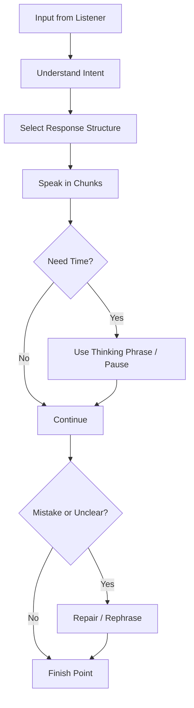
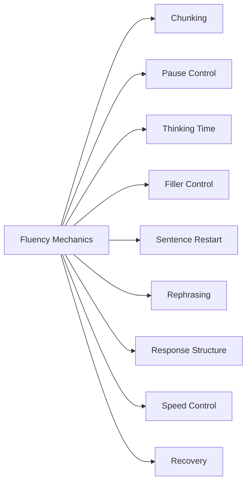

# English for Conversation Part 25 — Fluency Mechanics: Speed, Pauses, Fillers, and Thinking Time

> Goal part ini: kamu bisa terdengar lebih fluent bukan karena bicara cepat, tetapi karena bisa mengatur **chunking, pause, filler, thinking time, repair, dan response structure** saat berbicara dalam English.

Banyak learner salah memahami fluency. Mereka mengira fluency berarti:

```text
speak fast, never pause, never make mistakes
```

Padahal dalam conversation nyata, native dan non-native speaker sama-sama:

- pause,
- think,
- rephrase,
- use fillers,
- correct themselves,
- ask for clarification,
- and restart sentences.

Fluency yang berguna untuk software engineer bukan “kecepatan tanpa henti”, tetapi kemampuan menjaga alur percakapan sambil tetap jelas.

---

## 1. Target Performance

Setelah part ini, kamu harus mampu berbicara seperti ini:

```text
That’s a good question.
Let me think for a second.

I think there are two parts to this.
First, the current design is simple and easy to operate.
Second, it may become difficult to scale if traffic increases.

So my recommendation is to keep it simple for the first release,
but add metrics so we know when to revisit the design.
```

Perhatikan hal penting:

- ada pause,
- ada thinking phrase,
- ada struktur,
- ada chunk,
- tidak terlalu cepat,
- tetapi tetap fluent.

Fluency bukan tidak pernah berhenti. Fluency adalah tahu **bagaimana berhenti tanpa kehilangan kendali**.

---

## 2. Mental Model: Fluency Is Flow Control

Conversation bisa dipahami sebagai flow-control problem.



Fluent speaker tidak memproses seluruh jawaban sekaligus. Mereka:

1. memilih struktur,
2. bicara dalam chunk,
3. menggunakan pause,
4. memperbaiki kalimat bila perlu,
5. dan menyelesaikan point dengan jelas.

---

## 3. Sub-Skill Decomposition

Following Kaufman-style skill deconstruction, fluency mechanics can be split into small trainable parts.



High-leverage sub-skills:

1. chunking,
2. thinking phrases,
3. controlled pause,
4. sentence restart,
5. response structure.

---

## 4. Fluency Is Not Speed

Speaking too fast often makes you less clear.

### 4.1 Bad Fast Speech

```text
Ithinkweshoulddothisbecausemaybeifwedonotthenitcanbreakandalsothereissomerisk...
```

Problem:

- listener cannot follow,
- you cannot self-correct,
- grammar collapses,
- pronunciation becomes unclear,
- you sound nervous.

### 4.2 Better Controlled Speech

```text
I think we should delay the release.

The main reason is rollback safety.
If the migration fails halfway,
we may leave the data in an inconsistent state.
```

This is slower, but stronger.

### 4.3 Practical Rule

```text
Slow enough to be clear.
Fast enough to keep the conversation moving.
```

For engineering conversation, clarity beats speed.

---

## 5. Speaking in Chunks

Chunking means speaking in small meaningful units, not word by word.

### 5.1 Word-by-Word Speaking

```text
I / think / the / problem / is / because / the / data / is / not / same.
```

Sounds hesitant and unnatural.

### 5.2 Chunk-Based Speaking

```text
I think the problem is /
that the data does not match /
the expected format.
```

This is easier to produce and easier to understand.

### 5.3 Common Conversation Chunks

```text
I think...
The main issue is...
One option is...
The trade-off is...
My concern is...
The next step is...
Let me clarify...
What I mean is...
```

Fluency comes from reusable chunks.

---

## 6. Chunk Library for Software Engineers

### 6.1 Explaining

```text
At a high level...
The main idea is...
The way it works is...
The important part is...
```

### 6.2 Debugging

```text
What I see is...
My current hypothesis is...
Let’s verify that by...
That makes it less likely that...
```

### 6.3 Decision

```text
I see two options.
The trade-off is...
Given the constraints...
I recommend...
```

### 6.4 Disagreement

```text
I see the point, but...
My concern is...
I’m not fully convinced that...
A safer alternative would be...
```

### 6.5 Meeting Control

```text
Can I jump in for a second?
Before we go further...
Let me summarize where we are.
The next step is...
```

Practice these as whole units, not separate words.

---

## 7. Pause Control

A pause is not failure. A pause can make you sound thoughtful.

### 7.1 Good Pauses

Use pause:

- after a question,
- before giving a recommendation,
- between points,
- before disagreeing,
- after saying something important.

Example:

```text
That’s a good question.

I think the main risk is rollback.
```

### 7.2 Bad Pauses

Problematic pauses happen when:

- you freeze silently for too long,
- you restart repeatedly,
- you use too many fillers,
- you lose sentence direction.

Example:

```text
I think... uh... maybe... the... the... because... maybe...
```

### 7.3 Controlled Pause Phrases

```text
Let me think for a second.
Give me a moment to structure my answer.
That’s a good question.
Let me break it down.
I want to be precise here.
```

These phrases turn silence into controlled thinking time.

---

## 8. Thinking Time Phrases

Thinking time is essential in technical conversation.

### 8.1 General Thinking Phrases

```text
Let me think for a second.
That’s a good question.
I need a moment to think through the trade-off.
Let me structure my answer.
I want to be careful with this answer.
```

### 8.2 Technical Thinking Phrases

```text
Let me trace the flow mentally.
Let me think through the failure scenario.
Let me check the assumption.
Let me separate the short-term and long-term concerns.
```

### 8.3 When You Need More Context

```text
Before I answer, can I clarify one thing?
Do you mean from a technical perspective or a rollout perspective?
Are we talking about the first release or the long-term design?
```

This prevents answering the wrong question quickly.

---

## 9. Fillers: Useful but Dangerous

Fillers are words or phrases used while thinking.

Common fillers:

```text
um
uh
like
you know
I mean
so
well
right
actually
basically
```

Fillers are normal. The problem is overuse.

### 9.1 Bad Filler Pattern

```text
So, basically, I mean, like, the thing is, you know, maybe the service is, like, not really...
```

Problem:

- vague,
- noisy,
- low confidence,
- hard to follow.

### 9.2 Useful Fillers

Some fillers are useful if controlled:

```text
Well,...
So,...
Actually,...
I mean,...
Right,...
```

Examples:

```text
Well, I think the main issue is rollback.
So, the next step is to test the migration in staging.
Actually, let me correct that. The issue is not the API; it is the migration.
```

### 9.3 Replace Weak Fillers with Thinking Phrases

| Weak Filler | Better |
|---|---|
| “uh...” | “Let me think for a second.” |
| “like...” | pause |
| “you know...” | pause |
| “basically...” | “At a high level...” |
| “maybe...” | “One possibility is...” |

---

## 10. Sentence Restart

Native and fluent speakers restart sentences all the time. The key is to restart cleanly.

### 10.1 Restart Phrases

```text
Let me rephrase that.
Actually, what I mean is...
Let me say that more clearly.
A better way to put it is...
```

### 10.2 Example

Weak:

```text
The migration is... the data... if fail... maybe not good.
```

Better:

```text
Let me rephrase that.
If the migration fails halfway, the data may be left in an inconsistent state.
```

### 10.3 Self-Correction Is Not Embarrassing

Self-correction shows control.

```text
Actually, let me be more precise.
The service itself is not failing.
The failure happens during the migration step.
```

This sounds professional.

---

## 11. Rephrasing When Stuck

When you do not know a word, explain around it.

### 11.1 Circumlocution Pattern

```text
I don’t know the exact word, but I mean...
It’s the part where...
It’s similar to...
What I’m trying to say is...
```

Example:

```text
I don’t know the exact word, but I mean the part where the system tries again after a failure.
```

Then you may learn:

```text
retry mechanism
```

### 11.2 Technical Rephrasing

```text
It’s not exactly a cache issue.
What I mean is that the value is still old when the user expects the new value.
So it may be a stale data issue.
```

This keeps conversation alive even with vocabulary gaps.

---

## 12. Response Structure Reduces Freezing

Many people freeze because they try to invent the whole answer live. Use structure.

### 12.1 “Two Parts” Structure

```text
I think there are two parts to this.
First...
Second...
```

Example:

```text
I think there are two parts to this.
First, the implementation is straightforward.
Second, the rollout risk is still high.
```

### 12.2 “Short Answer + Reason” Structure

```text
Short answer: <answer>.
The reason is <reason>.
```

Since this course avoids overusing labels in normal writing, in speech you can use:

```text
The short answer is yes.
The reason is that the migration is backward compatible.
```

### 12.3 “Problem → Cause → Next Step”

```text
The problem is...
The likely cause is...
The next step is...
```

### 12.4 “Option A / Option B”

```text
I see two options.
Option A is...
Option B is...
I recommend...
```

Structures reduce cognitive load.

---

## 13. Handling Fast Speakers

Fluency also includes managing input speed.

### 13.1 Slow Down Requests

```text
Could you slow down a bit?
Could you repeat the last part?
Can we go one point at a time?
```

### 13.2 Technical Clarification

```text
Can we pause on that failure scenario?
I want to make sure I understood the sequence.
```

### 13.3 Confirming

```text
So the request reaches the service, but fails before the database write. Is that right?
```

This gives you time and verifies understanding.

---

## 14. Reducing Translation Latency

Translation latency happens when you think in Indonesian sentence structure, translate word by word, then speak.

### 14.1 Replace Translation with Frames

Instead of translating:

```text
Menurut saya masalahnya ada di...
```

Use direct English frame:

```text
I think the issue is...
```

Instead of translating:

```text
Kalau ini gagal, maka...
```

Use:

```text
If this fails, then...
```

Instead of translating:

```text
Yang saya khawatirkan adalah...
```

Use:

```text
My concern is...
```

### 14.2 Build Automatic Frames

Memorize high-frequency frames:

```text
I think...
I’m not sure...
My concern is...
The issue is...
The reason is...
The trade-off is...
The next step is...
```

Automatic frames reduce processing time.

---

## 15. Fluency Under Pressure

You may lose fluency when:

- senior people are present,
- meeting is high stakes,
- you are challenged,
- you need to disagree,
- topic is complex,
- time is limited.

### 15.1 Pressure Control Phrase

```text
Let me structure my answer.
```

This phrase gives you control.

### 15.2 High-Stakes Response Pattern

```text
I want to be precise here.
The confirmed fact is...
The assumption is...
The risk is...
My recommendation is...
```

Example:

```text
I want to be precise here.
The confirmed fact is that the migration failed in staging.
The assumption is that production has the same schema state.
The risk is that rollback may not be safe.
My recommendation is to delay until we validate rollback.
```

This is extremely useful in incidents and release meetings.

---

## 16. Fluency Recovery After Mistake

If you make a mistake, do not panic. Repair.

### 16.1 Grammar Mistake Repair

```text
Sorry, let me correct that.
It failed yesterday, not it fails yesterday.
```

But do not over-correct every small mistake. Only repair when meaning is unclear or professionalism matters.

### 16.2 Meaning Repair

```text
Let me correct that.
I don’t mean the API is failing.
I mean the migration step is failing.
```

### 16.3 Wrong Word Repair

```text
I used the wrong word.
I mean rollback, not retry.
```

### 16.4 Restart

```text
Let me start again.
The issue is...
```

Restart is always available.

---

## 17. Managing Long Answers

Long answers are dangerous because you may lose structure.

### 17.1 Signposting

```text
There are three points.
First...
Second...
Third...
```

### 17.2 Checkpoint

```text
Does that make sense so far?
Should I go deeper into the technical details?
```

### 17.3 Stop Yourself

```text
I’ll stop there.
I can go deeper if useful.
```

This prevents rambling.

---

## 18. Fluency Phrasebank

### 18.1 Thinking Time

```text
Let me think for a second.
That’s a good question.
Let me structure my answer.
I want to be precise here.
```

### 18.2 Rephrasing

```text
Let me rephrase that.
What I mean is...
A better way to put it is...
Actually, let me be more precise.
```

### 18.3 Structuring

```text
There are two parts to this.
At a high level...
The main point is...
The key trade-off is...
```

### 18.4 Recovering

```text
Let me start again.
I used the wrong word.
That came out unclear.
Let me clarify.
```

### 18.5 Closing

```text
So the main point is...
That’s why I recommend...
I’ll stop there.
```

---

## 19. Dialogue Example: Controlled Thinking

```text
Interviewer: Why did you choose explicit workflow rules instead of full configuration?

Candidate: That’s a good question.
Let me structure my answer.

There were two main reasons.
First, the workflow was compliance-sensitive, so every transition needed to be reviewable.
Second, full configuration would have allowed more flexibility, but it also increased the risk of invalid transitions.

So the trade-off was flexibility versus control.
We chose explicit rules because auditability mattered more in that system.
```

Notice:

- thinking phrase,
- structure,
- controlled pace,
- clear final answer.

---

## 20. Dialogue Example: Rephrasing During Meeting

```text
You: The migration is not good because the data maybe...

You: Actually, let me rephrase that.
The issue is that if the migration fails halfway, some records may be updated while others remain in the old state.
That makes rollback difficult.
```

You recovered. The conversation continues.

---

## 21. Dialogue Example: Handling Fast Speech

```text
A: So the gateway retries and then the provider returns success but the worker times out and then the event gets replayed.

B: Can we go one point at a time?
I want to make sure I understood the sequence.

First, the gateway retries.
Then the provider returns success.
Then the worker times out.
And after that, the event gets replayed.
Is that correct?
```

This is fluency through control, not speed.

---

## 22. Common Mistakes

### 22.1 Trying to Speak Too Fast

Weak:

```text
Fast, unclear, many errors.
```

Better:

```text
Controlled, chunked, clear.
```

### 22.2 Avoiding Pauses

Weak:

```text
Filling every silence with “uh, like, you know”.
```

Better:

```text
Let me think for a second.
```

### 22.3 No Structure

Weak:

```text
Long answer with no signposting.
```

Better:

```text
There are two parts to this.
```

### 22.4 Panic After Mistake

Weak:

```text
Stop speaking completely.
```

Better:

```text
Let me rephrase that.
```

### 22.5 Translating Word by Word

Weak:

```text
The data not same.
```

Better:

```text
The data does not match the expected format.
```

---

## 23. Drill 1 — Controlled Pause

Practice saying each line with a pause after the first chunk.

```text
I think / the main issue is rollback.
My concern is / the migration path.
The trade-off is / speed versus safety.
The next step is / to validate this in staging.
```

Repeat 10 times.

---

## 24. Drill 2 — Thinking Time

Answer each prompt with a thinking phrase first.

Prompts:

1. Why did you choose this design?
2. What is the main risk?
3. Should we release today?
4. What happens if the migration fails?
5. How would you explain this to product?
6. What is the trade-off?
7. Do we need a new service?
8. Should this block the merge?

Required phrases:

```text
That’s a good question.
Let me think for a second.
Let me structure my answer.
I want to be precise here.
```

---

## 25. Drill 3 — Rephrase

Start badly, then repair.

Example:

```text
Bad start:
The service, if fail, maybe data...

Repair:
Let me rephrase that.
If the service fails after writing to the database, the system may produce duplicate events.
```

Practice with:

1. rollback risk,
2. duplicate payment,
3. stale cache,
4. missing authorization,
5. slow query,
6. migration compatibility,
7. feature flag rollout,
8. incident impact.

---

## 26. Drill 4 — Structure Under Pressure

Use:

```text
There are two parts to this.
First...
Second...
So...
```

Prompts:

1. Is the design too complex?
2. Should we use async processing?
3. Is this PR safe to merge?
4. Why did the incident happen?
5. What should we do next?

---

## 27. Drill 5 — Filler Reduction

Record a 2-minute answer to:

```text
Should we release this feature today?
```

Then count:

- um,
- uh,
- like,
- you know,
- basically,
- maybe.

Rewrite the answer using:

```text
Let me think for a second.
There are two parts to this.
My concern is...
My recommendation is...
```

Record again.

---

## 28. Self-Correction Checklist

After speaking practice, score yourself:

| Area | Question | Score |
|---|---|---|
| Speed | Did I speak at a controllable pace? | 1–5 |
| Chunking | Did I speak in meaningful chunks? | 1–5 |
| Pauses | Did I use pauses instead of panic fillers? | 1–5 |
| Thinking time | Did I use thinking phrases when needed? | 1–5 |
| Structure | Did my answer have clear organization? | 1–5 |
| Repair | Did I recover from mistakes? | 1–5 |
| Clarity | Was my message easy to follow? | 1–5 |
| Completion | Did I finish my point cleanly? | 1–5 |

---

## 29. 60-Minute Practice Plan

```mermaid
flowchart TD
    A[0-10 min: Review Fluency Phrasebank] --> B[10-20 min: Chunking Drill]
    B --> C[20-30 min: Thinking Time Drill]
    C --> D[30-40 min: Rephrase Drill]
    D --> E[40-50 min: Structured Answer Drill]
    E --> F[50-60 min: Record, Count Fillers, Repeat]
```



### Practice Method

1. Pick one technical prompt.
2. Answer once naturally.
3. Count filler words.
4. Rewrite with structure.
5. Answer again with controlled pace.
6. Compare clarity, not speed.

---

## 30. High-Value Patterns to Memorize

```text
Let me think for a second.
That’s a good question.
Let me structure my answer.
I want to be precise here.
There are two parts to this.
At a high level...
The main point is...
Let me rephrase that.
What I mean is...
Actually, let me be more precise.
I’ll stop there.
I can go deeper if useful.
```

These patterns let you stay fluent even when your brain needs time.

---

## 31. Final Assignment

Record a 7-minute fluency simulation.

Scenario:

```text
You are in a design review.
Someone asks whether the team should move a synchronous workflow to async processing.
You need to answer with controlled pauses, thinking phrases, structure, trade-off, recommendation, and clean closing.
```

Your answer must include:

1. thinking phrase,
2. at least one controlled pause,
3. “two parts” structure,
4. trade-off explanation,
5. one rephrase,
6. final recommendation,
7. clean closing.

Required phrases:

```text
That’s a good question.
Let me structure my answer.
There are two parts to this.
The trade-off is...
Let me rephrase that.
My recommendation is...
I can go deeper if useful.
```

---

## Part 25 Summary

Fluency is not speed. Fluency is flow control.

The core pattern is:

```text
Think → Structure → Speak in Chunks → Pause → Repair → Finish
```

The most valuable tools are:

```text
thinking phrases,
controlled pauses,
chunk-based speaking,
sentence restart,
rephrasing,
and simple response structures.
```

If you can pause without panic, rephrase without shame, and structure your answer while speaking, your conversation ability will feel much more flexible and professional.

---
