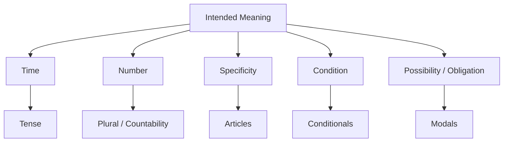
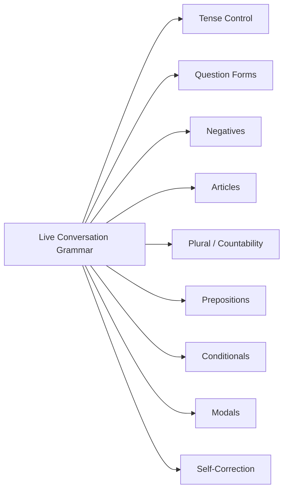
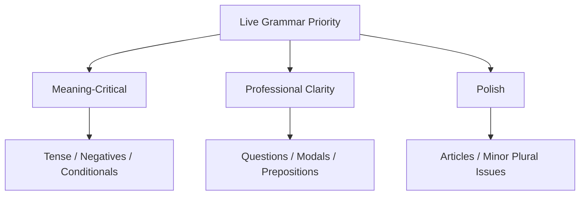
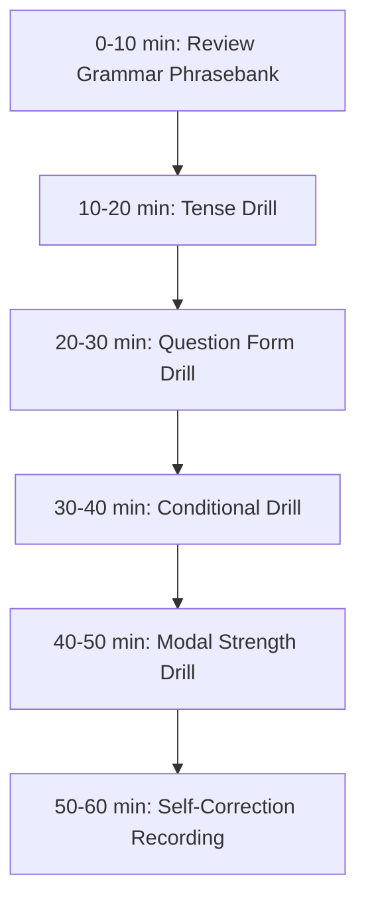

# English for Conversation Part 26 — Accuracy Without Freezing: Grammar for Live Conversation

> Goal part ini: kamu bisa memakai grammar yang cukup akurat untuk conversation nyata tanpa freeze, overthinking, atau menunda speaking sampai “perfect”.

Grammar penting. Tetapi untuk conversation, grammar bukan tujuan akhir. Grammar adalah alat untuk membuat meaning lebih jelas.

Masalah umum learner:

```text
I want to speak, but I keep thinking about grammar.
```

Akibatnya:

- respons terlambat,
- conversation terasa berat,
- speaking menjadi tidak natural,
- dan confidence turun.

Part ini membahas grammar sebagai **live control system**: grammar yang paling berdampak untuk spoken English, cara menggunakannya dalam real-time, dan cara self-correct tanpa menghentikan conversation.

---

## 1. Target Performance

Setelah part ini, kamu harus mampu berbicara seperti ini:

```text
The issue started after yesterday’s deployment.
It only happens when the user has more than one active session.

If we retry the operation without an idempotency key,
we may process the same event twice.

I think we should add a guard before merging this PR.
```

Kalimat di atas tidak rumit, tetapi grammar-nya cukup akurat untuk menyampaikan:

- waktu kejadian,
- kondisi,
- consequence,
- recommendation,
- dan technical risk.

Target part ini bukan perfect grammar. Targetnya adalah:

```text
accurate enough to be clear,
simple enough to produce live,
flexible enough to self-correct.
```

---

## 2. Mental Model: Grammar Is Meaning Control

Grammar bukan sekadar aturan. Grammar mengontrol meaning.



Contoh:

```text
The bug happens in staging.
```

Meaning: generally/repeatedly happens.

```text
The bug happened in staging.
```

Meaning: happened in the past.

```text
The bug has happened in staging before.
```

Meaning: has occurred before and relevant now.

Small grammar differences can change engineering meaning.

---

## 3. Sub-Skill Decomposition

Following Kaufman-style deconstruction, live grammar can be split into high-impact control areas.



High-leverage grammar for conversation:

1. tense control,
2. question forms,
3. negatives,
4. conditionals,
5. modals,
6. articles/plurals enough for clarity.

---

## 4. The Anti-Freeze Principle

When speaking live, do not try to build complex grammar first.

### 4.1 Use Simple Correct Sentences

Weak because overcomplicated:

```text
Due to the fact that the deployment which was performed yesterday had been causing...
```

Better:

```text
The issue started after yesterday’s deployment.
```

### 4.2 One Idea Per Sentence

Instead of:

```text
The service maybe if the request retry and the data already inserted then duplicate and the user...
```

Say:

```text
The service may retry the request.
The data may already be inserted.
That can create a duplicate record.
```

Simple sentences are not weak. They are clear.

### 4.3 Live Speaking Rule

```text
When under pressure, reduce grammar complexity before reducing meaning.
```

---

## 5. Tense Control for Work Conversation

Tense tells listeners when something happened or whether it is still relevant.

### 5.1 Simple Present — General Truth / Current Behavior

Use for current behavior, repeated behavior, system behavior.

```text
The service validates the token before calling the database.
This endpoint returns 404 when the user does not exist.
The job runs every hour.
```

### 5.2 Simple Past — Finished Past Event

Use for completed past events.

```text
The deployment failed yesterday.
We changed the config last week.
The test passed locally.
```

### 5.3 Present Perfect — Past Event Relevant Now

Use when the exact time is less important than current relevance.

```text
We have seen this issue before.
The team has already tested the rollback path.
I have updated the PR description.
```

### 5.4 Future — Plan / Prediction

```text
I will update the test after this meeting.
We are going to deploy this tomorrow.
This may become a problem if traffic increases.
```

---

## 6. Tense Decision Table

| Meaning | Use | Example |
|---|---|---|
| system behavior | simple present | “The worker processes events asynchronously.” |
| completed event | simple past | “The worker failed after deployment.” |
| past relevant now | present perfect | “We have reproduced the issue in staging.” |
| ongoing now | present continuous | “The job is still running.” |
| plan | going to / will | “We are going to roll it out tomorrow.” |
| possibility | may/might/could | “This may create duplicate events.” |

### 6.1 Common Engineering Examples

```text
The issue happens only in staging.
The issue happened after the migration.
The issue has happened twice this week.
The issue is happening right now.
The issue may happen again if we retry without idempotency.
```

These five sentences express different meanings.

---

## 7. Common Tense Mistakes

### 7.1 Indonesian-Influenced Mistake

Weak:

```text
Yesterday the deployment fail.
```

Better:

```text
Yesterday the deployment failed.
```

Weak:

```text
The bug happen in staging only.
```

Better:

```text
The bug only happens in staging.
```

Weak:

```text
I already update the PR.
```

Better:

```text
I have already updated the PR.
```

or simpler:

```text
I already updated the PR.
```

Both can work in conversation, but present perfect is more standard when current relevance matters.

### 7.2 Self-Correction

```text
The deployment fail—sorry, failed yesterday.
```

or:

```text
Let me correct that. The deployment failed yesterday.
```

---

## 8. Question Forms

Questions drive conversation. You need automatic patterns.

### 8.1 Basic Question Patterns

```text
Do we need...?
Does this happen...?
Did we test...?
Have we checked...?
Can we...?
Should we...?
What happens if...?
Why did we...?
How do we...?
```

### 8.2 Examples

```text
Do we need a feature flag?
Does this happen in production?
Did we test the rollback path?
Have we checked the logs?
Can we reproduce this locally?
Should we block the release?
What happens if the provider times out?
Why did we choose this design?
How do we recover from partial failure?
```

### 8.3 Common Mistakes

Weak:

```text
This happen in production?
```

Better:

```text
Does this happen in production?
```

Weak:

```text
We already test rollback?
```

Better:

```text
Have we tested rollback?
```

Weak:

```text
Why we need this?
```

Better:

```text
Why do we need this?
```

In live conversation, if you make the mistake, most people still understand. But practice automatic question frames.

---

## 9. Negatives

Negatives are high-impact because they change meaning sharply.

### 9.1 Basic Negative Patterns

```text
It does not happen locally.
We did not test rollback yet.
I do not think this is safe.
This is not a blocker.
The operation is not idempotent.
```

### 9.2 Common Mistakes

Weak:

```text
It not happen locally.
```

Better:

```text
It does not happen locally.
```

Weak:

```text
We not yet test.
```

Better:

```text
We have not tested it yet.
```

or simpler:

```text
We did not test it yet.
```

### 9.3 Useful Engineering Negatives

```text
This does not handle null.
This does not check authorization.
This is not backward compatible.
This is not safe to retry.
This is not a production issue yet.
```

Memorize these chunks.

---

## 10. Articles: A, An, The

Articles are difficult for Indonesian speakers because Indonesian does not have the same system. For conversation, focus on meaning.

### 10.1 Simple Article Model

| Article | Meaning | Example |
|---|---|---|
| a/an | one of many, not specific yet | “We need a rollback plan.” |
| the | specific, known, already mentioned | “The rollback plan is not tested.” |
| no article | general/plural/uncountable | “Rollback is important.” |

### 10.2 Engineering Examples

```text
We need a test for this edge case.
The test should cover inactive users.
Testing is important for this path.
```

```text
We found a bug in the permission check.
The bug allows inactive users to access the feature.
Bug reports should include reproduction steps.
```

### 10.3 Practical Rule

Use **a/an** when introducing one item:

```text
We need a feature flag.
```

Use **the** when both sides know which item:

```text
The feature flag should be disabled by default.
```

Use no article for general concepts:

```text
Feature flags reduce rollout risk.
```

---

## 11. Plurals and Countability

Plural mistakes usually do not block understanding, but they affect professionalism.

### 11.1 Countable Nouns

```text
one request
two requests

one user
many users

one service
multiple services
```

### 11.2 Uncountable Nouns

Common uncountable nouns:

```text
information
feedback
data
traffic
behavior
progress
work
```

Usually not:

```text
informations
feedbacks
traffics
progresses
```

Better:

```text
some information
a piece of feedback
a lot of traffic
good progress
```

### 11.3 Engineering Examples

```text
We received a lot of feedback.
We need more information before deciding.
Traffic increased after the release.
The behavior is different in staging.
```

### 11.4 “Data”

In everyday engineering English, “data” is often treated as uncountable/mass in speech:

```text
The data is inconsistent.
```

In formal contexts, some use:

```text
The data are inconsistent.
```

For conversation, the first is common and acceptable in many teams.

---

## 12. Prepositions in Technical Context

Prepositions are hard because they are often idiomatic. Focus on common patterns.

### 12.1 Common Technical Prepositions

```text
in production
in staging
on the server
on the client
at runtime
during deployment
after migration
before release
through the API
from the database
to the queue
with a feature flag
without rollback
between services
```

### 12.2 Examples

```text
The issue happens in production.
The job runs on the server.
The error occurs at runtime.
The failure happened during deployment.
The request goes through the gateway.
The data comes from the external provider.
The event is sent to the queue.
We should release with a feature flag.
We should not deploy without rollback.
There is a mismatch between the schema and the payload.
```

### 12.3 Common Mistakes

Weak:

```text
The issue happen on production.
```

Better:

```text
The issue happens in production.
```

Weak:

```text
The data comes from API.
```

Better:

```text
The data comes from the API.
```

Weak:

```text
We deploy in Friday.
```

Better:

```text
We deploy on Friday.
```

or:

```text
We deploy this Friday.
```

---

## 13. Conditionals for Engineering

Conditionals are essential for discussing failure modes, edge cases, and designs.

### 13.1 First Conditional — Real Future Possibility

```text
If <condition>, <result>.
```

Examples:

```text
If the provider times out, the request will fail.
If we retry without idempotency, we may create duplicate events.
If the migration fails, we need a rollback plan.
```

### 13.2 Zero Conditional — General Rule

```text
If <condition>, <general result>.
```

Examples:

```text
If the token is invalid, the API returns 401.
If the list is empty, the function returns an empty response.
```

### 13.3 Hypothetical Conditional

```text
If we moved this to async processing, we would improve resilience but introduce eventual consistency.
```

Use for design options.

### 13.4 Common Engineering Conditional Frames

```text
If this fails, then...
If the assumption is wrong, then...
If traffic increases, this may...
If we deploy this today, we need...
If we delay, the trade-off is...
```

These are high-value frames.

---

## 14. Modals: Can, Could, Should, May, Might, Must

Modals express ability, possibility, recommendation, and obligation.

### 14.1 Modal Meanings

| Modal | Meaning | Example |
|---|---|---|
| can | ability/possibility | “This can fail if the payload is missing.” |
| could | softer possibility/suggestion | “This could be a config issue.” |
| should | recommendation/expectation | “We should add a test.” |
| may | possibility | “This may affect old clients.” |
| might | uncertain possibility | “This might be related to the migration.” |
| must | strong requirement | “The request must include a tenant id.” |
| have to | requirement | “We have to test rollback before release.” |

### 14.2 Recommendation Strength

| Strength | Phrase |
|---|---|
| soft | “We could add a test.” |
| normal | “We should add a test.” |
| strong | “We have to add a test.” |
| requirement | “We must add a test before release.” |

Choose strength based on risk.

### 14.3 Examples

```text
This could create duplicate events.
We should verify the rollback path.
We have to fix the authorization check before merging.
The request must include a valid tenant id.
```

---

## 15. Passive Voice in Engineering

Passive voice is useful when the actor is unknown or less important.

### 15.1 Active

```text
The worker processed the event twice.
```

### 15.2 Passive

```text
The event was processed twice.
```

Use passive when focusing on the event, not the worker.

### 15.3 Common Passive Patterns

```text
The request was rejected.
The event was retried.
The record was updated.
The migration was rolled back.
The issue was reported yesterday.
```

### 15.4 Avoid Overusing Passive

Weak:

```text
It was decided that it will be done.
```

Better:

```text
We decided to delay the release.
```

Use passive for system behavior, not to hide responsibility.

---

## 16. Relative Clauses for Precision

Relative clauses help specify things.

### 16.1 Basic Patterns

```text
the service that handles payment
the user who owns the account
the request that failed
the migration that changed the schema
```

### 16.2 Examples

```text
The service that handles payment is timing out.
The request that failed came from the mobile app.
The migration that changed the order table is not backward compatible.
```

### 16.3 Simpler Alternative

If relative clauses feel hard, use two sentences.

Instead of:

```text
The migration that changed the order table is not backward compatible.
```

Say:

```text
The migration changed the order table.
It is not backward compatible.
```

Simple is acceptable.

---

## 17. Grammar for Giving Updates

### 17.1 Yesterday / Today / Blocker

```text
Yesterday, I worked on...
Today, I’m going to...
The blocker is...
```

Examples:

```text
Yesterday, I worked on the retry logic.
Today, I’m going to add the idempotency test.
The blocker is that I need confirmation from the payment provider.
```

### 17.2 Progress

```text
I have finished...
I’m still working on...
I’m waiting for...
I need help with...
```

Examples:

```text
I have finished the migration script.
I’m still working on the rollback test.
I’m waiting for review from the service owner.
I need help with reproducing the staging issue.
```

---

## 18. Grammar for Technical Risk

### 18.1 Risk Pattern

```text
If <condition>, <risk may happen>.
```

Examples:

```text
If we retry this operation, duplicate events may be created.
If the old client still uses this field, removing it may break compatibility.
If the migration fails halfway, data may become inconsistent.
```

### 18.2 Stronger Risk

```text
This can...
This may...
This could...
This will...
```

Examples:

```text
This can expose data across tenants.
This may affect old clients.
This could cause duplicate processing.
This will break compatibility with version 1 clients.
```

Use “will” only when you are confident.

---

## 19. Grammar for Recommendation

### 19.1 Recommendation Patterns

```text
I think we should...
I recommend...
I would suggest...
I don’t think we should...
```

Examples:

```text
I think we should delay the release.
I recommend adding an idempotency key.
I would suggest a limited rollout.
I don’t think we should merge this without a test.
```

### 19.2 Reason Pattern

```text
because...
since...
given that...
```

Examples:

```text
I think we should delay the release because rollback is not tested.
I recommend a limited rollout since the permission path is new.
Given that old clients may still use this field, we should keep it for now.
```

---

## 20. Self-Correction While Speaking

Self-correction is better than freezing.

### 20.1 Correct Tense

```text
The deployment fail—sorry, failed yesterday.
```

### 20.2 Correct Meaning

```text
Actually, let me correct that.
The API is not failing. The migration is failing.
```

### 20.3 Correct Specificity

```text
A service—sorry, the payment service—is timing out.
```

### 20.4 Correct Word Choice

```text
I mean rollback, not retry.
```

### 20.5 Do Not Overcorrect

Do not stop for every tiny article mistake.

If you say:

```text
We need rollback plan.
```

Meaning is still clear. You can continue. In important contexts, correct:

```text
We need a rollback plan.
```

---

## 21. Accuracy Priority Order

When speaking live, prioritize grammar by impact.



### 21.1 Highest Priority

Fix these when wrong:

- wrong tense that changes timeline,
- missing negative,
- wrong condition,
- wrong modal strength.

Example:

```text
We tested rollback.
```

vs

```text
We have not tested rollback.
```

Huge difference.

### 21.2 Medium Priority

- question forms,
- prepositions,
- modals.

### 21.3 Lower Priority During Live Conversation

- minor articles,
- minor plural mistakes,
- small word order issues if meaning is clear.

Do not freeze over low-impact grammar.

---

## 22. Common Indonesian Speaker Patterns

### 22.1 Missing “to be”

Weak:

```text
The service down.
```

Better:

```text
The service is down.
```

### 22.2 Missing Verb -s

Weak:

```text
The bug happen in staging.
```

Better:

```text
The bug happens in staging.
```

### 22.3 Past Tense

Weak:

```text
Yesterday we deploy.
```

Better:

```text
Yesterday we deployed.
```

### 22.4 Articles

Weak:

```text
We need rollback plan.
```

Better:

```text
We need a rollback plan.
```

### 22.5 Plural

Weak:

```text
Many user affected.
```

Better:

```text
Many users are affected.
```

### 22.6 Preposition

Weak:

```text
The issue is on production.
```

Better:

```text
The issue is in production.
```

---

## 23. Live Grammar Phrasebank

### 23.1 Time

```text
This happens when...
This happened after...
This has happened before.
This is happening now.
```

### 23.2 Negative

```text
This does not handle...
We have not tested...
This is not safe to...
```

### 23.3 Condition

```text
If this fails, then...
If the assumption is wrong, then...
If we deploy today, we need...
```

### 23.4 Possibility

```text
This may...
This might...
This could...
```

### 23.5 Recommendation

```text
We should...
We should not...
I recommend...
I don’t recommend...
```

### 23.6 Clarification

```text
Do you mean...?
Have we checked...?
Did we test...?
Does this happen...?
```

---

## 24. Dialogue Example: Grammar Under Control

```text
A: Is this safe to release today?

B: I don’t think so.
We have not tested the rollback path yet.

If the migration fails halfway, some records may be updated while others remain in the old state.
That could make recovery difficult.

I recommend delaying the release until rollback is validated in staging.
```

Grammar used:

- negative: “I don’t think so”
- present perfect: “We have not tested”
- conditional: “If the migration fails”
- modal: “may”, “could”
- recommendation: “I recommend”

This is enough.

---

## 25. Dialogue Example: Self-Correction

```text
A: What happened?

B: The deployment fail—sorry, failed during the migration step.
The app itself starts correctly, but the migration does not complete.

A: Do we know why?

B: Not yet.
My current hypothesis is that the staging schema is different from local.
```

A small correction keeps the conversation moving.

---

## 26. Dialogue Example: Simpler Grammar, Clear Meaning

```text
A: Can you explain the issue?

B: Yes.
The issue happens only in staging.
The request reaches the service.
The service calls the database.
The database returns an empty result.
Then the service throws an error because it expects a user id.

So the problem is probably in the mapping or data setup.
```

No complex grammar needed. Clear sequence wins.

---

## 27. Common Mistakes

### 27.1 Waiting for Perfect Grammar

Weak:

```text
Long silence because you are building perfect sentence.
```

Better:

```text
Use simple sentence.
Then add details.
```

### 27.2 Overusing Complex Sentences

Weak:

```text
A long sentence with many clauses and unclear logic.
```

Better:

```text
Break it into three simple sentences.
```

### 27.3 Ignoring Meaning-Critical Grammar

Weak:

```text
We tested rollback.
```

when you mean:

```text
We have not tested rollback.
```

Meaning-critical grammar must be corrected.

### 27.4 Correcting Every Tiny Mistake

Weak:

```text
Stop after every article error.
```

Better:

```text
Continue if meaning is clear.
Correct only if meaning or professionalism requires it.
```

---

## 28. Drill 1 — Tense Control

Choose the correct version.

1. The issue happen / happens in staging.
2. The deployment fail / failed yesterday.
3. We have tested / test rollback already.
4. The job is running / runs right now.
5. The service returns / returned 500 after the latest deployment.

Then create your own 10 sentences about real work.

---

## 29. Drill 2 — Question Forms

Convert statements into questions.

1. This happens in production.
2. We tested rollback.
3. The provider supports idempotency.
4. The old client uses this field.
5. The migration is backward compatible.
6. The feature is behind a flag.
7. The issue started yesterday.
8. The request reaches the service.

Example:

```text
Statement:
This happens in production.

Question:
Does this happen in production?
```

---

## 30. Drill 3 — Conditionals

Complete:

```text
If the provider times out, ...
If we retry without idempotency, ...
If the migration fails, ...
If old clients still use this field, ...
If we release behind a feature flag, ...
If traffic increases, ...
```

Example:

```text
If we retry without idempotency, we may process the same event twice.
```

---

## 31. Drill 4 — Modals and Recommendation Strength

Rewrite from soft to strong.

Prompt:

```text
add a rollback test
```

Soft:

```text
We could add a rollback test.
```

Normal:

```text
We should add a rollback test.
```

Strong:

```text
We have to add a rollback test before release.
```

Practice with:

1. add an authorization check,
2. validate tenant isolation,
3. add pagination,
4. test idempotency,
5. update the PR description,
6. delay release,
7. roll out behind a flag.

---

## 32. Drill 5 — Self-Correction

Speak each bad sentence, then correct it.

1. “Yesterday the deployment fail.”
2. “The bug happen in staging.”
3. “We not test rollback.”
4. “This not safe.”
5. “Many user affected.”
6. “We need rollback plan.”
7. “This can creates duplicate.”
8. “Why we need this?”
9. “The issue is on production.”
10. “I already update the PR.”

Correction example:

```text
Yesterday the deployment fail—sorry, failed.
```

---

## 33. Self-Correction Checklist

After live speaking, score yourself:

| Area | Question | Score |
|---|---|---|
| Tense | Did I express time clearly? | 1–5 |
| Negatives | Did I avoid meaning-critical negative mistakes? | 1–5 |
| Questions | Did I form key questions clearly? | 1–5 |
| Conditionals | Did I explain failure modes clearly? | 1–5 |
| Modals | Did I match strength to risk? | 1–5 |
| Articles/plurals | Were small mistakes manageable? | 1–5 |
| Self-correction | Did I repair important mistakes? | 1–5 |
| Anti-freeze | Did I keep speaking with simple sentences? | 1–5 |

---

## 34. 60-Minute Practice Plan



### Practice Method

1. Pick a technical scenario.
2. Explain it using only simple sentences.
3. Add:
   - one past event,
   - one current behavior,
   - one negative,
   - one conditional,
   - one recommendation.
4. Record yourself.
5. Correct only meaning-critical grammar.
6. Repeat with smoother delivery.

---

## 35. High-Value Patterns to Memorize

```text
The issue happens when...
The issue happened after...
We have not tested...
This does not handle...
Does this happen in production?
Have we checked the logs?
If this fails, then...
This may create...
We should add...
I don’t think we should...
Let me correct that.
Actually, let me be more precise.
```

These patterns cover a large percentage of live technical conversation.

---

## 36. Final Assignment

Record an 8-minute grammar-controlled technical explanation.

Scenario:

```text
A deployment failed in staging after a migration.
The app starts correctly, but the migration does not complete.
Rollback has not been tested.
The team must decide whether to release today.
```

Your answer must include:

1. simple present,
2. simple past,
3. present perfect negative,
4. at least two questions,
5. at least two conditionals,
6. at least three modals,
7. one self-correction,
8. final recommendation.

Required phrases:

```text
The issue happened after...
We have not tested...
Does this happen...?
If this fails, then...
This may...
We should...
Let me correct that.
```

---

## Part 26 Summary

Grammar for live conversation is not about perfection. It is about meaning control.

The core principle is:

```text
simple enough to produce,
accurate enough to understand,
flexible enough to correct.
```

Prioritize:

```text
tense,
negatives,
questions,
conditionals,
modals,
then articles/plurals/prepositions.
```

When under pressure, use simple sentences. Correct meaning-critical mistakes. Ignore small polish issues until after the conversation.

That is how you build accuracy without freezing.

---
