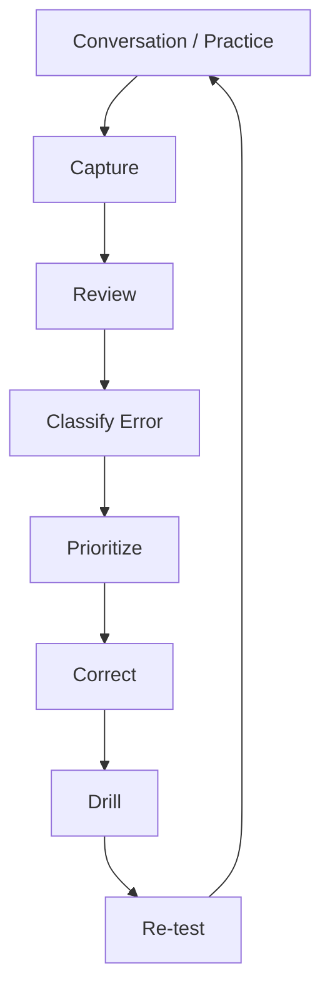
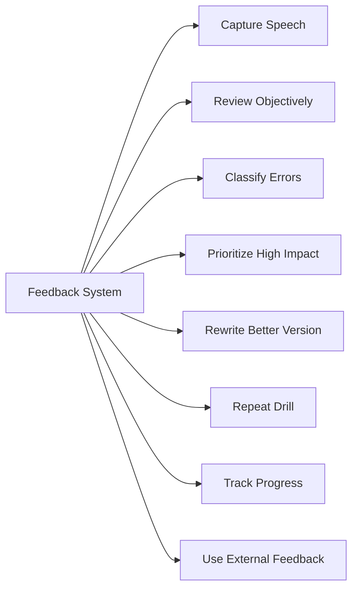
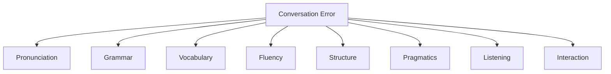
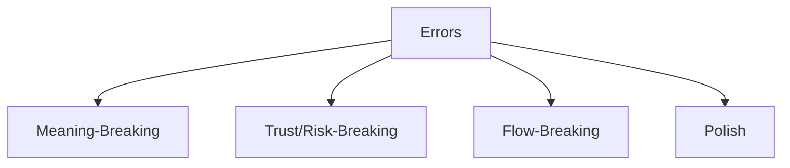
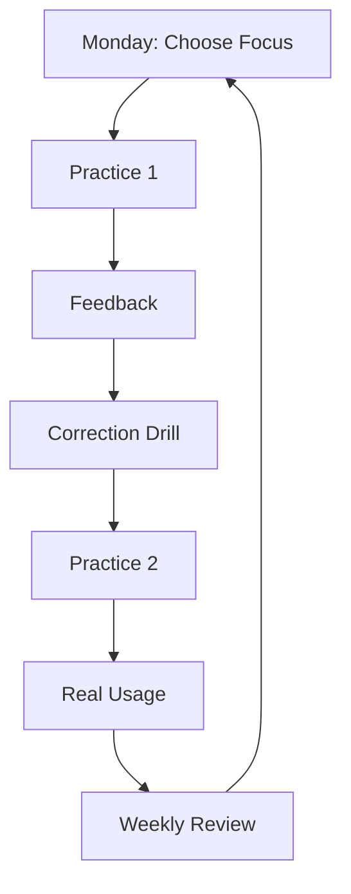
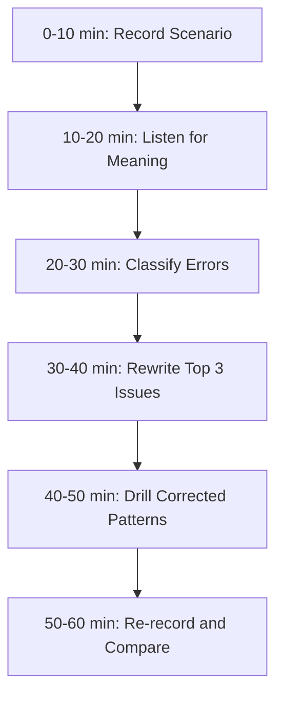

# English for Conversation Part 27 — Feedback Systems: How to Self-Correct and Improve Fast

> Goal part ini: kamu bisa membangun sistem feedback untuk memperbaiki English conversation secara cepat, terukur, dan tidak bergantung sepenuhnya pada guru/tutor.

Dalam kerangka Josh Kaufman, salah satu prinsip penting adalah belajar cukup untuk bisa **self-correct**. Untuk English conversation, ini krusial. Kalau kamu tidak punya feedback system, kamu bisa latihan berjam-jam tetapi mengulang kesalahan yang sama.

Practice without feedback creates repetition.  
Practice with feedback creates improvement.

Part ini membahas cara membuat English conversation improvement loop seperti engineering feedback loop: observe, classify, debug, patch, verify.

---

## 1. Target Performance

Setelah part ini, kamu harus mampu melakukan siklus seperti ini setelah speaking practice:

```text
I recorded a 5-minute explanation about a deployment failure.

My main issue was not vocabulary.
The bigger issue was structure and tense control.

I used too many fillers when explaining risk:
"maybe", "uh", and "like".

My correction target for the next session is:
use the frame "The confirmed fact is..., the assumption is..., the risk is..., my recommendation is..."
```

Ini adalah self-correction yang matang:

1. tidak vague,
2. berbasis evidence,
3. mengklasifikasi error,
4. memilih target kecil,
5. membuat next practice lebih spesifik.

---

## 2. Mental Model: English Improvement as Observability System

Kamu tidak bisa memperbaiki hal yang tidak kamu observe.



Ini mirip production system:

| Engineering Observability | English Learning Equivalent |
|---|---|
| logs | recording/transcript |
| metrics | fluency score, filler count, error count |
| traces | conversation flow |
| incident review | post-practice reflection |
| regression test | repeat same scenario after correction |
| alert | repeated high-impact error |

Kalau kamu ingin improve cepat, kamu butuh observability atas speaking kamu sendiri.

---

## 3. Sub-Skill Decomposition

Following Kaufman-style deconstruction, feedback system bisa dipecah menjadi beberapa sub-skill.



High-leverage sub-skills:

1. recording,
2. transcript review,
3. error classification,
4. priority selection,
5. targeted re-practice.

---

## 4. Why Most Learners Do Not Improve Fast

### 4.1 They Practice Too Generally

Weak practice:

```text
I will practice speaking English.
```

Better practice:

```text
I will practice explaining a production incident in 3 minutes using:
context, impact, known facts, unknowns, recommendation.
```

### 4.2 They Do Not Capture Output

If you only speak and forget, you lose feedback.

Better:

```text
Record the session.
Review it.
Classify the issue.
Repeat with correction.
```

### 4.3 They Try to Fix Everything

Trying to fix pronunciation, grammar, vocabulary, confidence, speed, and accent at once usually fails.

Better:

```text
Fix one high-impact bottleneck per session.
```

### 4.4 They Confuse Feeling with Evidence

Common feeling:

```text
My English is bad.
```

Evidence-based version:

```text
In a 3-minute recording, I used 18 fillers, had 4 tense errors, and lost structure after the second point.
```

Evidence creates actionable correction.

---

## 5. The Feedback Loop

Use this loop after every serious practice session.

```text
1. Record
2. Transcribe or listen
3. Identify breakdown
4. Classify error
5. Rewrite better sentence
6. Repeat aloud
7. Re-record
8. Compare
```

### 5.1 Example

Original:

```text
Yesterday the deployment fail and maybe because migration not same in staging.
```

Classify:

| Error | Type |
|---|---|
| fail → failed | tense |
| maybe because | uncertainty phrasing |
| migration not same | grammar + clarity |
| staging context unclear | structure |

Rewrite:

```text
Yesterday, the deployment failed during the migration step.
My current hypothesis is that the staging schema is different from local.
```

Repeat aloud 5 times.

Then use it in a full scenario.

---

## 6. Error Taxonomy

A taxonomy helps you stop saying “bad English” and start diagnosing.



### 6.1 Pronunciation Errors

Examples:

- word stress unclear,
- final consonants dropped,
- similar sounds confused,
- intonation makes statement sound like question.

Correction:

```text
Record → compare → isolate word/phrase → repeat in sentence.
```

### 6.2 Grammar Errors

Examples:

```text
The bug happen.
We not test rollback.
If this failed, it will...
```

Correction:

```text
Do not study all grammar.
Fix the specific pattern that affects meaning.
```

### 6.3 Vocabulary Errors

Examples:

```text
The data is not same.
The system repeat again.
The service is dead.
```

Correction:

```text
Build phrase replacements:
not same → does not match
repeat again → retry
dead → down/unavailable
```

### 6.4 Fluency Errors

Examples:

- too many fillers,
- long silent freeze,
- repeated restarts,
- speaking too fast,
- no chunking.

Correction:

```text
Use thinking phrases and response structures.
```

### 6.5 Structure Errors

Examples:

- answer has no beginning/middle/end,
- jumps from symptom to solution,
- no final recommendation,
- rambling.

Correction:

```text
Use templates:
context → problem → evidence → recommendation
```

### 6.6 Pragmatics Errors

Examples:

- too blunt,
- too vague,
- over-apologetic,
- too indirect for serious risk,
- no explicit intent.

Correction:

```text
Calibrate directness to risk.
```

### 6.7 Listening Errors

Examples:

- missing key words,
- cannot parse connected speech,
- misunderstanding question intent,
- answering wrong question.

Correction:

```text
Confirm understanding before answering.
```

### 6.8 Interaction Errors

Examples:

- not asking back,
- not clarifying,
- not summarizing,
- not closing next steps,
- interrupting awkwardly.

Correction:

```text
Practice conversation moves, not only sentences.
```

---

## 7. Prioritization: Fix High-Impact Errors First

Not all errors matter equally.

### 7.1 Priority Order



### 7.2 Meaning-Breaking Errors

These change the message.

```text
We tested rollback.
```

vs

```text
We have not tested rollback.
```

Fix immediately.

### 7.3 Trust/Risk-Breaking Errors

These make you sound too rude, too vague, or unsafe.

```text
Your design is wrong.
```

Better:

```text
I’m concerned that this design does not handle rollback safely.
```

### 7.4 Flow-Breaking Errors

These make conversation stop.

Examples:

- freezing,
- no repair phrase,
- cannot ask clarification,
- answer too long.

### 7.5 Polish Errors

Examples:

- minor article mistake,
- small plural issue,
- accent not native-like.

Fix later unless they block clarity.

---

## 8. The Recording Method

Recording is uncomfortable but powerful.

### 8.1 What to Record

Record:

- 2-minute daily update,
- 3-minute bug explanation,
- 5-minute design recommendation,
- 5-minute interview answer,
- roleplay with AI/tutor/peer,
- real meeting simulation.

### 8.2 How to Review

Listen three times.

#### First Listen — Meaning

Ask:

```text
Can I understand the main point?
Is the answer structured?
Did I finish clearly?
```

#### Second Listen — Language

Ask:

```text
What grammar/vocabulary errors repeat?
Where did I hesitate?
Which sentence sounded unnatural?
```

#### Third Listen — Interaction

Ask:

```text
Did I ask clarification?
Did I sound collaborative?
Did I summarize?
Did I invite alignment?
```

### 8.3 Do Not Review Everything

Pick only 1–3 correction targets per recording.

---

## 9. Transcript-Based Correction

Transcripts make errors visible.

### 9.1 Transcript Review Table

| Original Sentence | Problem | Better Version | Pattern |
|---|---|---|---|
| “The bug happen in staging.” | tense/verb | “The bug happens in staging.” | simple present |
| “Maybe rollback not safe.” | clarity | “Rollback may not be safe.” | modal |
| “Why we need this?” | question form | “Why do we need this?” | question |

### 9.2 Example Correction

Original:

```text
I think maybe this design can be problem because if the service fail then data maybe duplicate.
```

Better:

```text
I think this design has one reliability risk.
If the service fails after writing to the database, it may create duplicate data.
```

Patterns extracted:

```text
This design has one <risk type> risk.
If <failure condition>, it may <consequence>.
```

This is the real value: extract reusable patterns.

---

## 10. The Rewrite-and-Repeat Method

Do not just notice errors. Rewrite and repeat.

### 10.1 Method

```text
Original → Corrected → Pattern → Repeat → New Scenario
```

Example:

Original:

```text
The data not same.
```

Corrected:

```text
The data does not match the expected format.
```

Pattern:

```text
<subject> does not match <expected thing>.
```

New scenarios:

```text
The payload does not match the schema.
The response does not match the API contract.
The behavior does not match the requirement.
```

Now one correction becomes multiple usable phrases.

---

## 11. Feedback Rubric

Use this rubric weekly.

| Dimension | 1 | 3 | 5 |
|---|---|---|---|
| Clarity | hard to understand | understandable but uneven | clear and easy to follow |
| Structure | rambling | some structure | strong beginning, flow, conclusion |
| Grammar | meaning often unclear | mostly clear with errors | accurate enough for work |
| Vocabulary | frequent blocking gaps | enough words with workaround | precise chunks/collocations |
| Pronunciation | often blocks meaning | mostly intelligible | clear and controlled |
| Fluency | frequent freeze | some hesitation | pauses controlled |
| Pragmatics | too blunt/vague | mostly appropriate | clear, respectful, calibrated |
| Interaction | passive | responds but limited | clarifies, summarizes, aligns |

### 11.1 Weekly Score

Score each 1–5, then choose top 2 improvement areas.

Do not chase all 8 at once.

---

## 12. Conversation Postmortem

Borrow the incident postmortem concept.

### 12.1 Postmortem Template

```text
Scenario:
What I tried to say:
What I actually said:
Where conversation broke:
Root cause:
Correction:
Next drill:
```

### 12.2 Example

```text
Scenario:
Design review about async processing.

What I tried to say:
Async improves resilience but adds eventual consistency.

What I actually said:
Async is good but maybe data not real time.

Where conversation broke:
The trade-off was unclear.

Root cause:
Vocabulary and structure issue.

Correction:
"This improves resilience, but it introduces eventual consistency."

Next drill:
Repeat trade-off sentence with 10 design topics.
```

This is engineering-style language learning.

---

## 13. Using AI as Feedback Partner

AI can help if you give clear instructions.

### 13.1 Good Feedback Prompt

```text
Here is my spoken answer transcript.
Please:
1. identify the top 5 issues that affect clarity,
2. classify them as grammar, vocabulary, structure, fluency, or pragmatics,
3. rewrite my answer in natural professional English,
4. extract reusable sentence patterns,
5. give me a 10-minute drill.
```

### 13.2 Bad Feedback Prompt

```text
Correct my English.
```

Too vague.

### 13.3 Ask for Roleplay

```text
Roleplay as a senior engineer in a design review.
Ask me one question at a time.
After each answer, give feedback on clarity, structure, and pragmatics.
```

### 13.4 Use AI for Variation

Ask for:

- 10 ways to say a concern,
- 10 ways to explain a trade-off,
- 5 levels of pushback strength,
- realistic meeting roleplay,
- transcript correction.

---

## 14. Using Tutors or Conversation Partners

A tutor is useful only if feedback is specific.

### 14.1 Ask for Specific Feedback

```text
Please focus on whether my explanation is clear and structured.
Please interrupt me when my answer becomes too long.
Please note repeated grammar mistakes, but only correct high-impact ones.
Please help me sound more professional in technical disagreement.
```

### 14.2 Avoid Generic Tutor Sessions

Weak:

```text
Let’s just talk.
```

Better:

```text
Today I want to practice explaining technical trade-offs and receiving pushback.
```

### 14.3 Partner Roleplay

Ask partner to play:

- product manager,
- senior engineer,
- interviewer,
- reviewer,
- incident commander,
- stakeholder.

---

## 15. Using Real Meetings as Feedback

Real meetings are practice, but not all practice should happen live. You need lightweight feedback after.

### 15.1 Before Meeting

Prepare 3 phrases:

```text
I have one concern.
The trade-off is...
Let me summarize where we landed.
```

### 15.2 During Meeting

Use at least one target phrase.

### 15.3 After Meeting

Write:

```text
Did I use the phrase?
Did it work?
What should I say better next time?
```

### 15.4 Meeting Feedback Log

| Date | Situation | Target Phrase | Used? | Result | Better Next Time |
|---|---|---|---|---|---|

This turns real work into deliberate practice.

---

## 16. Feedback from Native/Fluent Speakers

Ask targeted questions.

### 16.1 Useful Questions

```text
Was my main point clear?
Did I sound too direct or too vague?
Was my explanation too long?
Which sentence sounded unnatural?
How would you say this more naturally?
```

### 16.2 Avoid

```text
Is my English good?
```

Too broad.

### 16.3 Ask for Recast

A recast is when they say your idea in more natural English.

```text
Can you rephrase what I said in a more natural way?
```

Then memorize the better pattern.

---

## 17. Metrics That Matter

Do not over-measure. Track a few useful signals.

### 17.1 Fluency Metrics

- fillers per minute,
- number of long freezes,
- number of restarts,
- answer length,
- completion rate.

### 17.2 Clarity Metrics

- did answer have structure?
- did listener ask for clarification?
- could you summarize in one sentence?

### 17.3 Grammar Metrics

Track repeated high-impact patterns:

- tense,
- negatives,
- questions,
- conditionals,
- modals.

### 17.4 Pragmatics Metrics

- too direct?
- too vague?
- did you state concern clearly?
- did you ask for alignment?

### 17.5 Weekly Dashboard

```text
This week:
- recordings: 4
- main issue: too many fillers before recommendations
- correction target: use "My recommendation is..."
- progress: filler count reduced from 18 to 9 in 3-minute answers
```

Small measurable improvement builds confidence.

---

## 18. Feedback Anti-Patterns

### 18.1 Over-Correction

If you correct every mistake, you will stop speaking.

Fix only:

```text
meaning-breaking,
high-frequency,
high-impact,
repeated errors.
```

### 18.2 Shame-Based Review

Do not review recordings to attack yourself.

Bad:

```text
My English is terrible.
```

Better:

```text
My structure broke after the second point. I need a stronger answer frame.
```

### 18.3 Passive Feedback

Bad:

```text
I got corrections, but did not practice them.
```

Better:

```text
Every correction becomes a drill.
```

### 18.4 Random Feedback

Bad:

```text
Today pronunciation, tomorrow grammar, next day idioms, no system.
```

Better:

```text
This week’s focus: explaining risks with conditionals.
```

---

## 19. Feedback Loop Examples

### 19.1 Debugging Explanation

Original:

```text
I think the problem maybe from cache because data still old.
```

Feedback:

- vocabulary: stale data,
- structure: hypothesis missing evidence,
- grammar: “from cache” → “related to cache”.

Better:

```text
My current hypothesis is that the issue is related to cache.
The reason is that the user still sees stale data after the update.
```

Drill:

```text
My current hypothesis is...
The reason is...
We can verify it by...
```

### 19.2 Code Review Pushback

Original:

```text
No, this is wrong because security.
```

Feedback:

- pragmatics: too blunt,
- structure: risk not explained.

Better:

```text
I’m concerned this may bypass the authorization check.
Can we verify the permission path before merging?
```

Drill:

```text
I’m concerned this may...
Can we verify...?
```

### 19.3 Interview Answer

Original:

```text
I did many things in project, backend and frontend and database.
```

Feedback:

- too broad,
- no ownership,
- no impact.

Better:

```text
My main ownership was the backend workflow model.
I designed the state transitions and escalation rules.
The impact was that case status became easier to track and audit.
```

Drill:

```text
My main ownership was...
I designed...
The impact was...
```

---

## 20. Weekly Improvement Loop



### 20.1 Weekly Template

```text
This week’s focus:
<one skill>

Why this skill:
<reason>

Practice scenarios:
<3 scenarios>

Target phrases:
<5 phrases>

Feedback source:
<recording / AI / tutor / peer>

Success metric:
<measurable signal>
```

### 20.2 Example

```text
This week’s focus:
Explaining risks with conditionals.

Why:
I often say risk vaguely.

Practice scenarios:
rollback, retry, migration.

Target phrases:
If this fails, then...
The risk is...
This may...
We can mitigate it by...
I recommend...

Success metric:
Use at least 3 conditionals correctly in a 5-minute design explanation.
```

---

## 21. Building a Personal Error Database

Create a small database of repeated mistakes.

### 21.1 Error Database Format

| Date | Original | Corrected | Type | Pattern | Status |
|---|---|---|---|---|---|
| 2026-06-26 | “bug happen” | “bug happens” | grammar | simple present | active |
| 2026-06-26 | “data not same” | “data does not match” | vocabulary | mismatch | active |

### 21.2 Status

Use:

```text
active
practicing
stable
```

### 21.3 Rule

If an error appears 3 times, it becomes a drill.

---

## 22. Creating Regression Tests for English

Borrow the idea from software testing.

### 22.1 English Regression Test

A scenario you repeat every week to see if you improved.

Examples:

```text
Explain a staging deployment failure in 3 minutes.
Explain a technical trade-off in 3 minutes.
Push back on a risky release in 3 minutes.
Tell a project story in 5 minutes.
```

### 22.2 Compare Versions

Keep recordings:

```text
week-1-deployment-failure.mp3
week-2-deployment-failure.mp3
week-3-deployment-failure.mp3
```

Listen after 4 weeks. Improvement becomes visible.

---

## 23. Feedback Phrasebank

### 23.1 Self-Review

```text
The main issue was...
The sentence broke when...
I lost structure after...
I used too many...
The better version is...
```

### 23.2 Asking Feedback

```text
Was my main point clear?
Did I sound too direct?
Was my answer too long?
Which sentence sounded unnatural?
How would you say this more naturally?
```

### 23.3 Correction

```text
A better way to say this is...
The pattern I need is...
I will drill this with...
```

### 23.4 Reflection

```text
This is improving.
This still breaks under pressure.
This is now stable.
```

---

## 24. Dialogue Example: Tutor Feedback

```text
Learner: I want to practice explaining a technical trade-off.
Please focus on clarity and structure, not every grammar mistake.

Tutor: Great. Explain whether you would use async processing for this workflow.

Learner: I think async is good because if many traffic then maybe system not slow.

Tutor: Your meaning is understandable, but the structure is vague.
Try this:
"Async processing improves resilience and load handling, but it introduces eventual consistency."

Learner: Async processing improves resilience and load handling, but it introduces eventual consistency.

Tutor: Good. Now add a recommendation.

Learner: Given the current traffic, I recommend keeping it synchronous for the first release and adding metrics.
```

Good feedback is specific and immediately practiced.

---

## 25. Dialogue Example: Peer Feedback

```text
You: Was my explanation clear?

Peer: Mostly, but I got lost when you explained the migration risk.

You: Which part was unclear?

Peer: You said “data maybe broken,” but I didn’t know what failure you meant.

You: Got it. A better version would be:
"If the migration fails halfway, some records may be updated while others remain in the old state."

Peer: Yes, that is much clearer.
```

Ask for the exact unclear part. Then rewrite.

---

## 26. Drill 1 — Error Classification

Classify each sentence.

1. “The bug happen in staging.”
2. “Maybe this not good.”
3. “Your code wrong.”
4. “I did many things.”
5. “Uh, like, basically maybe the system...”
6. “Why we need this?”
7. “I am boring in meeting.”
8. “The data not same.”
9. “Can you explain again?” said after understanding nothing for 10 minutes.
10. “I think we should maybe perhaps not release maybe.”

Categories:

```text
pronunciation
grammar
vocabulary
fluency
structure
pragmatics
listening
interaction
```

---

## 27. Drill 2 — Rewrite and Extract Pattern

For each original sentence:

1. rewrite it,
2. extract reusable pattern,
3. create 3 new examples.

Originals:

```text
The data not same.
Maybe rollback not safe.
Why we need this?
The bug happen after deploy.
This can makes duplicate.
```

Example:

Original:

```text
The data not same.
```

Rewrite:

```text
The data does not match the expected format.
```

Pattern:

```text
<subject> does not match <expected thing>.
```

New examples:

```text
The payload does not match the schema.
The response does not match the contract.
The behavior does not match the requirement.
```

---

## 28. Drill 3 — Recording Review

Record a 3-minute answer:

```text
Should we release this feature today?
```

Review with this table:

| Timestamp | Issue | Type | Better Version |
|---|---|---|---|

Pick only 3 issues.

Then re-record.

---

## 29. Drill 4 — Weekly Focus Plan

Create a plan:

```text
This week’s focus:
Target phrases:
Practice scenarios:
Feedback method:
Success metric:
```

Example:

```text
This week’s focus:
Reduce filler words before recommendations.

Target phrases:
My recommendation is...
Given the constraints...
The main risk is...

Practice scenarios:
release decision, design review, incident update.

Feedback method:
recording + filler count.

Success metric:
fewer than 5 filler words in a 3-minute recommendation.
```

---

## 30. Self-Correction Checklist

After every feedback session:

| Question | Yes/No |
|---|---|
| Did I capture my actual speech? |
| Did I classify errors instead of judging myself vaguely? |
| Did I prioritize high-impact errors? |
| Did I rewrite better sentences? |
| Did I extract reusable patterns? |
| Did I repeat the corrected version aloud? |
| Did I re-test the same scenario? |
| Did I define one next focus? |

---

## 31. 60-Minute Practice Plan



### Practice Scenario

Use:

```text
Explain a failed staging deployment and recommend whether to release today.
```

Required output:

- original recording,
- transcript snippet,
- top 3 issues,
- corrected version,
- re-recording,
- next focus.

---

## 32. High-Value Patterns to Memorize

```text
The main issue was...
The sentence broke when...
A better way to say this is...
The pattern I need is...
I lost structure after...
This is a grammar issue.
This is a structure issue.
This is a pragmatics issue.
I will drill this with...
This is now stable.
```

These phrases help you think about your English like a system you can improve.

---

## 33. Final Assignment

Create your personal English conversation feedback system.

Deliverables:

1. 3-minute recording,
2. transcript of at least 10 sentences,
3. error classification table,
4. top 3 correction targets,
5. rewritten answer,
6. extracted phrase patterns,
7. 7-day practice plan,
8. one regression scenario to repeat weekly.

Use this template:

```text
Scenario:
Original:
Error type:
Better version:
Reusable pattern:
Next drill:
```

---

## Part 27 Summary

Fast improvement requires feedback architecture.

The core loop is:

```text
Record → Review → Classify → Prioritize → Rewrite → Drill → Re-test
```

The most important mindset shift is:

```text
Do not say “my English is bad.”
Say “my structure broke here,”
“my tense control failed here,”
or “my pushback was too vague here.”
```

Specific diagnosis creates specific practice. Specific practice creates measurable improvement.

---
