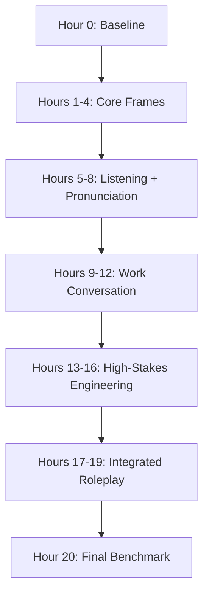
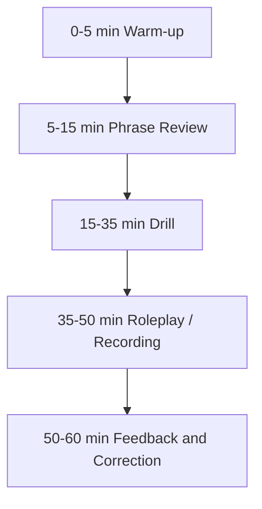
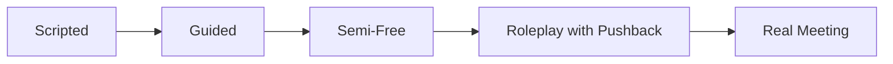

# English for Conversation Part 28 — The 20-Hour Practice Program

> Goal part ini: kamu punya program praktik 20 jam yang konkret, terstruktur, measurable, dan langsung relevan untuk software engineer.

Kerangka Josh Kaufman menekankan bahwa 20 jam pertama harus digunakan untuk **focused, deliberate practice**, bukan belajar pasif. Untuk English conversation, 20 jam ini harus diarahkan pada output nyata:

- berbicara,
- mendengar,
- merespons,
- memperbaiki,
- roleplay,
- dan menggunakan English dalam skenario kerja.

Part ini adalah operating plan. Bukan teori baru. Ini adalah eksekusi.

---

## 1. Target Performance Setelah 20 Jam

Setelah menyelesaikan 20 jam praktik, kamu ditargetkan mampu:

1. membuka dan menjaga percakapan ringan,
2. memberi daily work update,
3. menjelaskan bug atau incident,
4. bertanya clarification,
5. melakukan debugging conversation,
6. memberi code review feedback,
7. menjelaskan trade-off architecture,
8. disagree professionally,
9. membuat recommendation,
10. menyimpulkan decision dan next step.

Targetnya bukan native-level. Targetnya adalah:

```text
functional, clear, self-correcting, work-ready conversation.
```

---

## 2. Mental Model: 20 Hours Is a Controlled Bootstrapping Window

20 jam pertama bukan akhir pembelajaran. Ini adalah bootstrapping window untuk keluar dari kondisi pasif.



Kita tidak mengejar semua skill bahasa. Kita memilih skill dengan leverage tertinggi untuk conversation.

---

## 3. Program Principles

### 3.1 Practice Output, Not Input

Weak:

```text
Watch English videos for 1 hour.
```

Better:

```text
Listen to 2 minutes, shadow 5 sentences, then explain the topic in your own words.
```

### 3.2 Build Reusable Frames

You need patterns like:

```text
The issue is...
My concern is...
The trade-off is...
I recommend...
Let me clarify...
```

Frames reduce cognitive load.

### 3.3 Record and Correct

Every practice block should produce an artifact:

- audio recording,
- transcript,
- corrected sentences,
- phrasebank update,
- scorecard.

### 3.4 Train Scenarios, Not Random Conversation

Practice scenarios:

- standup,
- debugging,
- code review,
- design review,
- disagreement,
- meeting summary,
- interview.

### 3.5 Use Feedback Every Session

At minimum:

```text
record → review → rewrite → repeat
```

---

## 4. Required Tools

You do not need expensive tools.

Minimum setup:

1. voice recorder,
2. timer,
3. notes app,
4. transcript tool or manual transcript,
5. personal phrasebank,
6. self-correction checklist,
7. optional AI/tutor/peer.

### 4.1 Folder Structure

```text
english-conversation-20h/
  recordings/
  transcripts/
  corrections/
  phrasebank.md
  practice-log.md
  weekly-review.md
```

### 4.2 Practice Log Template

```text
Date:
Hour:
Scenario:
Focus:
Recording:
Top 3 issues:
Corrected patterns:
Score:
Next focus:
```

---

## 5. Baseline Assessment Before Hour 1

Before starting, record 5 short tasks.

### 5.1 Baseline Tasks

1. introduce yourself in 1 minute,
2. explain current work in 1 minute,
3. explain a bug in 2 minutes,
4. explain a trade-off in 2 minutes,
5. disagree with a risky release in 1 minute.

### 5.2 Baseline Scoring

Score 1–5:

| Dimension | Score |
|---|---|
| clarity | 1–5 |
| structure | 1–5 |
| grammar | 1–5 |
| fluency | 1–5 |
| pronunciation | 1–5 |
| pragmatics | 1–5 |
| confidence | 1–5 |

### 5.3 Baseline Output

```text
My biggest bottleneck is:
My second bottleneck is:
My strongest area is:
My 20-hour target is:
```

Example:

```text
My biggest bottleneck is structure under pressure.
My second bottleneck is hesitation/fillers.
My strongest area is technical vocabulary.
My 20-hour target is to explain bugs, trade-offs, and decisions clearly in work meetings.
```

---

## 6. The 20-Hour Schedule Overview

```mermaid
gantt
    title English Conversation 20-Hour Practice Program
    dateFormat  X
    axisFormat %s
    section Foundation
    Baseline + Target          :0, 1
    Core Frames                :1, 3
    Listening + Pronunciation  :3, 5
    section Work Conversation
    Daily Work + Standup       :5, 7
    Questions + Clarification  :7, 9
    Debugging + Pairing        :9, 11
    section Senior Communication
    Code Review                :11, 13
    Architecture + Trade-offs  :13, 15
    Disagreement + Decision    :15, 17
    section Integration
    Meeting + Async-to-Sync    :17, 18
    Interview + Career         :18, 19
    Final Benchmark            :19, 20
```



---

# Hour-by-Hour Program

## Hour 1 — Baseline, Target, and Conversation Frames

### Focus

- establish baseline,
- define target performance,
- memorize core frames.

### Practice

Record:

```text
Introduce yourself.
Explain current work.
Explain one technical problem.
```

### Core Frames

```text
The issue is...
The reason is...
My concern is...
The trade-off is...
I recommend...
The next step is...
```

### Output

```text
baseline recording
baseline score
personal target
core phrasebank v1
```

---

## Hour 2 — Sentence Patterns for Live Conversation

### Focus

Build automatic sentence frames.

### Drill

Transform:

```text
I think...
I’m not sure...
Can you clarify...?
What happens if...?
We should...
We should not...
```

Into 30 technical sentences.

Examples:

```text
I think the issue is in the mapping layer.
I’m not sure this handles inactive users.
Can you clarify the rollback plan?
What happens if the provider times out?
We should add an idempotency key.
We should not release without rollback validation.
```

### Output

```text
30 reusable work sentences
2-minute recording using 10 frames
```

---

## Hour 3 — Listening for Meaning

### Focus

Understand spoken English by meaning, not word-by-word.

### Practice

Use a short technical audio/video clip or generated transcript read aloud.

Steps:

1. listen once for general meaning,
2. listen again for keywords,
3. summarize in 5 sentences,
4. speak your summary.

### Summary Frame

```text
The main topic is...
The speaker explains...
The key issue is...
The recommendation is...
One thing I learned is...
```

### Output

```text
spoken summary recording
listening notes
unknown phrase list
```

---

## Hour 4 — Pronunciation for Intelligibility

### Focus

Be understood, not sound native.

### Practice

Record 20 high-value technical phrases:

```text
rollback plan
feature flag
idempotency key
eventual consistency
staging environment
production incident
authorization check
migration failure
regression test
trade-off
```

Then record each in a sentence.

Example:

```text
We need a rollback plan before release.
This should be behind a feature flag.
```

### Output

```text
pronunciation recording
top 5 hard phrases
repeat drill list
```

---

## Hour 5 — Fluency Mechanics: Chunking and Pauses

### Focus

Speak in chunks and use thinking phrases.

### Required Phrases

```text
Let me think for a second.
Let me structure my answer.
There are two parts to this.
The main point is...
Let me rephrase that.
```

### Practice

Answer:

```text
Should we release this feature today?
```

Use:

- pause,
- two-part structure,
- recommendation.

### Output

```text
3-minute structured answer
filler count
corrected version
```

---

## Hour 6 — Daily Work Conversation

### Focus

Speak about daily work clearly.

### Practice Prompts

1. What did you do yesterday?
2. What are you working on today?
3. What is your blocker?
4. What help do you need?
5. What changed since yesterday?

### Standup Frame

```text
Yesterday, I worked on...
Today, I’m going to...
The blocker is...
I need help with...
```

### Output

```text
5 standup recordings
daily update script
```

---

## Hour 7 — Questions and Clarification

### Focus

Ask useful questions and repair misunderstanding.

### Drill

Create 30 questions using:

```text
Do we...?
Did we...?
Have we...?
Can we...?
Should we...?
What happens if...?
```

### Clarification Phrases

```text
Could you repeat that?
Can you rephrase that?
Let me make sure I understood.
Do you mean...?
```

### Output

```text
30 diagnostic questions
clarification roleplay recording
```

---

## Hour 8 — Survival Conversation and Small Talk

### Focus

Start, maintain, and close light conversation.

### Practice

Use:

```text
Answer + Small Detail + Ask Back
```

Prompts:

```text
How are you?
How was your weekend?
How’s your week going?
Any plans for the weekend?
```

### Output

```text
5 small talk scripts
3-minute social conversation recording
```

---

## Hour 9 — Debugging Conversation I: Describe Symptoms

### Focus

Describe what happens before diagnosing.

### Symptom Frames

```text
The issue happens when...
The failure occurs after...
The error appears before...
The weird part is...
This is reproducible when...
```

### Practice Scenario

```text
Login fails only in staging.
The token is valid, but the user id is missing.
```

### Output

```text
2-minute symptom explanation
5 diagnostic questions
```

---

## Hour 10 — Debugging Conversation II: Hypothesis and Evidence

### Focus

Propose hypotheses and validate evidence.

### Frames

```text
My current hypothesis is...
The reason is...
We can verify it by...
That supports the hypothesis.
That makes it less likely.
```

### Practice

Explain 3 possible causes for:

```text
A job processes the same event twice.
```

### Output

```text
hypothesis table
3-minute debugging monologue
```

---

## Hour 11 — Pair Programming Roleplay

### Focus

Think aloud and navigate code verbally.

### Required Phrases

```text
Can you scroll down a bit?
Can we check where this is called?
Let’s add a failing test first.
I’m not sure yet, but...
Let’s summarize what we found.
```

### Practice

Roleplay:

```text
A test passes locally but fails in CI.
```

### Output

```text
5-minute pair debugging roleplay
self-correction checklist
```

---

## Hour 12 — Code Review Conversation

### Focus

Give and receive review feedback.

### Review Comment Template

```text
Observation:
Risk:
Suggestion:
```

### Practice

Write and speak 5 review comments:

1. missing null check,
2. missing authorization,
3. no regression test,
4. unclear naming,
5. possible N+1 query.

### Output

```text
5 review comments
spoken review recording
```

---

## Hour 13 — Architecture Discussion I: Problem and Options

### Focus

Frame architecture decisions.

### Frames

```text
The problem we’re trying to solve is...
The main constraint is...
I see two options.
Option A is...
Option B is...
```

### Practice

Topic:

```text
Should payment processing be synchronous or asynchronous?
```

### Output

```text
option comparison table
3-minute architecture explanation
```

---

## Hour 14 — Architecture Discussion II: Trade-Offs and Risks

### Focus

Explain trade-offs and failure modes.

### Frames

```text
The trade-off is...
This improves..., but it adds...
The failure mode I’m worried about is...
We can mitigate this by...
```

### Practice

Explain trade-offs for:

1. queue,
2. cache,
3. feature flag,
4. microservice split,
5. two-phase migration.

### Output

```text
5 trade-off explanations
risk explanation recording
```

---

## Hour 15 — Disagreement and Pushback

### Focus

Disagree clearly without sounding rude.

### Pattern

```text
I see the benefit, but...
My concern is...
The risk is...
A safer alternative would be...
```

### Practice

Push back on:

```text
A release with no rollback plan.
```

### Output

```text
3 levels of pushback
5-minute disagreement roleplay
```

---

## Hour 16 — Decision-Making Conversation

### Focus

Move discussion toward decision.

### Pattern

```text
The decision we need today is...
I see two realistic options.
The deciding criteria are...
Given the constraints, I recommend...
Does anyone see a blocking concern?
```

### Practice

Scenario:

```text
Ship hotfix now or delay for refactor?
```

### Output

```text
decision monologue
alignment question practice
```

---

## Hour 17 — Meeting Fluency and Facilitation

### Focus

Open, interrupt, scope, summarize, close.

### Required Phrases

```text
The goal of this meeting is...
Can I pause us there?
That is related, but separate.
Do we have enough information to decide?
Let me summarize where we landed.
```

### Practice

Simulate release meeting with:

- product urgency,
- engineering risk,
- security concern.

### Output

```text
7-minute meeting simulation
action item summary
```

---

## Hour 18 — Async-to-Sync Communication

### Focus

Compress Slack/PR/ticket context into spoken alignment.

### Template

```text
Context:
Current state:
Open question:
Goal:
```

### Practice

Scenario:

```text
Slack thread about failed staging deployment.
Migration failed.
App code starts.
Rollback untested.
Product asks if release is possible.
```

### Output

```text
compressed meeting opening
async write-back summary
```

---

## Hour 19 — Interview and Career Conversation

### Focus

Explain yourself and your projects clearly.

### Project Template

```text
Context:
Problem:
My role:
Approach:
Result:
Learning:
```

### Practice

Record:

1. 1-minute self-introduction,
2. 3-minute project story,
3. 2-minute failure/learning answer.

### Output

```text
interview recording
project story draft
```

---

## Hour 20 — Final Integrated Benchmark

### Focus

Test integrated performance.

### Final Scenarios

Record all:

1. 2-minute daily update,
2. 3-minute bug explanation,
3. 3-minute code review feedback,
4. 5-minute architecture recommendation,
5. 5-minute disagreement/decision roleplay,
6. 3-minute meeting summary.

### Scoring

Use rubric:

| Dimension | Score |
|---|---|
| clarity | 1–5 |
| structure | 1–5 |
| grammar accuracy | 1–5 |
| fluency | 1–5 |
| pronunciation | 1–5 |
| pragmatics | 1–5 |
| interaction | 1–5 |
| technical precision | 1–5 |

### Output

```text
final benchmark recordings
final scorecard
next 30-day plan
```

---

## 7. Daily Schedule Options

### Option A — 20 Days x 1 Hour

Best for consistency.

```text
1 hour/day for 20 days
```

Pros:

- better retention,
- enough recovery,
- easier habit.

Cons:

- slower completion.

### Option B — 10 Days x 2 Hours

Good for intensive sprint.

```text
2 hours/day for 10 days
```

Pros:

- momentum,
- immersion.

Cons:

- fatigue,
- needs discipline.

### Option C — 5 Weekends x 4 Hours

Good for busy work schedule.

```text
4 hours/weekend session x 5
```

Pros:

- deep sessions,
- easier recording/review.

Cons:

- less daily speaking habit.

### Recommended

For most software engineers:

```text
20 days x 1 hour
```

Because conversation skill benefits from repeated exposure and spaced correction.

---

## 8. Session Structure

Every 60-minute session should have the same structure.



### 8.1 Warm-Up

Speak easy sentences:

```text
Today I’m practicing...
The focus is...
The scenario is...
```

### 8.2 Phrase Review

Review 5–10 target phrases.

### 8.3 Drill

Practice controlled patterns.

### 8.4 Roleplay / Recording

Produce spontaneous output.

### 8.5 Feedback

Review and correct top 3 issues.

---

## 9. Practice Tracker

Use this table.

| Hour | Date | Scenario | Focus | Recording? | Top Issue | Score | Next Focus |
|---|---|---|---|---|---|---|---|
| 1 | | baseline | clarity | yes/no | | | |
| 2 | | sentence frames | grammar | yes/no | | | |
| 3 | | listening summary | listening | yes/no | | | |
| ... | | | | | | | |

### 9.1 Completion Rule

An hour counts only if it includes:

```text
speaking output + feedback/correction
```

Passive listening alone does not count as one deliberate practice hour.

---

## 10. Scenario Bank

Use these scenarios throughout the program.

### 10.1 Daily Work

```text
You finished a task but found an edge case.
You are blocked by unclear requirements.
You need help reproducing a bug.
You need to update a stakeholder.
```

### 10.2 Debugging

```text
Login fails only in staging.
CI test fails intermittently.
Queue processes duplicate events.
Cache returns stale data.
API latency spikes after deployment.
```

### 10.3 Code Review

```text
PR misses authorization check.
PR has no regression test.
Query may create N+1 problem.
Migration is not backward compatible.
Variable naming is unclear.
```

### 10.4 Architecture

```text
sync vs async workflow.
monolith module vs microservice.
cache vs direct query.
feature flag rollout.
two-phase migration.
```

### 10.5 Conflict / Decision

```text
product wants release today.
engineering wants rollback validation.
security blocks missing tenant check.
reviewer asks for large refactor in hotfix.
team disagrees about abstraction.
```

### 10.6 Interview

```text
tell me about yourself.
challenging project.
technical trade-off.
failure and learning.
conflict with teammate.
```

---

## 11. Required Phrasebank by End of 20 Hours

By the end, these should feel automatic.

### 11.1 Clarification

```text
Can you clarify what you mean by...?
Let me make sure I understood.
Do you mean...?
```

### 11.2 Debugging

```text
The issue happens when...
My current hypothesis is...
We can verify it by...
```

### 11.3 Code Review

```text
This might not handle...
Can we add a test for...?
I’m concerned that...
```

### 11.4 Architecture

```text
The problem we’re trying to solve is...
The trade-off is...
The failure mode I’m worried about is...
```

### 11.5 Decision

```text
Given the constraints, I recommend...
Does anyone see a blocking concern?
The next step is...
```

### 11.6 Disagreement

```text
I see the point, but...
My concern is...
A safer alternative would be...
```

### 11.7 Fluency

```text
Let me think for a second.
Let me structure my answer.
Let me rephrase that.
```

---

## 12. Milestones

### After 5 Hours

You should be able to:

- use core frames,
- speak in chunks,
- give simple updates,
- ask clarification.

### After 10 Hours

You should be able to:

- describe bugs,
- ask diagnostic questions,
- propose hypotheses,
- recover from misunderstanding.

### After 15 Hours

You should be able to:

- give code review feedback,
- explain architecture trade-offs,
- state technical risks,
- disagree professionally.

### After 20 Hours

You should be able to:

- handle realistic engineering conversation,
- make recommendations,
- summarize decisions,
- self-correct with feedback loop.

---

## 13. Scoring Rubric for Milestones

| Score | Meaning |
|---|---|
| 1 | cannot perform without script |
| 2 | can perform with heavy hesitation |
| 3 | can perform clearly with some errors |
| 4 | can perform naturally in familiar scenarios |
| 5 | can adapt flexibly under pressure |

Target after 20 hours:

```text
Most important dimensions at 3–4.
Not necessarily 5.
```

A score of 4 in clarity and structure is more valuable than a score of 5 in minor grammar polish.

---

## 14. How to Handle Missed Days

Do not restart the program. Resume.

### Rule

```text
Missed day = continue from next hour.
No guilt, no reset.
```

### If You Miss More Than 3 Days

Do a 30-minute restart:

```text
review phrasebank,
record 2-minute current work update,
continue from next hour.
```

Skill acquisition fails when missed practice becomes identity failure. Treat it as scheduling variance.

---

## 15. How to Increase Difficulty

Increase difficulty gradually.



### 15.1 Scripted

Read prepared answer.

### 15.2 Guided

Use bullet points.

### 15.3 Semi-Free

Use only phrase prompts.

### 15.4 Pushback

Partner/AI challenges your answer.

### 15.5 Real Meeting

Use one target phrase live.

---

## 16. Feedback Integration

Each hour must end with correction.

### 16.1 Correction Template

```text
Original:
Problem:
Better:
Pattern:
Next repetition:
```

Example:

```text
Original:
Maybe rollback not safe.

Problem:
Too vague, grammar issue.

Better:
Rollback may not be safe because we have not tested the recovery path.

Pattern:
<thing> may not be safe because <reason>.
```

### 16.2 Review Every 5 Hours

At hours 5, 10, 15, 20:

```text
What improved?
What still breaks?
Which patterns became automatic?
What is the next bottleneck?
```

---

## 17. 20-Hour Program Checklist

### Foundation

- [ ] baseline recorded
- [ ] target defined
- [ ] core frames memorized
- [ ] phrasebank created

### Core Conversation

- [ ] daily update practiced
- [ ] small talk practiced
- [ ] clarification practiced
- [ ] listening summary practiced

### Engineering Conversation

- [ ] debugging scenario practiced
- [ ] pair programming roleplay practiced
- [ ] code review practiced
- [ ] architecture trade-off practiced

### Senior Communication

- [ ] disagreement practiced
- [ ] decision-making practiced
- [ ] meeting facilitation practiced
- [ ] async-to-sync practiced

### Career

- [ ] self-introduction recorded
- [ ] project story recorded
- [ ] interview follow-up practiced

### Final

- [ ] benchmark recorded
- [ ] scorecard completed
- [ ] next 30-day plan written

---

## 18. Example Practice Log

```text
Date:
2026-06-26

Hour:
14

Scenario:
Architecture trade-off: synchronous vs asynchronous payment processing.

Focus:
Trade-off and risk explanation.

Recording:
yes

Top 3 issues:
1. too many fillers before recommendation
2. unclear difference between latency and resilience
3. weak final recommendation

Corrected patterns:
- This improves resilience, but it introduces eventual consistency.
- The failure mode I’m worried about is duplicate processing.
- Given the current traffic, I recommend keeping it synchronous for the first release.

Score:
clarity 3, structure 4, fluency 3, pragmatics 4

Next focus:
make recommendation earlier and more directly.
```

---

## 19. Final Benchmark Script

Use this sequence in Hour 20.

### 19.1 Daily Update

```text
Yesterday, I worked on...
Today, I’m going to...
The blocker is...
I need help with...
```

### 19.2 Bug Explanation

```text
The issue happens when...
What we know so far is...
My current hypothesis is...
We can verify it by...
```

### 19.3 Code Review Feedback

```text
This condition might not handle...
The risk is...
Can we add...?
```

### 19.4 Architecture Recommendation

```text
The problem we’re solving is...
I see two options...
The trade-off is...
Given the constraints, I recommend...
```

### 19.5 Disagreement

```text
I see the benefit, but...
My concern is...
I don’t think we should...
A safer alternative is...
```

### 19.6 Meeting Summary

```text
Let me summarize where we landed.
The decision is...
The reason is...
The action items are...
The open question is...
```

---

## 20. Next 30-Day Plan After 20 Hours

The 20-hour program starts the engine. The next 30 days build durability.

### 20.1 Weekly Focus

Week 1:

```text
debugging + clarification
```

Week 2:

```text
code review + disagreement
```

Week 3:

```text
architecture + decision-making
```

Week 4:

```text
interview + meeting facilitation
```

### 20.2 Minimum Maintenance

```text
3 recordings per week
1 roleplay per week
1 real meeting target phrase per week
1 weekly review
```

### 20.3 Long-Term Goal

Move from:

```text
I can speak if prepared.
```

to:

```text
I can participate, clarify, push back, and summarize in real work situations.
```

---

## 21. Common Failure Modes in the 20-Hour Program

### 21.1 Consuming Too Much Content

Problem:

```text
watching lessons instead of speaking
```

Fix:

```text
at least 70% of practice time should produce speech
```

### 21.2 Avoiding Recording

Problem:

```text
no evidence
```

Fix:

```text
record even if uncomfortable
```

### 21.3 Practicing Only Easy Scenarios

Problem:

```text
small talk improves, but work conversation stays weak
```

Fix:

```text
practice high-stakes scenarios: disagreement, decision, architecture
```

### 21.4 No Feedback Loop

Problem:

```text
same errors repeat
```

Fix:

```text
each session ends with top 3 corrections
```

### 21.5 Trying to Sound Native

Problem:

```text
accent anxiety blocks speaking
```

Fix:

```text
target intelligibility and professional clarity
```

---

## 22. Final Assignment

Execute Hour 1 now.

Do not wait.

Record:

1. 1-minute self-introduction,
2. 1-minute current work update,
3. 2-minute bug explanation,
4. 2-minute trade-off explanation,
5. 1-minute disagreement.

Then fill:

```text
My baseline score:
Clarity:
Structure:
Grammar:
Fluency:
Pronunciation:
Pragmatics:
Interaction:

My biggest bottleneck:
My 20-hour target:
My first 5 target phrases:
```

First 5 target phrases recommendation:

```text
The issue is...
My concern is...
Can you clarify...?
The trade-off is...
I recommend...
```

---

## Part 28 Summary

The 20-hour program is a deliberate practice system.

The core rule is:

```text
Every hour must include speaking output and feedback.
```

The program progression is:

```text
baseline → frames → listening/pronunciation → work conversation → debugging → code review → architecture → disagreement → decision → meeting → final benchmark
```

After 20 hours, you should not expect perfect English. You should expect a working conversation foundation:

```text
clear enough to collaborate,
structured enough to explain,
flexible enough to recover,
and measurable enough to keep improving.
```

---
