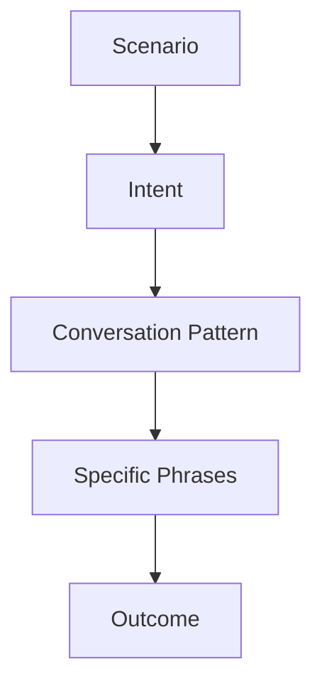

# English for Conversation Part 29 — Real-World Conversation Playbook for Software Engineers

> Goal part ini: kamu punya playbook siap pakai untuk skenario percakapan nyata sebagai software engineer: meeting, debugging, code review, architecture, incident, escalation, stakeholder update, interview, dan conflict.

Part-part sebelumnya membangun skill per komponen. Part ini menyatukan semuanya menjadi **scenario playbook**.

Playbook ini tidak dimaksudkan untuk dihafal kata demi kata. Gunakan sebagai:

- reference pattern,
- roleplay material,
- phrasebank source,
- self-correction benchmark,
- dan simulation bank.

Dalam English conversation, fleksibilitas muncul ketika kamu punya cukup banyak pattern yang bisa digabung ulang sesuai konteks.

---

## 1. Mental Model: Real Conversation = Scenario + Intent + Pattern

Setiap percakapan kerja biasanya bisa dipetakan ke tiga hal:



Contoh:

| Scenario | Intent | Pattern |
|---|---|---|
| standup | give update | yesterday → today → blocker |
| debugging | find cause | symptom → question → hypothesis → test |
| code review | reduce risk | observation → risk → suggestion |
| architecture | make decision | problem → options → trade-off → recommendation |
| incident | coordinate response | status → impact → facts → unknowns → next action |
| disagreement | communicate risk | acknowledge → concern → risk → alternative |
| stakeholder update | align non-technical people | context → impact → decision needed |

Real-world fluency bukan berarti membuat kalimat baru dari nol. Real-world fluency berarti memilih pattern yang cocok dengan scenario.

---

## 2. Universal Conversation Operating Pattern

Gunakan pattern universal ini untuk banyak situasi:

```text
Context:
<what is happening>

Current state:
<what we know>

Concern / open question:
<what is unresolved or risky>

Recommendation / next step:
<what should happen next>
```

Spoken version:

```text
Here’s the context.
What we know so far is...
The concern is...
My recommendation is...
The next step is...
```

Ini bisa dipakai untuk:

- incident update,
- design discussion,
- stakeholder report,
- PR escalation,
- release decision,
- debugging handoff.

---

# Scenario Playbook

## Scenario 01 — Joining a Meeting Early

### Intent

Build light rapport and transition to work.

### Useful Phrases

```text
Hey, how’s it going?
How’s your week going?
Pretty good. A bit busy, but good overall.
Anyway, should we get started?
```

### Example Dialogue

```text
A: Hey, how’s it going?

B: Pretty good, thanks. A bit busy with the release, but good overall.
How about you?

A: Same here. Lots going on.

B: Yeah, release weeks are always intense.
Anyway, should we get started with the rollout plan?
```

### Weak vs Strong

Weak:

```text
Fine.
```

Strong:

```text
Pretty good, thanks. A bit busy with the release, but good overall. How about you?
```

---

## Scenario 02 — Daily Standup Update

### Intent

Give concise progress and blocker.

### Pattern

```text
Yesterday...
Today...
Blocker...
Help needed...
```

### Example

```text
Yesterday, I finished the retry logic and added the basic tests.
Today, I’m going to add the idempotency test and update the PR description.
The blocker is that I need confirmation from the payment provider about retry behavior.
```

### Strong Variation

```text
Quick update from my side.
The implementation is done, but I’m still validating the rollback path.
I’ll share an update after the staging test.
```

---

## Scenario 03 — Saying You Are Blocked

### Intent

Ask for help without sounding passive.

### Useful Phrases

```text
I’m blocked by...
I need clarification on...
The decision I need is...
Can someone help me confirm...?
```

### Example

```text
I’m blocked by one unclear requirement.
I need to confirm whether inactive users should still appear in the admin search result.
Once that is clear, I can finish the permission check.
```

### Weak vs Strong

Weak:

```text
I cannot continue.
```

Strong:

```text
I’m blocked by the expected behavior for inactive users. I need product confirmation before I finalize the logic.
```

---

## Scenario 04 — Asking for Clarification

### Intent

Avoid misunderstanding.

### Pattern

```text
Can you clarify <specific point>?
Do you mean <A> or <B>?
Let me make sure I understood...
```

### Example

```text
Can you clarify what you mean by “safe to release”?
Do you mean the feature is behind a flag, or that rollback has been tested?
```

### Strong Variation

```text
Let me make sure I understood.
You’re saying the implementation is complete, but the rollout plan is still open. Is that right?
```

---

## Scenario 05 — Explaining a Bug

### Intent

Describe symptom before diagnosis.

### Pattern

```text
The issue happens when...
The expected behavior is...
The actual behavior is...
What we know so far is...
```

### Example

```text
The issue happens when a user has more than one active session.
The expected behavior is that the latest session should be used.
The actual behavior is that the service sometimes picks the older session.
What we know so far is that the problem only happens in staging.
```

### Weak vs Strong

Weak:

```text
Session bug.
```

Strong:

```text
The issue happens when a user has more than one active session. The service sometimes selects the older session instead of the latest one.
```

---

## Scenario 06 — Debugging with a Teammate

### Intent

Think aloud and investigate collaboratively.

### Pattern

```text
What I see is...
My current hypothesis is...
We can verify it by...
```

### Example

```text
What I see is that the token is valid, but the user id is missing after mapping.
My current hypothesis is that the claim name is different in staging.
We can verify it by logging the decoded payload before the mapping step.
```

### Useful Phrases

```text
Can you walk me through the issue?
Can we reproduce it locally?
What changed recently?
Let’s check the logs around that timestamp.
```

---

## Scenario 07 — When You Are Stuck During Debugging

### Intent

Reset the reasoning.

### Useful Phrases

```text
Let’s step back.
What do we know for sure?
What assumptions are we making?
Maybe we’re looking at the wrong layer.
```

### Example

```text
Let’s step back for a second.
What we know for sure is that the request reaches the service.
What we don’t know yet is whether the database returns the expected user record.
Maybe we should check the query result before changing the service logic.
```

---

## Scenario 08 — Handoff After Debugging

### Intent

Summarize findings for another engineer/team.

### Pattern

```text
Here’s what we found:
<fact>
<fact>
<likely cause>
<next step>
```

### Example

```text
Here’s what we found.
The issue only happens in staging.
The token is valid, but the mapped user id is empty.
The likely cause is a claim-name mismatch between environments.
The next step is to compare the auth provider config and add a regression test.
```

---

## Scenario 09 — Giving Code Review Feedback

### Intent

Point out risk clearly and respectfully.

### Pattern

```text
Observation:
Risk:
Suggestion:
```

### Example

```text
This condition only checks whether the user exists.
It does not verify whether the user is active, so inactive users may still pass the permission check.
Can we add an explicit status check and a regression test?
```

### Weak vs Strong

Weak:

```text
Wrong condition.
```

Strong:

```text
This condition might also match inactive users. Can we add a status check before returning permission?
```

---

## Scenario 10 — Receiving Code Review Feedback

### Intent

Clarify or accept without defensiveness.

### Useful Phrases

```text
Good catch.
That makes sense.
I missed that edge case.
Can you clarify the scenario you’re concerned about?
I’ll update it and add a test.
```

### Example

```text
Good catch. I missed the inactive-user case.
I’ll add a guard and include a regression test for it.
```

### Pushback Variation

```text
I see the concern.
My reasoning was to keep the validation close to the handler because it is only used here.
Would you be okay if I extract the condition into a named helper instead of a shared utility?
```

---

## Scenario 11 — Asking for PR Review

### Intent

Ask clearly, include scope.

### Example

```text
Could you review this PR when you have a chance?
The main change is the retry logic for payment callbacks.
I’d especially like feedback on the idempotency handling and test coverage.
```

### Urgent Version

```text
Can you prioritize this review today?
It is blocking the release decision.
The risky part is the rollback test and the permission check.
```

---

## Scenario 12 — Explaining a Design Option

### Intent

Frame option and consequence.

### Pattern

```text
One option is...
This gives us...
The downside is...
```

### Example

```text
One option is to keep the workflow synchronous for the first release.
This gives us a simpler implementation and easier debugging.
The downside is that request latency still depends on the external provider.
```

---

## Scenario 13 — Comparing Two Options

### Intent

Help team evaluate trade-offs.

### Pattern

```text
Option A optimizes for...
Option B optimizes for...
The deciding factor should be...
```

### Example

```text
Option A optimizes for delivery speed and operational simplicity.
Option B optimizes for resilience and load smoothing.
The deciding factor should be whether users can tolerate eventual consistency.
```

---

## Scenario 14 — Explaining a Trade-Off

### Intent

Show technical judgment.

### Pattern

```text
This improves <benefit>, but it increases <cost>.
```

### Example

```text
Adding a queue improves resilience and load smoothing, but it introduces eventual consistency and requires idempotency.
```

### Strong Variation

```text
The trade-off is not whether async is good or bad.
The trade-off is whether the resilience benefit justifies the operational complexity right now.
```

---

## Scenario 15 — Stating an Assumption

### Intent

Expose hidden design dependency.

### Pattern

```text
This assumes that...
If that assumption is wrong...
We should validate it by...
```

### Example

```text
This design assumes that the provider supports idempotency keys.
If that assumption is wrong, retries may create duplicate charges.
We should validate the provider contract before finalizing the design.
```

---

## Scenario 16 — Professional Disagreement

### Intent

Disagree without personal attack.

### Pattern

```text
I see the point, but...
My concern is...
A safer alternative would be...
```

### Example

```text
I see the point about moving faster, but my concern is rollback safety.
If the migration fails halfway, recovery may be difficult.
A safer alternative would be a limited rollout after staging validation.
```

---

## Scenario 17 — Strong Pushback

### Intent

Block serious risk.

### Example

```text
I don’t think we should release this today.
The rollback path has not been tested, and the migration touches customer data.
I think we should delay until rollback is validated in staging.
```

### When to Use

Use strong pushback for:

- missing authorization,
- data exposure,
- unsafe migration,
- no rollback path,
- payment duplication,
- compliance/audit gap.

---

## Scenario 18 — Saying No to Scope Expansion

### Intent

Protect focus and delivery.

### Example

```text
I agree the refactor is valuable, but I think it is outside the scope of this hotfix.
Can we merge the minimal fix first and create a follow-up task for the cleanup?
```

### Stronger Version

```text
I would push back on including the full refactor in this PR.
It increases review risk and delays the production fix.
```

---

## Scenario 19 — Asking for a Decision

### Intent

Move meeting from discussion to closure.

### Useful Phrases

```text
Can we make a decision on this now?
Do we have enough information to choose a direction?
Does anyone see a blocking concern?
Who owns the final call here?
```

### Example

```text
It sounds like we have two options: limited rollout today or delay until tomorrow.
Do we have enough information to choose a direction now?
```

---

## Scenario 20 — Making a Recommendation

### Intent

State direction with reasoning.

### Pattern

```text
Given <context>,
I recommend <option>
because <reason>.
The main risk is <risk>,
so we should <mitigation>.
```

### Example

```text
Given the release timeline and the fact that the feature is behind a flag,
I recommend a limited rollout today.
The main risk is the new permission path, so we should monitor permission-denied metrics closely.
```

---

## Scenario 21 — Opening a Meeting

### Intent

Set goal and decision.

### Example

```text
Thanks everyone for joining.
The goal of this meeting is to decide whether we release the permission feature today.
By the end, we should agree on the rollout strategy, owner, and monitoring plan.
```

### Incident Version

```text
The goal of this call is to understand current impact, decide whether to rollback, and assign next actions.
```

---

## Scenario 22 — Interrupting Politely

### Intent

Correct direction or surface risk.

### Useful Phrases

```text
Sorry to interrupt, but...
Can I pause us there for a second?
Before we go further, can we clarify...?
I want to highlight one risk before we decide.
```

### Example

```text
Can I pause us there for a second?
I think we may be mixing the hotfix decision with the long-term refactor.
Can we decide the hotfix first?
```

---

## Scenario 23 — Controlling Meeting Scope

### Intent

Prevent drift.

### Example

```text
That is related, but I think it is a separate topic.
For this meeting, let’s focus on whether the release is safe today.
We can capture the refactor as a follow-up.
```

### Stronger Version

```text
I think we’re going too deep into implementation details.
Can we come back to the decision we need today?
```

---

## Scenario 24 — Summarizing a Meeting

### Intent

Create shared closure.

### Pattern

```text
Decision:
Reason:
Action items:
Open questions:
```

### Spoken Example

```text
Let me summarize where we landed.
Decision: we will do a limited rollout to one tenant today.
Reason: it limits blast radius while still giving product some customer impact.
Action items: Rina will enable the flag, Alex will monitor metrics, and I’ll post the summary.
Open question: tomorrow we decide whether to expand to all tenants.
```

---

## Scenario 25 — Async-to-Sync Context

### Intent

Compress Slack/PR/ticket context into meeting opening.

### Pattern

```text
Context:
Current state:
Open question:
Goal:
```

### Example

```text
Let me summarize the thread quickly.
The deployment failed during the migration step.
The app code starts correctly, but rollback has not been tested.
The open question is whether the migration is safe to run in production.
The goal of this call is to decide whether to rollback, patch, or delay the release.
```

---

## Scenario 26 — Incident Update

### Intent

Communicate status under pressure.

### Pattern

```text
Current status:
Impact:
Known facts:
Unknowns:
Next action:
```

### Example

```text
Current status: checkout latency is elevated.
Impact: around 20% of checkout requests are slower than normal.
Known facts: the latency started after the latest deployment, and provider calls are taking longer.
Unknowns: we do not know yet whether this is caused by our retry change or the provider.
Next action: we are comparing latency before and after rollback in staging.
```

### Weak vs Strong

Weak:

```text
There is some issue with checkout.
```

Strong:

```text
Checkout latency is elevated, affecting around 20% of requests. The leading hypothesis is provider retry behavior, but we have not confirmed it yet.
```

---

## Scenario 27 — Escalating a Risk

### Intent

Raise urgency without blame.

### Pattern

```text
I want to escalate this because...
The impact is...
The decision needed is...
```

### Example

```text
I want to escalate this because rollback is still untested and the release is scheduled for tomorrow.
The impact is that we may not be able to recover safely if the migration fails.
The decision needed is whether to delay the release or reduce scope.
```

### Avoid

```text
The backend team did not do rollback.
```

Use state-focused language:

```text
The rollback path has not been validated yet.
```

---

## Scenario 28 — Stakeholder Update

### Intent

Explain technical situation without overwhelming detail.

### Pattern

```text
Context:
Impact:
Current action:
Decision needed:
```

### Example

```text
The release is currently blocked by migration risk.
The implementation is complete, but rollback has not been validated yet.
The impact is that releasing today would increase recovery risk if something goes wrong.
We are validating rollback in staging and will confirm the release decision after that.
```

### Product-Friendly Version

```text
The feature is ready, but the safe recovery path is not fully validated.
I recommend delaying the full rollout until tomorrow and enabling one tenant first.
```

---

## Scenario 29 — Interview Project Story

### Intent

Show evidence of experience.

### Pattern

```text
Context:
Problem:
My role:
Approach:
Result:
Learning:
```

### Example

```text
One project I worked on was a workflow platform for case management.
The main problem was that each case could follow different paths depending on risk, evidence, and approvals.
My role was to design the lifecycle model and implement escalation rules.
We separated case state, task state, and approval state so each lifecycle had clear invariants.
The result was a system that was easier to audit and reason about.
One thing I learned was that workflow design is not just technical; it affects compliance and operations.
```

---

## Scenario 30 — Closing a Conversation Professionally

### Intent

End with clarity and warmth.

### Useful Phrases

```text
Thanks, this was helpful.
I’ll follow up with the summary.
I’ll update the PR after this.
Let’s continue in the thread.
Have a good one.
```

### Example

```text
Thanks, this was helpful.
I’ll update the PR with the idempotency test and post a summary in the thread.
Have a good one.
```

---

# Cross-Scenario Phrase Index

## Clarification

```text
Can you clarify what you mean by...?
Do you mean A or B?
Let me make sure I understood.
Can you give an example?
```

## Debugging

```text
What we know so far is...
My current hypothesis is...
We can verify it by...
That makes the hypothesis less likely.
```

## Risk

```text
The main risk is...
The failure mode I’m worried about is...
This could fail if...
We can mitigate this by...
```

## Recommendation

```text
Given the constraints, I recommend...
I lean toward...
I strongly recommend...
The next step is...
```

## Disagreement

```text
I see the point, but...
My concern is...
I’m not fully convinced that...
A safer alternative would be...
```

## Meeting Control

```text
Can I pause us there?
That is related, but separate.
Do we have enough information to decide?
Let me summarize where we landed.
```

## Escalation

```text
I want to escalate this because...
The impact is...
The decision needed is...
```

---

# Weak vs Strong Response Bank

## 1. “I don’t know”

Weak:

```text
I don’t know.
```

Strong:

```text
I don’t know yet, but I can verify it by checking the logs and comparing staging with production.
```

## 2. “It works”

Weak:

```text
It works.
```

Strong:

```text
It works locally and in staging for the normal path. We still need to test the rollback path.
```

## 3. “It failed”

Weak:

```text
It failed.
```

Strong:

```text
The deployment failed during the migration step. The application code starts correctly if the migration is skipped.
```

## 4. “This is risky”

Weak:

```text
This is risky.
```

Strong:

```text
The risk is that if the migration fails halfway, some records may be updated while others remain in the old state.
```

## 5. “We should wait”

Weak:

```text
We should wait.
```

Strong:

```text
I recommend delaying the release until rollback is validated in staging.
```

## 6. “I disagree”

Weak:

```text
I disagree.
```

Strong:

```text
I see the point, but I’m concerned that this does not handle the rollback scenario safely.
```

---

# Roleplay Bank

Use these roleplays to practice.

## Roleplay 01 — Release Risk

Context:

```text
Product wants to release today.
Engineering has not tested rollback.
Security wants one more validation test.
```

Required phrases:

```text
I understand the urgency.
My concern is...
I don’t think we should...
A safer alternative would be...
Does anyone see a blocking concern?
```

---

## Roleplay 02 — Code Review Pushback

Context:

```text
Reviewer asks for a large refactor in a hotfix PR.
You think it should be a follow-up.
```

Required phrases:

```text
I agree this cleanup is valuable.
I think it is outside the scope of this hotfix.
Can we merge the minimal fix first?
I’ll create a follow-up task.
```

---

## Roleplay 03 — Architecture Decision

Context:

```text
Team debates sync vs async processing.
Traffic is low now but expected to grow.
```

Required phrases:

```text
I see two options.
The trade-off is...
This assumes that...
Given the current scale, I recommend...
```

---

## Roleplay 04 — Incident Update

Context:

```text
Checkout latency increased after deployment.
Provider calls are slower.
Rollback is being evaluated.
```

Required phrases:

```text
Current status...
Impact...
Known facts...
Unknowns...
Next action...
```

---

## Roleplay 05 — Interview Project Story

Context:

```text
Explain a workflow/case-management project.
```

Required phrases:

```text
The main problem was...
My role was...
The hardest part was...
The trade-off was...
The impact was...
```

---

# Final Practice Protocol for This Playbook

For each scenario:

1. Read the pattern.
2. Speak the example aloud.
3. Replace the domain with your own project.
4. Record yourself.
5. Rewrite weak sentences.
6. Repeat with no script.
7. Add one follow-up question.
8. Add one disagreement or clarification.

## Example Practice Loop

```text
Scenario:
Incident update.

First attempt:
Record 2 minutes.

Feedback:
Too vague about impact.

Correction:
Use "Current status, impact, known facts, unknowns, next action."

Second attempt:
Record again.

Result:
Clearer and shorter.
```

---

# Part 29 Summary

Real-world English conversation for software engineers is scenario-driven.

The most reusable operating pattern is:

```text
Context → Current State → Concern/Open Question → Recommendation/Next Step
```

The most important scenario patterns are:

```text
standup:
yesterday → today → blocker

debugging:
symptom → hypothesis → verification

code review:
observation → risk → suggestion

architecture:
problem → options → trade-off → recommendation

incident:
status → impact → facts → unknowns → next action

disagreement:
acknowledge → concern → risk → alternative

meeting:
goal → discussion → decision → action items
```

Use this playbook repeatedly until the patterns become automatic. That is how scripted practice becomes flexible conversation.

---
