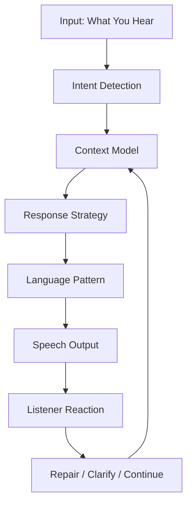
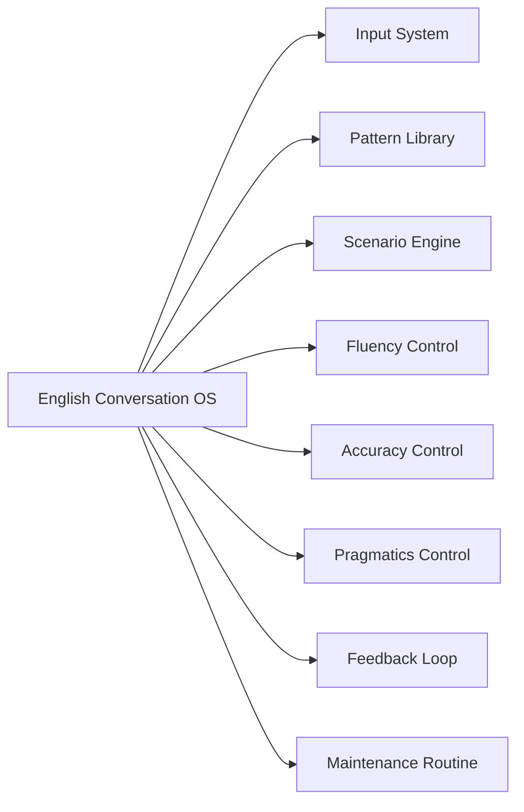
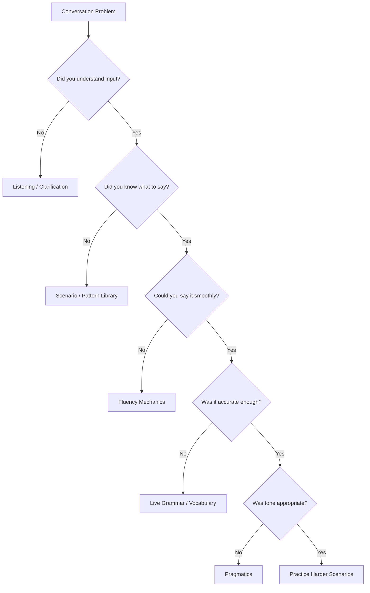
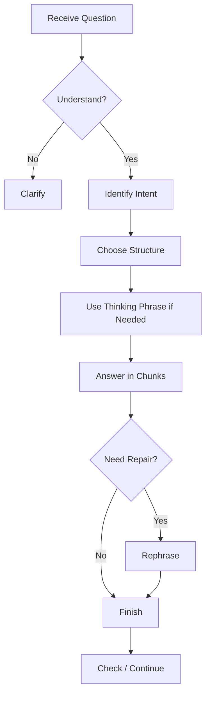
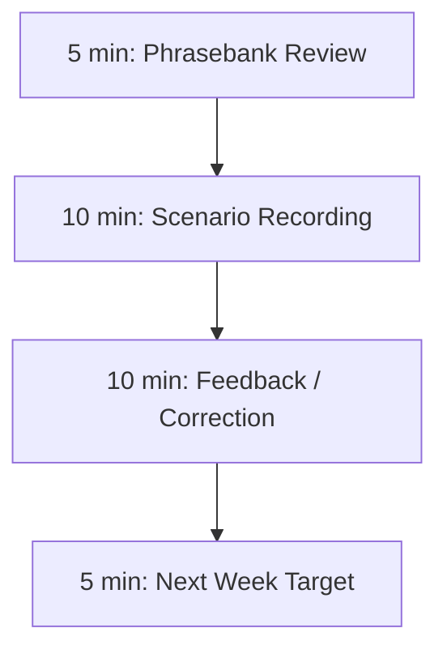
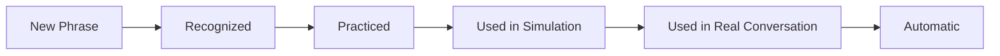
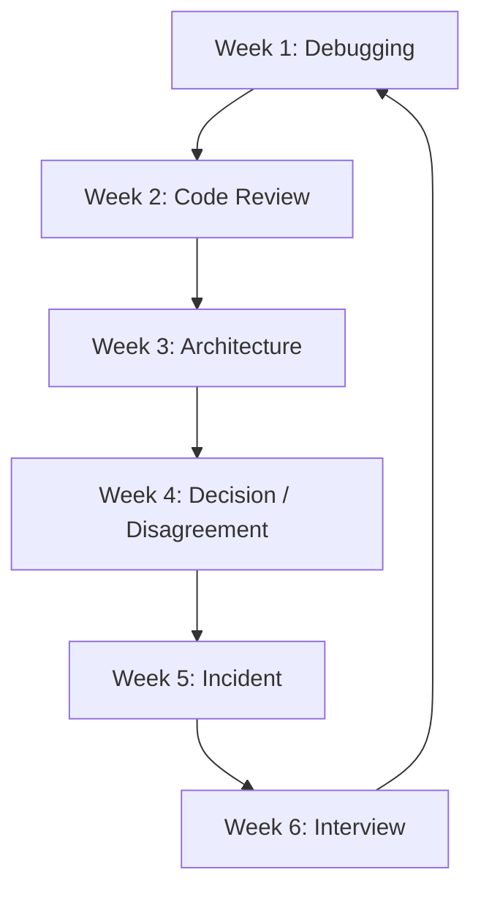
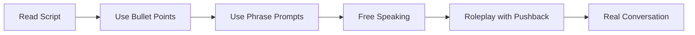

# English for Conversation Part 30 — Final Integration: English Conversation Operating System

> Goal part ini: mengintegrasikan seluruh seri menjadi satu **English Conversation Operating System** yang bisa kamu pakai untuk belajar, praktik, self-correct, dan berkembang jangka panjang.

Ini adalah part terakhir dari seri.

Sampai titik ini, kamu sudah punya:

- skill definition,
- Kaufman learning framework,
- conversation stack,
- sentence patterns,
- listening,
- pronunciation,
- vocabulary chunks,
- questions,
- clarification,
- explanation,
- storytelling,
- work conversation,
- standup,
- debugging,
- code review,
- architecture,
- disagreement,
- decision-making,
- async-to-sync,
- meeting fluency,
- social conversation,
- interview conversation,
- cross-cultural pragmatics,
- fluency mechanics,
- live grammar,
- feedback system,
- 20-hour practice program,
- real-world playbook.

Part ini menyatukan semuanya menjadi sistem operasi pribadi.

---

## 1. Final Mental Model: Conversation as Runtime System

Conversation bukan hanya vocabulary + grammar. Conversation adalah runtime system.



Saat conversation berjalan, kamu melakukan:

1. listening,
2. intent detection,
3. context modelling,
4. response selection,
5. grammar/vocabulary production,
6. pronunciation delivery,
7. feedback interpretation,
8. repair.

Kalau kamu hanya belajar grammar, kamu hanya melatih satu komponen.  
Kalau kamu membangun operating system, kamu melatih seluruh loop.

---

## 2. The English Conversation OS

English Conversation OS terdiri dari 8 subsystem.



| Subsystem | Function |
|---|---|
| Input System | listening, parsing, intent detection |
| Pattern Library | reusable chunks and frames |
| Scenario Engine | work-specific conversation scripts |
| Fluency Control | pauses, fillers, thinking time, repair |
| Accuracy Control | live grammar and meaning-critical correction |
| Pragmatics Control | directness, politeness, cultural fit |
| Feedback Loop | record, review, classify, improve |
| Maintenance Routine | weekly and monthly practice |

The goal is not to know English. The goal is to run this OS under real conditions.

---

## 3. Core Invariants

These are the invariants of effective English conversation.

### 3.1 Clarity Before Complexity

```text
Simple and clear beats complex and broken.
```

Use:

```text
The issue started after deployment.
```

Not:

```text
Due to the occurrence of post-deployment operational abnormality...
```

### 3.2 Meaning Before Grammar Polish

Fix grammar that changes meaning first.

High priority:

```text
We have not tested rollback.
```

Low priority:

```text
a/the small article mistake
```

### 3.3 Structure Before Speed

A slow structured answer is better than a fast messy answer.

```text
There are two parts to this.
First...
Second...
```

### 3.4 Repair Before Pretending

Never fake understanding in technical conversation.

```text
Let me make sure I understood.
```

### 3.5 Risk-Based Directness

Match language strength to risk.

```text
Suggestion for low risk.
Concern for medium risk.
Strong pushback for high risk.
Blocker for critical risk.
```

### 3.6 Feedback Turns Practice Into Improvement

Practice alone is not enough.

```text
Record → Review → Classify → Correct → Repeat
```

---

## 4. Personal Skill Map

Use this map to locate your current bottleneck.



Use diagnosis before practice.

Weak diagnosis:

```text
My English is bad.
```

Strong diagnosis:

```text
I understand the question, but I cannot structure my answer under pressure.
```

or:

```text
My technical meaning is clear, but my pushback sounds too blunt.
```

---

## 5. The Conversation Response Algorithm

When someone asks you a question in English, run this algorithm.



### 5.1 Algorithm in Words

1. Did I understand?
2. What is the real intent?
3. Which pattern fits?
4. Do I need thinking time?
5. Speak in chunks.
6. Repair if needed.
7. Finish with a clear point.

### 5.2 Example

Question:

```text
Should we release this today?
```

Response algorithm:

```text
Intent:
decision/risk

Pattern:
context → risk → recommendation

Answer:
I don’t think we should release today.
The main concern is rollback safety.
We have not tested the migration rollback yet.
If it fails halfway, recovery may be difficult.
My recommendation is to delay until rollback is validated in staging.
```

---

## 6. The Universal Phrase Kernel

These are the highest-leverage phrases from the entire series.

### 6.1 Clarification

```text
Can you clarify what you mean by...?
Let me make sure I understood.
Do you mean...?
Could you rephrase that?
```

### 6.2 Thinking Time

```text
Let me think for a second.
That’s a good question.
Let me structure my answer.
I want to be precise here.
```

### 6.3 Explanation

```text
At a high level...
The main idea is...
The key point is...
The reason is...
```

### 6.4 Debugging

```text
The issue happens when...
What we know so far is...
My current hypothesis is...
We can verify it by...
```

### 6.5 Risk

```text
The main risk is...
The failure mode I’m worried about is...
This could fail if...
We can mitigate that by...
```

### 6.6 Trade-Off

```text
The trade-off is...
This improves..., but it adds...
We gain..., but we lose...
```

### 6.7 Recommendation

```text
Given the constraints, I recommend...
I lean toward...
I strongly recommend...
The next step is...
```

### 6.8 Disagreement

```text
I see the point, but...
My concern is...
I’m not fully convinced that...
A safer alternative would be...
```

### 6.9 Meeting

```text
The goal of this meeting is...
Can I pause us there?
That is related, but separate.
Let me summarize where we landed.
```

### 6.10 Repair

```text
Let me rephrase that.
Actually, let me be more precise.
I used the wrong word.
Let me start again.
```

Memorize these. They are your runtime primitives.

---

## 7. Final Benchmark

Use this benchmark to evaluate the whole series.

### 7.1 Benchmark Structure

Record 6 tasks:

1. daily update,
2. bug/debugging explanation,
3. code review feedback,
4. architecture recommendation,
5. disagreement/decision conversation,
6. meeting summary.

Total time:

```text
20–25 minutes
```

### 7.2 Task 1 — Daily Update

Prompt:

```text
Give a standup update about a task involving retry logic.
```

Required:

```text
Yesterday...
Today...
Blocker...
Next step...
```

### 7.3 Task 2 — Bug Explanation

Prompt:

```text
Login fails only in staging. The token is valid, but user id is missing.
```

Required:

```text
symptom
expected behavior
actual behavior
hypothesis
verification step
```

### 7.4 Task 3 — Code Review Feedback

Prompt:

```text
A PR checks whether a user exists but does not check whether the user is active.
```

Required:

```text
observation
risk
suggestion
test request
```

### 7.5 Task 4 — Architecture Recommendation

Prompt:

```text
Should payment processing be synchronous or asynchronous for the first release?
```

Required:

```text
problem
two options
trade-off
risk
recommendation
```

### 7.6 Task 5 — Disagreement / Decision

Prompt:

```text
Product wants to release today, but rollback is untested.
```

Required:

```text
acknowledge urgency
state concern
explain risk
say no or suggest safer path
ask for alignment
```

### 7.7 Task 6 — Meeting Summary

Prompt:

```text
The team decided limited rollout today, monitor metrics, expand tomorrow if stable.
```

Required:

```text
decision
reason
action items
owner
open question
```

---

## 8. Final Scoring Rubric

Score each 1–5.

| Dimension | 1 | 3 | 5 |
|---|---|---|---|
| Clarity | hard to understand | mostly clear | very clear |
| Structure | rambling | some structure | strong structure |
| Grammar | meaning often unclear | understandable errors | accurate enough |
| Vocabulary | frequent gaps | sufficient | precise |
| Pronunciation | often blocks meaning | mostly intelligible | clear |
| Fluency | frequent freeze | controlled hesitation | smooth with pauses |
| Pragmatics | tone often wrong | mostly appropriate | well-calibrated |
| Interaction | passive | responds | clarifies, summarizes, aligns |
| Technical Precision | vague | acceptable | specific and defensible |

### 8.1 Target

After this series, reasonable target:

```text
Clarity: 4
Structure: 4
Grammar: 3–4
Vocabulary: 3–4
Pronunciation: 3–4
Fluency: 3–4
Pragmatics: 4
Interaction: 4
Technical Precision: 4
```

You do not need all 5s. You need reliable work performance.

---

## 9. The 90-Day Roadmap

The 20-hour program bootstraps the skill. The 90-day roadmap makes it durable.

```mermaid
gantt
    title 90-Day English Conversation Roadmap
    dateFormat  X
    axisFormat Day %s
    section Month 1
    Core Work Conversation     :0, 30
    section Month 2
    Senior Engineering Talk    :30, 60
    section Month 3
    High-Stakes Integration    :60, 90
```



---

# Month 1 — Functional Work Fluency

## Focus

- daily work update,
- clarification,
- debugging,
- small talk,
- meeting basics.

## Weekly Routine

```text
3 recordings/week
1 listening/shadowing session/week
1 roleplay/week
1 real meeting phrase target/week
```

## Target Scenarios

```text
standup
blocker update
bug explanation
diagnostic questions
meeting opening
small talk
```

## Month 1 Success Criteria

You can:

- explain what you are working on,
- ask for clarification,
- describe a bug,
- ask debugging questions,
- survive a meeting without freezing,
- repair misunderstanding.

---

# Month 2 — Senior Engineering Communication

## Focus

- code review,
- architecture,
- trade-offs,
- disagreement,
- decision-making.

## Weekly Routine

```text
2 architecture recordings/week
2 disagreement roleplays/week
1 code review speaking practice/week
1 design decision summary/week
```

## Target Scenarios

```text
review feedback
technical pushback
architecture option comparison
release decision
risk escalation
```

## Month 2 Success Criteria

You can:

- explain trade-offs,
- state assumptions,
- challenge a design,
- push back on risk,
- make a recommendation,
- ask for alignment.

---

# Month 3 — High-Stakes Integration

## Focus

- incidents,
- stakeholder communication,
- interviews,
- cross-cultural pragmatics,
- facilitation.

## Weekly Routine

```text
1 incident simulation/week
1 stakeholder update/week
1 mock interview/week
1 meeting facilitation roleplay/week
```

## Target Scenarios

```text
incident update
release blocker
executive/stakeholder explanation
career conversation
cross-team conflict
meeting facilitation
```

## Month 3 Success Criteria

You can:

- speak under pressure,
- explain risk to non-technical people,
- facilitate decision meetings,
- handle disagreement,
- summarize decisions,
- tell project stories clearly.

---

## 10. Weekly Maintenance Routine

After 90 days, maintain with a lightweight routine.

### 10.1 Minimum Effective Dose

```text
2 recordings per week
1 feedback review per week
1 real-world target phrase per week
1 monthly benchmark
```

### 10.2 30-Minute Weekly Session



### 10.3 Monthly Benchmark

Repeat:

```text
bug explanation
trade-off explanation
disagreement
meeting summary
```

Compare with last month.

---

## 11. Personal Phrasebank System

Your phrasebank should be organized by function, not alphabetically.

```text
phrasebank/
  clarification.md
  debugging.md
  code-review.md
  architecture.md
  disagreement.md
  meeting.md
  interview.md
  social.md
  repair.md
```

### 11.1 Phrase Entry Format

```text
Phrase:
My concern is...

Use when:
Stating a risk clearly.

Example:
My concern is that rollback has not been tested.

Variations:
The risk I see is...
The part that worries me is...
```

### 11.2 Phrase Lifecycle



A phrase is not mastered until you can use it without reading.

---

## 12. Personal Error System

Keep a living error database.

### 12.1 Error Entry

```text
Original:
The bug happen in staging.

Corrected:
The bug happens in staging.

Type:
grammar / simple present

Pattern:
<singular subject> + verb-s

Status:
active
```

### 12.2 Error Status

```text
active: still appears often
practicing: appears sometimes
stable: mostly fixed
```

### 12.3 Weekly Error Review

Ask:

```text
Which error appeared again?
Which error is now stable?
Which error should become a drill?
```

---

## 13. Scenario Rotation System

Rotate scenarios to avoid narrow fluency.



### 13.1 Scenario Rotation Table

| Week | Scenario | Core Skill |
|---|---|---|
| 1 | debugging | hypothesis, evidence |
| 2 | code review | feedback, risk |
| 3 | architecture | trade-off |
| 4 | decision | recommendation |
| 5 | incident | pressure, status |
| 6 | interview | storytelling |

This prevents overfitting to one type of English.

---

## 14. Real Meeting Integration

Practice must eventually enter real life.

### 14.1 Before Meeting

Pick one target phrase.

Examples:

```text
Can I clarify one thing?
My concern is...
The trade-off is...
Let me summarize where we landed.
```

### 14.2 During Meeting

Use it once.

### 14.3 After Meeting

Log:

```text
Phrase used:
Situation:
Result:
Better version:
```

### 14.4 Example

```text
Phrase used:
My concern is...

Situation:
Release meeting.

Result:
The team discussed rollback risk.

Better version:
My concern is that rollback has not been tested in staging yet.
```

Small real usage compounds.

---

## 15. How to Move from Prepared to Spontaneous

Fluency progression:



### 15.1 Script Stage

Read full answer.

### 15.2 Bullet Stage

Use only:

```text
context
risk
recommendation
```

### 15.3 Phrase Stage

Use:

```text
The issue is...
My concern is...
I recommend...
```

### 15.4 Free Stage

Speak without notes.

### 15.5 Pushback Stage

Someone challenges you.

### 15.6 Real Stage

Use in work.

Do not skip stages. Skipping creates freeze.

---

## 16. How to Handle Plateaus

Plateaus are normal.

### 16.1 Plateau Types

| Plateau | Symptom | Fix |
|---|---|---|
| fluency plateau | still hesitating | chunking + filler reduction |
| grammar plateau | repeated errors | error database + drills |
| vocabulary plateau | vague words | phrasebank by scenario |
| pragmatics plateau | tone mismatch | directness calibration |
| listening plateau | missing real speech | shadowing + clarification |
| confidence plateau | avoiding real use | one target phrase per meeting |

### 16.2 Plateau Diagnosis

Ask:

```text
What specifically is not improving?
In which scenario?
Under what pressure?
What evidence do I have?
```

No vague diagnosis.

---

## 17. How to Use AI Long-Term

Use AI as:

- roleplay partner,
- feedback provider,
- phrase generator,
- interviewer,
- meeting simulator,
- pronunciation script source,
- transcript corrector.

### 17.1 Roleplay Prompt

```text
Roleplay as a senior engineer in a design review.
Ask me one question at a time about whether we should move a workflow to async processing.
After each answer, give feedback on clarity, structure, grammar, and pragmatics.
```

### 17.2 Feedback Prompt

```text
Here is my transcript.
Please classify the top issues by:
grammar, vocabulary, structure, fluency, pragmatics.
Then rewrite my answer in natural professional English and extract reusable patterns.
```

### 17.3 Pushback Prompt

```text
Challenge my recommendation politely but firmly.
Make me defend the trade-off.
```

The key is specificity.

---

## 18. How to Use Tutors Long-Term

Use tutors for:

- live correction,
- pronunciation,
- pragmatic nuance,
- roleplay,
- interview simulation.

### 18.1 Tutor Session Structure

```text
5 min: warm-up
10 min: phrase review
20 min: roleplay
15 min: feedback
10 min: repeat corrected version
```

### 18.2 Tutor Instruction

```text
Please do not correct every small grammar mistake.
Focus on clarity, structure, and professional tone.
Correct repeated high-impact errors and help me rephrase them.
```

This prevents over-correction.

---

## 19. What “Top 1% Conversation Skill” Means Practically

For English conversation as a software engineer, top-level performance is not native accent.

It is the ability to:

- clarify ambiguity early,
- explain complex ideas simply,
- ask diagnostic questions,
- state assumptions,
- discuss trade-offs,
- push back on risk,
- summarize decisions,
- communicate incidents calmly,
- adapt tone across cultures,
- and continuously self-correct.

Top performers are not just fluent. They are **operationally clear**.

---

## 20. Final Integrated Dialogue

Below is a realistic integrated conversation.

### Scenario

```text
The team is deciding whether to release a migration-backed permission feature today.
Product wants speed.
Engineering is worried about rollback.
Security is worried about authorization.
```

### Dialogue

```text
Facilitator: Thanks everyone for joining.
The goal of this meeting is to decide whether we release the permission feature today.

PM: From product side, we would like to release today if possible.

Engineer: I understand the urgency.
Before we decide, I want to highlight one risk.

Facilitator: Go ahead.

Engineer: The implementation is complete, but the rollback path has not been tested yet.
The migration touches customer permission data.
If the migration fails halfway, some records may be updated while others remain in the old state.

Security: I also want to confirm the authorization path.
Does the new permission check reject inactive users?

Engineer: Good question.
The current PR checks whether the user exists, but it does not check whether the user is active.
So I think we need one more guard and a regression test before full rollout.

PM: Is there a safer way to still give the customer progress today?

Engineer: I see two options.
Option A is to delay the release until rollback and authorization are fully validated.
Option B is to do a limited rollout behind a feature flag after adding the authorization guard.

The trade-off is speed versus blast radius.
Given the customer pressure, I recommend Option B:
add the guard, validate rollback in staging, then enable one tenant first.

Facilitator: Does anyone see a blocking concern with that direction?

Security: I’m okay with it if the authorization test is added before enabling the tenant.

PM: That works for product.

Facilitator: Let me summarize where we landed.
Decision: limited rollout to one tenant after the authorization guard and rollback validation.
Reason: this gives customer progress while limiting blast radius.
Action items: engineering adds the guard and rollback validation, security reviews the test, product confirms the tenant.
Open question: tomorrow we decide whether to expand to all tenants.
```

This one dialogue uses nearly the whole OS:

- meeting opening,
- urgency acknowledgement,
- risk explanation,
- conditional,
- security clarification,
- code review feedback,
- option comparison,
- trade-off,
- recommendation,
- alignment,
- decision summary.

---

## 21. Final Self-Assessment

Fill this honestly.

```text
I can clearly explain:
[ ] current work
[ ] blocker
[ ] bug
[ ] hypothesis
[ ] code review risk
[ ] architecture trade-off
[ ] decision recommendation
[ ] disagreement
[ ] incident update
[ ] project story

I can handle:
[ ] clarification
[ ] misunderstanding
[ ] interruption
[ ] pushback
[ ] fast speaker
[ ] silence
[ ] meeting summary
[ ] stakeholder question

My strongest area is:
...

My weakest area is:
...

My next 30-day focus is:
...
```

---

## 22. Final Personal Operating Plan

Use this as your ongoing plan.

### Daily Micro-Practice: 10 Minutes

```text
2 min: phrasebank review
5 min: scenario speaking
3 min: correction
```

### Weekly Practice: 60 Minutes

```text
10 min: review previous errors
20 min: scenario recording
15 min: feedback classification
10 min: repeat corrected version
5 min: set next target
```

### Monthly Benchmark: 30 Minutes

Record:

```text
bug explanation
architecture trade-off
disagreement
meeting summary
```

Compare month to month.

---

## 23. Final Anti-Patterns to Avoid

### 23.1 Endless Input

Do not keep consuming courses without speaking.

```text
Input supports output.
Output creates skill.
```

### 23.2 Perfect Grammar Before Conversation

Do not wait.

```text
Speak with simple grammar.
Correct meaning-critical mistakes.
Improve polish over time.
```

### 23.3 Accent Obsession

Target:

```text
intelligibility, rhythm, stress, clarity
```

Not:

```text
native identity
```

### 23.4 No Feedback

Without feedback, practice becomes repetition.

### 23.5 Avoiding Hard Scenarios

Do not only practice small talk.

Practice:

- disagreement,
- incident,
- architecture,
- interview,
- escalation.

These create real flexibility.

---

## 24. Final Checklist of the Series

You have completed the planned 30-part series if you have:

- [x] skill definition,
- [x] learning framework,
- [x] conversation stack,
- [x] sentence patterns,
- [x] survival conversation,
- [x] listening,
- [x] pronunciation,
- [x] vocabulary chunks,
- [x] questions,
- [x] clarification and repair,
- [x] explaining ideas,
- [x] storytelling,
- [x] daily work conversation,
- [x] agile meeting English,
- [x] pair programming/debugging,
- [x] code review,
- [x] architecture discussion,
- [x] disagreement,
- [x] decision-making,
- [x] async-to-sync,
- [x] meeting fluency,
- [x] social conversation,
- [x] interview/career conversation,
- [x] cross-cultural pragmatics,
- [x] fluency mechanics,
- [x] live grammar,
- [x] feedback systems,
- [x] 20-hour practice program,
- [x] real-world playbook,
- [x] final integration OS.

---

## 25. What To Do Immediately After This Part

Do not only read this series. Execute.

### Step 1

Record the final benchmark.

### Step 2

Score yourself.

### Step 3

Choose one bottleneck.

### Step 4

Run the 20-hour program or restart from the hour matching your bottleneck.

### Step 5

Use one target phrase in a real meeting this week.

Recommended first phrase:

```text
Let me make sure I understood.
```

or:

```text
My concern is...
```

These two phrases alone can dramatically improve your technical conversations.

---

## Part 30 Summary

English conversation for software engineers is not a single skill. It is a system.

The final operating model is:

```text
Input → Intent → Context → Pattern → Output → Feedback → Repair → Improvement
```

The final practice model is:

```text
Scenario → Record → Review → Classify → Correct → Repeat → Real Use
```

The final communication model is:

```text
Clear meaning,
structured thought,
calibrated tone,
specific risk,
actionable next step.
```

You do not need perfect English to be effective.  
You need English that can carry engineering reasoning clearly under real conditions.

---

# Series Status

This is the final planned part of the series.

**English for Conversation series completed: 30 of 30 parts.**

---
