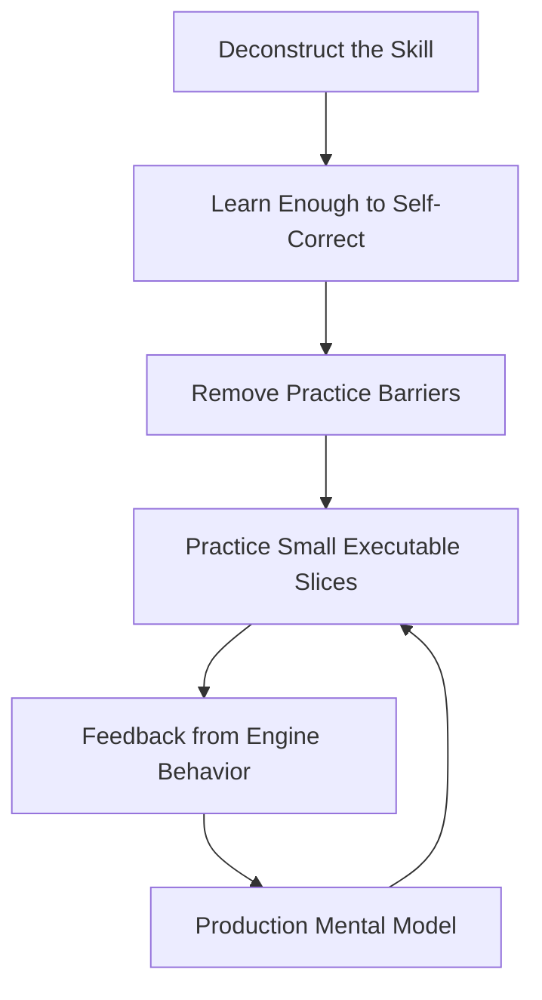
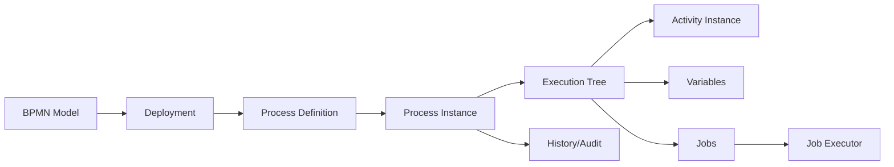
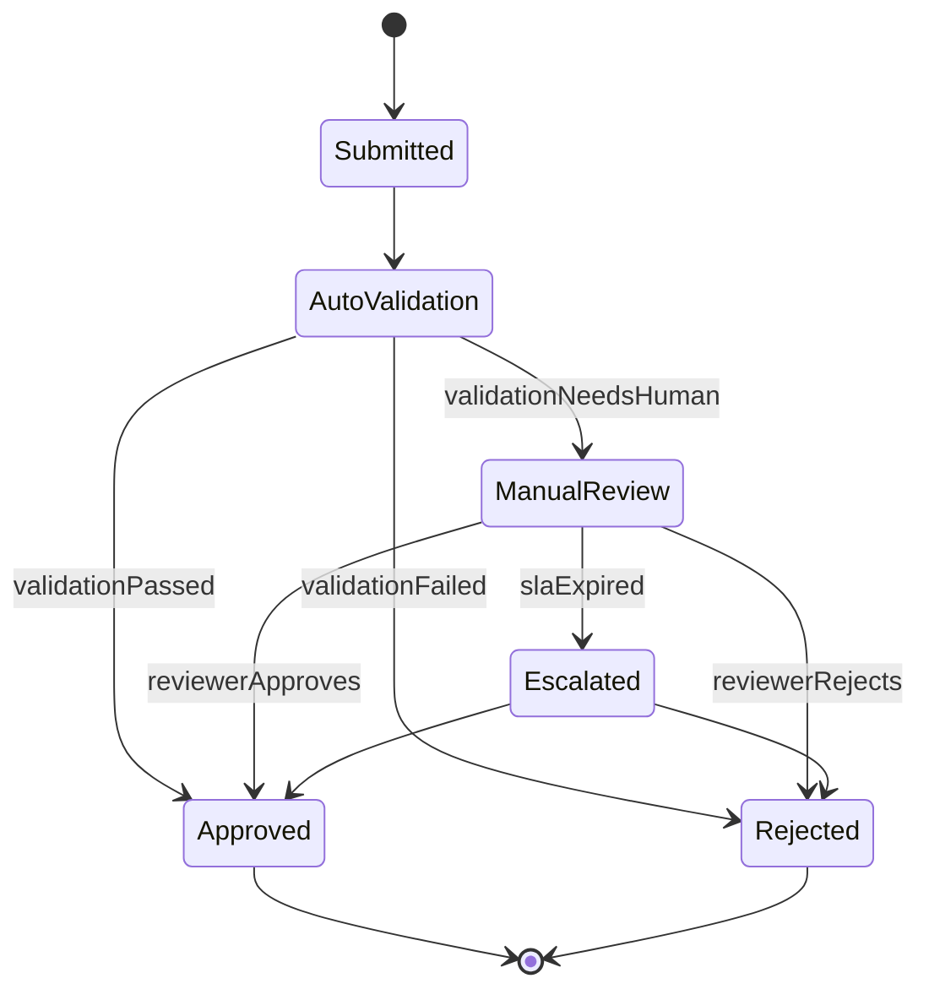
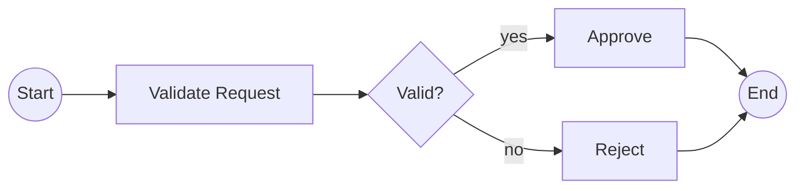
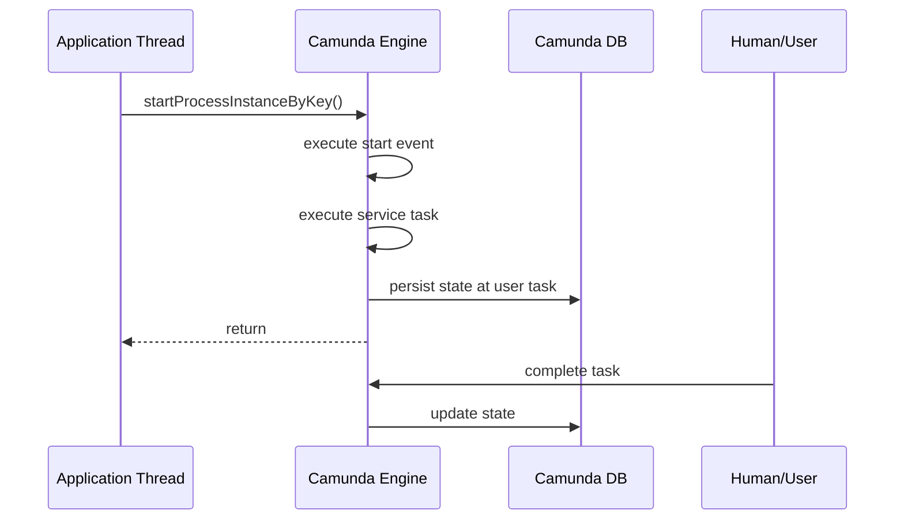
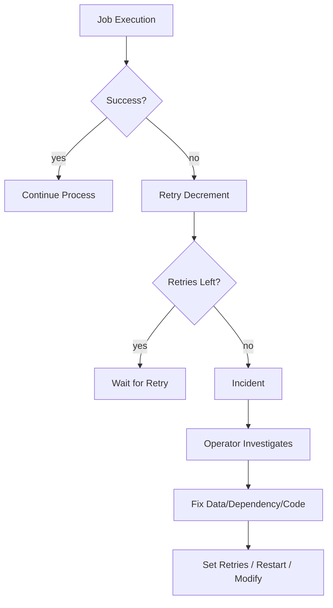
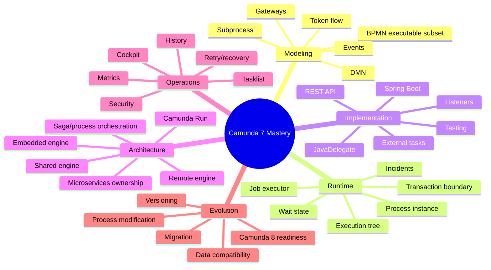
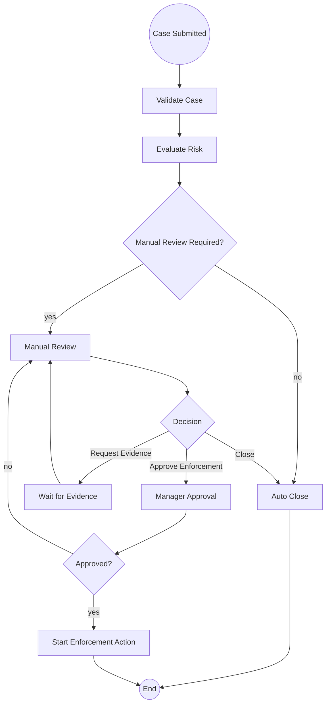
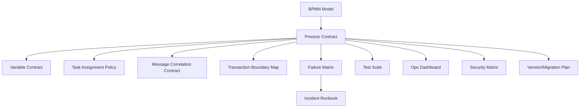

# Part 001 — Kaufman Skill Map: From BPMN Diagram to Executable Process System

> Target part ini bukan membuat Anda "bisa gambar BPMN". Targetnya adalah membangun peta skill agar Anda bisa berpikir seperti engineer yang merancang, menjalankan, menguji, mengoperasikan, dan mempertanggungjawabkan sistem proses berbasis Camunda 7.

Camunda 7 adalah workflow/process engine berbasis Java yang mengeksekusi model BPMN 2.0. Sebagian besar kegagalan implementasi Camunda bukan karena engineer tidak tahu elemen BPMN, tetapi karena mereka salah memahami **runtime model**: token flow, wait state, transaction boundary, variable scope, job executor, incident, dan ownership antara proses, aplikasi domain, database, UI, dan worker.

Seri ini akan memperlakukan Camunda 7 sebagai **distributed state machine platform**, bukan sebagai drawing tool.

---

## 1. Core Question

Pertanyaan utama seri ini:

> Bagaimana membangun solusi workflow berbasis Java + BPMN + Camunda 7 yang benar secara model, aman secara transaksi, dapat dioperasikan di production, dan defensible untuk proses bisnis kompleks?

Jawaban praktisnya menuntut lima kemampuan:

1. **Modeling judgment** — memilih elemen BPMN yang tepat untuk invariant bisnis.
2. **Runtime judgment** — memahami kapan state disimpan, kapan transaksi commit, dan kapan job executor mengambil alih.
3. **Integration judgment** — menentukan apakah logic dijalankan sebagai delegate, external task, REST client, event consumer, atau service domain biasa.
4. **Operational judgment** — mampu membaca incident, failed job, history, metrics, dan memperbaiki process instance tanpa merusak audit.
5. **Evolution judgment** — mendesain proses agar bisa berubah: versioning, migration, compatibility, dan eventual migration ke platform lain bila diperlukan.

---

## 2. Kaufman Framework Applied to Camunda 7

Josh Kaufman dalam *The First 20 Hours* menawarkan pendekatan belajar skill secara cepat melalui deconstruction, practice planning, barrier removal, fast feedback, dan deliberate practice. Untuk Camunda 7, pendekatan ini kita adaptasi menjadi:



Poin penting: Camunda tidak bisa dikuasai hanya dengan membaca dokumentasi atau menggambar model. Anda harus menjalankan proses, mematahkan proses, membuat incident, memeriksa database/history, memperbaiki retry, dan melihat bagaimana engine benar-benar bergerak.

---

## 3. Deconstruct the Skill

Skill besar "Java BPMN with Camunda 7" kita pecah menjadi 12 sub-skill.

| Sub-skill | Pertanyaan yang Harus Bisa Dijawab | Output Kemampuan |
|---|---|---|
| BPMN executable modeling | Elemen BPMN mana yang benar untuk behavior ini? | Model proses kecil, jelas, dan executable |
| Token-flow reasoning | Token sekarang ada di mana dan mengapa? | Debug process path tanpa menebak |
| Wait-state reasoning | Kapan state process instance tersimpan? | Tidak salah menaruh transaction boundary |
| Transaction design | Side effect mana yang aman dalam transaksi yang sama? | Delegate tidak menyebabkan inconsistent external side effect |
| Job executor reasoning | Kapan pekerjaan menjadi job dan siapa yang mengeksekusinya? | Async, timer, retry, dan incident bisa dikendalikan |
| Variable design | Data apa yang layak menjadi process variable? | Process data contract stabil dan minim coupling |
| Delegation code | Kode Java mana yang pantas berada di delegate/listener? | Thin delegate, domain service jelas |
| External task design | Kapan worker pull-based lebih cocok daripada embedded delegate? | Isolasi service dan scaling lebih baik |
| Human workflow design | Bagaimana assignment, claim, SLA, dan escalation dibuat defensible? | User task audit-friendly |
| Error/recovery design | Failure ini retry, compensate, BPMN error, atau incident? | Runbook recovery jelas |
| Version/migration design | Bagaimana perubahan model memengaruhi instance berjalan? | Deployment tidak merusak running cases |
| Operations/security | Siapa boleh melihat, mengubah, retry, suspend, atau migrate instance? | Production governance |

Mental model engineer senior muncul saat semua sub-skill ini saling terhubung.

---

## 4. The Real Object of Learning: Runtime Behavior

Banyak engineer memulai dari XML BPMN. Itu wajar, tapi tidak cukup.

Yang harus dikuasai adalah hubungan ini:



Penjelasan singkat:

- **BPMN model** adalah file desain.
- **Deployment** menyimpan model ke repository engine.
- **Process definition** adalah versi executable dari model.
- **Process instance** adalah satu eksekusi nyata dari process definition.
- **Execution tree** adalah struktur runtime token dan scope internal.
- **Activity instance** adalah representasi aktivitas yang berjalan/selesai untuk observability.
- **Variables** adalah state data yang melekat ke scope.
- **Jobs** adalah pekerjaan asynchronous/timer yang akan diambil job executor.
- **History** adalah jejak audit/operasional dari eksekusi.

Jika Anda hanya melihat diagram, Anda akan mendesain flow. Jika Anda melihat runtime graph, Anda akan mendesain sistem.

---

## 5. Camunda 7 as a Passive Engine

Salah satu mental model terpenting: Camunda 7 process engine pada dasarnya adalah library Java yang dieksekusi oleh thread pemanggil, sampai engine mencapai wait state atau async boundary.

Misalnya:

```java
runtimeService.startProcessInstanceByKey("caseReview", businessKey, variables);
```

Panggilan ini dapat mengeksekusi beberapa activity secara sinkron dalam thread yang sama sebelum method return. Jika flow melewati start event, service task, gateway, service task lain, lalu baru user task, maka semua langkah sebelum user task dapat terjadi dalam satu command/transaction.

Konsekuensi praktis:

- Service task sinkron bukan otomatis background job.
- Delegate Java dapat berjalan dalam transaksi engine.
- Exception di delegate dapat rollback state engine.
- Wait state menyimpan state ke database.
- Async continuation membuat job dan memindahkan eksekusi berikutnya ke job executor.

Ini membedakan Camunda 7 dari message broker, cron scheduler, dan task queue biasa.

---

## 6. First Mental Model: Process State Machine

Camunda process instance bisa dipahami sebagai state machine yang state-nya tidak hanya satu enum, tetapi kombinasi dari:

- current activity/activity instances;
- execution tree;
- process variables;
- jobs/timers yang menunggu;
- incidents;
- task assignments;
- versioned process definition;
- historical trace.

Untuk software engineer, BPMN adalah visual syntax untuk state machine dengan concurrency, wait state, event handling, dan human interaction.



BPMN equivalent-nya bukan sekadar menggambar state. BPMN harus menjawab:

- aktivitas mana yang otomatis;
- aktivitas mana yang human task;
- event apa yang bisa terjadi sambil menunggu;
- siapa yang punya otoritas menyelesaikan task;
- data apa yang dibutuhkan di setiap step;
- failure mana yang boleh retry;
- escalation mana yang harus tercatat;
- instance lama harus apa saat definisi proses berubah.

---

## 7. Second Mental Model: Token Flow

Token adalah abstraksi untuk "jalur eksekusi" dalam proses. Saat token masuk ke activity, activity itu dieksekusi. Saat activity selesai, token bergerak lewat sequence flow.

Contoh sederhana:



Pertanyaan runtime:

- Setelah start, token masuk ke `Validate Request`.
- Gateway memilih salah satu outgoing flow.
- Hanya satu cabang aktif jika exclusive gateway.
- Instance selesai ketika semua token mencapai end state atau terminasi.

Kesalahan umum: menganggap gateway sebagai tempat mengeksekusi business logic besar. Gateway seharusnya mengevaluasi kondisi yang sudah jelas, bukan menjadi tempat menyembunyikan proses berpikir bisnis yang kompleks.

---

## 8. Third Mental Model: Wait State

Wait state adalah titik ketika engine harus berhenti dan menunggu trigger eksternal atau waktu.

Contoh wait state:

- user task menunggu manusia;
- receive task menunggu message;
- intermediate catch event menunggu event;
- timer event menunggu waktu;
- external task menunggu worker menyelesaikan pekerjaan;
- async continuation menunggu job executor.



Why it matters:

- Sebelum wait state, proses bisa berjalan sinkron.
- Saat wait state tercapai, state harus tersimpan.
- Jika exception terjadi sebelum commit, perubahan engine bisa rollback.
- External side effect yang sudah terjadi di luar database engine tidak otomatis rollback.

Inilah sumber banyak bug production: proses rollback, tetapi HTTP call ke sistem eksternal sudah sukses.

---

## 9. Fourth Mental Model: Transaction Boundary

Camunda 7 mengeksekusi proses dari satu persisted state ke persisted state berikutnya dalam transaksi database. Anda bisa mengontrol boundary tambahan dengan `camunda:asyncBefore="true"` atau `camunda:asyncAfter="true"`.

Contoh:

```xml
<bpmn:serviceTask id="chargeCustomer" name="Charge Customer" camunda:asyncBefore="true" camunda:delegateExpression="${chargeCustomerDelegate}" />
```

Dengan `asyncBefore`, engine membuat job sebelum activity dijalankan. Artinya:

- state sebelum `chargeCustomer` dipersist;
- eksekusi activity dilakukan oleh job executor;
- jika delegate gagal, failed job/retry/incident dapat terbentuk;
- thread caller tidak menanggung seluruh eksekusi activity.

Rules of thumb:

| Situasi | Boundary yang Biasanya Dibutuhkan |
|---|---|
| Memanggil service eksternal non-idempotent | async before + idempotency key |
| Activity mahal/lama | async before atau external task |
| Perlu menyimpan state sebelum branch risiko tinggi | async before |
| Ingin commit hasil activity sebelum lanjut | async after |
| User task | sudah wait state alami |
| External task | sudah wait state alami |

Jangan menambahkan async secara membabi buta. Async menambah job, retry semantics, load ke job executor, dan kompleksitas operasi.

---

## 10. Fifth Mental Model: Process Variables Are Contracts

Process variable sering disalahgunakan sebagai map global untuk semua data. Untuk sistem serius, variable harus dianggap sebagai contract.

Variable yang baik:

- punya nama stabil;
- punya tipe jelas;
- punya owner;
- kecil dan relevan untuk routing/process decision;
- tidak menyimpan data sensitif yang tidak dibutuhkan;
- tidak menyimpan object Java domain besar yang sulit dievolusi;
- bisa dibaca dari history tanpa membocorkan rahasia.

Contoh buruk:

```java
execution.setVariable("case", entireCaseAggregate);
```

Masalah:

- serialization coupling ke class Java;
- class evolution risk;
- history data bloat;
- sulit masking;
- sulit migrasi;
- delegate lain tergoda mengubah aggregate sembarangan.

Contoh lebih baik:

```java
execution.setVariable("caseId", caseId);
execution.setVariable("riskScore", riskScore);
execution.setVariable("requiresManualReview", requiresManualReview);
execution.setVariable("reviewDeadline", reviewDeadline.toString());
```

Lalu data lengkap dibaca dari domain service/read model berdasarkan `caseId`.

---

## 11. Sixth Mental Model: Incidents Are Not Failures to Hide

Incident adalah sinyal bahwa process execution tidak bisa lanjut tanpa intervensi atau recovery. Dalam production-grade workflow, incident adalah bagian dari desain operasional.



Anti-pattern:

```java
try {
    paymentClient.charge(command);
} catch (Exception e) {
    log.warn("Payment failed, continuing anyway", e);
}
```

Ini membuat process instance terlihat sukses padahal business operation gagal. Untuk regulated workflow, ini berbahaya karena audit trail menjadi menyesatkan.

---

## 12. Seventh Mental Model: BPMN Is a Boundary Language

BPMN idealnya menunjukkan boundary antara:

- automated work;
- human work;
- decision/rule evaluation;
- waiting for external event;
- timeout/escalation;
- compensation/cancel path;
- operationally recoverable failure.

BPMN tidak ideal untuk:

- detail algoritma kecil;
- transformasi data kompleks;
- procedural code panjang;
- UI navigation;
- semua micro-step domain internal;
- logic yang lebih cocok sebagai code atau DMN.

Kriteria sederhana:

> Jika stakeholder bisnis, operator, auditor, atau engineer on-call perlu melihatnya sebagai state/process boundary, modelkan di BPMN. Jika hanya detail teknis internal, letakkan di code/domain service.

---

## 13. Skill Map by Production Responsibility

Untuk mencapai level senior/top engineer, belajarnya harus mengikuti responsibility nyata, bukan urutan menu dokumentasi.



---

## 14. What You Should Already Know

Seri ini tidak akan mengulang materi yang sudah Anda pelajari di seri sebelumnya. Kita anggap Anda sudah nyaman dengan:

- Java language fundamentals;
- Spring Boot basics;
- dependency injection;
- SQL/JDBC and transactions;
- concurrency fundamentals;
- data modeling;
- REST integration;
- testing fundamentals;
- common design patterns;
- error handling and logging.

Yang akan dibahas hanya ketika relevan langsung dengan Camunda runtime behavior.

---

## 15. What to Ignore at the Beginning

Untuk 20 jam pertama, jangan terlalu cepat masuk ke:

- custom parse listener;
- custom command interceptor;
- custom history event handler;
- custom engine plugin;
- direct database optimization;
- multi-tenant authorization matrix;
- process migration scripting;
- advanced Cockpit plugin;
- Optimize analytics;
- CMMN.

Bukan karena tidak penting, tetapi karena akan mengganggu pembentukan mental model dasar. Kuasai dulu runtime flow, transaction, job, variable, dan incident.

---

## 16. The First 20 Hours Plan

### Hour 0–2: Install and Run One Process

Goal:

- menjalankan Camunda 7 secara lokal;
- deploy satu BPMN;
- start process instance;
- complete user task;
- lihat history.

Minimal output:

- satu Spring Boot app dengan embedded Camunda engine atau Camunda Run;
- satu process `helloApproval`;
- satu user task;
- satu service task delegate.

### Hour 2–4: Understand Token and Gateway

Goal:

- buat XOR gateway;
- buat parallel gateway;
- lihat perbedaan runtime path;
- tambahkan variable untuk routing.

Minimal output:

- test yang membuktikan path approved/rejected;
- test yang membuktikan parallel branches berjalan.

### Hour 4–6: Understand Wait State and Transaction

Goal:

- service task sinkron;
- user task wait state;
- async before service task;
- observe failed job.

Minimal output:

- delegate yang sengaja throw exception;
- incident/failed job terlihat;
- retry bisa diubah.

### Hour 6–8: Variables and Data Contract

Goal:

- primitive variable;
- JSON variable;
- local variable;
- task variable;
- inspect variable di runtime/history.

Minimal output:

- variable contract table;
- test variable visibility.

### Hour 8–10: Message and Timer

Goal:

- intermediate message catch;
- correlate message by business key;
- timer boundary event untuk SLA.

Minimal output:

- process menunggu message;
- message correlation test;
- timer test.

### Hour 10–12: Human Workflow

Goal:

- assignment;
- candidate group;
- claim;
- complete;
- escalation timer.

Minimal output:

- task lifecycle test;
- assignment rules documented.

### Hour 12–14: External Task

Goal:

- model service task as external;
- worker fetch-and-lock;
- complete/failure/BPMN error.

Minimal output:

- one worker;
- retry behavior;
- lock-duration experiment.

### Hour 14–16: Error and Incident Recovery

Goal:

- distinguish exception, BPMN error, failed job, incident;
- build recovery runbook.

Minimal output:

- one technical incident;
- one modeled business error;
- documented recovery step.

### Hour 16–18: Testing Discipline

Goal:

- process path tests;
- delegate unit tests;
- integration tests with real DB where needed.

Minimal output:

- happy path;
- rejection path;
- timer path;
- failure path.

### Hour 18–20: Production Design Review

Goal:

- review one realistic process as architecture artifact.

Minimal output:

- BPMN model;
- variable contract;
- transaction boundary map;
- failure matrix;
- ownership map;
- operational runbook.

---

## 17. Practice Project: Regulatory Case Review

Seri ini akan memakai contoh konsisten: **Regulatory Case Review**.

Domain ringkas:

- case dibuat dari report/investigation trigger;
- sistem melakukan validation dan risk scoring;
- low-risk case bisa auto-close;
- medium/high-risk case masuk manual review;
- reviewer bisa request evidence;
- evidence response bisa datang async;
- SLA timer dapat escalate ke supervisor;
- final decision harus maker-checker;
- semua action harus audit-friendly.

High-level process:



Kita akan memperkaya proses ini bertahap dengan:

- BPMN executable;
- Java delegates;
- DMN risk rules;
- timer SLA;
- external task worker;
- message correlation;
- incidents;
- migration/versioning;
- audit/security;
- observability.

---

## 18. Learning Invariants

Selama seri ini, gunakan invariant berikut sebagai alat berpikir.

### Invariant 1 — Every Process Step Must Have an Owner

Tidak boleh ada activity yang tidak jelas siapa pemiliknya.

| Activity Type | Owner yang Harus Jelas |
|---|---|
| Service task delegate | application/domain team |
| External task | worker/service team |
| User task | role/group/user policy |
| Message catch | publishing system/integration adapter |
| Timer | process owner/SLA policy |
| DMN decision | business rule owner |

### Invariant 2 — Every Wait State Must Have a Wake-Up Mechanism

Jika proses menunggu, harus jelas apa yang membangunkannya.

| Wait State | Wake-Up |
|---|---|
| User task | task completion |
| Receive/message catch | message correlation |
| Timer | due date acquired by job executor |
| External task | worker completion |
| Incident | operator recovery |

### Invariant 3 — Every Side Effect Must Be Idempotent or Guarded

Side effect eksternal dapat terjadi lebih dari sekali karena retry, crash, timeout, atau manual recovery.

Maka setiap side effect butuh:

- idempotency key;
- correlation id;
- external operation status check;
- retry classification;
- audit log.

### Invariant 4 — Every Variable Must Have a Reason to Exist

Variable bukan cache serbaguna.

Variable layak ada jika digunakan untuk:

- routing process;
- task assignment;
- timer/due date;
- correlation;
- business audit;
- payload minimum untuk worker;
- UI/task display yang memang perlu.

### Invariant 5 — Every Failure Must Have a Recovery Path

Recovery path bisa berupa:

- retry otomatis;
- incident dan manual retry;
- BPMN error path;
- escalation to human;
- compensation;
- cancellation;
- process modification;
- restart.

Jika tidak ada recovery path, desain belum production-grade.

---

## 19. Minimal Vocabulary

| Term | Meaning |
|---|---|
| Process definition | Versi executable dari BPMN yang sudah dideploy |
| Process instance | Satu eksekusi nyata dari process definition |
| Business key | Identifier bisnis untuk instance, misalnya `caseId` |
| Execution | Runtime entity yang merepresentasikan path/scope token |
| Activity instance | Representasi aktivitas runtime/historic untuk observability |
| Variable scope | Scope tempat variable disimpan dan diwariskan |
| Wait state | Titik proses berhenti dan state dipersist |
| Async continuation | Boundary yang membuat job untuk melanjutkan eksekusi |
| Job | Work item internal untuk timer/async execution |
| Job executor | Komponen yang mengambil dan menjalankan job |
| Incident | Kondisi gagal yang membutuhkan recovery/intervensi |
| Delegate | Kode Java yang dipanggil oleh engine |
| External task | Work item yang dipoll worker dari luar engine |
| Message correlation | Mencocokkan event/message eksternal ke waiting process instance |
| Deployment | Penyimpanan BPMN/DMN/resources ke repository engine |
| History | Data audit dan trace proses yang sudah terjadi |

---

## 20. Common Early Misconceptions

### Misconception 1 — "BPMN adalah dokumentasi proses"

Untuk Camunda, BPMN adalah executable contract. Diagram yang terlihat benar tetapi runtime-nya ambigu tetap berbahaya.

### Misconception 2 — "Service task selalu async"

Tidak. Service task Java delegate biasanya sinkron kecuali diberi async boundary atau dibuat external task.

### Misconception 3 — "BPMN error untuk semua exception"

BPMN error cocok untuk business error yang dimodelkan. Technical exception biasanya lebih cocok menjadi failed job/incident/retry.

### Misconception 4 — "Business key otomatis unique"

Business key adalah konsep penting, tetapi uniqueness strategy harus didesain dan divalidasi oleh aplikasi/proses.

### Misconception 5 — "Parallel gateway mempercepat proses"

Parallel gateway membuat token paralel secara model. Performa aktual tergantung transaction boundary, async job, executor, thread, dan external dependencies.

### Misconception 6 — "Camunda DB boleh jadi reporting database bisnis"

Camunda DB adalah persistence engine. Untuk business reporting serius, gunakan read model/projection sendiri.

---

## 21. Diagnostic Questions for Any Camunda Design

Sebelum menerima sebuah BPMN model, tanyakan:

1. Apa process owner-nya?
2. Apa business key-nya?
3. Apa invariant bisnis yang dijaga proses ini?
4. Activity mana yang wait state?
5. Activity mana yang transaction boundary?
6. Side effect mana yang bisa terjadi dua kali?
7. Failure mana yang harus retry?
8. Failure mana yang harus menjadi BPMN path?
9. Siapa yang menangani incident?
10. Variable mana yang sensitif?
11. Bagaimana instance lama diperlakukan saat versi baru deploy?
12. Apa query operasional yang harus cepat?
13. Apa audit evidence yang harus tersedia?
14. Siapa yang boleh complete task, retry job, modify instance, atau suspend process?
15. Bagaimana proses ini dimigrasikan jika Camunda 7 harus ditinggalkan?

Pertanyaan-pertanyaan ini lebih bernilai daripada sekadar checklist syntax BPMN.

---

## 22. Practice Setup Recommendation

Untuk latihan, gunakan dua mode:

### Mode A — Fast Learning Mode

Gunakan Spring Boot embedded engine.

Kelebihan:

- cepat setup;
- mudah debug delegate;
- mudah test;
- cocok untuk memahami engine behavior.

Kekurangan:

- bisa membuat Anda terlalu nyaman mencampur engine, business app, dan process ownership.

### Mode B — Production Thinking Mode

Gunakan Camunda Run atau remote engine + worker/app terpisah.

Kelebihan:

- ownership lebih jelas;
- lebih dekat ke operating model production;
- lebih mudah memahami external task/REST boundary.

Kekurangan:

- setup sedikit lebih panjang;
- debugging tidak sesederhana embedded.

Untuk seri ini, kita akan mulai dari model mental dan embedded app untuk feedback cepat, lalu naik ke remote/production architecture.

---

## 23. What Good Looks Like

Sebuah solusi Camunda 7 yang matang biasanya punya artefak berikut:



Jika hanya ada BPMN diagram dan Java delegate, desainnya belum cukup.

---

## 24. Example: Tiny Process Contract

Process: `caseReview`

| Field | Value |
|---|---|
| Business key | `caseId` |
| Start trigger | REST command `SubmitCase` |
| Main owner | Case Management Platform team |
| Human owner | `case-reviewer`, `case-supervisor` |
| Primary SLA | manual review within 2 business days |
| Critical variables | `caseId`, `riskScore`, `manualReviewRequired`, `reviewDeadline` |
| External systems | Risk scoring service, Evidence service, Notification service |
| Failure policy | technical failures become incidents after retry exhaustion |
| Audit policy | all user task completion and decision variables retained |
| Versioning policy | no breaking variable rename without migration plan |

Ini terlihat administratif, tetapi inilah yang membedakan workflow prototype dari production workflow platform.

---

## 25. Self-Correction Rubric

Gunakan rubric ini setiap selesai membuat model/proses.

| Level | Signal |
|---|---|
| 1 — Toy | Proses bisa jalan happy path, tapi failure tidak jelas |
| 2 — Basic | Ada branch, user task, dan service task, tapi transaction/variable belum jelas |
| 3 — Useful | Ada tests, variable contract, dan failure path utama |
| 4 — Production-aware | Ada async boundary, idempotency, incident runbook, dan security consideration |
| 5 — Production-grade | Ada observability, audit, migration/versioning strategy, capacity and recovery plan |

Target akhir seri: minimal level 4 untuk semua design, dan level 5 untuk capstone.

---

## 26. Anti-Pattern Preview

Kita akan membahas detailnya di part khusus, tetapi sejak awal Anda harus mengenali smell berikut:

| Anti-pattern | Smell | Consequence |
|---|---|---|
| God process | satu BPMN berisi semua variasi bisnis | sulit dibaca, sulit diubah, sulit migrasi |
| God delegate | satu delegate melakukan validasi, transformasi, HTTP, DB, routing | transaction risk, testing buruk |
| Variable dump | semua object domain dimasukkan ke process variable | serialization, security, history bloat |
| Sync remote call everywhere | semua service task memanggil HTTP sinkron tanpa async | rollback/side-effect inconsistency |
| Misused signal | signal dipakai untuk targeted event | instance yang salah bisa ter-trigger |
| Hidden business rule | gateway condition berisi logic kompleks | tidak audit-friendly |
| SQL surgery | operator update Camunda DB langsung | corruption risk |
| No business key | instance tidak bisa dicari/correlate dengan aman | ops dan support buruk |
| No recovery design | incident dianggap exception langka | production outage lebih lama |
| Model equals UI | BPMN mengikuti screen flow | process coupling ke frontend |

---

## 27. Exercises

### Exercise 1 — Vocabulary Drill

Ambil satu process sederhana dan identifikasi:

- process definition;
- process instance;
- business key;
- wait state;
- variable;
- task;
- job;
- possible incident.

### Exercise 2 — Boundary Map

Untuk process `caseReview`, tandai:

- activity mana yang sync;
- activity mana yang async;
- activity mana yang wait state alami;
- side effect mana yang butuh idempotency.

### Exercise 3 — Failure Classification

Klasifikasikan failure berikut:

| Failure | Classification |
|---|---|
| Risk scoring service timeout | technical failure; retry/incident |
| Case not eligible for enforcement | business outcome; BPMN path/DMN result |
| Reviewer lacks permission | authorization/user-task failure |
| Evidence message arrives twice | duplicate event; idempotent correlation handling |
| Payment/enforcement command already sent but delegate retried | idempotency problem |

### Exercise 4 — Diagram Critique

Ambil BPMN model lama di organisasi Anda. Tanyakan:

- apakah business key jelas?
- apakah wait state jelas?
- apakah failure path terlihat?
- apakah variable contract ada?
- apakah model terlalu UI-driven?
- apakah migration strategy ada?

---

## 28. Part 001 Summary

Anda sekarang punya peta belajar:

- Camunda 7 harus dipahami sebagai runtime process engine, bukan drawing tool.
- BPMN executable adalah state machine visual dengan token, wait state, event, dan human task.
- Runtime behavior lebih penting daripada hafalan elemen BPMN.
- Skill Camunda terbagi menjadi modeling, runtime, implementation, architecture, operations, dan evolution.
- First 20 hours harus fokus pada feedback cepat dari engine: deploy, run, fail, inspect, recover.
- Production-grade Camunda design memerlukan process contract, variable contract, transaction map, failure matrix, runbook, security, dan migration plan.

Di part berikutnya kita akan masuk ke realitas platform: Camunda 7 versioning, lifecycle/EOL, CE vs EE, architecture choice, dan strategi agar investasi Camunda 7 tidak menjadi technical debt yang buntu.

---

## References

- Camunda 7 Process Engine Concepts: https://docs.camunda.org/manual/7.24/user-guide/process-engine/process-engine-concepts/
- Camunda 7 Transactions in Processes: https://docs.camunda.org/manual/7.24/user-guide/process-engine/transactions-in-processes/
- Camunda 7 Process Engine API: https://docs.camunda.org/manual/7.24/user-guide/process-engine/process-engine-api/
- Camunda 7 BPMN 2.0 Reference: https://docs.camunda.org/manual/7.24/reference/bpmn20/
- Camunda 7 External Tasks: https://docs.camunda.org/manual/7.24/user-guide/process-engine/external-tasks/
- Camunda migration strategy update, 2025: https://camunda.com/blog/2025/02/migrating-solutions-camunda-7-camunda-8-strategy-update/
