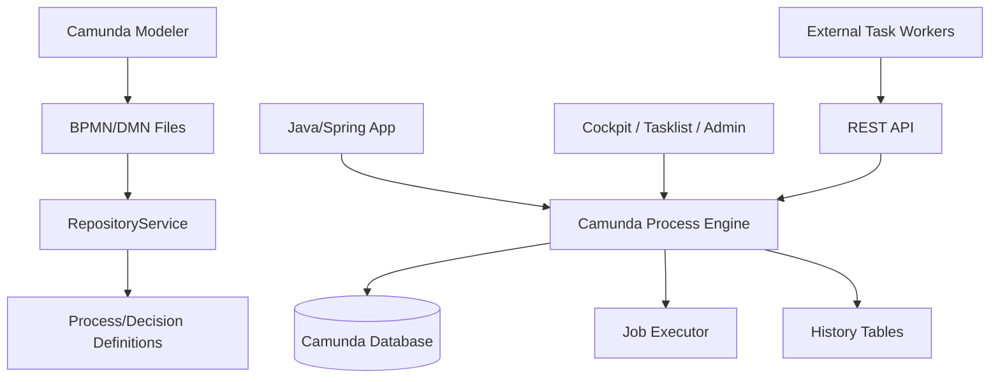
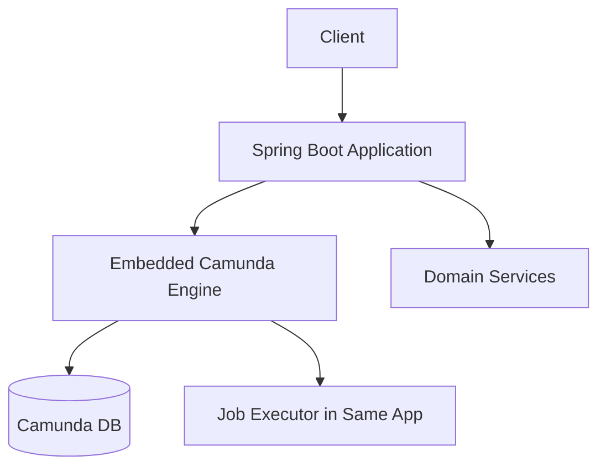
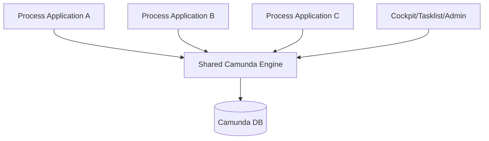
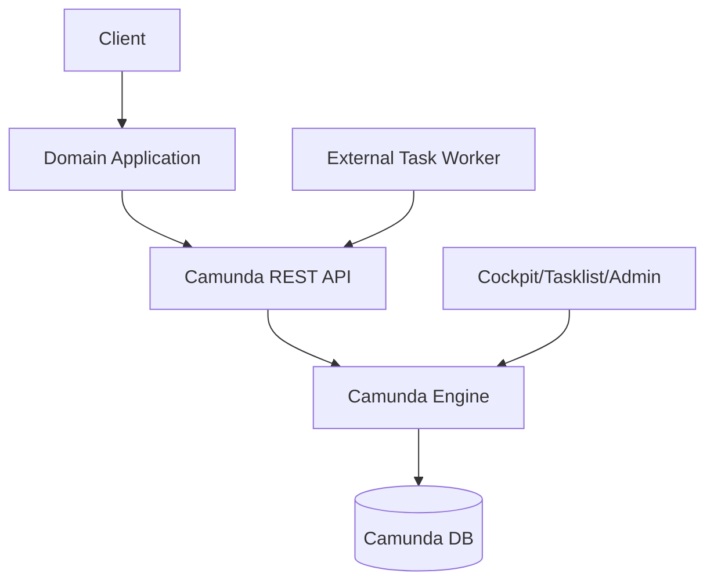
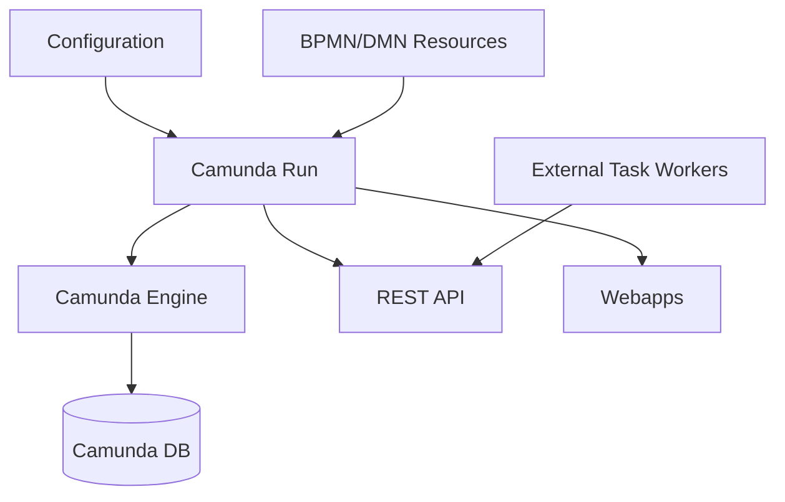
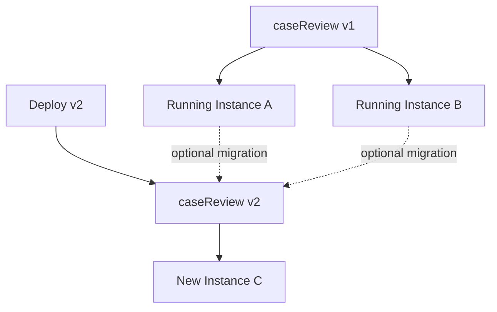
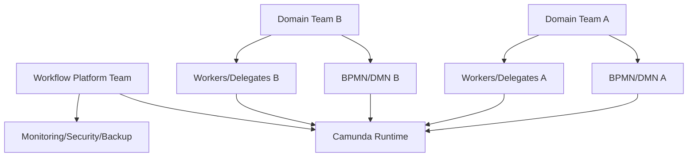
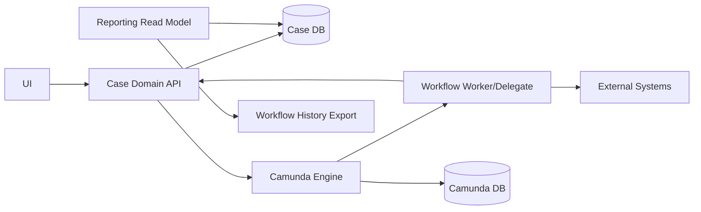
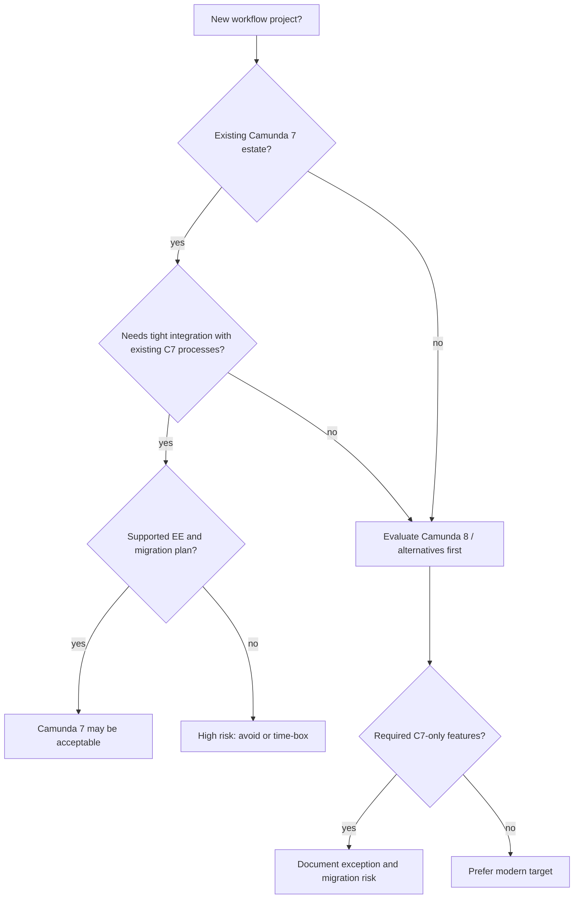
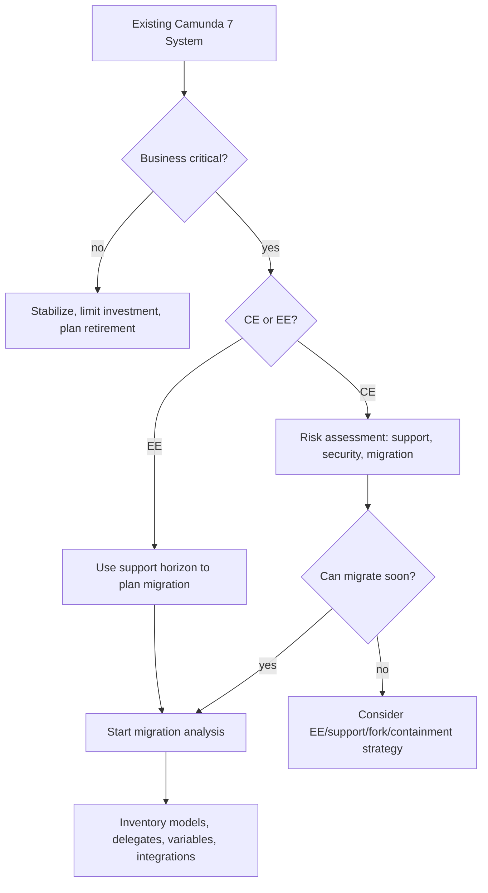

# Part 002 — Camunda 7 Platform Reality: Version, Lifecycle, Architecture Choices

> Target part ini adalah membuat Anda tidak naif terhadap Camunda 7 sebagai platform. Sebelum menulis delegate atau menggambar BPMN, engineer senior harus tahu status platform, pilihan deployment, konsekuensi lifecycle, support model, dan strategi menghindari dead-end architecture.

Camunda 7 masih banyak dipakai di enterprise karena mature, Java-native, relational-database-backed, dan punya model operasi yang sudah dipahami banyak tim. Namun pada 2026, Camunda 7 juga harus dilihat sebagai platform legacy-modern: masih dapat bernilai untuk sistem existing, tetapi keputusan baru harus migration-aware.

---

## 1. Core Question

Pertanyaan utama part ini:

> Kapan Camunda 7 masih layak dipakai, bagaimana memilih architecture style yang benar, dan bagaimana mendesain agar sistem tidak terkunci pada asumsi platform yang salah?

Jawabannya tidak cukup dengan "pakai versi terbaru". Anda harus menentukan:

- Community Edition atau Enterprise Edition;
- embedded, shared, remote, atau Camunda Run;
- ownership process engine;
- upgrade path;
- support horizon;
- security/compliance posture;
- migration path ke Camunda 8 atau alternatif bila dibutuhkan;
- batas antara workflow platform dan domain system.

---

## 2. Naming Reality: Camunda BPM, Camunda Platform 7, Camunda 7

Anda akan menemukan beberapa istilah:

| Name | Meaning Praktis |
|---|---|
| Camunda BPM | Nama historis platform Camunda 7 generasi lama |
| Camunda Platform 7 | Nama resmi modern untuk platform Camunda 7 |
| Camunda 7 | Penyebutan ringkas untuk engine/platform generasi 7 |
| Camunda 8 | Platform baru/rearchitected berbasis Zeebe dan arsitektur berbeda |
| Camunda Run | Distribusi runnable untuk menjalankan Camunda 7 tanpa application server tradisional |

Dalam seri ini, **Camunda 7** berarti Camunda Platform 7 / Camunda BPM Platform version <= 7.24.

---

## 3. Lifecycle Reality in 2026

Status penting:

- Dokumentasi Camunda 7 terbaru mengarah ke versi **7.24**.
- Camunda menyatakan Camunda 7 Community Edition mencapai EOL pada Oktober 2025, dengan final release v7.24 pada 14 Oktober 2025.
- Camunda 7 Enterprise Edition masih menerima security patches dan bug fixes sampai setidaknya 2030 menurut update migration strategy Camunda.
- Camunda 8 bukan drop-in replacement untuk Camunda 7; migrasi butuh adaptasi model, code, data, dan operating model.

Konsekuensi engineering:

| Situation | Implication |
|---|---|
| New greenfield project | Camunda 8 atau alternatif modern harus dievaluasi serius lebih dulu |
| Existing Camunda 7 CE | Harus punya risk acceptance atau migration plan |
| Existing Camunda 7 EE | Masih bisa dipertahankan dengan roadmap support dan migration preparation |
| Regulated/critical workflow | Jangan bergantung pada unsupported CE untuk horizon panjang |
| Short-lived internal tool | Camunda 7 mungkin masih acceptable jika risk eksplisit |

Keputusan platform harus dibuat sebagai architecture decision record, bukan implicit default.

---

## 4. The Platform Risk Matrix

Gunakan matrix ini untuk menilai apakah Camunda 7 cocok.

| Dimension | Low Risk | Medium Risk | High Risk |
|---|---|---|---|
| Support | EE dengan support aktif | CE internal non-critical | CE critical production setelah EOL |
| Process lifetime | instance selesai dalam menit/jam | instance mingguan | instance bulanan/tahunan dengan migration need |
| Compliance | audit ringan | audit moderate | legal/regulatory defensibility tinggi |
| Integration | sedikit service stabil | beberapa service async | banyak system legacy/event race |
| Team maturity | paham engine internals | paham BPMN basic | hanya copy tutorial |
| Operational model | runbook, metrics, on-call jelas | partial ops | tidak ada incident ownership |
| Migration readiness | abstraction boundary jelas | sebagian coupling | delegate/model/data tightly coupled |

Rule of thumb:

> Semakin panjang lifetime process instance dan semakin tinggi compliance criticality, semakin mahal konsekuensi salah memilih platform dan architecture style.

---

## 5. Camunda 7 Architecture at a Glance

Komponen utama:



Camunda 7 core engine:

- berjalan di JVM;
- memakai relational database untuk runtime dan history persistence;
- menyediakan Java API;
- menyediakan REST API;
- punya job executor untuk async jobs/timers;
- punya webapps seperti Cockpit, Tasklist, Admin;
- bisa embedded dalam aplikasi atau dijalankan sebagai engine/platform terpisah.

---

## 6. Process Engine Is Not the Whole Platform

Banyak keputusan buruk muncul karena "Camunda" dianggap satu benda. Sebenarnya ada beberapa lapisan:

| Layer | Responsibility |
|---|---|
| BPMN/DMN models | process/rule definition |
| Process engine | runtime execution, state, jobs, variables |
| Database | persistence runtime/history/repository |
| Job executor | async/timer job execution |
| REST API | remote interaction |
| Webapps | human/ops interface |
| Application code | domain logic, delegates, APIs |
| Workers | external task execution |
| Identity/security | user/group/authorization integration |
| Observability | metrics, logs, dashboards, alerts |

Saat memilih architecture, tentukan siapa memiliki setiap layer.

---

## 7. Deployment Style 1 — Embedded Engine

Embedded engine berarti process engine berjalan dalam JVM aplikasi Anda.



### Kelebihan

- Setup cepat.
- Debug Java delegate mudah.
- Transaction integration dengan Spring lebih straightforward.
- Cocok untuk single bounded context yang jelas.
- Cocok untuk learning dan sebagian internal workflow.

### Kekurangan

- Engine lifecycle melekat ke application lifecycle.
- Scaling app berarti scaling engine/job executor juga, kecuali dikonfigurasi hati-hati.
- Risiko domain service dan process engine terlalu coupled.
- Multiple apps embedding engine ke DB yang sama dapat menimbulkan ownership chaos.
- Upgrade engine mengikuti release app.

### Kapan Cocok

Embedded engine cocok jika:

- proses owned oleh satu aplikasi/bounded context;
- tim yang sama mengelola app dan process;
- traffic moderate;
- process lifetime tidak ekstrem;
- deployment cadence app dan process memang sama;
- security model sederhana.

### Kapan Berbahaya

Embedded engine berbahaya jika:

- banyak microservice ingin deploy process masing-masing ke DB engine yang sama tanpa governance;
- user task dan Cockpit digunakan lintas organisasi besar;
- job executor tidak dipisah dari request-serving workload;
- app scale-out menyebabkan job acquisition tidak terkontrol;
- setiap service menjadi mini workflow platform tanpa platform team.

---

## 8. Deployment Style 2 — Shared Engine / Application Server

Shared engine berarti engine dikelola di runtime container/application server dan beberapa process application dapat deploy ke engine tersebut.



### Kelebihan

- Engine sebagai platform bersama.
- Webapps dan engine lifecycle lebih centralized.
- Cocok untuk organisasi yang sudah memakai application server model.
- Dapat mengelola banyak process application dengan governance.

### Kekurangan

- Classloader complexity.
- Deployment coupling antar process application.
- Upgrade engine lebih sensitif.
- Operational ownership harus sangat jelas.
- Modern cloud-native teams sering kurang nyaman dengan model ini.

### Kapan Cocok

- Enterprise environment dengan standard application server.
- Banyak process application tetapi ada platform governance matang.
- Kebutuhan central Cockpit/Tasklist kuat.
- Tim operasi familiar dengan application server.

---

## 9. Deployment Style 3 — Remote Engine via REST

Remote engine berarti application/domain service berkomunikasi dengan Camunda lewat REST API, bukan embedded Java API.



### Kelebihan

- Boundary platform lebih jelas.
- Domain app tidak perlu embed engine dependency.
- Polyglot clients lebih mudah.
- Engine bisa dikelola oleh platform team.
- Lebih mudah mengontrol access melalui API gateway/security layer.

### Kekurangan

- REST API lebih verbose dari Java API.
- Transaction boundary antara domain app dan engine menjadi distributed.
- Perlu correlation/idempotency lebih disiplin.
- Error handling harus didesain eksplisit.
- Tidak semua API usage senyaman Java API.

### Kapan Cocok

- Camunda sebagai central process orchestration platform.
- Banyak service/worker dari berbagai stack.
- Tim ingin menghindari embedding engine di domain app.
- Security/governance perlu centralized.

---

## 10. Deployment Style 4 — Camunda Run

Camunda Run adalah distribusi runnable untuk menjalankan Camunda 7 dengan konfigurasi yang lebih langsung dibanding membangun aplikasi sendiri dari nol.



### Kelebihan

- Setup platform lebih cepat.
- Cocok untuk remote engine pattern.
- Webapps dan REST tersedia.
- Mengurangi custom bootstrapping.

### Kekurangan

- Customization harus disiplin.
- Complex enterprise integration tetap perlu desain matang.
- Anda tetap harus memahami engine, DB, job executor, security, dan ops.

### Kapan Cocok

- Ingin engine/platform terpisah tanpa application server berat.
- External task pattern dominan.
- Tim ingin minimize custom runtime.
- Process deployment bisa dikelola sebagai artifact/platform config.

---

## 11. Architecture Style Decision Matrix

| Criteria | Embedded | Shared Engine | Remote REST | Camunda Run |
|---|---:|---:|---:|---:|
| Learning speed | High | Medium | Medium | High |
| Java delegate convenience | High | High | Low/Medium | Low/Medium |
| Platform boundary clarity | Low/Medium | Medium | High | High |
| Cloud-native fit | Medium | Low/Medium | High | High |
| Operational centralization | Low | High | High | High |
| Classloader simplicity | High | Low | High | High |
| Polyglot worker support | Medium | Medium | High | High |
| Transaction simplicity | High inside app | Medium | Lower/distributed | Lower/distributed |
| Migration flexibility | Medium | Medium | High | High |

Tidak ada jawaban universal. Yang penting adalah konsistensi antara constraints dan pilihan.

---

## 12. CE vs EE Decision

Community Edition dan Enterprise Edition bukan sekadar lisensi; ini memengaruhi risk posture.

| Concern | CE | EE |
|---|---|---|
| Cost | lebih rendah | license/support cost |
| Support after CE EOL | tidak ada official CE release baru setelah EOL | security patches/bug fixes sesuai timeline enterprise |
| Critical production | risk harus diterima eksplisit | lebih cocok untuk enterprise-critical |
| Compliance evidence | harus self-support | vendor support membantu |
| Upgrade/patch path | terbatas setelah final release | lebih panjang |

Untuk critical workflow, pertanyaan yang benar bukan "bisa jalan?" tetapi:

> Jika ada CVE, data corruption bug, atau production incident besar dua tahun dari sekarang, siapa yang bertanggung jawab dan dari mana patch/support datang?

---

## 13. Version Strategy

### Rule 1 — Pin Versions Explicitly

Jangan biarkan dependency mengambang.

Contoh Maven pattern:

```xml
<properties>
    <camunda.version>7.24.0</camunda.version>
</properties>
```

Dalam real project, pin juga:

- Spring Boot version;
- database driver;
- Java runtime;
- Camunda Spring Boot starter;
- Spin/dataformat libraries;
- test libraries.

### Rule 2 — Treat Engine Upgrade as Data Upgrade

Camunda upgrade bukan sekadar library upgrade. Karena engine punya schema database, Anda harus memperlakukan upgrade sebagai perubahan platform persistence.

Checklist:

- baca update guide;
- cek supported environments;
- backup database;
- run schema migration di staging;
- validate running process instances;
- validate job executor behavior;
- validate Cockpit/Tasklist/Admin;
- validate custom plugins/listeners;
- run regression suite.

### Rule 3 — Separate Process Model Version from Application Version

Dalam embedded app, BPMN sering ikut artifact aplikasi. Itu boleh, tapi harus sadar coupling.

Pertanyaan:

- Apakah process version selalu sama dengan app version?
- Apakah process model bisa deploy tanpa code deploy?
- Apakah delegate code backward-compatible dengan instance lama?
- Apakah variable contract lama masih dibaca?
- Apakah call activity binding fixed/latest/versioned?

---

## 14. Process Versioning Basics

Saat BPMN baru dengan process id yang sama dideploy, Camunda membuat process definition version baru. Starting process by key biasanya memakai versi terbaru, sedangkan running instances tetap berjalan di definition version yang sudah mereka mulai, kecuali dimigrasikan.

Konsekuensi:



Pertanyaan yang wajib dijawab setiap deploy process baru:

- Instance lama tetap di versi lama atau dimigrasikan?
- Jika tetap, apakah delegate code lama masih compatible?
- Jika dimigrasikan, apakah activity mapping aman?
- Apakah variable lama masih valid?
- Apakah history/audit tetap masuk akal?

---

## 15. Migration-Aware Design from Day One

Walaupun Anda belum migrate ke Camunda 8, desain Camunda 7 harus mengurangi lock-in.

### Principle 1 — Keep Delegates Thin

Buruk:

```java
@Component
public class ReviewDelegate implements JavaDelegate {
    @Override
    public void execute(DelegateExecution execution) {
        // query DB
        // call 3 services
        // decide outcome
        // mutate domain
        // send email
        // set 15 variables
    }
}
```

Lebih baik:

```java
@Component
public class ReviewDelegate implements JavaDelegate {
    private final ReviewApplicationService reviewService;

    @Override
    public void execute(DelegateExecution execution) {
        String caseId = (String) execution.getVariable("caseId");
        ReviewResult result = reviewService.review(caseId);
        execution.setVariable("requiresManualReview", result.requiresManualReview());
        execution.setVariable("riskScore", result.riskScore());
    }
}
```

Delegate hanya adapter antara engine dan application service. Domain logic tetap di luar Camunda API.

### Principle 2 — Avoid Camunda Types in Domain Core

Domain service jangan menerima `DelegateExecution`, `Task`, atau Camunda internal object.

Buruk:

```java
public void approve(DelegateExecution execution) { ... }
```

Lebih baik:

```java
public ApprovalResult approveCase(ApproveCaseCommand command) { ... }
```

### Principle 3 — Prefer Stable Command/Event Contracts

External integration harus berbasis command/event yang bisa hidup di luar Camunda.

```java
public record SubmitCaseCommand(
    String caseId,
    String submittedBy,
    Instant submittedAt,
    Map<String, Object> attributes
) {}
```

### Principle 4 — Keep Process Variables Minimal

Semakin sedikit variable, semakin mudah migration.

### Principle 5 — Model Business Boundaries, Not Engine Tricks

Jika model penuh dengan workaround engine-specific, migrasi akan mahal.

---

## 16. Camunda 7 vs Camunda 8: Not a Library Swap

Camunda 8 memakai arsitektur berbeda. Untuk engineer Camunda 7, perbedaan besar yang perlu disadari sejak awal:

| Area | Camunda 7 | Camunda 8 |
|---|---|---|
| Core engine | Java process engine + relational DB | Zeebe workflow engine architecture |
| Execution style | engine API, DB-backed runtime | job worker/event-stream oriented |
| JavaDelegate | common pattern | perlu refactor ke worker pattern |
| Database access | relational schema engine | berbeda, jangan asumsikan table model sama |
| Webapps/tools | Cockpit/Tasklist/Admin | Operate/Tasklist/Identity/Optimize variants |
| Migration | tidak drop-in | perlu model/code/data adaptation |

Design implication:

- Jangan menyebarkan `DelegateExecution` ke domain core.
- Jangan membuat business reporting dari Camunda DB.
- Jangan menaruh semua logic di listener/delegate.
- Gunakan command/event boundary.
- Gunakan external task pattern bila cocok sebagai mental bridge ke worker architecture.

---

## 17. Ownership Models

### Model A — Application-Owned Engine

Satu aplikasi memiliki engine, process, DB schema, dan operations.

Cocok untuk:

- bounded context tunggal;
- proses internal aplikasi;
- tim kecil sampai menengah.

Risiko:

- engine menjadi implementation detail dan kurang governance;
- sulit jika proses lintas domain.

### Model B — Platform-Owned Engine

Platform team memiliki engine, DB, webapps, security, observability. Domain teams deploy process atau worker.

Cocok untuk:

- enterprise workflow platform;
- banyak process owner;
- governance/security kuat.

Risiko:

- platform bottleneck;
- domain logic bisa terlalu jauh dari pemilik domain;
- perlu contract dan operating model matang.

### Model C — Hybrid

Platform team menyediakan runtime standard, domain teams memiliki process app/workers.

Ini sering paling realistis.



---

## 18. Platform Boundary: What Camunda Should and Should Not Own

### Camunda Should Own

- process instance lifecycle;
- wait states;
- process orchestration state;
- user task lifecycle where appropriate;
- timers and asynchronous continuations;
- incident state;
- runtime/history for workflow execution;
- process versioning metadata.

### Camunda Should Not Own

- source of truth for domain aggregate;
- long-term business reporting model;
- master data;
- authorization truth outside workflow-specific permissions;
- all integration transformation logic;
- UI state machine;
- ad-hoc rules better expressed in domain code/DMN.

Better architecture:



Camunda DB is not your domain DB.

---

## 19. Database Strategy

Camunda 7 relies on relational database persistence. Treat the Camunda schema as engine-owned.

### Rules

1. Do not mutate Camunda runtime tables manually.
2. Avoid building business features that depend on internal table shape.
3. Use public API for engine operations.
4. Use history API/export for reporting when possible.
5. Size connection pool based on engine + job executor + webapps + app access.
6. Plan history cleanup from day one.
7. Backup/restore strategy must include process consistency.

### Direct SQL Read Caveat

Direct SQL read for ops/reporting may happen in real enterprises, but treat it as fragile:

- version-specific;
- schema-specific;
- requires read-only access;
- should not become primary application behavior;
- must be tested across upgrades.

---

## 20. Security Strategy

Security is not an afterthought because process engine often exposes:

- process variables;
- human tasks;
- operational controls;
- retry/modify/suspend actions;
- historic audit data;
- business decisions.

Minimum security decisions:

| Area | Decision |
|---|---|
| Authentication | How users/services authenticate to REST/webapps |
| Authorization | Who can start, view, complete, retry, modify, suspend |
| Tenant separation | Single tenant, multi-tenant, or separate engines |
| Variable sensitivity | Which variables may be visible in Cockpit/history |
| API exposure | Internal only, gateway, mTLS, OAuth/OIDC |
| Admin access | Break-glass or always-on admin? |
| Audit | Who changed what and why |
| Data retention | How long history remains |

Anti-pattern:

> Semua user diberi admin karena permission model terlalu merepotkan.

Dalam workflow yang mengandung data case/regulatory, ini unacceptable.

---

## 21. Operational Strategy

Camunda production bukan hanya "service up". Anda harus monitor workflow health.

Minimum operational signals:

| Signal | Why It Matters |
|---|---|
| incident count | process stuck requiring recovery |
| failed jobs by definition/activity | broken delegate/integration |
| job acquisition backlog | executor/database capacity issue |
| timer due backlog | SLA/escalation delay |
| external task lock expiration | worker too slow/crashing |
| process instance duration | business SLA |
| user task aging | human bottleneck |
| history cleanup progress | DB growth risk |
| DB connection usage | capacity/latency |
| optimistic locking rate | concurrency/model issue |

SLO contoh:

- P95 job execution delay < 60 seconds for normal priority jobs.
- No critical incident unresolved > 30 minutes during business hours.
- P95 user task creation latency < 5 seconds from trigger.
- Timer escalation fires within acceptable SLA tolerance.

---

## 22. Platform Decision Records

Setiap implementasi Camunda 7 serius harus punya ADR. Template ringkas:

```md
# ADR: Camunda 7 Runtime Strategy

## Status
Accepted / Proposed / Superseded

## Context
- Business process scope:
- Criticality:
- Expected process lifetime:
- Compliance/audit requirement:
- Team ownership:
- Integration style:

## Decision
- Camunda version:
- Edition:
- Deployment style:
- Database:
- Job executor strategy:
- Security model:
- Process deployment model:
- Migration plan:

## Consequences
- Benefits:
- Risks:
- Operational requirements:
- Exit/migration strategy:
```

Tanpa ADR, keputusan platform biasanya tersembunyi sebagai default tutorial.

---

## 23. Example ADR Summary

```md
# ADR: Regulatory Case Workflow Runtime

## Status
Accepted

## Context
We need to orchestrate long-running regulatory case workflows with human review, SLA timers, external evidence requests, and audit requirements. Process instances may run for weeks. Workflow data is sensitive.

## Decision
Use Camunda 7 EE 7.24 LTS as a remote workflow runtime operated by the platform team. Domain services interact via REST and external task workers. Camunda DB is engine-owned. Case domain remains source of truth in Case Management DB. Process variables are limited to routing/correlation/audit-minimum data.

## Consequences
Benefits:
- central workflow governance;
- clearer operational model;
- easier migration preparation;
- reduced domain coupling to Camunda Java API.

Risks:
- more distributed transaction complexity;
- requires idempotency and correlation discipline;
- requires platform team runbook and monitoring.
```

---

## 24. Greenfield Decision Guide

For new projects in 2026:



Prinsipnya: Camunda 7 untuk greenfield harus menjadi conscious exception, bukan default.

---

## 25. Existing System Decision Guide

For existing Camunda 7 systems:



Inventory minimum:

- process definitions;
- running instance counts and age;
- Java delegates/listeners;
- external task topics;
- REST clients;
- process variables and serialized objects;
- incidents/failure hotspots;
- custom plugins;
- direct DB dependencies;
- Cockpit/Tasklist usage;
- authorization model;
- history retention.

---

## 26. Technical Debt Categories Specific to Camunda 7

| Debt | Example | Migration Impact |
|---|---|---|
| Model debt | giant BPMN, unclear gateway conditions | hard to convert and validate |
| Code debt | domain logic inside JavaDelegate | hard to refactor to workers |
| Data debt | serialized Java objects in variables | hard to migrate/history-read |
| Ops debt | no incident runbook | migration hides existing instability |
| Security debt | broad admin access | compliance blocker |
| Reporting debt | direct SQL from Camunda tables | schema/platform lock-in |
| Versioning debt | no process migration policy | running instance risk |
| Integration debt | non-idempotent side effects | duplicate/retry issues during migration |

Debt ini harus dilihat sejak awal, bukan saat migration project sudah dimulai.

---

## 27. Production Readiness Gate

Sebelum Camunda 7 process masuk production, minimal jawab:

### Platform

- Versi Camunda apa?
- CE atau EE?
- Support horizon sampai kapan?
- Deployment style apa?
- Siapa runtime owner?
- Bagaimana backup/restore?

### Model

- Apa process id dan business key?
- Apa versioning policy?
- Apa wait states utama?
- Apa transaction boundary map?
- Apa variable contract?

### Code

- Delegate thin atau god delegate?
- External calls idempotent?
- Timeout/retry policy jelas?
- Camunda API bocor ke domain core?

### Ops

- Incident runbook ada?
- Metrics dan alert ada?
- Job executor sizing ada?
- History cleanup ada?
- Operator permission jelas?

### Security

- Authentication/authorization jelas?
- Sensitive variables terlindungi?
- Admin access diaudit?
- Data retention sesuai kebutuhan?

### Evolution

- Bagaimana deploy v2?
- Instance lama diapakan?
- Migration plan ada?
- Exit strategy ada?

Jika banyak jawaban "belum tahu", sistem belum production-ready.

---

## 28. Common Platform Anti-Patterns

### Anti-Pattern 1 — Tutorial Architecture in Production

Memakai embedded setup dari tutorial untuk workflow lintas organisasi tanpa governance.

Consequence:

- ownership kabur;
- DB/job executor tidak disizing;
- security default;
- migration sulit.

### Anti-Pattern 2 — Camunda as Enterprise Service Bus

Semua integrasi dipaksa lewat BPMN process.

Consequence:

- process model menjadi integration spaghetti;
- domain ownership hilang;
- latency dan failure coupling meningkat.

### Anti-Pattern 3 — Process Engine as Domain Database

Business state hanya disimpan sebagai process variables.

Consequence:

- reporting sulit;
- schema/serialization lock-in;
- domain invariant lemah;
- audit tidak sama dengan source of truth.

### Anti-Pattern 4 — No Support Horizon

Membangun critical system di CE setelah EOL tanpa plan.

Consequence:

- security patch risk;
- compliance concern;
- emergency migration pressure.

### Anti-Pattern 5 — Version Blind Deployment

Deploy BPMN baru tanpa memahami instance lama.

Consequence:

- running instance tetap di old definition;
- delegate compatibility pecah;
- variable mismatch;
- support nightmare.

### Anti-Pattern 6 — Direct DB Operations as Normal Ops

Operator memperbaiki process dengan SQL update runtime tables.

Consequence:

- corruption;
- inconsistent history;
- unsupported recovery;
- audit breach.

---

## 29. Practical Recommendation for This Series

Untuk belajar efektif, kita akan menggunakan staged architecture:

### Stage 1 — Embedded Learning Runtime

Purpose:

- feedback cepat;
- debug engine behavior;
- pahami Java API.

### Stage 2 — Controlled Production Mental Model

Purpose:

- introduce DB, job executor, history, incidents;
- design transaction boundaries.

### Stage 3 — Remote/Worker Architecture

Purpose:

- external task pattern;
- service isolation;
- idempotency/correlation.

### Stage 4 — Enterprise Platform Thinking

Purpose:

- security;
- operations;
- migration;
- governance;
- case management complexity.

Dengan begitu, Anda tidak belajar Camunda sebagai template, tetapi sebagai platform yang punya trade-off.

---

## 30. Exercises

### Exercise 1 — Architecture Decision

Pilih salah satu scenario:

1. Internal approval workflow untuk satu aplikasi.
2. Regulatory case management lintas departemen.
3. Payment orchestration dengan external providers.
4. Legacy enterprise workflow estate yang sudah berjalan 5 tahun.

Untuk scenario tersebut, isi:

| Decision | Your Answer |
|---|---|
| Camunda 7 / Camunda 8 / alternative |  |
| If Camunda 7, CE or EE |  |
| Deployment style |  |
| Engine owner |  |
| DB owner |  |
| Process owner |  |
| Security model |  |
| Migration horizon |  |
| Main risks |  |

### Exercise 2 — Coupling Audit

Ambil satu Camunda 7 project existing dan hitung:

- berapa class yang import `org.camunda.bpm.engine.delegate.DelegateExecution`;
- berapa process variable menyimpan serialized Java object;
- berapa query/report langsung membaca ACT_* tables;
- berapa process definition punya running instance > 30 hari;
- berapa incident recurring dari activity yang sama.

Hasil ini menjadi migration/readiness score.

### Exercise 3 — Versioning Thought Experiment

Bayangkan process `caseReview` v1 punya user task `Manual Review`. Di v2, task itu dipecah menjadi `Initial Review` dan `Legal Review`.

Jawab:

- Apakah running instance v1 perlu migrate?
- Jika ya, activity mapping-nya bagaimana?
- Variable apa yang harus ada agar migration aman?
- Apa dampak terhadap task assignment?
- Apa dampak terhadap audit?
- Apakah delegate lama masih dibutuhkan?

---

## 31. Part 002 Summary

Key takeaways:

- Camunda 7 pada 2026 harus diperlakukan sebagai platform dengan lifecycle risk eksplisit.
- Versi terbaru dokumentasi Camunda 7 mengarah ke 7.24; CE sudah mencapai EOL pada Oktober 2025, sementara EE punya support horizon lebih panjang.
- Camunda 8 bukan drop-in replacement; migration membutuhkan adaptasi model, code, data, dan operations.
- Pilihan embedded/shared/remote/Camunda Run adalah architecture decision, bukan selera.
- Camunda DB adalah engine-owned persistence, bukan domain database.
- Thin delegate, minimal variable, command/event contract, dan external-task boundary dapat mengurangi lock-in.
- Production readiness membutuhkan support plan, security, observability, incident runbook, versioning, dan migration strategy.

Di part berikutnya kita akan masuk ke mental model engine yang lebih dalam: process definition, process instance, execution tree, activity instance, token, command context, persistence, dan bagaimana semua itu membentuk cara berpikir seorang Camunda engineer senior.

---

## References

- Camunda 7 Process Engine Concepts: https://docs.camunda.org/manual/7.24/user-guide/process-engine/process-engine-concepts/
- Camunda 7 Transactions in Processes: https://docs.camunda.org/manual/7.24/user-guide/process-engine/transactions-in-processes/
- Camunda 7 Process Engine API: https://docs.camunda.org/manual/7.24/user-guide/process-engine/process-engine-api/
- Camunda 7 The Job Executor: https://docs.camunda.org/manual/7.24/user-guide/process-engine/the-job-executor/
- Camunda 7 Spring Boot Integration: https://docs.camunda.org/manual/7.24/user-guide/spring-boot-integration/
- Camunda 7 Run: https://docs.camunda.org/manual/7.24/user-guide/camunda-bpm-run/
- Camunda migration strategy update, 2025: https://camunda.com/blog/2025/02/migrating-solutions-camunda-7-camunda-8-strategy-update/
