# Part 003 — Workflow Engine Mental Model: State, Token, Command, Persistence

> Goal: setelah membaca part ini, kamu tidak lagi melihat Camunda sebagai “library BPMN”. Kamu akan melihatnya sebagai **persistent process virtual machine** yang mengeksekusi model, menyimpan state, mengelola token, membuat job, dan menyediakan surface API untuk mengubah state proses secara aman.

Part ini adalah fondasi. Banyak bug Camunda yang terlihat seperti bug teknis sebenarnya berasal dari mental model yang salah:

- mengira BPMN diagram hanya flowchart;
- mengira token sama dengan Java thread;
- mengira process instance sama dengan business case;
- mengira execution tree sama dengan activity instance tree;
- mengira wait state hanya “pause visual”;
- mengira job executor adalah message broker;
- mengira variable adalah database business state.

Mental model yang benar akan menentukan desain boundary, transaction, testing, observability, retry, incident recovery, dan migration strategy.

---

## 1. Kaufman Framing: Deconstruct the Skill

Berdasarkan framework Josh Kaufman, skill “menguasai Camunda 7” harus dipecah menjadi sub-skill yang bisa dilatih dengan feedback cepat.

Untuk part ini, sub-skill-nya adalah:

| Sub-skill | Pertanyaan yang harus bisa dijawab |
|---|---|
| Runtime vocabulary | Apa beda process definition, process instance, execution, activity instance, job, task, incident? |
| State reasoning | Di mana state proses berada ketika engine berhenti? |
| Token reasoning | Mengapa satu process instance bisa punya beberapa path aktif? |
| Persistence reasoning | Kapan state di-flush ke database? |
| Boundary reasoning | Kapan proses lanjut synchronous dan kapan dijalankan job executor? |
| Operational reasoning | Kalau instance macet, objek runtime apa yang diperiksa dulu? |

Output part ini bukan hafalan API. Output-nya adalah kemampuan membaca process instance seperti membaca distributed state machine.

---

## 2. Camunda 7 as a Persistent Process Virtual Machine

Camunda 7 menjalankan BPMN XML sebagai model eksekusi. Model BPMN yang di-deploy diparse menjadi graph definition, lalu graph itu dieksekusi oleh process engine.

Mental model sederhananya:

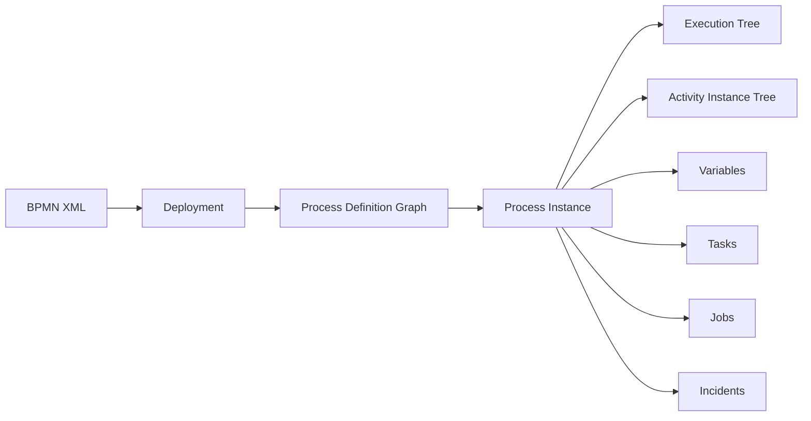

Jangan bayangkan engine sebagai satu thread panjang yang terus hidup dari start sampai end event. Proses bisnis bisa berjalan menit, hari, bulan, atau tahun. Yang bertahan bukan stack Java, melainkan **state yang dipersist oleh engine**.

Prinsip inti:

> Camunda tidak menjaga proses hidup dengan thread yang terus tidur. Camunda menjaga proses hidup dengan menyimpan posisi token, variable, task, job, dan metadata ke database.

Konsekuensinya:

- long-running workflow bukan long-running Java transaction;
- user task tidak membuat thread idle;
- timer event tidak membuat thread sleep;
- process state dapat di-query, dimodifikasi, disuspend, atau direcover;
- restart JVM tidak otomatis membunuh proses yang sudah persisted;
- desain proses harus memperhitungkan persistence boundary.

---

## 3. Core Runtime Objects

### 3.1 Process Definition

**Process definition** adalah struktur proses yang dideploy ke engine. Secara analogi OOP, process definition mirip class.

Contoh BPMN XML minimal:

```xml
<definitions xmlns="http://www.omg.org/spec/BPMN/20100524/MODEL"
             xmlns:camunda="http://camunda.org/schema/1.0/bpmn"
             targetNamespace="https://example.com/enforcement">

  <process id="enforcement_case_lifecycle"
           name="Enforcement Case Lifecycle"
           isExecutable="true">
    <startEvent id="StartEvent_caseReceived" />
    <sequenceFlow id="flow_start_to_triage"
                  sourceRef="StartEvent_caseReceived"
                  targetRef="Task_triageCase" />
    <userTask id="Task_triageCase" name="Triage Case" />
    <sequenceFlow id="flow_triage_to_end"
                  sourceRef="Task_triageCase"
                  targetRef="EndEvent_caseTriaged" />
    <endEvent id="EndEvent_caseTriaged" />
  </process>
</definitions>
```

Important fields:

| Field | Meaning | Engineering implication |
|---|---|---|
| `process id` | Logical process key | Dipakai untuk start by key, versioning, correlation convention |
| `name` | Human-readable label | Dipakai di Cockpit/Tasklist, bukan stable integration key |
| `isExecutable` | Menandai process bisa dieksekusi | Model dokumentasi dan executable model harus dibedakan |
| BPMN element id | Runtime activity id | Dipakai untuk query, migration, modification, incident analysis |

Rule:

> Treat BPMN element IDs as production API. Jangan asal rename activity id pada model yang sudah punya running instances.

Nama activity boleh diperbaiki untuk readability. ID activity harus diperlakukan seperti schema contract.

---

### 3.2 Process Instance

**Process instance** adalah satu eksekusi dari process definition. Secara analogi OOP, process instance mirip object.

Contoh:

```java
ProcessInstance instance = runtimeService.startProcessInstanceByKey(
    "enforcement_case_lifecycle",
    "CASE-2026-000123", // business key
    Map.of(
        "caseId", "CASE-2026-000123",
        "source", "public_complaint",
        "riskScore", 87
    )
);
```

Satu process definition bisa punya banyak process instances:

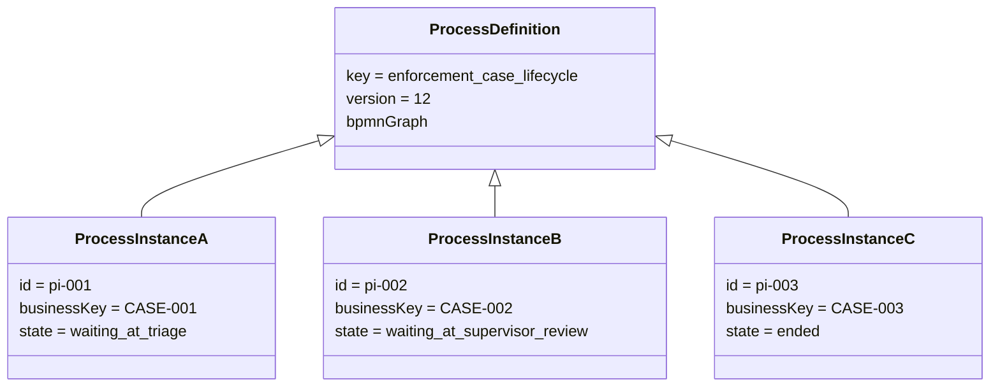

Critical distinction:

| Concept | Meaning |
|---|---|
| Process instance id | Technical runtime identifier generated by engine |
| Business key | Business-level correlation key supplied by application |
| Case id / order id / complaint id | Domain identifier owned by business system |

Anti-pattern:

```java
// Bad: coupling business domain to engine-generated technical id
caseEntity.setWorkflowId(processInstance.getId());
```

Better:

```java
// Better: domain owns case id; process instance is correlated by business key
String caseId = caseEntity.getId();
runtimeService.startProcessInstanceByKey(
    "enforcement_case_lifecycle",
    caseId,
    Map.of("caseId", caseId)
);
```

Process instance id is useful for engine operations. Business key is useful for business correlation.

---

### 3.3 Execution

**Execution** adalah runtime path/token container di dalam process instance.

Jika proses linear, kamu sering melihat satu execution utama. Jika proses paralel, embedded subprocess, event subprocess, compensation, atau multi-instance, engine bisa membuat beberapa execution.

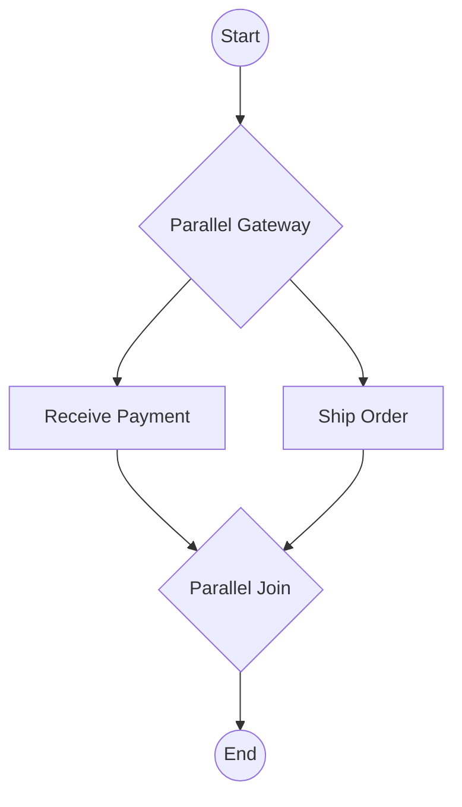

Saat `Receive Payment` dan `Ship Order` aktif bersamaan, process instance memiliki lebih dari satu execution path.

Execution tree kira-kira:

```text
ProcessInstanceExecution
├── Execution: Receive Payment
└── Execution: Ship Order
```

Prinsip:

> Execution adalah perspektif engine terhadap token dan scope. Ia berguna untuk memahami concurrency, variable scope, dan internal runtime behavior.

Tapi jangan terlalu cepat menjadikan execution id sebagai bagian dari kontrak aplikasi. Execution tree dapat berubah karena optimisasi internal engine.

---

### 3.4 Activity Instance

**Activity instance** adalah perspektif state-oriented: aktivitas BPMN apa yang sedang aktif?

Jika execution adalah “token sedang bergerak”, activity instance adalah “node BPMN mana yang sedang hidup”.

```text
ProcessInstance
├── receive_payment
└── ship_order
```

Untuk memahami posisi proses dari sisi model BPMN, activity instance tree biasanya lebih mudah daripada execution tree.

Contoh embedded subprocess:

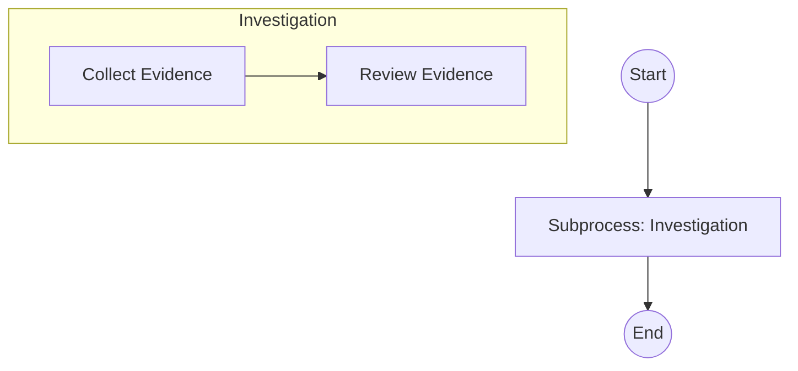

Activity instance tree:

```text
ProcessInstance
└── Investigation Subprocess
    └── Collect Evidence
```

Execution tree dan activity instance tree tidak selalu identik. Jangan membuat tool operasional yang menganggap keduanya satu banding satu.

---

### 3.5 Task

Task di Camunda bisa berarti beberapa hal tergantung jenisnya:

| BPMN task | Runtime meaning |
|---|---|
| User Task | Human work item persisted in task tables |
| Service Task | Automated work executed by delegate, expression, external task, etc. |
| Business Rule Task | DMN decision invocation |
| Script Task | Script execution |
| Receive Task | Wait state waiting for external trigger/message |
| Manual Task | Modeled manual work with limited engine semantics |

User task berbeda dari service task:

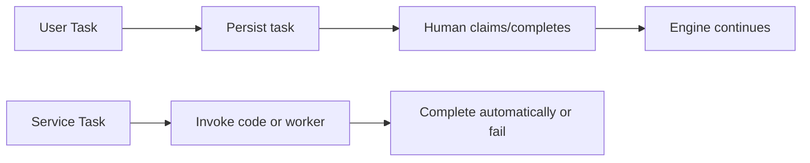

A common mistake is designing every business step as a user task because it is visible in Tasklist. In mature systems, user task is used only when a human decision/action is required.

---

### 3.6 Job

**Job** adalah unit kerja background untuk job executor. Job muncul pada timer, async continuation, beberapa batch operation, dan mekanisme engine lain.

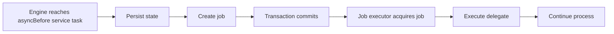

Timer event juga membuat job:

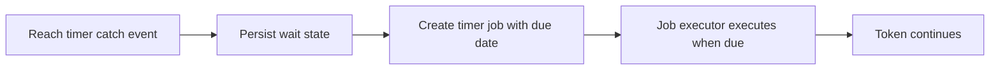

Rule:

> Job executor is a workflow scheduler, not a general-purpose message broker.

It gives you retries, due date, locks, incident behavior, and transaction-aware continuation. It does not replace Kafka, RabbitMQ, or domain event streaming.

---

### 3.7 Variable

Variable adalah data runtime yang disimpan di variable scope.

Contoh:

```java
runtimeService.setVariable(processInstanceId, "riskScore", 87);
runtimeService.setVariableLocal(executionId, "reviewOutcome", "escalate");
```

Variables are useful for:

- routing decisions;
- task display/context;
- correlation metadata;
- temporary orchestration state;
- audit-supporting process data.

Variables are dangerous when used as:

- full business aggregate store;
- data lake;
- replacement for domain database;
- dumping ground for request/response payloads;
- serialized Java object graveyard.

Design heuristic:

| Put in Camunda variable | Keep in domain database |
|---|---|
| Process routing fields | Business aggregate canonical state |
| Small immutable snapshots | Large mutable entities |
| Correlation keys | Full case file/evidence store |
| Decision output summary | Complete decision explanation object if large |
| SLA metadata | Report/read-model projections |

---

### 3.8 Incident

Incident adalah operational signal bahwa engine tidak bisa melanjutkan execution tertentu tanpa intervention atau retry.

Typical incident source:

- failed job after retries exhausted;
- external task failure after retries exhausted;
- missing delegate/expression after deployment issue;
- failed async continuation;
- database/serialization/configuration problem.

Incident is not simply an error log. It is a **recoverable stuck point in process state**.

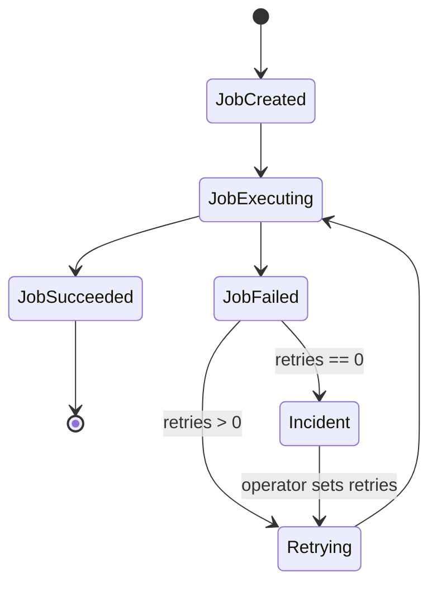

Operational mindset:

> If an incident exists, the process is usually still alive, but one continuation path is blocked.

---

## 4. The Token Mental Model

A token is a conceptual marker of process execution. Camunda's internal object model is more nuanced, but token thinking is still useful for BPMN reasoning.

Linear process:

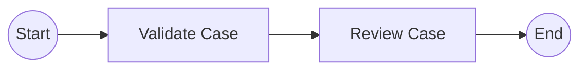

At a time, one token moves from start to end.

Parallel process:

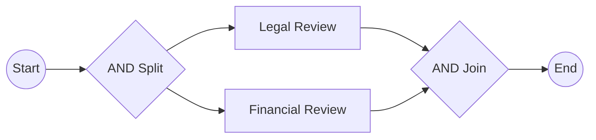

After `AND Split`, conceptually there are two tokens. The join waits until both arrive.

Event-based waiting:

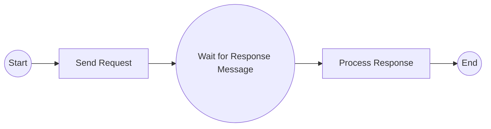

At `Wait for Response Message`, the token is parked. No Java thread is waiting. The database holds the subscription/state.

---

## 5. Wait State: The Most Important Runtime Boundary

A **wait state** is where engine execution stops and state is persisted until something external resumes it.

Common wait states:

| Wait state | Resume trigger |
|---|---|
| User task | Human completes task |
| Receive task | External trigger/message |
| Intermediate message catch event | Message correlation |
| Intermediate timer catch event | Timer job due |
| Signal catch event | Signal received |
| External task | Worker completes task |
| Async continuation | Job executor executes job |

Mental model:

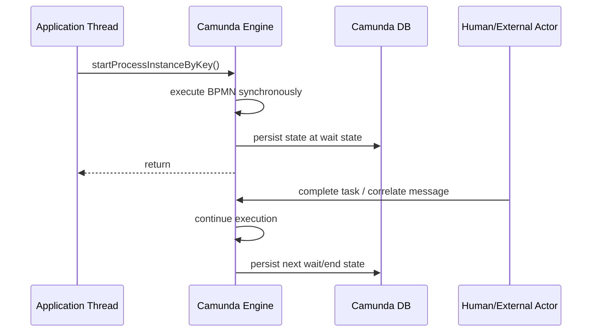

Key consequence:

> Code before a wait state executes in one command/transaction path. Code after a wait state executes in a later command/transaction path.

This matters for:

- transaction isolation;
- retries;
- error visibility;
- user experience;
- idempotency;
- external side effects;
- testing.

---

## 6. Command Execution Mental Model

Camunda engine APIs trigger commands. A command opens engine context, loads state, executes behavior, flushes changes, and commits or rolls back with the surrounding transaction.

Simplified:

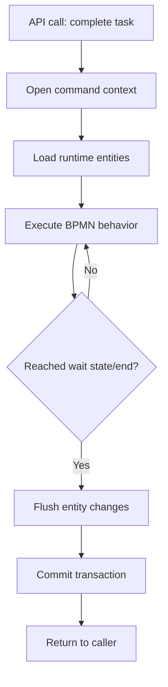

Example:

```java
taskService.complete(taskId, Map.of("approved", true));
```

This may do more than complete a task. It can:

- end current user task;
- evaluate gateway expression;
- invoke service task delegate;
- create another user task;
- create timer job;
- finish process instance;
- throw exception and roll back everything in the command.

A single API call can move through multiple BPMN elements until it reaches the next wait state.

---

## 7. Runtime Object Map

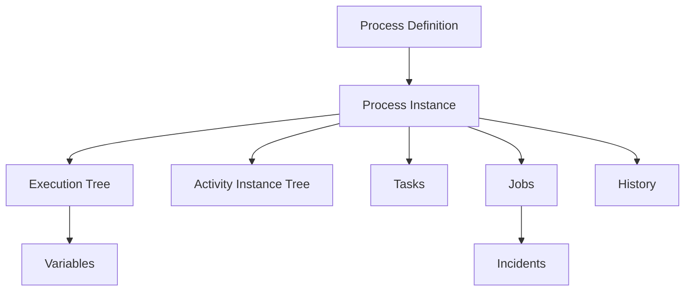

Use this map for debugging:

| Question | Object/API to inspect first |
|---|---|
| Which process version is running? | Process definition / repository service |
| Where is this instance currently? | Activity instance tree |
| Why does it have two active branches? | Execution tree / activity tree / BPMN parallelism |
| Who must act now? | Task query |
| Why is it not continuing? | Jobs and incidents |
| What data controls routing? | Variables |
| What happened historically? | History service |

---

## 8. Process State vs Business State

This is one of the most important architecture distinctions.

**Process state** answers: where is the workflow token?

Examples:

- waiting at `Task_triageCase`;
- waiting for `Message_underwritingCompleted`;
- failed at `ServiceTask_sendNotice`;
- timer due on 2026-07-03;
- instance suspended.

**Business state** answers: what is the domain entity's canonical status?

Examples:

- case status = `UNDER_INVESTIGATION`;
- enforcement action status = `NOTICE_ISSUED`;
- payment status = `SETTLED`;
- application status = `APPROVED`.

They are related but not identical.

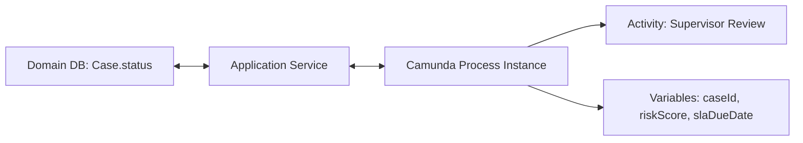

Bad architecture:

```text
Business status is inferred only from current BPMN activity id.
```

Why bad:

- activity names change;
- parallel branches make single status ambiguous;
- manual process modification can break inference;
- migration changes model shape;
- reporting becomes fragile;
- domain invariants become hidden in workflow layout.

Better:

```text
Domain status is explicit in domain model.
Process state orchestrates transitions and work.
```

The process may drive domain state changes, but it should not be the only representation of domain truth.

---

## 9. Stable State vs Transitional State

In workflow design, not every BPMN node deserves to be treated as stable business state.

Example:

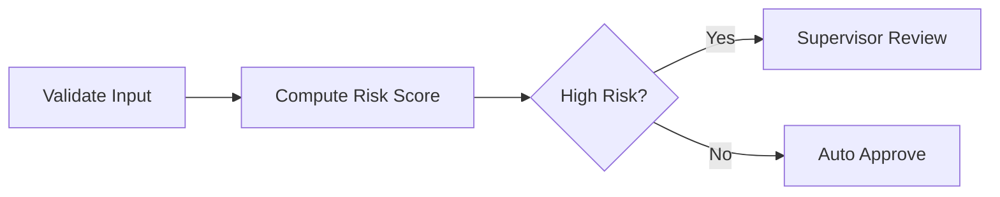

`Validate Input`, `Compute Risk Score`, and gateway evaluation are transitional. They may execute in milliseconds inside one transaction. `Supervisor Review` is stable because it waits for a human.

Classify nodes:

| Node type | Usually stable? | Why |
|---|---:|---|
| User task | Yes | Waits for human action |
| Receive task | Yes | Waits for external trigger |
| Message catch | Yes | Waits for correlation |
| Timer catch | Yes | Waits for due date |
| Async service task | Yes-ish | Persisted as job before/after execution |
| Synchronous service task | No | Transitional inside command |
| Gateway | No | Routing computation |
| Script task | No | Transitional computation |

Design implication:

> Operational dashboards should focus on stable states, jobs, incidents, and human tasks, not every transient BPMN activity.

---

## 10. Process Definition Versioning Mental Model

When deploying the same process key multiple times, Camunda creates versions of the process definition.

```text
key: enforcement_case_lifecycle
version 1 -> deployment A
version 2 -> deployment B
version 3 -> deployment C
```

By default, starting by key starts the latest version.

```java
runtimeService.startProcessInstanceByKey("enforcement_case_lifecycle", businessKey);
```

Existing instances generally continue on the version they were started with unless migrated.

Important consequences:

- new deployment does not magically fix old running instances;
- activity IDs must be stable for migration and operations;
- version compatibility matters for long-running workflows;
- model changes require migration plan if old instances must move.

Engineering heuristic:

| Change type | Migration risk |
|---|---:|
| Rename label only | Low |
| Rename activity id | High |
| Add service task before wait state | Medium/high |
| Add user task after existing wait state | Medium |
| Remove active wait state | High |
| Change gateway condition | Business high |
| Change variable names | High |
| Add async boundary | Medium/high operational impact |

---

## 11. What Happens When You Start a Process?

For this BPMN:

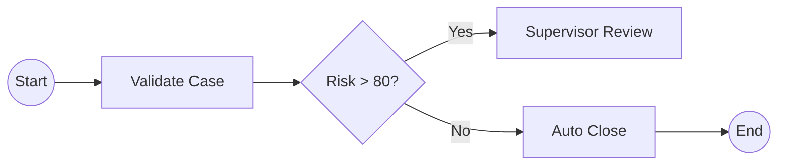

If `Validate Case` is a synchronous service task and `Supervisor Review` is a user task:

```java
ProcessInstance pi = runtimeService.startProcessInstanceByKey(
    "case_triage",
    "CASE-123",
    Map.of("riskScore", 91)
);
```

Execution path:

1. API call enters engine command.
2. Engine creates process instance.
3. Token leaves start event.
4. Engine invokes `Validate Case` delegate synchronously.
5. Gateway condition is evaluated.
6. Token enters `Supervisor Review` user task.
7. Engine persists task, execution, variables, and runtime state.
8. Transaction commits.
9. API call returns.

If risk is low and auto close is synchronous:

1. Process may reach end event within the same API call.
2. No active runtime instance remains after commit.
3. History may contain completed process instance depending on history level.

This surprises many developers:

```java
ProcessInstance pi = runtimeService.startProcessInstanceByKey("case_triage", vars);

// For straight-through processes, querying runtime immediately may return nothing
// because the instance already ended.
```

---

## 12. What Happens When You Complete a User Task?

For this model:

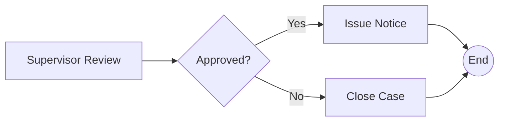

Completing the user task:

```java
taskService.complete(taskId, Map.of("approved", true));
```

May synchronously:

- delete/finish current task;
- persist submitted variables;
- evaluate gateway;
- execute `Issue Notice` delegate;
- create jobs/incidents;
- reach end;
- or roll back if something fails.

This means user action can trigger automated work. If that automated work is slow or side-effecting, you likely need async boundary.

Bad:

```text
User clicks Complete -> HTTP request blocks while engine calls slow external regulator API.
```

Better:

```text
User clicks Complete -> engine persists approval -> creates async job -> HTTP returns -> job executor sends external notice.
```

---

## 13. Where Bugs Come From

### 13.1 Treating Token as Thread

Wrong:

> “The process is waiting, so there must be a Java thread waiting.”

Correct:

> The process is waiting because state is persisted and no execution happens until an external command/job resumes it.

### 13.2 Treating Process Instance as Aggregate Root

Wrong:

> “The process variable map is my case aggregate.”

Correct:

> The process instance orchestrates work. The domain aggregate owns canonical business state.

### 13.3 Treating BPMN ID as Cosmetic

Wrong:

> “Rename activity IDs freely; only labels matter.”

Correct:

> Activity IDs are runtime anchors for incidents, migration, modification, task definitions, history, and monitoring.

### 13.4 Treating Job Executor as Queue Infrastructure

Wrong:

> “Use async service tasks for all integration events.”

Correct:

> Use async service tasks for transaction boundaries and engine-managed retries. Use messaging infrastructure for domain event distribution.

### 13.5 Treating Execution Tree as Business View

Wrong:

> “Execution IDs tell me exactly which BPMN nodes are active.”

Correct:

> For model-oriented state, use activity instance tree. Execution tree is engine-oriented and may be optimized.

---

## 14. The Runtime Debugging Ladder

When a process behaves unexpectedly, debug in this order:

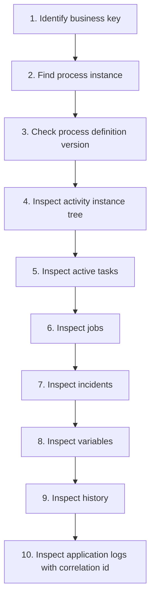

Checklist:

- Is the instance still running?
- Is it suspended?
- Which process definition version is it on?
- Which activity IDs are active?
- Are there active user tasks?
- Are there jobs with retries left?
- Are there incidents?
- Did a variable have unexpected type/value?
- Did a delegate throw exception?
- Was a message correlated to the wrong instance?
- Did process modification/migration happen?

---

## 15. Minimal Practice: Build a Runtime Trace

Create a simple process:

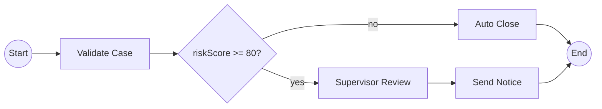

Exercise:

1. Start one instance with `riskScore = 90`.
2. Start one instance with `riskScore = 30`.
3. Query runtime process instances.
4. Query tasks.
5. Query activity instance tree for the high-risk case.
6. Complete supervisor task.
7. Query runtime again.
8. Query history.

Expected observation:

| Instance | Expected runtime state |
|---|---|
| High risk | Waits at user task until completed |
| Low risk | May complete immediately if no wait state exists |

Self-correction questions:

- Why does low-risk instance disappear from runtime?
- Why does high-risk instance have a task?
- Which activity id appears in activity instance tree?
- What variables are still visible?
- What history remains after completion?

---

## 16. Production Invariants

Use these invariants in design review.

### Invariant 1 — Every process instance must have a business correlation strategy

At minimum:

- business key;
- domain id variable;
- logging correlation id;
- idempotency key for external commands.

### Invariant 2 — Every long-running process must distinguish process state from domain state

The BPMN activity is not the sole domain status.

### Invariant 3 — Every external side effect must have retry and idempotency semantics

If a delegate can run again, the side effect must be safe.

### Invariant 4 — Every wait state must be observable

Operators need to know:

- what is waiting;
- who/what can resume it;
- how long it has waited;
- whether it violates SLA;
- what happens if it never resumes.

### Invariant 5 — Every model version change must preserve operational anchors

Stable activity IDs matter.

---

## 17. Architecture Heuristic: Model What Must Be Controlled

Do not put something in BPMN only because it happened in the business narrative.

Put it in BPMN when you need engine-level control over:

- waiting;
- timeout;
- retry;
- compensation;
- human work assignment;
- audit trail;
- orchestration sequence;
- incident recovery;
- message correlation;
- process visibility.

Keep it in code when it is:

- pure computation;
- local validation;
- small deterministic transformation;
- internal domain invariant enforcement;
- implementation detail not meaningful to process operators.

Example:

```text
Good BPMN node:
- Supervisor Review
- Wait for Payment Confirmation
- Send Notice with Retry
- Escalate After 5 Business Days

Poor BPMN node:
- Trim String
- Convert DTO
- Calculate One Boolean Used Locally
- Map API Response to Entity
```

---

## 18. Summary

Camunda 7 mastery starts from the runtime model:

- process definition is the deployed graph;
- process instance is one execution of that graph;
- execution tree represents engine/token paths and variable scopes;
- activity instance tree represents active BPMN activity state;
- wait states persist process state and release Java threads;
- jobs represent scheduled/background continuation;
- variables support orchestration but should not become canonical business storage;
- incidents are recoverable stuck runtime points;
- stable activity IDs are operational and migration anchors.

The practical mental model:

```text
BPMN model + runtime command + variables + persisted state + jobs + external triggers
= long-running process execution
```

If you internalize this, later topics—async boundaries, job executor, external tasks, migration, incidents, observability—will feel like consequences, not disconnected features.

---

## References

- Camunda 7 Process Engine Concepts — https://docs.camunda.org/manual/7.24/user-guide/process-engine/process-engine-concepts/
- Camunda 7 BPMN 2.0 Implementation Reference — https://docs.camunda.org/manual/7.24/reference/bpmn20/
- Camunda 7 Transactions in Processes — https://docs.camunda.org/manual/7.24/user-guide/process-engine/transactions-in-processes/
- Camunda 7 Job Executor — https://docs.camunda.org/manual/7.24/user-guide/process-engine/the-job-executor/
