# Part 004 — BPMN Executable Subset: What Matters in Camunda 7

> Goal: memahami subset BPMN yang benar-benar penting untuk Camunda 7 production systems. Fokus part ini bukan menghafal seluruh simbol BPMN, tetapi membangun judgment: elemen mana yang menjadi runtime contract, elemen mana yang hanya dokumentasi, dan bagaimana membuat model yang readable, executable, testable, observable, dan migration-friendly.

BPMN punya banyak simbol. Camunda 7 juga tidak mengeksekusi semuanya dengan semantics yang sama. Engineer yang kuat tidak menggambar semua simbol. Engineer yang kuat memilih subset yang tepat untuk kebutuhan runtime.

---

## 1. Kaufman Framing: Learn Enough to Self-Correct

Dalam framework Josh Kaufman, fase ini adalah **learn enough to self-correct**. Kita tidak perlu menguasai semua notasi BPMN untuk mulai produktif. Kita perlu menguasai subset yang memungkinkan kita membaca, menulis, menjalankan, menguji, dan memperbaiki model.

Minimum executable subset untuk Camunda 7:

| Category | Elements to master first |
|---|---|
| Process structure | process, start event, end event, sequence flow |
| Work | user task, service task, business rule task, receive task |
| Routing | exclusive gateway, parallel gateway, inclusive gateway, event-based gateway |
| Waiting | user task, message catch, timer catch, receive task, external task |
| Errors/timeouts | boundary timer, boundary error, boundary escalation |
| Modularity | embedded subprocess, event subprocess, call activity |
| Engine control | asyncBefore, asyncAfter, job priority, retries, task assignment |
| Contracts | activity id, process id, message name, variable names, business key |

Everything else should be learned when a real problem requires it.

---

## 2. Descriptive BPMN vs Executable BPMN

BPMN can be used in at least two very different ways:

| Type | Purpose | Risk |
|---|---|---|
| Descriptive BPMN | Communicate process to humans | Can be ambiguous, informal, non-executable |
| Analytical BPMN | Analyze process performance/compliance | May omit integration details |
| Executable BPMN | Runtime contract for engine | Must be precise, versioned, testable |

Camunda 7 cares about executable BPMN.

A descriptive model might say:

```text
Officer reviews complaint and may escalate if serious.
```

An executable model must answer:

- What starts the process?
- What is the process key?
- Which user/group receives the task?
- Which variable controls escalation?
- What happens if no one acts in 3 days?
- What service call is made?
- Is it synchronous or async?
- What happens on technical failure?
- What activity ID will be used for migration and monitoring?

Executable BPMN is not “diagram plus code”. It is a runtime contract.

---

## 3. Process Element: The Root Contract

Minimal executable process:

```xml
<process id="case_triage"
         name="Case Triage"
         isExecutable="true">
  ...
</process>
```

Key fields:

| Field | Meaning | Guideline |
|---|---|---|
| `id` | Process definition key | Stable, lowercase snake_case or kebab-case |
| `name` | Human-readable name | Can evolve; visible to operators |
| `isExecutable` | Whether engine can execute it | Must be true for executable process |
| `camunda:versionTag` | Optional business version label | Useful for release traceability |
| `camunda:historyTimeToLive` | Retention config support | Important for history cleanup/compliance |

Recommended:

```xml
<process id="enforcement_case_lifecycle"
         name="Enforcement Case Lifecycle"
         isExecutable="true"
         camunda:versionTag="2026.06.1"
         camunda:historyTimeToLive="P365D">
```

Do not use generic ids:

```xml
<!-- Bad -->
<process id="process" name="Process" isExecutable="true">
```

Better:

```xml
<process id="enforcement_case_lifecycle"
         name="Enforcement Case Lifecycle"
         isExecutable="true">
```

Process id becomes part of API, deployment versioning, start commands, monitoring, and incident analysis.

---

## 4. Start Events

Start event defines how a process instance begins.

Common types:

| Start event | Use when |
|---|---|
| None start | Application explicitly starts process by API |
| Message start | External message/event starts process |
| Timer start | Process starts on schedule |
| Conditional start | Process starts when condition is satisfied, less common |
| Signal start | Broadcast signal can start process, use carefully |
|

### 4.1 None Start Event

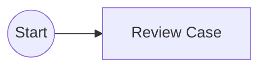

Use when your application decides when to start:

```java
runtimeService.startProcessInstanceByKey(
    "case_triage",
    businessKey,
    variables
);
```

Good for:

- domain command starts workflow;
- REST API creates case;
- batch job starts process instances;
- application service validates request first.

### 4.2 Message Start Event

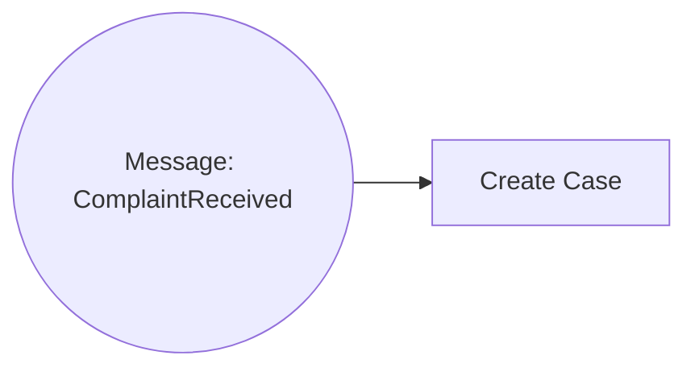

Use when inbound message/event is the start trigger.

Important design questions:

- Is message unique or can it duplicate?
- What is the idempotency key?
- What maps to business key?
- Does the message create a domain aggregate first or process first?
- How are schema versions handled?

Anti-pattern:

```text
Every external integration directly starts process instances without an ingestion boundary.
```

Better:

```text
Inbound adapter -> validate/idempotency -> domain command -> start process with business key
```

### 4.3 Timer Start Event

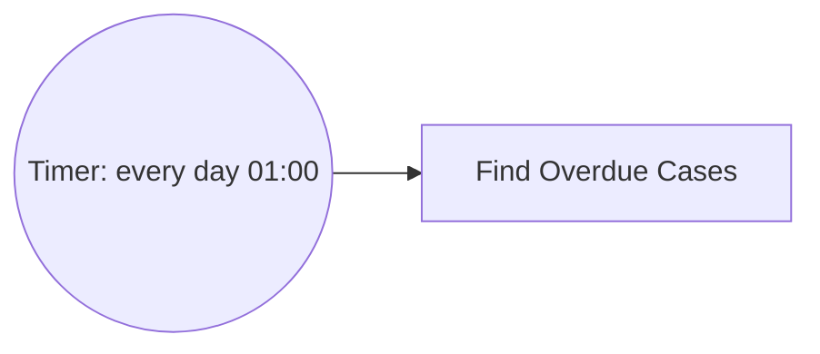

Use for scheduled process creation. Be careful with cluster/deployment behavior and duplicate starts after redeployment. For batch scanning workloads, often better:

```text
Scheduler -> application batch coordinator -> start process per item if not already running
```

---

## 5. End Events

End events define how a path ends.

Common types:

| End event | Meaning |
|---|---|
| None end | Normal path ends |
| Error end | Throws BPMN error to boundary/event subprocess parent |
| Escalation end | Throws escalation |
| Terminate end | Terminates entire process/subprocess scope |
| Message end | Sends message, depending implementation |
| Compensation end | Triggers compensation semantics |

### 5.1 None End

Use for normal completion.

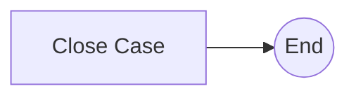

Name end events when there are multiple business outcomes:

```text
EndEvent_caseClosedNoViolation
EndEvent_noticeIssued
EndEvent_referredToProsecution
```

### 5.2 Terminate End

Terminate end is powerful and dangerous.

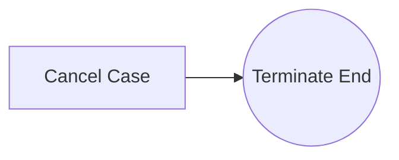

Use when reaching this event must cancel all active branches in the scope.

Avoid using terminate end as a shortcut for “I do not want to model the rest”. It can kill parallel work unexpectedly.

---

## 6. Sequence Flows and Conditions

Sequence flow connects BPMN nodes.

For gateways and conditional routing:

```xml
<sequenceFlow id="flow_high_risk"
              sourceRef="Gateway_riskDecision"
              targetRef="Task_supervisorReview">
  <conditionExpression xsi:type="tFormalExpression">
    ${riskScore >= 80}
  </conditionExpression>
</sequenceFlow>
```

Rules:

- condition should be simple;
- complex business decision belongs in DMN or domain service;
- avoid hidden null behavior;
- always configure default flow where appropriate;
- name flows with business meaning.

Bad:

```xml
${application.customer.profile.flags[3] == 'X' && application.score.value > 781 && !application.temp}
```

Better:

```xml
${riskBand == 'HIGH'}
```

Where `riskBand` is computed by DMN or domain service.

---

## 7. Tasks: Work Units

### 7.1 User Task

User task represents human work.

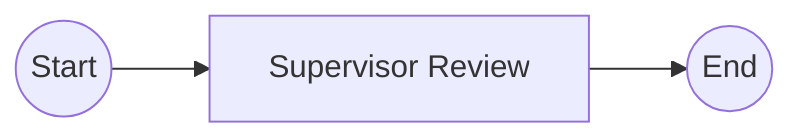

Example:

```xml
<userTask id="Task_supervisorReview"
          name="Supervisor Review"
          camunda:candidateGroups="supervisors" />
```

Use when:

- human judgment is required;
- accountability matters;
- task assignment matters;
- due dates/escalation matter;
- audit trail matters.

Do not use when:

- the work is automatic;
- task exists only to display status;
- task is a workaround for missing UI state;
- human has no real decision/action.

Production checklist:

- assignee/candidate group defined;
- due date/follow-up date strategy defined;
- task completion variables validated;
- authorization considered;
- audit expectation documented;
- timeout/escalation modeled if needed.

### 7.2 Service Task

Service task represents automated work.

Common implementation options in Camunda 7:

| Option | Meaning |
|---|---|
| `camunda:class` | Instantiate Java class |
| `camunda:delegateExpression` | Resolve bean implementing delegate |
| `camunda:expression` | Invoke expression/method |
| `camunda:type="external"` | External task worker pattern |
| connector | Built-in connector mechanism; use cautiously |

Preferred in Spring systems:

```xml
<serviceTask id="Task_calculateRisk"
             name="Calculate Risk"
             camunda:delegateExpression="${calculateRiskDelegate}" />
```

Design rule:

> Keep delegates thin. Put domain logic in application/domain services; delegates adapt process variables to service commands.

Bad:

```text
Risk calculation, persistence, HTTP calls, branching decisions, and notification formatting all inside one JavaDelegate.
```

Better:

```text
JavaDelegate -> maps variables -> calls RiskAssessmentService -> stores process result summary
```

### 7.3 Business Rule Task

Use for DMN decision evaluation.

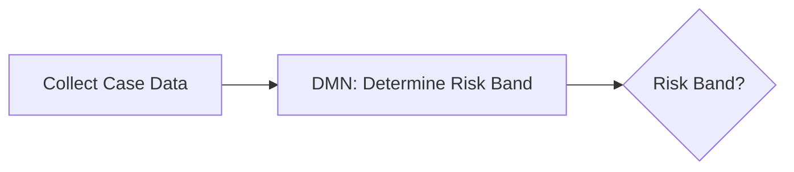

Good for:

- business-owned decision tables;
- routing decisions;
- eligibility decisions;
- policy rules;
- auditable decision logic.

Avoid when:

- decision requires complex side effects;
- rules are actually code-level algorithms;
- input data contract is unstable;
- table becomes a disguised programming language.

### 7.4 Receive Task

Receive task waits until triggered.


Useful for simple wait-for-callback scenarios.

However, intermediate message catch events are often more explicit when waiting for named messages.

### 7.5 Script Task

Script task executes script code.

Use sparingly.

Good for:

- small prototypes;
- simple transformations in controlled environment;
- migration scripts in internal process models.

Avoid for production business logic:

- harder to test;
- security concerns;
- weaker refactoring support;
- hidden dependencies;
- runtime engine scripting configuration issues.

---

## 8. Gateways: Routing, Forking, Joining

Gateways are not tasks. They do not “do work”. They route token flow.

### 8.1 Exclusive Gateway

Exactly one outgoing path is selected.

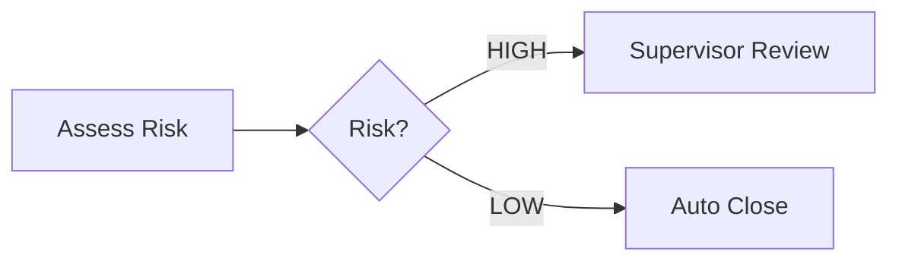

Use for mutually exclusive business alternatives.

Rules:

- conditions must be mutually exclusive;
- define default flow for safety;
- avoid side effects in expressions;
- do not encode complex policy in gateway expressions.

Bad:

```text
XOR gateway with five overlapping conditions and no default flow.
```

Better:

```text
DMN determines route = SUPERVISOR_REVIEW | AUTO_CLOSE | REQUEST_MORE_INFO
XOR gateway routes by route variable.
```

### 8.2 Parallel Gateway

Parallel gateway splits or joins all branches.

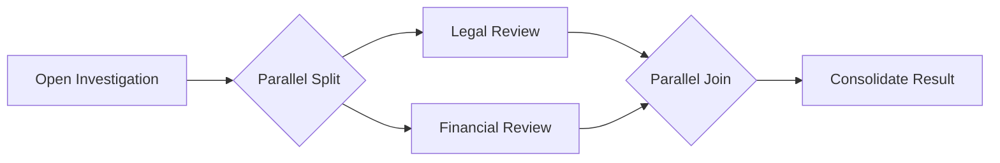

Use when branches are all required and independent enough to run concurrently.

Risk:

- deadlock if join waits for branch that can never arrive;
- optimistic locking under concurrent completions;
- hidden data races on shared variables;
- unclear ownership of final decision.

### 8.3 Inclusive Gateway

Inclusive gateway activates one or more outgoing branches based on conditions and later joins the activated subset.

Use carefully. It can express real business optional parallelism, but it is harder to reason about than XOR or AND.

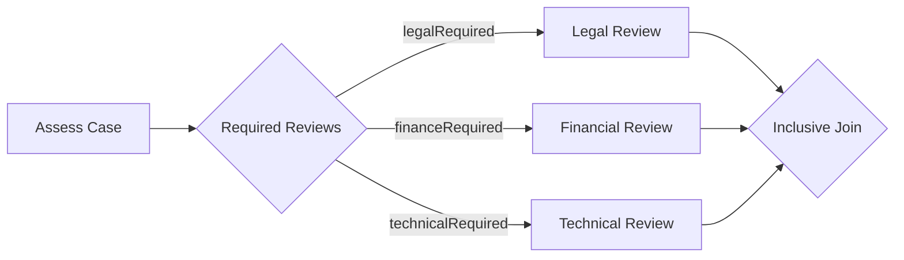

Design rule:

> Use inclusive gateway only when “one or more parallel branches” is truly the business invariant.

If the model becomes hard to test, split the decision into DMN + explicit subprocess orchestration.

### 8.4 Event-Based Gateway

Event-based gateway waits for one of several events.

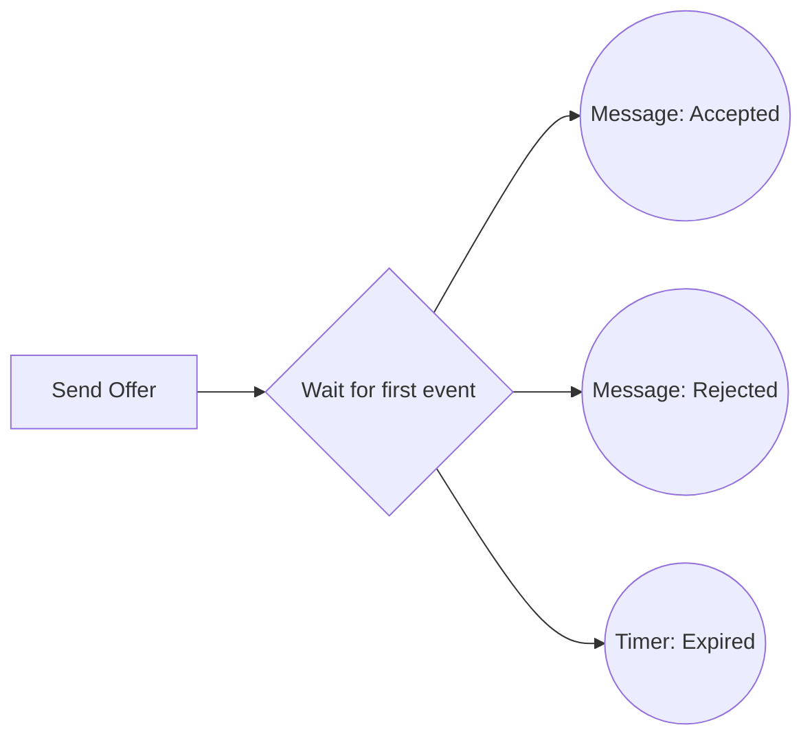

Use for race between events:

- customer accepts;
- customer rejects;
- timeout occurs.

Do not use XOR gateway for event races. XOR evaluates data immediately; event-based gateway waits for future event occurrence.

---

## 9. Events: Runtime Triggers and Interruptions

BPMN events are where executable modeling becomes powerful.

Basic classification:

| Dimension | Variants |
|---|---|
| Position | start, intermediate, boundary, end |
| Behavior | catching, throwing |
| Interruption | interrupting, non-interrupting boundary/event subprocess |
| Type | message, timer, signal, error, escalation, compensation, conditional, terminate |

### 9.1 Message Event

Use message events for targeted communication with a process instance.

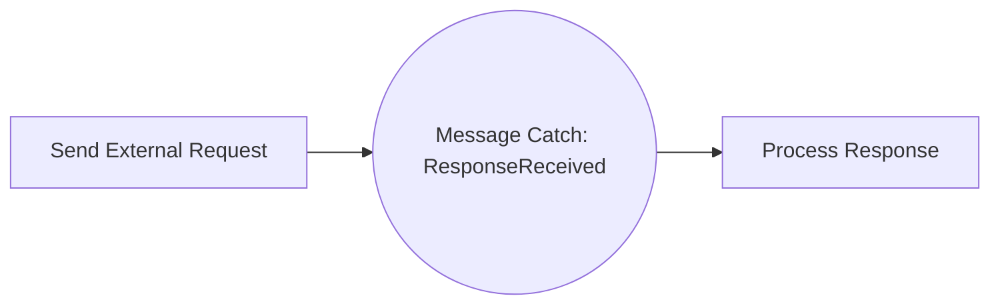

Design checklist:

- message name stable;
- correlation key defined;
- duplicate message behavior defined;
- late message behavior defined;
- message schema versioned;
- idempotency handled by adapter/application.

### 9.2 Timer Event

Use timer for time-based continuation or escalation.

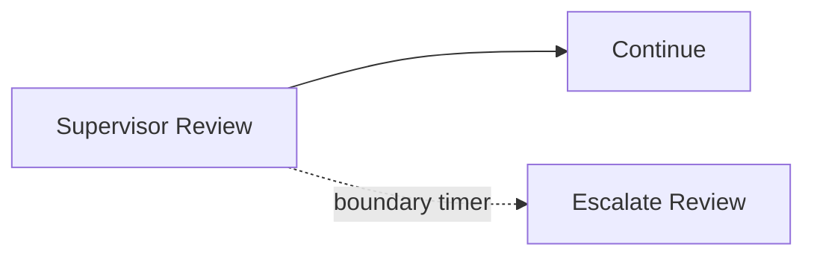

Timer types include date, duration, and cycle.

Use cases:

- SLA escalation;
- reminder;
- timeout;
- periodic start;
- delayed retry-like business wait.

Do not use timer as substitute for technical retry if job retries would be more appropriate.

### 9.3 Signal Event

Signal is broadcast-style.

Use only when broadcast semantics are intended.

Bad:

```text
Signal: PaymentReceived for one order
```

Better:

```text
Message: PaymentReceived correlated by orderId
```

Signal is suitable for:

- global cancellation/notification;
- operational broadcast;
- process-wide event affecting many listeners.

### 9.4 Error Event

BPMN error is business error semantics, not generic Java exception semantics.

Good:

```text
PaymentRejected
EligibilityFailed
DocumentInvalid
```

Bad:

```text
NullPointerException
HttpTimeout
DatabaseUnavailable
```

Technical exceptions should usually use job retries/incidents. BPMN error should represent expected modeled alternative flow.

### 9.5 Escalation Event

Escalation means “this needs attention or alternate handling” without necessarily meaning failure.

Good for:

- SLA breach;
- supervisor notification;
- additional review;
- non-fatal policy escalation.

### 9.6 Boundary Events

Boundary event attaches to activity.

Interrupting boundary event cancels the activity:

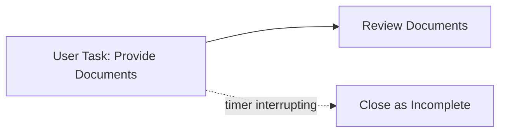

Non-interrupting boundary event keeps the activity alive:

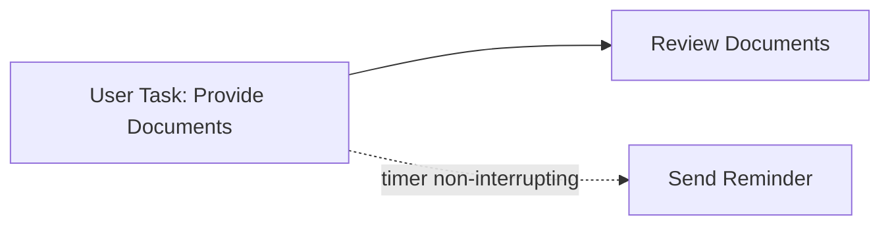

Rule:

> Always decide whether timeout/reminder should cancel the original work or run alongside it.

---

## 10. Subprocesses and Call Activities

### 10.1 Embedded Subprocess

Embedded subprocess groups activities inside the same process definition and scope.

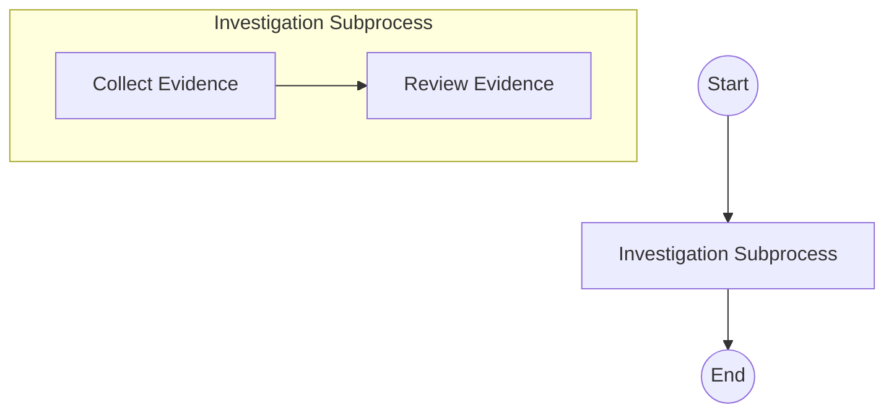

Use for:

- visual grouping;
- local scope;
- boundary events around a block;
- event subprocess inside scope;
- transaction/compensation modeling.

### 10.2 Event Subprocess

Event subprocess is triggered by event while parent scope is active.

Use for:

- cancellation request;
- urgent escalation;
- external update while case is open;
- global timeout inside a scope.

Example:

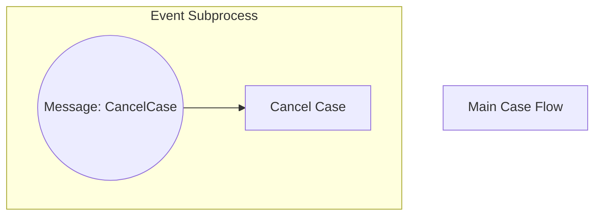

### 10.3 Call Activity

Call activity invokes another process definition.

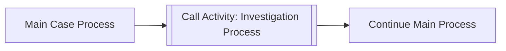

Use for:

- reusable subprocess;
- separate versioning boundary;
- large model decomposition;
- separate ownership if carefully managed.

Risks:

- version binding confusion;
- variable mapping leaks;
- parent-child lifecycle complexity;
- migration complexity;
- debugging across definitions.

Production rule:

> Use call activity when reuse/version boundary is real. Use embedded subprocess when it is only visual decomposition.

---

## 11. Camunda Extension Attributes: The Runtime Knobs

Camunda-specific attributes turn BPMN from generic notation into executable engine behavior.

Common attributes:

| Attribute | Applies to | Meaning |
|---|---|---|
| `camunda:delegateExpression` | service task/listener | Resolve bean/delegate |
| `camunda:class` | service task/listener | Instantiate Java class |
| `camunda:expression` | service task | Evaluate expression |
| `camunda:asyncBefore` | activities/gateways/events | Create async boundary before element |
| `camunda:asyncAfter` | activities/gateways/events | Create async boundary after element |
| `camunda:exclusive` | jobs | Controls exclusive job behavior |
| `camunda:jobPriority` | jobs | Job acquisition priority |
| `camunda:candidateGroups` | user task | Candidate groups |
| `camunda:assignee` | user task | Direct assignee |
| `camunda:dueDate` | user task | Due date expression |
| `camunda:formKey` | user task/start event | Form integration key |
| `camunda:calledElement` | call activity | Called process key |
| `camunda:resultVariable` | service/business rule/script | Stores result |

Example:

```xml
<serviceTask id="Task_sendNotice"
             name="Send Notice"
             camunda:delegateExpression="${sendNoticeDelegate}"
             camunda:asyncBefore="true"
             camunda:jobPriority="80" />
```

This is not just visual. It changes transaction, retry, job creation, and operational behavior.

---

## 12. Naming and ID Conventions

Good BPMN ID conventions make operations, migration, and tests easier.

Recommended prefix style:

| Element | Prefix example |
|---|---|
| Start event | `StartEvent_caseReceived` |
| End event | `EndEvent_caseClosed` |
| User task | `UserTask_supervisorReview` or `Task_supervisorReview` |
| Service task | `ServiceTask_sendNotice` or `Task_sendNotice` |
| Gateway | `Gateway_riskDecision` |
| Message catch | `MessageCatch_paymentReceived` |
| Timer boundary | `TimerBoundary_reviewSla` |
| Embedded subprocess | `SubProcess_investigation` |
| Call activity | `CallActivity_investigation` |
| Sequence flow | `Flow_riskHigh_to_supervisorReview` |

Rules:

- IDs are stable runtime contracts.
- Names are readable business labels.
- Avoid generated IDs like `Activity_0abc123` in production models.
- Avoid renaming IDs without migration impact review.
- Use business language, not implementation language.

Bad:

```text
Activity_18f8qqx
Gateway_1
Task_DoStuff
```

Better:

```text
Task_calculateRiskBand
Gateway_riskBandDecision
Task_supervisorReview
```

---

## 13. Modeling for Readability

Executable does not mean unreadable. Good BPMN is both precise and legible.

Rules:

1. Model left-to-right or top-to-bottom consistently.
2. Keep happy path visually dominant.
3. Put exceptional paths below or around the main path.
4. Name tasks with verb + object.
5. Name gateways as questions or decisions.
6. Name sequence flow conditions in business terms.
7. Avoid crossing lines.
8. Collapse subprocesses when detail distracts.
9. Prefer explicit event names.
10. Keep one process diagram at a cognitive scale humans can review.

Example gateway naming:

```text
Bad: Gateway_eligible
Better: Is case eligible for fast-track closure?
```

Example flow naming:

```text
Bad: yes / no
Better: eligible / not eligible
```

---

## 14. Modeling for Execution

A production executable model must answer these questions:

| Concern | Question |
|---|---|
| Start | What exactly starts this process? |
| Correlation | How do external events find the right instance? |
| Human work | Who can see, claim, complete, delegate? |
| Automation | Which code/worker runs each service task? |
| Transaction | Where should async boundaries exist? |
| Retry | What happens on technical failure? |
| Business error | What expected business failures are modeled? |
| Timeout | Which waits have SLA/deadline? |
| Data | Which variables are required and who owns them? |
| Versioning | What IDs must remain stable? |
| Audit | What history must be retained? |
| Operations | How does support recover a stuck instance? |

If the model cannot answer these, it is not production-ready executable BPMN.

---

## 15. Model Contracts

Executable BPMN exposes implicit contracts. Make them explicit.

### 15.1 Process Contract

```text
Process key: enforcement_case_lifecycle
Business key: caseId
Start command: CaseOpened
Required variables: caseId, caseType, receivedAt, riskScore
Completion outcomes: closed_no_violation, notice_issued, referred
```

### 15.2 Message Contract

```text
Message name: EvidenceReceived
Correlation key: caseId
Payload: evidenceId, receivedAt, source
Duplicate behavior: ignore if evidenceId already recorded
Late behavior: route to manual review if case closed
```

### 15.3 User Task Contract

```text
Task id: Task_supervisorReview
Candidate group: supervisors
Required completion variables: reviewDecision, reviewComment
Allowed decisions: APPROVE, REJECT, REQUEST_MORE_INFO
SLA: 3 business days
Escalation: notify team lead, non-interrupting
```

### 15.4 Service Task Contract

```text
Task id: Task_sendNotice
Delegate: sendNoticeDelegate
Input variables: caseId, noticeTemplateId, recipientId
Output variables: noticeId, noticeSentAt
Side effect: sends official notice
Idempotency key: caseId + noticeTemplateId
Retry: async job retries configured
Failure behavior: incident after retries exhausted
```

This turns BPMN from diagram into engineering artifact.

---

## 16. Executable BPMN Anti-Patterns

### 16.1 Spaghetti BPMN

Symptoms:

- too many crossing lines;
- many gateways with unclear conditions;
- no subprocess boundaries;
- too many exception flows mixed into happy path;
- impossible to explain in 2 minutes.

Fix:

- extract subprocesses;
- separate happy path and exception handling;
- replace complex gateways with DMN;
- create pattern-specific diagrams;
- simplify process scope.

### 16.2 God Process

One process controls everything across many bounded contexts.

Symptoms:

- hundreds of elements;
- multiple business domains in one model;
- every team edits same BPMN;
- high migration fear;
- unclear ownership.

Fix:

- split by lifecycle boundary;
- use call activities selectively;
- delegate domain decisions to services/DMN;
- use events for cross-domain communication.

### 16.3 God Delegate Hidden Behind One Service Task

BPMN says:

```text
Process Case
```

Java delegate does:

- validate;
- score;
- approve;
- persist;
- notify;
- escalate;
- close.

This defeats BPMN visibility.

Fix:

- expose meaningful wait/retry/audit points in BPMN;
- keep code cohesive;
- avoid modeling implementation details.

### 16.4 Gateway Programming Language

Gateway expressions contain complex code-like logic.

Fix:

- compute decision output in DMN/domain service;
- gateway only routes by clear variable.

### 16.5 Signal for Targeted Event

Using signal when only one instance should react.

Fix:

- use message correlation for targeted instance;
- reserve signal for broadcast.

### 16.6 Missing Default Flow

XOR gateway has conditions but no default.

Risk:

- process fails when no condition matches;
- incident occurs due to unexpected data;
- business exception path absent.

Fix:

- add default flow to explicit error/manual review path;
- validate input before routing.

### 16.7 Timer Explosion

Thousands/millions of fine-grained timers without capacity planning.

Fix:

- use due dates and batch sweeps where appropriate;
- model timers only when engine-level wakeup is needed;
- monitor job table and acquisition load.

### 16.8 Model Coupled to UI Screens

BPMN mirrors every frontend screen.

Fix:

- model business work and wait states, not UI navigation;
- UI can have multiple screens per user task;
- user task completion should represent business action.

---

## 17. Good Model Review Checklist

Before approving executable BPMN, ask:

### Structure

- Is process key stable and meaningful?
- Are activity IDs human-readable and stable?
- Is the main path easy to follow?
- Are subprocesses used where scope helps?

### Runtime

- Are wait states intentional?
- Are async boundaries intentional?
- Are service task implementations declared clearly?
- Are external side effects idempotent?

### Data

- Are required variables defined?
- Are variable names stable?
- Are large payloads avoided?
- Are routing variables simple?

### Human Work

- Are assignments/candidate groups defined?
- Are task outcomes explicit?
- Are SLAs/escalations modeled?
- Are completion variables validated?

### Events

- Are messages named and correlated?
- Are signals used only for broadcast?
- Are timers business-meaningful?
- Are boundary events interrupting/non-interrupting correctly?

### Operations

- Can support identify stuck points?
- Are incidents expected and recoverable?
- Is history retention configured?
- Are migration risks known?

---

## 18. Minimal Practice: Convert Narrative to Executable Subset

Narrative:

```text
When a complaint is received, the system creates a case and calculates risk.
Low-risk cases are closed automatically.
High-risk cases require supervisor review.
If the supervisor does not review within 3 business days, notify the team lead but keep the review task open.
If approved, issue a notice.
If rejected, close the case.
```

Executable model:

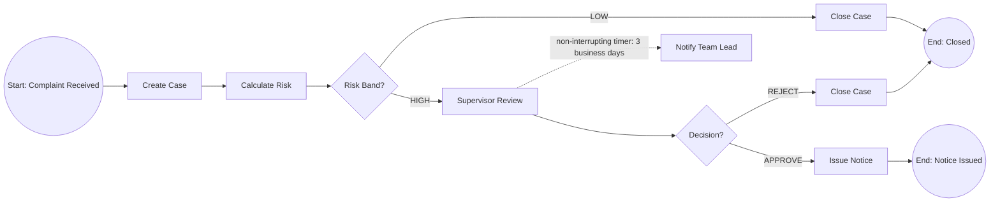

Model contract:

```text
Process key: complaint_triage
Business key: complaintId or caseId
Variables:
- complaintId
- caseId
- riskBand: LOW | HIGH
- supervisorDecision: APPROVE | REJECT

Service tasks:
- Create Case -> createCaseDelegate
- Calculate Risk -> calculateRiskDelegate
- Close Case -> closeCaseDelegate, asyncBefore if side-effecting
- Issue Notice -> issueNoticeDelegate, asyncBefore true
- Notify Team Lead -> notifyTeamLeadDelegate, asyncBefore true

User task:
- Supervisor Review -> candidateGroups=supervisors

Timer:
- Non-interrupting boundary timer on Supervisor Review
```

Why this is good:

- human work is visible;
- automated work is visible only where operationally meaningful;
- risk decision is explicit;
- SLA reminder does not cancel original task;
- notice issuance can be retried separately;
- end states are business-readable.

---

## 19. What Not to Model

Do not model every line of code.

Avoid BPMN nodes for:

- DTO mapping;
- string formatting;
- simple null checks;
- logging;
- local repository save unless it is business-visible;
- every frontend button;
- technical retry loops better handled by job retry;
- synchronous internal helper methods.

Model things that matter to business/runtime control:

- waiting;
- responsibility;
- timeout;
- escalation;
- externally visible side effect;
- business decision;
- compensation;
- error path;
- audit checkpoint.

---

## 20. Summary

The executable BPMN subset for Camunda 7 is small but deep:

- process id and activity ids are runtime contracts;
- start events define instantiation semantics;
- end events define outcome and termination behavior;
- sequence flows and gateways route tokens, not business logic blobs;
- user tasks represent real human responsibility;
- service tasks represent automated work and transaction/retry boundaries;
- message/timer/error/escalation/signal events have distinct semantics;
- subprocesses provide scope and modularity;
- Camunda extension attributes define runtime behavior;
- readable modeling is production engineering, not decoration.

The core modeling principle:

```text
Model the business-control skeleton.
Implement technical detail in code.
Expose wait, responsibility, retry, timeout, and recovery points in BPMN.
```

If Part 003 gave the engine mental model, Part 004 gives the modeling discipline needed to feed that engine clean executable definitions.

---

## References

- Camunda 7 BPMN 2.0 Implementation Reference — https://docs.camunda.org/manual/7.24/reference/bpmn20/
- Camunda 7 BPMN Extension Attributes — https://docs.camunda.org/manual/7.24/reference/bpmn20/custom-extensions/extension-attributes/
- Camunda 7 Process Engine Concepts — https://docs.camunda.org/manual/7.24/user-guide/process-engine/process-engine-concepts/
- Camunda BPMN Symbol Reference — https://camunda.com/en/bpmn/reference/
