------
title: Learn Java BPMN with Camunda BPM Platform 7 - Part 005
description: Deep dive into token flow and gateway semantics in Camunda 7: exclusive, parallel, inclusive, event-based gateways, default flows, deadlocks, race conditions, testing, and production-grade modeling rules.
series: learn-java-bpmn-camunda7
seriesTitle: Learn Java BPMN with Camunda BPM Platform 7
order: 5
partTitle: Token Flow and Gateway Semantics
tags:
- java
- bpmn
- camunda
- camunda-7
- workflow
- gateway
- process-engine
- series
date: 2026-06-27
------

# Part 005 — Token Flow and Gateway Semantics

Part ini menjawab satu pertanyaan besar: **bagaimana Camunda 7 benar-benar menggerakkan token saat proses bercabang, bergabung, menunggu event, atau mengambil keputusan?**

Di level pemula, gateway sering dipahami sebagai “if/else di diagram”. Itu tidak cukup. Untuk sistem produksi, gateway harus dipahami sebagai **kontrol propagasi token** yang menciptakan konsekuensi runtime: jumlah execution, wait state, subscription, job, optimistic locking, incident, dan audit trace.

> Mental model utama: gateway bukan simbol visual. Gateway adalah kontrak runtime tentang **berapa banyak jalur yang diaktifkan**, **jalur mana yang menunggu**, **apa syarat join**, dan **apa yang terjadi ketika kondisi tidak lengkap atau event datang bersamaan**.

---

## 1. Kaufman Skill Deconstruction

Mengikuti pendekatan Josh Kaufman, kita pecah skill “menguasai gateway BPMN di Camunda 7” menjadi sub-skill kecil yang bisa dilatih dan dikoreksi cepat.

| Sub-skill | Yang harus bisa dilakukan | Failure signal |
|---|---|---|
| Membaca token flow | Menjelaskan posisi token setelah setiap activity | Tidak bisa menjawab “berapa task aktif sekarang?” |
| Memilih gateway | Memilih XOR, parallel, inclusive, atau event-based berdasarkan invariant bisnis | Gateway dipilih karena bentuk diagram, bukan semantik |
| Mendesain join | Menentukan kapan cabang boleh bergabung | Process instance stuck di join gateway |
| Mendesain fallback | Menyediakan default path atau explicit reject path | Runtime exception ketika tidak ada condition yang true |
| Menguji branching | Membuktikan semua branch dan join lewat test | Hanya happy path yang diuji |
| Mengelola race | Mendesain korelasi event dan parallel completion secara aman | Duplicate completion, optimistic locking, salah instance dikorelasi |

Latihan 20 jam pertama untuk topik ini bukan menghafal semua simbol BPMN. Latihannya adalah menggambar model kecil, jalankan, lalu prediksi state runtime sebelum melihat Cockpit/test assertion.

---

## 2. Core Runtime Mental Model

Sebelum gateway, pahami default BPMN flow.

Di BPMN, **sequence flow** menghubungkan dua elemen proses. Saat sebuah elemen selesai dieksekusi, engine mengevaluasi outgoing sequence flow dan melanjutkan token sesuai semantik elemen tersebut.

Tanpa gateway, activity dengan beberapa outgoing sequence flow dapat membuat beberapa jalur parallel bila beberapa condition true. Gateway mengubah aturan default itu dengan semantik khusus.

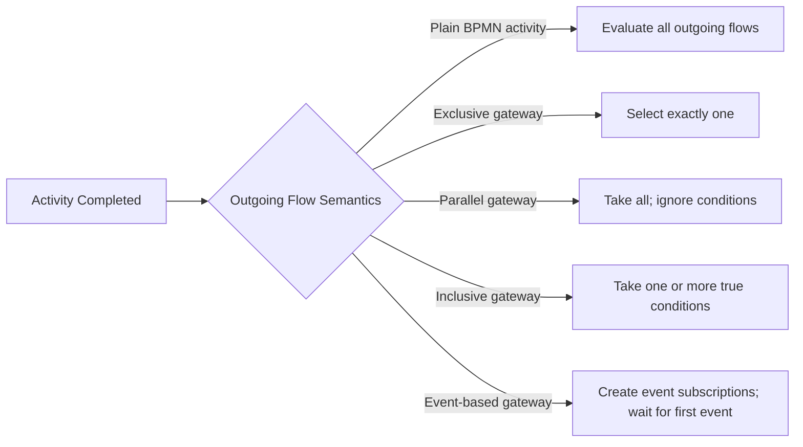

### 2.1 Token vs Execution vs Business State

Dalam percakapan sehari-hari, kita sering bilang “token bergerak”. Di Camunda 7, representasi internal yang lebih dekat adalah **execution tree**. Satu process instance memiliki root execution. Saat proses bercabang, engine dapat membuat child executions.

Namun sebagai modeler, lebih aman berpikir begini:

- **Token**: konsep BPMN untuk menunjukkan posisi eksekusi proses.
- **Execution**: struktur runtime Camunda yang menyimpan posisi dan scope.
- **Business state**: status domain yang mungkin disimpan di aplikasi Anda, bukan otomatis sama dengan token position.

Anti-pattern besar: menganggap “case status” sama dengan posisi token. Untuk proses kompleks, satu case bisa punya beberapa active tasks, timer, message subscription, dan recovery path sekaligus.

---

## 3. Gateway Decision Matrix

Gunakan matrix ini sebelum memilih gateway.

| Gateway | Pertanyaan bisnis | Jumlah jalur aktif | Join semantics | Risiko utama |
|---|---|---:|---|---|
| Exclusive / XOR | “Pilih tepat satu jalur berdasarkan data” | 1 | Tidak wajib join khusus | Condition overlap, XML order dependency |
| Parallel | “Semua jalur harus berjalan” | Semua outgoing | Tunggu token sebanyak incoming flow | Deadlock bila join tidak sesuai struktur aktual |
| Inclusive | “Satu atau lebih jalur bisa berjalan” | Semua outgoing yang condition true | Tunggu jalur incoming yang memang punya token | Sulit dipahami dan sulit diuji |
| Event-based | “Jalur ditentukan oleh event pertama yang terjadi” | 1 setelah event menang | Wait state + event subscriptions | Race event, salah pakai signal/message |

Rule praktis:

1. Pakai **exclusive gateway** untuk mutually exclusive business decision.
2. Pakai **parallel gateway** untuk pekerjaan yang semuanya wajib terjadi.
3. Pakai **inclusive gateway** hanya bila benar-benar ada kombinasi branch opsional yang legitimate.
4. Pakai **event-based gateway** bila keputusan tidak berdasarkan data saat ini, tetapi berdasarkan event yang akan datang.

---

## 4. Exclusive Gateway: “Exactly One Path”

Exclusive gateway, sering disebut XOR gateway, memilih **satu** outgoing sequence flow.

Camunda 7 mengevaluasi outgoing sequence flow berdasarkan urutan definisi di XML. Flow pertama yang condition-nya true akan dipilih. Jika beberapa condition true, hanya flow pertama yang dipakai. Jika tidak ada yang true dan tidak ada default flow, engine melempar runtime exception.

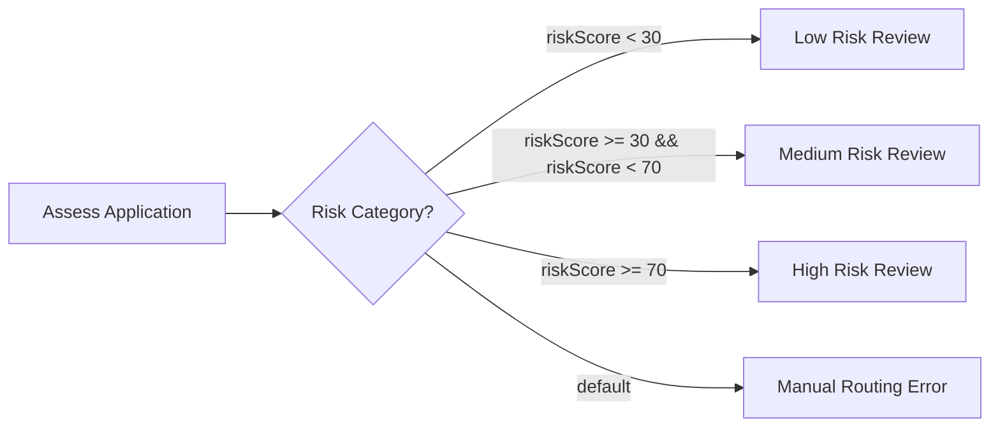

### 4.1 XOR Is Not “Evaluate Best Match”

XOR bukan decision table. XOR tidak otomatis memilih condition paling spesifik. XOR memilih flow pertama yang true menurut urutan XML.

Contoh buruk:

```xml
<exclusiveGateway id="riskDecision" default="manualReview" />

<sequenceFlow id="flowMedium" sourceRef="riskDecision" targetRef="mediumReview">
  <conditionExpression xsi:type="tFormalExpression">
    ${riskScore >= 30}
  </conditionExpression>
</sequenceFlow>

<sequenceFlow id="flowHigh" sourceRef="riskDecision" targetRef="highReview">
  <conditionExpression xsi:type="tFormalExpression">
    ${riskScore >= 70}
  </conditionExpression>
</sequenceFlow>

<sequenceFlow id="manualReview" sourceRef="riskDecision" targetRef="manualReviewTask" />
```

Jika `riskScore = 90`, `flowMedium` dan `flowHigh` sama-sama true. Karena `flowMedium` didefinisikan lebih dulu, jalur high risk tidak pernah tercapai.

Versi lebih aman:

```xml
<exclusiveGateway id="riskDecision" default="manualReview" />

<sequenceFlow id="flowHigh" sourceRef="riskDecision" targetRef="highReview">
  <conditionExpression xsi:type="tFormalExpression">
    ${riskScore >= 70}
  </conditionExpression>
</sequenceFlow>

<sequenceFlow id="flowMedium" sourceRef="riskDecision" targetRef="mediumReview">
  <conditionExpression xsi:type="tFormalExpression">
    ${riskScore >= 30 && riskScore < 70}
  </conditionExpression>
</sequenceFlow>

<sequenceFlow id="flowLow" sourceRef="riskDecision" targetRef="lowReview">
  <conditionExpression xsi:type="tFormalExpression">
    ${riskScore < 30}
  </conditionExpression>
</sequenceFlow>

<sequenceFlow id="manualReview" sourceRef="riskDecision" targetRef="manualReviewTask" />
```

Namun versi terbaik untuk domain kompleks sering kali bukan condition expression panjang di BPMN. Gunakan DMN atau domain service untuk menghasilkan satu variable routing yang eksplisit.

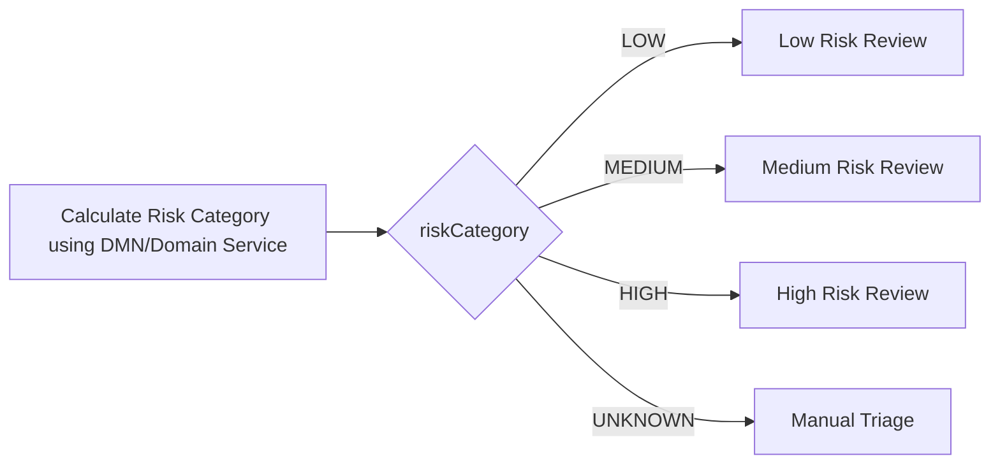

### 4.2 XOR Modeling Rules

Untuk model produksi:

1. **Condition harus mutually exclusive** atau urutan XML harus dianggap sebagai bagian dari kontrak.
2. **Default flow wajib ada** kecuali model memang sengaja gagal bila input tidak valid.
3. Nama label flow harus cocok dengan expression aktual. Label manusia seperti “High Risk” tidak berarti apa pun bagi engine.
4. Jangan simpan business rule besar di expression BPMN.
5. Test setiap branch, termasuk default branch.

### 4.3 XOR Anti-Patterns

#### Anti-pattern: Overlapping Condition

```txt
approved == true
amount > 1000
```

Dua condition ini tidak saling eksklusif. Jika keduanya true, hasil bergantung pada urutan XML.

#### Anti-pattern: No Default Flow

Tanpa default, input yang tidak cocok menjadi runtime exception. Kadang ini benar untuk programming invariant, tetapi buruk untuk proses bisnis long-running yang seharusnya masuk manual triage.

#### Anti-pattern: Business Rule in UEL Jungle

```xml
${applicant.age > 21 && applicant.score > 700 && !applicant.blacklisted && country == 'ID' && product.type == 'A' && ...}
```

Ini sulit diuji, sulit di-review oleh business, sulit dimigrasi, dan mudah pecah saat object model berubah.

### 4.4 XOR Testing Pattern

Contoh test mental model:

```java
@Test
void routesHighRiskCaseToHighRiskReview() {
  ProcessInstance instance = runtimeService.startProcessInstanceByKey(
      "caseReview",
      Variables.createVariables()
          .putValue("riskScore", 90)
  );

  Task task = taskService.createTaskQuery()
      .processInstanceId(instance.getId())
      .singleResult();

  assertThat(task.getTaskDefinitionKey()).isEqualTo("highRiskReview");
}
```

Tambahkan test untuk boundary value:

| `riskScore` | Expected path |
|---:|---|
| 0 | low |
| 29 | low |
| 30 | medium |
| 69 | medium |
| 70 | high |
| null | manual triage atau validation failure |

---

## 5. Default Flow: The “Else” With Operational Meaning

Default flow adalah sequence flow yang diambil ketika tidak ada condition lain yang true.

Secara teknis, default flow mencegah runtime exception. Secara operasional, default flow adalah **jalan pemulihan ketika asumsi routing tidak terpenuhi**.

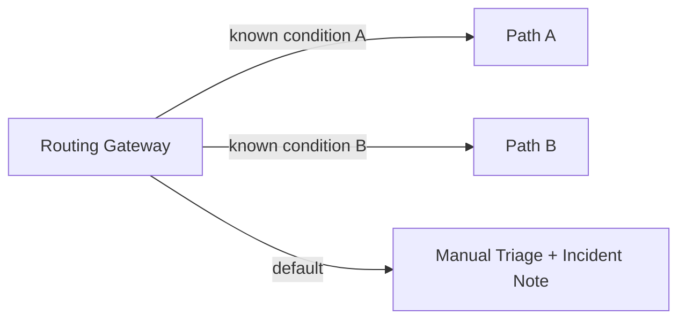

### 5.1 Default Flow Should Not Hide Data Quality Problems

Default flow jangan langsung menuju “approved” atau “continue normally”. Default flow harus menuju salah satu dari:

- manual triage,
- validation error path,
- technical incident path,
- business exception path,
- rejected due to incomplete data.

Default flow adalah kesempatan untuk membuat failure eksplisit.

### 5.2 Pattern: Explicit Unknown State

Daripada ini:

```txt
if high -> high
if medium -> medium
else -> low
```

Lebih baik ini:

```txt
if HIGH -> high
if MEDIUM -> medium
if LOW -> low
else -> manual triage
```

Kenapa? Karena unknown bukan low. Dalam sistem regulatory, salah mengklasifikasikan unknown sebagai low risk adalah failure defensibility.

---

## 6. Parallel Gateway: “All Paths”

Parallel gateway digunakan untuk membuat semua outgoing path aktif atau menunggu semua incoming path.

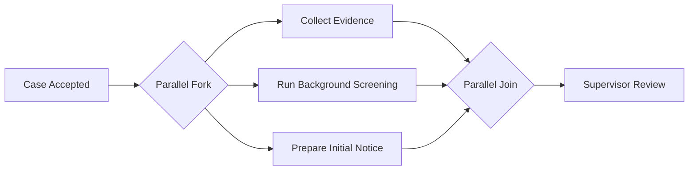

Saat fork, semua outgoing sequence flow diikuti. Saat join, execution yang sampai di gateway menunggu sampai jumlah token yang datang setara dengan jumlah incoming flow.

### 6.1 Parallel Gateway Ignores Conditions

Condition pada sequence flow setelah parallel gateway tidak digunakan untuk memilih jalur. Parallel gateway bukan “if both true then run both”. Ia berarti “run all outgoing paths”.

Salah:

```xml
<parallelGateway id="fork" />
<sequenceFlow sourceRef="fork" targetRef="collectEvidence">
  <conditionExpression xsi:type="tFormalExpression">${needsEvidence}</conditionExpression>
</sequenceFlow>
<sequenceFlow sourceRef="fork" targetRef="screening">
  <conditionExpression xsi:type="tFormalExpression">${needsScreening}</conditionExpression>
</sequenceFlow>
```

Condition tersebut mengirim sinyal yang salah kepada reviewer. Gunakan inclusive gateway bila cabang opsional.

### 6.2 Fork and Join Are Independent

Parallel gateway tidak harus “balanced” secara visual. BPMN membolehkan struktur yang tidak simetris, tetapi untuk maintainability, model produksi sebaiknya tetap eksplisit.

Model yang legal belum tentu mudah dioperasikan.

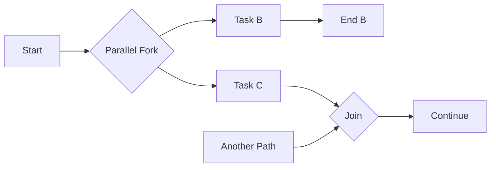

Model seperti ini bisa legal, tetapi reviewer harus memahami apakah `D` memang selalu dapat mengirim token. Jika tidak, `J` bisa menunggu selamanya.

### 6.3 Parallel Join Deadlock

Deadlock model-level terjadi ketika join menunggu token yang tidak mungkin datang.

Contoh buruk:

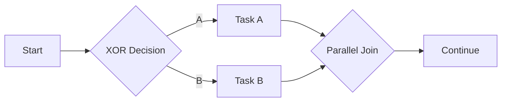

XOR hanya mengaktifkan satu branch, tetapi parallel join punya dua incoming flow. Join menunggu token sebanyak incoming flow. Akibatnya, proses stuck.

Versi benar:

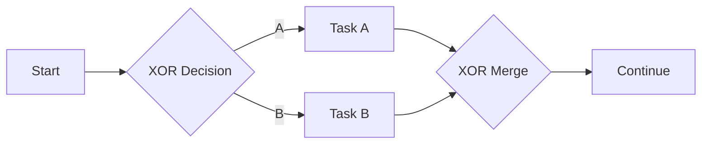

Jika decision-nya XOR, merge-nya biasanya XOR merge atau simple merge, bukan parallel join.

### 6.4 Parallel Gateway and Transaction Boundaries

Parallel gateway tidak otomatis berarti multi-threaded execution. Dalam Camunda 7, proses berjalan di thread yang memanggil engine sampai mencapai wait state atau async boundary. Jika fork langsung menuju beberapa service task synchronous, semua masih bisa dieksekusi dalam satu command/transaction secara berurutan secara internal.

Untuk kerja yang benar-benar dipisah secara operasional, letakkan `camunda:asyncBefore="true"` atau `camunda:asyncAfter="true"` di titik yang tepat. Detail transaction boundary akan dibahas lebih dalam di Part 011.

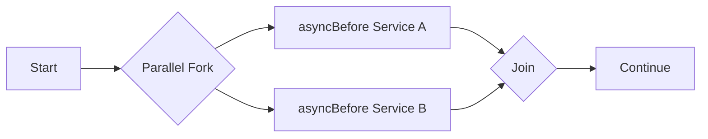

Dengan async boundary, engine membuat job. Job executor dapat mengambil job tersebut secara terpisah.

### 6.5 Parallel Gateway Modeling Rules

1. Gunakan parallel gateway hanya bila semua branch wajib terjadi.
2. Jangan taruh condition pada outgoing flow dari parallel gateway.
3. Pastikan join hanya menunggu branch yang memang selalu aktif.
4. Tambahkan async boundary bila branch melakukan kerja eksternal atau long-running.
5. Pastikan delegate/service task di parallel branch idempotent.
6. Test jumlah active task/job setelah fork.

### 6.6 Parallel Gateway Anti-Patterns

#### Anti-pattern: Parallel for Visual Layout

Beberapa modeler memakai parallel gateway untuk membuat diagram terlihat rapi. Ini berbahaya karena parallel gateway mengubah runtime semantics.

#### Anti-pattern: Join After Optional Branches

Jika branch optional, jangan join dengan parallel gateway kecuali semua branch optional tersebut dipastikan punya token.

#### Anti-pattern: Assuming Parallel Means Concurrent Threads

Parallel token bukan jaminan concurrent thread. Concurrency aktual bergantung pada wait state, async continuation, job executor, dan transaction boundary.

---

## 7. Inclusive Gateway: “One or More Paths”

Inclusive gateway adalah gabungan konsep XOR dan parallel: ia mengevaluasi condition seperti XOR, tetapi bisa mengambil lebih dari satu outgoing flow. Saat join, ia menunggu incoming flow yang memang memiliki token.

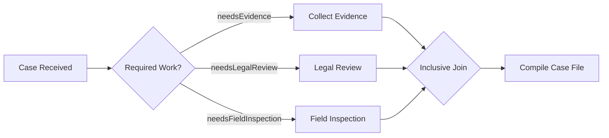

Jika case hanya perlu evidence dan legal review, inclusive join menunggu dua branch tersebut, bukan field inspection.

### 7.1 When Inclusive Gateway Is Appropriate

Gunakan inclusive gateway saat:

- nol branch tidak boleh terjadi, kecuali ada default/manual path,
- satu atau lebih branch dapat aktif,
- branch aktif ditentukan oleh condition pada saat gateway dieksekusi,
- semua branch aktif harus diselesaikan sebelum lanjut.

Contoh regulatory:

```txt
Jika case melibatkan produk finansial -> legal review.
Jika ada indikasi fraud -> enforcement review.
Jika data pelapor tidak lengkap -> data completion task.
Jika ada cross-entity impact -> cross-entity coordination.
```

Satu case bisa membutuhkan beberapa dari jalur ini sekaligus.

### 7.2 Inclusive Gateway Is Powerful but Expensive Cognitively

Inclusive join membutuhkan engine menentukan incoming flow mana yang aktif. Ini lebih kompleks dibanding XOR dan parallel.

Gunakan inclusive gateway hanya ketika ia memodelkan realitas bisnis yang nyata. Jika hanya ada dua branch dan kombinasi kecil, kadang model dengan XOR + subprocess lebih mudah dibaca.

### 7.3 Inclusive Join Pitfalls

#### Pitfall: Branch Condition Changes Later

Inclusive gateway menentukan branch yang aktif saat fork dieksekusi. Jika variable berubah setelah fork, join tidak “mengevaluasi ulang” keputusan awal sebagai business decision baru.

Contoh:

```txt
At fork: needsLegalReview = false
After evidence collection: needsLegalReview becomes true
```

Inclusive join tidak tiba-tiba menunggu legal review yang tidak pernah dibuat. Jika business rule bisa berubah, modelkan re-evaluation eksplisit.

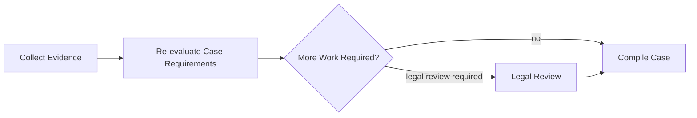

#### Pitfall: No Default Flow

Jika semua condition false dan tidak ada default, engine melempar exception. Untuk proses bisnis, lebih baik default ke manual triage.

#### Pitfall: Mixing Optional and Mandatory Branches Without Naming

Jika branch wajib dan optional bercampur, beri nama gateway dan flow secara eksplisit.

```txt
Gateway name: Determine Required Case Preparation Work
Flow labels:
- Evidence required because allegation has attachments
- Legal review required because sanction may be imposed
- Field inspection required because physical site is involved
```

### 7.4 Inclusive Gateway Testing Matrix

Jika ada tiga optional branch, jangan hanya test satu kombinasi. Minimal test:

| needsEvidence | needsLegal | needsInspection | Expected active tasks |
|---|---|---|---|
| true | false | false | Evidence |
| false | true | false | Legal |
| false | false | true | Inspection |
| true | true | false | Evidence + Legal |
| true | false | true | Evidence + Inspection |
| false | true | true | Legal + Inspection |
| true | true | true | Evidence + Legal + Inspection |
| false | false | false | Manual triage/default |

The top 1% behavior here is not merely drawing inclusive gateway. It is building the test matrix that proves the gateway cannot strand tokens.

---

## 8. Event-Based Gateway: “The First Event Wins”

Event-based gateway digunakan ketika jalur tidak ditentukan oleh data saat ini, tetapi oleh event yang akan terjadi.

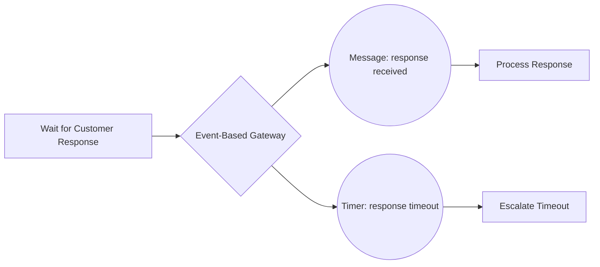

Saat execution mencapai event-based gateway:

1. execution berhenti di wait state,
2. engine membuat event subscription untuk outgoing event,
3. event pertama yang terjadi menentukan jalur,
4. subscription lain dibatalkan.

### 8.1 Event-Based Gateway Restrictions

Dalam Camunda 7, outgoing flow dari event-based gateway harus menuju intermediate catch event. Receive task setelah event-based gateway tidak didukung. Intermediate catch event yang mengikuti event-based gateway harus punya single incoming sequence flow.

Ini penting karena event-based gateway bukan “gateway biasa dengan event di sebelahnya”. Gateway ini membangun subscription set.

### 8.2 Message vs Timer Race

Contoh umum:

```txt
Tunggu respons customer paling lama 5 hari.
Jika message datang dulu, lanjut process response.
Jika timer menang, escalate.
```

Race condition realistis:

- Timer due pada 10:00:00.
- Message masuk pada 10:00:01.
- Job executor belum mengeksekusi timer job sampai 10:00:05.

Secara bisnis, apakah message dianggap terlambat atau masih diterima? Jawaban ini tidak boleh dibiarkan implisit. Anda perlu policy:

| Policy | Implementation idea |
|---|---|
| Strict due date | Adapter cek timestamp message dan reject jika after due date |
| Engine-first-wins | Event yang pertama dikorelasi/dieksekusi menang |
| Grace period | Timer diset dengan buffer atau message adapter punya tolerance |
| Manual resolution | Late message masuk review task |

### 8.3 Event-Based Gateway Is Not XOR

XOR decision berbasis data yang sudah tersedia.

Event-based decision berbasis event yang belum terjadi.

Salah:

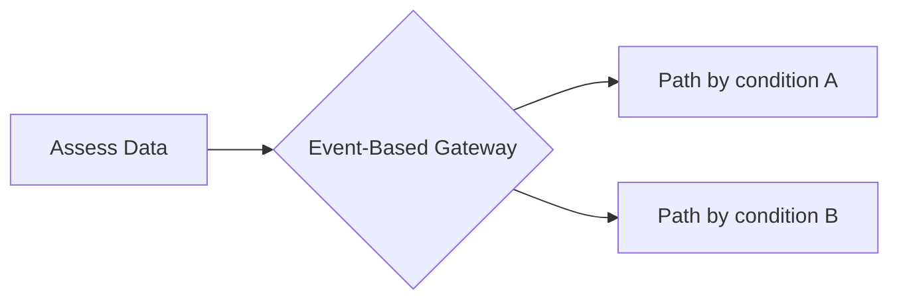

Benar:

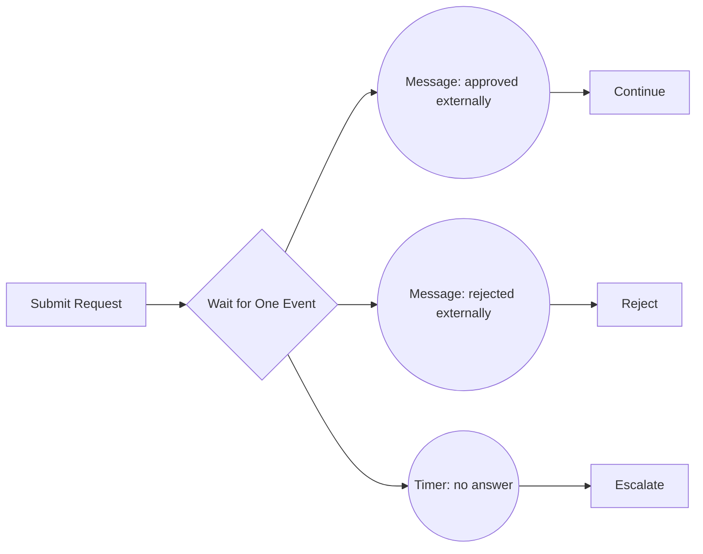

### 8.4 Event-Based Gateway and Correlation

Message catch event di belakang event-based gateway harus bisa dikorelasikan secara deterministik.

Minimal correlation design:

```java
runtimeService.createMessageCorrelation("ExternalApprovalReceived")
    .processInstanceBusinessKey(caseId)
    .setVariable("externalApprovalId", approvalId)
    .correlateWithResult();
```

Lebih baik lagi, gunakan correlation keys yang stabil dan unik:

```java
runtimeService.createMessageCorrelation("ExternalApprovalReceived")
    .processInstanceBusinessKey(caseId)
    .processInstanceVariableEquals("externalRequestId", externalRequestId)
    .correlateWithResult();
```

Anti-pattern: korelasi hanya berdasarkan message name. Jika ada banyak instance menunggu message yang sama, korelasi menjadi ambigu.

### 8.5 Event-Based Gateway Modeling Rules

1. Pakai hanya saat “first event wins” memang benar secara bisnis.
2. Gunakan message untuk targeted recipient, signal untuk broadcast.
3. Selalu definisikan correlation key strategy.
4. Tentukan policy untuk late event.
5. Test event order: message-first, timer-first, duplicate-message, late-message.
6. Jangan pakai receive task langsung setelah event-based gateway di Camunda 7.

---

## 9. Message, Signal, and Gateway Choice

Banyak bug produksi bukan karena gateway-nya salah, tetapi karena event type yang dipilih salah.

| Need | Use | Jangan gunakan |
|---|---|---|
| Satu process instance tertentu menerima event | Message | Signal |
| Semua process instance yang subscribe harus tahu | Signal | Message |
| Tunggu timeout | Timer | Polling delegate |
| Menunggu salah satu dari beberapa event | Event-based gateway | XOR gateway |
| Menangani business error dari activity | BPMN error boundary | Signal |

Signal memiliki broadcast semantics. Jika Anda memakai signal untuk event targeted seperti “payment received for invoice 123”, semua instance yang menunggu signal itu dapat menerima event. Itu bisa fatal.

---

## 10. Gateway and Wait State Interaction

Tidak semua gateway adalah wait state.

| Element | Usually wait state? | Notes |
|---|---|---|
| Exclusive gateway | No | Evaluasi langsung dalam command yang sama |
| Parallel gateway fork | No | Membuat jalur execution |
| Parallel gateway join | Can wait | Menunggu token lain |
| Inclusive gateway fork | No | Evaluasi condition langsung |
| Inclusive gateway join | Can wait | Menunggu branch aktif |
| Event-based gateway | Yes | Membuat subscription dan suspend execution |

Kenapa ini penting?

- Jika gateway bukan wait state, exception dapat rollback semua state sejak transaction boundary terakhir.
- Jika event-based gateway adalah wait state, state process tersimpan dan engine menunggu event eksternal.
- Jika join gateway menunggu token, instance terlihat aktif tetapi tidak ada user task di downstream.

---

## 11. Gateway and Incidents

Gateway bisa menyebabkan incident atau runtime failure tidak langsung.

Contoh:

| Gateway failure | Runtime symptom | Typical fix |
|---|---|---|
| XOR no condition true, no default | Exception during execution | Add default/manual path or validate input earlier |
| Parallel join after XOR split | Process stuck at join | Replace join with XOR merge or remodel fork |
| Inclusive all conditions false | Exception | Add default path |
| Ambiguous message correlation after event-based gateway | Correlation exception | Add business key/correlation keys |
| Signal used for targeted event | Many instances continue unexpectedly | Replace with message event |
| Async branch throws exception | Failed job/incident | Retry policy + idempotent delegate |

The mature engineer does not ask only “is the BPMN valid?” They ask: **what will production support see when this assumption fails?**

---

## 12. Modeling Patterns

### 12.1 Pattern: Decision Variable Before XOR

Use DMN/domain service to calculate routing once.

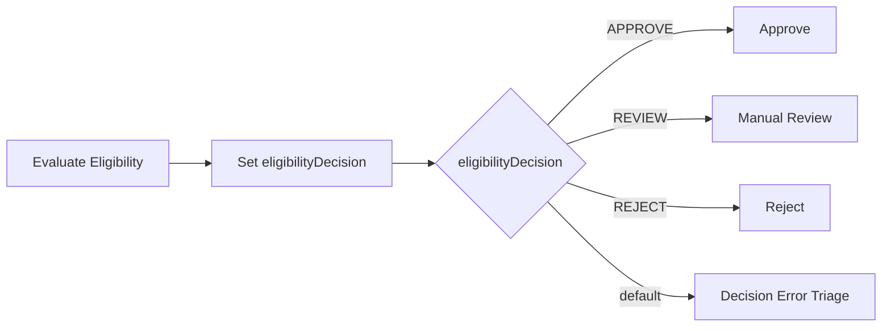

Advantages:

- Gateway expressions simple.
- Business rules are testable separately.
- BPMN stays readable.
- Migration is easier.

### 12.2 Pattern: Parallel Mandatory Work

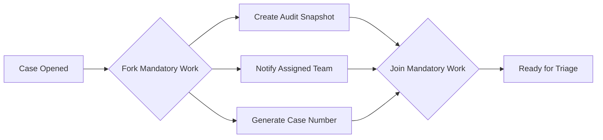

Use when all branches must complete before downstream work.

### 12.3 Pattern: Optional Work With Inclusive Gateway

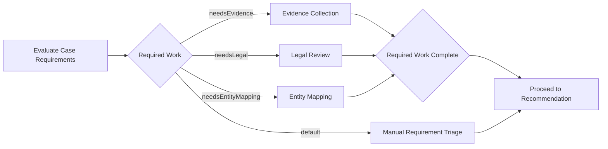

Important: decide whether manual triage should join with optional work or replace it.

### 12.4 Pattern: Timeout Race

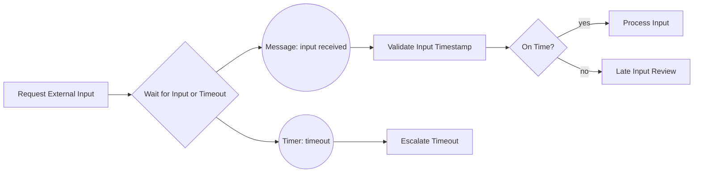

This makes late message policy explicit instead of relying on job executor timing.

---

## 13. Anti-Pattern Catalog

### 13.1 Gateway Without Business Question

Bad smell: gateway label says “Decision?”

Better: gateway label asks a domain question.

```txt
Bad: Decision?
Good: Is case eligible for fast-track closure?
```

### 13.2 Gateway Without Exhaustive Outcome

Every gateway should have known outcomes plus a deliberate unknown/error path.

### 13.3 Parallel Gateway Used as Diagram Join

A parallel join is not a visual merge. It is a runtime wait condition.

### 13.4 Inclusive Gateway Used Because “Maybe Multiple”

Inclusive gateway requires a clear test matrix. If nobody can list valid branch combinations, the model is not ready.

### 13.5 Event-Based Gateway Without Correlation Policy

Event-based gateway creates subscriptions. If event ingestion cannot target the right instance, the model is incomplete.

### 13.6 Signal for Targeted Domain Event

Signal is broadcast. Targeted business event should usually be message.

### 13.7 No Test for Default Flow

Default flow often contains the most important production recovery path. Test it.

---

## 14. Production Review Checklist

Before approving a BPMN model with gateways, ask:

1. For each gateway, what exact business question does it answer?
2. Are XOR conditions mutually exclusive?
3. Does every XOR/inclusive gateway have a default or explicit failure path?
4. Does every parallel join receive tokens from branches that are guaranteed active?
5. Does every inclusive join have a test matrix?
6. Are branch variable names stable and versioned?
7. Are external event correlations deterministic?
8. Is late/duplicate event handling defined?
9. Are async boundaries placed where external calls or long work happen?
10. Can support engineers explain why an instance is waiting?

---

## 15. Practice Lab

### Lab 1 — Predict Active Tasks

Model:

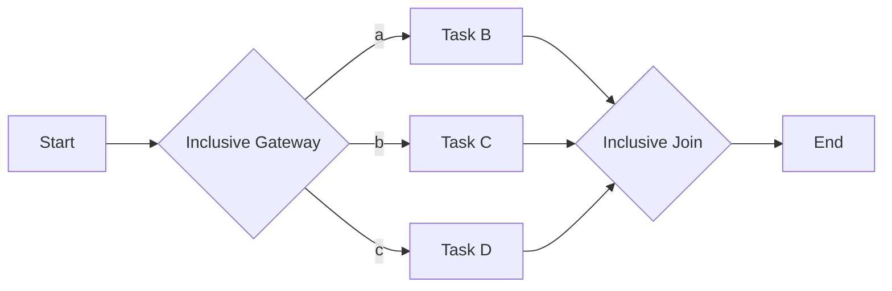

Variables:

```json
{
  "a": true,
  "b": false,
  "c": true
}
```

Question:

- How many active tasks after fork?
- Which tasks?
- What happens when only Task B completes?
- What happens when Task D completes?

Expected reasoning:

- Task B and Task D are active.
- Join waits until both active branches arrive.
- Completing only B leaves process waiting.
- Completing D allows join to continue.

### Lab 2 — Find the Deadlock

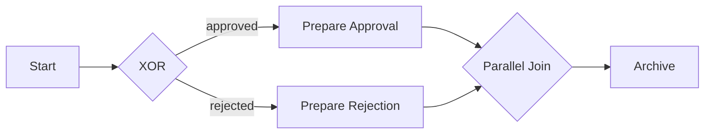

Problem:

XOR creates one token. Parallel join waits for two incoming tokens. The process can become stuck.

Fix:

Use XOR merge/simple merge.

### Lab 3 — Design Late Event Policy

Scenario:

- A party has 10 working days to respond.
- The response arrives 2 minutes after timer job due date but before job executor fires the timeout path.

Define:

- strict vs grace policy,
- where timestamp is validated,
- what BPMN path handles late response,
- audit message shown to user.

---

## 16. Key Takeaways

1. Gateway semantics define runtime behavior, not diagram decoration.
2. XOR selects exactly one flow; overlapping conditions depend on XML order.
3. Parallel gateway means all outgoing paths, and conditions are ignored.
4. Inclusive gateway means one or more paths, but demands careful test matrices.
5. Event-based gateway waits for the first event and creates subscriptions.
6. Message is targeted; signal is broadcast.
7. Default flows are operational recovery paths.
8. The right question is not “is the BPMN valid?” but “can this process fail safely and be explained under audit?”

---

## References

- Camunda 7.24 Docs — Data-based Exclusive Gateway: https://docs.camunda.org/manual/7.24/reference/bpmn20/gateways/exclusive-gateway/
- Camunda 7.24 Docs — Conditional and Default Sequence Flows: https://docs.camunda.org/manual/7.24/reference/bpmn20/gateways/sequence-flow/
- Camunda 7.24 Docs — Parallel Gateway: https://docs.camunda.org/manual/7.24/reference/bpmn20/gateways/parallel-gateway/
- Camunda 7.24 Docs — Inclusive Gateway: https://docs.camunda.org/manual/7.24/reference/bpmn20/gateways/inclusive-gateway/
- Camunda 7.24 Docs — Event-based Gateway: https://docs.camunda.org/manual/7.24/reference/bpmn20/gateways/event-based-gateway/
- Camunda 7.24 Docs — Message Events: https://docs.camunda.org/manual/7.24/reference/bpmn20/events/message-events/
- Camunda 7.24 Docs — Signal Events: https://docs.camunda.org/manual/7.24/reference/bpmn20/events/signal-events/
