------
title: Learn Java BPMN with Camunda BPM Platform 7 - Part 006
description: Advanced Camunda 7 BPMN event semantics: timer, message, signal, error, escalation, boundary events, event subprocess, correlation, retry policy, and production failure modeling.
series: learn-java-bpmn-camunda7
seriesTitle: Learn Java BPMN with Camunda BPM Platform 7
order: 6
partTitle: Events Deep Dive: Timers, Messages, Signals, Errors, Escalations
tags:
- java
- bpmn
- camunda
- camunda-7
- workflow
- event
- timer
- message-correlation
- error-handling
- series
date: 2026-06-27
------

# Part 006 — Events Deep Dive: Timers, Messages, Signals, Errors, Escalations

Part ini membahas BPMN events di Camunda 7 sebagai mekanisme produksi untuk **menunggu, menerima, melempar, membatalkan, mengeskalasi, dan memulihkan proses**.

Di level awal, event sering dianggap sebagai “ikon lingkaran di BPMN”. Di level top engineer, event adalah kontrak runtime yang menentukan:

- kapan process instance menjadi wait state,
- apa yang disimpan sebagai event subscription,
- siapa yang boleh mengirim event,
- bagaimana event dikorelasikan,
- apakah activity dibatalkan atau tetap berjalan,
- apakah failure dianggap business outcome atau technical incident,
- bagaimana audit trail menjelaskan alasan jalur proses berubah.

> Mental model utama: event bukan notifikasi. Event adalah **perubahan kontrol eksekusi** yang punya efek terhadap token, scope, transaction boundary, subscription, job, dan recovery semantics.

---

## 1. Kaufman Skill Deconstruction

Untuk menguasai events, pecah skill besar menjadi sub-skill berikut:

| Sub-skill | Yang harus bisa dilakukan | Failure signal |
|---|---|---|
| Membedakan catch vs throw | Menjelaskan siapa menunggu dan siapa memicu event | Model memakai throw event saat butuh wait state |
| Membedakan interrupting vs non-interrupting | Menentukan apakah activity utama dibatalkan | SLA reminder tanpa sengaja membatalkan user task |
| Mendesain timer | Memilih `timeDate`, `timeDuration`, atau `timeCycle` | Timer fire tidak sesuai business expectation |
| Mendesain message correlation | Menggunakan business key dan correlation key yang deterministik | Correlation ambiguous atau salah instance |
| Membedakan message vs signal | Targeted vs broadcast | Semua instance lanjut karena signal salah pakai |
| Membedakan BPMN error vs Java exception | Business error vs technical failure | Technical exception dijadikan business path |
| Mendesain escalation | Memberi tahu parent scope tanpa selalu membatalkan child flow | Semua escalation dimodelkan sebagai error |
| Mendesain event subprocess | Menangani event scoped secara interrupting/non-interrupting | Cross-cutting timeout dibuat dengan spaghetti boundary events |

---

## 2. Event Taxonomy in Camunda 7

BPMN event bisa dipahami lewat tiga sumbu:

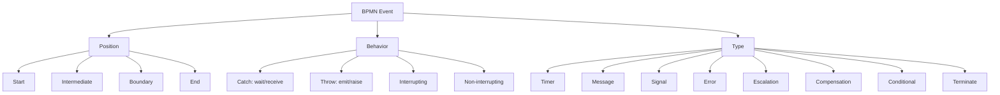

Tidak semua kombinasi valid. Contoh:

- Timer bisa start, intermediate catch, atau boundary.
- Message bisa start, intermediate catch/throw, boundary, end dalam beberapa konteks.
- Error start event hanya untuk event subprocess, bukan untuk memulai process instance biasa.
- Escalation sering dipakai untuk komunikasi dari subprocess ke parent scope.
- Boundary event menempel pada activity dan aktif selama activity tersebut aktif.

---

## 3. Catching vs Throwing Events

### 3.1 Catching Event

Catching event berarti process menunggu sesuatu.

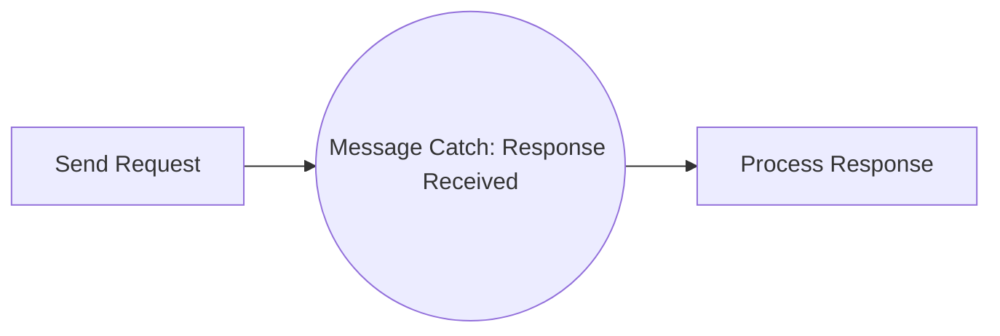

Runtime meaning:

- execution berhenti,
- process instance disimpan,
- event subscription dibuat,
- proses lanjut hanya ketika event dikirim/correlated.

### 3.2 Throwing Event

Throwing event berarti process memicu event.

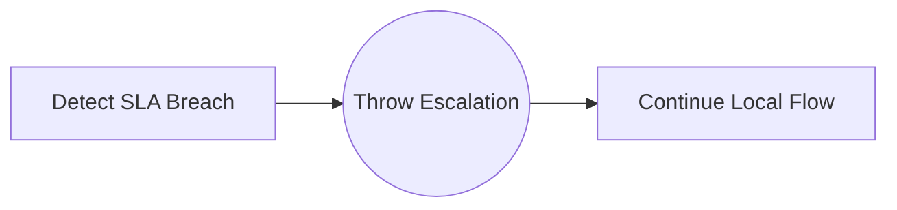

Runtime meaning tergantung event type:

- signal throw dapat broadcast signal,
- escalation throw dapat ditangkap oleh parent scope,
- error throw mencari error handler di scope atas,
- message throw secara BPMN merepresentasikan pengiriman message, tetapi integrasi teknis tetap perlu diimplementasikan oleh aplikasi/delegate/infrastruktur.

### 3.3 Common Confusion

Salah:

```txt
“Kita butuh menerima callback dari sistem eksternal, jadi pakai intermediate throw message.”
```

Benar:

```txt
Jika proses menunggu callback, gunakan intermediate catch message event atau receive task. Callback endpoint di aplikasi melakukan RuntimeService message correlation.
```

---

## 4. Boundary Events

Boundary event menempel pada activity. Ia aktif selama activity tersebut aktif.

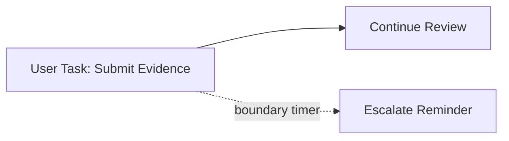

Boundary event bisa:

- **interrupting**: membatalkan activity utama,
- **non-interrupting**: membuat jalur tambahan tanpa membatalkan activity utama.

### 4.1 Interrupting Boundary Event

Interrupting boundary event cocok untuk timeout yang membatalkan pekerjaan utama.

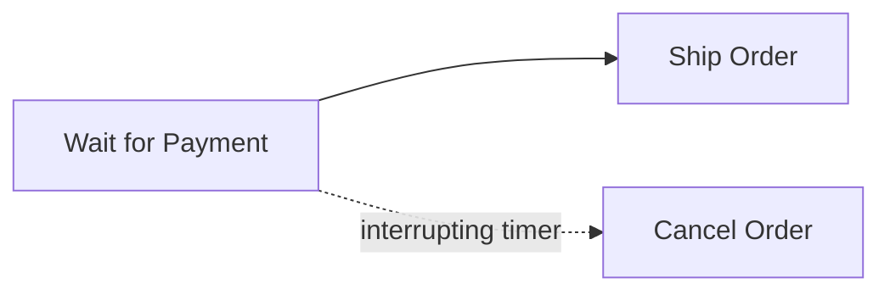

Jika timer fire, `Wait for Payment` dibatalkan dan token masuk ke `Cancel Order`.

### 4.2 Non-Interrupting Boundary Event

Non-interrupting boundary event cocok untuk reminder, escalation notice, atau monitoring side path.

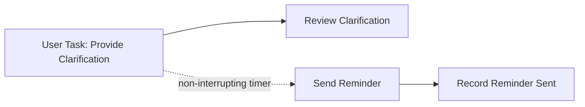

Activity utama tetap aktif. Jalur reminder berjalan tambahan.

### 4.3 Boundary Event Design Rule

Sebelum memasang boundary event, jawab:

1. Apakah activity utama harus dibatalkan?
2. Apakah event boleh terjadi berkali-kali?
3. Apakah jalur event harus join kembali dengan main flow?
4. Jika non-interrupting, bagaimana mencegah reminder spam?
5. Apa audit reason ketika event terjadi?

### 4.4 Boundary Event Anti-Patterns

#### Anti-pattern: SLA Reminder as Interrupting Timer

Reminder seharusnya tidak membatalkan task. Gunakan non-interrupting timer.

#### Anti-pattern: Timeout Path Without Audit Reason

Timeout yang mengubah case state harus mencatat alasan, due date, dan event time.

#### Anti-pattern: Boundary Event Everywhere

Jika banyak boundary event mengelilingi banyak task, pertimbangkan event subprocess atau reusable subprocess.

---

## 5. Timer Events

Timer events dipicu oleh waktu. Dalam Camunda 7, timer hanya fire jika job executor aktif. Timer dapat digunakan sebagai start event, intermediate event, atau boundary event. Boundary timer dapat interrupting atau non-interrupting.

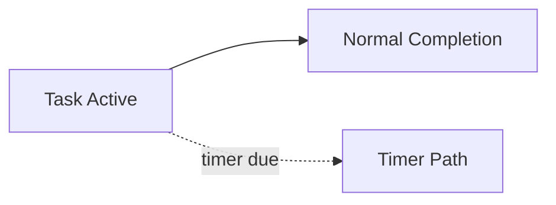

### 5.1 Timer Configuration Types

Camunda 7 mendukung tiga bentuk utama timer definition.

| Type | Meaning | Use case |
|---|---|---|
| `timeDate` | waktu absolut | Deadline pada tanggal tertentu |
| `timeDuration` | durasi relatif | Tunggu 3 hari sejak task aktif |
| `timeCycle` | repeated interval | Reminder berkala, scheduled start |

Contoh `timeDate`:

```xml
<timerEventDefinition>
  <timeDate>2026-07-01T10:00:00+07:00</timeDate>
</timerEventDefinition>
```

Contoh `timeDuration`:

```xml
<timerEventDefinition>
  <timeDuration>P10D</timeDuration>
</timerEventDefinition>
```

Contoh `timeCycle`:

```xml
<timerEventDefinition>
  <timeCycle>R3/PT24H</timeCycle>
</timerEventDefinition>
```

### 5.2 Timer Expressions

Timer dapat memakai expression berdasarkan process variable.

```xml
<boundaryEvent id="slaTimer" cancelActivity="true" attachedToRef="submitEvidenceTask">
  <timerEventDefinition>
    <timeDuration>${evidenceSubmissionDuration}</timeDuration>
  </timerEventDefinition>
</boundaryEvent>
```

Hati-hati: expression harus menghasilkan string waktu yang valid sesuai tipe timer. Jangan biarkan UI mengirim string bebas tanpa validasi domain.

### 5.3 Timer and Job Executor Mental Model

Timer bukan thread sleeping di dalam process instance. Timer direpresentasikan sebagai job dengan due date. Job executor mengambil job yang due lalu melanjutkan proses.

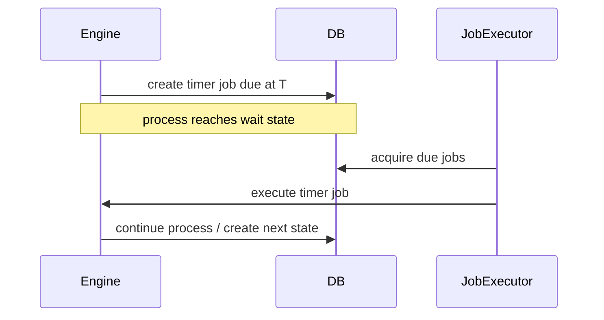

Konsekuensi:

- Timer tidak fire bila job executor tidak berjalan.
- Timer fire tidak selalu persis pada detik due date karena acquisition interval, cluster load, DB latency, lock contention.
- Timer harus dipahami sebagai “eligible to fire at due date”, bukan guaranteed real-time scheduler.

### 5.4 Timer Design Patterns

#### Pattern: Human Task SLA Reminder

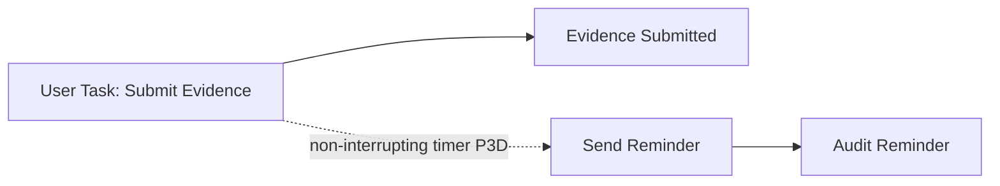

Use non-interrupting boundary timer.

#### Pattern: Hard Deadline

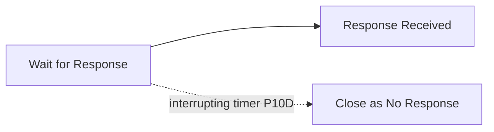

Use interrupting boundary timer only if main activity must be canceled.

#### Pattern: Repeated Reminder with Counter

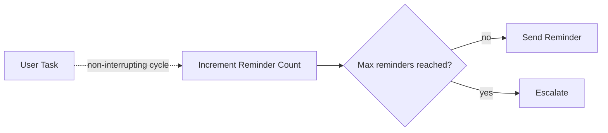

Do not rely only on infinite cycle. Add domain guard.

### 5.5 Timer Anti-Patterns

#### Anti-pattern: Real-Time Deadline Assumption

Do not assume timer fires at exact wall-clock second. If legal deadline requires strict timestamp, store due date and validate event timestamps in domain logic.

#### Anti-pattern: Infinite Timer Cycle Without Exit

Repeated timers can create operational noise. Always define max count, stop condition, or explicit escalation.

#### Anti-pattern: Timer as Polling Mechanism

Do not model “check external system every 5 minutes forever” inside BPMN unless you truly need audit-visible polling. Prefer external event push, worker polling outside BPMN, or scheduled ingestion service.

---

## 6. Message Events

Message events represent targeted communication. A message has a name and payload. Unlike signal, message is directed to a single recipient.

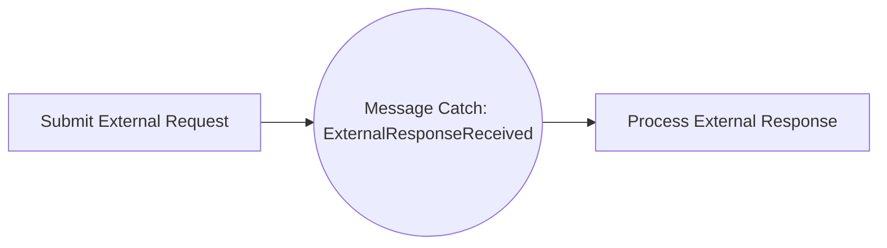

### 6.1 Message Reception Is Application Responsibility

Camunda engine does not automatically listen to your Kafka topic, REST endpoint, JMS queue, or webhook. Your application/infrastructure receives external input, validates it, then correlates it to the process engine.

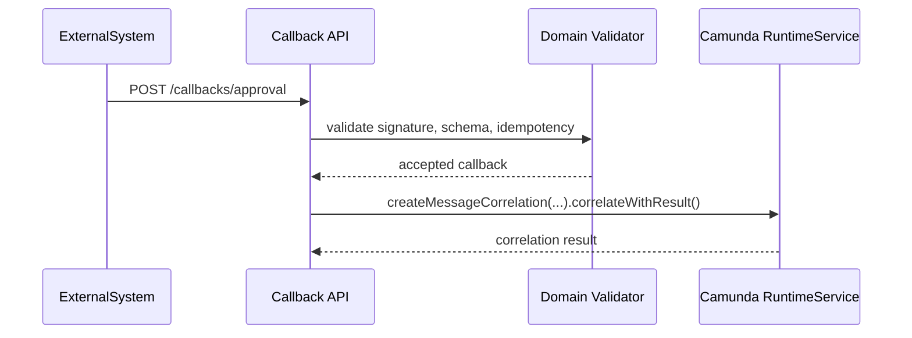

### 6.2 Correlation Strategy

A message correlation is successful when exactly one matching target exists, unless you intentionally use APIs that correlate to multiple targets.

Minimum correlation dimensions:

| Dimension | Purpose |
|---|---|
| message name | event type |
| business key | process/case identity |
| correlation keys | specific external request/payment/task identity |
| tenant id | multi-tenant isolation |
| process definition key | optional narrowing |

Example:

```java
MessageCorrelationResult result = runtimeService
    .createMessageCorrelation("ExternalApprovalReceived")
    .processInstanceBusinessKey(caseId)
    .processInstanceVariableEquals("externalRequestId", externalRequestId)
    .setVariable("approvalStatus", status)
    .setVariable("approvalReceivedAt", receivedAt)
    .correlateWithResult();
```

### 6.3 Business Key Is Not Enough

Business key usually identifies a case/process instance. It may not identify which pending event within the instance should receive a callback.

Example:

- one case sends two external requests,
- both wait for `ExternalResponseReceived`,
- same business key,
- different `externalRequestId`.

If correlation only uses business key, it can be ambiguous.

### 6.4 Message Name Design

Avoid overly generic message names.

Bad:

```txt
ResponseReceived
Callback
Update
Done
```

Better:

```txt
EvidenceProviderResponseReceived
PaymentAuthorizationCompleted
ExternalRiskAssessmentCompleted
InvestigationAssignmentAccepted
```

Message name should describe event type, not transport.

### 6.5 Duplicate Message Handling

External systems retry. Networks fail. Users double-submit. Workers crash after side effect but before acknowledge. Duplicate messages are normal.

Design options:

| Strategy | Where |
|---|---|
| Idempotency table | Application DB before correlation |
| Correlation key uniqueness | Domain model |
| Process variable guard | BPMN/domain service |
| Dead-letter for duplicate after process moved on | Ingestion service |

Pseudo-code:

```java
@Transactional
public void receiveExternalApproval(ApprovalCallback callback) {
  if (callbackRepository.alreadyProcessed(callback.id())) {
    return;
  }

  callbackRepository.recordReceived(callback.id(), callback.caseId());

  runtimeService.createMessageCorrelation("ExternalApprovalReceived")
      .processInstanceBusinessKey(callback.caseId())
      .processInstanceVariableEquals("externalRequestId", callback.requestId())
      .setVariable("approvalStatus", callback.status())
      .correlateWithResult();

  callbackRepository.markCorrelated(callback.id());
}
```

### 6.6 Message Event Anti-Patterns

#### Anti-pattern: Correlate by Message Name Only

This works in demos and fails in production.

#### Anti-pattern: External Callback Directly Calls Engine Without Domain Validation

Always validate schema, signature, idempotency, tenant, and case state before correlation.

#### Anti-pattern: Message Name Contains Environment or Version Noise

Avoid:

```txt
dev_payment_response_v2_new_final
```

Use stable event names and version payload contracts separately.

---

## 7. Signal Events

Signal events are broadcast. A signal is global scope and delivered to all active handlers.

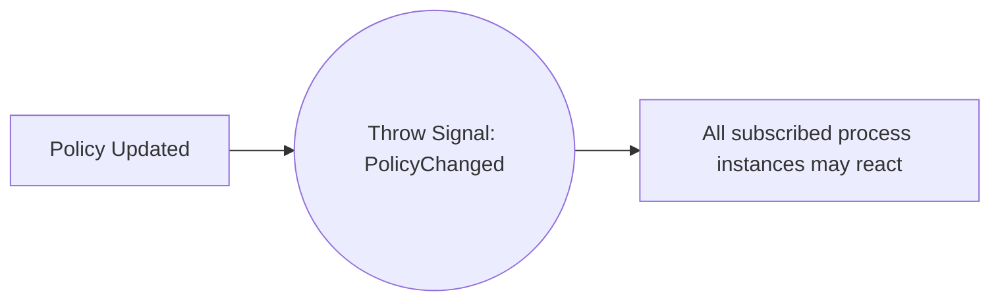

### 7.1 Signal Semantics

Signal is useful when one event should notify multiple process instances or process definitions.

Examples:

- regulatory policy changed,
- global operational freeze activated,
- market-wide event requires all open cases to re-evaluate,
- system maintenance notice should trigger waiting processes.

But signal is dangerous for targeted business events.

### 7.2 Message vs Signal

| Scenario | Correct event |
|---|---|
| Payment received for invoice 123 | Message |
| Approval received for case ABC | Message |
| Policy changed and all open cases must re-evaluate | Signal |
| Broadcast shutdown notice to waiting processes | Signal |
| One external worker reports task completion | Message/external task completion, not signal |

### 7.3 Signal Anti-Patterns

#### Anti-pattern: Signal for Specific Case

If you throw `PaymentReceived`, every instance waiting for `PaymentReceived` may continue. That can create severe data integrity issues.

#### Anti-pattern: Global Signal Without Tenant Isolation

In multi-tenant environments, signal design must consider tenant boundaries. A global signal can cross more scope than intended if not constrained by architecture and authorization.

#### Anti-pattern: Signal as Event Bus Replacement

Camunda signal is not a general-purpose pub/sub broker. Use it only when process-level broadcast semantics are intended.

---

## 8. BPMN Error Events

BPMN error is for **business errors**, not technical exceptions.

Camunda documentation explicitly distinguishes BPMN business errors from Java technical exceptions. A BPMN error models a known business outcome that the process should handle.

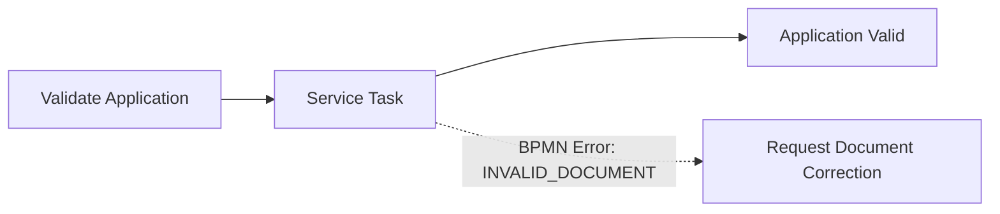

### 8.1 Business Error vs Technical Error

| Situation | Use BPMN error? | Better handling |
|---|---:|---|
| Applicant submitted invalid document | Yes | Boundary error path to correction task |
| External API timeout | Usually no | Retry + incident after exhaustion |
| Database unavailable | No | Technical exception/job retry |
| Business rule says application ineligible | Maybe | BPMN error or normal XOR path, depending on model |
| JSON parsing bug | No | Technical incident |
| Account closed, cannot process payment | Yes, if expected domain outcome | Boundary error/fallback path |

### 8.2 Throwing BPMN Error from Java

```java
import org.camunda.bpm.engine.delegate.BpmnError;
import org.camunda.bpm.engine.delegate.DelegateExecution;
import org.camunda.bpm.engine.delegate.JavaDelegate;

public class ValidateDocumentDelegate implements JavaDelegate {

  @Override
  public void execute(DelegateExecution execution) {
    String documentStatus = (String) execution.getVariable("documentStatus");

    if ("INVALID".equals(documentStatus)) {
      throw new BpmnError("INVALID_DOCUMENT", "Document failed validation");
    }

    execution.setVariable("documentValidated", true);
  }
}
```

BPMN boundary event:

```xml
<serviceTask id="validateDocument" camunda:delegateExpression="${validateDocumentDelegate}" />

<boundaryEvent id="invalidDocumentBoundary" attachedToRef="validateDocument">
  <errorEventDefinition errorRef="invalidDocumentError" />
</boundaryEvent>

<error id="invalidDocumentError" errorCode="INVALID_DOCUMENT" name="Invalid document" />
```

### 8.3 BPMN Error Scope

BPMN error propagates upward until a matching error handler is found. If none is found, behavior depends on where/how it is thrown and can end in exception handling semantics. For clean production design, catch expected BPMN errors close to the scope that can recover.

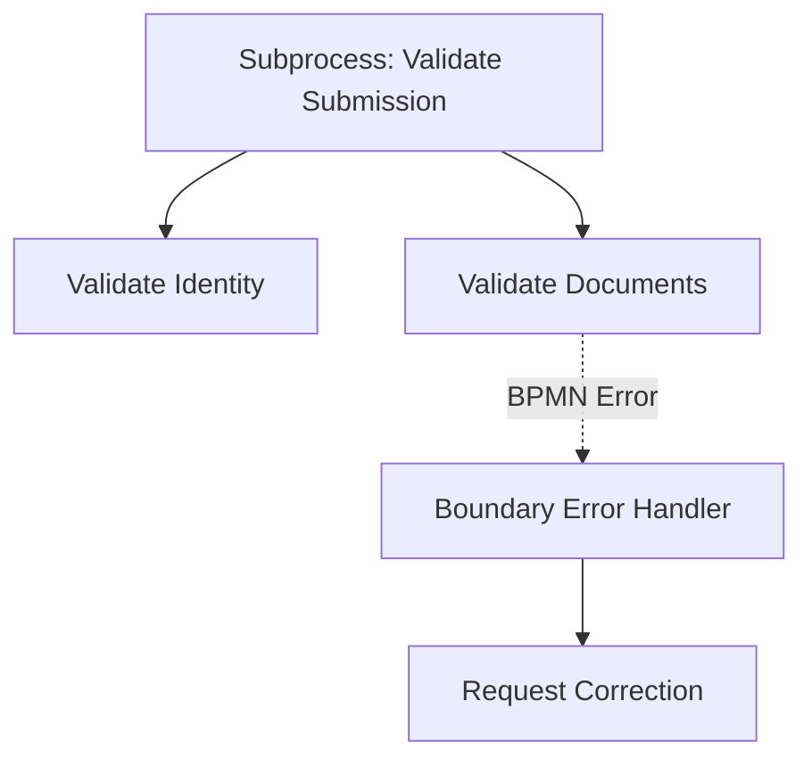

### 8.4 Error Boundary vs XOR Outcome

A common modeling decision:

Should “ineligible” be normal XOR path or BPMN error?

Use XOR if ineligibility is a normal evaluated outcome.

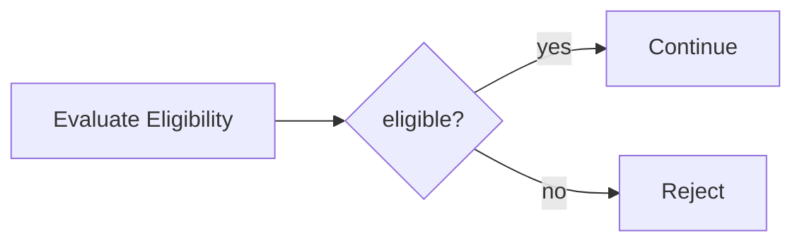

Use BPMN error if a lower-level activity discovers a business violation and the parent process must recover.

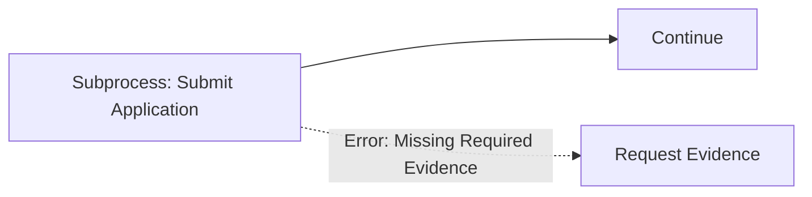

### 8.5 BPMN Error Anti-Patterns

#### Anti-pattern: Technical Exception as BPMN Error

External API timeout should not be thrown as `BpmnError("API_TIMEOUT")` unless business explicitly treats timeout as a modeled business outcome. Usually it should trigger retry and incident.

#### Anti-pattern: Catch-All Error Path

A generic error boundary that catches everything and continues can hide serious defects.

#### Anti-pattern: Business Error Without Audit Context

When throwing BPMN error, include enough context for audit through variables or error message extension.

---

## 9. Escalation Events

Escalation is a named event mostly used to communicate from subprocess to upper process. Unlike error, escalation is non-critical and execution can continue where it is thrown.

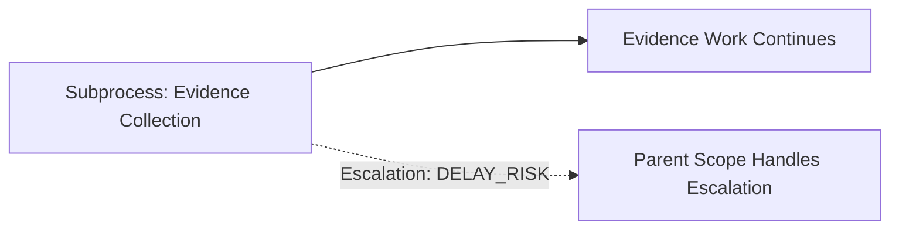

### 9.1 Error vs Escalation

| Dimension | BPMN Error | Escalation |
|---|---|---|
| Meaning | Business failure/exceptional outcome | Business notification/escalation |
| Severity | Usually blocking or alternate path | Often non-critical |
| Flow at throwing location | Interrupted/propagated | Can continue at throwing location |
| Typical use | invalid document, rejected payment | SLA warning, manager notification, parent awareness |
| Handler | Error boundary/event subprocess | Escalation boundary/event subprocess |

### 9.2 Escalation Boundary Event

Escalation boundary event can be attached to embedded subprocess or call activity. It catches escalations thrown within the scope.

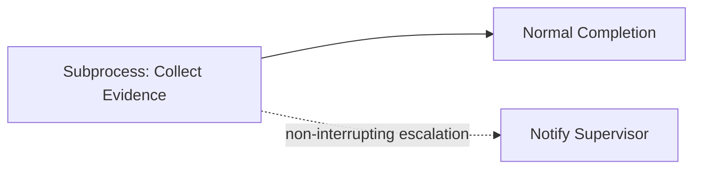

This is useful when child work should continue while parent is notified.

### 9.3 Escalation Start Event in Event Subprocess

Escalation start event can trigger event subprocess. This is powerful for cross-cutting handling within a scope.

```mermaid
flowchart TD
    A[Main Subprocess Scope] --> B[Normal Work]
    A --> C[More Work]
    A -. Escalation caught .-> D[Event Subprocess: Notify Manager]
```

### 9.4 Escalation Design Patterns

#### Pattern: Non-Blocking SLA Warning

```mermaid
flowchart LR
    A[Review Case] -. non-interrupting timer .-> B[Throw Escalation: REVIEW_DELAY_RISK]
    B --> C[Record Delay Risk]
    A --> D[Review Completed]
```

Parent catches escalation and notifies supervisor while review continues.

#### Pattern: Child Process Raises Parent Awareness

```mermaid
flowchart LR
    A[Call Activity: Field Inspection] -. Escalation: SAFETY_RISK .-> B[Parent Opens Safety Review]
    A --> C[Field Inspection Completes Later]
```

### 9.5 Escalation Anti-Patterns

#### Anti-pattern: Escalation for Technical Failures

Technical failure should usually be retry/incident, not escalation.

#### Anti-pattern: Error for Non-Blocking Warning

If child work should continue, BPMN error is often too strong. Escalation may be better.

#### Anti-pattern: Escalation Without Owner

An escalation path must have an owner: role, group, task queue, notification target, or operational playbook.

---

## 10. Event Subprocess

Event subprocess is a subprocess triggered by event within a scope. It can be interrupting or non-interrupting.

```mermaid
flowchart TD
    P[Process Scope] --> A[Main Flow]
    P --> E[[Event Subprocess]]
    E --> S((Start Event: Timer/Message/Error/Signal/Escalation))
    S --> H[Handle Event]
```

### 10.1 Why Event Subprocess Exists

Boundary events are attached to one activity. Event subprocess can cover an entire scope.

Use event subprocess when:

- a timeout applies to a whole subprocess,
- cancellation can happen at multiple points,
- a message can arrive anytime during a scope,
- a global rule should be handled consistently inside a process region,
- multiple boundary events would clutter the diagram.

### 10.2 Interrupting Event Subprocess

Interrupting event subprocess cancels the containing scope.

```mermaid
flowchart TD
    A[Investigation Scope] --> B[Collect Evidence]
    A --> C[Interview Party]
    A -. Message: Case Withdrawn .-> D[Event Subprocess: Close Case]
```

If withdrawal message arrives, active work in investigation scope is canceled.

### 10.3 Non-Interrupting Event Subprocess

Non-interrupting event subprocess starts additional work without canceling main scope.

```mermaid
flowchart TD
    A[Investigation Scope] --> B[Collect Evidence]
    A --> C[Review Case]
    A -. Signal: Policy Changed .-> D[Event Subprocess: Reassess Policy Impact]
```

### 10.4 Event Subprocess vs Boundary Event

| Need | Prefer |
|---|---|
| Event applies to one specific task | Boundary event |
| Event applies to entire subprocess | Event subprocess |
| Event should be visually close to activity | Boundary event |
| Event is cross-cutting | Event subprocess |
| Multiple activities share same event handler | Event subprocess |

### 10.5 Event Subprocess Anti-Patterns

#### Anti-pattern: Hidden Control Flow

Event subprocess can make diagrams harder to reason about because event handling is not on the main line. Use clear naming and documentation.

#### Anti-pattern: Non-Interrupting Event Subprocess Without Idempotency

If signal/message can arrive multiple times, non-interrupting event subprocess may start multiple handlers. Add dedupe guard.

---

## 11. Conditional Events

Conditional events trigger when a condition becomes true. They can be useful, but they are often overused.

Use conditional event when process should react to process variable changes inside the engine.

Prefer message event when condition is caused by external world event.

```mermaid
flowchart LR
    A[Wait State] --> C((Conditional Event: riskScore > 80))
    C --> B[High Risk Handling]
```

### 11.1 Conditional Event Pitfall

A condition does not magically monitor your external database. It reacts in the context of engine variable changes/evaluation. If external application state changes outside process variables, use message correlation to notify the process.

---

## 12. Compensation and Cancel Events: Preview

Compensation will be covered more deeply in long-running process and saga design. For now:

- Compensation is not “rollback database transaction”.
- Compensation is business undo/remediation work.
- Cancel events relate to transaction subprocess behavior.
- Compensation handlers must be modeled intentionally and tested.

```mermaid
flowchart LR
    A[Reserve Funds] --> B[Book Service]
    B --> C[Failure Later]
    C --> D[Compensate Reserve Funds]
```

Do not introduce compensation casually. It has heavy business meaning.

---

## 13. Events and Transaction Boundaries

Events interact strongly with transactions.

| Event situation | Transaction implication |
|---|---|
| Intermediate catch message | Process state committed while waiting |
| Timer catch/boundary | Timer job persisted; job executor resumes later |
| Boundary error from delegate | Same transaction unless async boundary exists |
| BPMN error caught by boundary | Alternate path executed in same command unless wait/async reached |
| Signal throw | Can trigger multiple waiting executions depending on scope/API |
| Async before event/activity | Job created; failure becomes retryable job |

Why it matters:

- If you call external service before a wait state and then throw exception, DB state may rollback but external side effect already happened.
- If you throw BPMN error inside synchronous delegate, it is business flow, not retryable technical failure.
- If you need retry isolation, use async boundary before risky work.

---

## 14. Production Event Design: Invariants

For every event, write an event contract.

### 14.1 Timer Contract

```yaml
event: EvidenceSubmissionDeadline
kind: timer
scope: SubmitEvidence user task
duration: P10D
interrupting: true
businessMeaning: party failed to submit required evidence within allowed period
auditVariables:
  - evidenceDueDate
  - deadlinePolicyVersion
  - timeoutFiredAt
lateEventPolicy: late submissions go to LateEvidenceReview
```

### 14.2 Message Contract

```yaml
event: ExternalRiskAssessmentCompleted
kind: message
source: risk-assessment-service
recipient: one process instance
correlation:
  businessKey: caseId
  keys:
    - externalRiskAssessmentId
idempotencyKey: callbackId
payloadVersion: v1
lateEventPolicy: store as late callback and open manual review if case already advanced
```

### 14.3 Signal Contract

```yaml
event: RegulatoryPolicyChanged
kind: signal
source: policy-service
recipient: all active subscribed process instances
scopeControl: only emitted by platform workflow admin process
risk: broad fan-out
observability:
  - emitted count
  - subscribed handler count
  - failed handler count
```

### 14.4 Error Contract

```yaml
event: INVALID_DOCUMENT
kind: bpmn-error
source: ValidateDocumentDelegate
businessMeaning: submitted document fails business validation
technicalMeaning: not a system failure
handler: boundary event on Validate Document service task
recovery: request correction from submitter
```

### 14.5 Escalation Contract

```yaml
event: REVIEW_DELAY_RISK
kind: escalation
source: Review subprocess
businessMeaning: review is approaching SLA breach
interrupting: false
handler: event subprocess notifies supervisor
owner: review-supervisor group
```

---

## 15. Advanced Pattern Catalog

### 15.1 Pattern: External Callback With Timeout

```mermaid
flowchart LR
    A[Send Request to External System] --> G{Wait for Callback or Timeout}
    G --> M((Message: Callback Received))
    G --> T((Timer: Callback Timeout))
    M --> V[Validate Callback]
    V --> X{Valid?}
    X -->|yes| C[Continue]
    X -->|no| R[Manual Callback Review]
    T --> E[Escalate Timeout]
```

Engineering details:

- store `externalRequestId`,
- use idempotency table,
- validate timestamp and signature,
- set timeout due date as variable,
- define late callback policy.

### 15.2 Pattern: Human Task Reminder and Hard Timeout

```mermaid
flowchart LR
    A[User Task: Submit Evidence] --> B[Submitted]
    A -. non-interrupting timer P3D .-> R[Send Reminder]
    A -. interrupting timer P10D .-> T[Close Due To No Submission]
```

This combines soft reminder with hard deadline.

Caution:

- Repeated reminders need max count.
- Hard timeout path needs audit reason.
- Submission API should verify task still active.

### 15.3 Pattern: Business Error Recovery

```mermaid
flowchart LR
    A[Validate Submission] --> B[Valid Submission]
    A -. BPMN Error: MISSING_REQUIRED_FIELD .-> C[Request Correction]
    C --> A
```

Use BPMN error when missing field is discovered inside validation activity and parent flow should recover.

### 15.4 Pattern: Escalate Without Canceling

```mermaid
flowchart LR
    A[Review Case] --> B[Review Completed]
    A -. non-interrupting timer .-> C[Throw Escalation]
    C --> D[Supervisor Notification]
```

Use escalation or non-interrupting boundary timer when work continues.

### 15.5 Pattern: Scope-Wide Cancellation

```mermaid
flowchart TD
    S[Subprocess: Investigation] --> A[Collect Evidence]
    S --> B[Interview Parties]
    S --> C[Draft Recommendation]
    S -. Message: Case Withdrawn .-> E[Event Subprocess: Close Investigation]
```

Use interrupting event subprocess for cancellation that applies across many active tasks.

---

## 16. Common Pitfalls and Failure Modes

### 16.1 Ambiguous Correlation

Symptom:

```txt
MismatchingMessageCorrelationException: Cannot correlate message ... multiple executions match
```

Likely causes:

- correlation by message name only,
- multiple process instances with same business key,
- multiple subscriptions in same process instance,
- missing tenant/process definition filter.

Fix:

- add correlation keys,
- enforce unique external request id,
- narrow by process instance or execution id only when adapter has legitimate access to it.

### 16.2 Late Message After Timeout

Symptom:

- process already moved to timeout path,
- callback arrives and cannot correlate,
- external system keeps retrying.

Fix:

- ingestion layer should store late callback,
- return idempotent accepted/rejected response based on policy,
- optionally open manual review.

### 16.3 Technical Error Modeled as BPMN Error

Symptom:

- API outage follows business fallback path,
- case wrongly marked rejected/canceled,
- no incident for ops.

Fix:

- let technical exception fail job,
- configure retry/backoff,
- create incident after retry exhaustion,
- use BPMN error only for expected business outcomes.

### 16.4 Signal Fan-Out Surprise

Symptom:

- many instances continue after one event,
- audit trail shows signal triggered globally.

Fix:

- replace signal with message,
- add architectural controls for signal emission,
- monitor signal fan-out.

### 16.5 Reminder Spam

Symptom:

- non-interrupting timer fires repeatedly,
- users receive duplicate notifications,
- event subprocess starts multiple copies.

Fix:

- reminder counter,
- max reminder policy,
- idempotent notification key,
- cancel/stop condition.

---

## 17. Testing Events

Testing event-heavy processes must cover time, correlation, duplicate, late, and failure behavior.

### 17.1 Test Message Correlation

```java
@Test
void continuesWhenExternalApprovalMessageIsCorrelated() {
  ProcessInstance instance = runtimeService.startProcessInstanceByKey(
      "externalApprovalProcess",
      "CASE-123",
      Variables.createVariables()
          .putValue("externalRequestId", "REQ-999")
  );

  runtimeService.createMessageCorrelation("ExternalApprovalReceived")
      .processInstanceBusinessKey("CASE-123")
      .processInstanceVariableEquals("externalRequestId", "REQ-999")
      .setVariable("approvalStatus", "APPROVED")
      .correlateWithResult();

  Task task = taskService.createTaskQuery()
      .processInstanceId(instance.getId())
      .singleResult();

  assertThat(task.getTaskDefinitionKey()).isEqualTo("processApprovedResult");
}
```

### 17.2 Test Timer Due Date

In tests, query timer jobs and execute them manually.

```java
Job timerJob = managementService.createJobQuery()
    .processInstanceId(instance.getId())
    .timers()
    .singleResult();

managementService.executeJob(timerJob.getId());
```

This avoids waiting for real time.

### 17.3 Event Test Matrix

| Scenario | Expected |
|---|---|
| message arrives before timer | message path |
| timer executes before message | timeout path |
| duplicate message before completion | idempotent handling |
| duplicate message after completion | late/duplicate policy |
| invalid payload | no correlation; validation failure |
| technical DB failure during correlation | retry at ingestion/transaction boundary |
| BPMN error thrown | boundary error path |
| Java exception thrown | failed job/incident if async |
| signal emitted | all intended subscribers react, no unintended subscriber |

---

## 18. Operational Playbook

When support sees an event-related stuck process:

1. Identify current activity instance.
2. Check whether it is waiting at message, timer, signal, user task, or join.
3. For message wait:
   - check event subscription,
   - verify expected message name,
   - verify business key/correlation keys,
   - inspect ingestion logs.
4. For timer wait:
   - check timer job due date,
   - check job executor enabled,
   - check job lock owner/expiration,
   - check retries and exception.
5. For error path:
   - verify BPMN error code,
   - inspect variable context,
   - check whether handler exists in scope.
6. For escalation:
   - verify whether escalation was interrupting/non-interrupting,
   - check owner task/notification.
7. Decide recovery:
   - correlate message,
   - execute/retry timer job,
   - set variable and continue,
   - modify process instance only with audit approval,
   - create business correction task.

Never repair event problems with direct DB updates.

---

## 19. Regulatory/Case Management Lens

For regulatory systems, event modeling must be defensible.

Ask for every event:

- Who or what caused this event?
- What evidence proves it occurred?
- Was it received on time?
- Was it targeted to the correct case/entity?
- Did it cancel work or only notify?
- What rule version decided the event behavior?
- Can an auditor reconstruct the path from history and domain audit logs?
- What happens if the event is duplicated, late, malformed, or disputed?

Example: “party failed to respond by deadline” should not simply be a timer path. It should preserve:

```yaml
caseId: CASE-123
noticeSentAt: 2026-06-01T10:15:00+07:00
responseDueAt: 2026-06-11T23:59:59+07:00
timeoutEvaluatedAt: 2026-06-12T00:02:31+07:00
policyVersion: RESPONSE_DEADLINE_POLICY_V3
lateResponsePolicy: LATE_RESPONSE_MANUAL_REVIEW
actor: camunda-job-executor
```

Camunda history alone may not be enough. Store domain audit records intentionally.

---

## 20. Key Takeaways

1. Catching event means the process waits; throwing event means the process emits/raises something.
2. Timer events are job-executor-driven jobs, not real-time sleeping threads.
3. Message events are targeted and require deterministic correlation.
4. Signal events are broadcast and must not be used for specific case callbacks.
5. BPMN error is for business errors, not technical exceptions.
6. Escalation is for non-critical or parent-scope communication and can allow local flow to continue.
7. Boundary events apply while an activity is active; event subprocess applies to a scope.
8. Interrupting vs non-interrupting is a business decision with major runtime consequences.
9. Duplicate, late, and ambiguous events are normal production cases, not edge cases.
10. In regulatory workflows, every event needs audit semantics, not just BPMN semantics.

---

## References

- Camunda 7.24 Docs — Timer Events: https://docs.camunda.org/manual/7.24/reference/bpmn20/events/timer-events/
- Camunda 7.24 Docs — Message Events: https://docs.camunda.org/manual/7.24/reference/bpmn20/events/message-events/
- Camunda 7.24 Docs — Signal Events: https://docs.camunda.org/manual/7.24/reference/bpmn20/events/signal-events/
- Camunda 7.24 Docs — Error Events: https://docs.camunda.org/manual/7.24/reference/bpmn20/events/error-events/
- Camunda 7.24 Docs — Escalation Events: https://docs.camunda.org/manual/7.24/reference/bpmn20/events/escalation-events/
- Camunda 7.24 Docs — Conditional Events: https://docs.camunda.org/manual/7.24/reference/bpmn20/events/conditional-events/
- Camunda 7.24 Docs — Cancel and Compensation Events: https://docs.camunda.org/manual/7.24/reference/bpmn20/events/cancel-and-compensation-events/
- Camunda 7.24 Docs — Event Subprocess: https://docs.camunda.org/manual/7.24/reference/bpmn20/subprocesses/event-subprocess/
