------
title: Learn Java BPMN with Camunda BPM Platform 7 - Part 007
description: Advanced Camunda 7 user task and human workflow engineering: task lifecycle, assignment, candidate groups, claim/delegate/complete, forms, SLA, audit, authorization, and operational anti-patterns.
series: learn-java-bpmn-camunda7
seriesTitle: Learn Java BPMN with Camunda BPM Platform 7
order: 7
partTitle: User Task and Human Workflow Engineering
tags:
- java
- bpmn
- camunda
- camunda-7
- workflow
- user-task
- human-workflow
- tasklist
- sla
- audit
- series
date: 2026-06-27
------

# Part 007 — User Task and Human Workflow Engineering

Part ini membahas **user task** sebagai kontrak kerja manusia di Camunda 7. Di banyak sistem workflow, user task terlihat sederhana: ada task, ada assignee, lalu user klik complete. Di sistem produksi, user task adalah bagian yang paling sering menentukan kualitas platform karena ia bersentuhan dengan ownership, otorisasi, SLA, audit, bukti keputusan, handover, conflict, dan operational repair.

Camunda mendefinisikan user task sebagai work yang harus dilakukan human actor; ketika execution mencapai user task, engine membuat task baru di task list milik user atau group yang ditugaskan. Itu berarti user task bukan sekadar node visual, tetapi runtime entity yang hidup di database, punya lifecycle, bisa diklaim, didelegasikan, dilengkapi dengan variables, dan terekam di history.

> Mental model utama: user task adalah **durable human wait state**. Ia menghentikan token, menyimpan kewajiban kerja manusia, lalu melanjutkan proses hanya ketika ada completion command yang sah.

---

## 1. Kaufman Skill Deconstruction

Untuk menguasai human workflow, pecah skill menjadi beberapa sub-skill berikut:

| Sub-skill | Yang harus bisa dilakukan | Failure signal |
|---|---|---|
| Task lifecycle | Menjelaskan create, assign, claim, complete, delegate, resolve, delete | Task tersangkut tanpa jelas siapa owner-nya |
| Assignment model | Memilih assignee, candidate users, candidate groups, dynamic assignment | Semua task langsung hardcoded ke user tertentu |
| Authorization boundary | Membedakan assignment, visibility, dan permission | User bisa claim task group lain tanpa kontrol |
| Form contract | Menentukan data apa yang diinput manusia dan kapan valid | Form menjadi mini-application penuh business logic |
| Variable scope | Memisahkan task-local data, process data, dan audit data | Semua field form masuk process variable global |
| SLA and escalation | Mendesain timer reminder, timeout, escalation, re-assignment | SLA hanya ada di dashboard, bukan di process behavior |
| Human decision audit | Menyimpan siapa memutuskan apa, kapan, dengan alasan apa | Tidak bisa membuktikan alasan approval/rejection |
| Operational repair | Menangani task salah assign, stuck, obsolete, duplicate | Support langsung update database |

Kaufman mindset-nya: jangan langsung hafal semua API. Kuasai dulu invariant: **siapa yang bertanggung jawab, data apa yang ia lihat, keputusan apa yang ia buat, apa efeknya ke proses, dan bagaimana hal itu dibuktikan nanti**.

---

## 2. User Task as Durable Human Wait State

Saat token masuk ke user task:

1. engine membuat runtime task record,
2. token berhenti di activity tersebut,
3. process instance menjadi waiting,
4. task muncul di query `TaskService` atau Tasklist,
5. manusia atau sistem eksternal menyelesaikan task,
6. completion command membuat token keluar lewat sequence flow berikutnya.

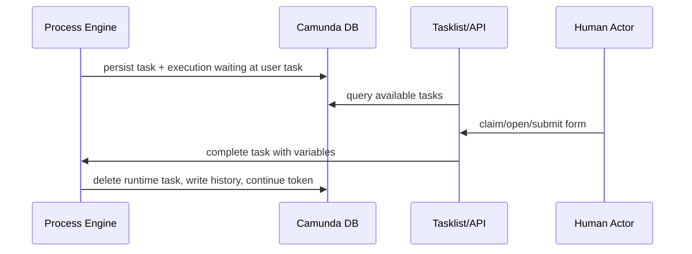

Konsekuensi desain:

- user task adalah wait state yang bisa bertahan menit, hari, bulan, atau tahun,
- assignment harus stabil terhadap perubahan organisasi,
- variables yang diperlukan user harus tersedia saat task dibuka,
- completion harus idempotent dari perspektif UI/API,
- audit trail harus menjawab kenapa token bergerak ke jalur berikutnya.

### 2.1 User task bukan UI screen

Kesalahan umum adalah memperlakukan satu user task sama dengan satu layar. Itu kadang benar, tetapi bukan definisi utamanya.

User task seharusnya merepresentasikan **unit tanggung jawab manusia**.

Contoh:

| Buruk | Lebih baik |
|---|---|
| `Open Case Page` | `Review Enforcement Case` |
| `Fill Form Step 1` | `Submit Investigation Finding` |
| `Click Approve Button` | `Approve Sanction Recommendation` |
| `Upload File Screen` | `Provide Supporting Evidence` |

Satu responsibility bisa punya banyak field, tab, attachment, atau interaction. Sebaliknya, satu screen bisa memuat beberapa responsibility berbeda yang seharusnya menjadi task terpisah.

---

## 3. Task Lifecycle: From Created to Completed

Lifecycle task di Camunda bisa dipahami sebagai state machine operasional.

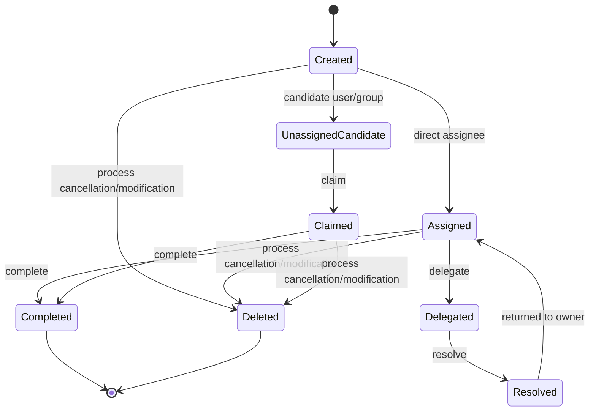

Camunda Task API memberi operasi seperti query, claim, set assignee, delegate, resolve, complete, set variables, dan delete. Tetapi dari perspektif desain, operasi ini harus dipetakan ke rule bisnis.

### 3.1 Created

Task baru dibuat ketika token mencapai user task. Pada titik ini:

- execution sedang menunggu,
- task punya id runtime,
- task mungkin punya assignee langsung,
- task mungkin punya candidate users/groups,
- task bisa punya due date, follow-up date, priority, form key, dan listeners.

Hal yang harus jelas:

- siapa boleh melihat task,
- siapa boleh claim,
- apakah task harus otomatis assign,
- apakah due date dihitung dari event bisnis atau waktu pembuatan task,
- apakah task dapat diselesaikan tanpa claim.

### 3.2 Claimed

Claim berarti seseorang mengambil tanggung jawab eksekusi task.

Claim bukan sekadar lock UI. Claim adalah pernyataan ownership sementara. Dalam proses high-stakes, claim sebaiknya meninggalkan jejak audit.

Contoh invariant:

```text
A task in candidate group ComplianceReviewer may be claimed by exactly one active member of that group.
After claim, only assignee, supervisor, or system administrator may complete/reassign it.
```

### 3.3 Assigned

Assignee adalah user yang saat ini bertanggung jawab menyelesaikan task. Assignment bisa dilakukan:

- statis di BPMN,
- via expression,
- via task listener,
- via service sebelum user task,
- via API oleh supervisor/admin,
- via DMN decision.

Direct assignment cocok untuk demo atau task personal. Untuk sistem produksi, lebih umum memakai candidate group + claim atau dynamic assignment.

### 3.4 Delegated and resolved

Delegation berbeda dari reassign biasa.

Delegation berarti assignee asli tetap owner, tetapi meminta user lain mengerjakan sebagian/seluruh pekerjaan lalu mengembalikan task. Ini berguna untuk decision support.

Contoh:

```text
Senior investigator delegates evidence validation to analyst.
Analyst resolves delegation after validating documents.
Senior investigator remains accountable for final submission.
```

Gunakan delegation ketika akuntabilitas tetap di orang pertama. Gunakan reassignment ketika ownership berpindah.

### 3.5 Completed

Complete adalah command yang melanjutkan process token.

Completion harus dianggap sebagai **state transition bisnis**. Ia harus divalidasi dengan serius:

- apakah user berhak complete,
- apakah task masih aktif,
- apakah variables lengkap,
- apakah keputusan valid,
- apakah optimistic locking/concurrent completion tertangani,
- apakah side effect downstream idempotent.

Anti-pattern paling berbahaya: UI memanggil `taskService.complete(taskId, variables)` langsung tanpa domain validation layer.

---

## 4. Assignment Model: Assignee, Candidate User, Candidate Group

User task assignment punya beberapa pendekatan.

| Model | Meaning | Kapan dipakai | Risiko |
|---|---|---|---|
| Assignee | Task langsung dimiliki satu user | Task personal, direct handoff, owner sudah deterministik | Bottleneck kalau user tidak tersedia |
| Candidate users | Beberapa user spesifik boleh claim | Small team, ad-hoc review | Sulit maintain saat organisasi berubah |
| Candidate groups | Group/role boleh claim | Role-based workflow | Butuh integrasi identity/authorization benar |
| Dynamic assignment | Assignee/group dihitung runtime | Routing kompleks, workload balancing | Logic tersembunyi kalau tidak diaudit |
| External work allocation | Assignment dikelola workforce system | Enterprise task routing | Risk split-brain antara Camunda dan task system |

### 4.1 Static assignment

Contoh XML sederhana:

```xml
<bpmn:userTask id="ReviewCase" name="Review case" camunda:assignee="demo" />
```

Ini berguna untuk tutorial, tetapi jarang cocok untuk production. Hardcoded username membuat proses rapuh terhadap perubahan personel.

### 4.2 Candidate group

```xml
<bpmn:userTask
    id="ReviewCase"
    name="Review case"
    camunda:candidateGroups="compliance-reviewer" />
```

Candidate group lebih tahan terhadap perubahan struktur organisasi. Tetapi jangan salah paham: **candidate group bukan otomatis authorization lengkap**. Ia membantu task query dan assignment, tetapi permission model tetap harus diatur sesuai kebutuhan security.

### 4.3 Dynamic assignment via expression

```xml
<bpmn:userTask
    id="ApproveSanction"
    name="Approve sanction"
    camunda:candidateGroups="${approvalGroup}" />
```

Dynamic assignment cocok ketika group dipilih berdasarkan risk score, jurisdiction, product line, atau case type.

Namun expression seperti ini harus didukung kontrak variable yang jelas:

```text
approvalGroup must be non-null, normalized, and mapped to an existing identity group before ApproveSanction is entered.
```

### 4.4 Assignment via task listener

Task listener memberi fleksibilitas lebih besar:

```xml
<bpmn:userTask id="ReviewCase" name="Review case">
  <bpmn:extensionElements>
    <camunda:taskListener event="create" delegateExpression="${reviewAssignmentListener}" />
  </bpmn:extensionElements>
</bpmn:userTask>
```

Listener bisa menghitung assignee/candidate berdasarkan data runtime.

Tetapi gunakan hati-hati:

- listener create berjalan saat task dibuat,
- exception di listener bisa menggagalkan transaksi pembuatan task,
- logic assignment tersembunyi dari diagram,
- terlalu banyak listener membuat model sulit direasoning.

Prinsip: listener boleh melakukan **enrichment runtime**, bukan menyembunyikan policy utama.

---

## 5. Assignment as Business Policy, Not UI Detail

Assignment sering diperlakukan sebagai konfigurasi teknis. Untuk sistem serius, assignment adalah policy bisnis.

Contoh policy:

```text
Case with riskScore >= 80 must be reviewed by SeniorComplianceReviewer.
Case created by investigator A cannot be approved by the same investigator.
If amount > 10_000_000, approval requires Director group.
If jurisdiction is cross-border, include LegalReview group.
```

Policy seperti ini sebaiknya tidak tercecer di BPMN expression string, frontend, dan listener. Ada tiga pola yang lebih maintainable.

### 5.1 DMN-driven assignment

Gunakan DMN untuk keputusan routing yang transparan.

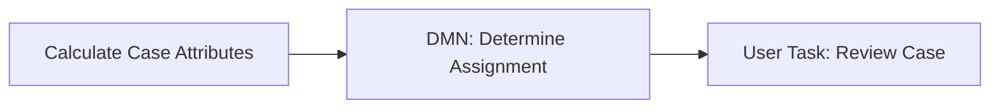

Output DMN:

```text
candidateGroup = senior-compliance-reviewer
slaDuration = P2D
requiresFourEyes = true
```

Kelebihan:

- policy dapat dibaca business stakeholder,
- rule bisa diuji sebagai decision table,
- audit bisa menyimpan rule version,
- BPMN tetap fokus pada flow.

### 5.2 Domain service assignment

Gunakan domain service ketika policy perlu data kompleks atau external system.

```java
@Service
public class AssignmentPolicyService {

    public AssignmentDecision decide(CaseSnapshot caseSnapshot) {
        // Fetch organization data, workload, risk policy, availability, etc.
        return new AssignmentDecision("senior-compliance-reviewer", Duration.ofDays(2));
    }
}
```

BPMN tetap memanggil service task sebelum user task.

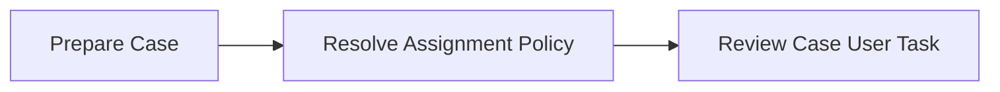

Kelebihan:

- testable di Java,
- bisa punya observability,
- mudah versioning lewat application code,
- cocok untuk algorithmic routing.

### 5.3 External task routing system

Untuk organisasi besar, Camunda mungkin bukan sistem utama workforce management. Task bisa tetap direpresentasikan di Camunda, tetapi assignment rinci dikelola oleh case/task platform lain.

Gunakan pola ini jika:

- ada skill-based routing,
- workload balancing real-time,
- shift scheduling,
- absence management,
- supervisor override,
- enterprise task inbox terpusat.

Jangan biarkan Camunda dan workforce system sama-sama menganggap dirinya source of truth untuk assignment. Tentukan ownership.

---

## 6. Human Workflow as a Contract

Setiap user task harus punya kontrak eksplisit.

```text
Task: Review Enforcement Case
Actor: Compliance reviewer
Input: case summary, evidence list, risk score, previous findings
Decision: approve | request_more_info | reject
Required reason: yes for reject and request_more_info
Output variables: reviewDecision, reviewReason, reviewedBy, reviewedAt
SLA: 2 business days
Escalation: reminder after 1 day, supervisor escalation after 2 days
Authorization: candidate group compliance-reviewer, cannot be case creator
Audit: user operation log + domain audit event
```

Kontrak ini bisa ditaruh di:

- BPMN documentation field,
- internal engineering handbook,
- test case,
- API contract,
- domain model,
- operational runbook.

Tanpa kontrak, BPMN terlihat benar tetapi runtime behavior mudah menyimpang.

---

## 7. Forms Strategy in Camunda 7

Camunda 7 mendukung beberapa cara form:

| Strategy | Meaning | Cocok untuk | Risiko |
|---|---|---|---|
| Generated/task form metadata | Form sederhana berdasarkan field metadata | Demo, internal simple workflow | Terbatas, UX minim |
| Embedded task forms | HTML/JS form yang di-embed Tasklist | Legacy Tasklist customization | AngularJS/legacy coupling, security concern |
| Camunda Forms | Form model yang dideploy dan dirender Tasklist | Form sederhana-menengah | Keterbatasan dibanding custom app |
| External/custom UI | Aplikasi UI sendiri pakai REST/API | Enterprise workflow/case management | Harus desain authorization dan consistency sendiri |

### 7.1 Form is not domain model

Form data tidak selalu sama dengan process variables. Form adalah interaction contract; process variable adalah engine state contract.

Buruk:

```text
Every field in the UI is submitted as a global process variable.
```

Lebih baik:

```text
The UI submits a typed command to the workflow application.
The application validates it, stores domain/audit data, then completes the task with only variables needed by process routing.
```

Contoh:

```java
public record CompleteReviewCommand(
    String taskId,
    String decision,
    String reason,
    List<String> selectedEvidenceIds,
    long expectedVersion
) {}
```

Process variable yang dikirim ke Camunda mungkin hanya:

```java
Map<String, Object> variables = Map.of(
    "reviewDecision", command.decision(),
    "reviewCompletedAt", OffsetDateTime.now().toString()
);
```

Evidence detail disimpan di domain database, bukan sebagai variable raksasa.

### 7.2 External UI pattern

Untuk sistem kompleks, external UI biasanya lebih cocok.

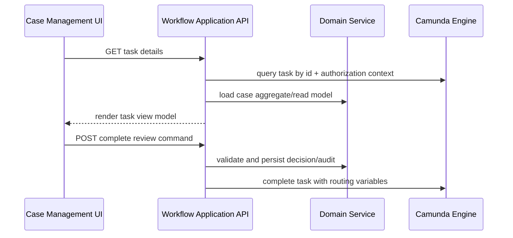

Keuntungan:

- UI bebas dari engine-specific details,
- domain validation tidak bocor ke frontend,
- audit dan evidence bisa disimpan dengan benar,
- Camunda tetap menjadi orchestration state, bukan UI backend mentah.

---

## 8. Task Variables and Scope

Camunda mengenal process variables dan local variables. Task juga merupakan variable scope. Dalam human workflow, pemilihan scope menentukan leakage data.

| Data | Scope yang disarankan | Alasan |
|---|---|---|
| Routing decision | Process variable | Dipakai gateway setelah task |
| Draft comment sementara | Task local | Tidak perlu hidup setelah task selesai |
| Large evidence payload | Domain DB / object storage | Bukan engine state |
| Reviewer identity | Process variable + audit | Diperlukan downstream dan trace |
| UI-only filter/sort state | Frontend/session | Tidak relevan dengan workflow |
| Attachment metadata | Domain DB + reference variable bila perlu | Traceable tanpa membebani engine |

### 8.1 Variable minimalism

Rule praktis:

```text
A process variable should exist only if process behavior, correlation, audit, or downstream automation needs it.
```

Jangan jadikan Camunda variable sebagai document database.

### 8.2 Snapshot vs reference

Untuk human task, sering ada pertanyaan: apakah task menyimpan snapshot data atau reference ke domain data?

| Approach | Kapan cocok | Trade-off |
|---|---|---|
| Reference | Data selalu harus fresh | Rendering tergantung domain service |
| Snapshot | Audit butuh exact view saat task dibuat | Bisa stale terhadap perubahan terbaru |
| Hybrid | Kebanyakan enterprise case workflow | Lebih kompleks, tetapi defensible |

Untuk regulatory system, hybrid sering paling tepat:

- process variable menyimpan `caseId`, `riskScoreAtReview`, `assignmentPolicyVersion`,
- domain audit menyimpan decision snapshot,
- UI memuat current domain view plus historical context.

---

## 9. SLA, Due Date, Follow-Up Date, and Timers

SLA human task tidak cukup disimpan sebagai teks. Ia harus punya behavior.

Camunda task punya due date dan follow-up date yang bisa dipakai untuk query/filter. BPMN timer boundary event bisa dipakai untuk behavior seperti reminder, escalation, auto-reassignment, atau timeout.

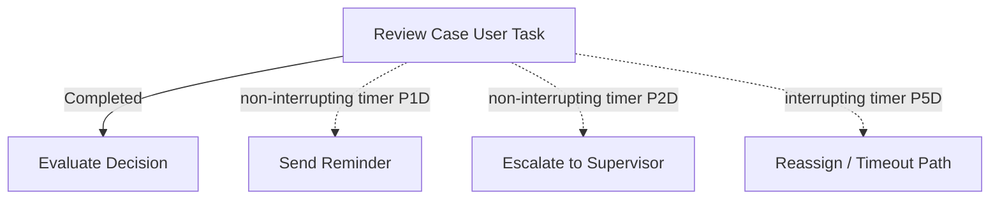

### 9.1 Due date is not timer behavior

Due date membantu manusia melihat deadline. Timer mengubah process behavior.

| Need | Use |
|---|---|
| Display deadline in task list | Due date |
| Show task after a date | Follow-up date |
| Send reminder | Non-interrupting timer boundary |
| Escalate without cancelling task | Non-interrupting timer boundary |
| Cancel task after timeout | Interrupting timer boundary |
| Auto-complete default action | Interrupting timer + explicit default path |

### 9.2 Reminder pattern

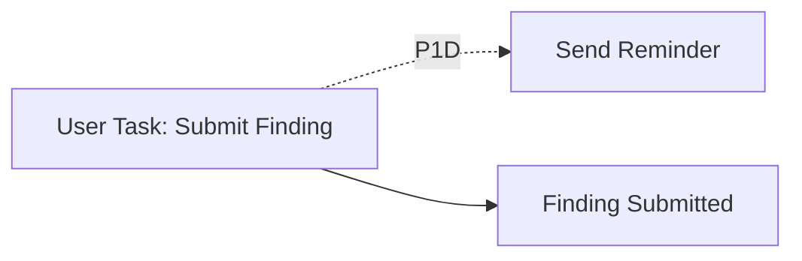

Use non-interrupting boundary timer. Token tambahan akan menjalankan reminder, tetapi task tetap aktif.

Checklist:

- reminder idempotent,
- jangan spam jika timer cycle tidak dibatasi,
- record reminder sent,
- perhatikan calendar/business day requirement,
- jangan confuse reminder dengan escalation.

### 9.3 Escalation pattern

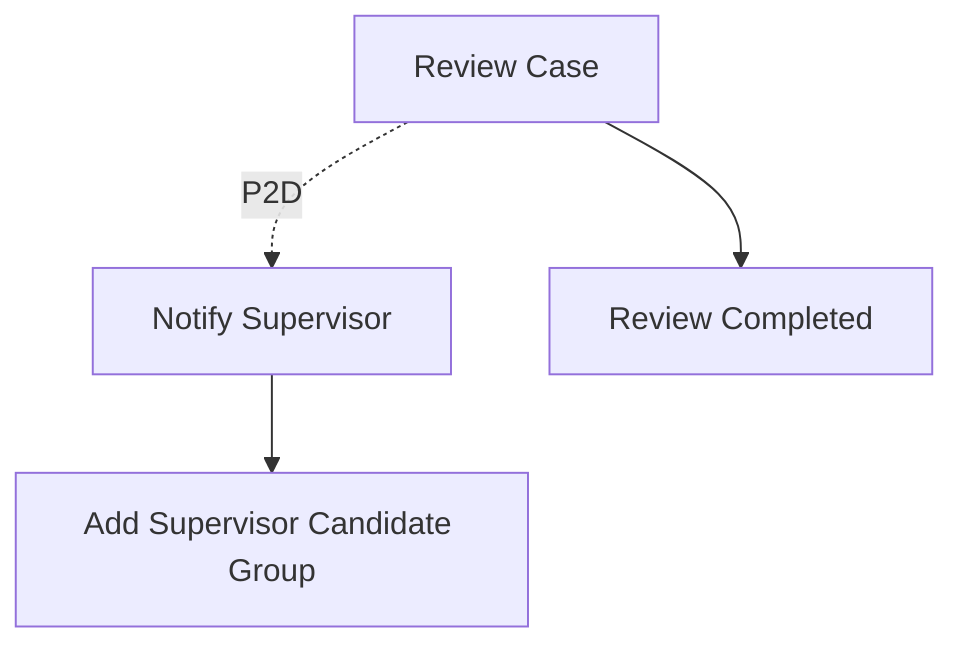

Escalation bisa berupa:

- notification,
- add candidate group,
- reassign,
- create supervisor task,
- raise BPMN escalation to parent scope,
- create incident-like business alert.

Pilih berdasarkan invariant bisnis, bukan karena icon BPMN tertentu.

---

## 10. Approval Workflow Patterns

### 10.1 Simple approval

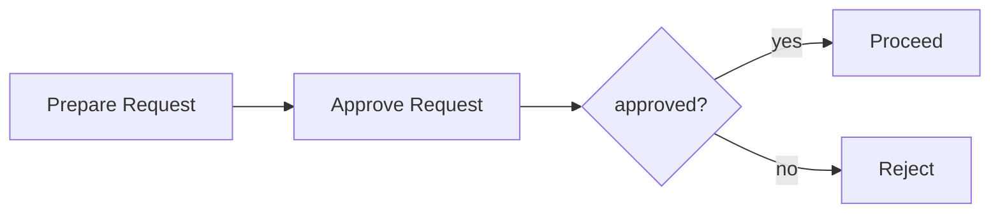

Variable contract:

```text
approvalDecision: APPROVED | REJECTED
approvalReason: required when REJECTED
approvedBy: user id
approvedAt: timestamp
```

### 10.2 Maker-checker / four-eyes principle

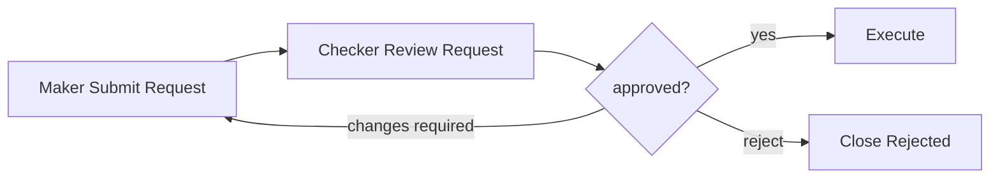

Invariant:

```text
checkerUserId != makerUserId
```

Jangan hanya mengandalkan UI untuk menyembunyikan task dari maker. Validasi di backend saat claim/complete.

### 10.3 Multi-level approval

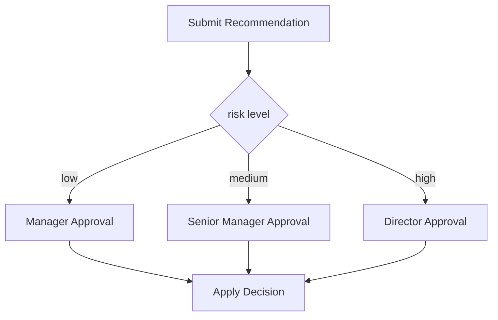

Routing bisa ditentukan oleh DMN:

| riskLevel | amount | approvalGroup | requiredLevel |
|---|---:|---|---|
| LOW | < 100000 | manager | L1 |
| MEDIUM | < 1000000 | senior-manager | L2 |
| HIGH | >= 1000000 | director | L3 |

### 10.4 Parallel review

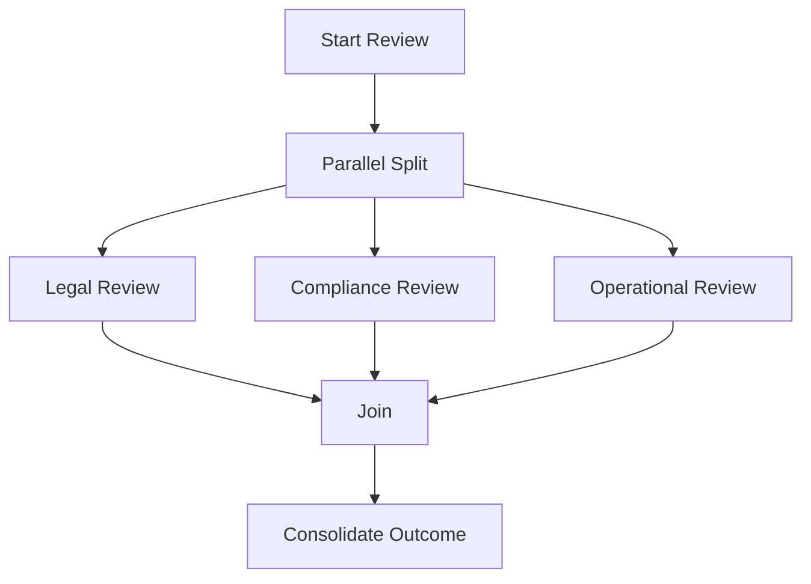

Risks:

- all branches must complete before join,
- one review rejection may need cancellation of other reviews,
- partial completion has audit implications,
- late submitted tasks after cancellation must be impossible.

Untuk early rejection, gunakan boundary event/subprocess atau explicit cancellation path.

---

## 11. User Task Completion Architecture

Jangan expose Camunda `taskId` sebagai satu-satunya security boundary. API completion harus melihat user context, task state, domain state, dan process state.

```mermaid
flowchart TD
    A[POST /cases/{caseId}/tasks/{taskId}/complete-review] --> B[Authenticate]
    B --> C[Authorize against domain + task]
    C --> D[Load Task from TaskService]
    D --> E[Validate task definition key]
    E --> F[Validate task assignee/candidate]
    F --> G[Validate domain aggregate version]
    G --> H[Persist domain decision + audit]
    H --> I[Complete Camunda task]
    I --> J[Return updated case view]
```

### 11.1 Validate task definition key

A common security/consistency bug:

```text
User submits a command intended for ReviewCase but taskId belongs to ApproveSanction.
```

Always verify:

```java
Task task = taskService.createTaskQuery()
    .taskId(command.taskId())
    .singleResult();

if (!"ReviewCase".equals(task.getTaskDefinitionKey())) {
    throw new IllegalStateException("Task is not a ReviewCase task");
}
```

### 11.2 Validate process business key or domain id

Verify task belongs to expected case.

```java
ProcessInstance pi = runtimeService.createProcessInstanceQuery()
    .processInstanceId(task.getProcessInstanceId())
    .singleResult();

if (!caseId.equals(pi.getBusinessKey())) {
    throw new IllegalStateException("Task does not belong to case " + caseId);
}
```

### 11.3 Persist domain decision before completing task?

Often yes, but be careful with transaction boundaries.

If Camunda embedded engine shares transaction with domain DB, persisting domain decision and task completion can commit atomically. If remote engine is used, you need distributed consistency pattern.

| Architecture | Safer pattern |
|---|---|
| Embedded same DB transaction | Domain persist + task complete in same transaction |
| Embedded different DB | Outbox or compensation/retry strategy |
| Remote engine REST | Persist command + outbox worker completes task |
| External task/case UI split | Idempotency key + reconciliation |

---

## 12. Authorization and Identity Boundaries

Assignment is not enough. You need authorization.

Questions to answer:

- Can candidate user see all process variables?
- Can assignee modify variables directly?
- Can group member claim any task in group?
- Can supervisor complete task on behalf of subordinate?
- Can administrator reassign task?
- Can a user see historic task after completion?
- Can a user query tasks from another tenant/jurisdiction?

### 12.1 Three layers of access

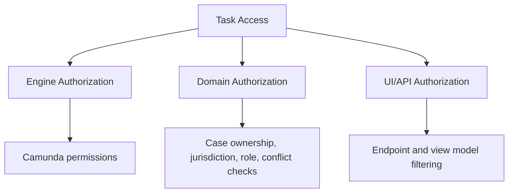

Do not rely on only one layer for high-stakes systems.

### 12.2 Candidate group membership source

Camunda identity service can manage users/groups, but many enterprises use LDAP, Keycloak, IAM, or internal directory. Decide:

- where group membership is source of truth,
- how often it is synced,
- what happens when user changes group mid-task,
- whether historic assignment preserves original group,
- whether authorization is evaluated at query time or claim/complete time.

### 12.3 Conflict of interest

For regulatory systems, role membership is not enough.

Example:

```text
A user in SeniorReviewer group cannot approve a case they created, investigated, or previously rejected.
```

This cannot be modeled only as candidate group. It needs domain authorization policy.

---

## 13. Audit and Regulatory Defensibility

A defensible human task must answer:

```text
Who was asked to do what?
When was the task created?
What information was available?
Who claimed it?
Who completed it?
What decision did they make?
What reason did they provide?
What rule/policy version was applied?
Was the task overdue?
Was it reassigned or delegated?
Was any administrator action performed?
```

Camunda history can capture task lifecycle and variables depending on history level. But regulatory audit often needs domain-specific audit events as well.

### 13.1 Domain audit event

```java
public record ReviewCompletedAuditEvent(
    String caseId,
    String processInstanceId,
    String taskId,
    String taskDefinitionKey,
    String actorUserId,
    String decision,
    String reason,
    String policyVersion,
    Instant completedAt
) {}
```

Store this in your domain audit log, not only as process variable.

### 13.2 Audit snapshot

For high-stakes decisions, store a snapshot of material facts used for decision:

- case risk score,
- evidence ids and hashes,
- applicable regulation version,
- assignment policy output,
- decision table version,
- reviewer role at decision time.

Do not store giant blobs in Camunda variables. Store references and immutable audit records in domain storage.

---

## 14. Anti-Pattern: Business Responsibility Hidden in Java Delegate

Bad model:

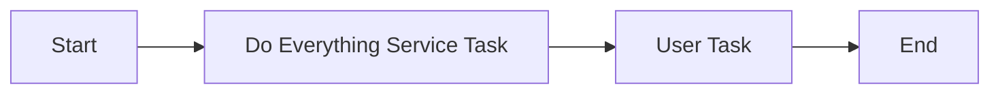

The user task is named `Review`, but actual responsibility is hidden in code:

- calculate assignment,
- validate case,
- decide allowed actions,
- create audit,
- route outcome,
- notify supervisor.

Problem:

- BPMN no longer explains workflow,
- audit reviewers cannot infer why path changed,
- tests become code-only,
- analysts think process is simple while runtime is complex.

Better:

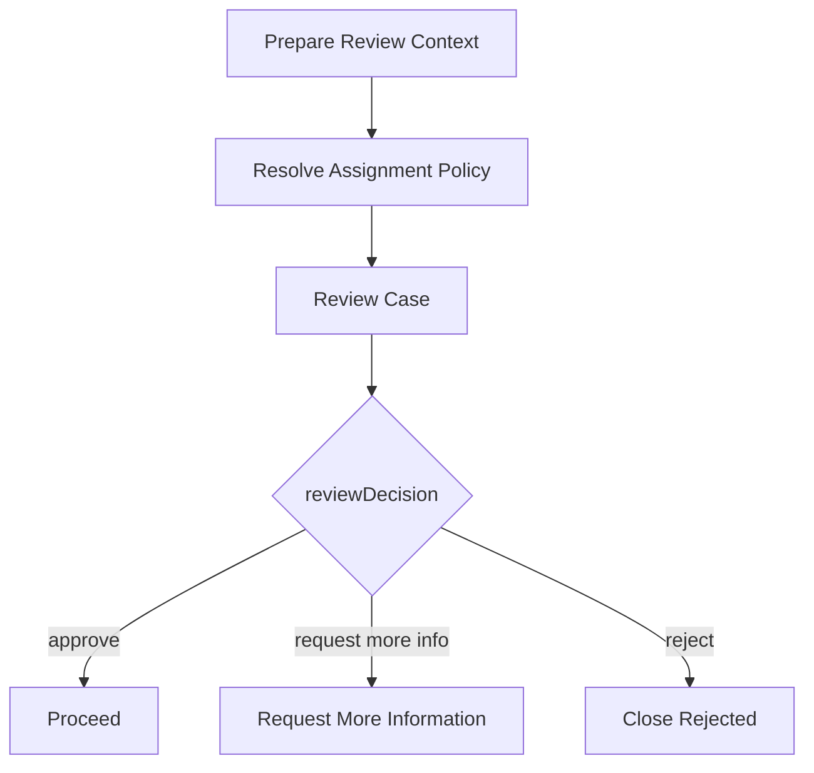

Code implements details. BPMN preserves business semantics.

---

## 15. Anti-Pattern: One Task per Button

Bad:

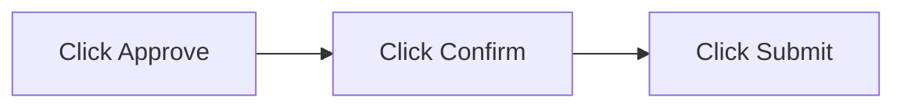

This models UI mechanics, not process responsibilities.

Better:

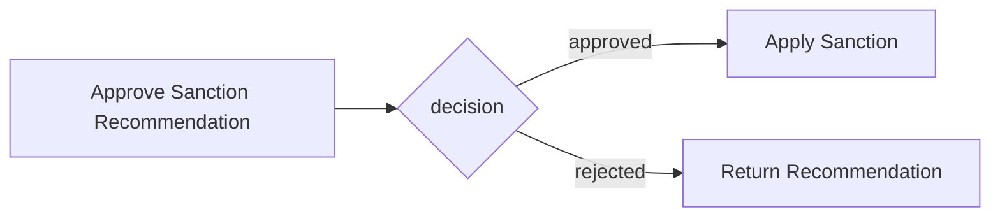

Button clicks are implementation detail. BPMN should model durable business states.

---

## 16. Anti-Pattern: Task Without Exit Contract

A user task with outgoing gateways must define output variables.

Bad:

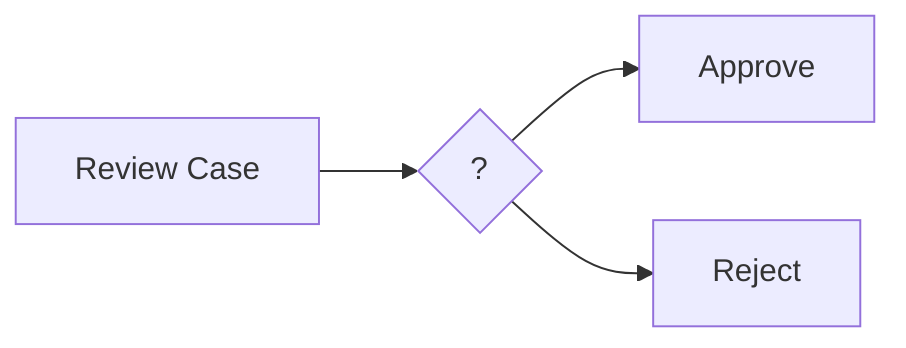

No one knows what expression uses.

Better:

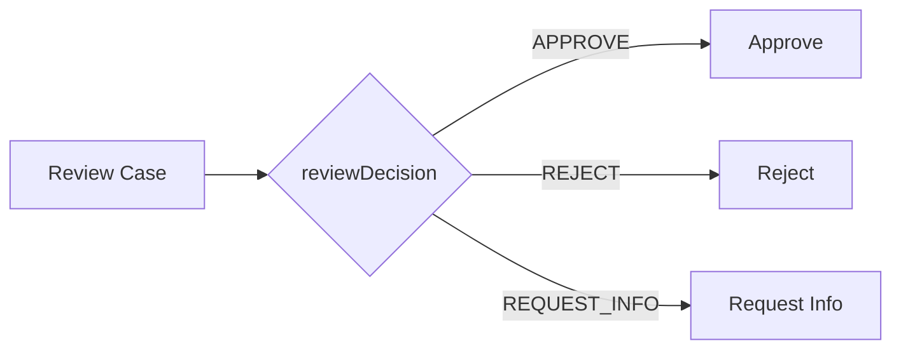

Contract:

```text
reviewDecision is required and must be one of APPROVE, REJECT, REQUEST_INFO.
reviewReason is required when reviewDecision != APPROVE.
```

---

## 17. Anti-Pattern: Task Completion as CRUD Update

Bad:

```java
taskService.complete(taskId, requestBody);
```

This turns the engine into a generic form submission backend.

Better:

```java
@Transactional
public void completeReview(String caseId, CompleteReviewCommand command, UserContext user) {
    Task task = taskGuard.loadAndValidateTask(caseId, command.taskId(), "ReviewCase", user);
    CaseAggregate aggregate = caseRepository.getForUpdate(caseId);

    ReviewDecision decision = reviewPolicy.validate(command, aggregate, user);
    aggregate.recordReview(decision);

    auditLog.append(ReviewCompletedAuditEvent.from(task, aggregate, decision, user));

    taskService.complete(task.getId(), Map.of(
        "reviewDecision", decision.value(),
        "reviewCompletedAt", clock.instant().toString()
    ));
}
```

The completion endpoint is a domain command handler, not a CRUD setter.

---

## 18. Operational Scenarios

### 18.1 Task assigned to wrong user

Questions:

- Was assignment policy wrong or data wrong?
- Has user seen sensitive data?
- Should task be reassigned or cancelled and recreated?
- Should audit show correction?
- Are timers still correct?

Operational response:

1. suspend action if sensitive,
2. inspect assignment variables/policy output,
3. reassign through authorized API/admin tool,
4. append audit event,
5. fix root cause,
6. add regression test.

Do not update `ACT_RU_TASK` directly.

### 18.2 Task stuck overdue

Diagnosis:

- assignee inactive,
- candidate group empty,
- due date wrong,
- timer job failed,
- authorization prevents visibility,
- process is suspended,
- UI filter excludes task.

Runbook should include query by:

- process definition key,
- task definition key,
- assignee,
- candidate group,
- due date,
- process instance business key,
- incident/job state.

### 18.3 Duplicate completion request

Can happen due to:

- double-click,
- frontend retry,
- network timeout,
- mobile client retry,
- concurrent operator action.

Mitigation:

- disable duplicate submit in UI,
- idempotency key at API,
- optimistic locking/domain version,
- handle `Task not found` after successful first completion as idempotent only if audit confirms same command.

---

## 19. Testing Human Workflow

Test bukan hanya delegate. Test task behavior.

### 19.1 Task creation test

Assert:

- process reaches task,
- task definition key correct,
- candidate group correct,
- due date correct,
- expected variables exist,
- form key/form reference correct.

### 19.2 Completion test

Assert:

- invalid decision rejected,
- unauthorized user rejected,
- same maker cannot approve,
- variables after completion correct,
- token moves to correct path,
- audit event written.

### 19.3 SLA test

Assert:

- reminder timer created,
- non-interrupting reminder does not complete/cancel task,
- escalation path runs after threshold,
- interrupting timeout cancels task if modeled so.

### 19.4 Reassignment/delegation test

Assert:

- reassignment changes assignee,
- delegation preserves owner semantics,
- completion by delegated user not allowed until resolved if policy says so,
- audit captures action.

---

## 20. Design Checklist for Every User Task

Sebelum menganggap user task production-ready, jawab checklist ini:

### Semantics

- Apa responsibility task ini?
- Apakah namanya merepresentasikan keputusan/kerja manusia, bukan UI action?
- Apa input user?
- Apa output user?
- Apa allowed decisions?
- Apa invariant setelah task complete?

### Assignment

- Siapa candidate user/group?
- Apakah assignee langsung diperlukan?
- Bagaimana policy assignment diuji?
- Apa yang terjadi jika user/group tidak ada?
- Apa yang terjadi jika assignee cuti/inactive?

### Authorization

- Siapa boleh melihat task?
- Siapa boleh claim?
- Siapa boleh complete?
- Apakah maker-checker/conflict rule divalidasi backend?
- Apakah tenant/jurisdiction dibatasi?

### Data

- Variable apa yang harus global?
- Variable apa yang task-local?
- Data besar disimpan di mana?
- Apakah snapshot audit diperlukan?
- Apakah sensitive data termask/filter?

### SLA

- Due date dihitung dari apa?
- Reminder perlu atau tidak?
- Escalation perlu atau tidak?
- Timer interrupting atau non-interrupting?
- Apakah business calendar diperlukan?

### Operations

- Bagaimana reassign task?
- Bagaimana recover stuck task?
- Bagaimana audit admin override?
- Bagaimana query task per business key?
- Bagaimana handle duplicate submit?

---

## 21. Practical Exercise

Buat BPMN kecil untuk proses berikut:

```text
A case is submitted by an investigator.
A reviewer from compliance-reviewer group must review it within 2 days.
If not reviewed after 1 day, send reminder.
If not reviewed after 2 days, add senior-reviewer as candidate group and notify supervisor.
The reviewer can approve, reject, or request more info.
The reviewer cannot be the investigator.
A rejection requires reason.
```

Deliverables:

1. BPMN model dengan user task, non-interrupting timers, dan decision gateway.
2. Variable contract.
3. Assignment policy.
4. Completion API pseudo-code.
5. Audit event schema.
6. Test matrix.

Target self-correction:

- Jika timer reminder membatalkan task, model salah.
- Jika maker-checker hanya dicegah di UI, desain belum aman.
- Jika review reason tidak diwajibkan untuk reject, exit contract belum lengkap.
- Jika task complete langsung menerima map bebas dari request body, command boundary belum matang.

---

## 22. Summary

User task adalah titik temu antara process engine dan manusia. Di Camunda 7, user task harus direasoning sebagai durable wait state dengan lifecycle, assignment, authorization, form contract, variable scope, SLA, audit, dan recovery model.

Top engineer tidak hanya bertanya “bagaimana membuat task muncul di Tasklist?”. Pertanyaan yang benar:

```text
What business responsibility does this task represent, who may perform it, what evidence supports the decision, how does completion move the process, and how can operations safely repair it?
```

Jika pertanyaan itu bisa dijawab dengan jelas, user task Anda bukan lagi sekadar node BPMN. Ia menjadi bagian defensible dari workflow platform.

---

## References

- Camunda 7.24 Docs — User Task: https://docs.camunda.org/manual/7.24/reference/bpmn20/tasks/user-task/
- Camunda 7.24 Docs — Task Forms: https://docs.camunda.org/manual/7.24/user-guide/task-forms/
- Camunda 7.24 Docs — Delegation Code / Task Listener: https://docs.camunda.org/manual/7.24/user-guide/process-engine/delegation-code/
- Camunda 7.24 Docs — Tasklist User Assignment and Task Lifecycle: https://docs.camunda.org/manual/7.24/webapps/tasklist/
- Camunda 7.24 Docs — Process Variables: https://docs.camunda.org/manual/7.24/user-guide/process-engine/variables/
