------
title: Learn Java BPMN with Camunda BPM Platform 7 - Part 008
description: Advanced Camunda 7 subprocess and call activity engineering: embedded subprocess, event subprocess, transaction subprocess, reusable process modules, version binding, variable mapping, lifecycle coupling, and modular workflow anti-patterns.
series: learn-java-bpmn-camunda7
seriesTitle: Learn Java BPMN with Camunda BPM Platform 7
order: 8
partTitle: Subprocess, Call Activity, and Process Modularization
tags:
- java
- bpmn
- camunda
- camunda-7
- workflow
- subprocess
- call-activity
- modularization
- process-versioning
- series
date: 2026-06-27
------

# Part 008 — Subprocess, Call Activity, and Process Modularization

Part ini membahas cara memecah proses di Camunda 7 tanpa membuat workflow menjadi fragile. Subprocess dan call activity adalah alat modularisasi, tetapi keduanya sering disalahgunakan. Model bisa terlihat rapi di diagram, namun runtime-nya sulit dimigrasi, sulit dites, coupling variable kacau, atau parent-child lifecycle tidak jelas.

> Mental model utama: subprocess dan call activity bukan hanya “cara merapikan gambar”. Keduanya adalah **scope runtime** yang mempengaruhi token, variable visibility, event handling, transaction boundary, versioning, dan ownership proses.

---

## 1. Kaufman Skill Deconstruction

Untuk menguasai modular process design, pecah skill menjadi sub-skill berikut:

| Sub-skill | Yang harus bisa dilakukan | Failure signal |
|---|---|---|
| Memilih modularization primitive | Memilih embedded subprocess, event subprocess, call activity, atau plain task | Semua complexity dipindah ke subprocess tanpa alasan runtime |
| Scope reasoning | Menjelaskan variable scope dan boundary event scope | Variable bocor dari child ke parent atau sebaliknya |
| Lifecycle coupling | Menjelaskan apakah child dibatalkan saat parent dibatalkan | Parent selesai tetapi child masih hidup tanpa ownership jelas |
| Version binding | Memilih latest, deployment, version, atau versionTag bila relevan | Running instance tiba-tiba memakai child process versi baru |
| Input/output mapping | Membatasi kontrak data antar module proses | Semua variables dipropagasikan tanpa kontrol |
| Reuse governance | Menentukan kapan proses boleh reusable | Reusable process menjadi god module |
| Migration strategy | Menilai dampak perubahan subprocess/call activity pada running instances | Hotfix model gagal karena mapping tidak kompatibel |

Kaufman framing: jangan mulai dari “subprocess mana yang tersedia?”. Mulai dari pertanyaan: **scope apa yang perlu dilindungi, lifecycle apa yang harus dipisahkan, dan kontrak data apa yang harus eksplisit?**

---

## 2. Modularization Options in BPMN/Camunda 7

Camunda 7 mendukung beberapa bentuk modularisasi BPMN:

| Primitive | Runtime meaning | Cocok untuk | Hindari jika |
|---|---|---|---|
| Embedded subprocess | Scope lokal di proses yang sama | Grouping, local exception/event boundary, transactional visual block | Butuh reuse lintas proses |
| Event subprocess | Scoped handler untuk event yang terjadi selama scope aktif | Timeout, cancellation, signal/message/error handling cross-cutting | Hanya ingin merapikan layout |
| Transaction subprocess | BPMN transaction semantics + cancel/compensation modeling | Business transaction conceptual pattern | Dianggap sama dengan DB transaction |
| Call activity | Memanggil process definition lain | Reuse, independent versioning, parent-child process module | Child tidak punya ownership/contract jelas |
| Expanded/collapsed subprocess notation | Visual representation | Readability | Dipakai untuk menyembunyikan complexity buruk |

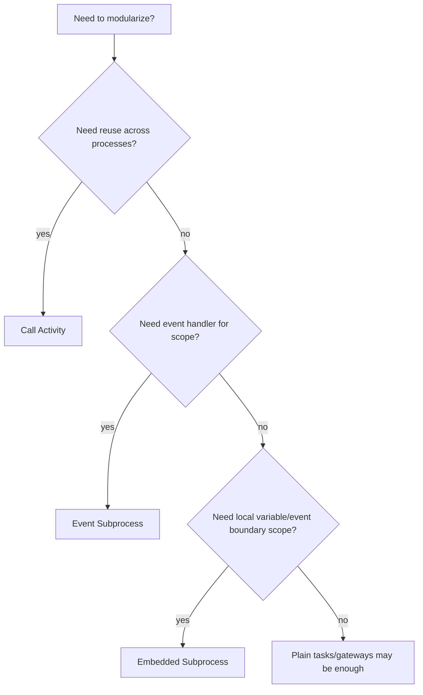

---

## 3. Embedded Subprocess

Embedded subprocess adalah bagian dari process definition yang sama. Ia membuat scope lokal, tetapi tidak menjadi process definition terpisah.

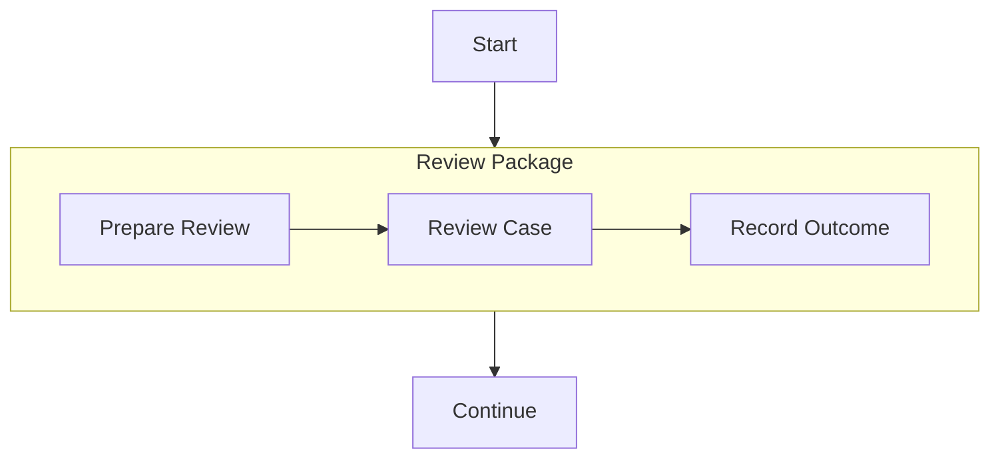

### 3.1 Kapan memakai embedded subprocess

Gunakan embedded subprocess ketika Anda perlu:

- mengelompokkan beberapa activity yang membentuk satu phase,
- menempelkan boundary event ke sekelompok activity,
- membatasi variable lokal,
- membuat diagram lebih readable tanpa memisahkan deployment/version,
- menerapkan timeout/cancellation untuk satu scope lokal,
- mengurangi visual noise pada proses utama.

Contoh bagus:

```text
Investigation Phase contains Assign Investigator, Collect Evidence, Submit Finding.
A boundary timer on the phase escalates if investigation exceeds 10 days.
```

### 3.2 Embedded subprocess as scope

Subprocess membentuk scope. Boundary event pada subprocess berlaku untuk semua activity di dalam scope.

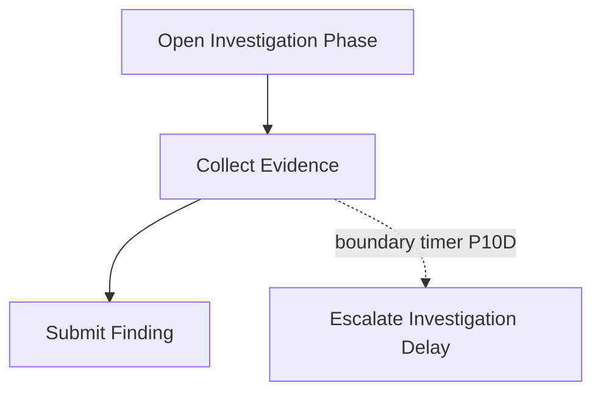

Jika timer interrupting ditempel pada subprocess, semua activity di dalam subprocess dibatalkan saat timer fire.

### 3.3 Embedded subprocess is not reuse

Embedded subprocess tidak reusable oleh process lain. Jika logic harus dipanggil oleh banyak process dengan lifecycle dan versioning sendiri, gunakan call activity.

Anti-pattern:

```text
Copy-paste embedded subprocess ReviewCustomerRisk into 12 BPMN files.
```

Ini menciptakan 12 versi logic visual yang akan drift.

---

## 4. Event Subprocess

Event subprocess adalah subprocess khusus yang dipicu oleh event. Ia berada di dalam scope process/subprocess dan aktif selama parent scope aktif.

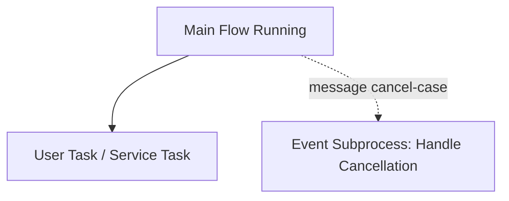

Event subprocess cocok untuk cross-cutting event yang bisa terjadi saat process berada di banyak titik.

### 4.1 Interrupting event subprocess

Interrupting event subprocess membatalkan execution yang aktif di scope parent.

Use case:

```text
Case receives official withdrawal request.
All active review tasks must be cancelled and process moves to close-withdrawn path.
```

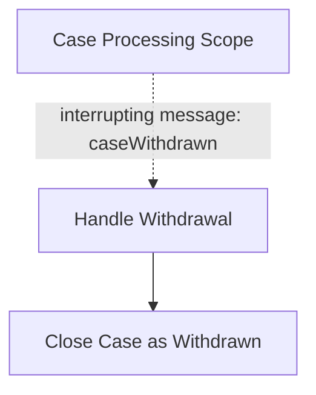

### 4.2 Non-interrupting event subprocess

Non-interrupting event subprocess menjalankan flow tambahan tanpa membatalkan flow utama.

Use case:

```text
New evidence arrives while case is under review.
Main review remains active, but system records evidence and notifies reviewer.
```

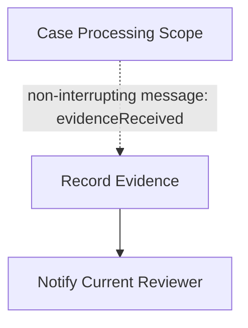

### 4.3 Event subprocess vs boundary event

| Need | Better fit |
|---|---|
| Event applies to one activity | Boundary event on activity |
| Event applies to a phase | Boundary event on embedded subprocess |
| Event applies across whole process | Event subprocess at process scope |
| Event should be handled without spaghetti boundary copies | Event subprocess |

Anti-pattern:

```text
Same cancellation boundary message copied to 20 user tasks.
```

Better:

```text
One interrupting event subprocess at scope where cancellation is meaningful.
```

---

## 5. Call Activity

Call activity memanggil process definition lain. Ketika token mencapai call activity, engine membuat child process instance berdasarkan referenced process definition.

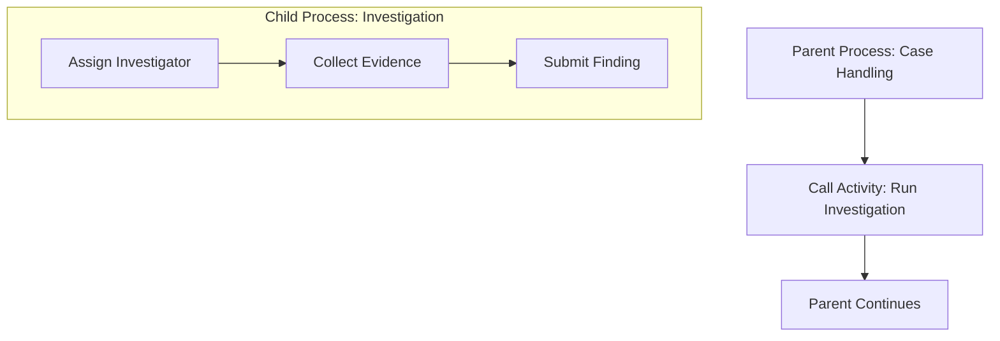

Call activity adalah boundary arsitektural, bukan sekadar visual grouping.

### 5.1 Kapan memakai call activity

Gunakan call activity ketika child flow:

- reused oleh banyak process,
- punya lifecycle/versioning yang berbeda,
- punya owner/team berbeda,
- cukup kompleks untuk dites/deploy sebagai module,
- perlu child process instance yang bisa diinspeksi sendiri,
- punya history/audit trace sendiri,
- punya migration path berbeda.

Contoh bagus:

```text
PerformSanctionScreening is used by onboarding, case review, and periodic monitoring processes.
It is owned by Compliance Platform team and versioned separately.
```

### 5.2 Kapan tidak memakai call activity

Jangan pakai call activity hanya untuk:

- membuat diagram parent terlihat pendek,
- menyembunyikan logic yang belum dipahami,
- menghindari gateway di parent,
- mengakali modeler layout,
- memindahkan complexity tanpa kontrak.

Jika child tidak punya independent meaning, embedded subprocess lebih cocok.

---

## 6. Embedded Subprocess vs Call Activity

| Dimension | Embedded subprocess | Call activity |
|---|---|---|
| Definition | Bagian dari process yang sama | Process definition terpisah |
| Runtime instance | Satu process instance | Parent + child process instance |
| Versioning | Sama dengan parent | Bisa binding ke version berbeda |
| Reuse | Tidak reusable lintas definition | Reusable |
| Variable contract | Lebih longgar, satu model | Harus eksplisit input/output |
| Migration | Parent migration cukup, tetapi internal changes tetap berdampak | Parent dan child migration bisa terpisah |
| Ownership | Sama dengan parent | Bisa beda team/domain |
| Operational inspection | Dalam instance parent | Child instance bisa dipantau sendiri |
| Coupling | Tighter | Looser jika mapping benar |

Decision rule:

```text
Use embedded subprocess for local structure.
Use call activity for reusable process contract.
```

---

## 7. Call Activity Version Binding

Salah satu aspek paling penting dari call activity adalah binding ke process definition yang dipanggil.

Camunda call activity mendukung konsep called element dan binding. Secara praktis, Anda harus memilih apakah parent selalu memanggil child latest, child yang deployment-nya sama, child versi tertentu, atau binding lain yang tersedia pada versi Camunda yang dipakai.

| Binding mindset | Meaning | Kapan dipakai | Risiko |
|---|---|---|---|
| Latest | Selalu panggil versi terbaru child process | Development, child backward compatible kuat | Parent lama bisa tiba-tiba memakai behavior baru |
| Deployment | Panggil child dari deployment yang sama | Parent-child dirilis bersama | Butuh discipline deployment package |
| Version | Panggil version number tertentu | Change control ketat | Upgrade perlu ubah parent model |
| Version tag | Panggil by semantic tag jika tersedia | Release governance dengan tag | Butuh naming dan deployment discipline |

### 7.1 The hidden danger of latest

`latest` terlihat praktis, tetapi bisa menciptakan runtime surprise:

```text
Parent v3 was tested with Child v5.
Child v6 is deployed with changed output variable.
New Parent v3 instances now call Child v6 and fail after call activity.
```

Jika child contract benar-benar backward compatible, latest bisa diterima. Jika tidak, gunakan deployment/version/tag strategy.

### 7.2 Deployment binding for release unit

Jika parent dan child harus selalu dirilis bersama, deployment binding lebih aman.

```text
Release package R-2026-06 contains Parent v12 and Child v7.
Parent call activity resolves child from same deployment.
```

Cocok untuk:

- monorepo process application,
- tightly coupled parent-child model,
- test suite yang menjalankan package sebagai satu unit,
- regulated release approval.

### 7.3 Version binding for strict control

Version binding cocok jika:

- child process punya breaking change,
- parent harus disertifikasi terhadap exact child version,
- audit butuh evidence exact behavior,
- migration harus staged.

Trade-off: menaikkan child version butuh update parent model atau deployment strategy.

---

## 8. Input/Output Mapping

Call activity harus diperlakukan seperti function call atau service boundary. Jangan biarkan semua variable otomatis bocor tanpa pertimbangan.

### 8.1 Bad variable contract

```text
Parent passes all variables to child.
Child writes arbitrary variables back to parent.
```

Risiko:

- accidental overwrite,
- coupling tidak terlihat,
- child bergantung pada variable parent yang tidak terdokumentasi,
- migration menjadi sulit,
- sensitive data bocor,
- testing child standalone sulit.

### 8.2 Explicit mapping

Contoh konsep:

```xml
<bpmn:callActivity id="RunInvestigation" calledElement="investigationProcess">
  <bpmn:extensionElements>
    <camunda:in source="caseId" target="caseId" />
    <camunda:in source="jurisdiction" target="jurisdiction" />
    <camunda:out source="investigationOutcome" target="investigationOutcome" />
    <camunda:out source="findingId" target="findingId" />
  </bpmn:extensionElements>
</bpmn:callActivity>
```

Kontrak:

```text
Input:
- caseId: required string
- jurisdiction: required string

Output:
- investigationOutcome: SUBSTANTIATED | UNSUBSTANTIATED | INCONCLUSIVE
- findingId: required if investigationOutcome != INCONCLUSIVE
```

### 8.3 Mapping all variables

Camunda supports patterns that can map variables broadly, but broad mapping should be conscious.

Use broad mapping only when:

- parent-child are same bounded context,
- child is not truly reusable,
- data sensitivity is low,
- contract is still documented,
- tests catch accidental overwrite.

Otherwise, prefer explicit mapping.

---

## 9. Variable Scope and Locality

Subprocess introduces variable scope. Call activity introduces child process scope. Variable reasoning must be deliberate.

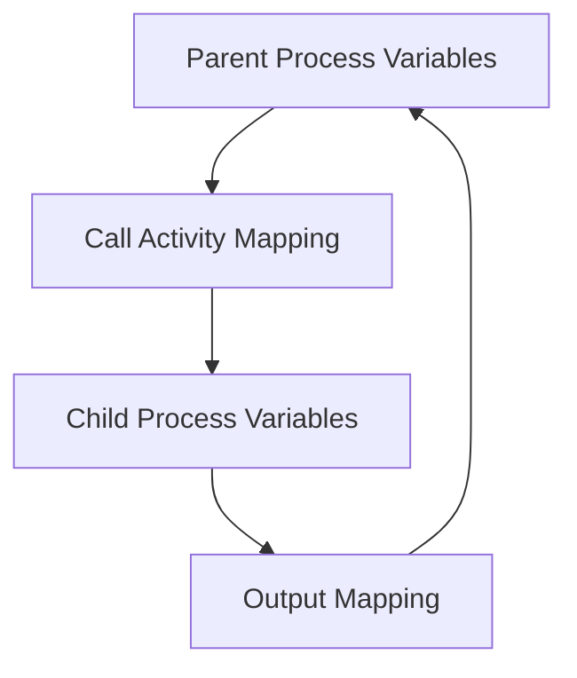

### 9.1 Parent variables

Parent variables should contain orchestration state:

- case id,
- routing decisions,
- current phase result,
- correlation keys,
- summary outcome.

### 9.2 Child variables

Child variables should contain implementation state of child process:

- internal task outcomes,
- temporary branch decisions,
- worker response details,
- child-specific SLA,
- child-local audit context.

### 9.3 Output variables

Output variables should be minimal and semantic:

```text
Good:
- screeningResult = CLEAR | HIT | INCONCLUSIVE
- screeningReportId = SCR-123

Bad:
- taskFormField17 = true
- responseBody = { huge external API payload }
```

---

## 10. Lifecycle Coupling

When a parent process waits at a call activity, child process execution determines when parent continues.

Questions:

- What happens if parent is cancelled?
- What happens if child fails?
- What happens if child incident occurs?
- Can child be manually completed/modified?
- Can child outlive parent?
- Does child have its own business key?
- How do operators find child from parent and parent from child?

### 10.1 Parent cancellation

If parent is cancelled while waiting at call activity, child lifecycle must be understood and tested. In many designs, child should be cancelled with parent. But sometimes child represents an independent business obligation and should not be silently cancelled.

Example:

```text
Parent case is closed, but regulatory notification child process must still send legally required notice.
```

In that case, maybe call activity is not the right coupling. Consider event-driven handoff.

### 10.2 Child incident

If child process fails, parent remains waiting at call activity until child completes or is repaired/cancelled.

Operational implication:

- Cockpit/support must inspect child incidents,
- parent SLA may be affected,
- incident owner may be child team,
- parent runbook must point to child runbook.

### 10.3 Business key propagation

Consider propagating business key or equivalent reference to child.

```text
Parent businessKey = CASE-2026-000123
Child businessKey = CASE-2026-000123:INVESTIGATION
```

This improves searchability and support diagnostics.

---

## 11. Subprocess Boundary Events

Boundary events on subprocess are powerful because they apply to the whole scope.

### 11.1 Timeout phase

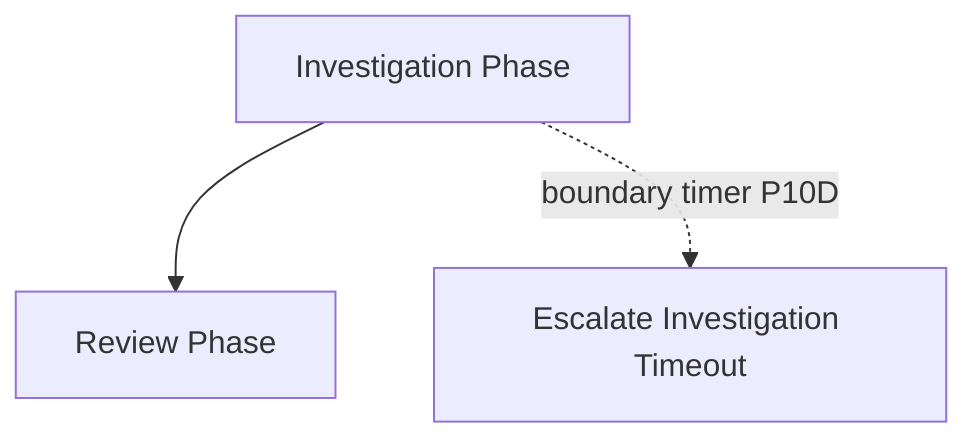

If timer is interrupting, all active work inside Investigation Phase is cancelled. If non-interrupting, escalation happens while work continues.

### 11.2 Error handling scope

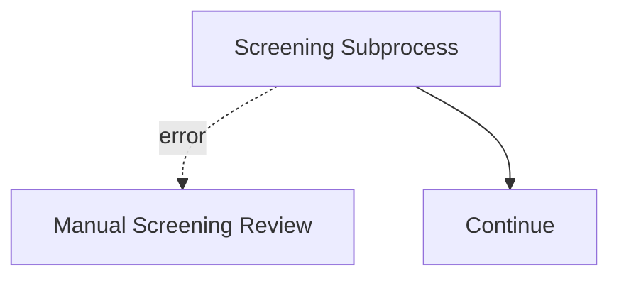

This is useful when several internal service tasks can throw same BPMN business error and you want one handler for the phase.

### 11.3 Message cancellation

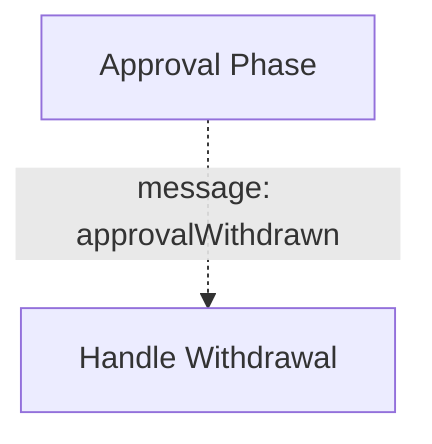

Applies when external message can cancel a whole phase.

---

## 12. Reusable Process Module Design

A reusable child process should have a module contract.

```text
Module: Sanction Screening
Owner: Compliance Platform
Process key: sanctionScreening
Inputs:
  - subjectId: string, required
  - caseId: string, required
  - screeningProfile: STANDARD | ENHANCED
Outputs:
  - screeningResult: CLEAR | POTENTIAL_HIT | CONFIRMED_HIT | INCONCLUSIVE
  - reportId: string
Failure behavior:
  - technical failures become incidents/retries
  - inconclusive screening is business output, not incident
SLA:
  - automated screening under 5 minutes
  - manual review under 2 business days
Versioning:
  - backward-compatible output contract for minor changes
  - breaking changes require new process key or version binding update
```

### 12.1 Process module resembles API design

Treat child process like an API:

- stable input contract,
- stable output contract,
- semantic versioning mindset,
- compatibility tests,
- owner and support channel,
- runbook,
- observability.

### 12.2 Do not create god module

Bad reusable process:

```text
commonReviewProcess handles legal review, compliance review, operational review, fraud review, evidence collection, approval, notification, and closure.
```

This becomes a distributed god object in BPMN form.

Better:

- `legalReviewProcess`,
- `complianceReviewProcess`,
- `sanctionScreeningProcess`,
- `evidenceCollectionProcess`,
- `notificationProcess` only if it has workflow semantics.

---

## 13. Multi-Instance with Subprocess and Call Activity

Multi-instance can apply to subprocess or call activity. It creates repeated executions for each item.

Use cases:

- review by multiple departments,
- screening multiple subjects,
- collecting evidence from multiple agencies,
- notifying multiple parties,
- running checks for multiple products.

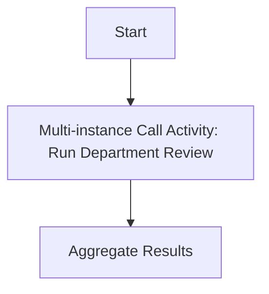

### 13.1 Sequential vs parallel

| Mode | Meaning | Use when |
|---|---|---|
| Sequential | One instance after another | Order matters, rate limiting, shared resource |
| Parallel | Many instances concurrently | Independent work, faster completion |

### 13.2 Completion condition

Example:

```text
Stop after first rejection.
Continue until all approvals.
Continue until at least 2 of 3 reviewers approve.
```

Be explicit. Multi-instance without completion semantics can create unnecessary work or wrong business behavior.

### 13.3 Parallel multi-instance risks

- explosion of jobs/tasks,
- optimistic locking around joins,
- huge variable payloads,
- race in aggregation,
- cancellation handling after early completion,
- child process version consistency.

For high volume, consider batching and worker throughput strategy.

---

## 14. Process Versioning and Migration Impact

Subprocess/call activity decisions affect migration.

### 14.1 Embedded subprocess change

Changing embedded subprocess changes parent process definition. Running instances may need migration if they are inside or around changed activities.

Risk examples:

- activity id changed,
- subprocess id changed,
- boundary event added/removed,
- gateway structure changed,
- variable expected by new path missing.

Rule: **never rename BPMN ids casually**. Names are display labels; ids are runtime anchors.

### 14.2 Call activity child change

Changing child process may or may not require parent change depending on binding and compatibility.

| Change | Compatibility risk |
|---|---|
| Add internal task, same output | Low if SLA acceptable |
| Rename output variable | High |
| Change business meaning of output enum | High |
| Add new output enum value | Medium-high; parent gateways may not handle it |
| Change process key | Breaking |
| Change version binding strategy | Requires parent testing |

### 14.3 Migration-aware modeling

Design for future migration:

- stable activity ids,
- explicit variable contracts,
- avoid giant all-variable mappings,
- keep child output backward compatible,
- write migration tests,
- version business rules deliberately,
- document parent-child dependency matrix.

---

## 15. Error Handling Across Modular Boundaries

A child process can fail technically or produce a business outcome.

### 15.1 Business outcome

```text
Screening result = INCONCLUSIVE
```

This should usually be modeled as output variable and gateway path, not incident.

### 15.2 BPMN error

Use BPMN error when child needs to throw a business error caught by parent call activity boundary event.

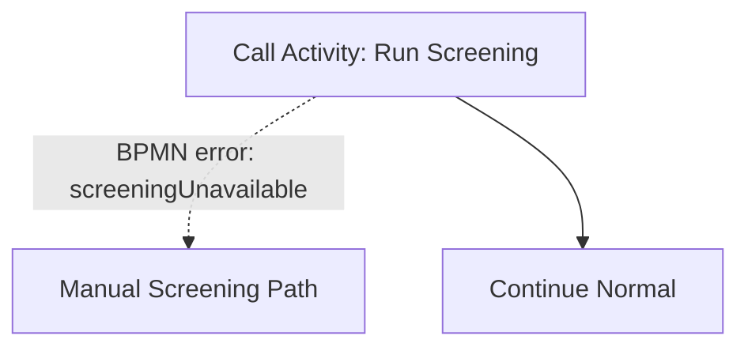

This is appropriate if parent has explicit recovery path.

### 15.3 Technical exception

Technical failures should normally create retries/incidents in service tasks/jobs inside child. Do not convert every exception into BPMN error.

Bad:

```text
HTTP 500 from screening provider -> BPMN error -> business manual path.
```

Better:

```text
HTTP 500 -> retry according to technical policy -> incident if exhausted.
Business provider says subject cannot be screened -> business output or BPMN error if parent must catch it.
```

---

## 16. Transaction Subprocess and Compensation Warning

BPMN transaction subprocess is frequently misunderstood. It is not the same as a database transaction.

In long-running workflow, “transaction” means business transaction scope, with compensation/cancel semantics. Database transaction lasts milliseconds/seconds; business process lasts minutes/days.

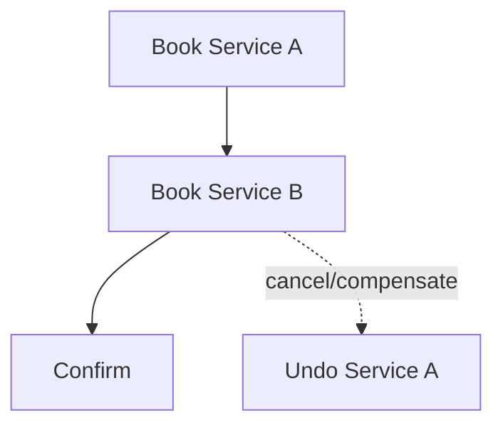

Use compensation when:

- work already committed externally,
- rollback is semantic, not technical,
- undo may fail and needs handling,
- audit must show reversal.

Do not expect Camunda to magically rollback already committed remote side effects.

---

## 17. Anti-Pattern: One Giant Process Model

Symptoms:

- one BPMN with hundreds of nodes,
- every business variation in one diagram,
- nested gateways unreadable,
- no clear phases,
- teams afraid to change any part,
- tests are impossible to scope.

Refactoring approach:

1. identify stable phases,
2. extract local complexity into embedded subprocess,
3. extract reusable domain workflow into call activity,
4. define input/output contracts,
5. preserve BPMN ids when possible,
6. add regression tests before migration.

---

## 18. Anti-Pattern: Call Activity Without Contract

Bad:

```xml
<bpmn:callActivity id="DoChildStuff" calledElement="childProcess" />
```

No documented input. No output. No versioning. No owner.

Operational result:

- parent fails after child changes,
- child team breaks parent unknowingly,
- support cannot know which variables matter,
- data leaks across contexts.

Better:

```text
Call Activity: Run Investigation
Owner: Investigations Team
Binding: deployment
Input mapping: caseId, jurisdiction, priority
Output mapping: investigationOutcome, findingId
SLA: 10 business days
Error contract: investigationCancelled, investigationNotPermitted
```

---

## 19. Anti-Pattern: Reuse by Copy-Paste

Copy-paste is tempting because BPMN XML is easy to duplicate. But duplicated subprocess logic creates hidden divergence.

Failure pattern:

```text
Process A and Process B both copied sanction screening subprocess.
A changed provider timeout to 30s.
B still uses 5s.
A added new INCONCLUSIVE path.
B does not handle it.
Operational team assumes both are same.
```

If logic must be same, make it a call activity or shared domain service. If logic is intentionally different, name it differently and document difference.

---

## 20. Anti-Pattern: Over-Modularization

Not every group of tasks needs subprocess or call activity.

Over-modularization symptoms:

- parent diagram becomes a chain of vague boxes,
- every box requires click-through,
- business flow unreadable without opening 12 diagrams,
- variables cross boundaries constantly,
- simple changes require touching many files,
- support cannot see where token is semantically.

Good modularization reduces cognitive load. Bad modularization hides it.

Rule:

```text
A module must have a name, responsibility, boundary, contract, and owner.
If it has none, it is only a folder disguised as BPMN.
```

---

## 21. Case Management Example: Enforcement Lifecycle

Suppose we model regulatory enforcement lifecycle:

```text
Open case -> Triage -> Investigation -> Legal review -> Enforcement decision -> Notification -> Closure
```

A good modular design:

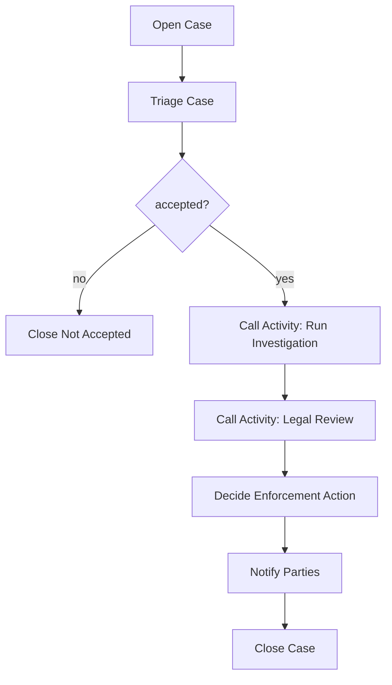

### 21.1 Why investigation is call activity

Investigation might be call activity because:

- it is complex,
- it may be reused by multiple enforcement process types,
- it has separate SLA,
- investigation team owns it,
- it produces clear output: finding,
- it has its own human tasks and evidence flow.

### 21.2 Why triage might stay embedded/simple

Triage may be simple and parent-specific:

- first reviewer checks completeness,
- route accepted/rejected,
- no reuse needed,
- no separate lifecycle.

Use user task + gateway, maybe embedded subprocess only if triage has multiple internal steps.

### 21.3 Why notification may not be call activity

If notification is just send email/letter, service task may suffice. Make it call activity only if notification has durable workflow semantics:

- multiple parties,
- delivery confirmation,
- retry/escalation,
- manual correction,
- legal deadline,
- audit package.

---

## 22. Testing Modular Processes

### 22.1 Embedded subprocess tests

Assert:

- token enters subprocess,
- boundary events apply to all inner activities,
- local variables do not leak unintentionally,
- timeout/cancellation behavior correct,
- activity ids stable.

### 22.2 Call activity tests

Assert:

- parent starts correct child definition,
- binding strategy works,
- input variables mapped correctly,
- child output maps back correctly,
- parent handles all child output enum values,
- child incident keeps parent waiting as expected,
- cancellation behavior tested.

### 22.3 Contract test for child process

For reusable child process, write contract tests:

```text
Given valid input caseId and screeningProfile
When child process completes with CLEAR
Then output screeningResult is CLEAR and reportId is present
```

Also negative tests:

```text
Given missing subjectId
When child starts
Then it fails fast with explicit validation incident or business error according to contract
```

### 22.4 Parent-child compatibility test

Before deploying child change, run parent compatibility suite:

- parent vN with child old,
- parent vN with child new if binding latest,
- parent vN+1 with child new,
- migration scenario if running instances exist.

---

## 23. Operational Playbook

### 23.1 Parent waiting at call activity too long

Diagnosis:

- child active user task overdue,
- child service task incident,
- child timer waiting,
- child process suspended,
- child deadlocked at gateway,
- output mapping failed at completion,
- parent incident created after child completion.

Runbook:

1. locate parent by business key,
2. find called process instance,
3. inspect child activity tree,
4. inspect incidents/jobs/tasks,
5. repair child if needed,
6. verify output mapping,
7. let parent continue normally.

### 23.2 Child completed but parent did not continue

Possible causes:

- output mapping expression failed,
- parent transaction failed after child end,
- optimistic locking conflict,
- incident on parent job,
- child not actually linked to expected parent,
- async boundary pending job not acquired.

### 23.3 Wrong child version called

Possible causes:

- binding `latest`,
- deployment package missing child model,
- tenant mismatch,
- process key collision,
- version tag mismatch,
- deployment cache confusion after rolling update.

Repair:

- do not mutate DB,
- inspect deployment and definition versions,
- decide whether to migrate/modify instance,
- patch binding strategy,
- add test that asserts called process definition.

---

## 24. Design Checklist

### For embedded subprocess

- Apa phase/responsibility yang direpresentasikan?
- Apakah boundary event di subprocess memang berlaku untuk semua child activity?
- Apakah variable lokal perlu?
- Apakah diagram lebih readable setelah grouping?
- Apakah ada risiko menyembunyikan complexity?
- Apakah activity ids stabil?

### For event subprocess

- Event apa yang memicu?
- Scope mana yang harus aktif agar event valid?
- Interrupting atau non-interrupting?
- Apakah event berlaku untuk seluruh process atau phase tertentu?
- Apakah duplicate/late event ditangani?
- Apakah audit menjelaskan interrupt/cancellation?

### For call activity

- Apa process key child?
- Siapa owner child?
- Binding apa yang dipakai?
- Input variables apa yang wajib?
- Output variables apa yang dijamin?
- Apa error contract?
- Apakah business key dipropagasikan?
- Apakah child bisa dioperasikan dan dimonitor sendiri?
- Apa migration strategy?

---

## 25. Practical Exercise

Refactor proses berikut:

```text
Case handling process has 60 nodes.
It contains triage, investigation, legal review, sanction screening, approval, notification, and closure.
Sanction screening is copied in three other processes.
Investigation has its own team and SLA.
Legal review can be triggered by multiple parent processes.
Notification is a simple email today but may become legally tracked delivery later.
```

Deliverables:

1. Tentukan mana yang tetap di parent, mana embedded subprocess, mana call activity.
2. Buat parent BPMN high-level dengan Mermaid.
3. Definisikan contract untuk `RunInvestigation` dan `RunLegalReview`.
4. Pilih binding strategy untuk tiap call activity.
5. Buat variable input/output mapping.
6. Tulis 10 risiko migration.
7. Tulis test matrix parent-child compatibility.

Target self-correction:

- Jika semua dipindah ke call activity, kemungkinan over-modularization.
- Jika semua tetap di satu process, kemungkinan god process.
- Jika call activity tidak punya output contract, modularization belum matang.
- Jika binding latest dipilih tanpa compatibility guarantee, version strategy rapuh.

---

## 26. Summary

Subprocess dan call activity adalah alat untuk mengatur scope dan modularitas proses, bukan sekadar alat merapikan diagram.

Gunakan prinsip berikut:

```text
Embedded subprocess = local scope.
Event subprocess = scoped event handler.
Call activity = reusable process contract.
Transaction subprocess = business transaction/compensation concept, not DB transaction.
```

Top engineer tidak bertanya “bagaimana cara membuat diagram lebih pendek?”. Pertanyaan yang benar:

```text
What boundary does this module create, who owns it, what data crosses it, which version is invoked, how does failure propagate, and how will running instances survive change?
```

Jika pertanyaan itu bisa dijawab, modularisasi proses Anda sudah masuk level production engineering.

---

## References

- Camunda 7.24 Docs — Embedded Subprocess: https://docs.camunda.org/manual/7.24/reference/bpmn20/subprocesses/embedded-subprocess/
- Camunda 7.24 Docs — Event Subprocess: https://docs.camunda.org/manual/7.24/reference/bpmn20/subprocesses/event-subprocess/
- Camunda 7.24 Docs — Call Activity: https://docs.camunda.org/manual/7.24/reference/bpmn20/subprocesses/call-activity/
- Camunda 7.24 Docs — Transaction Subprocess: https://docs.camunda.org/manual/7.24/reference/bpmn20/subprocesses/transaction-subprocess/
- Camunda 7.24 Docs — Process Versioning: https://docs.camunda.org/manual/7.24/user-guide/process-engine/process-versioning/
- Camunda 7.24 Docs — Process Instance Migration: https://docs.camunda.org/manual/7.24/user-guide/process-engine/process-instance-migration/
